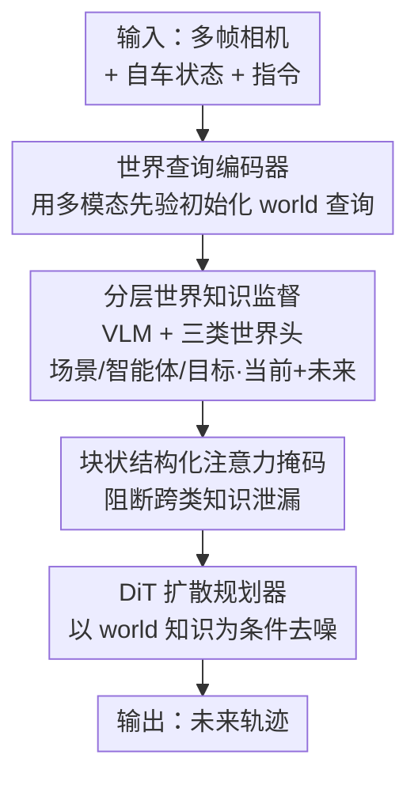

# SGDrive: Scene-to-Goal Hierarchical World Cognition for Autonomous Driving

**会议**: CVPR 2026  
**论文**: [CVF Open Access](https://openaccess.thecvf.com/content/CVPR2026/html/Li_SGDrive_Scene-to-Goal_Hierarchical_World_Cognition_for_Autonomous_Driving_CVPR_2026_paper.html)  
**代码**: https://github.com/LogosRoboticsGroup/SGDrive  
**领域**: 自动驾驶 / 多模态VLM  
**关键词**: 端到端驾驶, 视觉语言模型, 世界知识, 分层认知, 扩散规划

## 一句话总结
SGDrive 给视觉语言模型（VLM）显式注入一套「场景几何—关键智能体—短期目标」的分层世界知识，用一组可训练的 `<world>` 查询去预测当前与未来世界状态，再用 DiT 扩散规划器把这套知识翻译成轨迹，在 NAVSIM 仅相机赛道上拿到 SOTA（PDMS 87.4，加 RL 后 91.1）。

## 研究背景与动机
**领域现状**：端到端（E2E）自动驾驶近年从分模块流水线转向统一规划框架（UniAD、VAD、SparseDrive 等），并开始把 VLM 的先验知识和推理能力接进来做规划（DriveLM、EMMA、ReCogDrive 等），希望缓解模仿学习在长尾场景里缺乏因果推理的问题。

**现有痛点**：VLM 本质上是「通才」模型，训练目标是语义理解，缺三样驾驶刚需的东西——（1）空间感知：它对 3D 几何、深度几乎没有概念；（2）抓重点能力：它倾向于平均地看整个场景，无法挑出真正影响自车的关键交通参与者；（3）未来世界预测：它没有对场景如何演化的时序建模。

**核心矛盾**：通才 VLM 学到的是「语义平面」上的理解，而安全驾驶需要的是「3D 时空结构化」的世界表征——把几何关系、场景上下文、运动模式组织成可供规划用的紧凑形式。直接把 VLM 接上轨迹解码器，等于让一个没有空间结构感的模型去做需要空间结构的活。

**本文目标**：在不抛弃 VLM 强先验的前提下，给它的表征学习强行套上一套「驾驶专用的知识层级」，让它既能表征当前世界、又能外推未来世界状态。

**切入角度**：模仿人类司机的认知顺序——先看整体环境（场景），再盯安全攸关的对象及其行为（智能体），最后定一个短期目标（goal）再执行动作。这个 scene-agent-goal 层级天然就是结构化的时空表征。

**核心 idea**：引入一组 `<world>` 特殊 token，分成场景/智能体/目标三类子查询，用占用、检测、目标回归三种监督逼它学出分层世界知识，再用块状注意力掩码防止三类知识互相污染，最后用 DiT 扩散规划器以这套世界知识为条件生成轨迹。

## 方法详解

### 整体框架
SGDrive 建在一个预训练 VLM（InternVL3-2B，InternViT 视觉编码器 + Qwen2.5 语言模型）之上。输入是多帧前视相机图像 $I_{cam}$、自车状态 $S_{ego}$ 和自然语言指令 $L_{ins}$；输出是未来轨迹。中间的关键是一组 `<world>` 查询：它们先由「世界查询编码器」用自车状态、历史轨迹、视觉特征做先验初始化，然后和文本/视觉嵌入一起送进 VLM，被 VLM 融合成一个紧凑的分层世界表征 $O_{world}$。一组分层世界头 $D$ 从中解码出三类知识——场景几何布局 $w_{geo}$、关键智能体状态 $w_{agt}$、短期目标 $w_{goal}$，并且每类都同时预测当前时刻 $t$ 和未来时刻 $t{+}n$。最后这套 `<world>` 查询直接作为隐条件喂给 DiT 扩散规划器，逐步去噪生成未来航点。

### 关键设计

**1. 分层世界知识监督：用三类显式监督逼 VLM 学出 3D 时空结构**

这是全文核心，直接针对 VLM「缺空间、抓不住重点、不会预测未来」三个痛点。作者把驾驶理解拆成 scene-agent-goal 三层，每层配一种监督：

- **场景几何布局**：用占用（occupancy）监督让模型学整体几何结构，而不是语义分布。数据集没有占用标注时就从点云生成。VLM 输出的 $W_{geo}$ 被当成隐嵌入，过一个标准 VAE 解码器做几何重建。考虑到驾驶场景高度稀疏、负样本多，采用重采样策略，用两个分类损失平衡占用/非占用：$L_{geo}^{t,t+n}=\frac{1}{M}\sum_i \mathrm{CE}(o_i,\hat o_i)+\frac{1}{N}\sum_j \mathrm{BCE}(p_j,\hat p_j)$，其中 $o_i\in\{0,1\}$ 是占用标签、$p_j$ 是重采样候选位置。
- **关键智能体检测**：不是检测场景里所有物体，而是只挑会影响自车的「安全攸关」对象（车、行人、骑车人），依据自车轨迹和前视相机视锥内的可见性来选。对选中的对象用 DETR 式的集合匹配损失（二分图最优匹配 $\hat\sigma$），同时预测当前和未来 $t{+}n$ 的 3D 状态：$L_{agent}=\sum_i [\lambda_{cls}L_{cls}+\mathbb{1}_{c\neq\varnothing}L_{reg}]$，其中分类是交叉熵（$\lambda_{cls}=10$）、回归是 L1，指示项保证只对正匹配算回归。这一步把模型有限的表征容量逼到「最该看的对象」上，更贴近人类驾驶。
- **短期目标预测**：在认知层级顶端，从视觉/文本的整体理解里隐式推出自车意图，预测约未来 4 秒的目标位姿 $\hat p_{goal}$，用一个轻量 MLP 解码、L1 监督 $L_{goal}=\|\hat p_{goal}-p_{goal}\|_1$。注意这个 goal 不是直接条件化在场景/智能体表征上，而是从整体理解里「涌现」出来，从而把高层决策和低层轨迹规划解耦。

三类知识合在一起，给模型同时提供了当前和未来世界状态的先验。

**2. 块状结构化注意力掩码：防止三类世界知识互相污染**

多任务设计里有个隐患——表征污染：如果各类 `<world>` 查询自由地互相 attend（默认因果掩码就是这样，见原文 Figure 3a），信息会跨认知层级泄漏，破坏每类专用表征的纯度。作者把 `<world>` 查询分成五个子查询（前三个编码当前世界知识，后两个负责预测未来状态），用块状结构化掩码（Figure 3b）禁止不同知识类别之间的相互注意力，但允许同类别内的时序注意力（让子查询访问相关历史上下文），同时所有子查询都能自由 cross-attend 视觉/文本主输入去取证据。这样既阻断了跨级泄漏、保持了分层表征的专一性，又不切断每类知识获取必要信息的通路。消融显示：因果注意力会引入跨类噪声，让车「过度保守」（为防潜在碰撞而过度减速）从而降低通行效率；结构化掩码则换来更高 EP 和 PDMS。

**3. DiT 扩散规划器：把世界知识无损翻译成连续轨迹**

驾驶的难点之一是把高层语义推理落到低层连续动作。作者用 DiT 扩散规划器，直接拿 `<world>` 查询当隐条件，避免中间有损表征，让规划器能访问 VLM 的完整世界知识同时降低推理开销。规划器把未来航点序列 $A=(a_1,\dots,a_N)$ 从噪声初始化 $A_T$ 去噪到真值 $A_0$，每步去噪通过 DiT 的交叉注意力注入分层世界知识和自车状态。一个细节是：$A_T$ 不是从纯高斯噪声起步，而是给一个「学习到的先验」（由 `<world>` 查询和历史自车轨迹线性投影得到）加噪 $\epsilon$，把扩散过程锚定在 VLM 的世界理解上。训练用标准 L2 目标 $L_{diff}=\mathbb{E}\|\epsilon-\epsilon_\theta(A_t,t,c)\|_2^2$。

### 损失函数 / 训练策略
两阶段训练。**阶段一（SFT）**：训核心 VLM 同时做 VQA 和世界知识获取，总损失 $L_{Stage1}=L_{text}+L_{occ}^{t,t+n}+\lambda_{agent}L_{agent}^{t,t+n}+L_{goal}$（$\lambda_{agent}=0.1$）。先用 310 万 QA 对做域适应训 1 epoch，再在 8.5 万条轨迹 QA 上微调并训世界知识头 3 epoch。**阶段二**：冻结阶段一的 VLM 当高保真世界模型，只用轨迹扩散损失 $L_{diff}$ 训 DiT 规划器 220 epoch。全部实验在 32 张 H20 上完成。

## 实验关键数据

### 主实验
在 NAVSIM v1 navtest（闭环指标 PDMS，由 NC/DAC/TTC/Comf./EP 组成）上对比。SGDrive-2B 在 SFT 设定下 PDMS 87.4，超过更大的通才 VLM（InternVL3-8B 83.3）和此前最强驾驶 VLM ReCogDrive-8B（86.8）；加 RL 微调（RFT）后达到 91.1，全场最高。值得注意的是仅用相机输入就超过了大多数同时用相机+LiDAR 的端到端方法。

| 设定 | 方法 | 输入 | NC↑ | DAC↑ | TTC↑ | EP↑ | PDMS↑ |
|------|------|------|------|------|------|------|------|
| 端到端 | WoTE | 图+LiDAR | 98.5 | 96.8 | 94.9 | 81.9 | 88.3 |
| SFT | ReCogDrive-8B | 图 | 98.3 | 95.1 | 94.3 | 81.1 | 86.8 |
| SFT | **SGDrive-2B** | 图 | **98.6** | 95.1 | **95.4** | 81.2 | **87.4** |
| RFT | ReCogDrive-2B | 图 | 97.9 | 97.3 | 94.9 | 87.3 | 90.8 |
| RFT | **SGDrive-2B** | 图 | **98.6** | **97.8** | **96.2** | 85.8 | **91.1** |

注：SGDrive 在碰撞相关的 NC、TTC 上拿到最佳，印证「显式预测时空布局+智能体交互+短期目标能提升避撞所需的时空感知」这一核心假设。

### 消融实验
作者从三个角度拆解：当前/未来世界知识、三类子查询、注意力掩码。

| 实验 | 配置 | PDMS↑ | 说明 |
|------|------|-------|------|
| 阶段一(a) | 仅 base，无世界知识 | 82.2 | 起点 |
| 阶段一(b) | + 当前世界表征 | 84.7 | 激活 3D 环境理解，+2.5 |
| 阶段一(c) | + 未来世界预测 | 85.5 | 增强安全感知与效率 |
| 规划(a) | 仅 scene 查询 | 86.0 | 只用场景几何 |
| 规划(b) | + agent | 86.3 | NC/DAC 提升 |
| 规划(c) | + goal | 87.0 | EP 显著提升（高层意图） |
| 规划(d) | + future | **87.4** | 全配置，TTC/NC 再涨 |
| 掩码 | 因果注意力 | 87.1 | 跨类噪声、过度保守 |
| 掩码 | 结构化掩码 | **87.4** | EP 更高、更现实 |

### 关键发现
- 分层世界知识是主要增益来源：仅当前世界表征就把阶段一 PDMS 从 82.2 抬到 84.7（+2.5），再加未来预测到 85.5。
- 三类子查询各司其职：agent 主要提 NC/DAC（避撞与可行驶区域）、goal 主要提 EP（通行效率，对应高层意图），future 进一步在 TTC/NC 上加码。
- 结构化注意力掩码换来的是「效率」而非「保守」：相比因果掩码，它把过度减速的保守行为纠回来，EP 升、PDMS 从 87.1 到 87.4。
- 定性上，SGDrive 会随自车运动自适应感知——高速时扩大感知视野、转弯时把注意力偏向转向方向。

## 亮点与洞察
- **把「人类驾驶认知顺序」直接编码成监督信号**：scene→agent→goal 不只是叙事比喻，而是落成占用监督、DETR 检测、目标位姿回归三种具体损失，让通才 VLM 长出 3D 时空结构——这是最「啊哈」的地方。
- **`<world>` 查询同时作监督锚点和规划条件**：一套 token 既被三类世界头监督学知识、又直接当 DiT 隐条件，省掉了中间有损解码（推理时甚至不必显式解码 `<world>` 查询），兼顾语义丰富度和算力。
- **块状掩码这个 trick 可迁移**：任何多任务共享 token 的设计里，「禁跨类、允同类时序、放开对主输入的 cross-attend」都是防表征污染的通用配方。
- **仅相机超多模态**：2B 模型仅用图像就压过 8B VLM 和带 LiDAR 的端到端方法，说明「监督结构」比「参数规模/传感器」更关键。

## 局限与展望
- 评测主要在 NAVSIM（navtest 仅 136 个场景，且刻意过滤了静止/匀速等简单样本），v2 和 Bench2Drive 结果只在补充材料里给，闭环泛化性还需更大规模验证。⚠️ 具体数值以原文补充材料为准。
- 强依赖占用/检测/目标的监督质量：占用在无标注时从点云生成、agent 选取依赖前视视锥可见性，这些伪监督的噪声会直接传导到世界知识质量，论文未深入分析其敏感性。
- 训练成本不低（310 万 QA 域适应 + 三阶段、32 张 H20），且 RFT 才达到 91.1，纯 SFT 与最优仍有差距。
- goal 设定为「约 4 秒后的单一目标位姿」，对更长时域或多意图分叉场景是否够用存疑。

## 相关工作与启发
- **vs ReCogDrive / EMMA（VLM+规划）**：它们要么直接文本生成轨迹、要么 VLM+扩散规划器但不显式建模分层世界知识；SGDrive 的差异在于用 `<world>` 查询显式表征并外推 scene-agent-goal，2B 模型即超过 ReCogDrive-8B（86.8→87.4）。
- **vs UniAD / VAD / SparseDrive（端到端模仿学习）**：它们靠矢量化/稀疏表征统一感知与规划，但模仿学习本质限制了长尾泛化、缺推理；SGDrive 借 VLM 先验补上因果与高层理解。
- **vs WoTE（世界模型驱动）**：WoTE 在 BEV 表征上建世界模型，SGDrive 则把世界建模塞进 VLM 的查询表征里并预测未来三类知识，且仅用相机就超过带 LiDAR 的 WoTE。

## 评分
- 新颖性: ⭐⭐⭐⭐ scene-agent-goal 分层监督 + 块状掩码组合新颖，但占用/检测/扩散规划各自都是成熟组件
- 实验充分度: ⭐⭐⭐⭐ NAVSIM 主结果 + 三组消融扎实，但闭环/跨数据集验证压在补充材料、navtest 规模偏小
- 写作质量: ⭐⭐⭐⭐ 认知层级叙事清晰，公式与消融对应良好
- 价值: ⭐⭐⭐⭐ 2B 仅相机超 8B 与多模态方法，对「用结构化监督适配通才 VLM」很有启发

<!-- RELATED:START -->

## 相关论文

- [\[CVPR 2026\] ColaVLA: Leveraging Cognitive Latent Reasoning for Hierarchical Parallel Trajectory Planning in Autonomous Driving](colavla_leveraging_cognitive_latent_reasoning_for_hierarchical_parallel_trajecto.md)
- [\[CVPR 2026\] Learning Vision-Language-Action World Models for Autonomous Driving](vla_world_learning_vision_language_action_world_models_for_autonomous_driving.md)
- [\[ICCV 2025\] DriveX: Omni Scene Modeling for Learning Generalizable World Knowledge in Autonomous Driving](../../ICCV2025/autonomous_driving/drivex_omni_scene_modeling_for_learning_generalizable_world_knowledge_in_autonom.md)
- [\[CVPR 2026\] GaussianDWM: 3D Gaussian Driving World Model for Unified Scene Understanding and Multi-Modal Generation](gaussiandwm_3d_gaussian_driving_world_model_for_unified_scene_understanding_and_.md)
- [\[CVPR 2026\] DynamicVGGT: Learning Dynamic Point Maps for 4D Scene Reconstruction in Autonomous Driving](dynamicvggt_learning_dynamic_point_maps_for_4d_scene_reconstruction_in_autonomou.md)

<!-- RELATED:END -->
