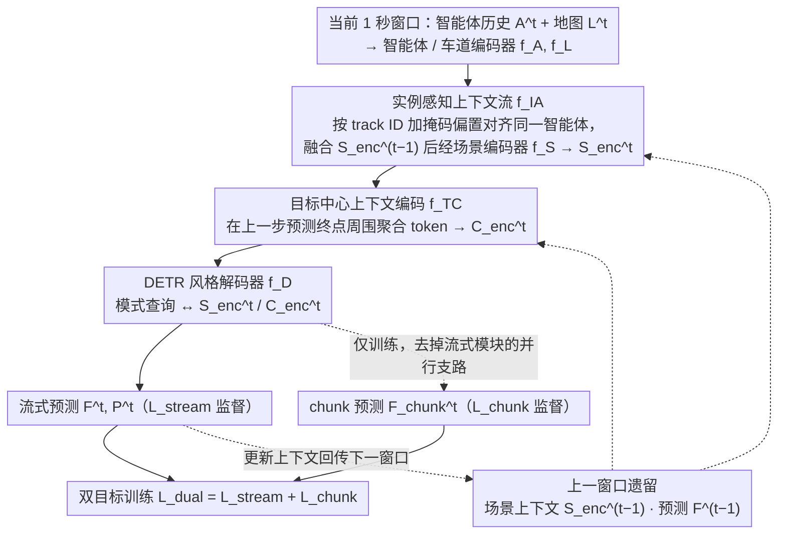

# SHARP: Short-Window Streaming for Accurate and Robust Prediction in Motion Forecasting

**会议**: CVPR 2026  
**arXiv**: [2603.28091](https://arxiv.org/abs/2603.28091)  
**代码**: 无  
**领域**: 自动驾驶 / 轨迹预测  
**关键词**: 流式运动预测, 异构观测长度, 实例感知上下文流, 短窗口推理, 多智能体预测

## 一句话总结

提出 SHARP，一种基于短窗口流式推理的运动预测框架，通过实例感知上下文流模块显式维护和更新跨时间步的智能体潜在表示，结合双目标训练策略，在 Argoverse 2 多智能体基准上达到流式推理 SOTA，同时保持极低延迟。

## 研究背景与动机

1. **领域现状**：轨迹预测是自动驾驶控制栈的核心组件，SOTA 方法在大规模数据集上达到了很高的精度。但这些基准仅考虑固定大小的历史和未来窗口，而实际驾驶中历史上下文长度是异构的——新进入视野的车辆只有很短的观测历史。

2. **现有痛点**：(1) 依赖长上下文的方法在新检测到的智能体上必须延迟预测直到积累足够观测；(2) 现有流式方法（如 RealMotion、DeMo）虽然能跨时间步传递信息，但在训练时使用固定数量的流式 pass，导致在不同流式步数下性能退化；(3) 现有上下文流机制仅依赖位置对应关系，没有显式建模实例对应性。

3. **核心矛盾**：实际驾驶场景持续演化，不同智能体的可用观测长度差异很大（从几帧到几秒），但大多数方法只能处理固定长度输入。

4. **本文目标**：(1) 如何从短观测窗口中做出准确预测；(2) 如何在持续演化的场景中可靠传播上下文信息；(3) 如何保持轻量架构满足实时推理需求。

5. **切入角度**：用短窗口（1秒）逐步处理观测流，通过实例感知的上下文流机制维护智能体的长期记忆。

6. **核心 idea**：短窗口输入 + 实例感知跨窗口上下文传递 + 流式/单chunk 双目标训练 = 在任意观测长度下都准确鲁棒的预测。

## 方法详解

### 整体框架

SHARP 要解决的核心问题是：实际驾驶里每个智能体能看到的历史长度天差地别（刚进入视野的车只有几帧，老车有好几秒），但主流预测模型只吃固定长度的输入，遇到短历史要么延迟预测、要么直接垮掉。它的做法是把连续的观测流切成一个个 1 秒的短窗口逐步处理，让长期信息以「上下文」的形式在窗口之间流动，而不是每次都重新喂一长段历史。

具体到一步：当前窗口的智能体历史状态 $A^t \in \mathbb{R}^{N_a \times T_h \times D_a}$ 和地图 $L^t$ 先过编码器 $f_E$，得到场景上下文 $S_{\text{enc}}^t$ 和（由上一步预测终点引导的）目标中心特征 $C_{\text{enc}}^t$。做流式推理时，模型把上一窗口留下的场景上下文 $S_{\text{enc}}^{t-1}$ 和预测 $F^{t-1}$ 融进当前表示，再由 DETR 风格解码器吐出多模态轨迹 $(F^t, P^t)$，同时把更新后的上下文传给下一步。训练阶段则刻意让模型同时学「带上下文」和「不带上下文」两种预测，这样无论智能体观测多长都不会失手。

### 关键设计

**1. 实例感知上下文流模块（Instance-Aware Context Streamer）：用 track ID 把同一辆车在不同窗口的表示对齐**

跨窗口传上下文最朴素的做法是交叉注意力——拿当前场景表示 $S^t$ 去 query 上一步的 $S_{\text{enc}}^{t-1}$。问题是注意力只看几何位置，并不知道「上一帧第 3 号 token 和这一帧第 5 号 token 其实是同一辆车」，于是 RealMotion、DeMo 只能靠 motion-aware layer norm 补偿坐标漂移，实例对应是隐式、容易错配的。SHARP 直接把输入轨迹里本就存在的 track ID 用起来：在交叉注意力上加一个掩码，对匹配到同一实例的 query-key 对施加一个可学习的偏置参数，显式抬高同一智能体跨时间步的关联权重，从而让它的特征在窗口之间保持一致。配合短窗口设计，这一步还顺带获得了从跟踪中断里恢复的能力——某个 track 一旦断了，下一窗口它自然被当成新实例从头处理，而不会像长窗口方法那样把错误一路累积下去。

**2. 目标中心上下文编码（Target-Centric Context Encoding）：在「猜测的未来位置」周围补一圈细粒度上下文**

只编码智能体当前所在区域的上下文，对预测远处的落点帮助有限。SHARP 把上一步推理出的 $K$ 条轨迹终点当作锚点，以每个终点为中心、在它周围一个紧凑局部区域里重新聚合场景 token（附近的智能体 + 车道），构成目标中心特征 $C_{\text{enc}}^t \in \mathbb{R}^{K \times (N_a + N_l)' \times D}$。每个终点都作为自己局部坐标系的原点，额外编码它与焦点智能体的空间关系。负责这步的 $f_{TC}$ 和智能体中心编码器 $f_S$ 用同一套架构，但因为只处理终点附近一小撮 token，额外延迟很低。直觉很简单：预测的终点本身就指向「车可能要去的地方」，在那些地方提前看清环境，自然能把落点预测得更准。

**3. 双目标训练（Dual Training）：同一份数据上同时学「用上下文」和「不靠上下文」**

短窗口能跑流式推理，但也带来一个隐患——如果模型训练时永远有上一窗口的上下文喂着，遇到刚检测到、根本没有历史上下文的新智能体就会露怯。SHARP 的办法是把每个训练场景切成互不重叠的短窗口，对每个新 chunk 让模型一次出两份预测：一份带流式上下文 $F^t$（监督为 $\mathcal{L}_{\text{stream}}$），一份只看当前 chunk 的 $F_{\text{chunk}}^t$（监督为 $\mathcal{L}_{\text{chunk}}$），合起来优化

$$\mathcal{L}_{\text{dual}} = \mathcal{L}_{\text{stream}} + \mathcal{L}_{\text{chunk}}$$

其中每一项都由交叉熵分类损失（最优轨迹概率最大化）和 Smooth L1 回归损失（WTA 策略）组成。这样训练出的模型既学会了「有上下文时充分利用它」，又保留了「没有上下文时也能单凭一个 chunk 给出靠谱预测」的兜底能力；加上短窗口让每个场景内的梯度更新次数更多、预测范围更长，整体在任意观测长度下都更稳。

### 损失函数 / 训练策略

整体训练目标即上面的 $\mathcal{L}_{\text{dual}}$——WTA 策略下的交叉熵分类 + Smooth L1 回归，分别施加在流式分支和 chunk 分支上。窗口长度取 1 秒（对比 RealMotion/DeMo 的 3 秒窗口 + 1 秒位移），更短的窗口换来更密的梯度更新。多智能体预测在此基础上扩展：先用边际预测给出每个智能体各自的轨迹，再经跨智能体、跨模态的交互块把它们组合成联合预测。

## 实验关键数据

### 主实验

AV2 多智能体测试集：

| 方法 | 流式 | avgMinADE₁ | avgMinFDE₁ | actorMR₆ | avgBrierMinFDE₆ |
|------|------|-----------|-----------|---------|----------------|
| Forecast-MAE | ✗ | 1.30 | 3.33 | 0.19 | 2.24 |
| RealMotion | ✓ | 1.14 | 2.87 | 0.18 | 2.01 |
| DeMo | ✓ | 1.12 | 2.78 | 0.16 | 1.93 |
| **SHARP (本文)** | ✓ | **1.03** | **2.53** | **0.15** | **1.80** |

AV2 单智能体测试集：

| 方法 | MR₆ | mADE₆ | mFDE₆ | b-mFDE₆ |
|------|-----|-------|-------|---------|
| QCNet | 0.16 | 0.65 | 1.29 | 1.91 |
| DeMo | 0.13 | 0.61 | 1.17 | 1.84 |
| **SHARP** | 0.14 | 0.64 | 1.19 | **1.83** |

### 消融实验

AV2 Val 上各组件贡献（$T_{cl}=5s$）：

| TCF | IA | DT | mADE₆ | mFDE₆ | b-mFDE₆ |
|-----|----|----|-------|-------|---------|
| ✗ | ✗ | ✗ | 0.74 | 1.28 | 1.91 |
| ✓ | ✗ | ✗ | 0.64 | 1.22 | 1.84 |
| ✓ | ✓ | ✗ | 0.63 | 1.19 | 1.81 |
| ✓ | ✓ | ✓ | 0.64 | 1.20 | 1.82 |

短上下文 $T_{cl}=1s$ 时 Dual Training 的关键作用：

| TCF | IA | DT | mADE₆ | mFDE₆ | b-mFDE₆ |
|-----|----|----|-------|-------|---------|
| ✓ | ✗ | ✗ | 1.09 | 2.49 | 3.18 |
| ✓ | ✓ | ✗ | 1.11 | 2.55 | 3.25 |
| ✓ | ✓ | ✓ | **0.76** | **1.48** | **2.13** |

### 关键发现

- **短上下文下 Dual Training 至关重要**：在 $T_{cl}=1s$ 时，加入 DT 后 b-mFDE₆ 从 3.25 降至 2.13，下降 34%。说明 chunk 分支为模型提供了至关重要的短窗口预测能力。
- **SHARP 在不同上下文长度下保持稳定**：在演化场景评估中，RealMotion/DeMo 在偏离其标准 3 步流式配置时性能显著退化，而 SHARP 在 1s 到 8s 各种上下文长度下都保持竞争力
- **实例感知机制在短窗口下价值更大**：长上下文（5s）时 IA 改进边际（1.81→1.82），但概念上更重要——它让模型显式利用跟踪信息
- **多智能体预测显著超越 SOTA**：比 DeMo 降低 6.7%（avgBrierMinFDE₆: 1.93→1.80），展示流式方法在联合预测中的优势
- **长上下文延伸时优势更明显**：$T_{cl}=8s$, $t_p=8s$ 时 SHARP 的 b-mFDE₆=1.08，而 DeMo 反而恶化到 1.48

## 亮点与洞察

- **短窗口设计的隐含优势**：1 秒窗口不仅提高了训练效率（每个场景更多梯度更新），还自然具备了对跟踪中断的恢复能力——这是相对于 3 秒窗口方法的一个容易被忽视但很重要的优势。
- **双目标训练的优雅设计**：同时训练有/无上下文的预测，使模型学会了"有上下文时利用它、没有时也不崩溃"，这比掩码或知识蒸馏等方法更直接。
- **演化场景评估协议的贡献**：提出了不同 $t_p$ 和 $T_{cl}$ 组合的全面评估框架，比标准的固定窗口评估更接近实际部署需求。这个评估协议本身就是一个重要贡献。

## 局限与展望

- **未考虑感知噪声**：假设输入的检测和跟踪结果是准确的，实际部署中感知噪声会影响性能
- **窗口大小的选择**：1 秒窗口是否在所有场景下最优未充分讨论
- **单智能体评估略有退让**：在标准单智能体基准上不是所有指标最优（如 MR₆=0.14 vs DeMo 的 0.13），权衡了对异构长度的鲁棒性
- **计算资源和实时性的详细分析缺失**：虽然提到"minimal latency"但未给出具体延迟数字

## 相关工作与启发

- **vs RealMotion**：RealMotion 使用 3 秒窗口和位置对应的交叉注意力流，在偏离标准配置时性能退化严重；SHARP 用 1 秒窗口 + 实例感知流 + 双目标，泛化性好得多
- **vs DeMo**：DeMo 在标准基准上很强但延伸到非标准流式步数时同样退化；SHARP 在长上下文（8s）时优势更明显
- **vs FLN/LaKD**：这些方法通过知识蒸馏处理不同长度，但缺乏信息流机制，连续预测之间独立，不适合实际部署的持续运行需求

## 评分

- 新颖性: ⭐⭐⭐⭐ 实例感知上下文流和双目标训练的设计新颖且有效，短窗口选择有充分理由
- 实验充分度: ⭐⭐⭐⭐⭐ 覆盖 AV2/AV1/nuScenes 三个数据集，演化场景评估是一大亮点，消融全面
- 写作质量: ⭐⭐⭐⭐ 问题定义清晰，实验设计与分析严谨
- 价值: ⭐⭐⭐⭐⭐ 直接面向自动驾驶实际部署需求，多智能体流式预测 SOTA，提出的评估协议对社区有长期价值

<!-- RELATED:START -->

## 相关论文

- [\[CVPR 2026\] FlashCap: Millisecond-Accurate Human Motion Capture via Flashing LEDs and Event-Based Vision](flashcap_millisecond-accurate_human_motion_capture_via_flashing_leds_and_event-b.md)
- [\[CVPR 2026\] StreamVLO: Streaming Visual-LiDAR Odometry with Cumulative Drift Compensation](streamvlo_streaming_visual-lidar_odometry_with_cumulative_drift_compensation.md)
- [\[ICCV 2025\] Future-Aware Interaction Network For Motion Forecasting](../../ICCV2025/autonomous_driving/future-aware_interaction_network_for_motion_forecasting.md)
- [\[AAAI 2026\] Differentiable Semantic Meta-Learning Framework for Long-Tail Motion Forecasting in Autonomous Driving](../../AAAI2026/autonomous_driving/differentiable_semantic_meta-learning_framework_for_long-tail_motion_forecasting.md)
- [\[CVPR 2026\] ReMoT: Reinforcement Learning with Motion Contrast Triplets](remot_reinforcement_learning_with_motion_contrast_triplets.md)

<!-- RELATED:END -->
