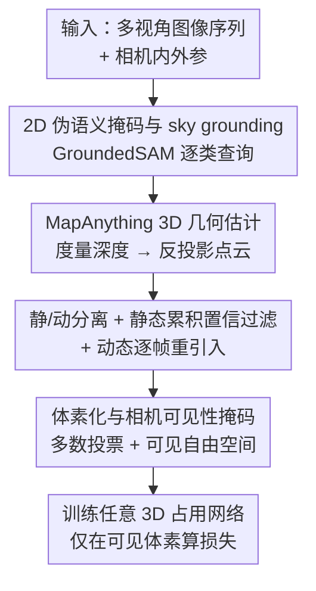

# ShelfOcc: Native 3D Supervision beyond LiDAR for Vision-Based Occupancy Estimation

**会议**: CVPR 2026  
**论文**: [CVF Open Access](https://openaccess.thecvf.com/content/CVPR2026/html/Boeder_ShelfOcc_Native_3D_Supervision_beyond_LiDAR_for_Vision-Based_Occupancy_Estimation_CVPR_2026_paper.html)  
**代码**: https://github.com/boschresearch/ShelfOcc  
**领域**: 自动驾驶 / 3D视觉  
**关键词**: 占用估计, 弱监督, 几何基础模型, 伪标签, 无LiDAR

## 一句话总结
ShelfOcc 不再用 2D 渲染损失去监督占用网络，而是用几何基础模型（MapAnything）+ 语义分割基础模型（GroundedSAM）从纯多视角视频里生成度量一致的 3D 语义体素伪标签，做「原生 3D 监督」，从而在 Occ3D-nuScenes 上把弱/货架监督占用估计刷出最高 34% 的相对提升，且完全不依赖 LiDAR。

## 研究背景与动机
**领域现状**：3D 占用估计是自动驾驶感知的基础。全监督方法效果好但严重依赖 LiDAR 标注的稠密 3D 真值，标注成本极高、且车队车辆很少装参考传感器。为摆脱 3D 标签，研究者转向弱监督/「货架监督」（shelf-supervised，指借助现成基础模型当几何/语义先验），主流做法（SelfOcc、OccNeRF、GaussianFlowOcc 等）用 NeRF 或 3DGS 把预测的 3D 占用渲染回 2D，再用 2D 语义掩码、单目深度等易得线索做光度/语义监督。

**现有痛点**：纯靠 2D 图像损失去学复杂 3D 几何天生困难。最典型的副作用是**深度溢出（depth bleeding）**——模型抓不准物体沿视线方向的体积范围，因为 2D 信号主要给的是可见边界信息。为补全 3D 监督，渲染方法又得依赖时序一致性、得处理动态物体，进一步复杂化训练，却只能缓解而非根除深度溢出。

**核心矛盾**：监督信号的「维度」和任务需要的「维度」不匹配——任务要的是原生 3D 体素监督，方法却把监督压回了 2D 投影空间。作者认为，高质量监督本身才是鲁棒占用学习的关键，是和「架构创新」并行的重要互补方向。

**本文目标**：在不要 LiDAR、不要人工 3D 标注、也不要 2D 渲染监督的前提下，直接在原生 3D 体素空间里给占用网络提供监督。

**切入角度**：现成的 3D 几何基础模型（VGGT、MapAnything）能从图像一次前向推出相机参数、深度图、稠密 3D 点云，是天然的几何先验来源。但它们假设静态场景、一致相机参数，直接用到动态多相机驾驶序列会出问题——单帧用产生稀疏标签，简单时序累积又会产生动态物体的拖影/鬼影。

**核心 idea**：设计一条把静态/动态场景分离、对静态几何跨帧累积并置信过滤、逐帧重新引入动态物体、再把语义传播进体素的伪标签生成流水线，产出干净一致的 3D 语义体素标签，即插即用地监督**任意**占用网络。

## 方法详解

### 整体框架
ShelfOcc 是一条伪标签生成流水线，输入是多视角图像序列（每帧 $C$ 个相机，带内参 $K_{i,t}$、外参 $T_{i,t}$），输出是度量尺度的 3D 语义体素伪标签 $V_t$ 及相机可见性掩码 $M_{vis,t}$，再拿这些标签去训任意 3D 占用网络。整条管线分六步：① 用 GroundedSAM 生成 2D 伪语义掩码；② 用 MapAnything 估计 3D 几何并做静/动分离；③ 静态点云跨帧累积 + 置信过滤；④ 逐帧重新引入动态物体；⑤ 体素化 + 可见性掩码生成；⑥ 用生成的标签训练占用网络。整个过程纯视觉、不碰 LiDAR 和人工 3D 标注。

### 关键设计

**1. 原生 3D 体素监督范式：把监督从 2D 投影空间搬回 3D**

这是全文的范式转变，直接打在「2D 渲染监督学不好 3D 几何、有深度溢出」这个痛点上。作者的中心假设是：即便监督来自基础模型生成的伪标签，只要它是**原生 3D**的，就能显著增强占用网络的几何理解，效果超过 2D 监督的同行，且不需要昂贵的 3D 标注。这样做有两个直接好处：一是网络从显式 3D 目标里学习，缓解深度溢出、得到更完整准确的几何；二是训练管线大大简化，省掉了复杂的可微渲染机制，降低显存和算力开销。监督本身就是一个标准的体素交叉熵 $L=\sum_t\sum_{v\in V_t} M_{vis,t}(v)\cdot L_{CE}(\hat V_t(v),V_t(v))$，因此可以套用任意以 3D 体素标签训练的成熟占用架构（COTR、CVT-Occ、STCOcc）。

**2. 2D 伪语义掩码与 sky grounding：逐类查询消除漏检与误检**

伪标签的语义来自 GroundedSAM（Grounding DINO 开放词表检测 + SAM 分割）。作者发现一个实操坑：把所有目标类一次性丢给 Grounding DINO 会漏检很多物体；但逐类单独查询又会让模型「即使物体不在也硬要检出」，产生高置信但错误的框和类别混淆。解法是**sky grounding**——逐类查询时额外塞一个通用背景标签（如 `sky`），当查询物体不存在时给模型一个高置信的替代答案，从而大幅压低误检；凡是被预测成背景标签的框在进 SAM 前直接丢弃。这套稠密 2D 掩码既给 3D 点赋语义，也用于后续动态物体识别。消融显示 sky grounding 训练后净增 +0.39 mIoU / +1.8 几何 IoU。

**3. 静/动分离的静态累积与动态重引入：根治时序累积的拖影鬼影**

动态驾驶场景里，朴素地把所有时刻的点累积成一个场景，会让运动物体沿轨迹重复出现、污染表征。作者按语义类别（而非真实运动）判定动态像素：构建**静态场景**时，只把 2D 掩码里非动态的像素反投影成 3D 点，反投影公式 $P(u,v)=T_i\cdot(K_i^{-1}\cdot[u,v,1]^\top\cdot D_i(u,v))$，把所有相机、所有时刻的静态点聚成全局静态点云 $P_{static}$。再做两道**置信过滤**：（a）对每条像素射线统计它穿过某体素 cell 的次数与在该 cell 终止的次数，穿过远多于终止的点判为错误深度予以剔除；（b）剪掉点密度不足（少于 4 个点）的体素。**动态物体**则对每个时刻 $t$ 单独反投影被判为动态的像素，得到 $P_{dynamic,t}$，逐帧精确地把动态物体放回它当帧的真实位置。这套「静态累积+动态逐帧重引入」就是图 1 里 Version 1（单帧、太稀疏）→ Version 2（时序累积、有拖影）→ Version 3（加动态处理、干净）演进的核心。

**4. 体素化与相机可见性掩码：稠密标签 + 区分「空」和「未观测」**

把某帧的全局静态点云与该帧动态点云合并后做体素化（nuScenes 上 X/Y $[-40,40]$m、Z $[-1,5.4]$m、0.4m 分辨率）。每个体素的语义由落入其中的点**多数投票**决定，并对地面附近的少数类（如交通锥）做优先级提升以缓解类别不平衡，无点的体素标记为空。关键的是生成**相机可见性掩码** $M_{vis,t}$：从每个相机位置投射射线，找到第一个被占用体素，其前的体素标记为「可见自由空间」、其后或视锥外的标记为「未观测」。训练时损失只在可见体素上计算（把 $M_{vis,t}$ 当权重），保证模型只为「相机理论上能看到的区域」的错误买单，而不会被未观测区域误导。

### 损失函数 / 训练策略
ShelfOcc 自身不引入新损失——它的产物是伪标签。下游占用网络用各自原有的损失（通常是体素交叉熵）训练，唯一约束是用相机可见性掩码 $M_{vis,t}$ 当权重，只在可观测区域算 loss。所有下游网络（COTR / CVT-Occ / STCOcc）输入 $256\times704$ 图像、ResNet-50（ImageNet 预训练）骨干，仅用多视角相机、不碰目标数据集的 LiDAR 或 3D 标注。

## 实验关键数据

### 主实验
在 Occ3D-nuScenes 验证集上对比货架监督方法。把 ShelfOcc 伪标签喂给三个全监督架构（COTR/CVT-Occ/STCOcc），全部刷新货架监督 SOTA。最强组合 ShelfOcc+STCOcc 达 22.87 mIoU / 56.14 几何 IoU，比此前最佳 GaussianFlowOcc 高 +5.79 mIoU、+9.23 IoU，对应相对提升约 **34% mIoU / 20% IoU**。

| 方法 | 监督类型 | mIoU↑ | 几何 IoU↑ |
|------|----------|-------|-----------|
| SelfOcc | 2D 渲染 | 10.54 | 44.05 |
| OccNeRF | 2D 渲染 | 10.81 | 46.43 |
| GaussTR | 2D 渲染 | 13.26 | 44.54 |
| EasyOcc | 2D→3D 单目深度 | 15.96 | 38.86 |
| GaussianFlowOcc | 2D 渲染 | 17.08 | 46.91 |
| **ShelfOcc + COTR** | 原生 3D | 18.65 | 53.71 |
| **ShelfOcc + CVT-Occ** | 原生 3D | 19.21 | 52.72 |
| **ShelfOcc + STCOcc** | 原生 3D | **22.87** | **56.14** |

注：mIoU = 各语义类 IoU 的均值；几何 IoU 不分语义、只看占用/空的体素级正确率，衡量纯几何保真度。

RayIoU（沿相机射线的、对深度更一致的评测，缓解传统体素 IoU 的深度不一致问题）上趋势一致：

| 方法 | mRayIoU↑ | @1 | @2 | @4 |
|------|----------|----|----|----|
| GaussianFlowOcc | 16.47 | 11.81 | 16.58 | 20.98 |
| ShelfOcc + COTR | 17.24 | 12.22 | 17.33 | 22.18 |
| ShelfOcc + STCOcc | **19.97** | **14.38** | **20.07** | **25.47** |

### 消融实验
| 配置 | mIoU | 几何 IoU | 说明 |
|------|------|---------|------|
| 伪标签直接评测（未训练） | 9.62 | 26.00 | 基础模型裸标签远不够好 |
| 用伪标签训练 STCOcc | 22.87 | 56.14 | 网络学会补全/去噪，远超裸标签 |
| 训练 w/o sky grounding | 22.48 | 54.26 | 去掉 sky grounding |
| 训练 w/ sky grounding | 22.87 | 56.14 | +0.39 mIoU / +1.8 IoU |

### 关键发现
- **「训练后远超裸标签」是核心证据**：伪标签自身只有 9.62 mIoU，但拿它训练 STCOcc 后涨到 22.87——说明现成基础模型直接当预测远不够，但当**监督信号**时，网络能学到强泛化与补全能力，填补缺失几何、纠正不一致。
- **数据中心 > 架构中心**：增益在 COTR/CVT-Occ/STCOcc 三种即插即用架构上一致出现，说明提升来自监督信号质量而非某个网络设计。
- 伪标签甚至比 LiDAR 真值更稠密，给场景提供更全的空间覆盖，网络训练后能补全部分可见物体的完整范围。
- sky grounding 看似小 trick，却实打实提升 2D 掩码质量、压低投影到 3D 后的假阳/假阴。

## 亮点与洞察
- **范式级洞察「监督维度要和任务维度对齐」**：把监督从 2D 投影搬回原生 3D，一举绕开深度溢出和可微渲染的复杂性——这是最「啊哈」的地方，也提示我们弱监督任务里「在什么空间给监督」比「用什么损失」更本质。
- **基础模型当监督而非预测**：裸标签 9.62、训练后 22.87 的对比，干净地论证了「FM 不必完美，只要能当一致的监督锚点」，这个 trick 可迁移到其他缺标注的 3D 任务。
- **即插即用**：不改网络结构、只换监督来源就能升级任意占用架构，对工程落地极友好（车队海量纯相机数据可直接用上）。
- **静/动分离按语义类别而非真实运动判定**：实现简单又稳，规避了光流/运动估计的不稳定。

## 局限与展望
- 强依赖两个外部基础模型（MapAnything 的度量几何、GroundedSAM 的开放词表语义）的能力上限，FM 的系统性偏差会传导进伪标签；当前结果也建立在 nuScenes 这类有可用相机内外参的数据上（MapAnything 可选地吃这些参数）。
- 动态物体仅按「检测到的语义类」判定为动态、且逐帧单独反投影，对快速运动或被遮挡的动态物体重建质量存疑。⚠️ 具体动态处理细节以原文为准。
- 评测局限于 Occ3D-nuScenes，与 LiDAR 监督方法的直接对比放在补充材料，跨数据集泛化未充分验证。
- 伪标签里 traffic cone、trailer 等少数类 IoU 仍偏低（如 ShelfOcc+STCOcc 的 cons. vehicle 仅 7.25），语义细粒度仍是短板。

## 相关工作与启发
- **vs SelfOcc / OccNeRF / GaussianFlowOcc（2D 渲染监督）**：它们用 NeRF/3DGS 把占用渲染回 2D 再用光度/语义损失监督，受深度溢出和动态场景困扰；ShelfOcc 直接在 3D 体素空间监督，mIoU 从 17.08（GaussianFlowOcc）提到 22.87。
- **vs EasyOcc（2D→3D 单目深度提升）**：EasyOcc 把 2D 语义掩码用单目深度抬进 3D，但相对前作提升不明显（15.96 mIoU）；ShelfOcc 用度量一致的几何 FM + 静动分离累积，质量显著更高。
- **vs LeAP / AGO / AutoOcc（仍用 LiDAR 几何先验）**：这些方法虽不用 3D 语义标注，但仍借 LiDAR 做几何监督，与 ShelfOcc 纯视觉、无 LiDAR 的设定不同，不直接可比。

## 评分
- 新颖性: ⭐⭐⭐⭐ 「原生 3D 货架监督」范式转变清晰，但几何/语义 FM 与占用网络均为现成组件
- 实验充分度: ⭐⭐⭐⭐ 三架构一致增益 + RayIoU + 伪标签质量/sky grounding 消融扎实，跨数据集对比偏少
- 写作质量: ⭐⭐⭐⭐ 痛点—假设—管线逻辑顺，图 1 的 Version 演进很直观
- 价值: ⭐⭐⭐⭐⭐ 纯相机即可生成高质量 3D 监督、即插即用，对无 LiDAR 大规模训练落地价值高

<!-- RELATED:START -->

## 相关论文

- [\[CVPR 2026\] EMDUL: Expanding mmWave Datasets for Human Pose Estimation with Unlabeled Data and LiDAR Datasets](expanding_mmwave_datasets_for_human_pose_estimation_with_unlabeled_data_and_lida.md)
- [\[CVPR 2026\] OccAny: Generalized Unconstrained Urban 3D Occupancy](occany_generalized_unconstrained_urban_3d_occupancy.md)
- [\[ICCV 2025\] Semantic Causality-Aware Vision-Based 3D Occupancy Prediction](../../ICCV2025/autonomous_driving/semantic_causality-aware_vision-based_3d_occupancy_prediction.md)
- [\[CVPR 2026\] Beyond Rule-Based Agents: Active Markov Games for Realistic Multi-Agent Interaction in Autonomous Driving](beyond_rule-based_agents_active_markov_games_for_realistic_multi-agent_interacti.md)
- [\[CVPR 2026\] ProOOD: Prototype-Guided Out-of-Distribution 3D Occupancy Prediction](proood_prototype-guided_out-of-distribution_3d_occupancy_prediction.md)

<!-- RELATED:END -->
