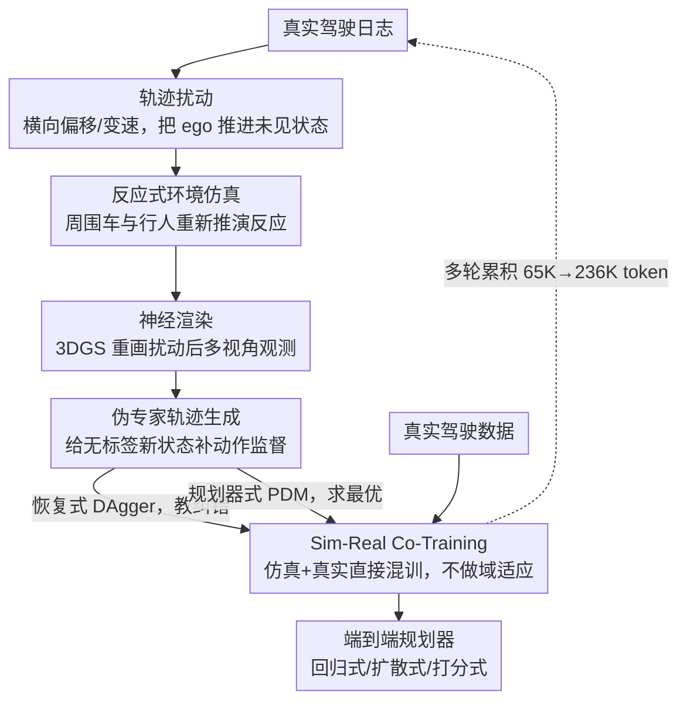

# SimScale: Learning to Drive via Real-World Simulation at Scale

**会议**: CVPR 2026 (Oral)  
**arXiv**: [2511.23369](https://arxiv.org/abs/2511.23369)  
**代码**: [OpenDriveLab/SimScale](https://github.com/OpenDriveLab/SimScale)  
**作者**: Haochen Tian, Tianyu Li, Haochen Liu, Jiazhi Yang 等 (CASIA, OpenDriveLab@HKU, Xiaomi EV)
**领域**: 自动驾驶  
**关键词**: 仿真数据, 端到端规划, 仿真到现实, 数据扩展, 伪专家轨迹, 神经渲染, co-training

## 一句话总结
提出 SimScale 框架，通过对现有驾驶日志进行轨迹扰动 + 反应式环境仿真 + 神经渲染生成大规模高保真模拟数据，配合伪专家轨迹监督和 sim-real co-training 策略，使端到端规划器在 NAVSIM v2 上取得显著提升（navhard +8.6 EPDMS），且性能随仿真数据量平滑扩展。

## 研究背景与动机

全自动驾驶需要在广泛场景中学习合理决策，包括安全关键和分布外 (OOD) 场景。然而：

- **数据分布偏差**：人类专家采集的真实数据以常规驾驶为主，安全关键场景（急刹、险避让）和 OOD 场景严重不足
- **示范偏差 (demonstration bias)**：模仿学习策略仅暴露于专家分布内的状态，无法学习从偏离状态恢复的能力
- **现有仿真方案的局限**：
    - 传统仿真器 (CARLA/MetaDrive)：渲染真实感不足，sim-to-real gap 大
    - 基于 NeRF/3DGS 的神经渲染：质量高但缺乏场景交互性（非反应式环境）
    - 纯轨迹扰动：只产生新状态，缺乏对应的高质量传感器观测

**核心思路**：在已有真实驾驶日志上扰动 ego 轨迹产生新状态，结合反应式环境模拟其他交通参与者的反应，再用神经渲染生成高保真多视角图像，最后为新状态生成伪专家监督轨迹，从而以可扩展方式合成海量训练数据。

## 方法详解

### 整体框架

SimScale 想解决的事很具体：模仿学习的策略只见过专家分布内的状态，一旦车开偏就不会纠正，而真实日志里安全关键场景又太稀少，单靠采集真实数据来补这块成本极高。它的思路是把"补数据"这件事搬进仿真，但又不能掉进传统仿真器 sim-to-real gap 太大的坑——于是它在**已有真实日志**之上做四步加工，让每一帧真实场景都能繁衍出大量带监督的新样本。

整条流水线是这样转的：先对某段真实日志里的 ego 轨迹做扰动，把车"推"到原数据没出现过的偏离状态；这些状态会破坏原场景的交互一致性，所以紧接着让环境里的其他车和行人对新轨迹做出反应式仿真；状态和场景都变了，原来的相机画面就不能用了，再用神经渲染把扰动后的多视角观测重画出来；最后给这些没有人类标签的新状态生成伪专家轨迹作为监督。四步之后，一段真实日志就变成了一批"带传感器观测 + 带动作标签"的仿真样本，再和真实数据混在一起 co-training。整个过程可以一轮一轮叠加，数据量越滚越大。

### 关键设计

**1. 轨迹扰动：把 ego 主动推进未见过的状态空间**

模仿学习的盲区在于专家从不示范"开错之后怎么办"，所以训练数据天然缺少偏离状态。SimScale 在时间窗 $T$ 到 $T+H$ 内对 ego 原始轨迹施加横向偏移、速度变化等扰动，让车主动滑出正常行驶路线，进入原始日志里根本没采到的状态。这一步是整个框架的起点——只有先制造出"非专家状态"，后面才有机会教模型从这些状态里恢复。

**2. 反应式环境仿真：让场景跟着新轨迹一起变，而不是定格**

ego 一旦偏离，原日志里其他交通参与者的轨迹就对不上了——它们是按原始 ego 行为录下来的，直接复用会出现穿模、碰撞这类物理上不可能的画面。SimScale 用反应式仿真引擎（基于 MTGS 等）重新推演周围车辆和行人对扰动后 ego 的反应，保证交互一致性。这正是它和 NeRF/3DGS 那类"高保真但静态回放"方案的关键分野：那些方法画面好看却是非反应式的，环境不会因为 ego 改了路线而改变；SimScale 让环境真正"活"过来。

**3. 神经渲染：给新状态配上以假乱真的多视角观测**

状态和环境都变了，端到端模型需要的是对应这个新状态的相机图像，而不是原来那帧。SimScale 用 3D Gaussian Splatting (3DGS) 根据扰动后的 ego 位姿和反应式环境状态重新渲染高保真多视角观测。这一步是 sim-real gap 能被压住的物理原因——渲染足够真，下游才不需要域适应这类补救手段。

**4. 伪专家轨迹生成：给没有人类标签的新状态补上动作监督**

扰动出来的状态没有现成的专家动作可用，必须自己造监督信号。论文比较了两条路线：**Recovery-based（恢复式）**在扰动结束时刻 $T+H$ 直接规划一条从偏离状态拉回正常行驶的轨迹，本质是 DAgger 思想，专教模型"犯错后如何纠正"；**Planner-based（规划器式）**则让规则化规划器 PDM 在仿真环境里重新规划一条最优轨迹作监督。两者各有取舍：恢复式带探索性、覆盖更多纠错场景，规划器式动作更优但行为更保守——后面实验会显示，纠错多样性有时比轨迹最优性更重要。

**5. Sim-Real Co-Training：仿真和真实数据直接混训，不做域适应**

有了海量仿真样本，怎么用进训练才是落地的最后一步。SimScale 选了最朴素的做法——把仿真数据和真实数据混在一起联合训练，不加任何域随机化或域自适应技巧，因为神经渲染已经把视觉 gap 压得足够小。这套策略对各类端到端规划器都通用：回归式（LTF / Transfuser）直接回归轨迹点，扩散式（DiffusionDrive）建模轨迹分布，打分式（GTRS-Dense）对候选轨迹打分排序。打分式还多一条"仅用奖励"（rewards only）模式——仿真数据不充当模仿学习的监督，而只提供奖励信号让模型挑轨迹，这恰好绕开了伪专家质量的天花板。

### 一个完整示例：一段日志如何变成一批训练样本

取一段平直道路上的真实日志，原始 ego 一直走在车道中央。第一步扰动把它在 6 秒窗口内横向推出半个车道、略微提速，ego 进入一个"快要压线、需要回正"的状态——这是原数据里没有的。第二步反应式仿真发现后方一辆车因为 ego 的偏移需要减速避让，于是重新推演它的轨迹，避免两车穿模。第三步用 3DGS 把这个新位姿下的环视相机画面重画出来，得到一组真实感很强的多视角图像。第四步给这个偏离状态打监督：恢复式伪专家规划出一条平滑回到车道中央的轨迹。至此，这一帧就成了一条完整样本（多视角观测 + 恢复轨迹）。换一组扰动幅度、换一个时刻，同一段日志能反复繁衍出大量样本；五轮累积下来，仿真 token 数从约 65K 滚到约 236K，全部和真实数据混训。

### 训练策略

仿真数据与真实数据按 co-training 方式联合训练，无需域适应；打分式策略额外支持 rewards only 模式（仿真侧只给奖励信号、不做模仿监督）。具体超参以原文为准。

## 实验关键数据

评估基于 NAVSIM v2 基准，包含 navhard（高难度安全关键场景）和 navtest（常规测试集）两个 split。

**表1：Model Zoo 主要结果（EPDMS 指标）**

| 模型 | 骨干网络 | Co-Train 模式 | navhard EPDMS | navhard 提升 | navtest EPDMS | navtest 提升 |
|---|---|---|---|---|---|---|
| LTF | ResNet34 | w/ pseudo-expert | 30.3 | **+6.9** | 84.4 | **+2.9** |
| DiffusionDrive | ResNet34 | w/ pseudo-expert | 32.6 | **+5.1** | 85.9 | **+1.7** |
| GTRS-Dense | ResNet34 | w/ pseudo-expert | 46.1 | **+7.8** | 84.0 | **+1.7** |
| GTRS-Dense | ResNet34 | rewards only | 46.9 | **+8.6** | 84.6 | **+2.3** |
| GTRS-Dense | V2-99 | w/ pseudo-expert | 47.7 | **+5.8** | 84.5 | **+0.5** |
| GTRS-Dense | V2-99 | rewards only | 48.0 | **+6.1** | 84.8 | **+0.8** |

**关键发现**：
- 所有策略类型均从仿真数据中获益，navhard 提升尤为显著（+5.1 ~ +8.6）
- GTRS-Dense + rewards only 模式达到最大 navhard 提升 (+8.6)，表明打分式策略不需要伪专家轨迹标签，仅靠奖励信号即可充分利用仿真数据
- navtest 上也有一致提升 (+0.5 ~ +2.9)，说明仿真数据同时改善泛化能力

**表2：扩展性分析——仿真数据量 vs 性能**

| 仿真数据轮数 | 仿真 token 数 | GTRS navhard (pseudo-expert) | GTRS navhard (rewards only) | LTF navhard |
|---|---|---|---|---|
| 0 (仅真实数据) | 0 | 38.3 | 38.3 | 23.4 |
| 1 轮 (round 0) | ~65K | 42.5 | 43.1 | 27.8 |
| 3 轮 (round 0-2) | ~166K | 44.8 | 45.6 | 29.5 |
| 5 轮 (round 0-4) | ~236K | 46.1 | 46.9 | 30.3 |

**扩展性洞察**：
- 性能随仿真数据量平滑增长，未见明显饱和
- 即使不增加真实数据，仅扩展仿真数据即可持续获得收益
- 不同策略架构展现不同的扩展特性：打分式策略扩展最好，扩散式策略次之

## 亮点与洞察

- **CVPR 2026 Oral**：获评口头报告，认可度高
- **完整的仿真-训练闭环**：从扰动到反应到渲染到标注到训练，形成完整可扩展的数据增强管线
- **伪专家应具有探索性**：Recovery-based 伪专家让模型学会从错误中恢复，比 planner-based 在某些场景下更有效，说明数据多样性比轨迹最优性更重要
- **多模态建模激发扩展性**：扩散式和打分式策略比回归式策略更能利用扩展的仿真数据，因为它们建模了轨迹分布而非单点估计
- **Reward is All You Need**：GTRS-Dense 在 rewards only 模式下表现最佳，表明对于打分式策略，仿真数据上无需做模仿学习，仅提供奖励信号即可
- **Sim-Real Gap 可控**：简单的 co-training 策略即可有效，无需域自适应/域随机化等复杂技术，归因于神经渲染的高保真度
- **已开源数据和代码**：TB 级仿真数据 + 训练代码 + 模型权重全部公开，可复现性强

## 局限性

- **依赖基础设施**：需要高质量的 3DGS 神经渲染模型 (MTGS) 和反应式仿真引擎，前置成本高
- **仿真数据规模巨大**：5 轮仿真产生数 TB 传感器数据，存储和 I/O 开销显著
- **场景多样性受限于原始日志**：扰动只能在已有场景的邻域内生成变体，无法创造全新场景类型（如原始数据无雪天，仿真也无法生成雪天）
- **评估局限**：主要在 NAVSIM v2 闭环评估，未在其他基准（如 nuPlan、CARLA 闭环）上验证
- **伪专家质量上限**：PDM 规划器自身的性能上限决定了伪专家的质量天花板
- **未探索更长的仿真时长和多轮交互**：当前仿真窗口为固定 6 秒，更长时间的仿真和累积误差处理尚未涉及

## 相关工作

- **端到端自动驾驶规划**：UniAD、VAD、Transfuser 等直接从传感器到轨迹的端到端方法，受限于训练数据中安全关键场景不足
- **驾驶场景仿真**：CARLA/MetaDrive（传统渲染）到 NeRF/3DGS 神经渲染（高保真但静态）再到反应式仿真（如 DriveArena、MTGS），SimScale 在反应式仿真基础上加入可扩展的伪专家生成
- **数据扩展与 co-training**：DAgger 系列（在线交互）、DROID/Scaling-up（大规模数据收集），SimScale 走仿真扩展路线，避免额外真实数据采集成本
- **打分式规划**：GTRS 等基于奖励打分的轨迹选择范式，本文证明其在 sim-real 场景下的独特优势（rewards only）

## 评分

- 新颖性: 4/5 — 将轨迹扰动+反应式仿真+神经渲染+伪专家的完整闭环框架化，并首次系统性研究端到端规划器的仿真数据 scaling law
- 实验充分度: 5/5 — 3 种策略架构 x 2 种骨干 x 2 种伪专家 x 5 轮扩展，消融全面，已开源数据和代码
- 写作质量: 4/5 — 结构清晰，核心洞见提炼到位（三个 scaling insight），CVPR Oral 水准
- 价值: 5/5 — 为端到端自动驾驶提供了可扩展的仿真数据增强范式，开源生态完善，实用性极强

<!-- RELATED:START -->

## 相关论文

- [\[CVPR 2026\] Unposed-to-3D: Learning Simulation-Ready Vehicles from Real-World Images](unposed-to-3d_learning_simulation-ready_vehicles_from_real-world_images.md)
- [\[CVPR 2026\] V2U4Real: A Real-world Large-scale Dataset for Vehicle-to-UAV Cooperative Perception](v2u4real_a_real-world_large-scale_dataset_for_vehicle-to-uav_cooperative_percept.md)
- [\[CVPR 2026\] Learning to Drive is a Free Gift: Large-Scale Label-Free Autonomy Pretraining from Unposed In-The-Wild Videos](learning_to_drive_is_a_free_gift_large-scale_label-free_autonomy_pretraining_fro.md)
- [\[CVPR 2026\] WorldLens: Full-Spectrum Evaluations of Driving World Models in Real World](worldlens_full-spectrum_evaluations_of_driving_world_models_in_real_world.md)
- [\[CVPR 2026\] Real-World On-Vehicle Evaluation of Embedding-Based Anomaly Detection](real-world_on-vehicle_evaluation_of_embedding-based_anomaly_detection.md)

<!-- RELATED:END -->
