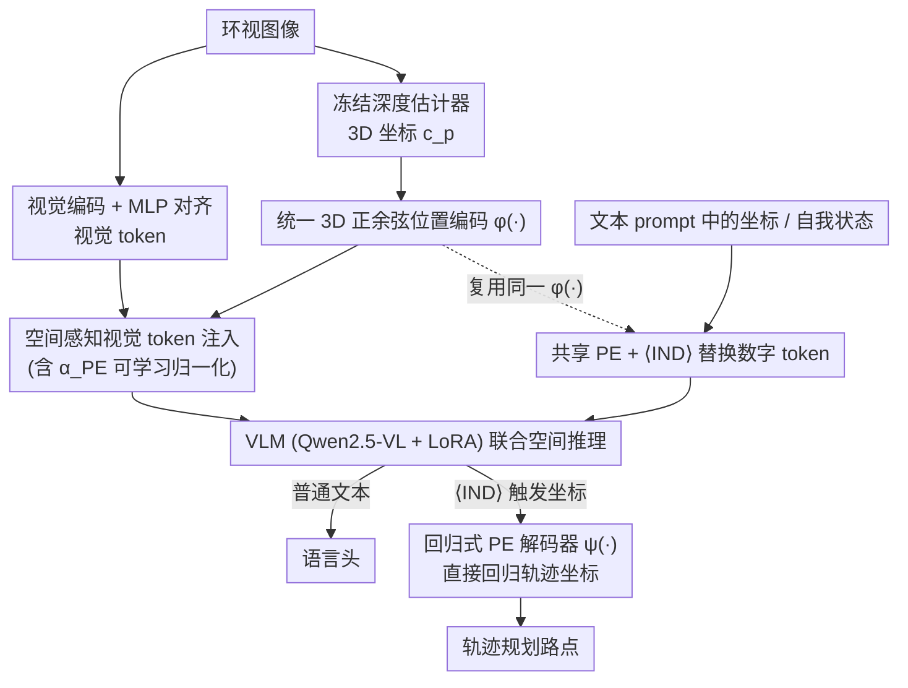

# SpaceDrive: Infusing Spatial Awareness into VLM-based Autonomous Driving

**会议**: CVPR 2026  
**论文**: [CVF Open Access](https://openaccess.thecvf.com/content/CVPR2026/html/Li_SpaceDrive_Infusing_Spatial_Awareness_into_VLM-based_Autonomous_Driving_CVPR_2026_paper.html)  
**代码**: https://github.com/zhenghao2519/SpaceDrive  
**领域**: 自动驾驶 / 多模态VLM  
**关键词**: VLM端到端驾驶, 3D位置编码, 空间感知, 轨迹回归, 闭环规划

## 一句话总结
SpaceDrive 把 VLM 端到端驾驶里"把坐标当文本数字逐位生成"的老做法换成"把坐标当统一的 3D 位置编码（PE）"——同一套正余弦 PE 既叠加到视觉 token 上、又替换文本里的坐标 token、还编码自我状态，最后用一个回归式 PE 解码器直接吐出轨迹坐标，在 nuScenes 开环拿到 VLM 方法里的 SOTA、Bench2Drive 闭环拿到 78.02 的次优分。

## 研究背景与动机
**领域现状**：用 VLM 做端到端自动驾驶（E2E AD）最近很火——把感知、预测、规划都改写成自然语言任务，靠 VLM 大规模预训练带来的通用视觉理解和推理能力，去应对复杂动态场景，泛化性比传统固定模块栈（UniAD、VAD）更好。

**现有痛点**：但 VLM 在 3D 任务上（几何测量、距离估计）表现很差，而这恰恰是和物理世界打交道的根本要求。作者把原因归到两点：① **缺 3D 预训练**——模型只能从 2D 知识里硬推，看到一串 3D 坐标却无法和对应物体、对应 2D 语义关联起来，导致场景描述含糊甚至错误；② **数字被当成逐位分类**——语言模型把数值处理成 digit-by-digit 的分类，忽略了数字之间天然的邻近关系（3.81 和 3.82 很近），还错误地把不同位的重要性拉平，于是连续轨迹点预测很不准。

**核心矛盾**：现有 VLM 规划器要么给每个下游任务塞**任务专属 embedding**（靠专门的 3D 微调，把表示绑死在特定任务/域上，破坏了 VLM 的通用性），要么把路点**当数字 token 序列**直接让语言模型生成（继承上面的数值建模缺陷）。两条路都没拿到一个"既通用、又精确"的空间表示。

**切入角度**：作者注意到一个被忽视的点——Transformer 本身就擅长处理 token 之间的**位置关系**，而位置关系完全可以被理解成语义特征之间的**空间关系**。既然如此，把这套能力延伸到 3D 空间感知就是顺理成章的事。

**核心 idea**：用一套**统一的 3D 位置编码**当坐标的"通用接口"，替代文本数字 token 和任务专属 embedding——同一套 PE 既增强视觉 token、又当 VLM 的坐标输入输出，让模型在共享的空间表示上做联合语义-空间推理，再用回归而非分类来出坐标。

## 方法详解

### 整体框架
SpaceDrive 的目标是：在不破坏 VLM 通用性的前提下，把"3D 坐标"从一串会被逐位分类的文本数字，变成一种 VLM 能直接索引、直接回归的**空间表示**。整条 pipeline 围绕一个共享的位置编码器 $\phi(\cdot)$ 展开，它在三个地方被复用——增强视觉特征、替换文本坐标、编码自我状态——从而让感知端和推理端说同一种"空间语言"。

具体地：环视图像先经视觉编码器 + MLP projector 对齐到语言空间得到视觉 token；同一批图像送进一个冻结的深度估计器拿到稠密绝对深度，反投影成每个 patch 的 3D 坐标 $c_p$，再过 $\phi(\cdot)$ 编成 3D PE，**逐元素加到对应视觉 token 上**，得到"空间感知视觉 token"。文本 prompt 里凡是表示坐标的子串，都用同一个 $\phi(\cdot)$ 编码、**替换掉原来的数字 token**，并在每个 PE 前放一个特殊标识符 $\langle \text{IND} \rangle$ 避免和普通 token 混淆。历史自我状态也用同一个 $\phi(\cdot)$ 编码。VLM（Qwen2.5-VL-7B + LoRA）在这些统一 PE 上做推理，普通文本走语言头解码，坐标输出则由 $\langle \text{IND} \rangle$ 触发、走一个**回归式 PE 解码器** $\psi(\cdot)$ 直接吐出 3D 坐标用于轨迹规划。

### 关键设计

**1. 统一 3D 正余弦位置编码：把坐标当"位置"而不是"数字"**

这是全文的地基，直接针对"数字被逐位分类、3D 坐标和语义对不上"两个痛点。作者不再让 VLM 把坐标当文本生成，而是把每个 3D 坐标 $c_p=(x,y,z)$ 用一个**三维各自展开的正余弦编码**映射成定宽向量：$\phi(c_p)=[\phi_x(x),\phi_y(y),\phi_z(z)]\in\mathbb{R}^{dim}$，其中每一维 $\phi_a(p_a)$ 取 $\sin\!\big(p_a/20000^{2i/d_a}\big)$、$\cos\!\big(p_a/20000^{2i/d_a}\big)$ 的标准 1D 形式，三个坐标轴均分编码宽度（$d_x=d_y=\lceil dim/3\rceil$，$d_z=dim-d_x-d_y$）。选正余弦而非可学习 MLP 或 RoPE，是因为它**平移不变**、能帮注意力层恢复 token 间的相对空间关系；而刻意避开 RoPE 是为了不和 VLM 里已有的 RoPE 撞车造成混淆（消融里 RoPE 编码器掉点最严重）。关键在于这套 $\phi(\cdot)$ 是**任务无关的通用表示**，下面三个地方都复用它，从而在感知和推理之间强制了表示一致性。

**2. 空间感知视觉 token 注入：把 3D 几何显式贴到 2D 语义上**

针对"3D 坐标和 2D 语义关联弱"这个痛点。先用冻结的深度估计器（UniDepthV2-ViT-L）出稠密绝对深度，对每个 patch 取其图像支撑区内的**最小深度**（突出前景），结合相机标定矩阵把 patch 中心反投影成度量 3D 坐标 $c_p$。与以往把可学习 3D 线索藏在 projector 内部、只能得到隐式几何不同，作者把 $\phi(c_p)$ **显式地加到 projector 之后、已对齐语言空间的视觉 token $h_p$ 上**，这样后面文本坐标用的还是同一个 $\phi(\cdot)$，模型就能"按坐标直接索引到对应的视觉语义"。但直接相加会把 token 范数推离 VLM 预训练时的分布，于是引入一个所有 PE 共享的**可学习归一化系数 $\alpha_{PE}$**：$\tilde h_p = h_p + \alpha_{PE}\,\phi(c_p)$。$\alpha_{PE}$ 必须可学习——消融显示固定值会因 PE 范数太小导致注意力分数被忽略、收敛困难甚至语义不稳定，可学习后 Avg. L2 直接降约 0.5m。

**3. 文本坐标与自我状态共享同一 PE：用 ⟨IND⟩ 隔离、感知推理说同一种语言**

针对"任务专属 embedding 不可迁移"的痛点。tokenize 文本时扫描坐标子串，抽出数值向量 $c_r$，用**同一个 $\phi(\cdot)$** 编码后替换掉那段数字 token，并在前面加 $\langle \text{IND} \rangle$ 当标识符避免语义混淆（公式上 $\tilde h_i=\phi(c_r)$ 若 $i$ 属于坐标子串、否则走普通 tokenizer）。对 BEV 坐标（如轨迹路点）把 PE 的 $z$ 分量全置 0、排除出注意力计算。自我状态也不再像以往压成单个向量 embedding，而是把历史自我路点 $\{\phi(c^{ego}_\tau)\}$ 用同一个 $\phi(\cdot)$ 编码，当作显式时空条件喂进去。这一设计的价值在消融里很直接：单独给文本坐标加 PE 收益不大（缺和 2D 语义的桥），但**视觉 + 文本坐标都用统一 PE 时收益显著**——共享表示才是关键，再叠加自我状态进一步降 L2 和闯入率。

**4. 回归式 PE 解码器：直接回归坐标，而不是逐位生成数字**

针对"分类式逐位生成轨迹不准"的痛点。输出阶段扩展原语言头 $W_{lang}\to W'_{lang}$，词表加入 $\langle \text{IND} \rangle$；当模型吐出 $\langle \text{IND} \rangle$ 时，把它**保留在语言上下文里**、而把紧随其后的输出状态 $e_{j+1}$ 路由到一个 PE 解码器 $\psi(\cdot)$ 回归出度量坐标 $\hat c=\psi(e_{j+1})\in\mathbb{R}^3$（BEV 轨迹省略 $z$）。$\psi(\cdot)$ 取**全可学习 MLP** 而非解析求逆，因为正余弦编码相位/频率跨维混叠、不可解析反演，且 VLM 输出空间和输入空间本就没完全对齐，可学习回归更稳。它还是**逐路点**回归（每个路点都条件在共享空间 token 上），而不是从单个任务 embedding 一次解出整条轨迹——消融里逐路点策略全面优于任务专属一次解码。这样既得到精确 BEV 路点、又保住了周围文本的自回归连续性。

### 损失函数 / 训练策略
训练目标把语言建模损失和坐标回归损失相加：$L = L_{LM} + L_{reg}(\hat c, c)$，前者作用于所有文本输出，后者作用于所有坐标输出（如路点）。基础 MLP 解码器下 $L_{reg}$ 用 **Huber loss**。base VLM 为 Qwen2.5-VL-7B，仅用 LoRA（rank 16）微调核心 LLM，视觉编码器和 projector 冻结，深度估计器也不额外微调；开环 nuScenes 训 6 epoch、闭环 Bench2Drive 训 12 epoch（8×A100，输入 640×640）。

## 实验关键数据

### 主实验
开环 nuScenes（预测 3s 内 6 个路点）——SpaceDrive+（带自我状态规划输入）在 VLM 方法里全指标 SOTA：

| 方法 | Ego Status | L2 Avg.(m)↓ | Collision Avg.(%)↓ | Intersection Avg.(%)↓ |
|------|:---:|:---:|:---:|:---:|
| EMMA | - | 0.32 | - | - |
| ORION | ✓ | 0.34 | 0.37 | - |
| OmniDrive-Q++（同 codebase） | ✓ | 0.33 | 0.30 | 3.00 |
| **SpaceDrive+（本文）** | ✓ | **0.32** | **0.23** | **1.27** |
| SpaceDrive（无 ego，本文） | - | 1.80 | 1.88 | 4.21 |

无自我状态的 SpaceDrive 相比其 codebase OmniDrive 全面提升（L2 −0.18、Collision −1.91%、Intersection −0.38%），说明显式注入 3D 空间信息本身就有效，而非靠 ego 先验刷分。

闭环 Bench2Drive（220 短路线、44 交互场景）——SpaceDrive+ 拿到 VLM 方法里的次优：

| 方法 | Driving Score↑ | Success Rate(%)↑ |
|------|:---:|:---:|
| OmniDrive（同 codebase，纯文本规划） | <10 SR | <10 |
| ORION | 77.74 | 54.62 |
| **SpaceDrive+（本文）** | **78.02** | **55.11** |
| SimLingo（用大量 Action Dreaming 增广） | 85.07 | 67.27 |

对比尤其说明问题的是：同 codebase 的 OmniDrive 开环指标不错，但闭环成功率 <10%、轨迹塌成近似直线并伴随抖动——印证了"纯自然语言生成轨迹只是在拟合数据先验、没学到可控驾驶模式"。⚠️ 注意 SimLingo 更高是因为用了额外的 Action Dreaming 数据增广，与本文不完全可比。

### 消融实验
位置编码注入位置（开环、去掉 ego 防过拟合）：

| 配置 | Avg. L2↓ | Avg. Col.↓ | Avg. Int.↓ | 说明 |
|------|:---:|:---:|:---:|:---:|
| 全不加（Exp.1） | 2.51 | 4.53 | 6.77 | baseline |
| 仅视觉 token PE $\phi(c_p)$（Exp.2） | 1.88 | 2.45 | 2.36 | −0.63 L2，提升最大 |
| 仅文本坐标 PE $\phi(c_r)$（Exp.3） | 2.42 | 5.06 | 8.94 | 收益小（缺 2D 语义桥） |
| 视觉 + 文本 PE（Exp.4） | 1.80 | 1.88 | 4.21 | 统一表示才显著 |

编码器/解码器与归一化消融：

| 维度 | 最佳配置 | 对比掉点情况 |
|------|---------|------|
| 编码器 $\phi$ | Sine-Cosine（L2 1.80） | MLP 1.96 / RoPE 1.93（与 VLM 内 RoPE 混淆，最不稳） |
| 解码器 $\psi$ | Coordinate-wise MLP（L2 1.80） | Sine-Cosine 反演 1.87 / 任务专属一次解码 1.93 |
| $\alpha_{PE}$ | 可学习（L2 1.80 @init 0.1） | 固定值普遍掉点且语义不稳（固定 0.02 时仅 2421/5119 样本语义合理） |

### 关键发现
- 给视觉 token 加 PE（Exp.2 vs 1）单步贡献最大，因为它直接把 3D 几何贴到 2D 图像特征上；单给文本坐标加 PE 收益小，要"视觉 + 文本统一 PE"才解锁大提升——**共享表示是核心**。
- $\alpha_{PE}$ 必须可学习：PE 范数直接调制其在注意力里的相对重要性，固定值太小会让注意力分数趋零、收敛困难甚至语义崩坏。
- 适配性强：换 LLaVA / Qwen-VL 两种 backbone 性能相当（说明增益来自统一空间推理而非某个 backbone 偏好）；无 ego 时轨迹会模式崩塌，叠加轻量 CoT prompting 可免训练地稳住路点多样性；PE 解码器还能换成 VAE 生成式以增强闭环鲁棒性。

## 亮点与洞察
- **"位置关系即空间关系"的复用观**：把 Transformer 天生会处理的 token 位置关系，直接当成语义特征间的 3D 空间关系来用，一套 $\phi(\cdot)$ 在感知/推理/自我状态三处复用，是个很省事又自洽的统一接口设计。
- **回归 vs 分类的取舍很到位**：明确指出语言模型逐位分类数字的两个毛病（忽略数字邻近性、拉平各位重要性），然后用 $\langle \text{IND} \rangle$ 触发 + MLP 回归绕开它，还保住了文本部分的自回归连续性——这个"文本走语言头、坐标走回归头"的双解码路由可迁移到任何要 VLM 输出连续量的任务。
- **不用 BEV 也能行**：全程不依赖业界常用的稠密 BEV 特征，说明统一 PE 足以承担 VLM 里的 3D 空间建模，对算力是利好。

## 局限与展望
- 闭环只是次优，明显落后于 SimLingo（85.07）和传统栈 HiP-AD（86.77）；作者归因于对方用了大量数据增广，但也说明纯靠空间编码还没追平最强 pipeline。
- 重度依赖一个**冻结的外部深度估计器**出绝对深度，深度误差会直接传进 3D 坐标；patch 取最小深度突出前景的策略在复杂遮挡/远距离下是否稳健，正文未深究（细节在补充材料）。⚠️ depth 鲁棒性消融在正文未给。
- 正余弦编码不可解析反演只能靠 MLP 近似回归，坐标保真度上有先天损耗；BEV 场景直接把 $z$ 置 0，丢掉了高度信息，对有坡度/立体结构的场景可能受限。
- 可改进方向：把深度估计也纳入端到端联合训练、或给 PE 解码器换上文中提到的 VAE 生成式以提升闭环鲁棒性。

## 相关工作与启发
- **vs OmniDrive / ORION（任务专属 embedding）**：它们靠专门 3D 微调把表示绑在特定任务上、且 ORION 用生成式 planner 一次解码整条轨迹；本文用任务无关的统一 PE + 逐路点回归，迁移性更好、感知推理表示一致，开环全面超过同 codebase 的 OmniDrive。
- **vs 数字 token 序列法（DriveLM 等）**：它们让语言模型 digit-by-digit 生成路点，继承数值建模缺陷；本文用 $\langle \text{IND} \rangle$ + 回归头直接出坐标，闭环上避免了纯文本规划塌成直线的失败模式。
- **vs SpatialVLM / LLaVA-3D 等空间 VLM**：那条线靠合成大规模空间 VQA 数据或把 3D 特征/位置嵌入塞进 pipeline 来增强空间推理；本文不靠额外大规模 3D 预训练，而是用一个轻量、可复用的正余弦 PE 接口，把空间感知"接"进现成 VLM。

## 评分
- 新颖性: ⭐⭐⭐⭐ "把坐标当统一 PE 接口、三处复用 + 回归出坐标"的视角清晰自洽，虽是位置编码的巧妙再利用而非全新机制
- 实验充分度: ⭐⭐⭐⭐ 开环/闭环双评估 + 编码器/解码器/归一化/backbone 多维消融扎实，但闭环深度鲁棒性、VQA 等关键消融压在补充材料
- 写作质量: ⭐⭐⭐⭐ 痛点-动机-方法逻辑链顺畅，图文对应清楚，公式表述规范
- 价值: ⭐⭐⭐⭐ 给 VLM 端到端驾驶提供了一个 backbone 无关、不依赖 BEV 的通用空间编码范式，可迁移到其他需 VLM 输出连续量的任务

<!-- RELATED:START -->

## 相关论文

- [\[CVPR 2026\] DrivePI: Spatial-aware 4D MLLM for Unified Autonomous Driving Understanding, Perception, Prediction and Planning](drivepi_spatial-aware_4d_mllm_for_unified_autonomous_driving_understanding_perce.md)
- [\[CVPR 2026\] RaUF: Learning the Spatial Uncertainty Field of Radar](rauf_learning_the_spatial_uncertainty_field_of_radar.md)
- [\[ICCV 2025\] CoDa-4DGS: Dynamic Gaussian Splatting with Context and Deformation Awareness for Autonomous Driving](../../ICCV2025/autonomous_driving/coda-4dgs_dynamic_gaussian_splatting_with_context_and_deformation_awareness_for_.md)
- [\[CVPR 2026\] Multi-Stage VLM Pipeline for Zero-Shot Traffic Accident Understanding](multi-stage_vlm_pipeline_for_zero-shot_traffic_accident_understanding.md)
- [\[NeurIPS 2025\] Towards Physics-Informed Spatial Intelligence with Human Priors: An Autonomous Driving Perspective](../../NeurIPS2025/autonomous_driving/towards_physics-informed_spatial_intelligence_with_human_priors_an_autonomous_dr.md)

<!-- RELATED:END -->
