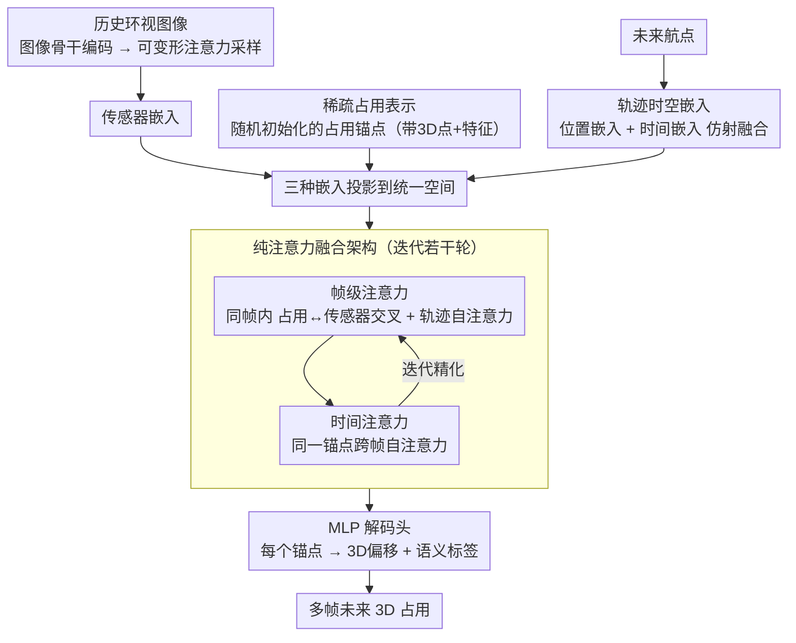

# SparseWorld-TC: Trajectory-Conditioned Sparse Occupancy World Model

**会议**: CVPR 2026  
**arXiv**: [2511.22039](https://arxiv.org/abs/2511.22039)  
**代码**: [GitHub](https://github.com/MrPicklesGG/SparseWorld)  
**领域**: 自动驾驶 / 世界模型  
**关键词**: 4D占用预测, 世界模型, 稀疏表示, 轨迹条件, 纯注意力架构

## 一句话总结

提出一种基于纯注意力的稀疏占用世界模型SparseWorld-TC，绕过VAE离散化和BEV中间表示，直接从原始图像特征端到端预测轨迹条件的多帧未来占用，在nuScenes上大幅超越现有方法。

## 研究背景与动机

占用世界模型通过预测未来3D场景占用来理解环境动态，在自动驾驶中至关重要。现有方法主要存在两类局限：

1. **VAE离散化瓶颈**：OccWorld、OccLLaMA等方法使用VQ-VAE将连续3D场景数据编码为有限词表的离散token，这种离散化限制了表征能力并丢失了细粒度信息。
2. **BEV中间表示限制**：大多数方法依赖密集BEV特征图进行时空建模，引入了显式几何约束，限制了不同尺度特征的灵活交互。

受GPT和VGGT等纯注意力架构在语言和3D视觉领域的成功启发，作者提出：能否用完全基于注意力的前馈架构，通过稀疏占用表示直接从原始图像特征捕获时空依赖关系？

## 方法详解

### 整体框架

这篇论文要做的事很直接：给定历史几帧环视图像和一段未来轨迹，预测接下来多帧的 3D 占用场，而且全程不碰 VAE 离散化、也不落到密集 BEV 中间表示上。整条流水线是一次前馈：图像骨干网络先把历史多帧图像编码成特征，可变形注意力从这些特征里采样出「传感器嵌入」；与此同时模型维护一组随机初始化的「占用锚点」和把未来航点编码成的「轨迹嵌入」。三种嵌入投影到同一空间后，交替走帧级注意力（同帧内占用、传感器、轨迹互相看）和时间注意力（同一锚点跨帧互相看），迭代若干轮把它们融在一起；最后一个 MLP 头从每个锚点解码出它内部每个点的 3D 偏移和语义标签，得到多帧未来占用。整套结构没有任何卷积或体素栅格，纯靠注意力把时空依赖捞出来。

### 关键设计

**1. 稀疏占用表示：用「可去噪的锚点」绕开 BEV 分辨率和 VAE 离散化**

BEV 把场景拍扁成固定分辨率的特征图，分辨率一定就限制了不同尺度特征的灵活交互；VQ-VAE 则把连续 3D 场景塞进有限词表，离散化天然丢细粒度信息。本文换一种容器：场景由一组锚点（anchor）表示，每个锚点带一组随机初始化的 3D 点和一个关联特征向量。这个特征向量经 MLP 解码出该锚点内每个点的 3D 偏移量和语义标签，相当于把一团随机散点「去噪」到一致的占用场上。因为表示是一组点而非栅格，分辨率不再被网格锁死，也不需要 codebook 量化——想加密就加锚点，想长程预测就复用同一组锚点跨帧推演，整套表示保持完全稀疏和灵活。

**2. 轨迹时空嵌入：让同一个模型回答「沿这条轨迹走会看到什么」**

未来占用本质上是多可能的，模型必须以「打算往哪开」为条件才能给出确定的预测，所以轨迹被显式编码成条件信号注入。每个航点的编码拆成两半：位置嵌入把 16 维齐次变换矩阵经 MLP 投影成特征，刻画「车在哪、朝向如何」；时间嵌入用正弦位置编码刻画「这是未来第几个时刻」。两者通过仿射变换（受 MLN 启发）融合进时空嵌入。这样设计的好处是航点之间不必等间隔——只要把对应时刻喂进时间嵌入，模型就能适应任意未来轨迹和任意时间间隔的条件，而不是把轨迹当成固定步长的离散序列。

**3. 纯注意力融合架构：把三种模态丢进同一空间，让标准注意力自己长出时空依赖**

占用、传感器、轨迹三种嵌入一旦投影到统一空间，就不再需要任何显式几何先验来对齐它们——这是放弃 BEV 后能成立的关键。融合由两类注意力交替堆叠完成：帧级注意力在单帧内做占用与传感器的交叉注意力（让锚点去图像特征里找证据）外加轨迹自注意力（让条件信号参与进来）；时间注意力则在同一锚点的不同帧之间做自注意力（捕捉运动和场景演化）。两类模块多次迭代逐步精化，长程时空依赖就这么被标准注意力一层层捞出来，无需为它专门设计几何模块。

### 损失函数 / 训练策略

预测点与 GT 占用体素中心点的对齐用 Chamfer Distance 损失监督，语义标签用 Focal 分类损失监督。训练上有个关键技巧——**随机集合策略**：每个 step 随机选预测帧数 $L \in \{2,\dots,T\}$ 来算损失，而不是固定预测固定长度。这样模型见过各种预测跨度，部署时能按需输出不同长度的未来，消融里它比固定帧训练的平均 mIoU 高出约 5 个点（20.36 → 25.60）。

## 实验关键数据

### 主实验（Occ3D-nuScenes, Camera输入）

| 方法 | 1s mIoU | 2s mIoU | 3s mIoU | 平均mIoU | 平均IoU |
|------|---------|---------|---------|----------|---------|
| COME | 26.56 | 21.73 | 18.49 | 22.26 | 44.07 |
| Ours-Small | 27.95 | 25.51 | 23.35 | 25.60 | 49.02 |
| Ours-Large | 28.64 | 26.28 | 24.36 | 26.42 | 49.21 |
| Ours-Large* (DINOv3) | 32.76 | 29.62 | 27.28 | 29.89 | 53.52 |

### 长期预测（8秒）

| 方法 | 输入 | 平均mIoU | 平均IoU |
|------|------|----------|---------|
| COME | Occ GT | 19.07 | 29.96 |
| Ours-Large | Camera | 22.33 | 45.35 |

### 消融实验

| 配置 | 平均mIoU | 平均IoU | 说明 |
|------|----------|---------|------|
| 无轨迹 | 15.44 | 32.19 | 轨迹条件至关重要 |
| 预测轨迹 | 21.57 | 44.76 | 预测轨迹仍有效 |
| GT轨迹 | 25.60 | 49.02 | 更精确轨迹持续提升 |
| 固定帧训练 | 20.36 | 43.25 | 随机集合策略更优 |

### 关键发现

- 仅用Camera输入即超越使用GT占用输入的DOME方法（mIoU 29.89 vs 27.10）
- 长期预测性能衰减远小于现有方法，8秒预测IoU仍达39.97
- Small版本速度是Large版本的2.6倍，且性能差距不大，可实现效率-精度平衡

## 亮点与洞察

- 首个完全绕过VAE和BEV的纯注意力占用世界模型，设计理念简洁有力
- 稀疏表示的灵活性使模型可扩展至不同锚点数量和长期预测
- 长期预测优势显著：3秒后性能几乎不衰减，而现有方法急剧下降
- 可直接利用DINOv3等大规模基础模型提升性能

## 局限与展望

- 稀疏表示在极细粒度场景细节恢复方面可能不如密集方法
- 计算成本随锚点数量增加而增长，Large版本FPS仅3.58
- 长期预测的"多可能性"问题使单一GT评估存在局限
- 未探索与下游规划模块的联合训练

## 相关工作与启发

- **vs OccWorld/OccLLaMA**: 使用VAE离散化+自回归生成，受限于codebook容量；本方法端到端无需离散化
- **vs DOME/COME**: 使用扩散模型+BEV+连续VAE；本方法前馈单次推理，更高效
- **vs VGGT**: 借鉴其纯注意力架构理念，但专为4D占用预测设计

## 评分

- 新颖性: ⭐⭐⭐⭐⭐ 首个纯注意力稀疏占用世界模型，设计范式全新
- 实验充分度: ⭐⭐⭐⭐ 短期/长期预测、消融、可视化均覆盖，对比方法充分
- 写作质量: ⭐⭐⭐⭐ 框架清晰，公式简洁，动机阐述充分
- 价值: ⭐⭐⭐⭐⭐ 为占用世界模型提供了全新的稀疏注意力范式，实际应用潜力大

<!-- RELATED:START -->

## 相关论文

- [\[CVPR 2026\] Generalizing Visual Geometry Priors to Sparse Gaussian Occupancy Prediction](generalizing_visual_geometry_priors_to_sparse_gaussian_occupancy_prediction.md)
- [\[ICCV 2025\] LangTraj: Diffusion Model and Dataset for Language-Conditioned Trajectory Simulation](../../ICCV2025/autonomous_driving/langtraj_diffusion_model_and_dataset_for_language-conditioned_trajectory_simulat.md)
- [\[ECCV 2024\] OccWorld: Learning a 3D Occupancy World Model for Autonomous Driving](../../ECCV2024/autonomous_driving/occworld_learning_a_3d_occupancy_world_model_for_autonomous_driving.md)
- [\[CVPR 2026\] Learning Vision-Language-Action World Models for Autonomous Driving](vla_world_learning_vision_language_action_world_models_for_autonomous_driving.md)
- [\[CVPR 2025\] GaussianWorld: Gaussian World Model for Streaming 3D Occupancy Prediction](../../CVPR2025/autonomous_driving/gaussianworld_gaussian_world_model_for_streaming_3d_occupancy_prediction.md)

<!-- RELATED:END -->
