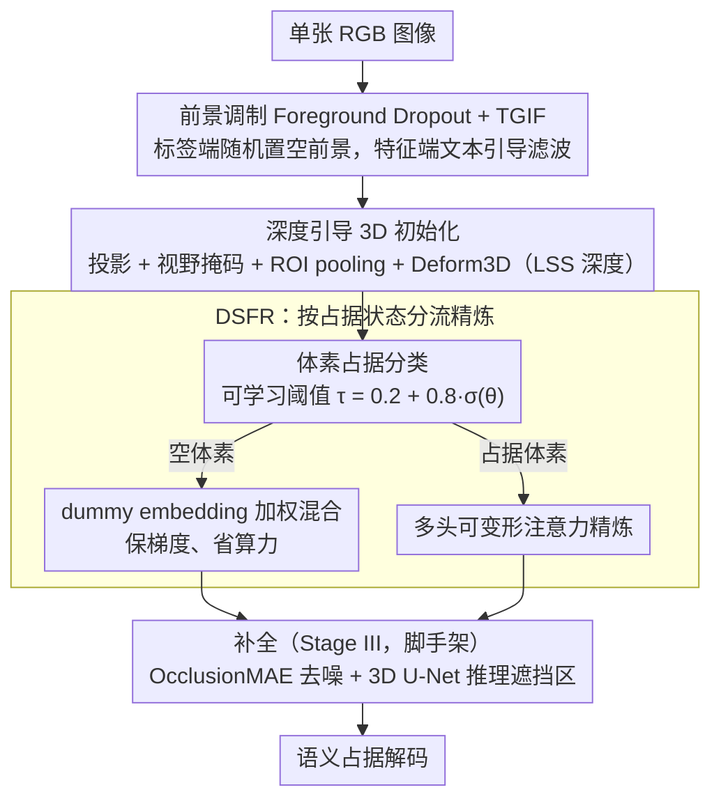

# Sparsity-Aware Voxel Attention and Foreground Modulation for 3D Semantic Scene Completion

**会议**: CVPR 2026  
**arXiv**: [2604.05780](https://arxiv.org/abs/2604.05780)  
**代码**: [https://github.com/xyandtyh/VoxSAMNet](https://github.com/xyandtyh/VoxSAMNet)  
**领域**: 自动驾驶 / 语义场景补全  
**关键词**: 语义场景补全, 体素稀疏性, 前景调制, 可变形注意力, 长尾分布

## 一句话总结

提出 VoxSAMNet，一个显式建模体素稀疏性和语义不均衡的单目语义场景补全框架，通过 Dummy Shortcut 跳过空体素、Foreground Dropout + Text-Guided Image Filter 缓解长尾过拟合，在 SemanticKITTI 上达到 18.19% mIoU 的 SOTA（超越现有单目和立体方法）。

## 研究背景与动机

**领域现状**：单目语义场景补全（SSC）旨在从单张RGB图像重建完整的3D语义场景，是自动驾驶和机器人的关键感知任务。从 MonoScene 的 3D U-Net 到 BEVFormer 的可变形注意力，再到 VoxFormer 的深度引导体素查询，方法不断进步。

**现有痛点**：3D场景存在严重的双重不均衡：(1) **空间不均衡**——SemanticKITTI 中超过93%的体素是空的，只有7%被占据，现有方法对空体素和占据体素一视同仁地处理，浪费大量计算在无信息区域；(2) **语义不均衡**——占据的体素中前景类别（行人、骑行者等）极其稀少，形成长尾分布，模型容易对频繁类过拟合。此外，BEVFormer 等方法将体素投影到2D图像平面时，同一视线上的多个体素投影到相同位置导致特征模糊。

**核心矛盾**：当前的统一处理范式无法区分"有信息"和"无信息"的体素——对空体素的冗余计算不仅低效，还稀释了对占据体素的学习信号；长尾分布导致稀有前景类严重欠表示。

**本文目标** (1) 如何高效地将计算资源集中在占据体素上？ (2) 如何缓解前景稀有类别的长尾过拟合问题？

**切入角度**：显式区分空/占据体素并采用不同处理路径，同时利用文本-视觉跨模态引导来增强前景类别的表征。

**核心 idea**：用共享 dummy 节点跳过空体素+可变形注意力精炼占据体素解决稀疏性，用 Foreground Dropout + TGIF 解决长尾不均衡。

## 方法详解

### 整体框架

VoxSAMNet 要解决的是单目语义场景补全里的一个根本浪费：模型把绝大多数算力花在了根本不该占用注意力的空体素上，又在稀少的前景类上反复过拟合。它的处理路线沿着「先把 2D 特征干净地升到 3D，再按占据状态分流精炼，最后补全去噪」走。给定一张 RGB 图像，先做**文本引导的 3D 初始化**——TGIF 在 2D 特征层面就压掉被 dropout 类别的残响，再借深度引导的体素投影把特征升维到 3D 体素空间；随后进入 **Dummy Shortcut 特征精炼**，体素分类器判断每个体素占据与否，空体素走 dummy 捷径、占据体素用可变形注意力细化；最后用 **MAE 风格的去噪 + 3D U-Net 补全**，对可见体素加噪后推理被遮挡的缺失内容，换取整体完整性与全局一致性，再解码出语义占据。下面这张图按数据流自上而下展开三个阶段，可与后面的关键设计逐一对应：

### 关键设计

**1. Foreground Dropout + Text-Guided Image Filter（TGIF）：标签端正则、特征端强化，双管齐下治长尾**

这是 pipeline 第一阶段（文本引导的 3D 初始化）里的语义调制环节。占据体素里前景类别（行人、骑行者等）极其稀少，形成长尾分布，模型很容易对频繁类过拟合。Foreground Dropout 借的是常规 Dropout 的正则思路，但作用在语义标签层面：训练时以概率 $p$ 随机把部分前景类的 GT 标签替换成空体素标签，逼模型不去死记某几个类别。只是光做标签 dropout 还不够——被抑制类别的残余语义响应仍然留在 2D 特征里。于是 TGIF 接着上场：它根据**保留下来**的类别拼出文本提示（如 "road, building, terrain"），经语言编码器编码后，用自注意力加交叉注意力与图像特征融合，选择性地增强保留类的响应、压掉被 dropout 类别带来的干扰：

$$\mathbf{f}_T = \text{TGIF}(\mathbf{f}, T)$$

两者是协同的——一个在标签端制造扰动、防止模型抓着少数类不放，一个在特征端把这种扰动的效果坐实，把语言提示当成调制图像特征的开关。

**2. 深度引导的 3D 特征初始化：用单目深度先验缓解投影模糊**

调制后的 2D 特征要升维成 3D 体素，这一步决定了后续精炼的起点质量。BEVFormer 一类方法把体素投到 2D 图像平面时，同一条视线上的多个体素会投到同一个像素位置，特征因此糊在一起、难以区分。这里换一种升维方式：每个 3D 体素中心 $P=(x,y,z)^\top$ 先通过相机内外参投影到图像平面 $\tilde{u} = K[R|t]P$，用视野掩码滤掉落在画面外的无效体素；有效体素再做 ROI pooling 从 2D 特征图取特征，并结合 DepthNet 经 LSS 生成的深度体积 $D_p$ 做 3D 可变形注意力精炼：

$$F^{3D}_T(P) = \text{Deform3D}(\text{RoI}(\mathbf{f}_T, \text{box}_P), D_p)$$

引入稠密的单目深度先验，等于在 2D→3D 的升维过程里给每个体素加了"它大概在多远"的约束，从而把原本沿视线挤在一起的体素特征区分开，减少投影模糊。

**3. Dummy Shortcut for Feature Refinement（DSFR）：按占据状态分流，把算力还给那 7% 有信息的体素**

拿到初始 3D 体素后进入第二阶段精炼。SemanticKITTI 里超过 93% 的体素是空的，可现有方法对空体素和占据体素一视同仁，既浪费计算，又把宝贵的学习信号稀释在了无信息区域。DSFR 先用 3D 卷积叠一个 $1\times1\times1$ 卷积加 sigmoid 预测占据概率图 $P_\text{occu}$，再用一个可学习阈值 $\tau = 0.2 + 0.8 \cdot \sigma(\theta)$ 把体素切成占据集 $M_o$ 和空集 $M_e$。关键在于空体素不是被硬丢弃——那样会切断梯度流——而是与一个可学习的 dummy embedding $\mathbf{Em}$ 按占据概率做加权混合：

$$F(P) \leftarrow F(P) \odot P_\text{occu} + \mathbf{Em} \odot P_\text{emp}$$

占据体素这一侧则走多头可变形注意力：预测采样偏移和注意力权重，在体素投影到图像上的位置附近采样 2D 特征后加权聚合。这样一来，真正昂贵的注意力精炼只发生在约 7% 的体素上，空体素用一个全局共享的 dummy 节点保持表示一致、梯度连续，而可学习阈值又让"占据/空"这条分界随训练自适应，比写死的固定阈值更灵活。精炼后的体素再交给第三阶段的 OcclusionMAE 去噪 + 3D U-Net 推理被遮挡区域（沿用已有补全范式，非本文核心贡献），最后解码出语义占据。

### 损失函数 / 训练策略

总损失由两部分组成：

- SSC损失：$\mathcal{L}_{ssc} = \mathcal{L}_{sem} + \mathcal{L}_{geo} + \mathcal{L}_{ce} + \mathcal{L}_{depth}$（语义亲和力损失+几何损失+交叉熵+深度损失）
- 占据损失：$\mathcal{L}_{occ} = \mathcal{L}_p + \mathcal{L}_r + \mathcal{L}_s$（精度/召回/特异性的 BCE 项）
- 总计：$\mathcal{L}_{total} = \mathcal{L}_{ssc} + \mathcal{L}_{occ}$

## 实验关键数据

### 主实验

SemanticKITTI 隐藏测试集（单帧方法）：

| 方法 | 年份 | IoU↑ | mIoU↑ |
|------|------|------|-------|
| MonoScene | CVPR2023 | 34.16 | 11.08 |
| CGFormer | NeurIPS2024 | 44.41 | 16.63 |
| VisHall3D | ICCV2025 | 46.50 | 17.46 |
| DISC | ICCV2025 | 45.32 | 17.35 |
| **VoxSAMNet** | **CVPR2026** | **47.88** | **18.19** |

超越立体/多视角方法：ScanSSC (17.40), VLScene (17.52)。
超越时序方法：FlowScene (17.70)。仅次于使用时序信息的 SOAP (19.09)。

SSCBench-KITTI-360 测试集（单帧方法中最优）：IoU 47.22, mIoU 20.23（超越 VLScene 的 19.10）。

### 消融实验

各组件的贡献（从论文中需确认具体数值，但 DSFR 和 TGIF 各自独立贡献显著提升，占据分类的可学习阈值比固定阈值更优）。

### 关键发现

- 超过93%体素为空的统计数据直接支撑了稀疏感知设计的必要性
- 在 car 等频繁类上提升有限，但在 bicycle (4.4)、motorcycle (3.9) 等长尾类上有改善
- DSFR 的 dummy shortcut 通过概率加权混合（而非硬切换）保持了梯度流的连续性
- VoxSAMNet 作为单帧单目方法超越了立体和多视角方法，证明了稀疏感知+语义引导设计的有效性
- 在 KITTI-360 上同样达到 SOTA，验证了跨数据集的泛化性

## 亮点与洞察

- **"93%体素是空的"这一观察驱动的设计**：简单但有力的出发点，让整个方法都围绕核心矛盾展开
- **Dummy Shortcut 的优雅设计**：不是简单跳过空体素（会断裂梯度流），而是用共享 dummy embedding 加权混合，保持表示连续性
- **Foreground Dropout + TGIF 的协同**：标签端和特征端双管齐下解决长尾问题，思路新颖
- **文本-视觉跨模态引导**：将 CLIP/GroundingDINO 的思想引入 SSC，通过语言提示调制图像特征

## 局限与展望

- 部分极端长尾类（如 motorcyclist 仅 0.5 mIoU）仍然改善有限
- TGIF 的文本提示由保留的类别名称简单拼接，缺乏对空间关系的描述
- 可学习阈值的范围 [0.2, 1.0] 是人工设定的，对不同场景的适应性值得探究
- 未利用时序信息，与使用时序的 SOAP (19.09) 仍有差距
- dummy embedding 是全局共享的单一向量，可以探索基于空间位置条件化的 dummy 表示

## 相关工作与启发

- **MonoScene**：SSC 的基础工作，VoxSAMNet 继承了其场景类亲和力损失
- **BEVFormer**：引入可变形注意力但对空/占据体素一视同仁，VoxSAMNet 改进了这一点
- **VoxFormer / CGFormer**：深度引导的体素查询方法，但缺乏显式稀疏感知
- **CLIP / GroundingDINO**：跨模态对齐思路启发了 TGIF 的设计
- Foreground Dropout 的思路可能对其他长尾3D感知任务（如3D检测）同样有效

## 评分

- **新颖性**: ⭐⭐⭐⭐ Dummy Shortcut 和 TGIF 的设计新颖，"稀疏感知+语义引导"的框架视角清晰
- **实验充分度**: ⭐⭐⭐⭐ 两个标准基准上的全面比较，包含与立体/时序方法的对比
- **写作质量**: ⭐⭐⭐⭐ 动机明确，93%空体素的统计数据有说服力，模块描述清晰
- **价值**: ⭐⭐⭐⭐ 单目方法超越立体方法是重要贡献，稀疏感知设计对资源受限的自动驾驶部署有实际意义

<!-- RELATED:START -->

## 相关论文

- [\[CVPR 2026\] OccuFly: A 3D Vision Benchmark for Semantic Scene Completion from the Aerial Perspective](occufly_a_3d_vision_benchmark_for_semantic_scene_completion_from_the_aerial_pers.md)
- [\[AAAI 2026\] Towards 3D Object-Centric Feature Learning for Semantic Scene Completion](../../AAAI2026/autonomous_driving/towards_3d_object-centric_feature_learning_for_semantic_scene_completion.md)
- [\[AAAI 2026\] Unleashing Semantic and Geometric Priors for 3D Scene Completion](../../AAAI2026/autonomous_driving/unleashing_semantic_and_geometric_priors_for_3d_scene_completion.md)
- [\[ECCV 2024\] Hierarchical Temporal Context Learning for Camera-based Semantic Scene Completion](../../ECCV2024/autonomous_driving/hierarchical_temporal_context_learning_for_camera-based_semantic_scene_completio.md)
- [\[CVPR 2026\] Points-to-3D: Structure-Aware 3D Generation with Point Cloud Priors](points-to-3d_structure-aware_3d_generation_with_point_cloud_priors.md)

<!-- RELATED:END -->
