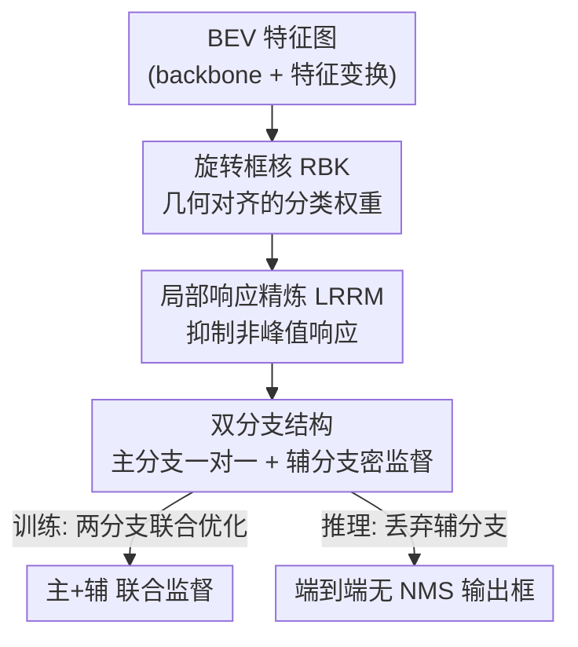

# Spe-BEVHead: Rethinking the Detection Head Design for Bird's-Eye-View Object Detection

**会议**: CVPR 2026  
**论文**: [CVF Open Access](https://openaccess.thecvf.com/content/CVPR2026/html/Zhang_Spe-BEVHead_Rethinking_the_Detection_Head_Design_for_Birds-Eye-View_Object_Detection_CVPR_2026_paper.html)  
**代码**: 待确认  
**领域**: 自动驾驶 / 3D 目标检测  
**关键词**: BEV 检测、检测头、旋转框核、端到端检测、双分支  

## 一句话总结
针对自动驾驶 BEV 3D 检测长期沿用 2D center-based 检测头带来的「高斯核几何错配 / 去 NMS 后性能崩 / 监督信号稀疏」三大问题，本文提出 Spe-BEVHead，用旋转框核（RBK）+ 局部响应精炼模块（LRRM）+ 双分支结构作为可即插即用的检测头，在 nuScenes 上换头即涨点，并在端到端（无 NMS）设定下仍保持竞争力。

## 研究背景与动机
**领域现状**：鸟瞰图（Bird's-Eye-View, BEV）检测已成为自动驾驶 3D 目标检测的主流范式，因为它把多相机特征统一到一个俯视平面，天然适合多传感器融合与 360° 场景理解。近年的进展主要落在「怎么把多视角图像特征更好地抬升/聚合成高质量 BEV 表征」上，比如更准的深度估计、更快的视角变换、更有效的池化。

**现有痛点**：几乎所有 LSS（Lift-Splat-Shoot）系检测器把大量精力花在 BEV 特征构造上，却**直接照搬 2D 检测里的 center-based 检测头**（CenterNet 那套），没有为 BEV 任务做任何针对性优化。作者指出这带来三个内生缺陷：(i) 分类用的高斯核与真实 BEV 目标存在几何错配；(ii) 去掉 NMS 后端到端性能严重退化；(iii) 监督信号过于稀疏。

**核心矛盾**：2D 与 BEV 两个平面的「目标尺寸 ↔ 特征分辨率」关系差异巨大。2D 图像里目标往往很大，高斯核基本被框在 GT 框内；而 BEV 与物理世界几何绑定，目标极小（FastBEV 中 128×128 的 BEV 图上一辆车不到 20 个像素），照搬 2D 的高斯半径计算会算出过大的核，越界把背景像素也压权重，监督就错了。同时 BEV 目标尺寸固定、几乎不重叠，这反而是 2D 没有的「好性质」，却没人利用。

**本文目标**：不动 backbone 和特征变换模块，只**重新设计检测头**，分别解决上述三个缺陷，并保持「一对一匹配、可端到端无 NMS」的范式。

**切入角度**：作者逐条解剖 center-based 头的每个模块在 BEV 下「为什么不合适」，再针对 BEV 特有的几何/分布性质（小目标、固定尺寸、少重叠、属性多）做对症改造。

**核心 idea**：用几何对齐的旋转框核替换各向同性高斯核；用一个局部非峰值抑制模块让卷积响应足够"尖"，从而真正去掉 NMS；用主/辅双分支在训练时加密监督、推理时只留主分支，既补足稀疏监督又不破坏端到端推理。

## 方法详解

### 整体框架
BEV 检测网络的通用流水线是：多视角图像 → 图像 backbone 提特征 → 特征变换模块（Transformer 系或 LSS 系）转成 BEV 表征 → 检测头出框。本文只改最后一步的检测头。Spe-BEVHead 把检测头做成**双分支**结构：主分支（main branch）严格一对一匹配、负责最终推理；辅分支（auxiliary branch）在训练时引入更多正样本、加密回归监督，推理时丢弃。两条分支内部分别嵌入两个 BEV 专用组件——旋转框核（RBK）负责生成几何对齐的分类权重，局部响应精炼模块（LRRM）负责把卷积响应锐化、抑制非峰值，从而支撑去 NMS 的端到端推理。

### 关键设计

**1. 旋转框核 RBK：让分类权重贴合 BEV 目标的真实几何**

针对「高斯核越界、错误压低背景权重」的痛点，作者用一个**旋转的椭圆衰减核**替换各向同性高斯核。对每个投影到 BEV 平面的 GT 框（中心 $k=(k_x,k_y)$、尺寸 $(w,l)$、偏航角 $\theta$、类别 $c$），先把像素坐标旋转平移到框的局部坐标系：$[x_\ell, y_\ell]^\top = R(\theta)\,[x-k_x, y-k_y]^\top$，再算归一化椭圆距离 $d(x,y)=\sqrt{(2x_\ell/w)^2+(2y_\ell/l)^2}$。框内（$d\le 1$）像素的热图值取 $H_{xyc}\leftarrow\max(H_{xyc},\,K\cdot\mathrm{clip}(1-\gamma d^2, v_{\min}, 1))$，框外（$d>1$）直接置 0；其中 $K=1$ 为中心值，$v_{\min}=0.1$ 为边界值，$\gamma=1-v_{\min}$ 控制衰减率。这样核**显式编码了目标的朝向与长宽比**，权重严格限制在框内并随距离中心衰减，不再像高斯核那样把框外背景误判成"近中心负样本"。消融里二次衰减（Q）+ 边界值 0.1 最优。

**2. 局部响应精炼模块 LRRM：把卷积响应锐化到能真正去 NMS**

针对「号称端到端却仍要 NMS」的痛点：center-based 头虽然设了一对一匹配，但卷积层产生的响应不够尖锐、不够判别，实践中仍要靠池化/NMS 去冗余。LRRM 利用 BEV 的好性质——目标几乎不重叠、类别少，所以可以**在局部安全地抑制非峰值**而不误伤邻近目标（这在 2D 里因目标重叠、纹理依赖强而很难做）。其核心是自适应均值衰减算子（Adaptive Mean Attenuation, AMA）：若中心像素 $F(x,y)$ 是其 $k\times k$ 邻域 $N_k(x,y)$ 内的最大值则保留；否则减去邻域均值 $F'(x,y)=F(x,y)-\frac{1}{k^2}\sum_{(i,j)\in N_k}F(i,j)$，压低非峰值。LRRM 由若干卷积+非线性+AMA 组成，可端到端训练，推理时直接抑制非峰位置、显著提升端到端表现。消融显示重复 2 次、局部尺寸 (3,3) 最佳，且 AMA 优于纯 max pooling。

**3. 主/辅双分支结构：在不破坏一对一匹配的前提下加密监督**

针对「监督信号稀疏」的痛点：BEV 回归要预测中心偏移、离地高度、偏航 $(\sin\theta,\cos\theta)$、3D 尺寸 $(w,l,h)$、速度 $v$ 等众多属性，但 center-based 头只在目标中心一个像素上回归，监督极稀疏；再加上下采样/特征模糊导致峰值与真实质心错位，需要近中心的定位精修能力。作者把头拆成结构相似但细节不同的两支：**主分支**分类+回归都严格一对一（分类前先过 LRRM），保证端到端推理范式；**辅分支**的回归头放弃严格一对一，固定取「目标中心 + 8 邻域」共 9 个样本参与回归（不动态搜索是因 BEV 特征太大搜索代价高、不外扩半径是为避免取到框外像素、不取框内全部像素是因大目标的边缘与中心不该共享同一回归目标），而辅分支的**分类头仍保持一对一**以避免「同一格点在主分支算负、辅分支算正」的标签歧义；不过辅分支分类损失用 RBK 加权，相当于一个"软化的一对一匹配"。训练时两支联合回传梯度，**推理时丢弃辅分支、只用主分支**——既补足了监督密度，又不增加推理开销、不破坏端到端。

### 损失函数 / 训练策略
总损失为主、辅两分支的分类+回归损失之和：$L=\lambda_{cls}L^{cls}_M+\lambda_{reg}L^{reg}_M+\lambda_{cls}L^{cls}_A+\lambda_{reg}L^{reg}_A$，典型设 $\lambda_{cls}=4\lambda_{reg}$，回归用 L1 损失。主分支分类用 focal loss；辅分支分类的 focal loss 里负样本项乘以 RBK 赋的权重 $H_{xyc}$（即 $(1-H_{xyc})^\beta$ 因子），实现近中心负样本的惩罚软化。训练用 AdamW、学习率 2e-4、batch 64、ResNet-50 backbone、图像 256×704、20 epoch + CBGS。

## 实验关键数据

### 主实验
数据集为 nuScenes（1000 个 20 秒驾驶场景、6 路相机 + LiDAR、约 140 万个 3D 框、10 类）。评测用 nuScenes 协议：mAP（基于 2D 中心距离判 TP）、NDS（综合分），以及 mATE/mASE/mAOE/mAVE/mAAE 五项误差。把多种 LSS 基线的原检测头**原样替换**为 Spe-BEVHead、其余部件不动：

| 基线模型 | 帧数/BEV尺寸 | NDS↑ | mAP↑ | mATE↓ |
|--------|------|------|------|------|
| FastBEV | 1 / 128² | 38.4 | 29.5 | 74.9 |
| + Spe-BEVHead | 1 / 128² | **40.1** (+1.7) | **30.6** (+1.1) | **69.7** (−5.2) |
| BEVDet4D | 2 / 128² | 44.4 | 31.5 | 69.2 |
| + Spe-BEVHead | 2 / 128² | **45.3** | **32.6** | 69.1 |
| BEVStereo4D | 2 / 128² | 49.5 | 38.1 | 58.9 |
| + Spe-BEVHead | 2 / 128² | **49.9** | 37.6 | 58.2 |
| GeoBEV4D (前SOTA) | 2 / 256² | 54.0 | 42.9 | 55.0 |
| + Spe-BEVHead | 2 / 256² | **54.6** | 42.7 | 54.8 |

换头在主指标（NDS / mAP / mATE）上普遍带来提升，FastBEV 上最明显（+1.7 NDS / +1.1 mAP / −5.2 mATE）；接到前 SOTA 的 GeoBEV 上刷新 SOTA（54.6 NDS）。⚠️ 个别基线（如 FastBEV4D）NDS 略有波动，以原文为准。

### 端到端（无 NMS）实验
取分类分前 150、丢弃分数 <0.1 的预测作为输出：

| 模型 | 后处理 | NDS↑ | mAP↑ |
|------|------|------|------|
| FastBEV | None | 34.5 | 21.9 |
| FastBEV | NMS | 38.4 | 29.5 |
| + Spe-BEVHead | None | **37.9** | **26.2** |
| + Spe-BEVHead | Pooling | **39.9** | 28.3 |

FastBEV 去掉后处理直接掉 7.6 mAP / 3.9 NDS，而换上 Spe-BEVHead 即使**完全无后处理**也保持可靠（在 FastBEV 上比 center-based 头 +3.4 NDS / +7.6 mAP），再叠 max-pooling NMS 即可追平标准 NMS。

### 消融实验（FastBEV，端到端设定）
| 配置 (DB / RBK / LRRM) | NDS↑ | mAP↑ | 说明 |
|------|------|------|------|
| 全部去除 | 34.5 | 21.9 | center-based 头 |
| + DB | 36.6 | 26.0 | 双分支：+2.1 NDS / +4.1 mAP |
| + DB + RBK | 37.3 | 26.0 | 旋转框核：+0.7 NDS |
| + DB + RBK + LRRM | 37.9 | 26.2 | LRRM：+0.6 NDS / +0.2 mAP |

### 关键发现
- **双分支贡献最大**（+2.1 NDS / +4.1 mAP），说明端到端设定下"监督稀疏"才是主瓶颈，加密监督收益最高；RBK 与 LRRM 各再补 0.6–0.7 NDS。
- RBK 超参上二次衰减 + 边界值 0.1 最优，边界值升到 0.3/0.5 反而略掉点（核内权重衰减过缓，又把近边缘当成强正样本）。
- LRRM 的 AMA 算子优于纯 max pooling，重复 2 次、局部尺寸 (3,3) 最佳；局部窗口过大反而掉点。
- 方法是**即插即用换头**，对从 FastBEV 到 GeoBEV 的一众 LSS 基线都能涨点，证明检测头确实是被长期忽视的提升点。

## 亮点与洞察
- **重新审视"被忽视的检测头"**：当全行业都在卷 BEV 特征构造时，作者指出沿用 2D 检测头本身就是个未被针对性优化的瓶颈，这个切入点很巧。
- **把 BEV 的"约束"变成"红利"**：2D 里目标重叠、类别多让局部非峰值抑制很难做；BEV 里目标固定尺寸、少重叠反而让 LRRM 这种局部抑制变得安全可行——同一个 idea 在 BEV 才成立。
- **训练辅推理弃的双分支思路可迁移**：用辅分支加密监督、推理时丢弃，是一种"零推理成本提监督密度"的通用 trick，可迁移到其他稀疏监督的关键点/检测任务。

## 局限与展望
- 实验只在 nuScenes 上验证，未在 Waymo / Argoverse 等其它驾驶数据集上交叉验证泛化性。
- 收益高度依赖 BEV 目标"少重叠、固定尺寸"的假设；在拥挤路口/密集目标场景下 LRRM 的局部抑制是否仍安全，论文未深入讨论。⚠️ 这是自己发现的潜在局限。
- 仅针对 LSS 系（center-based 头）做改造；对 Transformer/DETR 系 BEV 检测器的检测头是否有同等收益，未涉及。
- 部分基线在装上 Spe-BEVHead 后 mAP 略降（如 BEVStereo4D），说明换头并非对所有基线都全指标单调提升。

## 相关工作与启发
- **vs center-based 头（CenterNet）**: 他们用各向同性高斯核 + 单中心像素回归 + 严格一对一匹配；本文用几何对齐的旋转框核 + 双分支密集监督 + LRRM 锐化响应，区别在于把每个模块都针对 BEV 的几何/分布性质重做，优势是换头即涨且端到端不崩。
- **vs Transformer 系 BEV（BEVFormer/DETR3D）**: 它们天然端到端但计算重、推理慢；本文走 LSS + 卷积头路线，在保持高效的同时把端到端能力补回来。
- **vs 2D 端到端检测（YOLOv10/OneNet/DeFCN）**: 这些靠双标签分配或独特一对一分配去冗余框；本文借鉴"丰富监督 + 抑制冗余"的思路，但把抑制做成了利用 BEV 无重叠性质的 LRRM。

## 评分
- 新颖性: ⭐⭐⭐⭐ 切入点（重做检测头）新颖，三个组件都对症 BEV 性质，但都是已有思路的 BEV 化改造
- 实验充分度: ⭐⭐⭐⭐ 跨多个 LSS 基线 + 端到端设定 + 细致组件/超参消融，但仅限 nuScenes 单数据集
- 写作质量: ⭐⭐⭐⭐ 三缺陷→三组件的逻辑链清晰，公式与动机对应明确
- 价值: ⭐⭐⭐⭐ 即插即用、对实际 BEV 检测部署（尤其去 NMS 端到端）有直接工程价值

<!-- RELATED:START -->

## 相关论文

- [\[CVPR 2026\] BEV-SLD: Self-Supervised Scene Landmark Detection for Global Localization with LiDAR Bird's-Eye View Images](bev-sld_self-supervised_scene_landmark_detection_for_global_localization_with_li.md)
- [\[CVPR 2026\] BEV-CAR: Enhancing Monocular Bird's Eye View Segmentation with Context-Aware Rasterization](bev-car_enhancing_monocular_birds_eye_view_segmentation_with_context-aware_raste.md)
- [\[CVPR 2026\] CycleBEV: Regularizing View Transformation Networks via View Cycle Consistency for Bird's-Eye-View Semantic Segmentation](cyclebev_regularizing_view_transformation_networks_via_view_cycle_consistency_fo.md)
- [\[CVPR 2026\] A Prediction-as-Perception Framework for 3D Object Detection](a_prediction-as-perception_framework_for_3d_object_detection.md)
- [\[CVPR 2026\] SToRe3D: Sparse Token Relevance in ViTs for Efficient Multi-View 3D Object Detection](store3d_sparse_token_relevance_in_vits_for_efficient_multi-view_3d_object_detect.md)

<!-- RELATED:END -->
