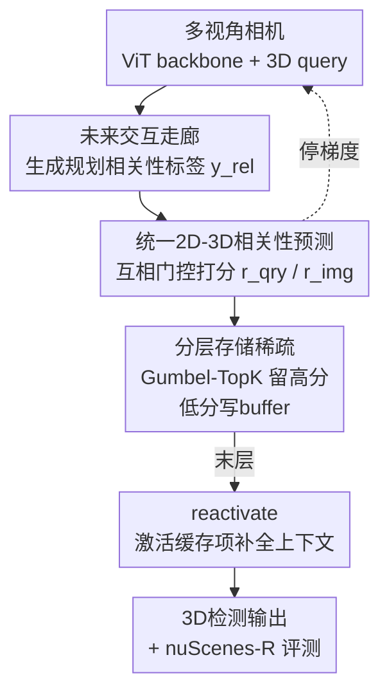

# SToRe3D: Sparse Token Relevance in ViTs for Efficient Multi-View 3D Object Detection

**会议**: CVPR2026  
**arXiv**: [2605.14110](https://arxiv.org/abs/2605.14110)  
**代码**: 待确认  
**领域**: 自动驾驶 / 多视角3D检测  
**关键词**: 多视角3D检测, ViT稀疏化, token/query剪枝, 规划相关性, nuScenes

## 一句话总结
SToRe3D 给基于 ViT 的多视角 3D 检测器加上一套「规划对齐」的联合稀疏框架：用轻量相关性头同时给 2D 图像 token 和 3D 物体 query 打分，把低分项不是丢掉而是写进缓存、末层再激活，使推理最高提速 3×、近乎不掉精度，且在「规划关键智能体」上精度几乎无损。

## 研究背景与动机
**领域现状**：自动驾驶里主流的相机多视角 3D 检测器（DETR3D、PETR、StreamPETR、BEVFormer、Sparse4D 等）都靠 ViT backbone + DETR 式 decoder：ViT 在多路相机的长 token 序列上做自注意力，decoder 用大量 3D query 跨视角检索。两者都是 token / query 数量上的 $\mathcal{O}(N^2)$ 复杂度，难以做到实时部署。

**现有痛点**：城市场景里绝大多数 token 是背景（天空、马路、楼房），绝大多数候选 agent 对自车近期规划无关紧要（远处的、停着的、不会交互的）。可现有检测器对所有 token、所有候选物体一视同仁地花算力，既浪费又把感知和下游规划目标对错了焦。已有的效率方法又都「只管一边」：ViT token 剪枝方法（DynamicViT、ToMe、SViT 等）只裁 2D 图像 token、假设的是 2D 显著性；DETR 稀疏化（Sparse-DETR、Focus-DETR）只动 encoder token 或 decoder query。专门面向多视角 3D 的 ToC3D 也只压 backbone token，且依赖历史 query 做 merge–unmerge，首帧用不上、每层重新分组还有额外开销。

**核心矛盾**：要实时就得砍算力，但「砍哪里」不能只看 2D 像素显著性——真正该保的是对规划安全关键的 agent。而现有方法既没把 2D token 和 3D query 端到端一起稀疏化，也没人把「规划相关性」当作稀疏的监督信号；连评测基准 nuScenes 也对所有标注 agent 等权，远处不交互的目标误差能主导指标，无法聚焦最该测的那批 agent。

**本文目标**：（1）在单一架构内端到端联合稀疏 token 和 query；（2）让稀疏预算对齐规划，把算力花在自车近期要反应的 agent 上；（3）在激进稀疏下仍能稳定训练、不掉关键精度；（4）提供一个只在规划关键 agent 上测精度的评测协议。

**切入角度**：作者先用一个固定的预训练运动规划网络做分析——发现规划性能在只喂 10–20 个 agent 时就饱和了（平均每帧真正相关的 agent 约 3 个），说明绝大部分感知算力是可省的，关键是「相关性」怎么定义和监督。

**核心 idea**：用一个「未来交互走廊」（future interaction corridor）定义 agent 的规划相关性作为监督，学一个统一的 2D–3D 相关性函数路由 token 和 query；低相关项不硬剪、而是 store 进缓存末层再 reactivate，从而避免不可逆剪枝带来的精度坍塌。

## 方法详解

### 整体框架
SToRe3D 建在一个时序多视角 3D 检测器（StreamPETR 式）之上：$V$ 路同步相机经 ViT backbone 出 token $\mathbf{X}_t$，3D query $\mathbf{Q}_t$ 锚在 3D 位置上、由 DETR3D 式可变形解码器跨多尺度 FPN 特征检索，top-$K$ query 还跨帧传播进时序记忆。SToRe3D 在这条主干上插入「相关性头 + 分层存储」：每个 stage 用轻量相关性头给每个 token 和 query 打一个标量相关分，高分的留下往深层走，低分的写进缓存 buffer（而非丢弃），到 backbone / decoder 的最后一层再用更新后的上下文把缓存项激活回来。相关性有两种监督口径——规划对齐 $r^{\text{plan}}$（只保自车近期要反应的 agent）和检测对齐 $r^{\text{det}}$（保所有前景、拒背景杂波）。整套框架端到端联合稀疏 ViT backbone 的 token 和 DETR decoder 的 query，是首个在两条轴上都做 query+key 稀疏的多视角 3D 检测方法。

### 关键设计

**1. 未来交互走廊：把「规划关键」翻译成可监督的几何标签**

这是整个相关性监督的源头，针对「现有稀疏只看 2D 显著性、没人监督规划相关性」这个痛点。直觉上「规划关键」是指自车近期可能要对它做反应的 agent（前车、横穿行人）。作者把它形式化为 BEV 上的扫掠走廊：对自车和 agent-$i$，在 $\tau\in[0,H]$ 的未来时窗里取定向框 $\mathcal{B}(\tau)$ 的并集凸包得到扫掠集 $\mathcal{S}_i(H)=\mathrm{conv}\big(\bigcup_{\tau\in[0,H]}\mathcal{B}_i(\tau)\big)$；当 agent 扫掠多边形与自车扫掠多边形的最近距离不超过裕度 $d_{\min}$，就判为相关：

$$y_i^{\mathrm{rel}}=\mathbb{1}\big(\mathrm{dist}(\mathcal{S}_i(H),\mathcal{S}_{\mathrm{ego}}(H))\le d_{\min}\big).$$

取 $H=5$ 秒、$d_{\min}$ 设为 nuScenes 上自车–agent 距离的 10 分位数（约 1.2 m），平均每帧约 3 个相关 agent、至多约 30 个。这套标签既监督相关性头，也同时定义了评测基准 nuScenes-R 的「相关」口径，做到训练与评测对齐。

**2. 统一 2D–3D 相关性预测：query 和 token 互相提供上下文**

针对「2D token 显著性和 3D query 各算各的、对不上」这个痛点，作者用互相门控（mutual gating）把两条模态绑在一起打分。对 query $\mathbf{q}_j$，先从可变形交叉注意力得到的 token 上下文（可选拼上自车嵌入 $\mathbf{e}_t$）算上下文向量 $\mathbf{c}^{\mathrm{qry}}_j=\mathrm{CrossAttn}_{\text{def}}(\mathbf{q}_j,\mathbf{X}_t)\oplus\mathbf{e}_t$，再过小 MLP 得 query 相关分 $r^{\mathrm{qry}}_j=\sigma(\mathbf{u}^\top\phi([\mathbf{q}_j\|\mathbf{c}^{\mathrm{qry}}_j]))$；自车项让相关性能依赖自车–agent 的相对运动。token 相关分则反过来由 top-$K$ 高相关 query 的注意力聚合而成：

$$r^{\mathrm{img}}_i=\tfrac{1}{K}\sum_{j\in\mathcal{K}^{\mathrm{qry}}}A_{j\rightarrow i},$$

即 token 相关性是「被高相关 3D query 支持的区域」。query 相关分用走廊标签 $y^{\mathrm{rel}}$ 直接监督，token 相关分则通过与 query 的交叉注意力被间接监督——这样 2D 的算力分配天然跟着「规划要关注的 3D 物体」走。

**3. 分层 store–reactivate 稀疏：低分项不丢、写缓存末层再激活**

针对 ToC3D 那种硬剪 / merge–unmerge 的缺陷（首帧用不上、重分组开销、激进稀疏下坍塌），作者每个 stage 把 token / query 切成「继续往前的小活跃集」和「暂存缓存的非活跃集」。用 Gumbel-softmax 的可微 TopK 按相关分留下比例 $\rho_\ell\in(0,1]$：$\mathcal{K}_\ell=\mathrm{TopK}(\mathbf{r}_\ell,\lfloor\rho_\ell N_\ell\rfloor)$，被滤掉的写进 buffer：$\mathbf{S}^{\mathrm{img}}_\ell\leftarrow\mathbf{X}_\ell[\overline{\mathcal{K}}^{\mathrm{img}}_\ell]$、$\mathbf{S}^{\mathrm{qry}}_\ell\leftarrow\mathbf{Q}_\ell[\overline{\mathcal{K}}^{\mathrm{qry}}_\ell]$。保留比例随深度非增（两级调度：深度方向预算 $\rho_\ell$ 单调下降）。到 backbone / decoder 的最后一层，再用更新后的上下文把缓存的 token 和 query 激活回来补全全局上下文——这条「可检索回来」的路径让早期剪枝错误可被纠正，避免不可逆丢失，且只加极小开销。配合训练时「从稠密线性 warm-up 到目标稀疏」的渐进剪枝，能在高稀疏下稳定收敛、无需额外 finetune。

**4. 双口径相关性 + nuScenes-R 评测：训练与评测都对齐规划**

同一套相关性框架支持两个变体：规划对齐 $r^{\text{plan}}$ 用走廊标签监督，专保自车近期要反应的 agent；检测对齐 $r^{\text{det}}$ 用标准前景/背景标签（匹配到 GT 框的 query 算相关），保全部前景。评测侧，作者提出 nuScenes-R：在标准 mAP/NDS 之外，增加只在规划关键 agent 上算的相关性指标——relevant-motion（RM，用未来走廊过滤，记 NDS-RM）和 relevant-area（RA，用自车周围固定区域过滤，记 mAP-RA/NDS-RA）。因为 RM 用到了特权未来信息，检测只对 RM 过滤后的 GT 算 TP/FP，FN 难算故主要看 NDS-RM。这样既能公平衡量「关键 agent 上精度是否保住」，又能体现效率收益。

### 损失函数 / 训练策略
端到端多任务目标：$\mathcal{L}=\mathcal{L}_{\text{det}}+\lambda_{\text{rel}}\mathcal{L}^{\text{qry}}_{\text{rel}}+\lambda_{\text{aux}}\mathcal{L}_{\text{aux}}$。其中 $\mathcal{L}_{\text{det}}$ 是 focal 分类 + L1 框回归 + 匈牙利二分匹配；$\mathcal{L}^{\text{qry}}_{\text{rel}}$ 是对 $r^{\text{qry}}$ 与二值相关标签 $y^{\text{rel}}$ 的高斯 focal loss；$\mathcal{L}_{\text{aux}}$ 在 2D 图像空间监督 ROI 特征抽取。关键技巧：**把相关性头的梯度在输入 query / token 处 stop-gradient**，让端到端梯度只经检测损失流回 token/query，防止相关性头干扰主检测器的特征学习；token 相关性仅通过与 query 的交叉注意力间接监督。Gumbel-TopK 提供可微路由，剪枝预算在训练迭代中从稠密线性升到目标稀疏。骨干用 EVA-02 初始化的 ViT-B/L，输入 320×800，decoder 6 层、$D=256$、900 个 query（644 检测 + 256 时序），4 帧记忆，24 epoch、8×A100 训练，单 RTX3090、batch 1 测延迟。三个工作点 SToRe3D-1/2、1/3、1/10 分别约保留一半、三分之一、十分之一的 token/query。

## 实验关键数据

### 主实验
nuScenes 验证集，相同 ViT backbone 家族下与稠密 StreamPETR、token-only 的 ToC3D 对比（同延迟组对照）：

| 方法 | Backbone×宽-稀疏 | mAP↑ | mAP-RA↑ | NDS↑ | NDS-RM↑ | FPS↑ |
|------|------------------|------|---------|------|---------|------|
| StreamPETR | ViT-B×800 | 0.497 | 0.627 | 0.584 | 0.443 | 6.1 |
| ToC3D-Fast | ViT-B×800-1/2 | 0.46 | 0.615 | 0.562 | 0.431 | 6.6 |
| **SToRe3D-1/2** | ViT-B×800-1/2 | 0.493 | 0.627 | 0.581 | 0.441 | **8.2** |
| **SToRe3D-1/3** | ViT-B×800-1/3 | 0.489 | 0.623 | 0.578 | 0.435 | **10.6** |
| **SToRe3D-1/10** | ViT-B×800-1/10 | 0.479 | 0.612 | 0.571 | 0.43 | **17.7** |
| StreamPETR | ViT-L×800 | 0.521 | 0.641 | 0.608 | 0.485 | 2.2 |
| ToC3D-Fast | ViT-L×800-1/2 | 0.523 | 0.639 | 0.610 | 0.463 | 2.5 |
| **SToRe3D-1/2** | ViT-L×800-1/2 | **0.533** | **0.666** | **0.618** | 0.475 | 2.7 |
| **SToRe3D-1/10** | ViT-L×800-1/10 | 0.521 | 0.641 | 0.607 | 0.478 | **5.2** |

关键读数：SToRe3D-1/10（ViT-B）以约 18 FPS 实现实时多视角 3D 检测，是同延迟段的 SOTA；ViT-L 上 SToRe3D-1/10 相对稠密 StreamPETR 把 FPS 从 2.2 拉到 5.2（约 2.4×）而 mAP/NDS 几乎不掉，NDS-RM 甚至更高（0.478 vs 0.463），说明算力省在了不该花的地方、关键 agent 反而保得更好。同 backbone 下 SToRe3D 全面优于 token-only 的 ToC3D。

### 消融实验
匹配总保留率（TKR）下不同稀疏策略对比（ViT-L，相对稠密 StreamPETR）：

| 稀疏策略 | TKR | NDS↑ | mAP↑ | FPS↑ |
|----------|-----|------|------|------|
| StreamPETR（稠密） | 1 | 0.614 | 0.533 | 2.15 |
| + Random | 0.5 | 0.567 (-7.7%) | 0.465 (-12.8%) | 2.45 |
| + DynamicViT | 0.5 | 0.597 (-2.8%) | 0.505 (-5.3%) | 2.47 |
| + ToC3D-Fast | 0.5 | 0.61 (-0.7%) | 0.523 (-1.9%) | 2.43 |
| **+ SToRe3D-1/2** | 0.5 | **0.618 (+0.7%)** | **0.533 (0%)** | **2.70** |
| + ToC3D-Faster | 0.3 | 0.603 (-1.8%) | 0.512 (-3.9%) | 2.89 |
| **+ SToRe3D-1/3** | 0.3 | **0.609 (-0.8%)** | **0.523 (-1.9%)** | **3.51** |
| **+ SToRe3D-1/10** | 0.1 | 0.607 (-1.1%) | 0.521 (-2.3%) | **5.21** |

设计选择消融（ViT-L，SToRe3D-1/10，None=不稀疏 mAP 0.540）：

| 配置 | Pruner | 剪枝对象 | 调度 | mAP↑ | 说明 |
|------|--------|---------|------|------|------|
| v3 | Store | 仅 O（query） | Linear | 0.534 | 只剪 query |
| v4 | Store | 仅 I（token） | Linear | 0.527 | 只剪 token |
| v5 | **Remove** | I & O | Linear | 0.495 | 硬剪不缓存，掉最多 |
| v6 | Store（All Q） | I & O | Linear | 0.513 | query 全保不稀疏 |
| v1 | Store | I & O | **Finetune** | 0.515 | 不用渐进 warm-up |
| **SToRe3D** | Store | I & O | Linear | 0.521 | 完整模型 |

### 关键发现
- **联合剪 token+query（I&O）优于只剪一边**：只剪 query（v3 0.534）或只剪 token（v4 0.527）都不如联合，且联合能同时降 backbone 和 decoder 的延迟——额外提速主要来自 decoder 的 query 稀疏，这是 ViT token-only 方法做不到的。
- **store–reactivate 是精度命门**：把缓存换成硬剪（v5）mAP 从 0.521 暴跌到 0.495，说明「可检索回来」的路径有效缓解了早期剪枝错误。
- **渐进剪枝调度必要**：直接 finetune（v1 0.515）不如线性 warm-up（0.521）；高稀疏下活跃 query 极少、监督信号稀薄，flat 微调常不收敛。
- **开销极小**：SToRe3D-1/2（ViT-B）缓存 64,200 个 256 维剪枝嵌入约 20 MB 运行时内存（2.1% 内存开销），换来减少 397 GFLOPs（28% 计算量）。
- **规划侧本就有冗余**：固定规划网络在只用 10–20 个 agent 时性能就饱和，平均每帧仅约 3 个相关 agent，印证了「按相关性分配算力」的空间。

## 亮点与洞察
- **把「规划相关性」做成可微稀疏的监督信号**：用 5 秒未来交互走廊的扫掠多边形几何把「该不该花算力在这个 agent 上」翻译成二值标签，既监督相关性头又定义评测口径，训练-评测闭环，思路很干净。
- **store–reactivate 取代 prune/merge**：不可逆硬剪在激进稀疏下会坍塌，缓存末层激活把剪枝从「删」变成「暂存可回收」，只花 2% 内存换 28% 算力，这套「filter-and-store」范式可迁移到任何 transformer 稀疏场景。
- **2D–3D 互相门控**：让 2D token 相关性由高相关 3D query 的注意力聚合而来，使图像侧算力天然对齐 3D 检测目标，避免了「2D 显著但 3D 无关」的错配——这个跨模态打分思路对任何「2D 特征服务 3D 任务」的架构都有借鉴价值。
- **stop-gradient 解耦**：相关性头梯度在 token/query 输入处截断，避免辅助任务污染主检测特征，是个稳健好用的小 trick。

## 局限与展望
- **依赖特权未来信息**：走廊标签和 nuScenes-R 的 RM 指标都用到 GT 未来轨迹，RM 的 FN 难以计算（只能算 TP/FP），评测口径对「漏检」不够完整。
- **超参敏感**：nuScenes-R 依赖走廊超参 $(H,d_{\min})$，$d_{\min}\approx1.2$ m 是按 10 分位数定的单一工作点，换数据集/场景密度可能需重调。
- **仍是开环、纯相机**：作者承认未做闭环评测、未融合 LiDAR；相关性与规划的耦合也还是「监督对齐」而非真正端到端联合优化，未来可做更紧的规划-感知耦合和闭环验证。
- **极端稀疏有天花板**：超过中等稀疏的「拐点」后继续压会显著减少每 batch 的监督 token/query 数，训练变难，1/10 已接近可稳定训练的边界。

## 相关工作与启发
- **vs ToC3D**：同为多视角 3D 的 token 稀疏，ToC3D 只压 backbone token、用历史 query 做 merge–unmerge，首帧用不上且每块重分组有开销；SToRe3D 联合稀疏 token+query、首帧即可用、用 store–reactivate 避免 merge–unmerge，同 backbone 下精度-延迟全面更优。
- **vs DynamicViT / ToMe 等 ViT token 剪枝**：它们只动 2D 图像 token、假设 2D 显著性，无法稀疏 decoder 的 3D query；消融里 DynamicViT 在 TKR=0.5 掉 5.3% mAP，SToRe3D 持平不掉。
- **vs Sparse-DETR / Focus-DETR / FocalPETR**：这些只稀疏 encoder token 或 decoder query 的单边方法，且面向 2D 或仅用 2D 辅助头；SToRe3D 在 ViT backbone 和 DETR decoder 两条轴上都做 query+key 稀疏，是 Table 1 中唯一四项全勾的方法。
- **vs UniAD / SparseDrive / ForeSight 等规划对齐感知**：它们把感知耦合到规划目标但缺少可扩展的 ViT token/query 稀疏机制；SToRe3D 用未来交互走廊监督稀疏、用 nuScenes-R 评测，补上了「规划对齐 + 架构级稀疏」这一块。

## 评分
- 新颖性: ⭐⭐⭐⭐⭐ 首个在 ViT backbone + DETR decoder 两轴上联合做 query+key 稀疏、且用规划相关性监督的多视角 3D 检测方法，store–reactivate 范式有原创性。
- 实验充分度: ⭐⭐⭐⭐ nuScenes 主表 + 多稀疏策略对照 + 设计消融 + 开销分析齐全，但只在 nuScenes 单数据集、纯相机、开环评测。
- 写作质量: ⭐⭐⭐⭐ 动机-方法-评测闭环讲得清晰，公式与表格自洽；个别相关性头细节偏简。
- 价值: ⭐⭐⭐⭐⭐ 把大 ViT 多视角 3D 检测推到实时（~18 FPS）且关键 agent 精度无损，对自动驾驶部署有直接实用价值。

<!-- RELATED:START -->

## 相关论文

- [\[CVPR 2026\] CoIn3D: Revisiting Configuration-Invariant Multi-Camera 3D Object Detection](coin3d_revisiting_configuration-invariant_multi-camera_3d_object_detection.md)
- [\[ICCV 2025\] EVT: Efficient View Transformation for Multi-Modal 3D Object Detection](../../ICCV2025/autonomous_driving/evt_efficient_view_transformation_for_multi-modal_3d_object_detection.md)
- [\[ECCV 2024\] OPEN: Object-wise Position Embedding for Multi-view 3D Object Detection](../../ECCV2024/autonomous_driving/open_object-wise_position_embedding_for_multi-view_3d_object_detection.md)
- [\[CVPR 2026\] A Prediction-as-Perception Framework for 3D Object Detection](a_prediction-as-perception_framework_for_3d_object_detection.md)
- [\[AAAI 2026\] FQ-PETR: Fully Quantized Position Embedding Transformation for Multi-View 3D Object Detection](../../AAAI2026/autonomous_driving/fq-petr_fully_quantized_position_embedding_transformation_fo.md)

<!-- RELATED:END -->
