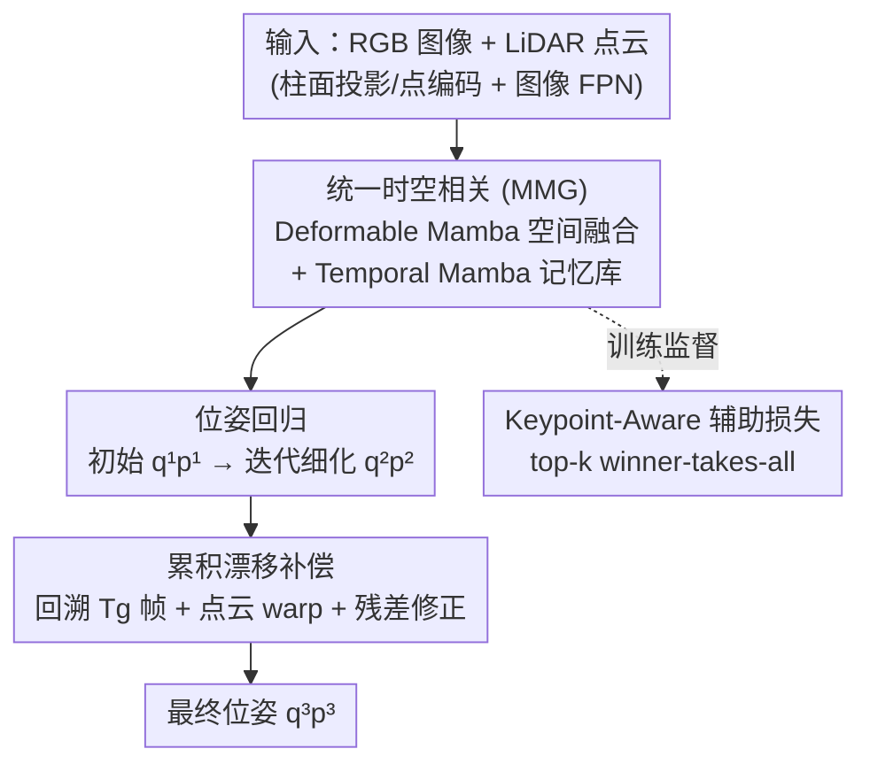

# StreamVLO: Streaming Visual-LiDAR Odometry with Cumulative Drift Compensation

**会议**: CVPR 2026  
**论文**: [CVF Open Access](https://openaccess.thecvf.com/content/CVPR2026/html/Liu_StreamVLO_Streaming_Visual-LiDAR_Odometry_with_Cumulative_Drift_Compensation_CVPR_2026_paper.html)  
**代码**: 无  
**领域**: 自动驾驶 / 视觉-LiDAR 里程计  
**关键词**: 视觉-LiDAR里程计, 累积漂移补偿, Mamba时序建模, 流式估计, 多模态融合

## 一句话总结
StreamVLO 把视觉与 LiDAR 的空间融合和多帧时序建模统一进一个基于 Mamba 的 MMG 模块，并用一个可微的「累积漂移补偿」(CDC) 在线回溯历史帧、学习残差修正，从而在不依赖建图/回环的前提下显著压低长程漂移，在 KITTI 上 $t_{rel}/r_{rel}$ 各降 19%/22%、Argoverse 上 ATE/RPE 各降 18%/16%，且单帧推理仅 74 ms。

## 研究背景与动机

**领域现状**：里程计（odometry）要从连续帧中估计相对位姿，是自动驾驶和 SLAM 的底层模块。近年多模态方法把视觉的纹理信息和 LiDAR 的几何信息互补融合，用来对抗结构错配、单传感器退化、动态环境鲁棒性差等问题，已成为主流方向。

**现有痛点**：现有里程计框架几乎都是「成对帧（pairwise）」输入——只看 source 帧和 target 帧两帧、把更早观测到的历史帧统统丢掉。这带来两个具体问题：一是缺失了多帧序列里本该有的时序运动先验；二是逐帧估计的微小误差会沿轨迹不断累加，形成长程「累积漂移」(cumulative drift)。传统 SLAM 靠全局优化 + 回环检测来消漂移，但那需要显式建图、计算重、对任意长序列不友好。

**核心矛盾**：「成对估计的局部精度」和「长程轨迹的全局一致性」之间存在结构性脱节——只看两帧没法感知整段轨迹在往哪边偏，而引入全局优化又会牺牲实时性和流式可用性。同时，把空间融合和时序建模拆成两套独立模块（先 pairwise 空间相关、再单独时序聚合）也让多模态多帧信息没法真正统一表征。

**本文目标**：(1) 把异构视觉/LiDAR 特征与多帧时序信息融进一个统一表征；(2) 在流式、因果(causal)、可微的设定下在线补偿累积漂移，不靠建图/回环；(3) 保持实时（KITTI LiDAR 10 Hz，需 <100 ms）。

**切入角度**：作者注意到状态空间模型 Mamba 既能高效地做长序列时序交互、又是模态无关的，于是把它同时用来做空间形变融合和时序记忆，再额外加一个能「回溯历史帧、对累积位姿求残差」的可微补偿环节——这样漂移修正本身就可以端到端学习，而不是事后做全局 bundle adjustment。

**核心 idea**：用一个统一的 Mamba(MMG) 表征同时吃下「多模态空间 + 多帧时序」，并用可微的累积漂移补偿把「整段历史的位姿误差」反向灌进当前帧的位姿修正里。

## 方法详解

### 整体框架
StreamVLO 是一个流式前端：每来一帧，先对 LiDAR 点云做柱面投影得到伪图像、再过点编码器得到点特征 $F_P$，对 RGB 图像过卷积特征金字塔得到图像特征 $F_I$。随后进入**统一时空相关**模块——用 Deformable Mamba 把视觉特征采样并融进 LiDAR 特征、用 Temporal Mamba 借助记忆库聚合历史帧，得到统一场景表征并回归出初始位姿 $(\mathbf{q}^{(1)},\mathbf{p}^{(1)})$ 和迭代细化后的位姿 $(\mathbf{q}^{(2)},\mathbf{p}^{(2)})$。接着**累积漂移补偿** (CDC) 把最近 $T_g$ 帧的位姿连乘累积、回溯到 $T_t-T_g$ 时刻的源点云并 warp 到当前帧，用 PWC 结构算出残差 $(\Delta\mathbf{q}^{(2)},\Delta\mathbf{p}^{(2)})$ 修正出最终位姿 $(\mathbf{q}^{(3)},\mathbf{p}^{(3)})$。训练时额外用 **Keypoint-Aware 辅助损失** 把特征学习引导到静态区域。

### 关键设计

**1. 统一时空相关 (MMG)：用一套 Mamba 同时吃下多模态空间与多帧时序**

针对「空间融合和时序建模被拆成两套、且 pairwise 丢历史」的痛点，作者设计了模态无关的 MMG 基本块——由 MaxPooling、Mamba、gMLP 三件套组成：gMLP 先把不同来源的序列编码进统一特征空间，Mamba 建立序列内的长程时序交互，MaxPooling 再把序列压缩成一个紧凑的统一表征。在此之上扩展出两个分支。**Deformable Mamba** 做空间融合：借鉴 Deformable DETR 的形变采样，把 LiDAR 特征 $F_P$ 当 query，先用相机内外参把 LiDAR 点投到图像平面得到参考点，再带自适应偏移做双线性插值采样视觉特征 $F_{sample}$，两者拼接后过 MMG 融合：

$$\mathbf{F}_{fused} = \text{MaxPool}\big(\text{Mamba}(G_f(\mathbf{F}_{sample}\oplus\mathbf{F}_P))\big)$$

随后跨帧 cost volume 产生跨帧运动特征 $E_{ego}$。**Temporal Mamba** 做时序建模：维护隐式的记忆特征库 (MFB) 和显式的记忆位姿库 (MPB)，MFB 存历史 ego-motion 特征、MPB 存历史四元数 $\mathcal{Q}$ 与平移 $\mathcal{P}$，记忆窗口 $T_h$。把当前帧特征 append 进库后再过 MMG 得到更新后的 $\hat{\mathbf{E}}_{ego}$、$\mathbf{Q}_{enc}$、$\mathbf{P}_{enc}$。之所以有效，是因为形变采样让多模态融合保持局部自适应感受野、效率高，而 Mamba 近线性复杂度的选择性 SSM 让长达 $T_h{=}30$ 帧的历史能被因果聚合而不爆显存——这正是 pairwise + 注意力方案做不到的。

**2. 累积漂移补偿 (CDC)：把整段历史的累积误差可微地灌回当前位姿**

这是全文最核心、针对「漂移沿轨迹累加且无法端到端修正」的设计。拿到逐帧细化位姿 $(\mathbf{q}^{(2)},\mathbf{p}^{(2)})$ 后，CDC 把最近 $T_g$ 帧的位姿做连乘累积：

$$(\mathbf{q}_t^{cumul},\mathbf{p}_t^{cumul}) = (\mathbf{q}_t^{(2)},\mathbf{p}_t^{(2)})\circ(\mathbf{q}_{t-1}^{(2)},\mathbf{p}_{t-1}^{(2)})\circ\cdots\circ(\mathbf{q}_{t-T_g+1}^{(2)},\mathbf{p}_{t-T_g+1}^{(2)})$$

其中 $\circ$ 是四元数位姿复合（$\mathbf{q}_{a\circ b}=\mathbf{q}_a\ast\mathbf{q}_b$、平移用四元数共轭旋转后相加）。然后用这个累积位姿把 $T_t-T_g$ 时刻的源点云 warp 到当前帧 $T_t$，再用 Pyramid-Warping-Cost volume (PWC) 结构在 warp 后点云与目标点云之间算残差 $(\Delta\mathbf{q}^{(2)},\Delta\mathbf{p}^{(2)})$，最后修正出 $(\mathbf{q}^{(3)},\mathbf{p}^{(3)})$：$\mathbf{q}^{(3)}=\Delta\mathbf{q}^{(2)}\ast\mathbf{q}^{(2)}$。它为什么比逐帧误差更管用：点云 warp 让模型能**回溯到更早的观测**，从而把分散在一串帧上的累积误差「放大」并集中惩罚，迫使整段轨迹对齐——本质上是用可学习的残差替代了传统 SLAM 的全局 BA/回环，却不需要建图。训练时只要历史帧数超过 $T_g$ 就计算补偿损失，推理时每 $T_g$ 帧补偿一次以省算力。

**3. Keypoint-Aware 辅助损失：用 winner-takes-all 把特征学习钉在静态区域**

由于 StreamVLO 是基于特征回归位姿，动态物体上的特征会注入运动不一致的噪声、毒化定位。该辅助损失针对此问题：用 cost volume $E=\{e_i\}_{i=1}^N$ 为每个 query 预测一份位姿 $(\mathbf{q}^{key},\mathbf{p}^{key})$，然后用 winner-takes-all 策略只挑出相对 GT 误差最小的 top-$k$（$k{=}100$）个 query 来优化：

$$\mathcal{L}^{aux}=\frac{1}{K}\sum_{k=1}^{K}\mathcal{L}^{(k)}$$

可视化显示这些被选中的点绝大多数落在建筑、停放车辆、电线杆等静态结构上、极少落在行人/运动车辆上。之所以有效：只回传「最可信」的少数 query 梯度，相当于让网络自发地学会聚焦稳定参考物、抑制动态干扰，从而在长程上稳住位姿——消融里它单独贡献约 12% 的提升。

### 损失函数 / 训练策略
总损失三部分：(1) **回归损失**对初始/细化/补偿三个阶段都监督，单阶段采用带可学习不确定度的形式 $\mathcal{L}=\|\hat{\mathbf{p}}-\mathbf{p}\|\exp(-k_t)+k_t+\|\hat{\mathbf{q}}-\mathbf{q}\|_2\exp(-k_q)+k_q$，三阶段加权 $\mathcal{L}^{reg}=\alpha^1\mathcal{L}^{(1)}+\alpha^2\mathcal{L}^{(2)}+\alpha^3\mathcal{L}^{(3)}$；(2) Keypoint-Aware 辅助损失 $\mathcal{L}^{aux}$；(3) 借鉴 MOTR 的 **Collective Average Loss**，在每个 $T_s{=}3$ 帧子片内对帧求平均 $\mathcal{L}_{total}=\frac{1}{T_s}\sum_t(\mathcal{L}^{reg}_t+\alpha^4\mathcal{L}^{aux}_t)$。关键超参：$T_h{=}30$、$T_g{=}20$、$T_c{=}60$ 帧片段、$\alpha$ 取 1.6/0.8/1.6/1.6，Adam，初始 lr 0.001，batch 8。

## 实验关键数据

### 主实验
KITTI 07–10 平均（训练仅用 00–06），$t_{rel}$ 为平移 RMSE(%)、$r_{rel}$ 为旋转 RMSE(°/100m)，越低越好：

| 方法 | 类型 | $t_{rel}$ | $r_{rel}$ |
|------|------|-----------|-----------|
| EfficientLO [74] | LiDAR | 0.86 | 0.41 |
| DSLO [87] | LiDAR | 0.94 | 0.44 |
| DVLO [48] (前SOTA) | 视觉-LiDAR | — | — |
| **StreamVLO** | 视觉-LiDAR | **0.59** | **0.29** |

相对前 SOTA 视觉-LiDAR 方法 DVLO，平移误差降 **19%**、旋转误差降 **22%**；相对深度视觉里程计在 07–10 上 $t_{rel}/r_{rel}$ 各降约 75%/60%。Argoverse 上（ATE/RPE，米）：

| 方法 | ATE↓ | RPE↓ |
|------|------|------|
| DSLO [87] | 0.111 | 0.027 |
| DVLO [48] | 0.103 | 0.026 |
| DVLO4D [55] | 0.089 | 0.025 |
| **StreamVLO** | **0.073** | **0.021** |

相对 DSLO，ATE 降 18%、RPE 降 16%。延迟方面单帧 74 ms（4090 GPU），优于 DVLO 99 ms、注意力方案 171 ms，满足 10 Hz 实时门槛。

### 消融实验
KITTI 07–10 平均：

| 配置 | $t_{rel}$ | $r_{rel}$ | 说明 |
|------|-----------|-----------|------|
| w/o Unified MMG | 0.70 | 0.38 | 去掉统一时空相关，掉点最多 |
| w/o Compensation | 0.70 | 0.36 | 去掉 CDC，漂移失控 |
| w/o Auxiliary Loss | 0.67 | 0.38 | 去掉关键点辅助损失 |
| **StreamVLO (Full)** | **0.59** | **0.29** | 完整模型 |

融合策略消融（同样 07–10 平均）：

| 融合方式 | $t_{rel}$ | $r_{rel}$ | 延迟(ms) |
|----------|-----------|-----------|----------|
| Attention [57] | 0.80 | 0.42 | 171 |
| Clustering [48] | 0.74 | 0.41 | 87 |
| Deform DETR [98] | 0.65 | 0.35 | 76 |
| **Deform Mamba** | **0.59** | **0.29** | 74 |

### 关键发现
- **统一 MMG 贡献最大**：去掉后 $t_{rel}$ 从 0.59 退到 0.70，说明把空间融合与时序建模统一进同一表征空间是性能主力，而非锦上添花。
- **Deformable Mamba 是精度-效率的甜点**：相比标准注意力（0.80@171ms）和 Deformable DETR（0.65@76ms），形变 Mamba 在最低延迟附近拿到最佳精度。
- **CDC 对长程/复杂运动尤其关键**：高动态场景 StreamVLO 0.77 vs DVLO 1.47、高旋转 0.79 vs 1.73，差距比常规场景更大；跨数据集（KITTI→Argoverse）StreamVLO 仅 +32.9% ATE/+19.0% RPE，远小于 DVLO 的 +81.6%/+34.6%，泛化更稳。
- **辅助损失靠选静态点**：top-k query 几乎全落在建筑/电线杆等静态结构，单独贡献约 12% 提升。

## 亮点与洞察
- **用可微残差替代全局优化**：CDC 把传统 SLAM 的「全局 BA + 回环消漂移」改写成一个能端到端学习、回溯历史帧的残差补偿，既保住流式实时性、又不需要建图，这个「把后处理纠错变成可学习前向模块」的思路可迁移到其他需要长程一致性的序列估计任务。
- **Mamba 一鱼两吃**：同一个 MMG 块既做空间形变融合又做时序记忆，模态无关、近线性复杂度，是它能在 74 ms 内吞下 30 帧历史的关键——给「多模态多帧统一表征」提供了一个轻量范式。
- **winner-takes-all 自动选静态参考**：不需要语义分割标注动态/静态，仅靠「只回传误差最小的 top-k query」就让网络自发聚焦静态结构，是个低成本却有效的抗动态干扰 trick。

## 局限与展望
- **依赖记忆窗口与补偿间隔的超参**：$T_h{=}30$、$T_g{=}20$ 是在 KITTI/Argoverse 上调出的，论文把 query 数/帧长的敏感性分析放进了补充材料，正文未充分展开，换到帧率/运动模式差异大的场景能否照搬存疑。
- **仍是纯里程计前端、无回环纠正**：CDC 只在 $T_g$ 滑窗内回溯，对超长轨迹里跨越数千帧的真·闭环漂移，理论上仍不如带回环的 SLAM，作者也定位为「流式前端」。
- **真实自洽性的小瑕疵**：Table 6 中 w/o MMG 与 w/o Compensation 的 $t_{rel}$ 均为 0.70，读者较难从单看 $t_{rel}$ 区分二者贡献，需结合 $r_{rel}$ 与定性图（Fig.8）才看得出 CDC 的漂移修正效果。
- **改进方向**：把 CDC 的固定 $T_g$ 改成按场景动态自适应（如检测到高动态/高旋转时拉长回溯窗），或引入轻量回环候选，可能进一步压低超长序列漂移。

## 相关工作与启发
- **vs DVLO [48]**：同为视觉-LiDAR 融合且都用 cost volume + 迭代细化，但 DVLO 是 pairwise、靠聚类做融合；StreamVLO 改成流式多帧、用 Deformable Mamba 融合并加 CDC，KITTI 平移/旋转各降 19%/22%、延迟还从 99ms 降到 74ms。
- **vs EfficientLO/DSLO（纯 LiDAR）**：它们只用 LiDAR、缺视觉纹理且仍是短时序；StreamVLO 引入视觉互补 + 长程时序记忆，在大多数序列上反超。
- **vs 传统视觉-LiDAR SLAM (DVL-SLAM/SDV-LOAM 等)**：那些靠全局优化 + 回环消漂移；StreamVLO 不建图不回环，仅用 CDC 回溯补偿，在 KITTI 00–10 的 ATE/$t_{rel}$ 上多数序列更优（如 Mean $t_{rel}$ 0.50 vs SDV-LOAM 0.72），且对任意长度序列更适配。
- **vs 自驾记忆机制 (Sparse4Dv2/v3、VideoBEV)**：借鉴了显式向量记忆 + 隐式特征记忆的双库思路，但首次把它落到视觉-LiDAR 里程计的位姿与特征记忆上，并配合 Mamba 做长时序建模。

## 评分
- 新颖性: ⭐⭐⭐⭐ 首个用 Deformable/Temporal Mamba 做视觉-LiDAR 多帧统一融合，CDC 把全局纠漂移改成可微残差模块，组合很新。
- 实验充分度: ⭐⭐⭐⭐⭐ 两数据集 SOTA + 与深度/传统 SLAM 全面对比 + 消融/融合策略/跨数据集/复杂运动/延迟多维度验证。
- 写作质量: ⭐⭐⭐⭐ 方法逻辑清晰、图示到位，公式较密、部分记忆库符号需对照图才好懂。
- 价值: ⭐⭐⭐⭐ 实时(74ms)且低漂移、无需建图回环，对自驾流式定位有直接落地价值。

<!-- RELATED:START -->

## 相关论文

- [\[CVPR 2025\] ZeroVO: Visual Odometry with Minimal Assumptions](../../CVPR2025/autonomous_driving/zerovo_visual_odometry_with_minimal_assumptions.md)
- [\[CVPR 2026\] SHARP: Short-Window Streaming for Accurate and Robust Prediction in Motion Forecasting](sharp_short-window_streaming_for_accurate_and_robust_prediction_in_motion_foreca.md)
- [\[CVPR 2026\] DVGT: Driving Visual Geometry Transformer](dvgt_driving_visual_geometry_transformer.md)
- [\[ECCV 2024\] DVLO: Deep Visual-LiDAR Odometry with Local-to-Global Feature Fusion and Bi-directional Structure Alignment](../../ECCV2024/autonomous_driving/dvlo_deep_visual-lidar_odometry_with_local-to-global_feature_fusion_and_bi-direc.md)
- [\[CVPR 2026\] Generalizing Visual Geometry Priors to Sparse Gaussian Occupancy Prediction](generalizing_visual_geometry_priors_to_sparse_gaussian_occupancy_prediction.md)

<!-- RELATED:END -->
