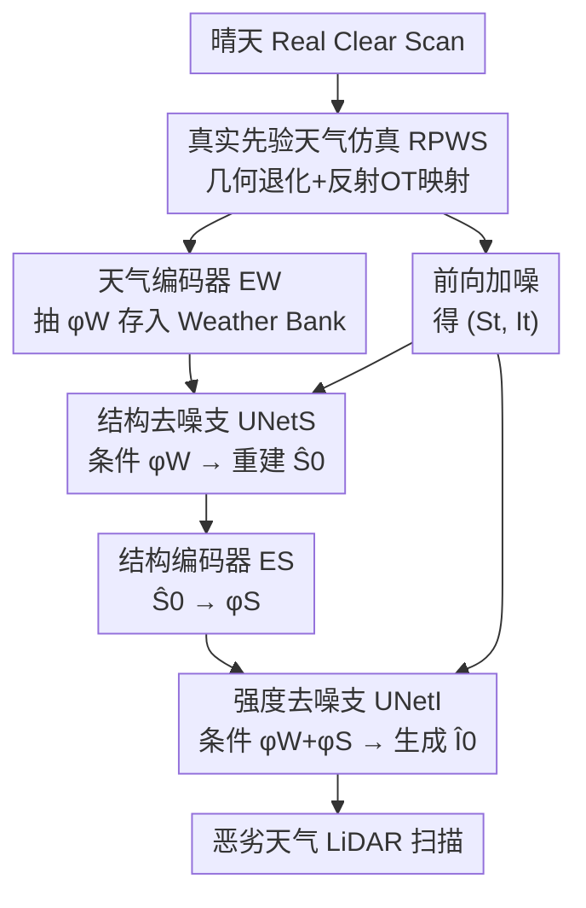

# Structure-to-Intensity Diffusion for Adverse-Weather LiDAR Generation

**会议**: CVPR 2026  
**论文**: [CVF Open Access](https://openaccess.thecvf.com/content/CVPR2026/html/Ni_Structure-to-Intensity_Diffusion_for_Adverse-Weather_LiDAR_Generation_CVPR_2026_paper.html)  
**代码**: 无  
**领域**: 自动驾驶 / LiDAR 生成 / 扩散模型  
**关键词**: 恶劣天气, LiDAR 点云生成, 扩散模型, 因果分解, 数据增强

## 一句话总结
SiD 把恶劣天气 LiDAR 生成的去噪过程在每一步显式拆成「先重建几何结构、再以结构为条件去噪反射强度」两支，配合一套用真实传感统计量合成退化数据的 RPWS 模块，在相近模型规模下把雾/雨/雪点云生成的多项分布指标大幅压低于此前 SOTA。

## 研究背景与动机

**领域现状**：扩散模型已是 LiDAR 点云生成的主流，LiDARGen、R2DM、LiDM、Text2LiDAR 等在 range image / range–reflectance 空间上做去噪，能产出高保真、语义一致的点云。但它们几乎都建立在「晴天假设」上，不处理恶劣天气下的退化。

**现有痛点**：真实恶劣天气 LiDAR 数据极难采集（雾雨雪下出车采数成本高），数据稀缺。为补数据，一类做法是物理仿真（FSRL、LSS、LiSA 用 Beer–Lambert、Mie 散射等光学模型模拟），可解释但假设过简、只针对特定天气、难以覆盖真实多样性；另一类学习型方法（WeatherGen）把仿真和扩散结合，保真度更高，但**把几何与反射强度放在一个网络里联合建模**。

**核心矛盾**：天气对几何和反射的破坏机制根本不同——几何主要被「距离衰减 + 结构化遮挡」破坏，反射强度则受材质、入射角、大气衰减等共同影响、信号更弱更噪。联合建模 $P(S, I \mid c)$ 在真实监督有限时优化困难：更稳定的几何线索会主导训练，较弱的反射信号被欠拟合，生成的强度图物理上不一致（如论文 Fig.1(a) 所示）。

**切入角度**：作者回到 LiDAR 成像的物理本质重新审视二者的因果关系——反射强度本质上是激光打到几何表面后的辐射响应，它**强烈依赖于几何**；反过来由强度反推几何在恶劣天气下是病态的。这是一个**非对称依赖**，恰好可以当作简化生成建模的归纳偏置。

**核心 idea**：不去直接学几何与强度的联合分布，而是用因果分解 $P(S, I \mid c) = P(S \mid c)\,P(I \mid S, c)$，把任务重写成「以几何为条件生成反射」的条件生成问题，在扩散的每一步先去噪结构、再以恢复出的结构为条件去噪强度。

## 方法详解

### 整体框架
SiD 要解决两件事：一是数据太少，二是几何/反射混在一起学不好。对应两个模块：先用 **RPWS** 把大量晴天扫描"加上"真实统计的天气退化，造出物理可信的恶劣天气训练样本并把每条样本编码成天气向量存进一个 weather bank；再用 **SiD 双支扩散** 在每个去噪步先重建几何 $\hat S_0$、把它编码成 $\phi_S$ 去条件化强度支，按 $S \to I$ 的依赖顺序生成。输入是 range-view 下的两通道图 $x \in \mathbb{R}^{2 \times H \times W}$（一通道几何深度 $S$、一通道反射强度 $I$），输出是恶劣天气下结构与辐射都逼真的 LiDAR 扫描。

### 关键设计

**1. RPWS：用真实传感统计量把晴天扫描"染上"天气，而不是靠手搓物理模型**

痛点是仿真器要么物理假设过简、要么只针对单一天气，造出来的数据和真实分布对不上。RPWS 换思路：给一张晴天扫描，从训练集里随机抽一张恶劣天气扫描，**直接从这对数据里估退化统计量再迁移过去**，且不引入任何可学习参数。它分别处理几何和反射两种退化。几何上对准两个主导机制——距离衰减和结构化遮挡：把距离离散成 bin，对晴天点 $x$ 算衰减率 $P_{dec}(x) = \frac{N_{adver}(r(x))}{\max(N_{adver}(r(x)),\, N_{clear}(r(x)))}$（$N_{clear}, N_{adver}$ 是该距离 bin 内有效回波数），再乘一个由恶劣扫描 range-view 导出的空间可见性掩码 $S(x) \in [0,1]$，每个点的存活按 $z(x) \sim \mathrm{Bernoulli}\big(P_{dec}(x) \cdot S(x)\big)$ 采样。反射上则学一个把晴天强度分布搬到恶劣分布的最优传输映射 $T^*$，通过最小化 Wasserstein 距离 $T^* = \arg\min_T D\big(P_{clear} \circ T^{-1},\, P_{adver}\big)$、约束 $T_\# P_{clear} = P_{adver}$，用 $T^*$ 改写晴天扫描的强度通道。这样合成出的退化既随机又物理扎实，且能规模化扩增。

**2. Structure-to-Intensity 因果分解：把联合分布拆成「先结构、后强度」**

这是全文核心动机的落地。联合建模 $P(S,I\mid c)$ 难在两个模态退化行为差异大、强者（几何）压制弱者（反射）。作者用 LiDAR 成像的非对称因果性 $P(S, I \mid c) = P(S \mid c)\,P(I \mid S, c)$ 把它拆开。落到扩散的逆过程，每个时间步的转移分布写成

$$p_\theta(S_{t-1}, I_{t-1} \mid S_t, I_t, c) = p_\theta(S_{t-1} \mid S_t, c)\cdot p_\theta(I_{t-1} \mid I_t, \hat S_0, c)$$

注意强度支的条件不是用带噪的 $S_t$，而是用当步确定性预测出的去噪估计 $\hat S_0$。理由仍是因果：反射主要是几何的函数，而 $\hat S_0$ 比 $S_t$ 更接近干净几何，作为条件更稳更有物理意义；同时这步替换保留了扩散链的马尔可夫性。和旧的联合去噪相比，它把一个难学的联合分布换成两个条件相关、各自更好学的分布，从根上缓解了"几何主导、反射欠拟合"。

**3. 双支去噪架构 + 天气嵌入 bank：把因果顺序落进网络与条件机制**

框架里点名了四个部件：结构去噪支 $\text{UNet}_S$、强度去噪支 $\text{UNet}_I$、天气编码器 $E_W$、结构编码器 $E_S$。结构支只在天气向量 $\phi_W$ 和时间步 $t$ 条件下预测噪声 $\hat\epsilon^S_\theta = \text{UNet}_S(S_t, t, \phi_W)$，并据此重建 $\hat S_0 = \frac{S_t - \sqrt{1-\bar\alpha_t}\,\hat\epsilon^S_\theta}{\sqrt{\bar\alpha_t}}$；$\hat S_0$ 经结构编码器得到几何上下文 $\phi_S = E_S(\hat S_0)$，连同 $\phi_W$ 一起条件化强度支 $\hat\epsilon^I_\theta = \text{UNet}_I(I_t, t, \phi_W + \phi_S)$。实现上允许强度支同时看到 $I_t$ 和 $S_t$ 以获得更丰富结构上下文，但**对 $S_t / \hat S_0$ 的梯度做 detach**，确保依赖方向只朝 $S \to I$、$\text{UNet}_S$ 仅由自己的 loss 更新。两支都是带 skip 的编码器-解码器，用 AdaGN 把条件注入：$\gamma, \beta = \text{MLP}(\phi)$，$\text{AdaGN}(h, \phi) = \text{GN}(h) \odot (1+\gamma) + \beta$。天气条件不靠运行时仿真，而是预先用 RPWS 在各天气标签下造样本、过 $E_W$ 抽 $\phi_W$ 存进 weather bank $M_W = \{(c_i, \phi^{(i)}_W)\}$；生成时给定目标天气 $c$ 就从对应子集里随机取一个嵌入，轻量且数据驱动。

### 损失函数 / 训练策略
训练时样本 $(S_0, I_0)$ 来自真实数据或 RPWS 合成，先标准前向加噪 $S_t = \sqrt{\bar\alpha_t} S_0 + \sqrt{1-\bar\alpha_t}\,\epsilon_S$、$I_t$ 同理。目标是两支去噪损失之和，并用 Min-SNR 时间加权 $w(t)$：

$$L = \mathbb{E}_{t,\epsilon}\big[w(t)\|\epsilon_S - \hat\epsilon^S_\theta\|_2^2 + w(t)\|\epsilon_I - \hat\epsilon^I_\theta\|_2^2\big]$$

为强制因果分解，强度支对 $\hat S_0$ 的梯度被 detach。采样时按 Algorithm 1 的顺序：从高斯噪声 $(S_T, I_T)$ 出发，每步先去噪几何得 $\hat S_0 \to \phi_S$，再去噪强度，逐步还原到 $\hat x_0 = [\hat S_0, \hat I_0]$。整体采用两阶段训练：先在 RPWS 增强数据上学通用天气先验，再在真实 STF 数据上微调；4×L40S、batch 8、75k 步、cosine annealing + warm-up + EMA(0.995)。

## 实验关键数据

数据集为晴天域 KITTI-360（76,715 帧）与恶劣天气域 STF（约 7,000 帧，含雾/雨/雪）。除沿用 FPD、FRD、JSD、MMD 等指标，作者还提出 **FMD（Fréchet Minkowski Distance）**：用 SLidR 框架在 STF 真实恶劣天气数据上训练 Minkowski UNet 提体素特征再算分布距离，因为晴天标定的旧指标在重退化下不可靠。

### 主实验（STF 恶劣天气，越低越好）

| 天气 | 方法 | FMD↓ | FPD↓ | FRD↓ | MMD(×10⁴)↓ | JSD(×10)↓ |
|------|------|------|------|------|------------|-----------|
| 雾 | WeatherGen | 3.29 | 314.14 | 1968.90 | 8.08 | 2.66 |
| 雾 | **本文** | **2.11** | **119.29** | **1370.00** | **3.62** | **1.47** |
| 雨 | WeatherGen | 4.65 | 86.40 | 1270.60 | 4.15 | 0.93 |
| 雨 | **本文** | **0.42** | **63.81** | **1140.21** | **1.11** | **0.93** |
| 雪 | WeatherGen | 3.39 | 59.28 | 1241.70 | 1.71 | 0.77 |
| 雪 | **本文** | **2.28** | **32.38** | **1080.68** | **1.28** | **0.65** |

三种天气、几乎所有指标都是最优；雾天 FPD 从 314 砍到 119、雨天 FMD 从 4.65 降到 0.42 尤其显著。在晴天 KITTI-360 上（Table 2）SiD 也达到 SOTA 级别（FMD 1.75、FRD 135.13、JSD 0.20），说明结构-强度解耦在晴天同样有益。

### 消融实验（STF 雪测试集）

| Aug. | Arc. | FT | FMD↓ | FPD↓ | FRD↓ | 说明 |
|------|------|----|------|------|------|------|
| MDP | SMG | - | 6.11 | 271.12 | 2231.16 | WeatherGen 原始组合 |
| RPWS | SMG | - | 3.94 | 109.42 | 1680.11 | 仅换仿真模块为 RPWS |
| RPWS | SiD | - | 3.67 | 91.28 | 1523.65 | 再换上 SiD 骨干 |
| RPWS_S | SiD | - | 8.25 | 105.53 | 2074.08 | RPWS 去掉反射退化 |
| RPWS_I | SiD | - | 3.91 | 475.11 | 2066.29 | RPWS 去掉几何退化 |
| RPWS | SiD | ✓ | **2.28** | **32.38** | **1080.68** | 完整模型 |

条件方向消融（STF 雪）：

| 条件策略 | FMD↓ | FPD↓ | FRD↓ |
|----------|------|------|------|
| 独立（无条件） | 4.92 | 55.79 | 1122.67 |
| I → S（反向） | 4.42 | 66.20 | 1177.72 |
| **S → I（本文）** | **2.28** | **32.38** | **1080.68** |

### 关键发现
- **RPWS 和 SiD 各自都有效且可叠加**：把 MDP 换成 RPWS，FPD 从 271 降到 109；再换 SiD 骨干进一步降到 91；微调后完整模型到 32.38，验证"真实统计仿真 + 因果分解"两件事都吃到收益。
- **两种退化分工明确**：RPWS 去掉反射退化时 FMD 暴涨到 8.25（强度分布对不上），去掉几何退化时 FPD 暴涨到 475（结构保真崩了）——恰好印证天气对几何/反射的破坏机制不同，二者都要建模。
- **因果方向是关键，不是随便拆**：$S \to I$ 全面最优，反向 $I \to S$ 或干脆独立都明显变差，说明收益来自"对齐 LiDAR 成像因果结构"而非单纯加了个分支。
- **数据高效**：仅用 10% 真实数据时 SiD 仍能保持强性能，WeatherGen 在有限监督下退化更快。
- **代价可控**：38.06M 参数 / 1.599 GFLOPs，与 WeatherGen（32.59M / 1.398 GFLOPs）相近，双支没有显著加重计算。

## 亮点与洞察
- **把物理因果直接写进扩散逆过程**：$P(S,I\mid c)=P(S\mid c)P(I\mid S,c)$ 这一步分解不只是数学技巧，它对应"反射是几何的辐射响应"的真实成像顺序，让模型不再被强几何线索压制弱反射信号——是这篇最"啊哈"的地方。
- **用 $\hat S_0$ 而非 $S_t$ 当条件**的小设计很关键：每步用确定性去噪估计当条件，既更接近干净几何、又保住马尔可夫性，是稳定性的来源之一。
- **detach 梯度强制单向依赖**：允许网络访问 $S_t$ 拿上下文、但截断回传，干净地把"看得到"和"学方向"分开，这个 trick 可迁移到任何想保持因果条件方向的双支生成。
- **RPWS 零参数迁移真实统计**：用衰减直方图 + 最优传输从真实成对数据里"偷"退化分布，比手搓物理模型更贴真分布，可复用到其它需要分布迁移的数据增强场景。

## 局限与展望
- RPWS 的几何退化只对准了"距离衰减 + 结构化遮挡"两个主导效应，作者自己承认忽略了散射、部分反射带来的随机几何噪声，极端天气下可能仍不够。
- 退化统计是从随机抽取的成对晴/恶劣扫描估出来的，依赖训练集里恶劣样本的覆盖度；天气种类只覆盖雾/雨/雪三类离散标签，更细粒度（强度连续变化、混合天气）未涉及。
- 评测高度依赖自提的 FMD，而 FMD 的特征提取器是在 STF 上训的，跨数据集泛化与该指标本身的可靠性还需更多验证。
- 双支顺序采样在每个时间步要跑两次 UNet + 编码，推理步数多时延迟值得关注，论文未给采样耗时。

## 相关工作与启发
- **vs WeatherGen [45]**：二者都把物理仿真与扩散结合，但 WeatherGen 用 MDP 仿真 + Spider Mamba 联合去噪几何与反射；本文用真实统计驱动的 RPWS + 结构-强度因果分解，消融显示在相同骨干下换 RPWS、再换 SiD 都各自涨点，核心优势是"解耦 + 真实先验"。
- **vs 物理仿真（FSRL/LSS/LiSA）**：它们用 Beer–Lambert、Mie 散射等显式光学模型，可解释但假设过简、难泛化到真实多样性；RPWS 不写物理方程，直接从真实数据迁移退化分布，realism 更高。
- **vs 晴天 LiDAR 生成（LiDARGen/R2DM/LiDM/Text2LiDAR）**：这些在晴天假设下做高保真生成、不处理天气退化；本文把场景扩到恶劣天气，且在晴天 KITTI-360 上也达到 SOTA 级别，说明解耦策略并不以牺牲晴天性能为代价。

## 评分
- 新颖性: ⭐⭐⭐⭐ 用 LiDAR 成像的非对称因果性把扩散逆过程显式分解成结构→强度，角度新且有物理依据。
- 实验充分度: ⭐⭐⭐⭐ 三天气主表 + 晴天泛化 + 组件/方向/RPWS 多维消融 + 数据效率，证据链完整；但只在 KITTI-360/STF 两库、缺采样耗时。
- 写作质量: ⭐⭐⭐⭐ 动机推导清晰、公式与图配合到位，因果分解叙述有说服力。
- 价值: ⭐⭐⭐⭐ 恶劣天气 LiDAR 数据稀缺是自动驾驶感知的真痛点，可规模化造数据 + 数据高效，落地价值明确。

<!-- RELATED:START -->

## 相关论文

- [\[CVPR 2026\] HG-Lane: High-Fidelity Generation of Lane Scenes under Adverse Weather and Lighting Conditions without Re-annotation](hg-lane_high-fidelity_generation_of_lane_scenes_under_adverse_weather_and_lighti.md)
- [\[CVPR 2026\] Hybrid Robust Collaborative Perception with LiDAR-4D Radar Fusion under Adverse Weather Conditions](hybrid_robust_collaborative_perception_with_lidar-4d_radar_fusion_under_adverse_.md)
- [\[CVPR 2026\] Points-to-3D: Structure-Aware 3D Generation with Point Cloud Priors](points-to-3d_structure-aware_3d_generation_with_point_cloud_priors.md)
- [\[CVPR 2026\] A Self-Conditioned Representation Guided Diffusion Model for Realistic Text-to-LiDAR Scene Generation](a_self-conditioned_representation_guided_diffusion_model_for_realistic_text-to-l.md)
- [\[ECCV 2024\] Rethinking Data Augmentation for Robust LiDAR Semantic Segmentation in Adverse Weather](../../ECCV2024/autonomous_driving/rethinking_data_augmentation_for_robust_lidar_semantic_segmentation_in_adverse_w.md)

<!-- RELATED:END -->
