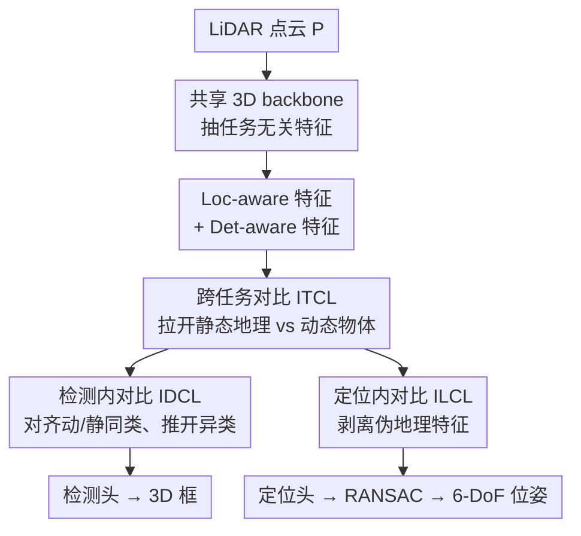

# TACO: Task-Aware Contrastive Learning for Joint LiDAR Localization and 3D Object Detection

**会议**: CVPR 2026  
**论文**: [CVF Open Access](https://openaccess.thecvf.com/content/CVPR2026/html/Xing_TACO_Task-Aware_Contrastive_Learning_for_Joint_LiDAR_Localization_and_3D_CVPR_2026_paper.html)  
**代码**: https://github.com/xmuxly/OxfoLD  
**领域**: 自动驾驶 / 3D视觉  
**关键词**: LiDAR定位, 3D目标检测, 多任务学习, 对比学习, 特征解耦

## 一句话总结
TACO 用单个共享 backbone 同时做 LiDAR 定位和 3D 目标检测，并通过三个对比学习模块把"静态地理特征"和"动态物体特征"显式解耦再互相补充，在自建的 OxfoLD 数据集上把定位误差从基线 0.95m 降到 0.72m，同时检测精度也优于单任务模型。

## 研究背景与动机
**领域现状**：自动驾驶里自定位（self-localization）和 3D 目标检测是两个核心任务。LiDAR 定位走 retrieval / matching / regression 三条路线，近年的 APR、SCR 回归法直接用 CNN 估 6-DoF 位姿；3D 检测则以 center-based、anchor-based 为主流。传统系统把这两件事各自独立成两条 pipeline，用各自的网络和指标分别优化。

**现有痛点**：两条独立 pipeline 带来大量计算冗余（同一帧点云被各自体素化、各自抽特征），而且任务之间的知识无法互相传递。蒸馏、剪枝能压缩模型，但通常以掉点为代价，也没有在表征层面真正利用两个任务的协同。

**核心矛盾**：直接套多任务学习（MTL）共享特征又行不通——因为定位和检测的语义/几何偏好是冲突的。检测器要抓的是**局部、细粒度、可动**的物体特征（车、行人）；定位器要的是**全局、稳定、静态**的地理结构（道路、建筑）。一个任务有用的特征，对另一个任务恰恰是噪声。朴素地共享特征，在静态/动态元素密集共存的真实场景里会两边都变差。更关键的是 SCR 类定位方法依赖"静态场景假设"，运动物体会污染静态结构、引入定位噪声。

**切入角度**：作者反过来观察到两个任务其实存在**互补线索**——静态地理线索能帮检测器剪掉误检（别把路缘当成车），可动物体线索能帮定位器识别并剔除动态扰动。既然冲突来自"特征纠缠"，那就别共享纠缠的特征，而是**显式解耦**任务特定特征、再做双向监督。

**核心 idea**：用对比学习在共享 backbone 之上把静态地理特征和动态物体特征拉开（解耦），同时让两个任务的特征互相教学（mutual teach），在一个统一网络里同时提升定位鲁棒性和检测精度。

## 方法详解

### 整体框架
输入是一帧大尺度室外 LiDAR 点云 $P=\{p_i\}_{i=1}^N$，输出是 3D 检测框 $B=\{b_j\}$（7-DoF）和车辆 6-DoF 全局位姿 $p$。TACO 把整条流程拆成两阶段：先用一个共享 3D backbone 抽出任务无关的通用特征（省掉重复体素化和重复计算），再在 BEV 特征图上用三个对比学习模块把任务特定特征"分开 + 对齐"，最后分别送进检测头和定位头；定位结果还会再过一道 RANSAC 做鲁棒位姿精修。

具体地，**TAFE（Task-Agnostic Feature Extraction）**阶段直接复用 LiSA 的 3D backbone 抽全局上下文特征，定位和检测共用这套特征以削减冗余。**TFCL（Task-aware Feature Contrastive Learning）**阶段是核心，它在共享特征基础上派生出 Loc-aware 与 Det-aware 两支特征，再用 ITCL / IDCL / ILCL 三个对比模块分别处理"跨任务冲突""检测任务内冲突""定位任务内冲突"三类纠缠，最后只在推理时把定位结果交给 RANSAC。

### 关键设计

**1. ITCL 跨任务对比：把静态地理特征和动态物体特征在空间上拉开**

这是直接针对"特征级冲突"那条核心矛盾的设计。检测和定位共享 backbone 后，BEV 特征里静态结构和可动物体是混在一起的，导致定位被运动物体干扰、检测又误把静态结构（路缘）当目标。ITCL 显式定义静态地理特征 $G_g=\{f_{(i,j)g}\}$ 和可动物体特征 $M_o=\{f_{(i,j)o}\}$（$w\times h$ 是 BEV 尺寸），先按 L2 范数对 $G_g$ 排序、取最显著的 top-N 作为 $F_g$，再用物体 GT 先验从 $M_o$ 里取出物体特征 $F_o$。然后计算每对 $(f_g^n, f_o^m)$ 的余弦相似度，**最小化**它：

$$L_{ITCL} = \frac{1}{B}\sum_{b=1}^{B}\frac{\sum_{n=1}^{N}\sum_{m=1}^{M} \mathrm{sim}(f_g^n, f_o^m)}{N\cdot M}$$

让静态与动态特征在表征空间里互相远离，从而保证定位只盯地理结构、检测不学进静态相关性。这种"先解耦再各自优化"和传统 MTL"无脑共享"是本质区别——后者让冲突特征互相污染，前者主动切断污染通路。

**2. IDCL 检测内对比：按运动状态对齐同类物体、推开异类**

检测任务内部也有冲突：同一类物体（比如车）在"运动"和"静止"两种状态下点云外观差异很大，模型容易把"静止的车"学成另一类。IDCL 先用 LiDAR 帧间匹配算速度，以 $v>0.5\,\text{m/s}$ 为界把物体分成动态 $F_{do}$ 和静态 $F_{so}$，再各自按类别细分。它用两支对称的对比损失把"同类的动/静特征拉近、异类推远"：动态到静态方向

$$L_{ds} = -\log\frac{\sum_{s_{so}^i\in S_{so}} \exp(\mathrm{sim}(f_{do}, s_{so}^i)/\tau)}{\sum_{f\in F_{so}} \exp(\mathrm{sim}(f_{do}, f)/\tau)}$$

以及对称的静态到动态 $L_{sd}$，温度 $\tau$ 控制分布集中度，总损失对两支在所有动/静物体上取平均。这样检测器学到的是"跨运动状态一致的类别表征"，从而对停着的车、走动的行人都更鲁棒。

**3. ILCL 定位内对比：剥离"伪地理特征"，让定位只信稳定结构**

定位任务内部的陷阱是"伪地理特征"$F_{pg}$——那些**临时静止但本质可动**的物体（路边停的车）被误激活成像地理结构一样的特征，会让定位误以为它们是长期稳定地标。ILCL 把真正稳定的地理特征 $F_{geo}$（在 $F_g$ 里按 L2 范数取 top-K）和伪地理特征 $F_{pg}$（对应静态物体 GT 框的几何特征）做对比，最小化二者所有配对的余弦相似度：

$$L_{ILCL} = \frac{1}{B}\sum_{b=1}^{B}\Big[\frac{1}{UV}\sum_{i=1}^{U}\sum_{j=1}^{V} s_{ij}^b\Big]$$

把"伪地理"从定位特征空间里推走，定位头就只依赖真正长期不变的结构，避免被今天停明天开走的车带偏。这三个对比模块分别管跨任务、检测内、定位内三层纠缠，合在一起才完成"解耦 + 互补"的闭环。

### 损失函数 / 训练策略
总损失是检测、定位和三个对比损失的加权和：

$$L = \lambda_1 L_{det} + \lambda_2 L_{loc} + \lambda_3 L_{ITCL} + \lambda_4 L_{ILCL} + \lambda_5 L_{IDCL}$$

实现上用 PyTorch + Spconv，Adam 优化器、初始学习率 0.01、weight decay $10^{-4}$，batch size 100、训 100 epoch；BEV 网格范围 $[-60,60]\text{m}$（x、y）、$[-2,6]\text{m}$（z），体素 $0.2\text{m}$；4 张 RTX 3090 训练。定位头复用 LiSA 的 SCR 路线，检测头用 center-based。

## 实验关键数据

为支撑联合训练，作者还构建了 **OxfoLD 数据集**——在 Oxford RobotCar 多遍历定位数据上补了每帧 3D 框标注（车/行人/骑车人），8 条遍历共 315k 帧标注，超过 WOD 的 230k，是首个同时提供多遍历定位 GT 和丰富 3D 框的数据集。

### 主实验：定位与检测
OxfoLD 测试集定位对比（位置误差 m / 朝向误差°，越低越好）：

| 方法 | 类型 | 平均位置误差 | 平均朝向误差 |
|------|------|------|------|
| HypLiLoc (CVPR'23) | APR | 3.89m | 1.27° |
| DiffLoc (CVPR'24) | APR | 1.86m | 0.87° |
| SGLoc (CVPR'23) | SCR | 1.53m | 1.60° |
| LiSA (CVPR'24，基线) | SCR | 0.95m | 1.14° |
| LightLoc (CVPR'25) | SCR | 0.83m | 1.12° |
| **TACO (本文)** | — | **0.72m** | **0.85°** |

相比基线 LiSA，位置/朝向误差分别降低 **24.21% / 25.44%**。检测上 OxfoLD 测试集 TACO 也拿到 Vehicle AP@0.5 = 81.60%、Pedestrian AP@0.3 = 52.32%、Cyclist AP@0.3 = 57.46%，车辆 mAP 比 CenterPoint 基线高 28.77%。

### 消融实验：逐模块叠加（OxfoLD 测试集）
| 配置 | 定位误差 | Vehicle AP@0.5 | 说明 |
|------|---------|---------------|------|
| 基线 LiSA | 0.95m, 1.14° | – | 纯定位 SCR |
| + DET 检测头 | 0.89m, 1.06° | 72.54% | 检测提供隐式空间线索，定位也受益 |
| + ITCL | 0.82m, 0.99° | 75.32% | 跨任务解耦同时提升两端 |
| + IDCL | 0.85m, 0.93° | 77.45% | 运动状态对齐主要提检测 |
| + ILCL | 0.76m, 0.89° | 76.21% | 剥离伪地理主要提定位 |
| **Full（TACO）** | **0.72m, 0.85°** | **81.60%** | 三模块全开 |

### 关键发现
- **联合训练本身就有增益**：单独训练时 Detection-only 的 Vehicle AP 只有 60.01%、Localization-only 定位误差 0.95m；联合训练后两项都更好（81.60% / 0.72m），说明两个任务确实存在可挖掘的协同，而非简单堆参数。
- **三个对比模块分工清晰**：ITCL 两端都提，IDCL 偏向拉检测精度，ILCL 偏向降定位误差，正好对应"跨任务 / 检测内 / 定位内"三层冲突的设计意图。
- **优于通用 MTL 架构**：在相同设置下 TACO（0.72m/0.85°、81.60%）显著好于 Cross-stitch（1.97m、55.23%）和 LiDARFormer（0.89m、72.54%），说明只靠共享 backbone + 任务头不够，显式特征解耦才是关键。
- **跨数据集泛化**：在 nuScenes 上 TACO 定位 0.92m/0.82°、检测全面超过 LiDARFormer；KITTI-360 seq.09 上也优于 LiDARFormer，说明方法不依赖 OxfoLD 特有分布。

## 亮点与洞察
- **把任务冲突重新诊断为"特征纠缠"并对症下药**：作者没有停在"MTL 共享特征会变差"，而是精确定位到静态/动态特征互相污染，再用对比学习显式切断污染——这种"先归因再设计"的思路比堆模块更有说服力。
- **三层对比的拆分很干净**：跨任务（ITCL）、检测内运动态（IDCL）、定位内伪地理（ILCL），每层对应一种具体的冲突来源，消融里也各自验证了主导提升项，可迁移到其他"两任务偏好相反"的联合学习场景（如分割 + 定位）。
- **"伪地理特征"是个有画面感的概念**：把"路边停的车被当成永久地标"这一定位失败模式形式化成一个可优化的对比目标，是这篇最"啊哈"的点。
- **顺手补了数据缺口**：OxfoLD 解决了"定位数据集没框、检测数据集没多遍历"的长期割裂，本身就是社区资产。

## 局限与展望
- **作者承认**：方法强依赖"多遍历 LiDAR 扫描 + 丰富 3D 框"这种重标注数据，未来希望用更少标注或单次遍历做统一感知。
- **自己发现**：动/静划分用了 $v>0.5\,\text{m/s}$ 的硬阈值，缓慢移动或刚启停的物体可能被误分类，对 IDCL 的对比正负样本纯度有影响；ITCL/ILCL 里"取 top-N/top-K 显著特征"依赖 L2 范数排序，这个选择对超参可能比较敏感，论文未给出充分的敏感性分析 ⚠️。
- **跨数据集泛化是用伪重定位对（pseudo-relocalization pairs）构造的**，nuScenes/KITTI-360 本身轨迹不重叠，这种构造下的定位数字和 OxfoLD 的多遍历真值不完全可比，结论需带 caveat。
- **改进思路**：把动/静阈值换成软权重或可学习的运动置信度；探索无 GT 框先验下从特征自身分离静/动的自监督版本。

## 相关工作与启发
- **vs LiSA (CVPR'24)**：LiSA 是纯 SCR 定位、也是 TACO 的 backbone 与基线，遵循静态场景假设；TACO 在其上加联合检测和三对比模块，主动建模并剔除动态扰动，把定位误差再降 24%。
- **vs LiDARFormer / Cross-stitch（通用 MTL）**：它们靠共享 backbone + 任务特定头来做多任务，没处理任务间的特征偏好冲突；TACO 用对比学习显式解耦特征，在相同任务对上定位和检测全面领先，说明"解耦"比"共享"更适合这对冲突任务。
- **vs LidarMTL / LidarMultiNet（LiDAR 多任务）**：前者联合的是检测 + 分割等"语义相近"的任务；TACO 专门处理定位与检测这对**内在偏好相反**的任务，问题设定更难，也是它强调"task-aware"的原因。

## 评分
- 新颖性: ⭐⭐⭐⭐ 首个 LiDAR 定位 + 3D 检测的统一对比学习框架，"伪地理特征"概念有新意
- 实验充分度: ⭐⭐⭐⭐ 新建数据集 + 三数据集验证 + 逐模块消融，但部分超参敏感性分析略缺
- 写作质量: ⭐⭐⭐⭐ 动机推导清晰，三模块分工讲得明白
- 价值: ⭐⭐⭐⭐ 省算力的统一感知思路 + OxfoLD 数据集对社区都有用

<!-- RELATED:START -->

## 相关论文

- [\[CVPR 2026\] BEV-SLD: Self-Supervised Scene Landmark Detection for Global Localization with LiDAR Bird's-Eye View Images](bev-sld_self-supervised_scene_landmark_detection_for_global_localization_with_li.md)
- [\[CVPR 2026\] RaGS: Unleashing 3D Gaussian Splatting from 4D Radar and Monocular Cue for 3D Object Detection](rags_unleashing_3d_gaussian_splatting_from_4d_radar_and_monocular_cue_for_3d_obj.md)
- [\[CVPR 2026\] R4Det: 4D Radar-Camera Fusion for High-Performance 3D Object Detection](r4det_4d_radar-camera_fusion_for_high-performance_3d_object_detection.md)
- [\[CVPR 2026\] L3DR: 3D-aware LiDAR Diffusion and Rectification](l3dr_3d-aware_lidar_diffusion_and_rectification.md)
- [\[CVPR 2026\] A Prediction-as-Perception Framework for 3D Object Detection](a_prediction-as-perception_framework_for_3d_object_detection.md)

<!-- RELATED:END -->
