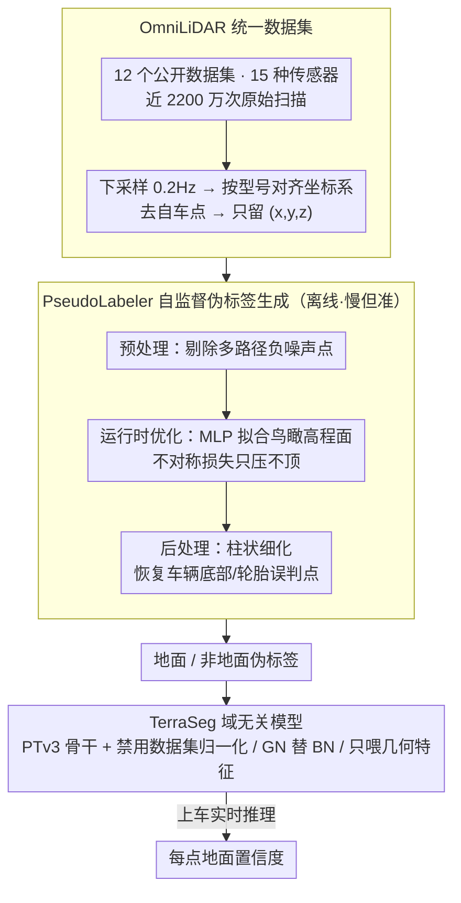

# TerraSeg: Self-Supervised Ground Segmentation for Any LiDAR

**会议**: CVPR 2026  
**arXiv**: [2603.27344](https://arxiv.org/abs/2603.27344)  
**代码**: 已公开（Apache 2.0）  
**领域**: 自动驾驶 / 3D点云分割  
**关键词**: 地面分割、自监督学习、跨传感器泛化、LiDAR感知、伪标签

## 一句话总结

本文提出 TerraSeg，首个自监督的域无关 LiDAR 地面分割模型，通过构建统一的 OmniLiDAR 大规模数据集（12个公开基准、15种传感器、近2200万次扫描）和创新的 PseudoLabeler 自监督伪标签生成模块，在不使用任何人工标注的情况下在 nuScenes、SemanticKITTI 和 Waymo 上达到 SOTA。

## 研究背景与动机

**领域现状**：LiDAR 地面分割是自动驾驶感知栈的基础任务，用于物体发现、自由空间估计和定位建图。现有方法分为两类——手工几何方法（如 RANSAC、PatchWork++）和监督学习方法（如 GndNet）。

**现有痛点**：手工方法虽然快速且不需要标注，但依赖简单地形假设（如全局平面）和传感器特定调参，换到新环境/传感器就需要重新调参，泛化性差。监督学习方法泛化性更好，但依赖昂贵的逐点人工标注，可扩展性极差。

**核心矛盾**：快速+免标注的手工方法缺乏泛化性，而有泛化性的学习方法需要昂贵标注——理想方案应兼具：免标注、跨传感器零样本泛化、实时运行。

**本文目标** (1) 如何在完全不使用人工标注的情况下训练出高质量地面分割模型；(2) 如何让单一模型泛化到不同传感器、不同场景和不同天气条件。

**切入角度**：受 NLP/CV 大规模预训练成功的启发，但不追求多任务通用系统，而是走单任务域无关路线——在极多样的几何数据上自监督训练，实现零样本跨域迁移。

**核心 idea**：汇聚12个数据集、15种传感器的近2200万次扫描构建 OmniLiDAR，用自监督伪标签（PseudoLabeler）训练一个基于 Point Transformer v3 的域无关地面分割模型。

## 方法详解

### 整体框架

TerraSeg 想解决一个矛盾：地面分割既要免标注、又要换个传感器就能直接用，但现有方法只能二选一。它的破解办法是把"泛化"这件事压到数据和先验上，而不是靠人工标签。整条流水线分三段：先把 12 个公开驾驶数据集的原始扫描归一化成统一格式（OmniLiDAR），再用一个不需要任何标注的几何优化模块（PseudoLabeler）逐帧算出地面/非地面伪标签，最后用这些伪标签去训练一个刻意"忘掉传感器身份"的分割网络（TerraSeg 模型）。模型吃进原始 3D 点云坐标，吐出每个点属于地面的置信度。值得注意的是 PseudoLabeler 慢但准、只在离线造标签时用，真正上车跑实时推理的是训练好的 TerraSeg 模型。

### 关键设计

**1. OmniLiDAR 统一数据集：用极端的传感器多样性逼出几何级别的泛化**

单个数据集里传感器型号、地形、天气都太单一，模型很容易把某款 LiDAR 的扫描伪影当成"地面长什么样"的判据，换台传感器就崩。TerraSeg 的应对是把多样性堆到极致——汇聚 nuScenes、SemanticKITTI、Waymo、Argoverse 2 等 12 个公开数据集、覆盖 15 种 LiDAR 硬件、近 2200 万次原始扫描。光堆数据还不够，不同数据集的坐标系、点云密度、自车遮挡各不相同，所以要做三步标准化：先把每个序列下采样到 0.2Hz 保证帧间足够多样、避免近邻帧冗余；再按传感器型号施加特定变换对齐坐标系，让 $z=0$ 近似贴合地面、$x$ 轴统一朝前；最后按车型去掉自车点。归一化后只保留 $(x,y,z)$ 坐标和元数据标签，把一切传感器特定信息抹掉。这样模型见到的只是"几何形状"，被迫去学跨传感器通用的地面规律，而不是某款雷达的指纹。

**2. PseudoLabeler 自监督伪标签生成：把地面分割改写成一道无需标注的高程拟合题**

要完全免标注，关键是找到一个不依赖人工标签、却能区分地面/非地面的信号。PseudoLabeler 抓住的几何先验很朴素：地面是整个场景里最低的那一层连续表面。它把分割转成鸟瞰高程图估计——用一个 MLP $g_\theta: \mathbb{R}^2 \to \mathbb{R}$ 拟合"每个水平位置 $(x,y)$ 上地面应该多高"，再算每个点相对这张面的垂直残差 $\Delta d_i = z_i - g_\theta(x_i, y_i)$，残差接近 0 的判为地面、明显高出的判为非地面。难点在于这张高程面不能被天上的物体拽起来，所以损失刻意做成不对称：

$$
\ell(\Delta d_i) = \begin{cases} \Delta d_i^2, & \Delta d_i < 0 \ (\text{低于预测面}) \\ \mathrm{Huber}(\Delta d_i), & \Delta d_i \ge 0 \ (\text{高于预测面}) \end{cases}
$$

低于预测面的点用二次惩罚狠狠往下拉、确保高程面贴着真实最低面，高于的点用饱和的 Huber 损失、避免车辆/行人这些"高出来的东西"把面顶起来。这一步是逐帧在线优化的，再配一套三阶段流水线兜住实际噪声：预处理先剔掉多路径反射造成的负噪声点（否则高程面会被拉到地下、导致地面过分割）；运行时优化阶段用 SiLU 激活 + AdamW + EMA 早停拟合每帧的 $g_\theta$；后处理做柱状细化，把被错划成地面的车辆轮胎、物体底部点恢复回来。最终它不靠任何标注就给每帧造出可用的地面标签。

**3. TerraSeg 域无关模型设计：主动剥夺模型识别传感器身份的能力**

伪标签解决了"从哪来标签"，但模型本身仍可能偷懒去记传感器伪影。TerraSeg 的思路反其道而行——主动限制模型能看到的信息，逼它只学通用几何判据。它以 Point Transformer v3 为骨干，做了三处域无关改造：一是禁用数据集特定的归一化，不给模型"这帧来自哪个数据集"的统计线索；二是用 Group Normalization 替换 Batch Normalization，因为一个 batch 里混着多种传感器、分布很不稳定，BN 的批统计会失真；三是输入只喂三维几何特征——常数 1、归一化高度、归一化水平距离，原始坐标仅用来建体素网格而不直接进网络。换句话说，模型连"自己在看哪款雷达"都判断不出来，自然只能依赖跨域不变的高度/距离关系来分地面。论文据此给出 Base（重精度）和 Small（重速度）两档。

### 损失函数 / 训练策略

训练损失为 Binary Cross-Entropy + 对称 Lovász-Softmax 损失 $\mathcal{L} = \mathcal{L}_{BCE} + \lambda \mathcal{L}_{Lovász}$（$\lambda=1.0$）。BCE 项使用动态正类权重（通过 EMA 跟踪的地面/非地面点比例），自适应处理跨场景的类别不平衡。使用 AdamW 优化器（lr=2e-3, weight decay=5e-3），线性 warm-up + cosine decay。体素化分辨率 0.05，有效批大小 256，自定义 epoch 长度 20,000 帧。

## 实验关键数据

### 主实验

nuScenes 验证集结果（无人工标注训练）：

| 方法 | 标注 | Ground IoU | Non-Ground IoU | mIoU | 吞吐量(Hz) |
|------|------|-----------|---------------|------|-----------|
| RANSAC | 无 | 89.14 | 83.97 | 86.55 | 255.0 |
| PatchWork++ | 无 | 86.19 | 81.42 | 83.80 | 30.0 |
| TRAVEL | 无 | 89.76 | 87.16 | 88.46 | 365.7 |
| GndNet | **有** | 82.54 | 78.72 | 80.62 | 484.3 |
| **TerraSeg-B** | **无** | **93.50** | **91.45** | **92.47** | 28.0 |
| **TerraSeg-S** | **无** | 92.40 | 90.49 | 91.45 | 49.8 |
| 监督上界 | 有 | 95.96 | 94.65 | 95.31 | 28.0 |

### 消融实验

PseudoLabeler 各组件消融（nuScenes）：

| 配置 | 效果 |
|------|------|
| 无预处理 | 负噪声导致高程图下沉，地面过分割 |
| 无后处理 | 车辆底部/轮胎被误分为地面 |
| 完整 PseudoLabeler | mIoU 90.63（作为训练标签时 TerraSeg 达 92.47） |

### 关键发现

- **自监督超越监督基线**：TerraSeg-B（无标注）的 mIoU 92.47 远超使用标注训练的 GndNet 的 80.62
- **接近监督上界**：与全监督版本（95.31）差距仅约3个百分点
- **跨数据集一致性**：在 nuScenes、SemanticKITTI、Waymo 三个完全不同的数据集上均达到 SOTA
- **实时推理**：TerraSeg-S 达到 ~50Hz，TerraSeg-B 达到 ~28Hz，满足在线部署需求
- **学生优于教师**：TerraSeg 模型（mIoU 92.47）反超其训练标签来源 PseudoLabeler（90.63），体现了模型的泛化和去噪能力

## 亮点与洞察

- **大规模聚合策略**：12个数据集、15种传感器的统一聚合是非常有工程价值的工作，OmniLiDAR 本身就是重要贡献
- **自监督方案设计精巧**：将地面分割巧妙转化为高程图估计的代理任务，利用简单几何先验实现免标注训练
- **"学生超越教师"现象**：说明大规模多样性数据+神经网络的泛化能力可以有效过滤伪标签中的噪声
- **实用性极强**：不需要任何标注数据、支持任何LiDAR传感器、实时运行、代码开源，是非常落地的工作

## 局限与展望

- 仅处理单帧点云，未利用时序信息，复杂地形下可能受限
- 伪标签质量在极端场景（如陡坡、高植被）可能退化
- 仅输出二分类（地面/非地面），未提供语义信息（如可通行性等级）
- 可考虑扩展到语义地面分割（区分道路、草地、泥土等不同地面类型）

## 相关工作与启发

- PatchWork++ 的同心区域极坐标网格思想可与学习方法结合使用
- Chodosh et al. 的自监督运行时优化是 PseudoLabeler 的直接前身，本文在此基础上做了关键改进
- Point Transformer v3 作为骨干网络的成功应用验证了其在点云任务上的通用性

## 评分

- **新颖性**: ⭐⭐⭐⭐ — OmniLiDAR 数据集和自监督域无关训练范式都是首创
- **实验充分度**: ⭐⭐⭐⭐⭐ — 三个主流 benchmark 全面验证，消融实验详尽，基线对比完整
- **写作质量**: ⭐⭐⭐⭐ — 结构清晰，三个核心组件的关系描述明确
- **价值**: ⭐⭐⭐⭐⭐ — 实用价值极高，直接解决了自动驾驶中地面分割的标注困难和传感器泛化问题

<!-- RELATED:START -->

## 相关论文

- [\[CVPR 2026\] BEV-SLD: Self-Supervised Scene Landmark Detection for Global Localization with LiDAR Bird's-Eye View Images](bev-sld_self-supervised_scene_landmark_detection_for_global_localization_with_li.md)
- [\[CVPR 2025\] Exploring Scene Affinity for Semi-Supervised LiDAR Semantic Segmentation](../../CVPR2025/autonomous_driving/exploring_scene_affinity_for_semi-supervised_lidar_semantic_segmentation.md)
- [\[CVPR 2026\] Le MuMo JEPA: Multi-Modal Self-Supervised Representation Learning with Learnable Fusion Tokens](le_mumo_jepa_multi-modal_self-supervised_representation_learning_with_learnable_.md)
- [\[CVPR 2026\] HorizonForge: Driving Scene Editing with Any Trajectories and Any Vehicles](horizonforge_driving_scene_editing_with_any_trajectories_and_any_vehicles.md)
- [\[CVPR 2025\] PSA-SSL: Pose and Size-aware Self-Supervised Learning on LiDAR Point Clouds](../../CVPR2025/autonomous_driving/psa-ssl_pose_and_size-aware_self-supervised_learning_on_lidar_point_clouds.md)

<!-- RELATED:END -->
