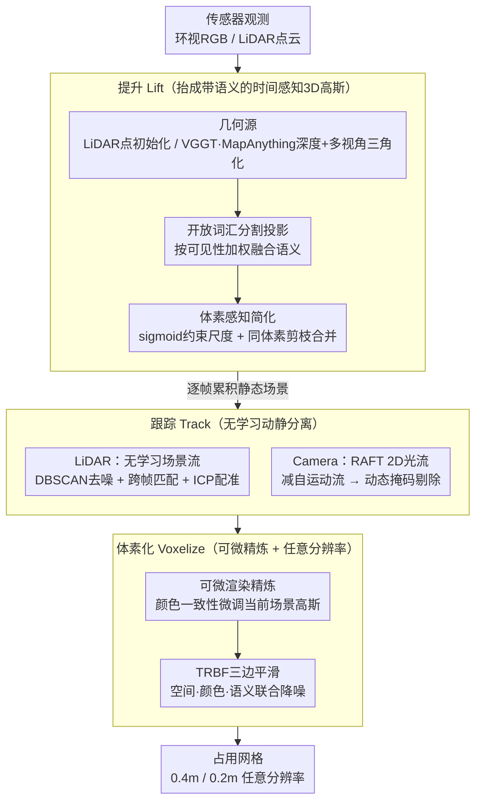

# TT-Occ: Test-Time 3D Occupancy Prediction

**会议**: CVPR2026  
**arXiv**: [2503.08485](https://arxiv.org/abs/2503.08485)  
**代码**: [Xian-Bei/TT-Occ](https://github.com/Xian-Bei/TT-Occ)  
**领域**: 自动驾驶 / 3D占用预测  
**关键词**: 3D occupancy prediction, test-time, 3D Gaussian Splatting, vision foundation models, self-supervised, open-vocabulary

## 一句话总结

提出 TT-Occ，一种无需预训练的测试时3D占用预测框架，通过在推理时集成视觉基础模型（VFMs）来增量构建、优化和体素化时间感知的3D高斯，在 Occ3D-nuScenes 和 nuCraft 上超越了所有需要大量训练的自监督方法。

## 研究背景与动机

**3D占用预测的重要性**：3D占用预测需要准确识别环境中被特定类别物体占据的区域和空闲区域，这对自动驾驶的无碰撞轨迹规划和可靠导航至关重要。

**监督方法标注代价高**：现有全监督方案严重依赖逐帧密集3D标注，在动态驾驶场景中标注成本极高（每帧覆盖80m范围）。

**自监督方法训练开销大**：虽然自监督方法减少了标注成本，但训练开销仍然巨大——例如 SelfOcc 在 Occ3D-nuScenes 0.4m分辨率下需要8卡训练2天（约384 GPU小时）。

**泛化性差**：一旦训练完成，要适配更细分辨率（如0.2m的nuCraft）或新物体类别，都需要大量重新训练，灵活性不足。

**VFMs的崛起改变格局**：VGGT、MapAnything 等3D视觉基础模型提供可靠的多视角几何，REX-Omni 支持开放词汇语义推理，这些能力可直接在测试时获得，无需任务特定训练。

**核心问题**：既然几何和语义信息不再需要网络学习获得，那么训练占用预测模型是否仍然必要？本文通过 TT-Occ 给出了否定回答。

## 方法详解

### 整体框架

TT-Occ 想回答一个反直觉的问题：既然几何由 VGGT/MapAnything 这类 3D 基础模型给出、语义由开放词汇分割模型给出，那还有必要专门训练一个占用解码器吗？它的答案是不必——整个系统在推理时即时跑完一条"提升 → 跟踪 → 体素化"（Lift-Track-Voxelize）的流水线，把每一帧传感器观测抬成一批带语义的时间感知 3D 高斯，逐帧累积成场景，再栅格化成占用网格，全程没有任何任务相关的训练权重。框架提供两个变体：以激光雷达为几何源的 TT-OccLiDAR，和纯多视角相机的 TT-OccCamera，二者共享同一条流水线，只在"几何怎么来""动态物体怎么处理"两处按模态分叉。

### 关键设计

**1. 提升（Lift）：把单帧几何与语义抬成一批带语义的 3D 高斯**

占用预测真正缺的是可靠的逐点几何与类别，而 VFM 时代这两样都能现成拿到，关键是怎么把它们对齐进同一个 3D 表示。几何上，LiDAR 版直接拿稀疏激光点初始化高斯中心，天然继承真实测量的米制坐标；Camera 版则用 VGGT/MapAnything 从环视 RGB 估稠密深度，再靠多视角三角化消掉单目固有的尺度歧义。语义上，对 $M$ 个环视图跑开放词汇分割（OpenSeeD/GroundingSAM2/REX-Omni），把每个高斯中心 $\boldsymbol{\mu}_i$ 投影回各视图取语义、按可见性加权平均，得到该高斯的类别分布：

$$\mathbf{m}_i = \frac{1}{M}\sum_{m=1}^{M}\mathbb{I}_m(\boldsymbol{\mu}_i)\,\mathcal{M}_m\big(\text{Proj}(\boldsymbol{\mu}_i;\mathbf{K}_m,\mathbf{E}_m)\big)$$

其中 $\mathbb{I}_m$ 标记该点在第 $m$ 个相机里是否可见，避免把被遮挡视角的错误语义混进来。直接散射会产生海量冗余高斯，所以这里还做了"体素感知简化"：尺度参数改用 sigmoid（而非常见的指数）约束以防无限膨胀，同一体素内的重复高斯被剪枝、语义概率被合并。这一步等于把"训练一个语义几何编码器"替换成"投影 + 融合"，把网络要学的东西全部外包给了 VFM。

**2. 跟踪（Track）：无学习地分离动静高斯，消除快速物体的拖尾**

逐帧累积静态场景没问题，但车辆、行人这类快速运动物体在任一时刻往往只被部分观测，若把它们也并入静态累积，在线优化就会沿运动轨迹留下一长串"拖尾"鬼影。两个变体都不引入任何可学习的运动网络，而是各用一套现成几何工具估运动。LiDAR 版做无学习场景流：先把激光点投到分割掩码上关联到实例，DBSCAN 去噪，再按空间位置与形状相似度跨帧匹配同一聚类，最后用 ICP 配准算出每个聚类的 3D 运动流；运动高斯因此被单独维护、不污染静态背景。Camera 版没有可靠的逐点 3D 运动，于是退一步用 RAFT 估 2D 光流，减去由自车位姿推出的自运动流得到残差动态流，阈值化成动态掩码——落在掩码里的高斯直接被排除出静态累积。这是个有意的妥协：纯视觉下把动态区域反投影回 3D 只会放大深度噪声，所以宁可"标记并剔除"也不"重建"，代价是 Camera 版无法像 LiDAR 版那样真正累积动态物体。

**3. 体素化（Voxelize）：可微精炼 + 三边平滑 + 任意分辨率输出**

累积出的高斯仍带噪，且最终要变成离散占用网格供下游使用。这一步先做测试时可微精炼：把高斯沿可微渲染投回图像，用颜色一致性约束反向微调它们的参数（注意这是对当前场景的几何参数做优化，不是训练任何跨场景权重）。随后可选地接一个三边径向基函数（TRBF）平滑模块降噪——它把双边滤波的思想从"空间 + 颜色"扩成"空间 + 颜色 + 语义"三因子，对一对高斯 $(i,j)$ 的亲和度取三个核的乘积：

$$\mathcal{K}(i,j) = \mathcal{K}_{\boldsymbol{\mu}}(i,j)\cdot\mathcal{K}_{\mathbf{c}}(i,j)\cdot\mathcal{K}_{\mathbf{m}}(i,j)$$

只有空间相近、颜色相似、语义一致的高斯才会互相平滑，从而在压掉噪点的同时不抹掉物体边界。最后把语义概率按空间邻近度加权聚合到目标网格——因为是在连续高斯上做聚合而非依赖固定分辨率的解码头，所以同一套高斯能直接体素化到任意用户指定分辨率（0.4m 或 0.2m），这正是它能零成本迁移到 nuCraft 高分辨率设置的根源。

### 损失函数

整套流水线唯一的优化信号是体素化阶段的颜色一致性损失：通过可微渲染把 3D 高斯投回图像平面，约束渲染颜色与观测一致，借此精炼当前场景的高斯参数；天空区域以掩码排除，避免无穷远背景干扰几何。这个损失只作用于当前场景的高斯，不产生任何可跨场景复用的训练权重，因此整体仍是"测试时优化"而非"训练"。

## 实验

### 主实验结果

**Occ3D-nuScenes（0.4m分辨率）**：

| 方法 | 输入 | 预训练 | mIoU |
|---|---|---|---|
| SelfOcc (CVPR'24) | C | ~384 GPU hrs | 10.54 |
| GaussianTR (CVPR'25) | C | 有 | 11.70 |
| VEON-LiDAR (ECCV'24) | C&L | 有 | 15.14 |
| **TT-OccCamera** | **C** | **无** | **16.70** |
| RenderOcc (ICRA'24) | C | 有(稀疏3D GT) | 23.93 |
| **TT-OccLiDAR** | **C&L** | **无** | **27.41** |
| BEVFormer (ECCV'22) | C | 有(密集3D GT) | 26.88 |

**nuCraft 高分辨率（0.2m分辨率）**：

| 方法 | 预训练时间 | mIoU |
|---|---|---|
| SelfOcc† | 384 hrs | 2.22 |
| TT-OccCamera | 0 | 5.95 |
| TT-OccLiDAR | 0 | 10.92 |

### 消融实验

| 配置 | TT-OccLiDAR mIoU | TT-OccCamera mIoU |
|---|---|---|
| A: 基线（单帧直接散射） | 7.3 | 4.2 |
| B: + 协方差感知体素化 | 18.3 (+11.0) | 8.5 (+4.3) |
| C: + 继承历史高斯（无跟踪） | 23.5 (+5.2) | 14.1 (+5.6) |
| D: + 动态高斯跟踪 | 25.6 (+2.1) | 14.1 (+0.0) |

### 关键发现

1. **零训练超越训练方法**：TT-OccLiDAR (27.41 mIoU) 甚至超过使用稀疏3D GT训练的 RenderOcc (23.93)，TT-OccCamera (16.70) 超过使用LiDAR监督训练的 VEON-LiDAR (15.14)
2. **分辨率适应性强**：在nuCraft高分辨率设置下，SelfOcc从10.54骤降至2.22，而TT-Occ无需重训即可适配
3. **RayIoU验证几何质量**：TT-OccCamera在RayIoU@4上比SelfOcc提升30.8%，TT-OccLiDAR提升115%
4. **模块化VFM设计**：REX-Omni语义最强，MapAnything深度优于VGGT（因提供度量尺度深度）；框架可即插即用最新VFM
5. **动态跟踪消除拖尾**：不跟踪时动态类（bus, ped）IoU下降严重，跟踪后显著恢复
6. **内存效率**：峰值GPU内存 LiDAR版5.6GB、Camera版9.9GB，均低于10GB

## 亮点

- **范式创新**：首次证明测试时集成VFMs可以完全替代训练密集占用解码器，将3D占用预测从"训练范式"转向"推理范式"
- **极强灵活性**：支持任意体素分辨率、开放词汇语义查询、即插即用替换VFM组件
- **零训练成本**：完全免去数百GPU小时的预训练，直接在验证集推理
- **时间感知高斯**：通过 Lift-Track-Voxelize 流水线实现在线递增式场景重建，动静分离消除拖尾伪影
- **TRBF平滑**：借鉴双边滤波思想扩展为三边核，联合空间-颜色-语义进行自适应降噪

## 局限性

- **依赖VFM质量**：性能上界受限于所使用VFM的能力，GroundingSAM2语义较弱时mIoU降至21.3
- **Camera版动态处理受限**：纯视觉版无法像LiDAR版那样累积动态物体，只能排除动态区域
- **推理速度**：语义分割（OpenSeeD）占整体运行时间的28.5%~77.9%，Camera版还需额外深度估计、三角化等步骤
- **远距离区域Camera版不佳**：因遮挡和深度分辨率限制，纯视觉版在远距离场景的几何精度不如LiDAR版
- **开放词汇依赖提示质量**：VFM的语义分割依赖文本提示（prompt），在标准benchmark上使用预定义label set但实际开放场景中prompt设计影响效果

## 相关工作

- **全监督占用预测**：BEVFormer、CTF-Occ、RenderOcc — 依赖密集/稀疏3D标注
- **自监督占用预测**：SelfOcc（SDF+多视角立体）、OccNeRF（光度一致性）、GaussianOcc/GaussianTR（3DGS表示）、LangOcc/VEON（开放词汇）
- **驾驶场景3D重建**：OmniRe、Street Gaussians、DrivingGaussian、HUGS — 依赖外部先验（HD地图、GT边界框）做离线逐场景重建，而TT-Occ仅用原始传感器流在线推理

## 评分

- 新颖性: ⭐⭐⭐⭐⭐ — 首个无需任何训练的测试时3D占用预测框架，范式性创新
- 实验充分度: ⭐⭐⭐⭐ — 两个数据集、两种模态变体、多VFM组合消融、RayIoU评估，较为全面
- 写作质量: ⭐⭐⭐⭐ — 结构清晰，Lift-Track-Voxelize框架直观易懂
- 价值: ⭐⭐⭐⭐⭐ — 指出VFM时代训练占用模型的必要性可能不再，对自动驾驶感知范式有深远影响

<!-- RELATED:START -->

## 相关论文

- [\[CVPR 2026\] M²-Occ: Resilient 3D Semantic Occupancy Prediction for Autonomous Driving with Incomplete Camera Inputs](m2-occ_resilient_3d_semantic_occupancy_prediction_for_autonomous_driving_with_in.md)
- [\[ICCV 2025\] SA-Occ: Satellite-Assisted 3D Occupancy Prediction in Real World](../../ICCV2025/autonomous_driving/sa-occ_satellite-assisted_3d_occupancy_prediction_in_real_world.md)
- [\[CVPR 2026\] Dr.Occ: Depth- and Region-Guided 3D Occupancy from Surround-View Cameras for Autonomous Driving](drocc_depth_region_guided_3d_occupancy.md)
- [\[CVPR 2026\] Test-Time Training for LiDAR Semantic Segmentation under Corruption via Geometric Inlier Discrimination](test-time_training_for_lidar_semantic_segmentation_under_corruption_via_geometri.md)
- [\[CVPR 2026\] ProOOD: Prototype-Guided Out-of-Distribution 3D Occupancy Prediction](proood_prototype-guided_out-of-distribution_3d_occupancy_prediction.md)

<!-- RELATED:END -->
