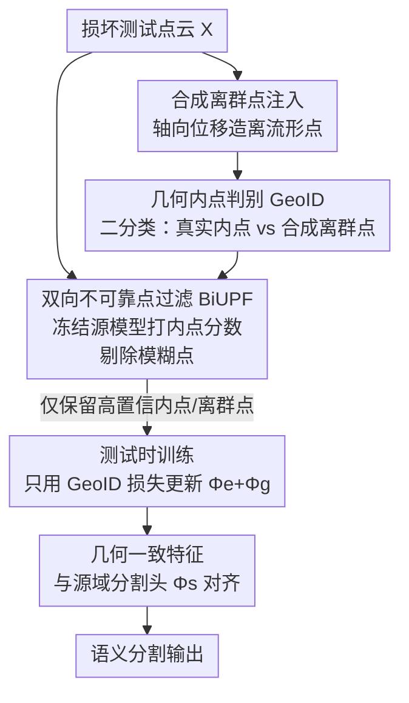

# Test-Time Training for LiDAR Semantic Segmentation under Corruption via Geometric Inlier Discrimination

**会议**: CVPR 2026  
**论文**: [CVF Open Access](https://openaccess.thecvf.com/content/CVPR2026/html/Kim_Test-Time_Training_for_LiDAR_Semantic_Segmentation_under_Corruption_via_Geometric_CVPR_2026_paper.html)  
**代码**: https://github.com/hskim617/GeoID  
**领域**: 自动驾驶 / 3D视觉  
**关键词**: LiDAR语义分割、测试时训练、损坏鲁棒性、自监督、几何内点判别

## 一句话总结
本文提出 GeoID，一个面向 LiDAR 语义分割损坏鲁棒性的测试时训练框架：通过往点云里注入"离流形"合成噪声点、让模型在线区分"几何一致的真实内点"和"被人为位移的合成离群点"这一自监督任务来适应目标域，再配合双向不可靠点过滤（BiUPF）剔除模糊区域，在 SemanticKITTI-C / nuScenes-C 上把 mIoU 分别从 42.33/51.25 提到 46.96/56.73，稳定超过现有 TTA 基线。

## 研究背景与动机
**领域现状**：LiDAR 语义分割（LSS）为点云每个点打语义标签，是自动驾驶和机器人感知的核心。监督式 LSS 在"测试分布=训练分布"时精度很高，但真实部署中传感器故障和天气变化（雾、雪、湿地面、串扰、缺光束等）会严重扭曲点云，让模型掉点明显。

**现有痛点**：要在线无监督地适应这种分布漂移，主流是测试时适应（TTA/TTT）。但现有路线各有短板——把 2D 图像域的熵最小化（TENT）、BN 统计更新（DUA）直接搬到 3D 点云"几乎没用"；而 LiDAR 专用的 GIPSO、HGL 走的是伪标签自训练路线，在**严重损坏**下模型预测本身就不准，错误伪标签反而把适应带偏。

**核心矛盾**：损坏会改变点云的**密度、外观**，但环境的**底层 3D 几何结构**（道路是平面、建筑是立面、车辆有固定形状）在跨域时基本保持不变。现有方法要么依赖会出错的语义伪标签，要么依赖与几何无关的统计量，没有抓住这个"跨损坏仍然守恒"的信号。

**本文目标**：设计一个**不依赖语义伪标签、在线、源数据不可得**的自监督目标，让模型在测试时只靠目标域无标签数据就能稳定适应，并对各类损坏都鲁棒。

**切入角度**：作者的观察是——既然几何一致性跨域守恒，那就让模型学会"识别哪些点贴着真实场景流形、哪些点偏离流形"。这个能力可以用一个完全自监督的代理任务来训练：人为制造一批"破坏几何规律"的离流形点，让模型把它们和真实点区分开。

**核心 idea**：用**几何内点判别（GeoID）**这一自监督任务代替易错的语义伪标签来做测试时训练——往点云注入轴向位移得到的合成离群点，训练编码器把"几何一致的内点"和"人为离流形的离群点"分开，从而在损坏下重建一个与源域分割头兼容的几何一致特征空间。

## 方法详解

### 整体框架
给定一个在源域 $D_{src}$ 上训练好的模型 $F$（共享编码器 $\Phi_e$ + 分割头 $\Phi_s$），目标是仅用目标域无标签测试样本，把模型适应到损坏分布 $P_{tgt}$，且无需任何语义监督。

整个框架分**部署前**和**测试时**两段。部署前（源域）：除了正常训练分割头，还额外挂一个 GeoID 头 $\Phi_g$，用共享编码器**联合训练**分割任务和"内点/离群点判别"任务，让编码器既语义可分、又对几何合理性敏感，为测试时训练提供一个好的初始化。测试时：每来一帧点云，先用**冻结的源模型**给每个点算内点分数，经 BiUPF 过滤掉模糊点，只保留高置信的内点和离群点；再仅用 GeoID 损失在线更新编码器 $\Phi_e$ 和 GeoID 头 $\Phi_g$（分割头 $\Phi_s$ 不动）。这样适应后的编码器会把目标域里几何一致的结构映射成"内点样"特征，从而和源域训练的分割头重新对齐。

### 关键设计

**1. 几何内点判别 GeoID：用"真假点二分类"造一个跨损坏守恒的自监督信号**

这是全文的核心，针对的痛点是"语义伪标签在严重损坏下不可靠"。做法是构造一个不需要任何标签的二分类任务：原始点云记为 $X=\{p_i\}_{i=1}^N$，每个点 $p_i=(x_i, r_i)$ 含 3D 坐标 $x_i$ 和强度 $r_i$。对每个点沿随机选中的某一坐标轴施加位移，得到合成离群点 $\tilde{x}_i = x_i + e_a u$，其中 $u \sim U([-\delta, \delta])$，$e_a$ 是 x/y/z 三个轴单位向量之一；合成点的强度直接从最近的真实点拷贝。把合成点集 $\tilde{X}$ 注入原点云形成增广点云 $\hat{X}=X \cup \tilde{X}$（共 $2N$ 个点），并给真实点打标签 $z_i=1$、合成点打 $z_i=0$。GeoID 头输出内点分数 $c(\hat{p}_i)=\sigma(\Phi_g(\Phi_e(\hat{p}_i)))$，用二元交叉熵 $L_{geo}$ 训练。

为什么这样有效？作者从理论角度给了解释：对固定的真实分布 $P$ 和合成离群分布 $Q$，贝叶斯最优判别器是 $c^*(x) = \frac{P(x)}{P(x)+Q(x)}$。在"真实点更可能构成连贯几何结构、合成位移点更可能离流形"这两个前提下，几何一致点满足 $P(x) \gg Q(x)$ 故 $c^* \approx 1$，离流形点反之 $c^* \approx 0$——于是最优解天然变成一个"几何一致内点指示器"，不需要显式建模表面。关键在于：合成点是被设计来**破坏几何规律**的，而非模仿某种特定损坏；雪、雾、噪声这类损坏伪影在真实点和合成点里都可能出现，与"真/假"标签对不齐，所以优化会自然偏向"几何一致性"这个真正与标签对齐的信号，而不是去拟合具体损坏统计。这正是它能跨多种损坏类型泛化的根因。

**2. 双向不可靠点过滤 BiUPF：剔除几何歧义点，防止自监督把模型带偏**

GeoID 的标签是人为定义的"真=内点、假=离群点"，但现实里这个假设会被打破：损坏会让某些真实测量本身就是伪影（该被当离群点），而一个被位移的合成点偶尔也会恰好落在某个几何表面上（看起来像内点）。这两种情况都是"真假标签不可靠"的歧义区域，若强行用它们更新会造成有害梯度。

BiUPF 用**冻结的源模型** $\Phi_e^{src}, \Phi_g^{src}$ 给每个点算一个内点分数 $c_{src}(p)$ 作为可靠性度量，做双向过滤：原始点里只保留分数高的 $I_{in}=\{i: c_{src}(p_i) \ge \tau_r\}$，合成点里只保留分数低的 $I_{out}=\{j: c_{src}(\tilde{p}_j) \le 1-\tau_r\}$，可靠集 $I = I_{in} \cup I_{out}$。测试时的 GeoID 损失 $L_{test}$ 只在 $I$ 上计算。这样自监督被限制在"明显遵守几何规律的真实点"和"明显违反几何规律的合成点"上，强化了 GeoID 作为鲁棒内点指示器的解释。消融显示 BiUPF 是 GeoID 能稳定工作的关键——去掉它后在 beam missing / incomplete echo / cross sensor 等损坏上甚至会掉到适应前基线以下。

### 损失函数 / 训练策略
源域**联合训练**目标是分割损失与 GeoID 损失之和：$L_{train} = L_{seg} + L_{geo}$，其中合成点通过 ignore mask 不参与分割损失，分割损失 $L_{seg}$ 只在真实点上算交叉熵。**测试时**只用 GeoID 损失 $L_{test}$（在 BiUPF 可靠集 $I$ 上的二元交叉熵）更新 $\Phi_e$ 和 $\Phi_g$，分割头 $\Phi_s$ 冻结。实现上每个测试样本构造 $B=2$ 个独立合成离群集组成 mini-batch，用 Adam 优化器，测试时学习率 0.001，backbone 用 MinkowskiNet（也验证了 Cylinder3D）。

## 实验关键数据

### 主实验
在两个大规模损坏 benchmark（八种损坏类型，三个严重等级取平均）上对比 TTA 基线，报告 mIoU(%)：

| 数据集 | 指标 | Source-only | 最强基线 | GeoID(本文) |
|--------|------|-------------|----------|-------------|
| SemanticKITTI-C | Mean mIoU | 42.33 | 43.58 (TTT) | **46.96** |
| nuScenes-C | Mean mIoU | 51.25 | 51.71 (DUA) | **56.73** |

在 SemanticKITTI-C 上，GeoID 在多数损坏类型上大幅领先；尤其 Crosstalk（串扰）从 source-only 的 24.46 提到 40.82，Fog 从 33.20 提到 40.14，Snow 从 32.04 提到 40.63。2D 域方法（TENT、DUA）和 LiDAR 伪标签方法（GIPSO、HGL）在不少损坏上反而低于 source-only，印证了伪标签自训练在严重漂移下失效。换 Cylinder3D backbone（在另一 benchmark 上对比 MixNorm/TENT/CoTTA/NormFusion）GeoID 仍取得最佳 55.46，说明方法不绑定特定架构。

### 消融实验
在 SemanticKITTI-C 中等严重度下分析 GeoID 与 BiUPF（mIoU，括号为相对适应前的增减）：

| 配置 | Fog | Snow | Crosstalk | Beam Missing | Cross Sensor |
|------|-----|------|-----------|--------------|--------------|
| Pre-adapt.（未适应） | 38.3 | 33.7 | 25.5 | 51.7 | 50.9 |
| Adapt. (w/o BiUPF) | 42.5 (+4.2) | 39.8 (+6.1) | 43.1 (+17.6) | 50.5 (−1.2) | 48.2 (−2.7) |
| Adapt. (w/ BiUPF) | 42.6 (+4.3) | 40.7 (+7.0) | 40.9 (+15.4) | 52.7 (+1.0) | 51.3 (+0.4) |

完整模型（GeoID+BiUPF）相对适应前平均提升 4.0%；去掉 BiUPF 只用 GeoID 时，beam missing / incomplete echo / cross sensor 这几种损坏会掉到适应前基线**以下**（如 cross sensor −2.7），说明剔除不可靠点对稳定适应至关重要。

### 关键发现
- **BiUPF 是稳定器**：GeoID 单独使用在某些损坏上会有害更新，BiUPF 把这些负增益基本扭正（cross sensor 从 −2.7 → +0.4），是"几何自监督能否安全在线更新"的关键。
- **几何信号优于损坏特定线索**：合成点被刻意设计成破坏几何而非模仿某种损坏，这让优化偏向跨损坏守恒的几何一致性，是单一自监督任务能覆盖八种损坏的根因。
- **稀疏适应可换 FPS**：在 A6000 上每 30 帧更新一次（stride-30）仍能跑 >12 FPS，仅掉 2.31%，相对 source-only 还有 +2.41%，兼顾实时性。
- **持续适应有效**：在八种损坏随机拼成的连续测试流上，相对适应前平均提升 4.37%，说明能应对时变损坏。

## 亮点与洞察
- **把"几何守恒"翻译成一个可自监督的二分类**：最巧的是不去建模"表面长什么样"，而是让贝叶斯最优判别器自动收敛成内点指示器——用一个简单的真/假点分类，等价地学到了"贴流形 vs 离流形"，避免了显式几何先验。
- **合成噪声的设计哲学很关键**：刻意让合成点破坏几何而非模仿损坏，从而保证自监督信号与"几何一致性"对齐而非与"某种损坏统计"对齐——这是它能一招通吃八种损坏的本质，值得迁移到其他需要跨域不变信号的 TTA 任务。
- **双向过滤的对称性**：不只过滤"看起来是噪声的真实点"，也过滤"看起来像真的合成点"，两侧都用冻结源模型打分，这种双向可靠性筛选思路可复用到任何带人造正负样本的自监督适应。

## 局限与展望
- 方法依赖"几何一致语义跨域守恒"这一假设，对那些**几何也被大幅破坏**或语义与几何耦合很弱的极端场景，GeoID 信号可能减弱（作者未在此类场景充分验证）。
- 合成离群点由轴向位移 + 最大位移 $\delta$ 控制，$\tau_r$、$\delta$、扰动方向都是超参，正文只说敏感性分析放在补充材料，⚠️ 具体取值与鲁棒区间以原文补充材料为准。
- 测试时需要反向传播更新编码器，虽然 stride 可调，但相对纯前向的 BN 类方法仍有额外计算开销；在 Crosstalk 这种极端损坏上 nuScenes-C 反而略逊于个别基线（30.84 vs DUA 32.90），说明并非对所有损坏都最优。

## 相关工作与启发
- **vs TTT（旋转预测）**：同为自监督代理任务驱动的测试时训练，但 TTT 用旋转预测，本文用几何内点判别。结果显示旋转预测对 LSS 帮助有限（KITTI-C 仅 43.58），而 GeoID 的几何信号更契合 LiDAR 点云结构，差距明显。
- **vs GIPSO / HGL（LiDAR 伪标签自训练）**：它们靠几何特征传播伪标签或 KNN 聚类 + 原型精修伪标签，本质仍依赖可能出错的语义预测，在严重损坏下容易被错误伪标签带偏；本文绕开语义伪标签，改用完全自监督的真/假点判别，不受预测精度拖累。
- **vs TENT / DUA（2D 域 BN/熵方法）**：它们直接搬 2D 的熵最小化或 BN 统计更新，在 3D 稀疏不规则点云上几乎无效；本文针对点云几何特性专门设计自监督任务，证明了"为模态量身定制代理任务"的价值。

## 评分
- 新颖性: ⭐⭐⭐⭐ 把"几何守恒"转化为可自监督的真/假点判别并给出贝叶斯最优解释，角度新颖
- 实验充分度: ⭐⭐⭐⭐ 两个大规模损坏 benchmark + 双 backbone + 稀疏/持续适应 + 消融，较完整
- 写作质量: ⭐⭐⭐⭐ 理论直觉与各损坏类型的解读清晰，逻辑顺畅
- 价值: ⭐⭐⭐⭐ 直击自动驾驶安全关键场景的损坏鲁棒性，方法简洁可复现，代码开源

<!-- RELATED:START -->

## 相关论文

- [\[CVPR 2026\] TT-Occ: Test-Time 3D Occupancy Prediction](test-time_3d_occupancy_prediction.md)
- [\[ICLR 2026\] Adaptive Augmentation-Aware Latent Learning for Robust LiDAR Semantic Segmentation](../../ICLR2026/autonomous_driving/adaptive_augmentation-aware_latent_learning_for_robust_lidar_semantic_segmentati.md)
- [\[CVPR 2026\] Learning Geometric and Photometric Features from Panoramic LiDAR Scans for Outdoor Place Categorization](learning_geometric_and_photometric_features_from_p.md)
- [\[ICCV 2025\] Adaptive Dual Uncertainty Optimization: Boosting Monocular 3D Object Detection under Test-Time Shifts](../../ICCV2025/autonomous_driving/adaptive_dual_uncertainty_optimization_boosting_monocular_3d_object_detection_un.md)
- [\[CVPR 2026\] SG-NLF: Spectral-Geometric Neural Fields for Pose-Free LiDAR View Synthesis](sgnlf_spectralgeometric_neural_fields_for_posefre.md)

<!-- RELATED:END -->
