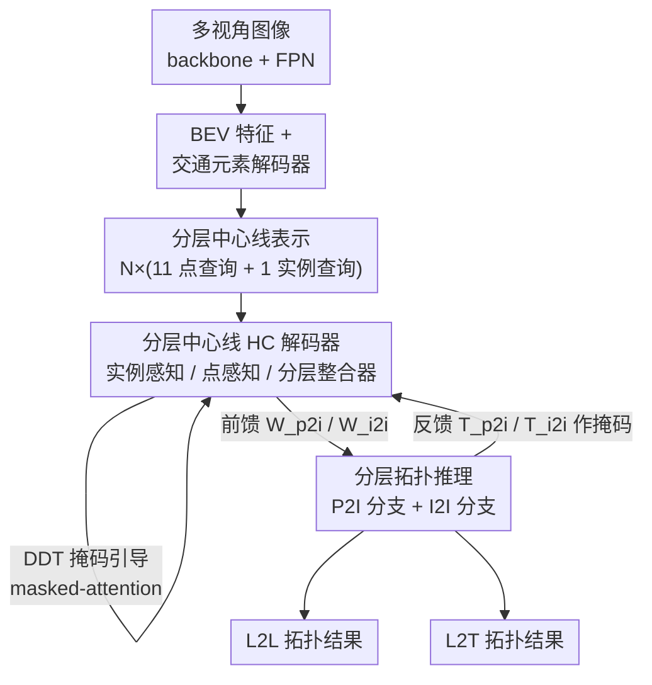

# TopoHR: Hierarchical Centerline Representation for Cyclic Topology Reasoning in Driving Scenes with Point-to-Instance Relations

**会议**: CVPR 2026  
**arXiv**: [2604.24119](https://arxiv.org/abs/2604.24119)  
**代码**: https://github.com/Yifeng-Bai/TopoHR.git (有)  
**领域**: 自动驾驶 / 车道拓扑推理  
**关键词**: 中心线检测, 拓扑推理, 点到实例关系, 循环交互, OpenLane-V2

## 一句话总结
TopoHR 把"中心线检测"和"拓扑推理"从串行级联改成**循环互增强**结构，并引入"点查询 + 实例查询"的分层中心线表示，让拓扑推理同时利用细粒度的点到实例（P2I）关系和全局实例到实例（I2I）关系，在 OpenLane-V2 上把 TOP$_{ll}$ 等指标大幅刷新（subset_A +5.4 TOP$_{ll}$、subset_B +7.9 TOP$_{ll}$）。

## 研究背景与动机

**领域现状**：车道拓扑推理是自动驾驶高层决策（变道、路径规划）的基础——它要回答"哪条中心线的终点接到哪条中心线的起点""哪条车道受哪个交通元素（红绿灯/标志）管辖"。主流做法（TopoNet、TopoMLP、TopoLogic 等）是一个**串行流水线**：先用一个 transformer 检测器把中心线检测出来（输出实例级 query），再接一个独立的拓扑推理模块，通常就是几层 MLP，对实例 query 两两判断有没有连接关系。

**现有痛点**：这套串行设计有两个结构性问题。其一，检测和推理被**分开优化**，特征表示不一致——推理模块只能被动接受检测器给的实例 query，检测器又完全感知不到拓扑结构，二者无法互相纠错。其二，推理只在**实例级**用简单 MLP 做，无法刻画城市路网里复杂的空间依赖；而且现有方法几乎都**忽视了点到实例（P2I）关系**——中心线本质是一串点，一条线的"某个端点"是否接到"另一条线整体"，这种细粒度连接关系被实例级 MLP 抹掉了。

**核心矛盾**：中心线是一种"看不见的虚拟物体"（路面上并没有真实可见的中心线像素），检测它本就困难；而拓扑关系又是**分层的**——两条中心线 $\mathcal{C}_i$、$\mathcal{C}_j$ 之间的连接，不仅存在于"实例 vs 实例"，也存在于" $\mathcal{C}_i$ 的点 vs $\mathcal{C}_j$ 的实例"。串行 + 实例级 MLP 的范式同时丢掉了检测/推理的协同和这种分层结构。

**本文目标**：(1) 让检测器和拓扑推理模块互相喂信号、协同进化；(2) 用一种能同时表达点级和实例级的中心线表示，把 P2I 和 I2I 关系都建模进来。

**核心 idea**：用**循环交互（cyclic）结构**替代串行级联——检测器把注意力权重前馈给推理模块，推理模块再把拓扑关系反馈回检测器；同时用"点查询 + 实例查询"的**分层表示**，让拓扑推理在 P2I 和 I2I 两个粒度上同时进行。

## 方法详解

### 整体框架
TopoHR 输入多视角相机图像，经共享 backbone（ResNet-50 + FPN）抽特征，一路做视角变换得到 BEV 特征、一路用解码器检测交通元素。核心是三个组件：**分层中心线（HC）解码器**、**分层 L2L 拓扑模块**（中心线↔中心线）、**分层 L2T 拓扑模块**（中心线↔交通元素）。关键转变在于：HC 解码器和 L2L 拓扑模块不是串行的，而是组成一个**循环迭代块**——解码器算出的注意力权重 $\mathbf{W}_{\text{p2i}}$、$\mathbf{W}_{\text{i2i}}$ 前馈进拓扑模块，拓扑模块推出的关系 $\mathbf{T}_{\text{p2i}}$、$\mathbf{T}_{\text{i2i}}$ 又作为注意力掩码反馈回解码器，逐层迭代让二者互相增强。

整条中心线被建模为一个**分层 query** $\mathbf{Q}_{\text{hcl}}\in\mathbb{R}^{N(P+1)\times C}$：$N$ 条中心线，每条配 $P$ 个点查询（$P{=}11$）+ 1 个实例查询。HC 解码器内部由三个模块协同刷新这套 query：实例感知模块抓全局语义、点感知模块抓局部几何、分层整合器把两级特征融合。

### 关键设计

**1. 循环互增强结构：让检测器和拓扑推理停止"各练各的"**

针对"串行级联导致检测/推理分开优化、特征不一致"的痛点，TopoHR 在 HC 解码器和 L2L 拓扑模块之间建立**双向信息流**。前向：解码器内 Integrator Attention 产生的 P2I 权重 $\mathbf{W}_{\text{p2i}}\in\mathbb{R}^{NP\times N}$、Topo-Aware Attention 产生的 I2I 权重 $\mathbf{W}_{\text{i2i}}\in\mathbb{R}^{N\times N}$ 被送进拓扑推理模块；反向：拓扑模块推出的关系 $\mathbf{T}_{\text{p2i}}$、$\mathbf{T}_{\text{i2i}}$ 经一个 3 层 MLP 的 relation encoder 转成注意力掩码 $\mathbf{M}_{\text{i2i}}$、$\mathbf{M}_{\text{p2i}}$，反馈回解码器的 topo-aware / integrator attention。这样每经过一层，检测器就"知道"了上一层推出的拓扑结构、并据此调整中心线特征，推理模块也拿到更准的注意力先验，形成互相纠错的迭代回路。作者称这是首个在中心线检测和拓扑推理间建立"互增强循环"的工作——与 TopoLogic 只把几何先验**单向**注入推理不同，这里是真正的双向闭环。

**2. 分层中心线表示与 HC 解码器：同时握住"点"和"线"两级特征**

现有方法只用 $N$ 个实例 query，把每条中心线压成一个向量，丢掉了点级几何。TopoHR 额外引入 $NP$ 个点查询，让 query 同时表达局部几何和全局语义，并在 HC 解码器里用三个模块分工刷新：(a) **实例感知模块**用 masked-attention（受 DDT 掩码约束，聚焦中心线附近区域）+ topo-aware attention（受 I2I 关系掩码引导）抽全局语义；(b) **点感知模块**用 line-aware attention（受 P2P 约束掩码 $\mathbf{M}_{\text{p2p}}\in\mathbb{R}^{NP\times NP}$ 约束——同一条线内的点之间设 0、跨线设 1，禁止跨实例信息泄漏）+ cross-attention 抽局部几何；(c) **分层整合器**做两级融合：点查询作 $\mathbf{Q}$、实例查询作 $\mathbf{K}/\mathbf{V}$ 做 cross-attention，注意力里加上 P2I 关系掩码 $\mathbf{M}_{\text{p2i}}$：

$$\mathbf{\hat{Q}}_{\text{pts}} = \text{softmax}(\mathbf{Q}\mathbf{K}^{T}+\mathbf{M}_{\text{p2i}})\mathbf{V}$$

再用可学习系数 $\mathbf{W}_{\text{agg}}\in\mathbb{R}^{P}$ 把刷新后的点查询聚合回实例查询 $\mathbf{\hat{Q}}_{\text{ins}}=\sum_{p=1}^{P}\mathbf{\hat{Q}}_{\text{pts}}[:,p,:]\,\text{softmax}(\mathbf{W}_{\text{agg}})_p$。这样局部位置细节和全局语义上下文在每层之间相互传播，既不让点查询孤立、也不让实例查询丢失几何。

**3. 离散距离变换（DDT）掩码：给"看不见的中心线"造一个可监督的空间信号**

中心线是人为定义的虚拟物体，没有独特像素特征，直接做二值分割很难收敛。TopoHR 改用**距离变换**：对 BEV 图上每个像素 $\mathbf{b}$，算它到最近中心线点的欧氏距离，裁剪到车道半宽 $L_{\text{width}}/2$ 内、归一化到 $[0,1]$，再**均匀离散成 6 档**，得到 DDT 掩码 $\texttt{DDT}(\mathbf{b})$。相比二值分割（所有正样本一视同仁），距离变换天然编码了"离中心线多近"的空间邻近度；相比连续距离变换，离散化既省算又让特征表达更稳。这个 DDT 掩码既用于实例感知模块的 masked-attention，也用于实例匹配和分割损失计算。消融显示，把分割监督从二值/连续 DT 换成 DDT，DET$_l$ 从 32.6/32.0 提到 34.6，是检测精度的关键来源。

**4. 分层拓扑推理：把"点接线"这种细粒度连接也算进去**

作者的核心洞察是拓扑关系本身分层——两条线的连接，不只体现在"实例 vs 实例"，也体现在" $\mathcal{C}_i$ 的点 vs $\mathcal{C}_j$ 的实例"。于是拓扑模块设两条分支并融合：I2I 分支用双 MLP 把实例 query 编码后做内积、再加上 I2I 注意力权重的 MLP 编码：

$$\mathbf{T}_{\text{i2i}} = \mathbf{Q}^{\text{sim1}}_{\text{ins}}(\mathbf{Q}^{\text{sim2}}_{\text{ins}})^{\top} + \operatorname{MLP}(\mathbf{W}_{\text{i2i}})$$

P2I 分支同理，但用点 query 与实例 query 做相似度、并沿点维度做平均：

$$\mathbf{T}_{\text{p2i}} = \mathbf{Q}^{\text{sim}}_{\text{pts}}(\mathbf{Q}^{\text{sim3}}_{\text{ins}})^{\top} + \operatorname{MLP}(\mathbf{W}_{\text{p2i}})$$

最终拓扑结果由 $\mathbf{T}_{\text{i2i}}$ 和 $\mathbf{T}_{\text{p2i}}$ 联合得到。每个分支都同时用了"显式特征相关（query 内积）"和"隐式依赖（来自循环结构的注意力权重）"，比纯实例级 MLP 能刻画更细的连接。同一套设计也复用到 L2T 模块，建模中心线与交通元素的从属关系。

### 损失函数 / 训练策略
总损失 $\mathcal{L}=\mathcal{L}_{\text{det}}+\mathcal{L}_{\text{seg}}+\mathcal{L}_{\text{topo}}$。其中 $\mathcal{L}_{\text{det}}$ 是中心线检测的 focal loss + 向量化回归的 $\ell_1$ loss；$\mathcal{L}_{\text{seg}}$ 是 dice + 交叉熵，用 DDT 掩码监督实例感知特征。

**自适应拓扑损失（ATL）**是一个独立贡献：拓扑关系矩阵里负样本（不连接）远多于正样本，且高置信度的假阳性最有害。ATL 用一种基于重参数化交叉熵的动态加权——负样本权重按指数缩放 $e^{\lambda_{\text{neg}} x_i}$（$x_i$ 是预测的正概率），正样本则固定权重 $\lambda_{\text{pos}}$。这样对"高置信度却错判为连接"的负样本施加更大惩罚，自适应地抑制假阳性，同时保持拓扑一致性。消融中最优配置为 $\lambda_{\text{neg}}{=}5$、$\lambda_{\text{pos}}{=}400$。

训练用 8×4090（TopoHR-L 用 8×A100），batch 8，24 epoch（TopoHR-L 为充分收敛延到 48 epoch），AdamW，初始学习率 $3\times10^{-4}$，权重衰减 0.01；图像 resize 到 1024×775，BEV 网格 200×100，初始化 200 个分层中心线 query。单卡 RTX 4090 上 12.6 FPS。

## 实验关键数据

### 主实验
OpenLane-V2 benchmark（整合 Argoverse2 + nuScenes，2000 个场景，分 subset_A 七视角 / subset_B 六视角）。指标：DET$_l$（中心线 Fréchet 距离）、DET$_t$（交通元素 IoU）、TOP$_{ll}$（中心线拓扑矩阵相似度）、TOP$_{lt}$（中心线-交通元素拓扑相似度）、OLS（综合）。全部用 ResNet-50 backbone。

| 数据集 | 指标 | TopoHR-L(48ep) | 之前 SOTA | 提升 |
|--------|------|------|----------|------|
| subset_A | DET$_l$ | 37.6 | 34.7 (TopoFormer) | +2.9 |
| subset_A | TOP$_{ll}$ | 34.6 | 31.2 (SEPT) | +3.4 |
| subset_A | TOP$_{lt}$ | 35.6 | 32.2 (RelTopo) | +3.4 |
| subset_A | OLS | 50.8 | 48.9 (RelTopo) | +1.9 |
| subset_B | DET$_l$ | 43.6 | 34.8 (TopoFormer) | +8.8 |
| subset_B | TOP$_{ll}$ | 39.7 | 31.8 (RelTopo) | +7.9 |
| subset_B | OLS | 53.4 | 49.7 (RelTopo) | +3.7 |

注：论文摘要里 "+3.8 DET$_l$ / +5.4 TOP$_{ll}$ on subset_A" 是相对各自最强可比基线（如 TopoLogic）的口径；上表取的是各列历史最佳第二名作对照，故数值略有差异。subset_B 提升尤其夸张（DET$_l$ +8.8、TOP$_{ll}$ +7.9），因为该子集视角少、原本更难，分层表示 + 循环结构带来的收益更明显。

### 消融实验
全部在 subset_A、200 query、24 epoch 下进行；baseline 是去掉 GNN 的 TopoLogic。

| 配置（分层中心线表示，表3） | DET$_l$ | TOP$_{ll}$ | 说明 |
|------|---------|------|------|
| 仅实例 query (Ins) | 26.8 | 23.1 | baseline |
| Ins+Pts | 19.6 | 24.9 | 加点查询，TOP 升但 DET 暴跌（点查询无约束反而干扰检测）|
| +P2P 约束 | 20.1 | 25.1 | 防跨实例泄漏，小幅回升 |
| +分层整合器 | 32.2 | 26.3 | **关键跳变**：DET$_l$ 从 20→32 |
| +Seg(二值GT) | 32.6 | 29.8 | 加分割监督 |
| +Seg(DDT) | **34.6** | **30.6** | DDT 最优，比 baseline 累计 +7.8 / +7.5 |

| 配置（循环+P2I，表4） | DET$_l$ | TOP$_{ll}$ | TOP$_{lt}$ |
|------|---------|------|------|
| 仅 Ins query，无循环 | 34.8 | 31.0 | 31.1 |
| +I2I 前馈/反馈 | 35.6 | 31.5 | 32.9 |
| +I2I & P2I（完整循环） | **36.1** | **31.8** | **34.6** |

### 关键发现
- **分层整合器贡献最大**：单独加点查询会让 DET$_l$ 从 26.8 暴跌到 19.6（点级特征无约束反而扰乱检测），必须靠 P2P 约束 + 分层整合器把点/实例两级正确融合，DET$_l$ 才一举跳到 32.2——说明"分层表示"的价值不在于多加 query，而在于**怎么整合**。
- **DDT 优于二值分割和连续距离变换**：DDT 给中心线这种无视觉特征的虚拟物体提供了离散化的空间邻近监督，DET$_l$ 比二值 GT 高 2.0。
- **P2I 关系主要提升 TOP$_{lt}$**：表4中加入 P2I 后 TOP$_{lt}$ 从 32.9 跳到 34.6（+3.5），远大于对 TOP$_{ll}$ 的提升（+0.3），印证点到实例的细粒度连接对"中心线-交通元素"这类异质拓扑帮助最大。
- **ATL 对 TOP$_{lt}$ 增益明显**：相比 focal loss，ATL 带来 +2.3 TOP$_{lt}$；$\lambda_{\text{pos}}$ 在 400 时最优（200/800 都掉点），说明对假阳性的惩罚强度需要适中。
- 代价可控：引入点查询 + DDT 分割只增加 **13.8% 参数**。

## 亮点与洞察
- **把"检测 vs 推理"从主从关系改成共生关系**：循环互增强是最核心的范式转变——以往拓扑推理只能被动吃检测器的结果，TopoHR 让推出的拓扑关系反过来当注意力掩码去校正检测特征，这个双向闭环思路可迁移到任何"感知→关系推理"的级联任务（如场景图生成、HOI 检测）。
- **"拓扑关系是分层的"这个观察很有画面感**：两条线连不连，不只看两条线整体，还要看一条线的端点 vs 另一条线——P2I 关系正是补上了实例级 MLP 抹掉的这一层，且实验证明它专门救 TOP$_{lt}$。
- **DDT 掩码是处理"虚拟物体"的巧思**：中心线没有可见像素，直接分割学不动；用离散距离变换把"离中心线多近"变成可监督的软标签，是一个能复用到其他无显式边界目标（如可行驶区域边界、车道分隔逻辑线）的 trick。

## 局限性 / 可改进方向
- **TopoHR-L 收敛慢**：在更复杂的 subset_A 上，大模型早期训练几乎没收益，必须延到 48 epoch 才出效果，训练成本不低。
- **ATL 超参未充分探索**：作者明确说只验证"强调假阳性"这一思路、没做系统的 $\lambda_{\text{neg}}/\lambda_{\text{pos}}$ 搜索，最优组合可能因数据集而异。
- **交通元素检测沿用 TopoLogic 未改**：DET$_t$ 与 TopoLogic 几乎持平，方法的提升集中在中心线侧，对交通元素感知本身没有贡献。
- 自评局限：循环迭代块每层都要做反馈 MLP + 多种 masked-attention，虽然 12.6 FPS 尚可，但相对纯 MLP 推理的方法在部署算力上更重；点查询数 $P{=}11$ 固定，对超长/超弯中心线的表达力是否够未讨论。

## 相关工作与启发
- **vs TopoNet / TopoMLP**: 它们是"检测优先、推理在后"的串行级联 + 实例级 MLP 推理；TopoHR 改成循环互增强 + 分层 P2I/I2I 推理，根本区别在于检测和推理能互相纠错、且建模了点级连接。
- **vs TopoLogic**: TopoLogic 把几何先验**单向**注入推理；TopoHR 是真正的**双向**循环（拓扑结果反馈回检测器当掩码），且额外引入点查询与 DDT 分割监督。
- **vs RelTopo / TopoPoint**: 它们靠加大 query 数（300）或端点检测来提拓扑精度；TopoHR 用 200 query 就超过它们的 300 query 结果，提升来自表示与结构而非堆 query 数量。
- **vs TopoMask（分割派）**: TopoMask 直接对中心线做实例分割再后处理出向量；TopoHR 不直接分割，而用 DDT 距离掩码作辅助监督 + masked-attention，规避了"中心线无可见像素难分割"的问题。

## 评分
- 新颖性: ⭐⭐⭐⭐⭐ 循环互增强 + 分层 P2I 拓扑是对串行级联范式的实质性突破，"拓扑分层"洞察有启发性
- 实验充分度: ⭐⭐⭐⭐☆ 两个子集 + 4 组消融把每个组件拆得很清楚，但缺跨数据集泛化与更多 backbone
- 写作质量: ⭐⭐⭐⭐☆ 动机层层递进、图文对照清晰，个别公式与摘要口径需对照原文
- 价值: ⭐⭐⭐⭐⭐ OpenLane-V2 大幅刷 SOTA（subset_B +7.9 TOP$_{ll}$），代码开源，对在线高精地图/拓扑推理方向实用价值高

<!-- RELATED:START -->

## 相关论文

- [\[AAAI 2026\] Fine-Grained Representation for Lane Topology Reasoning](../../AAAI2026/autonomous_driving/fine-grained_representation_for_lane_topology_reasoning.md)
- [\[CVPR 2026\] ColaVLA: Leveraging Cognitive Latent Reasoning for Hierarchical Parallel Trajectory Planning in Autonomous Driving](colavla_leveraging_cognitive_latent_reasoning_for_hierarchical_parallel_trajecto.md)
- [\[CVPR 2026\] ReScene4D: Temporally Consistent Semantic Instance Segmentation of Evolving Indoor 3D Scenes](rescene4d_temporally_consistent_semantic_instance_segmentation_of_evolving_indoo.md)
- [\[CVPR 2026\] An Instance-Centric Panoptic Occupancy Prediction Benchmark for Autonomous Driving](an_instance-centric_panoptic_occupancy_prediction_benchmark_for_autonomous_drivi.md)
- [\[CVPR 2026\] SGDrive: Scene-to-Goal Hierarchical World Cognition for Autonomous Driving](sgdrive_scene-to-goal_hierarchical_world_cognition_for_autonomous_driving.md)

<!-- RELATED:END -->
