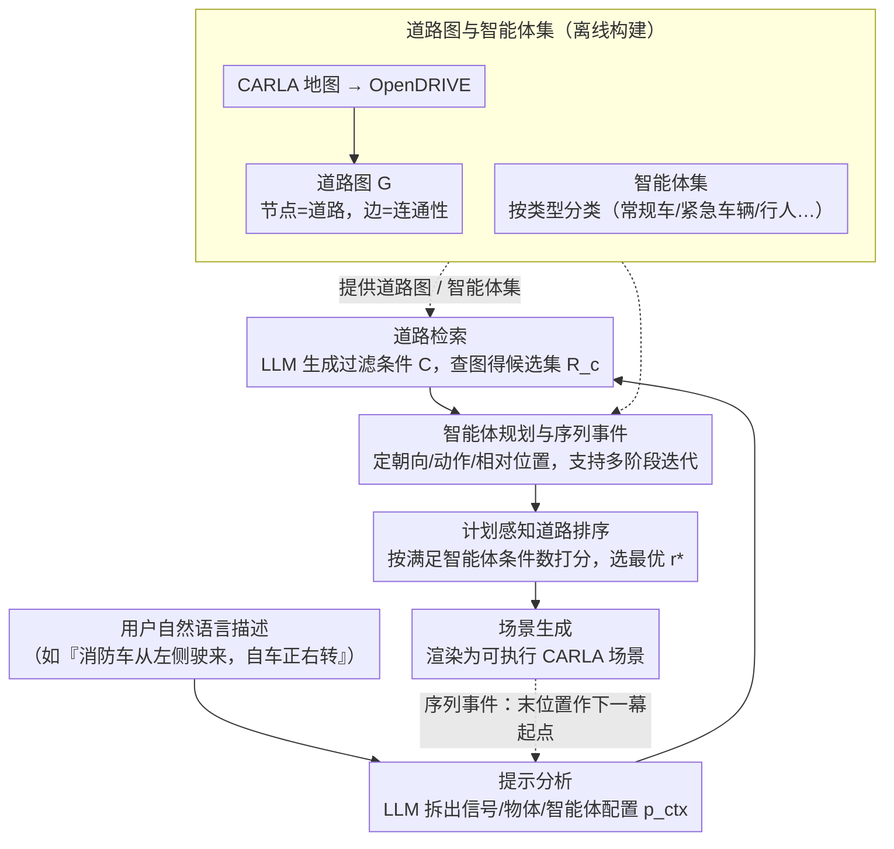

# Traffic Scene Generation from Natural Language Description for Autonomous Vehicles with Large Language Model

**会议**: CVPR 2026  
**arXiv**: [2409.09575](https://arxiv.org/abs/2409.09575)  
**代码**: [https://basiclab.github.io/TTSG](https://basiclab.github.io/TTSG)  
**领域**: 自动驾驶 / 场景生成  
**关键词**: 交通场景生成, 自然语言驱动, 大语言模型, 自动驾驶仿真, CARLA

## 一句话总结

提出 TTSG，一个无需训练的模块化框架，能够直接从自由格式自然语言描述生成逼真的交通场景，通过 LLM 驱动的提示分析、道路检索、智能体规划和计划感知道路排序算法，无需预定义路线或生成点，在 SafeBench 上实现最低 3.5% 平均碰撞率。

## 研究背景与动机

交通场景数据集（如 nuScenes、Waymo）为自动驾驶模型提供了丰富的多模态驾驶日志，但真实世界数据收集受安全限制和可控性不足的制约。CARLA、MetaDrive 等仿真平台提供了安全、可扩展的实验环境，但现有的场景生成方式存在明显不足：随机采样缺乏针对性的控制力来系统评估特定失效模式和边缘案例；基于日志回放的方法受限于收集数据的分布，难以生成新颖场景。

近期的指令驱动仿真方法虽然增强了可控性，但存在三个核心痛点：(1) LCTGen、ProSim 等依赖结构化输入，无法处理自由格式自然语言；(2) ChatScene 仅关注智能体规划，仍需用户手动指定生成点和地图位置；(3) 所有先前工作都忽略了交通信号、静态道路物体和天气等环境条件。

核心矛盾在于：用户希望用自然语言描述复杂场景（如"一辆消防车从左侧道路驶来，此时自车正在右转"），但现有系统缺乏将自由文本落地为空间有效、语义连贯布局的能力，尤其是在没有预定义位置的情况下组合场景。

TTSG 的核心 idea：设计一个免训练的模块化流水线，将 LLM 嵌入严格控制的管道中执行结构化、可行的场景分解，并通过计划感知的道路排序算法确保智能体动作与道路几何的一致性。

## 方法详解

### 整体框架

TTSG 要解决的问题是：用户只给一句自由格式的自然语言（"一辆消防车从左侧道路驶来，此时自车正在右转"），系统就要在仿真器里摆出一个空间上合法、语义上对得上的可执行交通场景，而且不许用户预先指定生成点和地图位置。难点在于自然语言到底落到地图哪条路、哪个朝向、谁在谁前面，全得自己推。

TTSG 的做法是把这件事拆成一条受约束的五阶段流水线，让 LLM 只在每一步做局部、结构化的判断，而不是放手让它一次生成整个场景。整条链路是：先由 LLM 把输入文本**分解**成结构化场景元素（提示分析）→ 据此从预构建的道路图里**检索**候选道路 → LLM 为每个智能体**规划**类型、动作和相对位置 → 用一个匹配算法给候选道路**排序**、挑出最契合计划的那条 → 最后由渲染模块把所有信息**落地**成可执行场景。这一切都站在离线构建好的「道路图与智能体集」之上，且关键是 LLM 始终被夹在结构化的输入输出之间，避免它自由发挥产生空间上不可行的幻觉；末尾生成的位置还能回流成下一幕的起点，支撑时间连续的序列事件。

### 关键设计

**1. 道路图与智能体集：把地图变成可查询的结构化数据库**

如果不预先把地图整理好，"从左侧道路驶来""在交叉口右转"这类描述根本无处落地。TTSG 先把 CARLA 内置地图转成 OpenDRIVE 格式，解析出每条路的交通信号、静态物体、交叉口、车道配置等特征，再组织成一张图——节点是道路，边表示道路之间的连通性。智能体则按类型分好类（常规车辆、紧急车辆、行人等），每类可随机抽取实例。这样一来，"哪些路能右转""这条路和那条路是否相连"都退化成对图的邻接查询，自动选生成点和检索候选道路才有了基础设施；后续所有阶段都站在这张图上工作。

**2. 提示分析：用拆题式分析替代思维链，省 token 又不丢理解**

直接让 LLM 用思维链（CoT）一口气把整个场景推完，输出 token 多、对本地模型/API 都更贵。TTSG 改走"分析式"路线：先让 LLM 把输入提示 $p$ 显式拆成所需交通信号、静态物体、智能体配置等结构化组件 $p^{ctx}=\text{LLM}^{\text{analysis}}(p)$，作为后续检索、规划阶段共享的上下文知识。这样每一步都带着已拆好的场景理解去做局部判断，既压住幻觉，又把 token 用量从 1022 降到 682（约省 33%），质量仍接近 CoT，且与 CoT 组合还能进一步拉高规划精度。

**3. 智能体规划与序列事件：把多智能体交互和多阶段剧情都接进来**

光拆好题还不够，多辆车之间谁朝哪、谁在前、第二幕从哪接，都要安排。LLM 为每个智能体指定八个方向之一的朝向、具体动作（直行、停车等）和相对距离，并用一个 "position" 属性表达智能体间的相对前后关系（值越小越靠前），于是"两辆车一前一后挡住自车"这类交互能被准确摆出。更进一步，序列事件靠迭代规划实现：先跑完整条管道生成初始事件，把它的结束位置当作下一幕的起点，后续只需重跑提示分析和智能体规划两步。这让"左转之后又被两辆车堵住"这种时间连续的多阶段场景成为可能——而这正是只做单步智能体规划的先前工作做不到的。

**4. 计划感知道路排序：检索候选路后按匹配数打分选最优**

选错路是免去预定义生成点后最容易翻车的环节。检索阶段先由 LLM 据 $p$ 和上下文 $p^{ctx}$ 生成过滤条件 $C$（车道数、车道类型、有无红绿灯/人行横道等），作用到道路图 $\mathcal{G}$ 上得到候选集 $R_c$。但候选集里哪条最契合所有智能体的计划，还得排序：对每条候选道路 $r$，统计有多少个智能体的条件能在这条路上被满足，取满足数最多的那条

$$r^* = \arg\max_{r \in R_c} \sum_{a \in A} \mathbf{1}_{\{\text{match}(r,a)\}}$$

若多条路得分并列就随机挑一条。这个"先按匹配数排序、并列再随机"的策略让场景既对得上描述、又保留多样性——消融里它把场景准确率从 0.56 拉到 0.80（+43%），是贡献最大的单个设计。

### 一个完整示例：消防车与右转自车

以"一辆消防车从左侧道路驶来，此时自车正在右转"为例走一遍五个阶段：

1. **提示分析**：LLM 把这句话拆成结构化元素——智能体集 = {自车（动作：右转）、消防车（类型：紧急车辆，来向：左侧）}，环境条件按描述补全（无特别交通信号/天气则置默认）。
2. **道路候选检索**：据"自车右转"在道路图里筛出所有支持右转的交叉口路段，得到候选集 $R_c$。
3. **智能体规划**：LLM 给消防车定朝向（朝自车方向）、动作（直行驶入）和相对距离，并用 position 表达它相对自车的前后/侧向关系。
4. **道路排序**：对 $R_c$ 里每条路计算 $\sum_a \mathbf{1}_{\{\text{match}(r,a)\}}$——既能让自车右转、又有一条"左侧道路"供消防车驶入的路段得分最高，被选为 $r^*$；若有并列则随机取一条。
5. **场景生成**：渲染模块把选定道路、两个智能体的生成点与动作写成可执行配置，在 CARLA 里跑起来。

> 这里第 1、3 步的中间字段为帮助理解的示意拆解，具体输出格式 ⚠️ 以原文为准。

### 损失函数 / 训练策略

TTSG 是完全免训练的框架，不涉及模型训练。下游应用中，使用 soft-actor-critic 模型训练自驾智能体时，TTSG 生成的场景作为训练环境。每个阶段后应用格式验证，检查所有键、类型和值的正确性，出错时自动把错误反馈给 LLM 重新提交修正。

## 实验关键数据

### 主实验

| 方法 | SO 碰撞率↓ | LC 碰撞率↓ | ULT 碰撞率↓ | 平均碰撞率↓ | 平均驾驶分↑ |
|--------|------|------|----------|------|------|
| Learning-to-Collide | 0.120 | 0.510 | 0.000 | 0.210 | 0.822 |
| AdvSim | 0.230 | 0.430 | 0.050 | 0.270 | 0.796 |
| Adversarial-Trajectory | 0.140 | 0.300 | 0.000 | 0.150 | 0.867 |
| ChatScene | 0.030 | 0.110 | 0.100 | 0.080 | 0.905 |
| **TTSG (本文)** | **0.021** | **0.085** | **0.000** | **0.035** | **0.914** |

### 消融实验

| 配置 | AA (Avg)↑ | RA (Avg)↑ | 说明 |
|------|---------|------|------|
| w/o analysis | 0.833 | 0.775 | 去掉分析阶段 |
| w/ analysis | 0.925 | 0.875 | 加入分析阶段 |
| w/ analysis + CoT | **0.975** | **0.940** | 分析+CoT 混合 |
| w/o ranking (SA) | 0.560 | - | 无道路排序 |
| w/ ranking (SA) | **0.800** | - | 有道路排序 |

### 关键发现

- **道路排序贡献最大**：场景准确率从 0.560 提升到 0.800，提升 43%，说明智能体-道路对齐是场景质量的关键
- **分析策略高效且可组合**：分析阶段在 token 减少 33% 的情况下达到接近 CoT 的质量，且与 CoT 组合可进一步提升
- **跨 LLM 泛化性强**：从轻量开源模型 Gemma3-12B 到 Claude-Sonnet-3.5 都能有效运行，Claude 达到近乎完美的规划精度
- **驾驶描述增强**：仅用 20 个关键场景微调，CIDEr 分数在推理方面从 18.4 提升到 51.9（+33.5 points）

## 亮点与洞察

- **免训练的端到端场景生成**是最大亮点——完全不需要任何模型训练，仅通过 LLM 的推理能力和结构化管道就能从自然语言生成可执行的 CARLA 场景。巧妙之处在于将 LLM 嵌入受约束的管道中避免了幻觉问题
- **计划感知排序策略**简单但非常有效——一个简单的匹配计数指标就将场景准确率从 56% 提升到 80%，说明问题的关键不在于复杂算法而在于正确的问题分解
- **序列事件组合机制**可以迁移到机器人任务规划、游戏场景设计等需要多阶段连贯场景的领域

## 局限与展望

- 完全依赖 LLM 的语言理解能力，对模糊或矛盾的描述缺乏鲁棒的错误恢复机制
- 智能体行为模式相对简单（7 种基本动作），无法表达连续的复杂驾驶行为（如渐进式变道）
- 仅在 CARLA 上验证，未验证在其他仿真器（如 MetaDrive）上的泛化性
- 道路图是静态预构建的，无法动态创建新的道路布局或交通设施

## 相关工作与启发

- **vs ChatScene**: ChatScene 需要手动指定生成点和初始位置，TTSG 完全自动化；碰撞率从 0.08 降至 0.035
- **vs LCTGen**: LCTGen 依赖结构化输入格式，TTSG 支持完全自由格式的自然语言
- **vs CTG++**: CTG++ 用 LLM 生成代码级损失函数指导扩散模型，更复杂但灵活性不如 TTSG 的模块化设计

## 评分

- 新颖性: ⭐⭐⭐⭐ 计划感知道路排序和免训练模块化管道设计新颖，但核心组件（LLM 规划）不算突破性
- 实验充分度: ⭐⭐⭐⭐ SafeBench 评测、消融、多 LLM 对比、多样性测试，涵盖面广
- 写作质量: ⭐⭐⭐⭐ 结构清晰，图示丰富，流水线每步都有明确解释
- 价值: ⭐⭐⭐⭐ 对自动驾驶场景生成有实际价值，免训练的特点降低了使用门槛

<!-- RELATED:START -->

## 相关论文

- [\[CVPR 2026\] Learning Vision-Language-Action World Models for Autonomous Driving](vla_world_learning_vision_language_action_world_models_for_autonomous_driving.md)
- [\[CVPR 2026\] NoRD: A Data-Efficient Vision-Language-Action Model that Drives without Reasoning](nord_a_data-efficient_vision-language-action_model_that_drives_without_reasoning.md)
- [\[ACL 2025\] Embracing Large Language Models in Traffic Flow Forecasting](../../ACL2025/autonomous_driving/embracing_large_language_models_in_traffic_flow_forecasting.md)
- [\[CVPR 2026\] Drive My Way: Preference Alignment of Vision-Language-Action Model for Personalized Driving](drive_my_way_preference_alignment_of_vision-language-action_model_for_personaliz.md)
- [\[CVPR 2026\] VGGDrive: Empowering Vision-Language Models with Cross-View Geometric Grounding for Autonomous Driving](vggdrive_empowering_vision-language_models_with_cross-view_geometric_grounding_f.md)

<!-- RELATED:END -->
