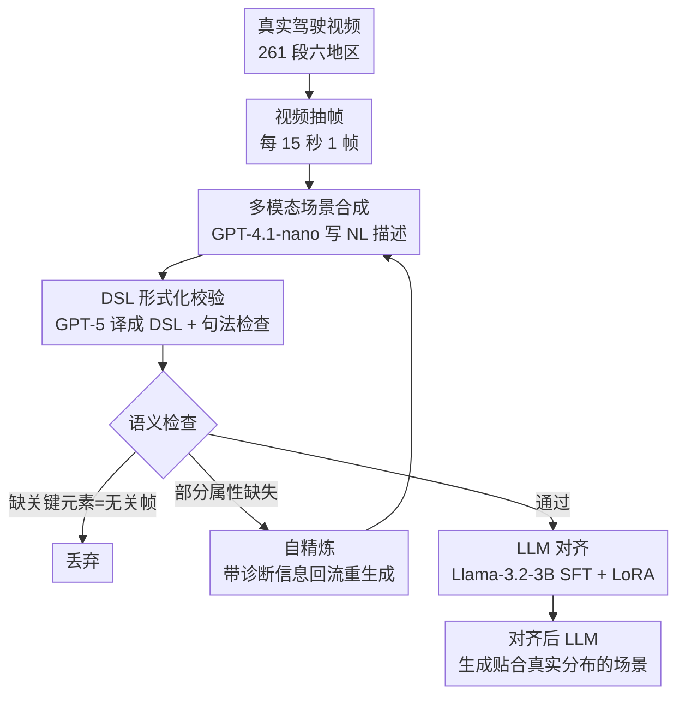

# TrafficAlign: Aligning Large Language Models for Traffic Scenario Generation

**会议**: CVPR 2026  
**论文**: [CVF Open Access](https://openaccess.thecvf.com/content/CVPR2026/html/Tu_TrafficAlign_Aligning_Large_Language_Models_for_Traffic_Scenario_Generation_CVPR_2026_paper.html)  
**代码**: https://github.com/TrafficComposer/TrafficAlign  
**领域**: 自动驾驶 / LLM 对齐  
**关键词**: 交通场景生成, LLM 对齐, 自动驾驶测试, 领域特定语言, 数据合成

## 一句话总结
TrafficAlign 从真实驾驶视频里自动合成交通场景描述、用领域特定语言（DSL）做语义校验并自精炼，再用这批数据微调（对齐）LLM，让 LLM 生成贴合特定地区真实交通分布的场景，在三种自动驾驶模型上比 SOTA 多诱发 10.8% 的碰撞，用这些场景反过来微调驾驶模型又能把碰撞率降低 36.1%。

## 研究背景与动机
**领域现状**：仿真测试是检验自动驾驶模型安全性的主流手段，而仿真的关键瓶颈是「能不能生成真实、有挑战性的交通场景」。近两年出现一批用 LLM 自动生成交通场景的工作，因为 LLM 既懂自然语言又能写出仿真脚本，省去了人工逐条编规则的成本。

**现有痛点**：现有 LLM 方法大多仍需要人类先写一段自然语言场景描述（如 TARGET、ScenicNL 依赖人工编写的交规手册或车祸报告），在大规模测试里非常费人力。唯一摆脱人工描述的是 ChatScene——它直接 prompt LLM 凭内部知识生成场景描述。但 LLM 的通用知识缺乏细粒度、地点特定的交通理解，生成的场景同质化严重，难以贴合真实世界、尤其是特定地理区域（大城市、小镇、山区）的交通特征与分布。

**核心矛盾**：LLM 有强大的语言生成与脚本编写能力，却**没有目标地区真实交通分布的先验**；纯靠 prompt 拿不到这种分布，纯靠采集真实数据又有数据稀缺、采集昂贵的问题。问题本质是「LLM 的通用知识」与「真实世界局部观测」之间存在分布鸿沟。

**本文目标**：(1) 不依赖人工描述，自动从大规模、易获取的素材里捕获目标地区真实交通分布；(2) 保证自动合成数据的语义质量；(3) 把这份分布「灌进」LLM，让它生成贴合真实分布的场景。

**切入角度**：作者注意到 YouTube 上有海量第一视角行车视频，覆盖各种地理区域、几乎零成本，正好可以当作真实交通分布的代理。再借鉴 LLM 对齐里「合成数据 + 校验过滤」的范式（Self-Instruct、Evol-Instruct 等），把视频转成场景描述、严格校验后用来微调 LLM。

**核心 idea**：用「真实驾驶视频→多模态 LLM 合成场景描述→DSL 形式化校验+自精炼→SFT 对齐 LLM」这条全自动管线，把目标地区的真实交通分布对齐进 LLM，替代靠人工描述或纯靠 LLM 内部知识的旧做法。

## 方法详解

### 整体框架
TrafficAlign 是一条全自动管线，输入是某目标地区的一批真实行车视频，输出是一个「被对齐过、能生成贴合该地区真实交通分布的场景描述」的 LLM。它分三步串行：**数据合成**（视频抽帧 → 多模态 LLM 写自然语言场景描述）、**数据校验**（把 NL 描述翻译成 DSL → 句法检查 + 语义检查 → 不完整的回流自精炼、无关的丢弃）、**LLM 对齐**（用通过校验的描述做监督微调）。校验阶段和合成阶段之间存在一个回环：语义不完整但可救的场景会带着诊断信息回到合成器重新生成，无关帧（标题画面、片头等）则被直接剔除。

### 关键设计

**1. 多模态 LLM 从视频抽帧合成场景描述：把零成本视频变成分布代理**

旧方法要么靠人写场景描述（费人力），要么靠 LLM 凭空想（脱离真实分布）。TrafficAlign 改用真实行车视频作素材，因为它在网上海量可得、采集便宜，又天然携带目标地区的真实交通分布。具体做法是对每段视频按 $\text{fps}=1/15$（每 15 秒抽一帧）均匀采样，既覆盖多样场景又避免近似重复帧；作者共收集了 261 段第一视角风光行车视频，覆盖洛杉矶、纽约、约塞米蒂、黄石、宾州小镇、瑞士全国六个地理多样区域。对每一帧，用多模态 LLM（默认 GPT-4.1-nano）写一段结构化的自然语言场景描述。

为了让描述质量稳定，作者精心设计了一个组合式 prompt，把角色扮演、分步指令、思维链、上下文少样本几种策略揉在一起，并明确要求 LLM 从三个层面刻画场景：**路网与环境**（区域类型城/乡、路型如路口/环岛、单双向、车道数、天气、时间）、**上下文细节**（交通密度、路侧环境、是否有应急车辆或道路施工）、**参与者**（自车与周围 NPC 车辆/行人的位置和行为）。这样合成出的描述既贴合视频里真实出现的交通态势，又有统一可校验的结构。

**2. DSL 形式化代理 + 双层检查：直接校验自然语言不可靠，就翻成符号语言再查**

自动合成不可避免会有两类脏数据：LLM 幻觉导致语义不完整的描述，以及片头/标题画面这类无关帧产出的无效描述。直接在自然语言层面判断「这段描述合不合格」既困难又不可靠，因为 NL 是非结构化、有歧义的。作者的关键一招是把每段 NL 描述**翻译成一个领域特定语言（DSL）的形式化表示**（用 GPT-5 翻译，复用了已有的 DSL 设计），DSL 用 road network / environment / actors 等字段把场景拆成精确的符号槽位，从而支持系统化分析与严格检查。

校验分两层。**句法检查**：DSL 是上下文无关文法，要求符号严格合规；若检测到词表外符号（out-of-vocabulary），就把语法错误信息回传给 LLM、让它按文法修正，确保 DSL 表示良构。**语义检查**：在合法 DSL 上逐字段核对必要属性是否齐全——若**多个**关键元素同时缺失（如时间和天气都没有），说明源帧几乎不含交通信息，判为非场景帧直接丢弃；若只是**部分**属性缺失（如某个 actor 没写清位置或行为），则判为「可救的不完整场景」，触发下一步自精炼。这套「先翻成符号语言、再分句法/语义两层查」的设计，把模糊的 NL 质量判断变成了可执行的确定性检查，是数据质量的核心保障。

**3. 轻量自精炼回环：可救的场景别浪费，带着诊断回去重生成**

如果对所有不完整场景一律丢弃，会损失大量本可用的数据、还可能扭曲目标地区的真实分布（比如系统性丢掉某类场景）。TrafficAlign 用一个轻量自精炼步骤闭合「合成↔校验」回路：当语义检查判定某场景合法但不完整时，把诊断信息（缺了哪些属性）**追加到原始 prompt 后面**，让场景抽取器重新生成这段描述。这样系统**选择性地修复可恢复场景、只丢弃语义无关的**，最大程度保留了目标地区的原始交通分布，避免因过度过滤造成分布偏移。

**4. SFT + LoRA 对齐：把校验后的真实分布灌进生成器 LLM**

拿到通过校验的场景描述后，最后一步是把这份真实分布对齐进生成器 LLM（默认 Llama-3.2-3B-Instruct）。做法是标准的监督微调（SFT），用下一 token 交叉熵目标，并且**只在 assistant 回复上计算损失、mask 掉 user 和 system token**——这样模型只学「如何产出场景描述」，不去拟合输入提示本身。为降低成本，采用 LoRA 这种参数高效微调，只在注意力层和 MLP 投影层加低秩适配；训练仅跑 60 步、学习率 2e−4。微调后的 LLM 就能被 prompt 去生成与目标地区真实交通分布一致的场景描述，这正是「对齐」二字的落点：不是把场景写得更花哨，而是把生成分布往真实分布上拉。

### 一个完整示例
以洛杉矶为例走一遍：从某段 LA 行车视频里抽出一帧城市干道画面 → GPT-4.1-nano 写出「三车道城市干道、自车方向两车道对向一车道、白天晴朗、住宅区、车流中等、自车在右起第二车道前进、正前方一辆公交直行、右邻车道有 4 辆轿车」这样的 NL 描述 → GPT-5 把它翻成 DSL：environment{time: daytime, weather: clear, lane_number: 3, directionality: two_way, road_context: urban}、actors{ego: go_forward/lane_index 1；actor group 1: bus×1, ahead；actor group 2: sedan×4, right}。句法检查确认所有符号合规；语义检查发现各 actor 的位置/行为都齐全、判为通过。若此处某辆车漏了 behavior 字段，则会带着「actor group 1 缺 behavior」的诊断回流让 GPT-4.1-nano 补写。最终这条通过校验的 LA 场景进入对齐数据集，用来 SFT Llama-3.2-3B，让它学会「LA 式」的真实场景分布。评测时再把生成的 NL 描述用 TrafficComposer 的规则算法转成 Scenic 脚本、在 CARLA/SafeBench 里跑仿真。

## 实验关键数据

### 主实验
作者在 SafeBench 平台上、用 PPO/SAC/TD3 三种 RL 驾驶模型评测「生成场景诱发驾驶模型出问题的能力」，对比 ChatScene（SOTA）、两个对抗式基线、两个规则式基线。核心指标是碰撞率 CR（越高越能测出模型缺陷）和总分 OS（越低越说明场景越有挑战）。下表取三模型平均值。

| 方法 | CR ↑ | OS ↓ | 说明 |
|------|------|------|------|
| Learning-to-collide（对抗式） | 0.584 | 0.619 | 扰动周围车辆轨迹 |
| AdvSim（对抗式） | 0.586 | 0.620 | 扰动初始配置 |
| Carla Scenario Gen.（规则式） | 0.676 | 0.573 | 按预定义交规构造 |
| Adv. Trajectory Optim.（规则式） | 0.627 | 0.596 | 物理规则约束 |
| ChatScene（SOTA） | 0.825 | 0.481 | LLM 内部知识生成 |
| **TrafficAlign（纽约）** | **0.923** | **0.319** | 本文，按地区对齐 |
| **TrafficAlign（黄石）** | 0.909 | 0.310 | 本文 |
| **TrafficAlign（洛杉矶）** | 0.933 | 0.405 | 本文 |

六个地区的 TrafficAlign 实例在几乎所有指标上一致超过基线：碰撞率比最强基线高 2.7%–10.8%，总分相对下降 5.0%–35.6%，说明生成的场景更易诱发碰撞、更有挑战性。

### 消融实验
为验证「对齐真实分布」这一步是否真有用，作者构造了「不做对齐、只 prompt LLM 生成场景」的变体（用 5 个 SOTA LLM），只报洛杉矶结果。

| 配置 | CR ↑ | OS ↓ | 说明 |
|------|------|------|------|
| GPT-5（不对齐） | 0.889 | 0.435 | 最强 LLM 基线 |
| GPT-4o（不对齐） | 0.874 | 0.441 | |
| Claude Sonnet 4（不对齐） | 0.894 | 0.438 | |
| DeepSeek-V3（不对齐） | 0.814 | 0.447 | |
| Qwen3（不对齐） | 0.804 | 0.450 | |
| **TrafficAlign（对齐）** | **0.933** | **0.405** | 完整模型 |

即便对手是 GPT-5/Claude 这种强得多的模型，对齐过的小模型（Llama-3.2-3B）在全部 11 个指标上仍胜出：碰撞率高 3.9%–12.9%，总分低 6.9%–10.0%。这直接说明「把真实分布对齐进 LLM」比「换更大的 LLM 凭空生成」更关键。

### 改进驾驶模型实验
反过来，用生成场景去微调驾驶模型（48 场景微调、32 场景留出测试），看安全性能提升：

| 地区 | 方法 | CR ↓ | OS ↑ |
|------|------|------|------|
| 洛杉矶 | 未微调 | 0.968 | 0.296 |
| 洛杉矶 | ChatScene | 0.733 | 0.301 |
| 洛杉矶 | **TrafficAlign** | **0.701** | **0.385** |
| 纽约 | 未微调 | 0.973 | 0.299 |
| 纽约 | **TrafficAlign** | **0.710** | **0.366** |

用 TrafficAlign 场景微调后，碰撞率相对原始模型下降 21.0%–36.1%、总分提升 22.4%–49.7%；相比 ChatScene 还能再降 2.0%–3.7% 碰撞率、再升 5.1%–27.9% 总分。

### 关键发现
- **对齐这一步是胜负手**：消融里对齐后的 3B 小模型全面压过未对齐的 GPT-5，说明本文增益主要来自「把真实分布灌进去」，而非模型规模或 prompt 技巧。
- **碰撞率「双向有效」**：同一批场景既能在测试阶段多诱发 10.8% 碰撞（暴露缺陷），又能在微调阶段把驾驶模型碰撞率降 36.1%（修复缺陷），证明生成的是「真实且安全攸关」的场景而非无意义噪声。
- **分布对齐可视化佐证**：UMAP 可视化显示 TrafficAlign 生成场景与真实世界簇高度重叠，而 GPT-4o/Claude/DeepSeek/Qwen3 各自形成偏离真实区域的簇、GPT-5 甚至孤立在远处，定性地说明对齐确实缩小了分布偏移。
- **地区差异**：山区/小镇（黄石、宾州小镇）和大城市（LA、纽约）的场景分布明显不同，单一通用 LLM 难以同时覆盖，这正是「按地区分别对齐」的价值所在。

## 亮点与洞察
- **用 DSL 当「质量校验代理」很巧**：直接判 NL 描述合不合格不可靠，先翻成上下文无关文法的 DSL，再用句法检查抓非法符号、语义检查抓缺失字段，把模糊的质量判断变成确定性、可自动化的规则检查——这个「自然语言→符号中间表示→校验」的思路可迁移到任何「LLM 合成数据需要质量过滤」的任务。
- **自精炼回环防分布偏移**：不是简单粗暴丢弃所有脏数据，而是区分「无关帧丢弃」vs「不完整可救回流」，避免过滤本身扭曲目标分布，这个 caveat 体现了对「合成数据用于对齐」这件事的深刻理解。
- **小模型 + 对齐打败大模型 + prompt**：3B 的 Llama 对齐后全面胜过 GPT-5，强有力地说明在「需要局部分布知识」的任务上，对齐数据比模型规模更重要——这对「该花钱买大模型还是花精力造对齐数据」是很有说服力的实证。
- **零成本素材闭环**：把 YouTube 行车视频当真实交通分布代理，全程无需人工标注或人工写场景，整条管线可规模化复制到任意新地区。

## 局限与展望
- **均匀抽帧会漏长尾事件**（作者承认）：每 15 秒抽一帧虽保持了对目标地区的代表性，但可能错过罕见交通事件；未来可用分布感知或事件触发式采样更好覆盖长尾。
- **单帧丢失时序信息**（作者承认）：场景抽取器只看单帧、靠多模态 LLM 推断动态，丢失了理解 actor 行为所需的时序线索；未来可用视频片段 + 专门 CV 模型抽视觉信息、LLM 做高层推理。
- **评测耦合 ChatScene 设置**：实验沿用 ChatScene 的 40 初始场景、50 轮变异等流程，碰撞率等绝对值与该评测协议强绑定；换平台/换协议时的可比性需谨慎。
- **依赖一串商业大模型**：合成用 GPT-4.1-nano、DSL 翻译用 GPT-5，管线对外部闭源 API 有较强依赖，复现成本和稳定性受 API 影响；且这些模型本身的偏置可能渗入合成数据。
- **DSL 覆盖度上限**：质量校验完全建立在所采用 DSL 的字段覆盖之上，DSL 表达不了的场景元素（如复杂交互、特殊路况）无法被校验或对齐。

## 相关工作与启发
- **vs ChatScene（最强基线）**：ChatScene 直接 prompt LLM 凭内部知识生成场景，省了人工描述但脱离真实分布、场景同质化；TrafficAlign 多了「从真实视频合成 + DSL 校验 + SFT 对齐」三步，把真实分布灌进 LLM，碰撞率高 2.7%–10.8%。本质区别是 ChatScene 用 LLM 的先验，TrafficAlign 用真实观测重塑这个先验。
- **vs TARGET / ScenicNL**：它们也用 LLM 生成场景，但分别依赖人工编写的交规手册、车祸报告作输入，难以大规模扩展；TrafficAlign 全自动从视频抽取，无需人工描述。
- **vs 场景重建类方法（STRIVE、SLEDGE、Scenario Diffusion 等）**：这些在 BEV/轨迹层面用生成模型建模场景（车道图、box、轨迹）；TrafficAlign 在自然语言/DSL 层面工作、最终在 CARLA 里跑 3D 仿真，因层级不同未将它们列为基线。
- **vs LLM 对齐的合成数据方法（Self-Instruct、Evol-Instruct、FLAME）**：它们造通用指令数据并做启发式/事实性过滤；TrafficAlign 把同样「合成 + 校验」的范式落到交通场景领域，且引入 DSL 语义校验这一更严格的质量保障手段。

## 评分
- 新颖性: ⭐⭐⭐⭐ 「真实视频→DSL 校验→对齐 LLM」这条全自动管线在交通场景生成里是新颖且自洽的组合，DSL 当校验代理尤其巧妙。
- 实验充分度: ⭐⭐⭐⭐⭐ 三类实验（测试效果/改进效果/分布可视化）× 六地区 × 三驾驶模型 × 多基线，消融直接验证对齐这一步的价值，论证扎实。
- 写作质量: ⭐⭐⭐⭐ 动机清晰、管线讲得明白、图表自洽；少量细节（DSL 文法、prompt）放在补充材料略影响自包含性。
- 价值: ⭐⭐⭐⭐ 场景既能测出缺陷又能微调修复缺陷，且小模型+对齐胜过大模型+prompt，对自动驾驶安全测试和「对齐数据 vs 模型规模」的实践都有参考价值。

<!-- RELATED:START -->

## 相关论文

- [\[ACL 2025\] Embracing Large Language Models in Traffic Flow Forecasting](../../ACL2025/autonomous_driving/embracing_large_language_models_in_traffic_flow_forecasting.md)
- [\[ECCV 2024\] Navigation Instruction Generation with BEV Perception and Large Language Models](../../ECCV2024/autonomous_driving/navigation_instruction_generation_with_bev_perception_and_large_language_models.md)
- [\[CVPR 2026\] Unifying Language-Action Understanding and Generation for Autonomous Driving](unifying_language-action_understanding_and_generation_for_autonomous_driving.md)
- [\[CVPR 2026\] Learning Vision-Language-Action World Models for Autonomous Driving](vla_world_learning_vision_language_action_world_models_for_autonomous_driving.md)
- [\[AAAI 2026\] TimeBill: Time-Budgeted Inference for Large Language Models](../../AAAI2026/autonomous_driving/timebill_time-budgeted_inference_for_large_language_models.md)

<!-- RELATED:END -->
