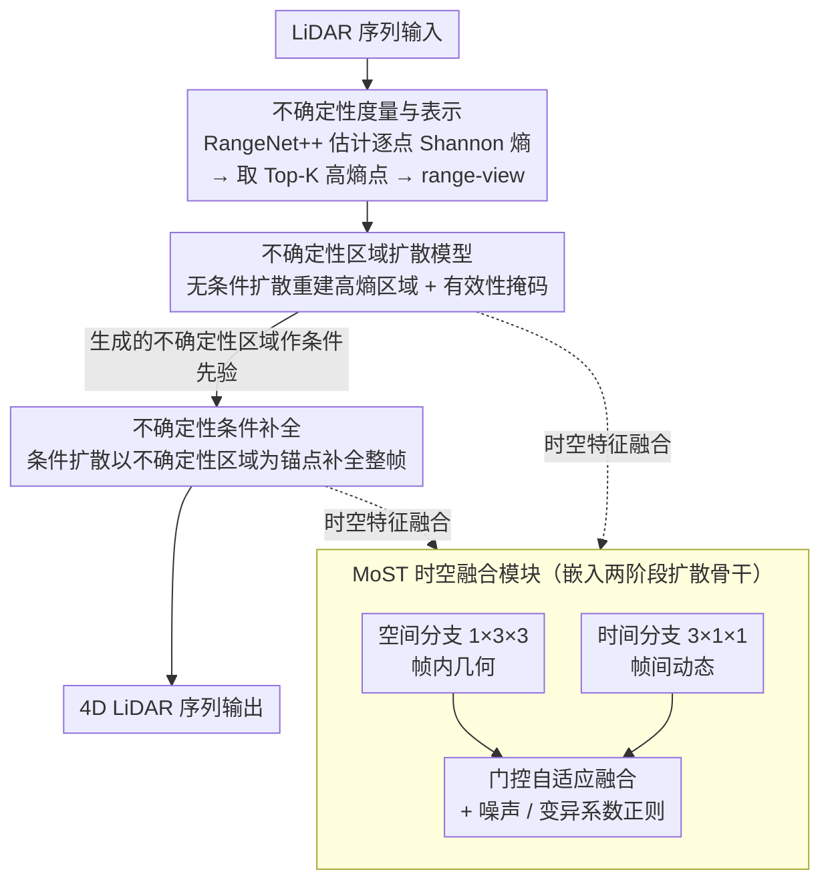

# U4D: Uncertainty-Aware 4D World Modeling from LiDAR Sequences

**会议**: CVPR 2026  
**arXiv**: [2512.02982](https://arxiv.org/abs/2512.02982)  
**代码**: 无  
**领域**: 自动驾驶  
**关键词**: LiDAR生成, 不确定性建模, 扩散模型, 4D世界模型, 时空一致性

## 一句话总结

提出 U4D，首个不确定性感知的 4D LiDAR 世界建模框架，通过"先难后易"的两阶段扩散生成策略，先重建高不确定性区域再条件补全整个场景，并设计 MoST 模块自适应融合时空特征以保证时序一致性。

## 研究背景与动机

**LiDAR 数据采集瓶颈**：大规模、多样化、带标注的 LiDAR 数据采集成本极高且劳动密集，生成式 LiDAR 建模成为数据增强和预训练的重要途径。

**现有方法的均匀假设**：LiDARGen、LiDM、R2DM 等方法在生成时对所有空间区域一视同仁，忽略了真实场景中语义难度的非均匀分布。

**不确定性区域的存在**：远距离稀疏区域、遮挡物体边界、小尺度结构、语义模糊区域在 LiDAR 观测中天然表现出高不确定性，均匀生成会导致这些区域出现几何伪影和时序不稳定。

**类人认知启发**：人类在感知场景时先解析模糊区域再理解全局上下文，U4D 借鉴这一思路，先生成不确定性区域作为结构锚点，再补全其余区域。

**时序一致性不足**：已有方法主要关注空间重建，对帧间动态的时序连贯性建模不够，导致生成序列中物体运动不自然。

**下游任务驱动需求**：自动驾驶等安全关键应用需要生成数据能真正提升感知模型的鲁棒性和标定可靠性，而非仅追求视觉保真度。

## 方法详解

### 整体框架

U4D 采用两阶段"先难后易"的生成范式：

- **第一阶段：不确定性区域建模**——利用预训练的 LiDAR 分割模型（RangeNet++）估计逐点不确定性图（Shannon 熵），选取 Top-K 高熵点形成稀疏不确定性点云，转换为 range-view 表示后，用无条件扩散模型重建高保真的不确定性区域。
- **第二阶段：不确定性条件补全**——以第一阶段生成的不确定性区域作为条件输入，通过条件扩散模型补全完整的 LiDAR 帧，确保全局结构一致性。
- 两阶段共享统一的潜在场景表示，全局上下文信息可反向精炼局部不确定性。
- 两阶段的扩散骨干网络内部都嵌入 **MoST 时空融合模块**，把空间分支（帧内几何）与时间分支（帧间动态）的特征自适应门控融合，让生成序列在保证单帧保真度的同时维持帧间时序连贯。

### 关键设计

**1. 不确定性度量与表示**

- 对每个点计算 Shannon 熵：$H(\mathbf{p}) = -\sum_{c=1}^{C} D_c(\mathbf{p}) \log D_c(\mathbf{p})$
- nuScenes 保留 Top-20% 高熵点，SemanticKITTI 保留 Top-5%
- 稀疏不确定性点云投影为 range image $\mathbf{x}_0^u \in \mathbb{R}^{H \times W \times 2}$（深度+反射率），附带二值掩码 $\mathbf{m}^u$

**2. 不确定性区域扩散模型**

- 无条件扩散模型 $\epsilon_\theta^u$ 在 range-view 上学习不确定性区域的生成分布
- 采用标准 DDPM 前向过程，反向去噪同时重建空间有效性掩码

**3. 不确定性条件补全**

- 条件扩散模型 $\epsilon_\theta^c$ 学习 $p(\mathbf{x}_0 | \mathbf{x}_0^u)$
- 将噪声输入 $\mathbf{x}_t$ 和不确定性先验 $\mathbf{x}_0^u$ 在特征维度上拼接，让网络利用全局与局部线索进行去噪

**4. MoST（Mixture of Spatio-Temporal）模块**

- 将中间特征 $\mathbf{F}_i \in \mathbb{R}^{C_i \times L \times H_i \times W_i}$ 分解为空间分支（$1 \times 3 \times 3$ 卷积，帧内几何）和时间分支（$3 \times 1 \times 1$ 卷积，帧间动态）
- 两分支输出拼接后经 MLP 共享嵌入，再通过混合专家风格的门控机制自适应融合：$(α_i^s, α_i^t) = \text{Softmax}(\mathbf{F}_i^{\text{share}} \cdot \mathbf{W}_i^g + \mathbb{I}(\chi \cdot \sigma(\mathbf{F}_i^{\text{share}} \cdot \mathbf{W}_i^z)))$
- 训练时加入高斯噪声扰动门控，避免确定性过拟合
- 网络输入/输出层空间分支主导（几何细节），中间层时间分支主导（运动动态）

### 损失函数/训练策略

- **不确定性阶段损失**：$\mathcal{L}_u = \mathbb{E}[\|\epsilon^u - \epsilon_\theta^u(\mathbf{x}_t^u, t)\|_2^2] + \lambda \mathcal{L}_{\text{mask}}(\mathbf{m}^u, \mathbf{m}^p)$，其中 $\mathcal{L}_{\text{mask}}$ 为二值交叉熵
- **条件补全损失**：$\mathcal{L}_c = \mathbb{E}[\|\epsilon^c - \epsilon_\theta^c(\mathbf{x}_t, t, \mathbf{x}_0^u)\|_2^2]$
- **门控正则化**：$\mathcal{L}_{\text{reg},i} = \frac{\text{Var}(\alpha_i^s)}{(\mathbb{E}[\alpha_i^s])^2} + \frac{\text{Var}(\alpha_i^t)}{(\mathbb{E}[\alpha_i^t])^2}$，防止门控过度偏向单一模态
- 两阶段分别训练：第一阶段 100 万步，第二阶段 50 万步；批次大小 8，序列长度 6
- AdamW 优化器，学习率 $1 \times 10^{-4}$，余弦退火 + 10K 步 warmup；EMA 衰减率 0.995
- 4 × NVIDIA RTX 4090，FP16 混合精度训练

## 实验关键数据

### 主实验

**表1：nuScenes 场景级生成保真度**

| 方法 | FRD ↓ | FPD ↓ | JSD ↓ | MMD(×10⁻⁴) ↓ |
|------|-------|-------|-------|---------------|
| LiDARGen (ECCV'22) | 549.18 | 22.80 | 0.04 | 0.76 |
| R2DM (ICRA'24) | 253.80 | 14.35 | **0.03** | **0.48** |
| UniScene (CVPR'25) | - | 976.47 | 0.32 | 13.61 |
| **U4D** | **223.96** | **12.90** | **0.03** | 0.53 |

**表3：nuScenes 时序一致性（TTCE/CTC）**

| 方法 | TTCE-3 ↓ | TTCE-4 ↓ | CTC-1 ↓ | CTC-3 ↓ |
|------|----------|----------|---------|---------|
| UniScene (CVPR'25) | 2.74 | 3.69 | **0.90** | 3.64 |
| LiDARCrafter (AAAI'26) | 2.65 | 3.56 | 1.12 | 3.02 |
| **U4D** | **2.63** | **3.51** | 0.97 | **2.98** |

**表4：下游语义分割 mIoU(%)**

| 方法 | 1% 标注 | 10% 标注 | 50% 标注 |
|------|---------|----------|----------|
| Sup.-only | 58.3 | 71.0 | 75.1 |
| R2DM | 64.1 | 73.0 | 75.9 |
| **U4D** | **65.3** | **73.7** | **76.4** |

### 消融实验

**不确定性区域选择策略（表6）**

| 策略 | FRD ↓ | FPD ↓ | ECE(%) ↓ |
|------|-------|-------|----------|
| 无不确定性 | 235.91 | 14.03 | 3.98 |
| 随机采样 | 235.23 | 13.21 | 4.35 |
| 置信度采样 | 228.24 | 13.04 | 3.02 |
| **熵值采样** | **223.96** | **12.90** | **2.72** |

**MoST 融合策略（表7）**

| 融合方式 | FRD ↓ | FPD ↓ | JSD ↓ |
|----------|-------|-------|-------|
| 级联（无并行） | 536.23 | 23.34 | 0.63 |
| 加法融合 | 242.81 | 13.42 | 0.28 |
| 拼接融合 | 242.43 | **12.51** | **0.03** |
| **自适应融合** | **223.96** | 12.90 | **0.03** |

### 关键发现

- 基于熵的不确定性选择远优于随机选择和无条件生成，ECE 从 3.98% 降至 2.72%
- 自适应融合比简单加法/拼接带来显著的 FRD 提升（~20 点），验证了动态门控的有效性
- U4D 生成数据在低标注比例（1%）下对下游分割的增益最大（+7.0 mIoU），说明不确定性感知生成数据对数据稀缺场景价值更高
- MoST 在不同网络深度展现不同的时空激活模式：浅层/深层偏空间，中间层偏时间

## 亮点与洞察

- **首创不确定性驱动的 LiDAR 生成**：将感知模型的不确定性输出反馈到生成过程中，形成"感知→不确定性→生成→感知增强"的闭环
- **"先难后易"生成哲学**：先攻克语义模糊的困难区域，再以此为锚点补全简单区域——这种策略具有普遍适用性
- **MoST 模块设计精巧**：门控机制 + 噪声正则化 + 变异系数正则化，三重保证时空特征的平衡融合
- 下游标定实验（ECE 指标）证明生成数据不仅能提升精度，还能改善模型置信度校准

## 局限性

- 推理速度（8.9s/帧）高于单帧方法（R2DM 3.5s），效率仍需提升
- 不确定性估计依赖预训练分割模型的质量，分割模型本身的偏差会传播到生成过程
- 仅在 nuScenes 和 SemanticKITTI 上验证，未测试更多传感器配置和室内场景
- 两阶段训练管线（共 150 万步）训练成本较高，端到端方案可能更高效
- Range-view 表示在自遮挡和远距离区域的信息丢失未充分讨论

## 相关工作

- **LiDAR 生成**：LiDARGen（ECCV'22 评分建模）→ R2DM（ICRA'24 扩散模型）→ LiDARCrafter（AAAI'26 自回归时序）→ U4D（不确定性感知）
- **不确定性建模**：SalsaNext（贝叶斯推理）、Calib3D（深度感知标定）——U4D 首次将不确定性引入生成框架
- **时空建模**：ViDAR（图像预测 LiDAR）、视频扩散中的级联时空——MoST 提出并行分解+自适应门控替代级联

## 评分

- 新颖性: ⭐⭐⭐⭐ （不确定性驱动的"先难后易"生成是全新视角）
- 实验充分度: ⭐⭐⭐⭐ （双数据集、多指标、完整消融、下游任务验证）
- 写作质量: ⭐⭐⭐⭐ （结构清晰，图表精美，动机阐述充分）
- 价值: ⭐⭐⭐⭐ （不确定性+生成的范式对自动驾驶仿真数据增强有实际意义）

<!-- RELATED:START -->

## 相关论文

- [\[AAAI 2026\] LiDARCrafter: Dynamic 4D World Modeling from LiDAR Sequences](../../AAAI2026/autonomous_driving/lidarcrafter_dynamic_4d_world_modeling_from_lidar_sequences.md)
- [\[CVPR 2026\] FoSS: Modeling Long-Range Dependencies and Multimodal Uncertainty in Trajectory Prediction via Fourier–State Space Integration](foss_modeling_long_range_dependencies_and_multimodal_uncertainty_in_trajectory_p.md)
- [\[CVPR 2026\] Points-to-3D: Structure-Aware 3D Generation with Point Cloud Priors](points-to-3d_structure-aware_3d_generation_with_point_cloud_priors.md)
- [\[CVPR 2026\] F3DGS: Federated 3D Gaussian Splatting for Decentralized Multi-Agent World Modeling](f3dgs_federated_3d_gaussian_splatting_for_decentralized_multi-agent_world_modeli.md)
- [\[CVPR 2026\] Efficient Equivariant Transformer for Self-Driving Agent Modeling](efficient_equivariant_transformer_for_self-driving_agent_modeling.md)

<!-- RELATED:END -->
