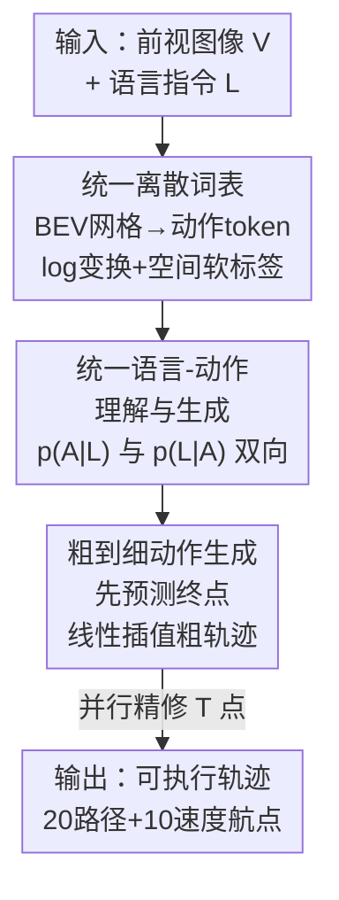

# Unifying Language-Action Understanding and Generation for Autonomous Driving

**会议**: CVPR 2026  
**论文**: [CVF Open Access](https://openaccess.thecvf.com/content/CVPR2026/html/Wang_Unifying_Language-Action_Understanding_and_Generation_for_Autonomous_Driving_CVPR_2026_paper.html)  
**代码**: https://github.com/x1nyangwang/Link-VLA （有）  
**领域**: 自动驾驶 / 多模态VLM  
**关键词**: VLA、语言-动作对齐、统一离散词表、粗到细生成、闭环驾驶

## 一句话总结
LinkVLA 把语言指令和驾驶轨迹塞进同一个离散词表、再加一个"看着轨迹反推指令"的理解任务来强行对齐语言与动作，并用两步粗到细解码替代逐点自回归，在 CARLA 闭环上把驾驶得分推到 91.01 的同时把推理延迟从 361ms 砍到 48ms（省 86%）。

## 研究背景与动机

**领域现状**：端到端自动驾驶近两年的热点是把视觉-语言模型（VLM）扩成视觉-语言-动作模型（VLA），让车不再只是"反应式"地从传感器映射到控制量，而是能借助 VLM 的世界知识做显式推理、跟随自然语言指令（"在施工区绕行，等车流出现空隙再并入"）。指令跟随是 VLA 走向真实部署的核心能力——它支持动态重派任务、也让人能透明地监督车辆行为。

**现有痛点**：当前 VLA 有两个顽疾。第一是**语言理解和物理动作之间的持续错位**：模型可能在文本侧正确输出"向左变道"的决策，动作侧却给出"保持车道"的轨迹，指令跟随名存实亡，直接威胁安全可靠性。第二是**自回归动作生成太慢**：一条 $T$ 个航点的轨迹要 $T$ 次串行前向，像 ORION 的某些变体延迟高达 361ms，没法实车部署。

**核心矛盾**：以往修对齐的路子都没碰到根上——靠改数据采集（反事实标注）绕过了建模问题；靠 RL 事后微调把对齐当成补丁；靠隐式分布匹配在隐空间对齐又缺乏直接、可验证的监督。本文认为：语言和动作的语义鸿沟，**根源是架构层面两个模态被割裂**（连续轨迹回归 vs 离散文本生成），必须在主监督学习阶段就织入一条"显式、双向、可验证"的连接，而不是事后修补。

**本文目标**：分两块——(1) 从架构上消灭模态鸿沟，让语言和动作落在同一表征空间；(2) 在不牺牲对齐的前提下解决自回归的延迟瓶颈。

**核心 idea**：用"统一离散词表 + 动作理解反向目标 + 粗到细解码"三件套，把对齐从"事后补丁"变成"建模内生属性"，同时把串行解码压成两步并行。

## 方法详解

### 整体框架
LinkVLA 是一个 VLA 模型，输入是前视图像 $V$、语言指令 $L$ 和（训练时的）轨迹 $A$，输出是一条可执行轨迹。它的骨干是 InternVL2-1B（InternViT-300M 视觉编码器 + Qwen2-0.5B 语言模型）。整套方法围绕"让语言和动作真正长在一起"展开，分三层递进：先把动作离散成 token 并和文本词表合并成**统一离散空间**（消除架构裂痕）；再加一个**动作理解目标**，逼模型从轨迹反推出指令，形成双向一致性（强化语义绑定）；最后用**粗到细两步解码**替换逐点自回归（解决延迟）。前两者管"对齐"，后者管"效率"，三者在同一个 transformer 解码器里通过切换预测目标共享参数。

### 关键设计

**1. 统一离散词表：把连续轨迹量化成 token，和文本词表合并成同一个空间**

错位的根在于架构把两个模态分开处理，所以 LinkVLA 干脆不让它们分开。做法是把局部 BEV 空间（$x \in [0,50]\text{m}$、$y \in [-30,30]\text{m}$）划成网格、每个格子是一个唯一的"动作 token"，一条轨迹 $T=\{w_1,\dots,w_T\}$ 就被映射成动作 token 序列 $A=\{a_1,\dots,a_T\}$。这个动作词表 $C_{action}$ 直接和文本词表（大小 $K_{text}$）拼成统一词表 $C$，大小 $K=K_{text}+K_{action}$，由同一个 VLM 端到端学习 embedding——语言概念和空间概念被强行压进共享表征，单个模型就能同时处理两者，从设计层面消灭了模态鸿沟。

但朴素的"均匀网格 + one-hot"有两个毛病：均匀分辨率浪费在远处、近场精度不够；one-hot 硬分配又丢掉了网格本身的空间拓扑。为此作者加了两个细化。**Log 坐标变换**让近车端精度更高：每个坐标 $z\in\{x,y\}$ 先过有符号对数 $z' = \text{sign}(z)\cdot\log(1+k\cdot|z|)$（$k=5$），原点附近被拉成近似线性的密集区，远处则被压缩，再均匀量化（步长 0.1，得到 $56\times101$ 网格、$K_{action}=5656$ 个动作 token）。**空间软标签**把动作空间的连续性先验写进监督信号：不再用 one-hot，而是对真值 token $a_{gt}$ 构造一个以其坐标为中心、半径 $R$ 的归一化 2D 高斯分布

$$q(a) = \frac{1}{Z}\exp\left(-\frac{\|\text{pos}(a)-\text{pos}(a_{gt})\|_2^2}{2\sigma^2}\right),$$

生成损失用它做交叉熵 $L_{generation} = -\sum_{a\in C_{action}} q(a)\log p(a)$（$R=10$ 格、$\sigma=1.2$）。这让模型不仅给正确 token、也给它的空间邻居分配概率质量，学出一个局部光滑的动作流形，对真值的微小误差更鲁棒。

**2. 统一语言-动作理解与生成：加一个"看轨迹反推指令"的反向任务，逼出双向一致性**

光把两个模态放进同一空间还不够"绑得紧"——模型可能各管各的。作者借鉴了多模态里"图像描述（看图说话 $p(L|V)$）"和"文生图 $p(V|L)$"互为对偶、联合训练能得到更对齐表征的发现，把同样的对偶性搬到语言-动作上。常规的动作生成任务是 $p(A|L)$（指令→轨迹），类比文生图；作者补上它的**逆任务——动作理解** $p(L|A)$：给定一段执行过的轨迹去反推它对应的原始语言指令，类比看图说话。两个映射都建立在共享的视觉上下文 $V$ 之上。形式上在 $L_{generation}$ 之外引入

$$L_{understanding} = -\sum_j \log p(l_j \mid V, A, l_{<j}),$$

总损失 $L_{total} = L_{generation} + \lambda L_{understanding}$。

为什么有效：逼模型解这个"反问题"，等于强制共享 embedding 空间里语言与动作双向自洽——动作 token 不能只是空间坐标的代号，必须能被反向翻译成描述性语言，语义接地因此被显著加固，指令跟随随之变好。实现上很省：同一个解码器，训练时随机把 $(V,L,A)$ 拼成 $[V,A,L]$（监督 $L$，做理解）或 $[V,L,A]$（监督 $A$，做生成），不需要额外的数据标注，对齐能力是"白送"的。

**3. 粗到细动作生成：把 T 步串行解码折叠成"先定终点、再并行精修"两步**

统一离散空间虽然对齐好，但它的自回归本性带来推理瓶颈——$T$ 个航点要 $T$ 次前向。LinkVLA 把这个 $T$ 步串行依赖塌缩成两阶段：**(a) 终点预测 + 粗轨迹初始化**，**(b) 并行轨迹精修**。训练上靠一个精心设计的目标：在解码器输入序列开头放特殊 token，并把真值目标序列重排成 $\{w_T, w_1, w_2, \dots, w_{T-1}\}$，教模型把特殊 token 和"终点预测"绑定；精修阶段则用真值终点做线性插值模拟粗轨迹、量化成粗 token 输入，训模型把粗 token 映射到细粒度轨迹。

推理时分两步：先一次前向只预测最终航点 $\hat{w}_T$；给定起点 $w_0=(0,0)$ 和终点 $w_T$，线性插值出粗轨迹 $w_i^{coarse} = w_0 + \frac{i}{T}(w_T - w_0)$ 作为结构先验；第二步以粗 token 为初始输入、通过 cross-attention 注入视觉-语言上下文，**并行**预测 $T$ 个精修点 $w_i^{fine}$，让直线粗路径变成尊重车道边界、避障、且符合指令的可行轨迹。它和传统的目标点预测方法不同之处在于：终点预测和轨迹精修被装进同一个统一 transformer 里，而非两个独立模块。效果是延迟从 361ms 降到 48ms（省 86%），且驾驶得分不降反升。

### 损失函数 / 训练策略
总目标 $L_{total} = L_{generation} + \lambda L_{understanding}$；接 CoT 时再叠加一个标准语言生成交叉熵。骨干 InternVL2-1B，AdamW + cosine 调度，base lr 1e-4、weight decay 0.1、30 epochs、32 张 H20、batch 48，用 LoRA（rank 32、$\alpha=64$）适配。推理走 CoT：先生成动作的文本理由，再据此预测最终轨迹（每帧 20 个几何路径 token + 10 个时间速度 token）。

## 实验关键数据

### 主实验
Bench2Drive（CARLA v2 闭环，220 条官方路线）上，LinkVLA 在驾驶得分和成功率上同时拿到最优，效率/舒适度保持可比。

| 数据集/指标 | 本文 LinkVLA | SimLingo（前 SOTA） | 提升 |
|--------|------|----------|------|
| Driving Score (DS) ↑ | 91.01 | 85.07 | +5.94（+6.98%） |
| Success Rate (%) ↑ | 74.55 | 67.27 | +7.28（+10.82%） |
| Efficiency ↑ | 255.84 | — | 远超 Orion 151.48 |
| Multi-Ability 均值 ↑ | 73.40 | 67.28 | +6.12（+9.09%） |

延迟-性能权衡（Table 2，H20 单步平均推理时间）：

| 方法 | 类型 | 延迟 ↓ | Driving Score ↑ |
|------|------|--------|------|
| SimLingo | MLP | 34 ms | 85.07 |
| Orion | VAE | 65 ms | 77.74 |
| 本文（AR 变体） | AR | 361 ms | 90.66 |
| **本文（C2F）** | C2F | **48 ms** | **91.01** |

C2F 把延迟从 361ms 砍到 48ms 的同时把 DS 提到 91.01（全场最高），比 Orion 高 13.27 分且延迟低 26%；比最快的 SimLingo 仅多 14ms 就换来 5.94 分提升。

### 消融实验
三大组件逐项累加（Token=统一动作词表，C2F=粗到细，Align=动作理解对齐目标）：

| 配置 | 闭环 DS | 闭环 SR(%) | 指令跟随均值(%) |
|------|---------|-----------|-----------|
| baseline（全去） | 85.07 | 67.27 | 70.11 |
| + Token | 89.57 | 73.18 | 81.63 |
| + Token + C2F | 89.85 | 72.27 | 81.87 |
| + Token + C2F + Align（Full） | **91.01** | **74.55** | **87.16** |

软标签效果（Table 6）：去掉软标签 DS 90.85 / SR 72.73 → 加软标签 91.01 / 74.55（DS +0.16、SR +1.82）。

### 关键发现
- **统一离散词表（Token）贡献最大**：单加它闭环 DS 就从 85.07 跳到 89.57、SR 从 67.27 到 73.18，指令跟随均值从 70.11 飙到 81.63，其中"停车"任务近乎满分（99.88%）、变道（88.49%）和物体中心（84.34%）大幅改善——印证了"模态裂痕是错位根因"这一判断。
- **动作理解对齐目标（Align）是指令跟随的临门一脚**：在 Token+C2F 基础上加 Align，指令跟随均值从 81.87 再涨到 87.16，并刷新加速（96.48%）、目标速度（74.73%）、变道（97.42%）峰值；闭环 SR 也从 72.27 回升到 74.55，说明"反推指令"确实把语义绑得更紧。
- **C2F 主要买的是效率不是性能**：单看闭环，加 C2F 后 DS 仅微涨（89.57→89.85）、SR 还略降（73.18→72.27），但延迟从 361ms 暴降到 48ms——它的价值在于"几乎不掉点地提速"。
- **语言能力同步受益**：DriveLM-VQA 和 commentary 上，统一词表设计让 SPICE/BLEU/ROUGE-L 全面提升（VQA SPICE 66.7→73.0），说明动作侧的统一反过来也喂养了语言侧。
- **导航形式不敏感**：GPS 目标点（DS 91.01）和导航指令（DS 91.25）表现相当，同一模型两种导航都能跟。

## 亮点与洞察
- **把"对齐"从事后补丁改成建模内生属性**：以往要么改数据、要么 RL 微调、要么隐空间匹配，本文直接在主监督阶段用"统一词表 + 双向目标"织入一条可验证的语言-动作链路，思路上更釜底抽薪。
- **动作理解目标是几乎零成本的对齐增益**：复用同一个解码器、只是训练时交换 $L$/$A$ 的预测角色，不需要额外标注数据，却能稳定拉高指令跟随——这个"对偶任务白送对齐"的 trick 很值得迁移到机器人 VLA 等其它动作生成场景。
- **粗到细解码同时解决了 VLA 的两难**：自回归对齐好但慢、并行回归快但对齐差，LinkVLA 用"终点+线性插值粗轨迹+并行精修"在同一 transformer 里两步搞定，证明了"统一离散空间"和"低延迟"可以兼得。
- **log 坐标 + 空间软标签**把"近场要精、动作空间连续"这两个领域先验干净地写进了离散化和监督信号，是把连续控制问题离散化时值得借鉴的工程细节。

## 局限与展望
- **延迟分析剔除了 CoT 成本**：48ms 是不含 Chain-of-Thought 的单步轨迹生成时间，作者明说 CoT 因 query 而异会引入混淆因子所以略去——但实车若开 CoT，真实端到端延迟会显著高于 48ms，这个数字要谨慎解读。
- **全在 CARLA 仿真闭环上验证**：Bench2Drive / Action Dreaming / DriveLM 都基于 CARLA，缺真实路测，sim-to-real gap 下的对齐与延迟优势是否保持未知。
- **软标签收益偏小**：Table 6 里软标签只带来 DS +0.16、SR +1.82，相对其它组件贡献有限，是否值得这套高斯目标的复杂度可商榷。
- **动作词表大小/超参依赖调优**：$K_{action}=5656$、$k=5$、$\sigma=1.2$、$R=10$ 这些都被作者放进补充材料的额外消融里，正文没给敏感性，换数据域可能要重调。

## 相关工作与启发
- **vs SimLingo**：SimLingo 聚焦语言理解和驾驶动作的对齐，但因模态鸿沟仍残留错位；本文继承它的数据采集（PDM-lite 专家、CARLA）和路径/速度双航点设计，但用统一离散词表从架构上消除鸿沟，DS/SR 各高 5.94/7.28 分。
- **vs ORION**：ORION 用生成式规划器 + VLM 联合优化 VQA 和规划来桥接推理与动作空间，但 VAE 解码延迟高（其某变体 361ms）且仍有模态错位；LinkVLA 在统一空间里对齐、再用 C2F 把延迟压到 48ms，DS 高 13.27 分、延迟低 26%。
- **vs CAST / OmniDrive**：它们靠反事实标注或专门数据集来对齐，是"改数据"路线；本文不需额外数据标注，用动作理解目标内生地对齐，思路更轻。
- **vs GoalFlow 等目标点预测**：本文的终点预测灵感来自 goal-point 方法，但把终点预测和轨迹精修整合进单个统一 transformer，而非独立两阶段模块。

## 评分
- 新颖性: ⭐⭐⭐⭐ 「统一离散词表 + 动作理解对偶目标 + 粗到细解码」三件套组合得当，对齐+效率一起解，单项虽各有渊源但整合有新意。
- 实验充分度: ⭐⭐⭐⭐ 闭环主结果 + 三组件累加消融 + 软标签/导航形式消融 + 语言能力评测都齐，但全在 CARLA 仿真、缺真实路测。
- 写作质量: ⭐⭐⭐⭐ 动机的"架构裂痕是错位根因"叙事清晰，方法三节层次分明，图表对照到位。
- 价值: ⭐⭐⭐⭐ 给实车 VLA 提供了"既对齐又低延迟"的可落地路径，动作理解对偶目标的 trick 有较强迁移性。

<!-- RELATED:START -->

## 相关论文

- [\[CVPR 2026\] Learning Vision-Language-Action World Models for Autonomous Driving](vla_world_learning_vision_language_action_world_models_for_autonomous_driving.md)
- [\[CVPR 2026\] DriveMoE: Mixture-of-Experts for Vision-Language-Action Model in End-to-End Autonomous Driving](drivemoe_mixture-of-experts_for_vision-language-action_model_in_end-to-end_auton.md)
- [\[CVPR 2026\] HybridDriveVLA: Vision-Language-Action Model with Visual CoT reasoning and ToT Evaluation for Autonomous Driving](hybriddrivevla_vision-language-action_model_with_visual_cot_reasoning.md)
- [\[CVPR 2026\] Drive My Way: Preference Alignment of Vision-Language-Action Model for Personalized Driving](drive_my_way_preference_alignment_of_vision-language-action_model_for_personaliz.md)
- [\[CVPR 2026\] DrivePI: Spatial-aware 4D MLLM for Unified Autonomous Driving Understanding, Perception, Prediction and Planning](drivepi_spatial-aware_4d_mllm_for_unified_autonomous_driving_understanding_perce.md)

<!-- RELATED:END -->
