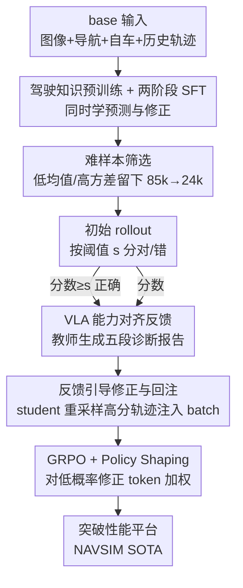

# Unleashing VLA Potentials in Autonomous Driving via Explicit Learning from Failures

**会议**: CVPR 2026  
**论文**: [CVF Open Access](https://openaccess.thecvf.com/content/CVPR2026/html/Luo_Unleashing_VLA_Potentials_in_Autonomous_Driving_via_Explicit_Learning_from_CVPR_2026_paper.html)  
**领域**: 自动驾驶 / 视觉-语言-动作 (VLA) / 强化学习  
**关键词**: VLA、自动驾驶、GRPO、失败反馈、长尾场景

## 一句话总结
ELF-VLA 让自动驾驶 VLA 模型在强化学习卡住（长尾场景里所有 rollout 都拿零分、稀疏奖励无法定位错因）时，用一个教师 VLM 生成「规划/推理/执行」三层结构化失败诊断，引导 student 重采样出高分修正轨迹并回注 GRPO 训练 batch，从而突破性能平台，在 NAVSIM 上把 PDMS 刷到 91.0 的新 SOTA。

## 研究背景与动机
**领域现状**：自动驾驶正从模块化流水线转向端到端，VLA 模型把摄像头输入直接映射到车辆运动指令，还能通过「think」模块输出中间推理轨迹（CoT），兼顾可解释性。主流训练范式是两段式——先在驾驶数据上做监督微调（SFT），再用强化学习（多用 GRPO）以驾驶分数（PDMS）当奖励继续优化。

**现有痛点**：RL 阶段普遍撞上**性能平台（performance plateau）**。SFT 数据里常见场景占绝大多数、安全攸关的长尾场景（复杂无保护左转、紧急避让）极少，导致 SFT 后模型的探索能力被严重约束。一进入 RL，这些关键场景里无论采多少次 rollout，驾驶分都贴地为零，整体学习就停滞了。

**核心矛盾**：当前 VLA-RL 把训练时的评估压缩成**单一标量奖励**（如 PDMS）。模型失败时，这个信息稀疏的奖励只告诉你「错了」，却说不清错在哪——是 think 模块高层规划的累积误差、对关键目标的认知推理出问题，还是低层轨迹本身的动力学缺陷。错因不明，梯度自然无从纠正。

**本文目标**：在长尾、零奖励的「持续失败」场景下，既能**诊断失败模式**，又能据此**修正策略**，让 RL 重新获得有效梯度。

**切入角度**：LLM 领域已有用非数值反馈（文本批评）做细粒度指导、以及用混合策略把高质量数据知识内化进策略的成功经验。作者把这个思路搬到自动驾驶：当 VLA 持续失败时，请一个外部教师模型分析并改正它的错误驾驶行为。

**核心 idea**：用「结构化失败诊断 + 反馈引导的轨迹修正 + 高分样本回注」替代「单一标量奖励」，把原本不存在的目标导向梯度信号造出来，让策略解决无引导探索解决不了的关键场景。

## 方法详解

### 整体框架
ELF-VLA 整体是一个**三阶段训练**的 VLA 框架，基座是 InternVL3-8B。关键巧思是：同一个 VLA 模型**既当生成器又当修正器**，能接受两类输入——不带反馈的 base 输入（前视图像 + 导航指令 + 自车状态 + 历史轨迹），以及在 base 之上额外拼接了纠错指导的 feedback 输入。

整条管线是：① **驾驶知识预训练**——在大规模开源驾驶 QA 数据上预训练，灌入可行驶区域估计、关键目标定位、自车动作预测等基础驾驶认知；② **两阶段 SFT**——在 base 输入与 feedback 输入的混合数据集上微调，让模型同时学会「预测轨迹」和「拿到反馈后修正轨迹」这两项能力；③ **带失败反馈的 RL**——GRPO 的 rollout 阶段引入一个教师模型（Qwen3-VL-32B），对持续失败的样本生成结构化反馈，引导 student 重采样出高分轨迹并回注训练 batch，把零奖励 rollout 的比例压下去。

### 关键设计

**1. VLA 能力对齐的结构化失败反馈：把标量零分换成能定位错因的诊断报告**

针对「单一标量奖励说不清错在哪」这个核心痛点，ELF-VLA 不再只给一个 PDMS 数字，而是引入一个 VLM 教师模型，在 VLA 遇到持续失败时被触发。判断对错用一个阈值 $s$：模型对 base 输入产出原始响应 $o$（含轨迹与 CoT），PDMS 超过 $s$ 记为正确 $o_c$，低于 $s$ 记为错误 $o_w$。对错误响应，教师模型吃进 base 输入 $q_{base}$、错误轨迹 $o_w$ 与真值轨迹 $o_{gt}$，生成一份**五段式结构化诊断**：(1) Meta Action 分析、(2) Think 推理过程分析、(3) 安全失败分析、(4) 效率失败分析、(5) 可执行的横向/纵向修正建议。这份报告刻意对齐到 VLA 自己的能力分层——规划（planning）、推理（reasoning）、执行（execution），所以学生模型拿到的不是泛泛的「你错了」，而是精确指向哪一层出了问题。对正确响应则只拼一个基于规则的正向反馈 $f^{rule}$。最终 feedback 输入按下式构造：

$$q_{fb} = \begin{cases} \langle q_{base}, o_c, f^{rule} \rangle & \text{若 } o_c \\ \langle q_{base}, o_w, f^{teacher} \rangle & \text{若 } o_w \end{cases}$$

之所以有效，是因为教师模型的通用知识能对原始响应做深层结构化剖析，而不是像基于规则的简单 self-refinement 那样只能给粗粒度提示——消融里 Rule-GRPO 就因为反馈太简单学不到有效修正而落后。

**2. 两阶段 SFT 同时灌入「认知」与「修正」能力：让 VLA 学会读懂反馈再改轨迹**

光有反馈机制不够——如果模型本身不会「拿着诊断报告改轨迹」，RL 阶段的反馈就喂不进去。所以第二阶段 SFT 在 base 输入和 feedback 输入的**混合数据集**上训练，每条 $q_{base}$ 和 $q_{fb}$ 都用真值轨迹 $o_{gt}$ 监督，最大化条件似然：

$$L_{SFT} = \mathbb{E}_{(q,o)\sim D}\left[-\log \pi_\theta(o \mid q)\right]$$

其中数据集 $D$ 同时包含 $\{(q_{base}, o_{gt}), (q_{fb}, o_{gt})\}$。这种混合训练让同一个模型获得「轨迹预测 + 基于反馈的轨迹修正」双重能力，正是 RL 阶段能利用失败反馈的前提。第一阶段则先用大量开源驾驶 QA（DriveLM、LingoQA、ImpromptuVLA 等）做认知预训练，打好驾驶常识底子。

**3. 高效难样本筛选：把算力集中到真正有学习信号的场景上**

朴素 RL 会把大量算力浪费在模型早已掌握的简单场景上，这些样本梯度信号弱。筛选的做法是用 SFT 模型对每个 query 采 $N$ 次 rollout，估计其奖励的均值和方差，然后**丢掉高均值、低方差**的样本（这类代表一致成功、没什么可学），把训练集中到难样本（低均值低方差，模型一贯失败）和模糊样本（高方差，模型最不确定）上。靠这一步把初始 85k 训练条目蒸馏成 24k 高价值核心集。消融 Tab.5 证明这步关键：全量 85k 只有 89.1 PDMS、随机抽的 24k 是 88.9，而精选的 24k* 直接拉到 91.0——简单场景占多数会稀释整体梯度。

**4. 反馈引导修正回注 + Policy Shaping：把高优势但低概率的修正轨迹稳稳学进来**

这是把反馈真正转成 RL 梯度的一步。GRPO rollout 阶段：先用 base 输入采一批 $\{o_i\}_{i=1}^n$ 算奖励，按阈值 $s$ 分成对/错两组并构造 feedback 输入；VLA 再用 feedback 输入生成新一批 $\{o_i^{fb}\}$。从中**随机选 $k$ 个轨迹奖励超过原 batch 最大轨迹奖励** $\max(r_{traj})$ 的「更优」响应；若不足 $k$ 个就用原 batch 里那个最高分响应复制补齐。这样得到 $n+k$ 个 rollout 样本，再算相对优势。优势用两组奖励合并后的均值和标准差归一化：$r_{union} = \{r_j\}_{j=1}^n \cup \{r_{j'}^{fb}\}_{j'=1}^k$。奖励本身是三项之和 $r = r_{traj} + r_{fmt} + r_{goal}$（轨迹分 + 格式分 + 终点 L1 距离分）。

关键挑战在于：修正响应 $o^{fb}$ 是在 feedback query $q_{fb}$ 下生成的，但优化目标却以 base query $q_{base}$ 为条件——这种 conditioning 错配会让 $o^{fb}$ 在优化策略下概率极低，引发高方差、梯度爆炸、训练不稳。受 LUFFY 启发，作者对反馈生成的输出用 **Policy Shaping** $f(x) = \frac{x}{x+\gamma}$（$0 < \gamma < 1$），给 $o^{fb}$ 里的低概率 token 更高权重，逼模型去学那些稀有但正确的轨迹。CLIP 只施加在原始 batch、不施加在反馈修正样本上。最终目标：

$$J(\theta) = \mathbb{E}\left[\frac{1}{n}\sum_{i=1}^n J_i + \frac{1}{k}\sum_{j=1}^k J_j^{fb} - \beta D_{KL}\right]$$

其中 $J_i = \min(c_i(\theta)A_i,\ \text{clip}(c_i(\theta), 1-\epsilon, 1+\epsilon)A_i)$，$J_j^{fb} = f(c_j^{fb}(\theta))A_j^{fb}$，shaped ratio $f(c_j^{fb}(\theta)) = \frac{\pi_\theta(o_j^{fb}|q_{base})}{\pi_\theta(o_j^{fb}|q_{base}) + \gamma}$。消融显示去掉 Policy Shaping 会让 PDMS 从 91.0 跌到 89.3，证明它对防训练崩溃至关重要。

### 损失函数 / 训练策略
三阶段：① 驾驶知识 QA 预训练；② 混合数据集 SFT（公式 2，base + feedback 联合）；③ GRPO with feedback（公式 4）。基座 InternVL3-8B，教师 Qwen3-VL-32B，64 张 H20 GPU。关键 RL 超参：每 batch 8 个 rollout、阈值 $s=0.8$、Policy Shaping $\gamma=0.1$、修正响应数 $k=1$。

## 实验关键数据

### 主实验
在 NAVSIM（基于 OpenScene 的规划导向自动驾驶数据集）上评测，闭环指标用 NAVSIMv1 的 PDMS 和 NAVSIMv2 的 EPDMS。

| 数据集 | 指标 | 本文 ELF-VLA-8B | 之前最佳(vision-only) | 提升 |
|--------|------|------|----------|------|
| NAVSIMv1 | PDMS | 91.0 | 89.1 (AutoVLA-3B) | +1.9 |
| NAVSIMv1 | PDMS vs SFT 基线 | 91.0 | 87.4 (InternVL3-8B-SFT) | +3.6 |
| NAVSIMv1 | PDMS vs 传统 RL | 91.0 | 89.0 (InternVL3-8B-RL) | +2.0 |
| NAVSIMv2 | EPDMS | 87.1 | 87.1 (DriveSuprim, 持平) | 持平/并列 SOTA |
| 高层规划 | Accuracy | 80.3 | 79.3 (GRPO) | +1.0 |

vision-only 设定下 PDMS 91.0 创新 SOTA；EPDMS 87.1 与近期 SOTA DriveSuprim 持平，说明不是单纯过拟合 PDMS 指标，对更综合的 EPDMS 也有泛化。高层规划上甚至比大得多的 Qwen2.5-VL-72B 高出 51.6% 准确率。

### 消融实验
| 配置 | PDMS↑ | 说明 |
|------|---------|------|
| SFT | 87.4 | 仅监督微调基线 |
| GRPO | 89.0 | 常规 GRPO |
| GT-GRPO | 89.2 | 直接加入真值轨迹增广 |
| Rule-GRPO | 89.6 | 基于预定义规则反馈再生成 |
| ELF-VLA | **91.0** | 教师结构化反馈再生成（完整模型） |

| 配置 | PDMS↑ | 说明 |
|------|---------|------|
| 85k 全量 | 89.1 | 简单场景占多数，梯度被稀释 |
| 24k† 随机 | 88.9 | 随机抽样，无信息增益 |
| 24k* 精选 | **91.0** | 难样本筛选，集中有效信号 |
| $k=4$, PS✓ | 89.0 | 修正响应过多，干扰策略 |
| $k=2$, PS✓ | 89.7 | — |
| $k=1$, PS✗ | 89.3 | 去掉 Policy Shaping，跌 1.7 |
| $k=1$, PS✓ | **91.0** | 单条精准修正 + PS，最优 |

### 关键发现
- **结构化反馈是涨点主力**：ELF-VLA 比常规 GRPO 高 2.0 PDMS，比 GT-GRPO/Rule-GRPO 高 1.8/1.4。GT-GRPO 因真值轨迹与 VLA 输出分布差异大、似然过低而难优化；Rule-GRPO 反馈太粗只是简单 self-refine，学不到有效修正——只有教师模型的深层结构化分析才管用。
- **持续失败率显著下降**：ELF-VLA 把 PDMS 维度的「全 rollout 失败」比例从 GRPO 的 2.73% 压到 1.08%，NC、DAC 也有同等量级下降，直接验证「从失败中学习」确实解决了 persistent failure。
- **$k=1$ 最优**：单条精准修正最有效，$k$ 增大反而把策略带偏（$k=4$ 跌到 89.0）。
- **Policy Shaping 不可省**：去掉后 PDMS 跌 1.7（91.0→89.3），是防止训练崩溃和格式错误的关键，让模型能学到高优势、低概率的修正轨迹。

## 亮点与洞察
- **把「奖励」从标量升级成可解释诊断**：核心 insight 是稀疏标量奖励信号在长尾场景里近乎无信息，而对齐到模型能力分层（规划/推理/执行）的结构化反馈能造出原本不存在的目标导向梯度——这个「诊断报告即梯度来源」的视角可迁移到任何 RL 卡平台的具身/Agent 任务。
- **同一模型既是 generator 又是 refiner**：通过混合数据 SFT 让 VLA 自己学会读反馈改轨迹，避免了额外引入独立修正网络，工程上很干净。
- **难样本筛选的均值-方差准则很实用**：用 SFT 模型预跑估计 reward 均值/方差、丢掉「高均值低方差」的已掌握样本，把 85k 蒸成 24k 反而涨 1.9 PDMS，是个低成本可复用的数据策展 trick。
- **Policy Shaping 解决 conditioning 错配**：修正轨迹在 feedback query 下生成、却要在 base query 下优化导致概率塌缩，用 $\frac{x}{x+\gamma}$ 给低概率 token 加权稳住训练——这个对「跨 query 蒸馏」的处理值得借鉴。

## 局限与展望
- **依赖一个强教师模型**：方法效果建立在 Qwen3-VL-32B 教师能给出高质量五段诊断的前提上，教师本身的盲区或偏差会直接传导给 student；论文未充分讨论教师质量的敏感性。
- **训练成本高**：64 张 H20 GPU + 三阶段 + RL 阶段每样本要额外跑教师推理和二次 rollout，开销不小，难以快速复现。
- **仅在 NAVSIM 上验证**：闭环评测局限于 NAVSIM v1/v2，真实路测、跨数据集泛化、以及多视角（非单前视）输入下的表现都未知。
- **阈值 $s$ 与 $\gamma$、$k$ 等超参敏感**：$k=1$ 最优而 $k=4$ 明显掉点，说明反馈注入量很挑参数，泛化到其他任务时需重新调。
- **诊断对错全靠 PDMS 阈值切分**：用单一阈值 $s=0.8$ 二分对错，处于边界的轨迹可能被误判，反馈质量上限受此简化影响。

## 相关工作与启发
- **vs 常规 GRPO（InternVL3-8B-RL）**: 他们只用标量 PDMS 当奖励，长尾场景里零奖励 rollout 无法提供梯度；本文用教师结构化反馈造出目标导向梯度，PDMS 高 2.0、全失败率从 2.73% 降到 1.08%。
- **vs GT-GRPO**: 他们直接把真值轨迹塞进响应集增广，但 GT 与 VLA 自身输出分布差异大、似然低难优化；本文让 student 自己在反馈引导下重采样**分布内**的高分轨迹，更易优化（高 1.8 PDMS）。
- **vs Rule-GRPO**: 他们用预定义规则给反馈，等同简单 self-refine、缺乏细粒度指导；本文借教师模型的通用知识做深层结构化剖析，提供可定位错因的诊断（高 1.4 PDMS）。
- **vs Senna / EMMA / ReasonPlan 等 VLA**: 这些工作聚焦场景理解或 CoT 增强轨迹预测、但主要停在 SFT 范式；本文专攻 RL 阶段的性能平台问题，是对 VLA-RL 训练管线的正交改进。
- **vs LUFFY（LLM 混合策略）**: 本文直接借用其 Policy Shaping 思想解决「跨 query 生成-优化错配」，把 LLM 里内化高质量数据的经验落地到自动驾驶 VLA。

## 评分
- 新颖性: ⭐⭐⭐⭐ 把「结构化失败诊断回注 RL」从 LLM 迁移到自动驾驶 VLA，能力对齐的五段反馈 + Policy Shaping 解决跨 query 错配是实打实的新组合。
- 实验充分度: ⭐⭐⭐⭐ NAVSIM v1/v2 双榜 SOTA，消融覆盖数据策展、反馈策略、$k$、Policy Shaping，并有失败率曲线佐证；但仅限单一基准、缺真实路测。
- 写作质量: ⭐⭐⭐⭐ 动机清晰、公式与算法完整、图表自洽，问题定位（错因不明）讲得很到位。
- 价值: ⭐⭐⭐⭐ 直击 VLA-RL 性能平台这一真实痛点，思路对具身/Agent 类 RL 任务有迁移价值；但高算力门槛限制了普及。

<!-- RELATED:START -->

## 相关论文

- [\[CVPR 2026\] Learning Vision-Language-Action World Models for Autonomous Driving](vla_world_learning_vision_language_action_world_models_for_autonomous_driving.md)
- [\[CVPR 2026\] ActiveAD: Planning-Oriented Active Learning for End-to-End Autonomous Driving](activead_planning-oriented_active_learning_for_end-to-end_autonomous_driving.md)
- [\[CVPR 2026\] DynamicVGGT: Learning Dynamic Point Maps for 4D Scene Reconstruction in Autonomous Driving](dynamicvggt_learning_dynamic_point_maps_for_4d_scene_reconstruction_in_autonomou.md)
- [\[CVPR 2026\] Unifying Language-Action Understanding and Generation for Autonomous Driving](unifying_language-action_understanding_and_generation_for_autonomous_driving.md)
- [\[CVPR 2026\] RaGS: Unleashing 3D Gaussian Splatting from 4D Radar and Monocular Cue for 3D Object Detection](rags_unleashing_3d_gaussian_splatting_from_4d_radar_and_monocular_cue_for_3d_obj.md)

<!-- RELATED:END -->
