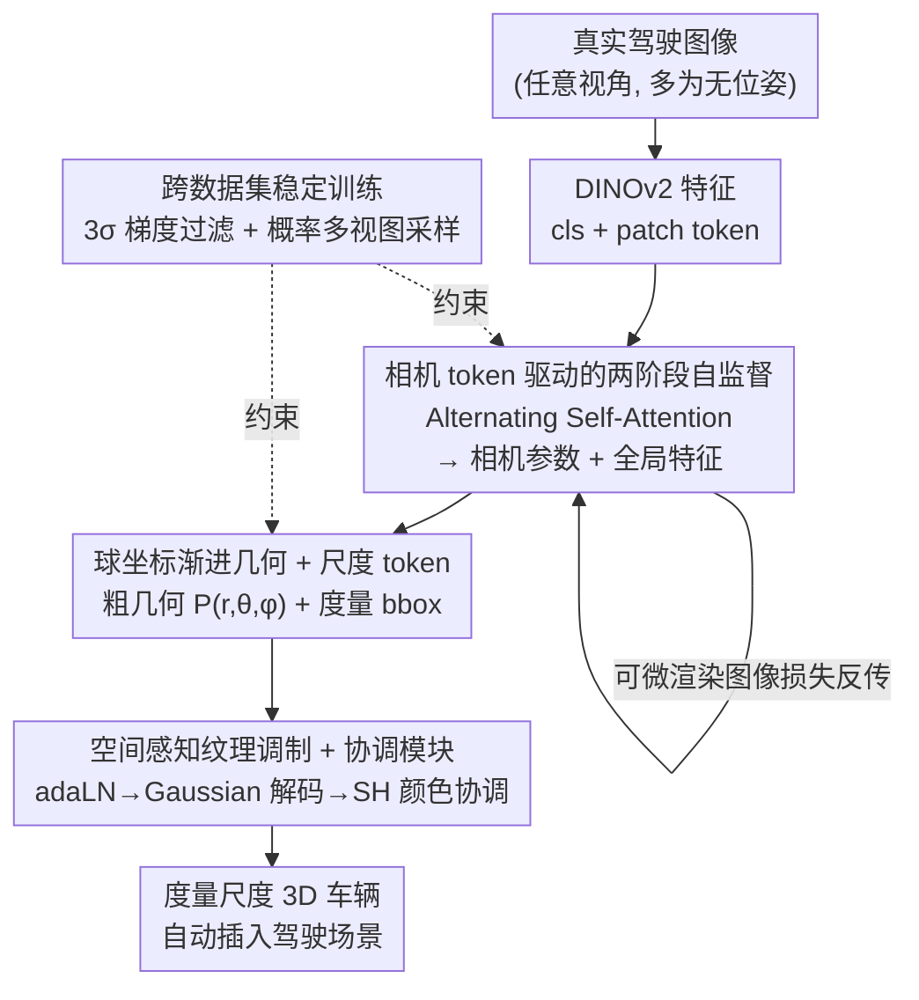

# Unposed-to-3D: Learning Simulation-Ready Vehicles from Real-World Images

**会议**: CVPR 2026  
**arXiv**: [2604.19257](https://arxiv.org/abs/2604.19257)  
**代码**: 无  
**领域**: 自动驾驶 / 3D 重建  
**关键词**: 自监督 3D 重建、无位姿、3D 高斯、仿真资产、相机位姿预测

## 一句话总结
Unposed-to-3D 用纯图像监督（无任何 3D 真值、无相机位姿标注）从真实驾驶图像里重建出"仿真即用"的 3D 车辆——靠一个相机预测头估出位姿、再用可微渲染把图像重建损失反传回几何，外加尺度预测和光照协调模块，让重建车辆能直接以正确朝向、真实尺寸、协调光照插进驾驶场景，下游 3D 检测的 AP 因此提升约 1 个点。

## 研究背景与动机

**领域现状**：闭环驾驶仿真要往场景里塞前景车辆。主流靠两条路——要么用 NeRF / 3DGS 直接重建场景里的车（如 ProtoCar、DreamCar），要么用 object-level 的大重建/生成模型（LRM、TRELLIS、LGM 等）单图生成 3D 物体。

**现有痛点**：这两条路都不好用。① 重建派依赖 posed 图像和 3D 监督，且视角一偏离训练范围（大视角变化）车辆就出现渲染崩坏或几何塌陷；② 生成派几乎都在合成数据集（ShapeNet / Objaverse）上训，和真实车存在明显 domain gap，生成结果带着浓重的"仿真味"；更要命的是它们产出的物体**姿态任意、尺度未定**，插进真实场景前必须人工对齐、重缩放；③ 把预生成资产插入目标场景时，光照、阴影、天气不一致会造成强烈的视觉违和。

**核心矛盾**：高质量真实 3D 资产稀缺且昂贵，而真实 2D 驾驶图像极其充裕。能不能**绕开 3D 监督**，只靠海量真实图像学出 3D 车？障碍在于：没有相机位姿就无法做可微渲染监督，而几何与相机参数之间存在内在歧义——一个远距离窄 FOV 的相机配上扭曲几何，可能渲出和正确解一样"看着对"的图，直接联合优化会几何塌陷。

**本文目标**：(1) 无 3D 监督、无位姿标注，从真实序列图像重建车辆；(2) 输出度量尺度、姿态固定的资产，可直接插入仿真；(3) 让插入资产自动适配场景光照。

**切入角度**：驾驶数据天然是序列——同一辆车有多帧时序观测。作者先用一小批有位姿的图像预训练出一个能"猜相机参数"的网络，再放开到大规模无位姿图像上，用**预测出来的位姿**驱动可微渲染、以图像重建损失自监督几何。

**核心 idea**：用"可学习相机 token + 可微渲染自监督"代替"人工位姿标注 + 3D 真值"，把单纯的 2D 真实图像变成 3D 车辆的监督信号，并顺带预测度量尺度、协调插入光照，做出仿真即用资产。

## 方法详解

### 整体框架
方法要解决的是"只给真实图像（很多还没有相机位姿），怎么学出能直接用于驾驶仿真的 3D 车"。整体是一条前馈重建管线 + 两阶段训练范式：任意视角的输入图像先过冻结的 DINOv2 抽特征，每张图被切成 cls token 和 patch token，并在最前面拼一个所有视角共享的可学习 **相机 token**；接着 Alternating Self-Attention（帧内自注意强化局部纹理、帧间自注意捕捉整体几何）一边把相机 token 解码成相机参数（旋转四元数 / 平移 / FOV），一边把多帧特征注意力池化成全局的 $\mathbf{z}^{\text{cls}}$（粗几何）和 $\mathbf{z}^{\text{patch}}$（细纹理）。然后 Geometry Block 用一组可学习结构 token + 尺度 token 解出粗几何位置和真实尺寸 bounding box；位置经 adaLN 调制纹理特征后送进 Gaussian Decoder，每个 token 解出一簇 3D 高斯属性。最后协调模块根据目标场景微调高斯的球谐颜色，资产即可无缝插入。

训练分两阶段：**第一阶段**在带相机标注的小数据集（3DRealCar，约 1000 样本）上预训练，相机/尺度都有监督；**第二阶段**切到 7 万实例、500 万张无标注图像的 MAD-Cars，**撤掉相机和尺度监督，只留图像级重建损失**，靠可微渲染把图像损失对相机参数的梯度（式 5）反传，实现自监督。为压住第二阶段的几何-相机歧义和跨域不稳定，引入 3σ 梯度过滤和概率多视图采样。

### 关键设计

**1. 相机 token 驱动的两阶段自监督：把"没有位姿"变成可微渲染信号**

这是整篇的命门——没有相机位姿就做不了可微渲染监督，而真实图像绝大多数没有标注。作者在 DINOv2 token 序列前面拼一个所有视角**共享**的可学习相机 token $\mathbf{x}^{\text{cam}}\in\mathbb{R}^d$（式 1），经 Alternating Self-Attention 后解码出每张图的相机参数 $\theta_i=\{\mathbf{q}_i,\mathbf{t}_i,\mathbf{f}_i\}$（四元数旋转、平移、FOV，假设无主点偏移）。第一阶段在有标注的 3DRealCar 上直接监督相机：考虑四元数符号歧义，旋转损失取 $\mathcal{L}_{\text{rot}}=\min(|\mathbf{q}_i-\hat{\mathbf{q}}_i|_1,|\mathbf{q}_i+\hat{\mathbf{q}}_i|_1)$，整体 $\mathcal{L}_{\text{cam}}=\mathcal{L}_{\text{rot}}+|\mathbf{t}_i-\hat{\mathbf{t}}_i|_1+|\mathbf{f}_i-\hat{\mathbf{f}}_i|_1$（式 3）。

真正的妙处在第二阶段：撤掉相机监督，只用图像重建损失。借助 3DGS 可微渲染，图像损失对相机参数的梯度能沿每个高斯的像素位置 $\mu_i$ 和协方差 $\Sigma_i$ 反传（式 5）——

$$\frac{\partial\mathcal{L}}{\partial\theta}=\sum_i\Big(\frac{\partial\mathcal{L}}{\partial\mu_i}^{\top}\frac{\partial\mu_i}{\partial\theta}+\big\langle\frac{\partial\mathcal{L}}{\partial\Sigma_i},\frac{\partial\Sigma_i}{\partial\theta}\big\rangle\Big)$$

外参 $(\mathbf{q},\mathbf{t})$ 主要被投影中心误差驱动，内参 $\mathbf{f}$ 同时受均值和协方差影响。于是"预测位姿 → 渲染 → 和输入图比对 → 同时修正几何和位姿"形成闭环，让模型在 7 万实例的无标注数据上自监督地学几何，彻底摆脱对 3D 真值和人工位姿的依赖。这与 DUSt3R/VGGT 那类显式预测相机参数的 pose-free 方法同源，但作者强调直接拿预测相机去做物体生成会几何塌陷，所以才需要"先 posed 预训练、再 unposed 微调"的渐进策略来绕开歧义。

**2. 球坐标渐进式几何优化 + 尺度 token：让无监督几何学得动、且有真实尺寸**

在没有 3D 监督的情况下直接从图像损失回归笛卡尔坐标 $(x,y,z)$ 极难收敛。作者显式构造 $N$ 个可学习结构 token $\mathbf{E}=\{\mathbf{e}^1,\dots,\mathbf{e}^N\}$（每个对应一个粗几何位置），外加一个尺度 token。Geometry Block 由 cross-attention / self-attention / MLP + skip 组成，用单个 cls token 注入全局几何先验，足以解码粗几何又省算力（相比 triplane 压缩避免了信息损失）。

针对"直接预测 xyz 太难"，提出**球坐标渐进优化**：把位置表示从笛卡尔 $(x,y,z)$ 换成球坐标 $(r,\theta,\phi)$，又因物体中心被约束在世界原点，训练早期先优化径向距离 $r$，之后再优化方位角 $\theta$ 和俯仰角 $\phi$。这个坐标变换在不牺牲表达精度的前提下大幅降低空间学习难度（先定"多远"再定"什么方向"，比一上来同时拧三个自由度稳得多）。同时尺度 token 经 scale head 解出三轴 bounding box $b\in\mathbb{R}^3$，给出真实物理尺寸——这正是"仿真即用"的前提：插入场景时不用再人工缩放。第二阶段尺度监督也撤掉，最后把 scale head 解耦、在 3DRealCar 上单独微调几个 epoch 回归真实尺度。

**3. 空间感知纹理调制 + 协调模块：几何-纹理对齐 + 插入光照自适应**

不同空间位置的 token 应有不同纹理特征。作者用预测位置 $P_i$ 通过 adaLN 调制对应几何特征 $\mathbf{G}_i$：调制参数 $\gamma_i,\beta_i=f_{\mathbf{mod}}(P_i)$，纹理特征 $\mathbf{T}_i=(1+\gamma_i)\cdot\text{LN}(\mathbf{G}_i)+\beta_i$（式 6），让纹理"知道"自己在车的哪个部位，保证几何-纹理一致。随后 Gaussian Decoder 用各自独立的 MLP 头从每个 token 解出 $m$ 个高斯：位置取相对初始 $p_i$ 的偏移，缩放和不透明度也以预设偏置的偏移形式预测（稳定训练），再加球谐颜色 $c$ 和旋转 $q$（式 7）。

光照协调是"仿真即用"的第二块拼图。同一辆车在不同光照下纹理差异极大，作者微调一个**一步 2D 扩散模型当协调监督器**，把"前景不协调"的插入图转成视觉协调图。具体只解冻控制外观的球谐颜色 $c$，用一个自注意调制块算调整量 $\{\Delta c_j\}=\text{Harm}(\mathbf{T}_i)$，最终颜色 $c_j'=c_j+\Delta c_j$，其余高斯属性全冻结。这样既保住几何，又能让同一资产在阴天/强光/不同场景间复用，自动适配周围环境。

**4. 跨数据集稳定训练：3σ 梯度过滤 + 概率多视图采样**

第二阶段纯图像监督带来三个坑：① 几何-相机歧义（远相机窄 FOV + 扭曲几何也能渲出"对"的图）；② 相机预测的小误差会造成像素级大错位、丢高频细节；③ 预训练集和微调集的图像/相机分布不同，domain gap 让收敛困难。

对策是**梯度过滤**：把一个 batch 当滑动窗口，算每个视角的梯度贡献 $L_i$，丢掉偏离 $3\sigma$ 的——梯度太小说明该视角已拟合够好、再优化会过拟合；梯度太大说明相机严重误预测、反传会伤优化。掩码 $M_i=\mathbf{1}[\bar{L}-3\sigma_L<L_i<\bar{L}+3\sigma_L]$，实际反传梯度 $\tilde{\nabla}_\theta=\sum_i M_i\nabla_\theta L_i$（式 12）。随训练推进相机预测变准，先前被丢的离群数据会重新纳入。这保证只有渲染视角与目标对齐良好时才施加监督，挡住歧义带来的有害梯度，实现稳定跨数据集训练。配套的**概率多视图采样**让模型同时能吃单视图和多视图：选 $v$ 个视图的未归一化概率 $\pi_v=\exp(-\lambda(v-1))$，按指数衰减，训练后期逐渐降低用多视图的概率（式 8-9），既保住单视图重建能力又增强多视图聚合能力。

### 损失函数 / 训练策略
两阶段。第一阶段（3DRealCar，有标注）：
$$\mathcal{L}_1=\mathcal{L}_{\text{L1}}+\mathcal{L}_{\text{SSIM}}+\mathcal{L}_{\text{LPIPS}}+\mathcal{L}_{\text{scale}}+\mathcal{L}_{\text{cam}}+\mathcal{L}_{\text{reg}}$$
第二阶段（MAD-Cars，无标注，撤掉相机/尺度监督）：
$$\mathcal{L}_2=\mathcal{L}_{\text{L1}}+\mathcal{L}_{\text{SSIM}}+\mathcal{L}_{\text{LPIPS}}+\mathcal{L}_{\text{reg}}$$
其中高斯正则 $\mathcal{L}_{\text{reg}}=\frac{1}{N}\sum_i(\alpha_i-1)^2+\frac{1}{N}\sum_i\max_j s_{i,j}$（式 10），第一项拉高不透明度防止退化高斯、第二项压住过大缩放。第二阶段叠加 3σ 梯度过滤与概率多视图采样；最后解耦 scale head 在 3DRealCar 上微调回归真实尺度。

## 实验关键数据

**指标说明**：SSIM/PSNR 越高越好、LPIPS 越低越好（2D 渲染质量）；CD 为 Chamfer Distance（表 1 中 ×1000，越低越好）、F-score@0.01（归一化尺度下半径 0.01，越高越好）（3D 几何质量）；表 4 的 CD 以**米**为单位、F-score@0.05m 评的是真实度量尺度精度；下游检测用 AP/APH（Waymo LEVEL_1/2）。

### 主实验：单视图重建（表 1，3DRealCar / CFV）
所有 baseline 都经人工对齐到标准位姿+尺度，本文无需任何人工调整。

| 方法 | 数据集 | SSIM↑ | PSNR↑ | LPIPS↓ | CD↓ | F-score↑ |
|------|--------|-------|-------|--------|-----|----------|
| DGS | 3DRealCar | 0.8635 | 19.62 | 0.1442 | 1.3511 | 0.3022 |
| TGS | 3DRealCar | 0.9100 | 17.63 | 0.1282 | 3.4874 | 0.2029 |
| LGM | 3DRealCar | 0.8412 | 17.89 | 0.1450 | 7.1201 | 0.2030 |
| TRELLIS | 3DRealCar | 0.8879 | 19.51 | 0.0884 | 1.3111 | 0.4744 |
| **Ours** | 3DRealCar | **0.9172** | **21.20** | **0.0571** | **0.5782** | **0.5341** |
| **Ours** | CFV (零样本) | **0.9183** | **21.73** | **0.0508** | **0.7439** | **0.4252** |

本文在 2D 与 3D 指标上全面领先：CD 从次优 TRELLIS 的 1.31 降到 0.58（降幅过半），LPIPS 几乎砍半，且在 CFV 上零样本泛化依然最好。关键是 baseline 必须人工对齐位姿/尺度才能算这些数，本文开箱即用——侧面印证了 baseline 的低可用性。

### 度量尺度与相机预测精度（表 3 / 表 4）
| 评估 | 数据集 | 指标 |
|------|--------|------|
| 用预测相机渲染 (表3) | 3DRealCar | SSIM 0.9263 / PSNR 21.76 / LPIPS 0.0500 |
| 用预测相机渲染 (表3) | CFV | SSIM 0.9239 / PSNR 21.78 / LPIPS 0.0477 |
| 真实度量尺度 (表4) | 3DRealCar | CD 0.0160 m / F-score@0.05m 0.4886 |

用**自己预测的相机**渲染仍能达到与 GT 相机相当的重建质量，说明相机预测头足够准；真实尺度下 CD 仅 1.6 cm，验证度量尺度恢复的精度。

### 下游 Sim2Real：3D 检测数据增强（表 5，OpenPCDet + Voxel R-CNN，Waymo）
| 设置 | L1/AP↑ | L1/APH↑ | L2/AP↑ | L2/APH↑ |
|------|--------|---------|--------|---------|
| Real | 0.8837 | 0.8594 | 0.8026 | 0.7793 |
| Real + Sim (本文资产) | **0.8946** | **0.8738** | **0.8198** | **0.7996** |

把生成资产插入 100 个 Waymo 场景做增强，AP/APH 在 L1/L2 上稳定提升约 1~1.7 个点——这是"仿真即用"最硬的证据：资产真能帮到真实感知任务。

### 消融 / 分析：多视图输入数量（表 2）
| 输入视图数 | 3DRealCar PSNR↑ | 3DRealCar CD↓ | CFV PSNR↑ | CFV CD↓ |
|-----------|------|------|------|------|
| 1 | 21.2033 | 0.5782 | 21.7250 | 0.7439 |
| 2 | 21.4407 | 0.5672 | 21.9673 | 0.7410 |
| 4 | 21.5565 | 0.5648 | 22.1001 | 0.7382 |
| 6 | 21.5976 | 0.5637 | 22.1426 | 0.7351 |
| 8 | 21.6194 | 0.5630 | 22.1682 | 0.7329 |
| 10 | 21.6249 | 0.5636 | 22.1737 | 0.7313 |

### 关键发现
- 视图越多质量越好，但**边际收益递减**：1→4 视图 PSNR 涨约 0.35，4→10 仅再涨约 0.07；作者解释为额外视图最终提供的先验趋于饱和，且随机选视图若都在同一侧则信息增益有限。
- 概率多视图采样让一套模型同时胜任单视图与多视图，不必为不同输入数训不同模型。
- 相机预测精度（表 3）和度量尺度精度（表 4）是本文独有能力，baseline 根本不具备，无法对比——这本身说明了任务定位的差异。

## 亮点与洞察
- **把"缺位姿"从障碍变成自监督杠杆**：核心 trick 是共享相机 token + 3DGS 可微渲染，让图像重建损失同时回流到几何和相机参数。这套"预测位姿→渲染→比对→联合修正"思路可迁移到任何"有海量无标注图像、但缺相机标注"的 object-level 重建场景。
- **球坐标渐进优化**很巧：在无 3D 监督下直接学 xyz 几乎学不动，换成 $(r,\theta,\phi)$ 并"先定远近再定方向"，把一个三自由度难题拆成有先后的低维优化，是处理欠约束几何学习的可复用经验。
- **3σ 梯度过滤**优雅地化解几何-相机歧义：不改模型结构，只在优化层面把"太小（已拟合）/太大（误预测）"的梯度滤掉，且随训练自适应放回离群样本，是稳定 pose-free 自监督训练的轻量补丁。
- **把"仿真即用"拆成三件具体事**：度量尺度（不用缩放）、固定姿态（不用对齐）、光照协调（不用手 P 图），并各给一个模块，最后用下游 Waymo 检测涨点闭环验证——目标定义和验证链条都很扎实。

## 局限与展望
- **只做车一类**：结构 token、尺度回归、协调都是围绕车辆设计，能否推广到行人、骑行者、路侧物体等其他驾驶前景未验证。
- **第一阶段仍需少量 posed 数据**：完全冷启动（零位姿标注）尚不可行，渐进策略依赖 3DRealCar 这种带相机标定的小集合做引导。
- **协调依赖预训练一步扩散模型**：光照协调质量受这个外部监督器上限制约，论文未量化协调模块本身的增益（只有定性图 4），缺一个"加/不加协调"的定量消融。
- **缺关键模块的定量消融**：梯度过滤、球坐标优化、adaLN 调制等设计都只在正文论证，没有逐一去掉看掉点多少的 ablation table，模块贡献的可信度主要靠主结果支撑。
- **边际收益递减 + 视图随机性**：多视图提升小且对所选视图分布敏感，实际部署时如何挑视图未给策略。

## 相关工作与启发
- **vs TRELLIS / LGM / LRM（大重建/生成模型）**：它们在 Objaverse 等合成 3D 数据上训，泛化强但带"仿真味"、姿态尺度任意；本文纯真实图像训、无 3D 监督，几何更真实且直接给度量尺度+固定姿态，代价是只做车这一类。
- **vs DreamCar / ProtoCar（驾驶前景重建）**：它们仍依赖 posed 图像和 3D 监督、视觉保真有限；本文用纯图像级监督学到自监督相机预测，免标注且可规模化到 7 万实例。
- **vs DUSt3R / VGGT（pose-free 场景重建）**：同样显式预测相机参数，但本文指出直接拿预测相机做物体生成会几何塌陷，故用"posed 预训练→unposed 微调"的渐进策略 + 3σ 梯度过滤绕开几何-相机歧义，把 pose-free 思路落到 object-level 仿真资产上。
- **启发**："用可微渲染把缺失的标注（这里是相机位姿）变成可自监督的隐变量"是个通用范式，凡是渲染管线可微、标注昂贵的任务（光照、材质、内参）都可借鉴这种"预测-渲染-反传"闭环。

## 评分
- 新颖性: ⭐⭐⭐⭐ 把无位姿真实图像通过相机预测+可微渲染变成 3D 车自监督信号，并系统性解决度量尺度/姿态/光照三件"仿真即用"的事，立意清晰。
- 实验充分度: ⭐⭐⭐ 主结果、跨数据集泛化、相机/尺度精度、下游检测都有覆盖，但缺各核心模块的定量消融表，模块增益靠定性图支撑。
- 写作质量: ⭐⭐⭐⭐ 动机-方法-验证链条完整，公式与训练策略交代清楚，图示丰富。
- 价值: ⭐⭐⭐⭐ 给驾驶仿真提供了一条"靠真实图像规模化造仿真资产"的可扩展路径，下游检测涨点证明实用价值。

<!-- RELATED:START -->

## 相关论文

- [\[CVPR 2026\] SimScale: Learning to Drive via Real-World Simulation at Scale](simscale_learning_to_drive_via_real-world_simulation_at_scale.md)
- [\[CVPR 2026\] WorldLens: Full-Spectrum Evaluations of Driving World Models in Real World](worldlens_full-spectrum_evaluations_of_driving_world_models_in_real_world.md)
- [\[CVPR 2026\] Learning to Drive is a Free Gift: Large-Scale Label-Free Autonomy Pretraining from Unposed In-The-Wild Videos](learning_to_drive_is_a_free_gift_large-scale_label-free_autonomy_pretraining_fro.md)
- [\[CVPR 2026\] V2U4Real: A Real-world Large-scale Dataset for Vehicle-to-UAV Cooperative Perception](v2u4real_a_real-world_large-scale_dataset_for_vehicle-to-uav_cooperative_percept.md)
- [\[CVPR 2026\] Learning Vision-Language-Action World Models for Autonomous Driving](vla_world_learning_vision_language_action_world_models_for_autonomous_driving.md)

<!-- RELATED:END -->
