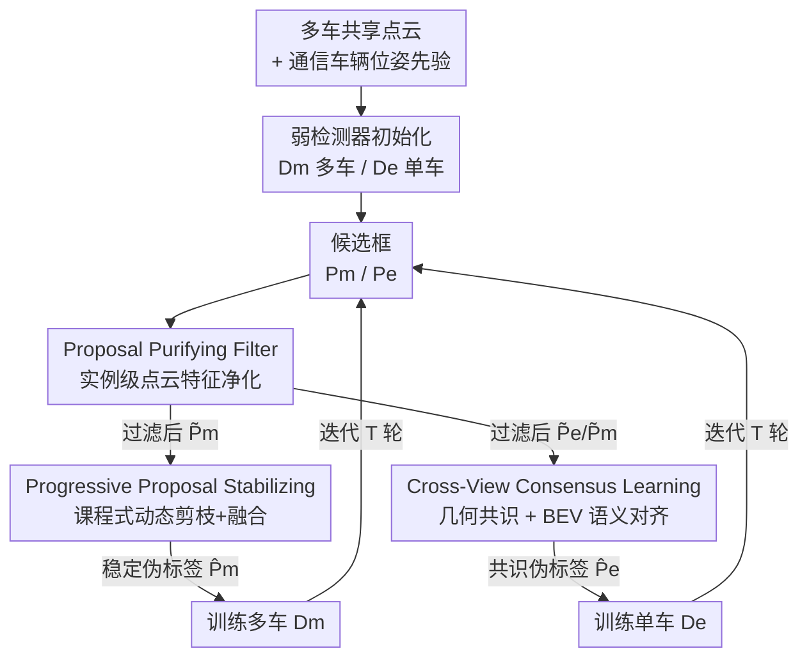

# Unsupervised Multi-agent and Single-agent Perception from Cooperative Views

**会议**: CVPR 2026  
**论文**: [CVF Open Access](https://openaccess.thecvf.com/content/CVPR2026/html/Yang_Unsupervised_Multi-agent_and_Single-agent_Perception_from_Cooperative_Views_CVPR_2026_paper.html)  
**领域**: 自动驾驶 / 车路协同感知 / 无监督 3D 检测  
**关键词**: V2V 协同感知、无监督 3D 目标检测、伪标签、点云密度、跨视角一致性

## 一句话总结
UMS 利用车车（V2V）通信带来的协同视角，不用任何人工标注，把"多车密集点云能让分类更易"和"协同视角能监督单车检测"两个观察做成一套伪标签精炼框架（PPF 过滤 + PPS 稳定 + CCL 跨视一致），首次同时把多车和单车两种 3D 检测都训到显著超越现有无监督方法。

## 研究背景与动机

**领域现状**：自动驾驶里的 LiDAR 3D 目标检测，无论是单车（ego 自己）还是多车协同（V2V 互相共享点云扩大感知范围），主流都依赖大规模人工标注的 3D 包围框做强监督训练。

**现有痛点**：人工标注 3D 框又贵又难规模化，很多真实场景根本拿不到标注。已有的无监督 3D 检测（OYSTER 靠聚类、CPD 靠原型模板和常识过滤、DOtA 把规则过滤扩到多车）几乎都只针对单车设定，且都基于手工启发式规则——在稀疏点云、遮挡场景下会产生大量假阳/假阴，DOtA 的规则过滤在遮挡下退化明显。**至今没有任何方法能用纯通信、无标注的方式同时解决多车和单车两种感知。**

**核心矛盾**：稀疏单视角 LiDAR 缺几何信息，导致弱检测器产出的候选框噪声大、不完整；而手工规则无法在实例级别学习特征去区分真车和背景杂波。无监督场景下又缺乏可信的监督信号来训练一个可学习的过滤器。

**本文目标**：只靠车间通信、零人工标注，同时把多车协同检测和单车检测都训好——而且要让 ego 车在"有/无与他车共享数据"两种部署条件下都能工作（现实里 V2V 车辆渗透率低，大量车仍要靠单车感知）。

**切入角度**：作者从协同视角的两个具体物理事实出发。其一是**点云密度收益**：多车共享后点云变密，真车（True Positive）和假阳（False Positive）在置信度分布上拉开差距（论文 Fig.4），使自监督的"车 / 非车"二分类成为可能；其二是**跨视角一致性收益**：多车协同视角对单车视角里漏掉的远处/遮挡目标提供互补几何与上下文线索，可当作单车检测的免标注监督。

**核心 idea**：用"通信带来的密集协同点云"代替人工标注，把它转化成两路监督信号——密集点云上学一个实例级可学习过滤器净化伪标签、再用协同视角与单车视角的几何/语义一致性反过来指导单车检测器，在一个迭代式伪监督闭环里同时提升两种检测器。

## 方法详解

### 整体框架
以 V2V 协同为研究对象：$V$ 辆联网车提供共享 LiDAR 点云 $\{X_v\}_{v=1}^{V}$ 及 GPS 位姿，全部用齐次变换矩阵 $\{T_{v\to e}\}$ 对齐到 ego 车坐标系 $X_e$。训练时同时维护两个检测器：单车检测器 $D_e$（不共享数据）和多车检测器 $D_m$（共享数据），通过迭代伪监督联合优化。

冷启动时没有任何人工标注，只用"已通信车辆的位置先验（位置、姿态）"训出两个弱检测器，给出初始伪标签（即 3D 框，文中也叫 proposal）。$D_e$ 吃 $X_e$ 输出候选 $P_e=\{b_e,c_e\}$，$D_m$ 吃 $\{X_v\}$ 输出候选 $P_m=\{b_m,c_m\}$（$b$ 是框、$c$ 是置信度），这些初始框天然嘈杂且不完整。UMS 把它们经过三段精炼：**PPF** 用实例级点云特征过滤掉不可靠框得到 $\tilde P_e,\tilde P_m$；**PPS** 把 $\tilde P_m$ 与记忆库 $\mathcal B$ 里的历史框融合得到稳定的 $\hat P_m$，提升稳定性和召回；**CCL** 在两个检测器之间施加几何与 BEV 语义一致性，生成共识伪标签 $\hat P_e$ 去训 $D_e$。如此往复迭代，两个弱检测器被不断增强。

### 关键设计

**1. Proposal Purifying Filter（PPF）：把"无标注"难题转成置信度自监督的实例级分类**

弱检测器产出的候选框里满是背景杂波，但聚类类方法（DBSCAN/OYSTER/CPD）只会手工启发式分组、做不了实例级特征学习，而无监督场景又没有标签去训一个可学习分类器。PPF 的破局点在于：在多车密集点云下，弱检测器 $D_m$ 的高置信度框大多是真车、低置信度框大多是假阳（Fig.4 验证了这个分布鸿沟）——于是直接拿置信度当免费标签。具体地，从 $P_m$ 里选低置信度的负集 $S^-$ 和高置信度的正集 $S^+$，对每个框 $b_i$ 用 $\mathrm{crop}(X,b_i)$ 抠出框内点，喂进一个基于 PointNet++ 的层级点云特征分类器 $C_\phi$ 预测分数 $q_i = C_\phi(\mathrm{crop}(X,b_i))$，用二元交叉熵训练：

$$\mathcal{L}_{\mathrm{ppf}} = -\sum_i [y_i\log q_i + (1-y_i)\log(1-q_i)]$$

推理时对 $P_e,P_m$ 里每个框算 $q_i$，只保留 $q_i\ge 0.5$ 的，得到过滤集 $\tilde P_e,\tilde P_m$。关键在于过滤器是在**多车密集点云**上学到的实例级层级特征，因此能反过来压制单车稀疏点云里的杂波，明显强于手工规则——这是后续两个模块能站稳的基础（消融里 PPF 单独就带来最大涨幅）。

**2. Progressive Proposal Stabilizing（PPS）：用易到难课程学习把"忽隐忽现"的框稳定下来**

PPF 去掉了不可靠框，但留下的框仍会因间歇可见、视角变化、点稀疏而抖动。PPS 的洞察是：跨迭代持续出现的框更可能是真目标，噪声框则短命。借鉴易到难课程学习，它用两个动态机制。**动态剪枝**用一个随迭代上升的置信度阈值：

$$\tau_t = \tau_{\min} + (\tau_{\max}-\tau_{\min})\,\sigma\big(k_\tau(t-\beta_\tau)\big)$$

其中 $\sigma$ 是 sigmoid，$\tau_{\min}/\tau_{\max}$ 是上下界，$k_\tau$ 控斜率、$\beta_\tau$ 定转折中心。早期 $\tau_t$ 小、放进更多伪标签（易，保召回），后期 $\tau_t$ 大、只留高置信框（难，保精度）。**动态融合**则逐步加大记忆库 $\mathcal B$ 里历史框的权重：历史置信度重加权为 $\tilde c_j^h = \lambda_t c_j^h$、当前为 $\tilde c_i = (1-\lambda_t)c_i$，其中 $\lambda_t = \sigma(k_\lambda(t-\beta_\lambda))$，再用旋转 IoU 的 NMS 融合：

$$\hat{\mathcal{P}}_m = \mathrm{NMS}\big(\{b_j,\tilde c_j^h\}_{\mathcal B}\cup\{b_i,\tilde c_i\}_{\tilde{\mathcal P}_m},\ \eta\big)$$

稳定后的 $\hat P_m$ 既追加进 $\mathcal B$ 又监督下一轮的 $D_m$。这套机制让伪标签 AP 随迭代平滑上升、波动更小（Fig.6），消融也显示动态 $\tau$ 比任何固定阈值都更能平衡"保有效框"和"压噪声"。

**3. Cross-View Consensus Learning（CCL）：把协同视角的互补线索蒸馏给单车检测器**

单车分支常漏掉远处或被遮挡的目标，而过滤后的多车框恰好提供互补的几何与上下文线索。CCL 用两条通路把这些线索灌进 $D_e$。**多视角几何共识**先在两个分支的过滤框间用旋转 IoU 阈值 $\eta_{ccl}$ 做匹配，再把"单车里没匹配上、但在 ego 点云里有足够点支撑"的多车框补进来——未匹配有效集要求 $\pi(b_j^m;X^e)\ge\rho$（$\pi$ 数框内 ego 点数、$\rho$ 是最小点支撑阈值，保证几何可信），最终共识伪标签 $\hat P_e=\mathrm{NMS}(\tilde P_e\cup\mathcal U,\eta_{ccl})$。**BEV 语义对齐**补上几何匹配看不到的高层上下文：设单/多车 BEV 特征图 $F_e,F_m\in\mathbb R^{H\times W\times C}$（同坐标系），从 $F_e$ 按通道均值是否超过阈值 $\gamma$ 构造可见性掩码 $M$ 排除空区域，再约束两者在有效格点上一致：

$$\mathcal{L}_{\mathrm{bev}} = \frac{1}{Z}\big\|(F_e-F_m)\odot M\big\|_2^2,\quad Z=\sum_{i,j}M(i,j)$$

只在 $M$ 标记的有效 BEV 格点上算 L2，避免空白区域干扰。这两路一起把"协同才看得见"的目标和语义迁移到单车检测器，是单车性能提升的主要来源。

### 损失函数 / 训练策略
框架迭代 $T$ 轮、每轮 $E$ 个 epoch。每轮由 PPS 产出稳定多车标签 $\hat P_m$、CCL 产出 ego 共识标签 $\hat P_e$，分别监督 $D_m$ 和 $D_e$。分类用 focal loss $\mathcal L_{cls}$、回归用 smooth L1 $\mathcal L_{reg}$（系数 $\mu_1=\mu_2=1$），单车分支额外加 BEV 对齐损失 $\mathcal L_{bev}$（权重 $\mu_3$）：

$$\mathcal{L}_m = \mu_1\mathcal{L}_{cls}(\hat P_m) + \mu_2\mathcal{L}_{reg}(\hat P_m)$$

$$\mathcal{L}_e = \mu_1\mathcal{L}_{cls}(\hat P_e) + \mu_2\mathcal{L}_{reg}(\hat P_e) + \mu_3\mathcal{L}_{bev}$$

两个检测器在每轮内分开优化。PPF 的 PointNet++ 分类器只在 $t=1$ 时训一次。实验里 $T=20$、$E=10$，检测主干用 PointPillars，协同融合用 AttFuse，候选框最小置信度阈值 0.01。

## 实验关键数据

### 主实验
在两个公开协同感知数据集上评估：V2V4Real（真实世界、两车采集，约 2 万帧、24 万 3D 框）和 OPV2V（CARLA 仿真，11,464 帧）。指标为 3D AP@0.3 / AP@0.5，聚焦车辆类。所有无监督方法都用相同的"基于通信车位姿"初始化。

| 数据集 | 设定 | 指标 | DOtA（前 SOTA） | UMS | 提升 |
|--------|------|------|------|------|------|
| V2V4Real | 多车 | AP@0.5 | 48.84 | 52.03 | +3.19 |
| V2V4Real | 单车 | AP@0.5 | 40.41 | 44.27 | +3.86 |
| OPV2V | 多车 | AP@0.5 | 52.37 | 83.89 | +31.52 |
| OPV2V | 单车 | AP@0.5 | 46.87 | 71.30 | +24.43 |

UMS 在两数据集、两设定下都拿到无监督 SOTA。OPV2V 上涨幅巨大，因为仿真数据干净无噪、PPF 学到的层级特征能更可靠地把车和背景分开；V2V4Real 是真实嘈杂稀疏点云，实例级特征学习更难，涨幅因此受限。作为参考，全监督在 V2V4Real 多车 AP@0.5 为 64.75、OPV2V 多车为 94.11——UMS 在仿真上已逼近监督上限。

按距离分段看单车（V2V4Real，Table 2）：UMS 的提升主要出现在中远距离，正是单视角 LiDAR 变稀疏的地方——0–30m AP@0.5 70.26/65.66、30–50m 36.26/30.05、50–100m 9.03/7.74，全面优于 DOtA（60.73 / 25.00 / 5.23）。

伪标签质量（IoU=0.5，多车设定，Table 3）也大幅领先：UMS 在 V2V4Real 召回/精度 53.71 / 85.98、OPV2V 70.21 / 90.25，而 DOtA 仅 43.91 / 60.42 与 51.87 / 65.74。精度提升尤其明显，主要归功于 PPF 用协同点云密度和点级层级特征剔除了缺乏几何支撑的框。

### 消融实验
逐模块累加（Table 4，从仅位姿先验的弱检测器起步）：

| 配置 | V2V4Real 多车 AP@0.5 | OPV2V 多车 AP@0.5 | OPV2V 单车 AP@0.5 |
|------|------|------|------|
| 弱检测器（基线） | 16.87 | 19.33 | 14.62 |
| + PPF | 46.02 | 59.55 | 45.98 |
| + PPF + PPS | 52.03 | 83.89 | 66.44 |
| + PPF + PPS + CCL | — | — | 71.30 |

PPF 带来最大单步涨幅（OPV2V 多车 +40 点、V2V4Real 多车 +29 点），PPS 进一步稳定间歇可见目标（OPV2V 多车再 +24 点），CCL 则专门补单车（OPV2V 单车再 +4.86 点）。其余消融：PPS 的动态 $\tau$（sigmoid）在 OPV2V 多车 AP@0.5 达 83.89，优于固定低阈 0.01（71.98）和固定高阈 0.20（79.51）；CCL 的 $\mu_3$ 在 1.5 时最优（单车 AP@0.5 71.30），太小对齐不足、太大过约束引噪；迭代数在 15–20 轮收敛（$T=20$ 时 OPV2V 多车 AP@0.5 83.89，再加到 25 仅 83.80）。

### 关键发现
- **PPF 是地基，贡献最大**：单加 PPF 就把多车 AP@0.5 从十几涨到五六十，说明"用置信度做自监督训实例级过滤器"这一步抓住了无监督检测的主要矛盾。
- **三模块分工清晰**：PPF+PPS 主导多车性能，CCL 专攻单车——这正对应论文开篇的两个 insight（密度收益 → 分类，一致性收益 → 单车监督）。
- **仿真 vs 真实差距大**：所有增益在干净的 OPV2V 上都被放大，在嘈杂稀疏的 V2V4Real 上被实打实压缩，揭示实例级特征学习对点云质量很敏感。
- **鲁棒性**：在 GPS 位姿加高斯噪声（std 0.2m）和 100ms 通信延迟下，UMS 仍是各场景最佳（Table 9）；扩展到 V2X-Real 的 Car/Pedestrian 多类（PPF 用 Waymo 预训、CPD 生成候选）也一致领先（Car AP@0.3 40.10 vs DOtA 34.27）。

## 亮点与洞察
- **把"通信"本身当监督信号**：不引入额外传感器或标注，仅靠多车共享点云带来的密度提升与视角互补，就拼出两路免标注监督——这是该工作最核心的"啊哈"点，思路可迁移到任何多智能体协同感知（无人机群、多机器人）。
- **置信度分布鸿沟做自监督**：Fig.4 揭示密集点云下 TP/FP 在置信度上天然分层，于是高/低置信度直接当正/负样本训分类器，省掉了无监督场景最缺的标签——这个"用密度换可分性"的观察很巧。
- **课程式阈值调度**：PPS 用 sigmoid 让置信度阈值从松到紧、历史权重从轻到重，把"先保召回后保精度"做成连续过程，比任何固定阈值都稳，是可直接复用的伪标签精炼 trick。
- **几何 + 语义双通路蒸馏**：CCL 既补几何匹配漏掉的有效框、又用带可见性掩码的 BEV L2 对齐高层语义，把"协同才看得见"的知识系统地灌给单车检测器。

## 局限与展望
- **强依赖点云质量**：真实数据 V2V4Real 上提升远小于仿真 OPV2V，实例级特征学习在稀疏、遮挡、传感器噪声下吃力，离监督上限仍有差距（单车 AP@0.5 44.27 vs 监督 50.17）。
- **依赖位姿先验初始化**：整个闭环靠"已通信车辆的位置先验"冷启动，若通信车极少或位姿先验本身不可靠，弱检测器初始化会更差，闭环增益可能受限。
- **类别覆盖窄**：主实验只评车辆类；多类扩展还需借 Waymo 预训 PPF + CPD 生成候选，没有做到端到端纯无监督的多类。
- **超参较多**：PPS 的 $\tau_{\min},\tau_{\max},k_\tau,\beta_\tau,k_\lambda,\beta_\lambda$ 和 CCL 的 $\eta_{ccl},\rho,\gamma,\mu_3$ 都需调，跨数据集迁移时的稳健性未充分讨论。

## 相关工作与启发
- **vs DOtA**：DOtA 也把无监督检测扩到多车，但用基于规则的过滤，遮挡下退化明显且只面向多车；UMS 改成可学习的实例级过滤器（PPF）+ 课程稳定（PPS）+ 跨视一致（CCL），并首次同时覆盖多车与单车，伪标签精度从 60.42 提到 85.98。
- **vs OYSTER / CPD**：二者都靠聚类/原型在单车下生成伪标签，OYSTER 易把结构化背景聚成车（大量假阳）、CPD 对不完整观测敏感（漏检）；UMS 靠协同密度 + 学习式过滤把假阳几乎清空，召回也更高。
- **vs 多模态无监督检测**：多模态方法引入互补线索但解决不了稀疏 LiDAR 的几何缺失；UMS 直接用协同 LiDAR 换密集点云、再用跨视一致性当监督，不需额外模态。

## 评分
- 新颖性: ⭐⭐⭐⭐⭐ 首个同时解决多车+单车的无监督协同感知框架，"把通信当监督"的两个 insight 立得住且方法自洽。
- 实验充分度: ⭐⭐⭐⭐ 两数据集 × 两设定 + 距离分段 + 伪标签质量 + 鲁棒性 + 多类扩展，消融完整；略欠真实数据上的进一步分析与跨数据集超参稳健性。
- 写作质量: ⭐⭐⭐⭐ 动机—insight—模块对应关系清晰，公式与算法流程完整；部分符号（$\tilde P$、记忆库更新）需对照算法才看清。
- 价值: ⭐⭐⭐⭐ 无标注协同感知对真实部署很有意义，PPF 的置信度自监督和 PPS 的课程式阈值都可复用；真实数据增益有限是落地前要解决的点。

<!-- RELATED:START -->

## 相关论文

- [\[CVPR 2026\] F3DGS: Federated 3D Gaussian Splatting for Decentralized Multi-Agent World Modeling](f3dgs_federated_3d_gaussian_splatting_for_decentralized_multi-agent_world_modeli.md)
- [\[CVPR 2026\] Efficient Equivariant Transformer for Self-Driving Agent Modeling](efficient_equivariant_transformer_for_self-driving_agent_modeling.md)
- [\[CVPR 2026\] Beyond Rule-Based Agents: Active Markov Games for Realistic Multi-Agent Interaction in Autonomous Driving](beyond_rule-based_agents_active_markov_games_for_realistic_multi-agent_interacti.md)
- [\[CVPR 2026\] CATNet: Collaborative Alignment and Transformation Network for Cooperative Perception](catnet_collaborative_alignment_and_transformation_network_for_cooperative_percep.md)
- [\[CVPR 2026\] RLFTSim: Realistic and Controllable Multi-Agent Traffic Simulation via Reinforcement Learning Fine-Tuning](rlftsim_realistic_and_controllable_multi-agent_traffic_simulation_via_reinforcem.md)

<!-- RELATED:END -->
