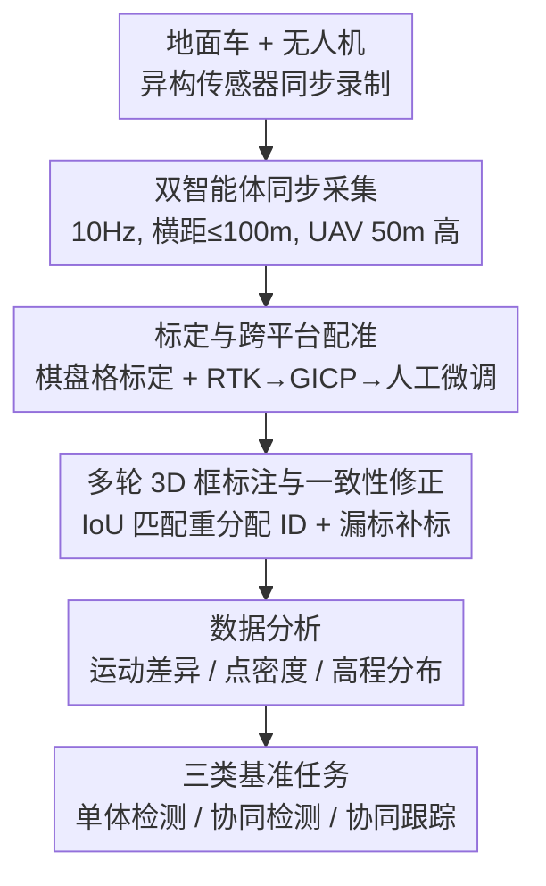

# V2U4Real: A Real-world Large-scale Dataset for Vehicle-to-UAV Cooperative Perception

**会议**: CVPR 2026  
**论文**: [CVF Open Access](https://openaccess.thecvf.com/content/CVPR2026/html/Li_V2U4Real_A_Real-world_Large-scale_Dataset_for_Vehicle-to-UAV_Cooperative_Perception_CVPR_2026_paper.html)  
**代码**: https://github.com/VjiaLi/V2U4Real  
**领域**: 自动驾驶 / 协同感知 / 3D 目标检测  
**关键词**: 车-无人机协同, V2U, 真实世界数据集, 3D 目标检测, 多智能体跟踪

## 一句话总结
V2U4Real 是首个面向「车-无人机（Vehicle-to-UAV, V2U）」协同感知的真实世界大规模多模态数据集，由一辆地面车和一架挂载多线 LiDAR + RGB 相机的无人机同步采集，提供 5.6 万帧 LiDAR、5.6 万张图像、70 万个手工标注 3D 框，并配套单体/协同 3D 检测与跟踪三类基准，实测证明引入无人机俯视视角能显著提升远距离与遮挡场景下的感知鲁棒性。

## 研究背景与动机
**领域现状**：自动驾驶里的协同感知主流是「车-车（V2V，如 OPV2V、V2V4Real）」和「车-基础设施（V2I，如 DAIR-V2X、V2X-Real）」两条范式。多个智能体共享传感信息，互相补盲，缓解单车视角下的遮挡、有限测距和传感器失效。

**现有痛点**：V2V 的所有视角都贴在地面，受地面级视野覆盖限制，遇到大范围遮挡（如复杂路口被前车整片挡住）仍然无能为力；V2I 虽然能装高处，但依赖昂贵的固定路侧设施，部署不灵活、覆盖有限。无人机（UAV）凭借俯视全局视角和高机动性，本可以补上这块盲区——这就是「车-无人机（V2U）」范式。

**核心矛盾**：V2U 看起来很美，但卡在两件事上。其一是**运动差异**：无人机有完整的 6 自由度运动（x、y、z 加 roll/pitch/yaw），帧间姿态抖动远大于地面车，导致空-地两侧 LiDAR 点云存在几何错配，坐标对齐和跨视角融合都更难。其二是**数据稀缺**：现有 UAV 相关数据集（CoP-UAVs、UAV3D、Griffin、AirV2X）几乎全是 CARLA/AirSim/SUMO 仿真合成的，缺乏真实姿态扰动、遮挡和动态交互；唯一真实的空-地数据集 CoPeD 又只提供语义标注、且偏静态低动态场景。

**本文目标**：填补「真实世界、大规模、多模态、带 3D 框标注」的 V2U 协同感知数据空白，并把它做成一个能直接跑基准的研究平台。

**切入角度**：用真车 + 真无人机各挂异构传感器实地采集，靠多轮人工标注 + 传感器标定 + 多源点云配准把空-地两侧的标注统一到同一坐标系，从而能真正验证「俯视协同到底能带来多大收益」。

**核心 idea**：建一个由地面车（ego）与无人机协同采集的真实多模态数据集，把无人机的俯视 LiDAR 点云融进地面车视角，用三类标准基准量化 V2U 协同对远距离/遮挡感知的提升。

## 方法详解
这是一篇数据集论文，所以「方法」= **数据怎么造出来 + 配套什么评测基准**。整条管线从双智能体同步采集原始数据，到传感器标定与跨平台点云配准，再到多轮人工 3D 框标注与跨传感器一致性修正，最后落到三类下游任务基准（单体检测 / 协同检测 / 协同跟踪）。

### 整体框架
输入是地面车与无人机两套异构传感器（多个 LiDAR + 多路相机 + RTK GPS/IMU）同步录制的原始流；输出是一个对齐到统一坐标系、带 70 万 3D 框与跨帧 ID 的多模态数据集，以及在其上定义好的检测/跟踪基准。中间经过四个阶段：①双智能体同步数据采集 → ②传感器标定 + 车-无人机点云配准 → ③多轮 3D 框标注 + 跨传感器 ID 一致性修正 → ④数据分布分析 + 基准任务定义。

### 关键设计

**1. V2U 真实异构采集平台：用真车+真无人机各挂多线 LiDAR 与相机，避开仿真数据的不真实**

针对「现有 UAV 数据集几乎全是仿真、缺真实姿态扰动和遮挡」这个痛点，作者搭了两台真实智能体：地面车（ego）装两颗机械旋转 LiDAR（OS-128、RS-128）+ 一颗固态 LiDAR（M1-Plus）+ 三路 RGB 相机（左/中/右），无人机（DJI M300 RTK）装一颗 OS-128 旋转 LiDAR + 一路下视相机，两边都配 1000Hz RTK GPS/IMU 做初始定位。采集时两台智能体同时运动、水平距离保持在 100 米内，无人机在离地 50 米飞行，并刻意变化两者的相对姿态 $(\theta_r, \theta_p, \theta_y)$ 以增强多视角协同的多样性。所有传感器以 10 Hz 在统一时间基准下录制，覆盖城市道路、乡村道路、校园道路三类场景，人工挑出 44 个最具代表性的片段（每段 30–80 秒），共约 5.62 万帧。异构传感器 + 真实动态场景，是它相对 CoPeD（只语义标注、低动态）的核心区别。

**2. 标定与跨平台点云配准：把空-地两套坐标系拧成一个，解决 6-DoF 抖动带来的几何错配**

无人机的 6 自由度运动让空-地点云天然错位，直接叠加会糊掉。作者分两步对齐：相机内参用棋盘格标定，LiDAR-相机外参靠每帧 5 对 2D-3D 对应点、最小化重投影误差求解；车-无人机两平台之间的 LiDAR 配准则先用 RTK 定位给初值，再用 GICP 精配准并辅以人工微调。坐标系上采用三套约定——各 LiDAR 局部系（X/Y/Z 对应前/左/上）、相机系（Z 为深度）、以及遵循 NED（北-东-下）的世界系。这样既保证了协同时空-地点云能精确叠到 ego 坐标系，又因为「3D 框在各 LiDAR 局部系里独立标注」，让每个传感器的数据也能单独拿去做单体感知任务。

**3. 多轮标注与跨传感器一致性修正：让同一物体在车端、无人机端拿到一致的 ID 与框**

数据用开源工具 SusTechPoint 标注 4 类目标（Car、Cyclist、Pedestrian、Truck），由两组专业标注员先初标、再精修，每个框含中心 $(x,y,z)$、尺寸 $(l,w,h)$、欧拉角 $(\text{roll},\text{pitch},\text{yaw})$，并跨时间戳赋一致 ID、记录运动速度以支持跟踪/预测。但「各 LiDAR 局部系独立标注」会带来两个隐患：同一物体在不同传感器里可能被赋不同 ID；某物体可能在一个传感器里标了、另一个里漏了。作者的修法是把所有点云和 3D 框先变换到 ego LiDAR 局部系，对来自不同传感器的框做 IoU 匹配（阈值随类别大小自适应），超过阈值就把不一致的 ID 重新对齐；同时把那些点数 > 5 却未被标注的实例补标，确保跨传感器标注一致。这一步是协同任务能成立的前提——否则协同检测的 ground truth 自己就打架。

**4. 三类基准与协同专用评测协议：把数据集变成能直接比较算法的平台**

光有数据不够，作者定义了三类任务并配齐评测协议。**单体 3D 检测**分车端、无人机端，各自用本机数据训练推理；评测范围 x∈[−100,100] m、y∈[−80,80] m，按 KITTI 惯例 Vehicle 用 AP@IoU=0.5/0.7、Cyclist 用 0.25/0.5。**协同 3D 检测**把无人机点云融进 ego 做检测，ground truth 取两端并集 $GT = GT_v \cup GT_u$（同一物体两端框有偏移时保留 ego 标注）；评测范围收窄到 x∈[−15,100] m 聚焦前向安全关键区，并引入 **Average MegaByte (AM)** 度量传输数据量，同时区分 **Sync**（忽略通信延迟）与 **Async**（模拟 0–1000 ms 延迟，取上一时刻 LiDAR 数据）两种设置。基准覆盖 No/Late/Early/Intermediate 四类融合策略，跑了 AttFuse、Where2comm、V2X-ViT、CoBEVT、CoAlign、ERMVP、DSRC 七个 SOTA。**协同 3D 跟踪**走 tracking-by-detection，用 AB3Dmot（3D 卡尔曼 + 匈牙利匹配）做 baseline，用 AMOTA/AMOTP/sAMOTA/MOTA/MOTP/MT/ML 七个指标评测。

## 实验关键数据

### 主实验：协同检测 vs. 单体（Vehicle 类，Sync/Async）
协同方法相对单体基线大幅领先，且 CoAlign 在同步/异步两种设置下都最稳。

| 方法 | Sync AP@0.5/0.7 | Async AP@0.5/0.7 | 50–100m Sync AP@0.5/0.7 | AM(MB) |
|------|------|------|------|------|
| Vehicle only (No Fusion) | 27.53/12.75 | 27.53/12.75 | 15.54/6.23 | 0 |
| UAV only (No Fusion) | 32.44/14.31 | 32.44/14.31 | 19.74/10.11 | 0 |
| Early Fusion | 51.31/30.97 | 30.94/13.99 | 24.47/14.99 | 3.18 |
| Late Fusion | 43.61/27.74 | 28.08/16.18 | 16.75/8.56 | 0.009 |
| Where2comm | 53.85/29.71 | 48.99/28.36 | 26.73/16.59 | 0.65 |
| **CoAlign** | **56.67/36.61** | **50.81/33.33** | 30.20/19.25 | 0.65 |
| DSRC | 54.64/31.77 | 47.63/26.05 | **33.26/20.63** | 0.65 |

关键发现：CoAlign 凭借空间错配缓解拿到整体最佳（Sync 56.67/36.61），对异步延迟也最鲁棒；而 DSRC 靠语义引导重建在 50–100m 远距离段反超（33.26/20.63），说明远距离收益由不同机制主导。引入通信延迟（Async）后所有协同方法都掉点，Early/Late Fusion 掉得最狠，中间特征融合方法更抗延迟。

### 单体检测：无人机端 vs. 车端
| 平台 | 方法 | Veh. AP@0.5 | Veh. AP@0.7 | Cyc. AP@0.25 | Cyc. AP@0.5 |
|------|------|------|------|------|------|
| Vehicle | PV-RCNN | 68.18 | 36.23 | 59.51 | 51.31 |
| UAV | PointPillars | 70.09 | 47.06 | 57.33 | 41.61 |
| UAV | PV-RCNN | **72.26** | **55.15** | 64.28 | 50.86 |

### 协同跟踪（Vehicle 类，节选）
| 方法 | AMOTA↑ | AMOTP↑ | MT↑ | ML↓ |
|------|------|------|------|------|
| Vehicle only | 11.73 | 25.84 | 34.13 | 52.38 |
| UAV only | 7.00 | 21.58 | 3.17 | 81.75 |
| **CoAlign** | **22.08** | **43.11** | 69.05 | 14.29 |
| DSRC | 18.67 | 39.72 | **73.02** | **13.49** |

### 关键发现
- **无人机端单体检测普遍强于车端**：Vehicle 类 AP@0.5/0.7 高出约 5%/20%，因为俯视视角遮挡少；但 Cyclist 这类小目标在俯视下点云稀疏，俯视反成「双刃剑」，精度反而吃亏。
- **协同把感知地平线推远**：跨智能体特征交换让 50–100m 远距离目标的 AP@0.5 相对 No Fusion 提升最多约 10%，直接验证了 V2U 引入俯视视角的核心价值。
- **运动差异是真实存在的难点**：车端 LiDAR 帧间 roll/pitch 抖动多在 $|\theta_r|,|\theta_p|\le 2^\circ$，无人机却高达 $\le 10^\circ$；点云高程分布上车端集中在自身高度（$\mu=-0.83,\sigma=1.35$），无人机点则分布在更高位置（$\mu=2.60,\sigma=2.32$），印证跨视角对齐的难度。

## 亮点与洞察
- **首个真实世界 V2U 多模态数据集**：在传感器、规模、动态性上都超过此前唯一真实空-地数据集 CoPeD（仅语义标注），56.2K 帧 / 70.28 万 3D 框是真金白银的工程量，填补了「真实 + 大规模 + 3D 框」的空白。
- **AM（Average MegaByte）传输度量很实用**：把「检测精度」和「通信带宽成本」放一张表里比，能直接看出 Late Fusion 几乎零带宽（0.009 MB）但精度低、中间融合 0.65 MB 换来更高精度的权衡，这种「精度-带宽」视角对落地协同感知很有指导意义。
- **Sync/Async 双设置贴近现实**：用「取上一时刻数据」模拟 0–1000ms 延迟，暴露出不同融合策略对时间错配的敏感度，比只在理想同步下刷分更有说服力。
- **可迁移思路**：「先 RTK 给初值再 GICP 精配准 + 人工微调」的跨平台点云对齐流程，以及「变换到统一坐标系后做 IoU 匹配修 ID/补漏标」的跨传感器标注一致性方案，可直接复用到任何多智能体异构感知数据集的构建上。

## 局限与展望
- **规模相对仿真集仍偏小**：56.2K 帧、44 个片段，虽是真实数据中规模领先，但相比 UAV3D（500K）等仿真集在多样性上仍有差距；场景集中在城市/乡村/校园三类，天气、光照、夜间等条件覆盖未见展开。
- **单机一无人机配置**：只有一辆车 + 一架无人机的两智能体协同，未涉及多车多机的大规模编队协同，泛化到更复杂拓扑还需扩展。
- **正文只报 val 集 + OS-128**：主实验在验证集、单一传感器（OS-128）上评测，test 集与其它传感器结果都放在补充材料，正文可比性受限。
- **未提出新算法**：论文定位是数据集与基准，benchmark 全用现成 SOTA，没有针对 V2U 运动差异专门设计的融合方法——这恰是它留给后续工作的明确切入点（如显式建模 6-DoF 抖动的跨视角对齐）。

## 相关工作与启发
- **vs V2V4Real / OPV2V（V2V 范式）**：它们都是地面车-车协同，视角全贴地面，受地面级覆盖限制；V2U4Real 引入无人机俯视，能补大范围遮挡和远距离盲区，这是 V2V 范式做不到的。
- **vs DAIR-V2X / V2X-Real（V2I 范式）**：V2I 靠固定路侧设施，成本高、覆盖固定；V2U 用机动无人机替代固定基础设施，部署灵活、覆盖可动，但代价是要处理无人机的 6-DoF 抖动。
- **vs CoPeD（真实空-地）**：CoPeD 是先前唯一真实空-地协同数据集，但只有语义标注、偏静态低动态；V2U4Real 提供 3D 框 + 跟踪 ID、覆盖高动态交通场景、用异构传感器，更贴近真实复杂交通。
- **vs AirV2X / Griffin（仿真 V2U）**：它们也探索 V2U，但主要是仿真、相机为主、通信/定位理想化；V2U4Real 用真实多模态采集，暴露了仿真里被简化掉的真实姿态扰动与对齐难题。

## 评分
- 新颖性: ⭐⭐⭐⭐⭐ 首个真实世界 V2U 协同感知多模态数据集，开辟了「车-无人机」这一新协同范式的实证基础。
- 实验充分度: ⭐⭐⭐⭐ 三类任务、七个 SOTA、Sync/Async 双设置 + AM 带宽度量做得扎实，但正文只报 val/OS-128，test 与其它传感器外放补充材料。
- 写作质量: ⭐⭐⭐⭐ 数据构建流程（采集→标定配准→标注一致性）讲得清晰，运动差异/点密度/高程的数据分析有说服力。
- 价值: ⭐⭐⭐⭐⭐ 填补真实 V2U 数据空白，配齐基准与代码，对协同感知社区是高复用的基础设施。

<!-- RELATED:START -->

## 相关论文

- [\[CVPR 2026\] SearchAD: Large-Scale Rare Image Retrieval Dataset for Autonomous Driving](searchad_large-scale_rare_image_retrieval_dataset_for_autonomous_driving.md)
- [\[NeurIPS 2025\] UrbanIng-V2X: A Large-Scale Multi-Vehicle Multi-Infrastructure Dataset Across Multiple Intersections for Cooperative Perception](../../NeurIPS2025/autonomous_driving/urbaning-v2x_a_large-scale_multi-vehicle_multi-infrastructure_dataset_across_mul.md)
- [\[CVPR 2026\] Ghost-FWL: A Large-Scale Full-Waveform LiDAR Dataset for Ghost Detection and Removal](ghost-fwl_a_large-scale_full-waveform_lidar_dataset_for_ghost_detection_and_remo.md)
- [\[CVPR 2026\] Real-World On-Vehicle Evaluation of Embedding-Based Anomaly Detection](real-world_on-vehicle_evaluation_of_embedding-based_anomaly_detection.md)
- [\[CVPR 2026\] SimScale: Learning to Drive via Real-World Simulation at Scale](simscale_learning_to_drive_via_real-world_simulation_at_scale.md)

<!-- RELATED:END -->
