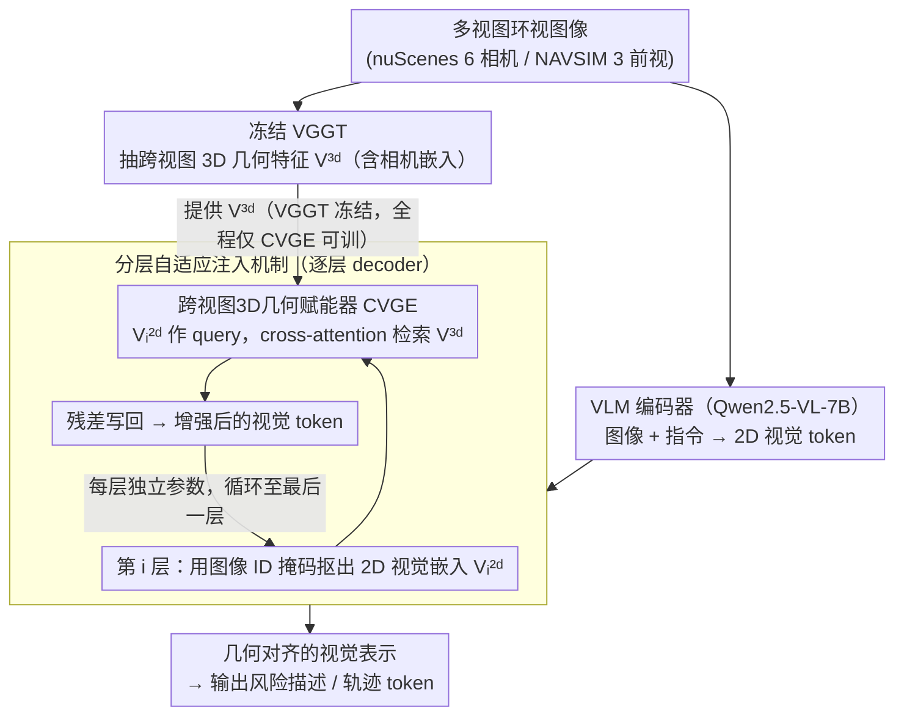

# VGGDrive: Empowering Vision-Language Models with Cross-View Geometric Grounding for Autonomous Driving

**会议**: CVPR 2026  
**arXiv**: [2602.20794](https://arxiv.org/abs/2602.20794)  
**代码**: [https://github.com/WJ-CV/VGGDrive](https://github.com/WJ-CV/VGGDrive)  
**领域**:自动驾驶
**关键词**: 自动驾驶, 3D几何感知, VLM, VGGT, 跨视图

## 一句话总结
提出VGGDrive框架，通过冻结的3D视觉基础模型VGGT为VLM注入跨视图几何感知能力，设计插拔式CVGE模块分层自适应地将3D特征注入VLM各层的2D视觉嵌入中，在五个自动驾驶基准上实现显著性能提升。

## 研究背景与动机
**领域现状**：VLM凭借丰富的世界知识和推理能力，为自动驾驶系统提供了强大的场景理解和决策支持，VLA（Vision-Language-Action）模型成为当前研究热点。

**现有痛点**：VLM天然缺乏对3D物理世界的跨视图几何建模能力，这直接限制了其在需要精细空间感知的自动驾驶任务中的表现（如Qwen2.5-VL在驾驶任务上表现平庸）。

**核心矛盾**：一些方法尝试通过构造QA数据来教VLM空间概念，但无法从根本上赋予模型几何先验；另一些方法在VLM上添加独立的动作解码器来预测轨迹，但割裂了场景理解与决策。

**本文目标** 如何有效地将成熟3D基础模型（VGGT）的跨视图几何建模能力注入VLM，弥补其固有缺陷。

**切入角度**：与其教VLM理解空间，不如直接将VGGT的3D几何特征深度融入VLM的2D视觉表示中，通过分层注入而非简单拼接/相加来实现深度赋能。

**核心 idea**：通过分层自适应注入机制将冻结VGGT的3D特征逐层融入VLM的2D视觉嵌入，建立真正的几何基础。

## 方法详解

### 整体框架
VGGDrive要解决的是一个很具体的缺口：VLM（这里用Qwen2.5-VL-7B）有丰富的世界知识和语言推理，但天生不会做跨视图的3D几何建模，而开车恰恰最需要这种空间感。它的思路是借力一个已经训好的3D视觉基础模型VGGT，把后者的几何特征"喂"进VLM。整条pipeline这样转：多视图环视图像（nuScenes用6个相机、NAVSIM用3个前视）先进VGGT，一次性得到带相机信息的3D几何特征 $V^{3d}$；同样这批图像也进VLM被编码成2D视觉token；接下来在VLM每一层decoder里，都用一个跨视图3D几何赋能器（CVGE）让2D token去"问"3D特征、把对自己有用的几何信息拉回来并残差回写；最终VLM以一个几何上更扎实的视觉表示输出文本推理或轨迹。

### 关键设计

**1. 分层自适应注入机制：每层decoder单独决定要补多少3D信息**

如果只在VLM输入端拼一次3D特征，后面几十层decoder会逐渐把这点几何信息稀释掉——这正是简单集成方案改进有限的原因。VGGDrive的做法是把注入"摊开"到每一层：先用冻结的VGGT抽出 $V^{3d}$（保留相机嵌入和注册嵌入，确保跨视图的对应关系不丢），然后解耦LLM的decoder堆叠，在第 $i$ 层用图像ID位置掩码 $M_{id}^{img}$ 把属于视觉部分的2D嵌入 $V_i^{2d}$ 单独抠出来，送进该层的CVGE得到增强后的几何嵌入 $V_i^{3d}$，再以残差方式写回原视觉token：

$$x_i = X_i + X_i'$$

> ⚠️ 残差与各嵌入的精确符号以原文为准。

关键在于每一层的CVGE虽然结构相同，参数却彼此独立。浅层token更偏纹理、深层token更偏语义，对3D几何的需求本就不一样；让每层自己学一套注入权重，等于把"该补哪种几何信息、补多强"这件事交给每层自适应决定，而不是全局一刀切。

**2. 跨视图3D几何赋能器（CVGE）：让2D token主动去查询3D特征**

把3D特征直接拼接或相加到2D token上（论文里的VGGT-Dist、VGGT-Add两个对照）有个根本问题——VLM并不知道这些外来维度对应空间里的什么，只能被动接收，往往用不起来甚至被干扰。CVGE改成一种可学习的跨模态交互：以2D视觉嵌入 $V_i^{2d}$ 作为query，去 $V^{3d}$ 里用cross-attention检索并整合跨视图的几何线索，等于让VLM"带着问题"主动从3D表示中挖自己当前最需要的那部分。正是这种深层交互，才把简单相加做不到的"真正的几何基础"建立起来——消融里VGGT-Add甚至在部分指标上掉点，反衬出主动查询的必要性。

**3. 插拔式、只训CVGE：保住两个预训练模型的能力**

VGGT和VLM都是各自领域里调好的强模型，硬去联合微调既贵又容易破坏已有能力。VGGDrive让VGGT全程冻结、VLM主干也不动，唯一训练的就是插在各层之间的CVGE。这样CVGE成了一个可拔插的适配层：它只学"怎么把3D特征翻译成VLM听得懂的视觉增量"，迁移到别的VLM或别的任务时改动面很小，也避免了大模型微调带来的灾难性遗忘风险。

### 一个完整示例：一帧6相机输入怎么被注入几何

以nuScenes一帧6路环视图像为例，跟着数据走一遍：

1. 6张图先进冻结的VGGT，输出一份跨视图3D几何特征 $V^{3d}$——里面已经把6个相机之间的视角对应关系编码好了（含相机嵌入）。
2. 同一帧图也进VLM，连同文本指令被编码成一串token，其中视觉部分混在序列里。
3. 进入decoder第1层：用 $M_{id}^{img}$ 把这层的视觉token $V_1^{2d}$ 挑出来，送进第1层CVGE，让它们去 $V^{3d}$ 里query，拉回这层"想要"的几何增量，残差写回。
4. 第2层、第3层……每层重复这个动作，但用的是各自独立的CVGE参数——浅层可能多补一些跨视图对应关系，深层多补一些与决策相关的空间语义。
5. 走完所有层后，VLM拿到的已是一个几何上对齐的视觉表示，再据此输出风险描述或轨迹token。

画面上就是：同一份3D特征被反复"取用"几十次，每层各取所需，而不是开头塞一次就指望它撑到底。

### 训练策略
只优化CVGE的参数，用标准交叉熵损失；轨迹规划任务额外把ego状态和导航命令作为文本一并输入。

## 实验关键数据

### 主实验——NAVSIM轨迹规划

| 方法 | Base Model | PDMS↑ | NC↑ | DAC↑ | EP↑ |
|------|-----------|-------|-----|------|-----|
| Baseline (Qwen2.5-VL) | 7B | 86.04 | 97.83 | 94.08 | 81.00 |
| VGGT-Dist | 7B | 86.68 | 97.84 | 94.81 | 81.30 |
| VGGT-Add | 7B | 86.10 | 97.81 | 94.07 | 80.84 |
| **VGGDrive** | **7B** | **88.76** | **98.55** | **96.30** | **82.92** |
| DiffusionDrive (E2E SOTA) | - | 88.10 | 98.20 | 96.20 | 82.20 |

### 主实验——NuInstruct跨视图风险感知

| 方法 | MAE↓ | Accuracy↑ | MAP↑ | BLEU↑ |
|------|------|-----------|------|-------|
| Baseline | 4.35 | 47.71 | 6.15 | 75.75 |
| VGGT-Dist | 3.73 | 56.21 | 28.51 | 79.23 |
| **VGGDrive** | **3.08** | **56.37** | **37.49** | **81.13** |

### 消融实验——DriveLM

| 方法 | Accuracy↑ | Match↑ | Average↑ |
|------|-----------|--------|----------|
| Baseline | 64.35 | 34.54 | 54.59 |
| VGGDrive | **77.50** | **49.77** | **61.26** |

### 关键发现
- VGGDrive在五个基准上全面超越baseline和简单集成方案，NAVSIM上PDMS达到88.76，超越大部分使用LiDAR的端到端方法
- 跨视图风险感知指标MAP提升最大（6.15→37.49），表明3D几何特征对空间感知帮助最大
- 简单的VGGT-Dist和VGGT-Add集成方案改进有限（甚至VGGT-Add在某些指标上降低），验证了深层融合的必要性

## 亮点与洞察
- **3D基础模型赋能VLM的新范式**：不同于用数据教VLM空间概念或加独立解码头，本文开创性地利用冻结3D基础模型直接赋能VLM，思路新颖且通用性强
- **分层自适应注入设计**：认识到VLM各层对3D信息的需求不同，每层用独立参数的CVGE模块自适应提取信息，比全局统一注入更优
- **跨视图MAP指标飙升**：6.15→37.49的提升说明3D几何grounding从根本上改变了VLM的空间感知能力

## 局限与展望
- 目前仅在Qwen2.5-VL-7B上验证，未测试更大规模VLM或其他VLM家族的泛化性
- VGGT全程冻结，未探索联合微调或渐进式解冻策略
- 轨迹预测直接用VLM文本输出，精度受限于token化的分辨率，未来可结合专用轨迹解码头
- CVGE增加了额外参数和计算开销，对实际部署的延迟影响需要评估

## 相关工作与启发
- **vs VGGT-Dist/VGGT-Add**：简单的蒸馏或相加集成方案只在最终层或浅层融合3D特征，VGGDrive通过分层深度注入大幅超越
- **vs CarLLaVA/AdaThinkDrive等VLA方法**：其他VLA方法依赖QA数据或独立解码器，VGGDrive通过3D模型赋能从根本上提升空间感知

## 评分
- 新颖性: ⭐⭐⭐⭐ 3D基础模型赋能VLM用于自动驾驶是新颖的范式
- 实验充分度: ⭐⭐⭐⭐⭐ 五个基准全面评估，消融充分
- 写作质量: ⭐⭐⭐⭐ 动机清晰，图表丰富
- 价值: ⭐⭐⭐⭐ 为3D+VLM驾驶系统指明了有效方向

<!-- RELATED:START -->

## 相关论文

- [\[CVPR 2026\] Learning Vision-Language-Action World Models for Autonomous Driving](vla_world_learning_vision_language_action_world_models_for_autonomous_driving.md)
- [\[CVPR 2026\] DriveVLN: Towards Mapless Vision-and-Language Navigation in Autonomous Driving](drivevln_towards_mapless_vision-and-language_navigation_in_autonomous_driving.md)
- [\[CVPR 2026\] DriveMoE: Mixture-of-Experts for Vision-Language-Action Model in End-to-End Autonomous Driving](drivemoe_mixture-of-experts_for_vision-language-action_model_in_end-to-end_auton.md)
- [\[CVPR 2026\] EventDrive: Event Cameras for Vision-Language Driving Intelligence](eventdrive_event_cameras_for_vision-language_driving_intelligence.md)
- [\[CVPR 2026\] HybridDriveVLA: Vision-Language-Action Model with Visual CoT reasoning and ToT Evaluation for Autonomous Driving](hybriddrivevla_vision-language-action_model_with_visual_cot_reasoning.md)

<!-- RELATED:END -->
