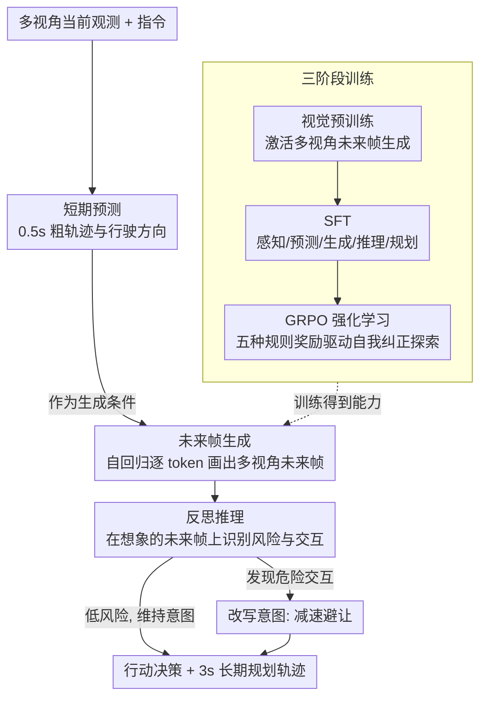

# Learning Vision-Language-Action World Models for Autonomous Driving

**会议**: CVPR 2026  
**arXiv**: [2604.09059](https://arxiv.org/abs/2604.09059)  
**代码**: [https://vlaworld.github.io](https://vlaworld.github.io)  
**领域**: 自动驾驶  
**关键词**: VLA模型, 世界模型, 自动驾驶, 反思推理, 强化学习

## 一句话总结

VLA-World将世界模型的预测想象与VLA模型的反思推理统一到一个框架中，通过生成未来帧并对其进行推理来改进轨迹规划，实现了最低的碰撞率和FID分数。

## 研究背景与动机

**领域现状**：端到端自动驾驶存在两大范式——VLA模型（统一感知、推理、控制但缺乏时空建模）和世界模型（预测环境演变但无法推理或评估想象的未来）。

**现有痛点**：VLA模型缺乏对动态交通参与者的显式运动建模，仅关注自车轨迹，无法预测复杂场景的演变。世界模型依赖大规模视觉数据学习先验分布，但无法捕捉因果关系，只是模拟而非理解世界。

**核心矛盾**：预测未来的能力（世界模型的优势）与理解和评估未来的能力（VLA的优势）被分割在两个独立框架中。

**本文目标**：构建一个既能想象未来场景又能对想象的未来进行反思推理的统一自动驾驶框架。

**切入角度**：类比人类驾驶——巡航时依赖直觉想象，但遇到行人突然横穿时立即切换到反思推理模式。

**核心idea**：先用短期预测轨迹引导生成未来帧，再对自己生成的未来帧进行推理以优化最终轨迹，形成"想象-反思"闭环。

## 方法详解

### 整体框架

VLA-World 想解决的是一个范式割裂问题：世界模型能预测未来画面却不会评估它，VLA 模型会推理却不显式建模动态环境的演变。作者的做法是让同一个模型先"想象"再"反思"——感知当前多视角观测后，先做一次短期预测（0.5s 的粗轨迹与行驶方向），用它作为条件引导生成未来帧图像；拿到这张想象出来的未来帧后，模型再回头审视它、识别其中的风险与交互，最后才输出行动决策与 3s 的长期规划轨迹。整个模型按视觉预训练、监督微调、GRPO 强化学习三个阶段依次训练，让它先学会生成多视角未来帧、再学会在帧上推理、最后学会自我纠正地探索更优规划。

### 关键设计

**1. 视觉预训练：先把"会生成多视角未来帧"这件事打底**

VLA 模型本身只有理解能力，没有生成未来画面的能力，而后面的反思推理又必须建立在一张可信的未来帧之上，所以第一步要先把视觉生成能力激活出来。给定多视角图像和指令，模型以自回归 next-token 的方式逐 token 预测下一帧的视觉 token 序列：

$$P(Q_{t+1}^k) = \prod_i P_\theta(q_i^k \mid q_{<i}^k, h_t, L)$$

其中视觉 token 由 VQGAN 编解码器负责离散化与重建。关键区别在于，FSDrive 这类前作只生成前视图，而 VLA-World 在预训练阶段就显式强制多个视角 $k$ 之间的一致性——因为只有四面八方的未来都自洽，后面基于未来帧做的全方位安全评估才站得住脚。这一阶段为下游的 SFT 和 RL 奠定了一个多视角、目标条件的世界模型底座。

**2. 用想象的未来帧来"思考"：把生成结果从输出端搬到输入端**

多数世界模型把生成的未来帧当成一个附带的输出展示，但 VLA-World 反过来把它当作推理的输入——相当于让模型在草稿纸上先把未来画出来，再盯着这张草稿做判断。生成模块产出未来帧 $\hat{x}_{t+1}$ 后，反思模块会分析帧里的显著实体、运动线索和潜在交互，据此评估环境风险并修正自己即将采取的行为：

$$\tilde{\tau}_{t:t+H} = f_{ref}(o_{1:t}, \hat{x}_{t+1}, \hat{\tau}_{t:t+1})$$

之所以有效，是因为短期预测出来的未来帧天然就编码了丰富的时空信息——自车要往哪走、周围行人车辆下一刻会怎么动，都已经"画"在帧里了，比起让模型凭抽象的中间特征空想，盯着一张具体的未来画面来推理要可靠得多。

**3. GRPO 强化学习：从"照着 SFT 模式走"逼出"自己探索更优解"**

SFT 只能让模型复刻训练数据里见过的推理模式，遇到没见过的场景容易卡死在次优策略上。作者用 GRPO 算法做强化学习，设计了五种基于规则的奖励覆盖整条 pipeline：格式奖励 $R_{fmt}$ 保证输出能被解析；短期预测奖励 $R_{pred}$ 约束 0.5s 轨迹的准确性；视觉约束奖励 $R_{vis}$ 检查生成的 token 数量与 codebook 有效性，防止生成跑偏；动作奖励 $R_{act}$ 用 F1 分数评估离散行为决策；轨迹奖励 $R_{traj}$ 同时考核精度与运动学一致性。五个奖励各管一段、互不替代，于是模型在自我纠正的迭代里从"跟随"转向"探索"，逐步逼出比 SFT 模式更优的规划。

### 一个完整示例

设想自车正以巡航状态前进，某帧观测里一名行人站在右前方人行道边缘。模型先做短期预测，给出未来 0.5s 自车继续直行、略微右偏的粗轨迹与方向；以此为条件，生成模块画出 0.5s 后的多视角未来帧——在这张想象的帧里，行人已经迈步踏入车道。反思模块拿到这张帧后，识别出"行人横穿、与自车轨迹相交"这一高风险交互，于是把原本直行的意图改写为减速避让，输出对应的行动决策，并据此重新规划接下来 3s 的长期轨迹。整个过程正对应人类驾驶的双系统：巡航时靠直觉想象，一旦想象的未来里出现危险信号，立刻切到反思推理来纠正。

### 损失函数 / 训练策略

三阶段训练：(1) 大规模图像-指令数据集预训练，激活多视角生成；(2) 多任务混合数据集 SFT，覆盖感知/预测/生成/推理/规划五类任务；(3) GRPO 强化学习，最终奖励为五项的加权组合：

$$R_{all} = \lambda_{fmt} R_{fmt} + \lambda_{pred} R_{pred} + \lambda_{vis} R_{vis} + \lambda_{act} R_{act} + \lambda_{traj} R_{traj}$$

## 实验关键数据

### 主实验

| 方法 | L2 1s↓ | L2 3s↓ | 碰撞1s↓ | 碰撞3s↓ | LLM |
|------|--------|--------|---------|---------|-----|
| VAD* | 0.17 | 0.60 | 0.04 | 0.67 | 无 |
| BEV-Planner* | 0.16 | 0.57 | 0.00 | 0.73 | 无 |
| DriveVLM | 0.15 | 0.38 | 0.05 | 0.54 | 7B |
| VLA-World (ours) | 最优 | 最优 | 最优 | 最优 | 7B |

### 消融实验

| 配置 | 关键指标 | 说明 |
|------|---------|------|
| 无世界模型 | 碰撞率高 | 缺乏未来想象能力 |
| 无反思推理 | 轨迹质量低 | 仅模拟不理解 |
| 无RL | 性能次优 | 受限于SFT模式 |
| 完整VLA-World | 最优 | 想象+推理+RL三者协同 |

### 关键发现

- 想象未来帧的能力与反思推理的结合是关键——单独的世界模型或VLA都无法达到同等性能
- RL阶段的五种奖励函数各有不可替代的作用，格式奖励确保输出可解析，轨迹奖励确保运动学一致性
- 多视角预训练是必要的，单视角生成无法支持全方位的安全评估

## 亮点与洞察

- **"先想象后反思"范式**：类比人类驾驶的直觉+反思双系统，将世界模型的输出作为推理的"草稿纸"，是一种优雅的架构设计
- **多视角一致的未来帧生成**：超越FSDrive的单前视图限制，确保从任何视角都能产生一致的未来预测
- **GRPO的精细奖励设计**：覆盖从格式到运动学的全pipeline，确保RL不会以某个维度为代价优化另一个维度

## 局限与展望

- nuScenes数据集规模有限，nuScenes-GR-20K可能不足以覆盖长尾驾驶场景
- 生成未来帧引入额外计算开销，实时性可能受限
- 仅在nuScenes上验证，未在更大规模或更具挑战性的数据集上测试

## 相关工作与启发

- **vs FSDrive**: 本文扩展为多视角世界模型，并增加了RL阶段进行推理知识探索
- **vs DriveMoE**: DriveMoE用MoE处理多样场景，VLA-World用想象+反思处理安全性

## 评分

- 新颖性: ⭐⭐⭐⭐ 世界模型+VLA的统一范式思路新颖
- 实验充分度: ⭐⭐⭐⭐ 在两种评估协议下全面比较
- 写作质量: ⭐⭐⭐⭐ 动机清晰，人类驾驶类比恰当
- 价值: ⭐⭐⭐⭐ 为自动驾驶开辟了想象-推理一体化新范式

<!-- RELATED:START -->

## 相关论文

- [\[CVPR 2026\] Drive My Way: Preference Alignment of Vision-Language-Action Model for Personalized Driving](drive_my_way_preference_alignment_of_vision-language-action_model_for_personaliz.md)
- [\[CVPR 2026\] DriveMoE: Mixture-of-Experts for Vision-Language-Action Model in End-to-End Autonomous Driving](drivemoe_mixture-of-experts_for_vision-language-action_model_in_end-to-end_auton.md)
- [\[CVPR 2026\] NoRD: A Data-Efficient Vision-Language-Action Model that Drives without Reasoning](nord_a_data-efficient_vision-language-action_model_that_drives_without_reasoning.md)
- [\[CVPR 2026\] HybridDriveVLA: Vision-Language-Action Model with Visual CoT reasoning and ToT Evaluation for Autonomous Driving](hybriddrivevla_vision-language-action_model_with_visual_cot_reasoning.md)
- [\[CVPR 2026\] Unifying Language-Action Understanding and Generation for Autonomous Driving](unifying_language-action_understanding_and_generation_for_autonomous_driving.md)

<!-- RELATED:END -->
