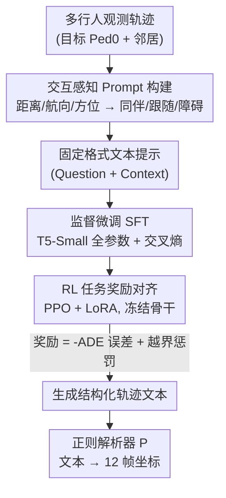

# W2W: Language-Model-Based Trajectory Prediction with Reinforcement Learning

**会议**: CVPR 2026  
**论文**: [CVF Open Access](https://openaccess.thecvf.com/content/CVPR2026/html/Xu_W2W_Language-Model-Based_Trajectory_Prediction_with_Reinforcement_Learning_CVPR_2026_paper.html)  
**代码**: https://github.com/VoyagerXu21/W2W  
**领域**: 自动驾驶 / 行人轨迹预测  
**关键词**: 轨迹预测, 语言模型, 强化学习, PPO, 场景合规

## 一句话总结
把行人轨迹预测改写成「可解析的语言生成」任务：先把多行人坐标和交互关系（同伴/跟随/障碍）翻译成固定格式文本提示，用 T5-Small 做全参数 SFT 学会输出格式，再用 PPO+LoRA 以「ADE 误差 + 越界惩罚」为奖励做强化学习对齐，在 ETH/UCY 和 SDD 上做到与近期 LM-based 及深度学习基线相当的 ADE/FDE，同时保留语言模型的可解释性。

## 研究背景与动机

**领域现状**：行人轨迹预测是自动驾驶、社交机器人等系统的关键模块——给定过去若干帧的观测轨迹，预测未来一段时间的运动。主流做法分两类：基于规则的方法（社会力、速度模型）可解释但难以应对真实场景的复杂性；数据驱动的深度学习方法（RNN、attention、GAT/GCN、GAN/CVAE、扩散模型）精度高，但本质是黑盒，缺乏可解释性，在安全攸关场景里难落地。最近一类工作把预训练语言模型（LM）引入轨迹预测：LMTraj 第一个用预训练 LM 做行人轨迹预测，GUIDE-CoT 在其上加了目标点模块，输出是自然语言文本，天然带可解释性，还能借用 LM 在数学、运动序列上的先验。

**现有痛点**：现有 LM-based 方法有两个具体毛病。其一是**目标函数错位**：它们把轨迹文本化后只做交叉熵监督微调，优化的是「文本的似然」，而真正在乎的指标是 ADE/FDE（预测点和真值的 L2 距离）和场景合规性——这两者并不能由 token-level 交叉熵直接优化，导致精度被拖累。其二是**交互语义没显式表达 + 场景描述过于简陋**：它们的文本输入主要是离散化的轨迹坐标点 + 行人 ID，没有把「谁是谁的同伴、谁在跟随、谁是障碍」这类社交语义写进去；而把整个场景压成一句自然语言又会拉长 token 序列、稀释观测信号，反而掉点，所以也很难施加真正的场景约束。

**核心矛盾**：轨迹预测真正要最小化的是 L2 距离这类**不可微的度量**（文本要先确定性地解析回坐标才能算 ADE、才能查越界），而 LM 的训练范式只会优化可微的 token 似然——两者天生对不齐。

**本文目标**：(1) 让交互语义在输入里被显式、可解析地表达出来；(2) 让训练目标直接对齐 ADE 精度和场景合规，而不是停留在 token 似然。

**核心 idea**：用「行为驱动的可解析文本表示 + 两阶段 SFT→RL 训练」来弥合这个错位——SFT 负责教模型「怎么答」（学格式与交互语义），RL 负责教模型「怎么走」（用程序化任务奖励直接优化精度和越界约束）。作者把方法命名为 Write-to-Walk（W2W）。

## 方法详解

### 整体框架

W2W 把行人轨迹预测彻底重写成一个序列到序列（Seq2Seq）的**文本生成**问题。形式化地，预测过程被表达为

$$\hat{S}_{pred} = P\big(f_{\theta^\star}(M(F(S_{obs}),\, H(S_{obs}, S_{nb})))\big)$$

其中 $F$ 把观测轨迹转成自然语言文本，$H$ 是基于距离/航向线索的交互分类器，$M$ 是结构化提示模板，$f_{\theta^\star}$ 是经 SFT 和 RL 对齐后的 T5 策略，$P$ 是把生成文本确定性解析回坐标的正则解析器。和过去直接用 RNN/图网络/Transformer 回归坐标 $\hat{S}_{pred} = g_{\theta^\star}(S_{obs}, S_{nb}, U_s)$ 的数值回归范式完全不同。

整条 pipeline 分三个阶段：**① 交互感知 prompt 构建**——把目标行人（固定 ID=0）的 8 帧观测和邻居的交互语义写进固定模板，括号/分隔符统一以保证「文本↔坐标」一一可逆解析；**② SFT**——以 T5-Small 为骨干做全参数监督微调，用交叉熵教模型从「问题/上下文」生成「答案（未来 12 帧坐标序列）」，确保输出严格可解析；**③ RL+LoRA 对齐**——冻结 T5-Small 骨干、只更新 LoRA adapter，用一个「ADE 误差 + 二值语义掩码越界惩罚」组成的程序化奖励，通过 PPO 把策略对齐到轨迹精度和不越界上。

### 关键设计

**1. 行为驱动的交互感知 prompt 构建：把社交语义显式写进文本，且保证可逆解析**

这一步针对「交互语义没显式表达、解析不可靠」的痛点。作者不直接喂一堆坐标点，而是为每个 clip 选定目标行人（固定 ID=0），取它 8 帧观测，再枚举同一时间窗内的所有邻居，由「交互模块」用纯可解释的物理量去判定交互类型。具体计算每对「目标—邻居」的起始/终止/最小距离 $d_{init}, d_{final}, d_{max}$、全局与终端航向差 $\Delta\theta_{global}, \Delta\theta_{Final}$、相对方位角 $\phi_{final}$，并用距离加权的航向一致性得分 $\Delta\theta_{fused} = w\cdot\Delta\theta_{Final} + (1-w)\cdot\Delta\theta_{global}$ 来融合判定，只保留三类对预测有用的语义：

- **同伴（Companion）**：长期近距离 + 航向对齐 + 并肩方位，即 $d_{max} < d_c$ 且 $\Delta\theta_{fused} < \tau_{Align}$ 且 $\phi_{final} < \pi/4$；
- **障碍（Obstacle）**：由远快速逼近 + 明显转向 + 大相对方位，即 $d_{init} > d_{far}$ 且 $d_{final} < d_{near}$ 且 $\Delta\theta_{fused} \geq \tau_{turn}$ 且 $\phi_{final} > \pi/3$；
- **跟随（Following）**：终端距离落在跟随带内 + 航向对齐 + 处于邻居后扇区，即 $d_{final} \in [d_{fmin}, d_{fmax}]$ 且 $\Delta\theta_{fused} < \tau_{align}$ 且 $|\pi - \phi_{final}| < \pi/6$。

不满足任何语义的「目标—邻居」对被标为无关/未知并丢弃、不写进 prompt。最后把目标的观测坐标 + 保留下来的交互描述序列化进固定模板（如「Pedestrian 1 is a companion/obstacle of pedestrian 0」）。这样做的好处是：判定只依赖距离、方位、航向这些可解释量，不需要昂贵的语义图或外部标注，跨场景可复现；同时统一括号与分隔符，配合固定语法正则解析器，保证文本和坐标严格一一对应。相比 LMTraj 只丢坐标点 + ID，显式写出社交语义能更有效地激活预训练 LM 关于「避障/跟随/同行」的运动先验。

**2. 全参数监督微调（SFT）：先让模型学会「怎么答」，保证输出严格可解析**

这一步是 RL 的前置，针对「输出不可解析则后续奖励无从计算」的问题。作者用 T5-Small 编码器—解码器，端到端全参数微调学映射 $f_\theta: x \to y$，把带交互描述的语言 prompt $x$（question/context）映射成编码未来坐标的结构化文本 $y$（answer）。训练目标是带 teacher forcing 的 token-level 交叉熵（负对数似然）：

$$L_{SFT} = -\sum_t \log p_\theta(y_t \mid y_{<t}, x)$$

输出遵循固定语法模板（括号、逗号、长度约束），从而能确定性地从文本解析回坐标。评测时把生成文本解析回坐标报 ADE/FDE，ROUGE 等文本指标只作格式/可读性的辅助检查。SFT 的意义在于：预训练 T5-Small 直接上手这个任务时 FER（格式执行率，即能被解析成恰好 12 个坐标的文本比例）几乎为 0（生成的是乱码 token），而 SFT 把 FER 拉到接近 100%，产出稳定可解析的结构化文本，才能供下游奖励计算与 RL 优化。

**3. 基于任务奖励的 RL+LoRA 对齐：用 PPO 直接优化不可微的精度与越界约束**

这是 W2W 的核心创新，针对「目标函数错位」这一根本矛盾。交叉熵 SFT 只学会了合规的轨迹文本，但 ADE 和越界惩罚相对于 token 是**不可微**的（文本要先确定性解析成坐标才能算），所以作者引入第二阶段：从 SFT 模型出发，冻结 T5-Small 骨干、只更新 LoRA adapter，用 PPO 优化一个程序化任务奖励。奖励由两项构成。**精度项**用负 ADE：

$$r_{L2} = -\lambda_{L2}\,\frac{1}{T}\sum_{t=1}^{T} \|\hat{\tau}_t - \tau^\star_t\|_2$$

**场景合规项**查询二值掩码 $M_{scene}(\cdot)\in\{0,1\}$（1 表示不可行驶区），对落入不可行驶区的预测点逐步累计惩罚：

$$r_{occ} = -\lambda_{occ}\sum_{t=1}^{T} \mathbf{1}[M_{scene}(\hat{\tau}_t)=1]$$

任务奖励是两者之和 $r(x,\hat{y}) = r_{L2} + r_{occ}$。逐步奖励还叠加了一个对参考策略（SFT 模型）的 token 级 KL 截断项，只在末步发放任务奖励：$r^{step}_t = -\beta[\mathrm{KL}_t(\pi_\theta\|\pi_{ref})]^{\delta}_+ + \mathbf{1}[t=T_y]\,r(x,\hat{y})$，其中 $[\cdot]^{\delta}_+ = \min(\max(\cdot,0),\delta)$ 取正部并截断。再用 GAE 算 token 级优势 $A_t$，用裁剪 PPO 优化策略。这里设计的精妙之处有两点：一是把场景约束放到**优化目标**里而非塞进 prompt（避免冗长文本稀释观测信号，这正是 LMTraj 把场景压成一句话的弊端）；二是用 LoRA + KL 截断约束参数更新幅度，防止偏离 SFT 学到的语法/格式分布，既稳住可解析性又大幅降低训练和显存成本。

### 一个完整示例

以「障碍」场景为例走一遍：目标 Pedestrian 0 的 8 帧观测被转写成 `[(106,105),(111,106),...,(136,98)]`，交互模块发现 Pedestrian 1 由远处快速逼近、终端距离很近且相对方位大，判定为障碍，于是 prompt 里写入「Pedestrian 1 is an obstacle to pedestrian 0, moved along the trajectory [...]」。SFT 后的模型生成「Pedestrian 0 will move along the trajectory [(141,94),(144,91),...,(159,48)] for the next 12 frames.」，正则解析器把这段文本一一映射回 12 个坐标。在 RL 阶段，如果这条轨迹直接撞向障碍或冲出可行驶区，越界惩罚 $r_{occ}$ 和 ADE 惩罚 $r_{L2}$ 会压低奖励，PPO 推动策略生成一条「稍微偏离、绕开障碍」的轨迹——定性图里 W2W-SFT 相比不带交互的 W2W-Base 确实表现出主动避障，而 W2W（带 RL）比 W2W-SFT 更少冲入越界区、终点误差更小。

### 损失函数 / 训练策略

SFT 阶段用 token-level 交叉熵（式 3），全参数微调；RL 阶段冻结骨干只训 LoRA，解码器状态上挂一个标量 value head 给 GAE 提供 token 级状态价值估计，用 KL 截断的逐步奖励（式 7）下的裁剪 PPO（式 9）优化。两数据集统一 $T_{obs}=8$、$T_{pred}=12$。骨干选 T5-Small 有两个理由：一是和 LMTraj 做受控公平对比，二是让 PPO 优化在算力上可行（作者还试过 Qwen3-0.6B，但早期 FER 更低且更耗算力）。训练在两张 RTX 4090D 上完成：SFT 约 8 小时、单卡约 13 GB；RL 约 29 小时、单卡约 43 GB。

## 实验关键数据

数据集为 ETH-UCY（五个子集，留一交叉验证）和 Stanford Drone Dataset（SDD，无人机俯拍校园/路口/环岛，人群更密、交互更丰富）。主指标是 $\text{minADE}_K$ / $\text{minFDE}_K$（$K=20$）；辅助指标 ORR（越界率，越低越好）和 FER（格式执行率，越高越好）。

### 主实验

W2W 在 ETH/UCY 和 SDD 上分别取得 0.21/0.29 和 7.42/10.13 的 ADE/FDE，和强深度学习基线、近期 LM-based 方法都保持相当（IR 为本文相对各基线的相对提升）。

| 模型 | 年份 | ETH/UCY AVG (ADE/FDE) | SDD (ADE/FDE) | 类型 |
|------|------|------|------|------|
| Trajectron++ | 2020 | 0.31/0.52 | 11.4/20.1 | 深度学习 |
| AgentFormer | 2021 | 0.23/0.40 | 8.7/14.9 | 深度学习 |
| SocialVAE | 2022 | 0.21/0.33 | 8.1/11.7 | 深度学习 |
| PPT | 2024 | 0.20/0.31 | 7.03/10.65 | 深度学习 |
| MoFlow | 2025 | 0.20/0.32 | 7.50/11.96 | 深度学习 |
| LMTraj-SUP | 2024 | 0.22/0.32 | 7.8/10.1 | LM-based |
| GUIDE-CoT | 2025 | 0.24/0.31 | – | LM-based |
| VLMTraj-SUP | 2025 | 0.18/0.27 | 7.4/10.3 | LM-based |
| **W2W (Ours)** | 2026 | **0.21/0.29** | **7.42/10.13** | LM-based |

可以看出 W2W 在 LM-based 阵营里全面优于 LMTraj-SUP 和 GUIDE-CoT，但仍落后于引入多模态输入和社交推理的 VLMTraj-SUP；和深度学习 SOTA（PPT/MoFlow ≈0.20/0.31）也只差一点点。作者的卖点不是刷榜第一，而是「在保留语言可解释性的前提下做到有竞争力」。

### 消融实验

| 配置 | ETH/UCY AVG (ADE/FDE) | ORR↓ | FER↑ | 说明 |
|------|------|------|------|------|
| Pretrained T5-Small | – | – | ≈0 | 直接用预训练模型生成乱码、无法解析 |
| W2W-Base（无交互线索） | 0.22/0.32 | – | – | SFT 但 prompt 不含交互语义 |
| W2W-SFT | 0.21/0.30 | 11.30% | ≈100% | 加显式交互语义后 ADE↓5.4%、FDE↓5.6% |
| **W2W（SFT+RL）** | **0.21/0.29** | **8.85%** | ≈100% | 再加 RL 后 ADE/FDE↓2.8%/5.3%、ORR↓21.7% |

另外针对 prompt 长度的消融（Table 4）显示：带冗长场景描述的 W2W-SFT+（0.22/0.32）最差，去掉场景描述句的 W2W-SFT*（0.22/0.31）变好，再换成简洁显式交互语义的 W2W-SFT（0.21/0.30）最好——印证了「小参数模型对 prompt 长度敏感，砍掉冗余文本、加入交互语义更有效」。

### 关键发现

- **SFT 是可解析性的命门**：预训练 T5-Small 的 FER≈0（输出乱序 token，根本解析不出坐标），SFT 直接把 FER 拉到≈100%，没有这一步后续 RL 无从谈起。
- **交互语义贡献明确**：仅靠在 prompt 里写入「同伴/跟随/障碍」就让 ADE/FDE 降约 5%，定性图也显示模型学会了主动避障、跟随、并肩同行。
- **RL 主要改的是场景合规**：SFT→RL 让 ORR 从 11.30% 降到 8.85%（降 21.7%），同时 ADE/FDE 再降 2.8%/5.3%，且 FER 仍≈100%——说明 LoRA+KL 截断确实稳住了格式没崩。
- **奖励权重要偏向精度项**：RW-C（$\lambda_{L2}=1.4,\lambda_{occ}=0.6$）给出最优或近优 ADE/FDE，而越界项主导的 RW-A 会逼出过度保守的绕路、反而掉点。

## 亮点与洞察
- **把不可微指标搬进 RL 奖励**：轨迹预测真正在乎的 ADE 和越界是不可微的，传统 LM 微调只能优化 token 似然，W2W 用「文本→确定性解析→程序化奖励→PPO」这条链路绕过了不可微问题，直接对齐真实目标。这个思路对任何「输出可解析成结构、但评测指标不可微」的语言生成任务都可迁移（如代码生成按执行结果给奖励、表格生成按数值精度给奖励）。
- **场景约束放优化目标而非 prompt**：作者敏锐地指出把场景压成一句话会稀释观测信号、拉长序列反而掉点，于是「轨迹/交互用语言表达、场景约束用奖励表达」的混合设计很巧妙，避开了 LMTraj 的弊端。
- **小模型 prompt 工程的反直觉发现**：T5-Small 这种小模型对 prompt 长度极其敏感，简洁 + 显式交互语义 > 冗长场景描述，提示了在小语言模型上做结构化任务时「少即是多」。
- **可解释性是真卖点**：输出是人类可读的自然语言轨迹描述，在自动驾驶这类安全攸关场景里，比黑盒回归更利于审计和部署。

## 局限与展望
- **精度并非 SOTA**：W2W 在 LM-based 里领先 LMTraj/GUIDE-CoT，但仍输给引入多模态的 VLMTraj-SUP，也只是和深度学习 SOTA「相当」而非超越——核心价值在可解释性而非刷点。
- **RL 阶段成本高**：RL 训练约 29 小时、单卡 43 GB 显存，远高于 SFT 的 8 小时/13 GB，PPO 的额外奖励计算和策略优化开销不小。
- **目标行人固定 ID=0、只预测单人**：每个 clip 只为目标行人预测，多目标联合预测和更密集交互场景下的扩展性未充分验证。
- **交互判定靠手工阈值**：同伴/跟随/障碍的判定依赖一堆人工设定的距离/角度阈值（$d_c, \tau_{Align}, \pi/4$ 等），跨数据集泛化和阈值敏感性没有系统分析；落在三类之外的交互对被直接丢弃，可能漏掉复杂社交关系。
- **越界掩码依赖数据集提供的场景 mask**：ORR 和越界奖励都建立在二值语义掩码上，真实部署时获取高质量场景 mask 本身是个工程难题。

## 相关工作与启发
- **vs LMTraj**：LMTraj 第一个用预训练 LM 做行人轨迹预测，但只做交叉熵 SFT（优化文本似然而非 ADE）、prompt 只有坐标点+ID 且把场景压成一句话。W2W 显式写入三类交互语义、并加 RL 阶段直接优化 ADE+越界，弥合了目标错位。
- **vs GUIDE-CoT**：GUIDE-CoT 在 LMTraj 上加目标点模块，仍停留在 SFT 范式；W2W 用 RL 任务奖励替代单纯监督，且场景约束进优化目标。
- **vs VLMTraj-SUP**：VLMTraj 靠多模态输入和社交推理把精度推得更高（0.18/0.27），但更重；W2W 只用纯文本 + 小模型 T5-Small，强调轻量与可解释，是另一条权衡路线。
- **vs 深度学习方法（Trajectron++/AgentFormer/PPT/MoFlow 等）**：它们精度强但是黑盒，难在安全攸关场景审计；W2W 用自然语言输出换可解释性，精度做到相当。
- **可迁移启发**：「文本化 + SFT 学格式 + RL 用程序化奖励对齐不可微指标」是一套通用配方，凡是输出能确定性解析、但评测指标对 token 不可微的生成任务（轨迹、代码、表格、规划），都可以照搬这条 SFT→RL 流水线。

## 评分
- 新颖性: ⭐⭐⭐⭐ 把不可微的 ADE/越界搬进 RL 奖励、用 SFT→RL 弥合 LM 训练与轨迹目标的错位，范式清晰且有迁移价值，但 PPO+RLHF 式对齐本身是成熟套路的组合。
- 实验充分度: ⭐⭐⭐⭐ 两数据集 + 主结果 + SFT/RL/prompt 长度/奖励权重多组消融 + 定性可视化，验证较完整；但只在小数据集、固定单目标设置，缺大规模/多目标验证。
- 写作质量: ⭐⭐⭐⭐ 动机—矛盾—方法链条清楚，公式和 pipeline 图完整；部分交互阈值符号定义略简。
- 价值: ⭐⭐⭐⭐ 在安全攸关的自动驾驶场景里，「可解释 + 精度相当」的语言化轨迹预测有实用意义，SFT→RL 对齐不可微指标的范式可复用。

<!-- RELATED:START -->

## 相关论文

- [\[CVPR 2026\] Learning Vision-Language-Action World Models for Autonomous Driving](vla_world_learning_vision_language_action_world_models_for_autonomous_driving.md)
- [\[CVPR 2026\] Recover to Predict: Progressive Retrospective Learning for Variable-Length Trajectory Prediction](recover_to_predict_progressive_retrospective_learning_for_variable-length_trajec.md)
- [\[CVPR 2026\] ReMoT: Reinforcement Learning with Motion Contrast Triplets](remot_reinforcement_learning_with_motion_contrast_triplets.md)
- [\[CVPR 2026\] RAG-TP: A General Framework for Vehicle Trajectory Prediction via Retrieval-Augmented Generation](rag-tp_a_general_framework_for_vehicle_trajectory_prediction_via_retrieval-augme.md)
- [\[CVPR 2026\] Den-TP: A Density-Balanced Data Curation and Evaluation Framework for Trajectory Prediction](den_tp_a_density_balanced_data_curation_and_evaluation_framework_for_trajectory.md)

<!-- RELATED:END -->
