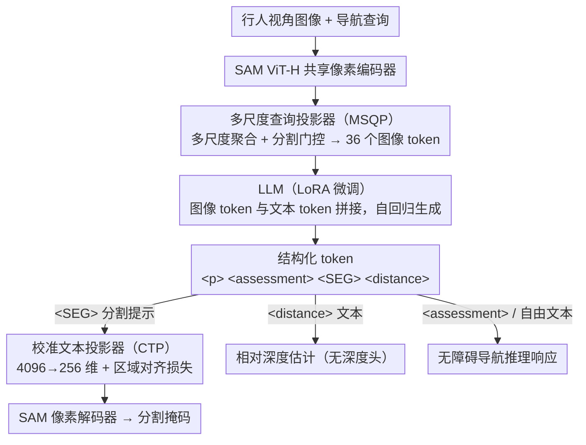

<!-- 由 src/gen_stubs.py 自动生成 -->
# WalkGPT: Grounded Vision-Language Conversation with Depth-Aware Segmentation for Pedestrian Navigation

**会议**: CVPR2026  
**arXiv**: [2603.10703](https://arxiv.org/abs/2603.10703)  
**代码**: [项目主页](https://arxiv.org/abs/2603.10703)（代码与数据集已开放）  
**领域**: 自动驾驶 / 行人导航 / 无障碍辅助  
**关键词**: 视觉语言模型, 像素级定位, 深度感知分割, 行人导航, 无障碍推理, VQA

## 一句话总结

提出 WalkGPT——首个面向行人无障碍导航的像素定位大视觉语言模型，统一对话推理、分割掩码与深度估计于单一架构中，并构建了 41k 规模的 PAVE 数据集。

## 研究背景与动机

**行人导航安全需求迫切**：城市行人路线中存在楼梯、不平地面、停放车辆、临时障碍物等静态/动态屏障，对行动不便人群构成严重风险，但自动化导航系统几乎全部面向车辆，行人级导航严重缺乏。

**现有 LVLM 缺乏空间推理**：虽然 LLaVA、InstructBLIP 等大视觉语言模型能描述视觉内容，但缺乏显式空间推理能力，无法推断几何结构和深度关系，难以用于行人导航。

**空间推理方法依赖用户输入**：SpatialRGPT、DepthLM 等空间感知模型需要用户提供视觉锚点或标记来估计深度，在行人导航场景中不切实际。

**幻觉问题带来安全隐患**：LVLM 容易描述场景中不存在的物体（hallucination），在行人导航中可能导致危险引导。

**Grounded LVLM 缺少深度信息**：GLAMM、LISA 等定位模型能生成 2D 分割掩码，但缺乏深度信息，无法理解相对距离和空间层级，限制了无障碍导航应用。

**缺乏大规模行人视角数据集**：此前不存在同时包含行人视角 QA 标注和空间定位标注的大规模数据集，制约了该领域发展。

## 方法详解

### 整体框架

WalkGPT 采用统一架构，共享单个 SAM ViT-H 像素编码器同时服务于文本生成和掩码预测。输入为行人视角图像和导航查询，模型输出包含自由文本推理、分割掩码和相对深度估计的结构化响应。使用四种结构化 token：`
`（对象引用）、`<assessment>`（无障碍评估）、`<SEG>`（分割提示）、`<distance>`（距离描述），将语言生成与分割和深度推理显式关联。

### 关键设计

**1. 多尺度查询投影器(MSQP)：把高分辨率细节和全局上下文压成紧凑图像 token**

简单的 MLP 投影会丢掉空间结构，而行人导航恰恰需要几何与深度线索。MSQP 把像素编码器的特征图在多个空间尺度(原始分辨率、2× 池化、4× 池化、全局均值)上聚合，每个尺度用一组可学习查询嵌入通过两层交叉注意力提取信息，并引入分割感知门控函数突出结构和边缘丰富的区域；最后把多尺度输出拼接、投影成 $Q=36$ 个固定长度 token $\mathbf{V}_{\text{proj}} \in \mathbb{R}^{B \times Q \times H}$ 喂给 LLM。相比单尺度 MLP，它同时保住了局部细节和全局场景上下文，消融里换成 MLP 会让三项指标全面大跌。

**2. 校准文本投影器(CTP) + 区域对齐损失：防止维度压缩丢语义**

LLM 生成的 `<SEG>` token 隐状态有 $H=4096$ 维，要映射到 $d_{\text{vis}}=256$ 维的视觉空间，硬压会丢掉细粒度语义。CTP 让每个降维向量再通过 MLP + 可学习偏置扩展为 $K_{\text{bank}}$ 个校准子嵌入来保留语义，并配一个区域对齐损失(Region Alignment Loss)——一个 InfoNCE 对比损失，用 Top-K 注意力选最显著的图像 token 作正样本、其他图像的 token 作负样本，把每个 `<SEG>` token 与其对应视觉区域拉近、推离无关区域。这样在 $H \to d_{\text{vis}}$ 压缩时语义不丢，语言-视觉对应也更准。

**3. 结构化 token 统一对话/分割/深度：把深度估计当语言来预测**

行人导航既要分割又要距离，常规做法得额外挂一个深度头并依赖稠密深度监督。WalkGPT 改用四种结构化 token 把多路输出织进同一条自回归序列：`<assessment>` 给无障碍判断、`
` 在对话里锚定被指对象、`<SEG>` 作为分割提示交给像素解码器、`<distance>` 直接以自然语言文本写出对象到相机的相对距离。深度因此被当成普通文本 token 来预测，无需专用深度头——模型复用图像 token 里隐含的物体尺度、遮挡、边界等线索做空间推理；又因为距离 token 和分割引用、导航文字同处一条序列，自回归条件会迫使深度表达与整段场景描述保持一致。消融显示去掉 `<distance>` token 后深度准确率从 48.95 暴跌到 38.77、而分割几乎不变（20.16→20.01），印证这套显式距离监督正是深度能力的来源。

### 损失函数

总损失为三项加权和：

$$\mathcal{L}_{\text{total}} = \alpha_1 \mathcal{L}_{\text{CE}} + \alpha_2 \mathcal{L}_{\text{seg}} + \alpha_3 \mathcal{L}_{\text{NCE}}$$

- $\mathcal{L}_{\text{CE}}$：自回归交叉熵（对话生成 + 深度文本预测）
- $\mathcal{L}_{\text{seg}} = \mathcal{L}_{\text{Dice}} + \mathcal{L}_{\text{CE}_{seg}}$（分割掩码预测）
- $\mathcal{L}_{\text{NCE}}$：区域对齐对比损失

深度估计通过 `<distance>` token 以自然语言形式在自回归序列中预测，无需专用深度头或稠密深度监督。

### PAVE 数据集

- 41k 行人视角图像-问题-答案三元组，来源于 SANPO 实景子集
- 每帧包含 RGB、语义/实例分割掩码、深度图、无障碍标签
- 使用 GPT-5-nano 生成结构化 VQA 对，结合自动验证 + 人工审查
- 训练集 85 个视频 session（~8.5k 帧），验证集 6 个（~600 帧）

## 实验

### 主实验：Grounded Navigation Conversation（表1）

| 模型 | CIDEr↑ | METEOR↑ | mIoU↑ | Depth Acc.↑ | AbsRel↓ |
|------|--------|---------|-------|-------------|---------|
| GLAMM-FT | 37.96 | 39.12 | 18.23 | 38.95 | 77.05 |
| PixelLM-FT | 37.49 | 38.02 | 18.10 | 39.00 | 74.61 |
| Sa2VA-FT | 38.82 | 39.66 | 16.10 | 40.54 | 73.82 |
| **WalkGPT (7B)** | **41.97** | 42.36 | 19.95 | 41.97 | 67.88 |
| **WalkGPT (13B)** | 41.17 | **43.01** | **20.16** | **48.95** | **70.66** |

- 所有零样本基线全面失败，无法产出深度估计
- 微调后基线有改善但仍不充分
- WalkGPT 13B 在 mIoU 上超越 PixelLM-FT 10%+（20.16 vs 18.10），深度准确率提升 25%+（48.95 vs 39.00）

### RES 基准测试（表2）

| 模型 | refCOCO val | refCOCO+ val | refCOCOg val |
|------|------------|-------------|-------------|
| LISA | 74.1 | 62.4 | 66.4 |
| PixelLM | 73.0 | 66.3 | 69.3 |
| **WalkGPT** | **76.2** | **70.0** | **72.6** |

WalkGPT 在非专门设计的 RES 任务上仍超越 LISA 和 PixelLM 3–4%。

### 消融实验（表5）

| 变体 | METEOR↑ | mIoU↑ | Depth Acc.↑ |
|------|---------|-------|-------------|
| WalkGPT (Full) | 43.01 | 20.16 | 48.95 |
| w/o MSQP → MLP | 39.50 | 17.40 | 43.39 |
| w/o 多尺度聚合 | 41.60 | 19.30 | 44.70 |
| CTP → Linear | 40.70 | 18.60 | 47.98 |
| w/o $\mathcal{L}_{\text{NCE}}$ | 41.00 | 18.90 | 47.00 |
| w/o `<distance>` | 41.22 | 20.01 | 38.77 |

### 关键发现

- MSQP 是性能提升的核心组件，替换为 MLP 导致三项指标全面大幅下降
- 多尺度聚合对空间结构和深度线索捕获至关重要
- `<distance>` token 对深度预测贡献最大（移除后 Depth Acc. 从 48.95 降至 38.77），但不影响分割
- 幻觉率 CHAIRi 仅 18.49（LLaVA-1.5 为 22.16），对象覆盖率 83.66%（LLaVA-1.5 为 33.04），像素级定位有效抑制幻觉

## 亮点

- **首创性**：首个面向行人无障碍导航的像素定位 LVLM，提出 Grounded Navigation Guide 新任务
- **优雅的统一架构**：对话推理、分割、深度估计通过结构化 token 在单一自回归过程中完成，无需专用深度头
- **MSQP 设计精巧**：多尺度门控交叉注意力将高分辨率细节与全局上下文压缩为紧凑 token，显著优于 MLP 投影
- **区域对齐损失有效**：对比学习防止维度压缩时的语义丢失，增强语言-视觉对应
- **大规模数据集贡献**：PAVE 填补了行人视角 VQA + 空间定位标注数据集的空白

## 局限性

- 对强反射表面（如建筑幕墙上的路面反射）误判为物理障碍，单视角下难以区分真实几何与视觉伪影
- 运动模糊、噪声表面、严重类别不平衡均影响分割质量
- 数据集仅来自 SANPO 实景子集，跨域泛化能力未验证
- 分割 mIoU 绝对值偏低（~20%），反映 PAVE 场景固有难度但也限制实用性
- 深度估计以离散文本形式输出，精度受限于语言表达粒度
- 训练数据从 91 个 session 采样 100 帧/session，可能遗漏重要场景变化

## 相关工作

- **Grounded LVLM**：GLAMM、LISA、PixelLM、GSVA、OMG-LLaVA、Sa2VA 等统一语义推理与像素级定位，但未涉足行人导航
- **空间推理 LVLM**：SpatialRGPT、DepthLM、SpatialVLM 使用深度图/视觉锚点，但依赖用户输入
- **行人导航**：WalkNet、StreetViewAI 等关注静态检测或元数据依赖，缺乏细粒度定位
- **视觉分割**：U-Net、nnU-Net、Swin-UNETR 在 PAVE 上 mIoU < 21%，证明场景固有难度
- **RES**：MCN、VLT、CRIS、LAVT、ReLA 等标准方法，WalkGPT 无专门训练即超越

## 评分

- 新颖性: ⭐⭐⭐⭐⭐（首创任务定义 + 统一架构 + 新数据集）
- 实验充分度: ⭐⭐⭐⭐（多维度评估 + 消融充分，但数据集规模和跨域实验有限）
- 写作质量: ⭐⭐⭐⭐（结构清晰，公式规范，图表丰富）
- 价值: ⭐⭐⭐⭐（填补重要空白，社会意义大，但实用性受分割精度制约）

<!-- RELATED:START -->

## 相关论文

- [\[CVPR 2026\] DriveVLN: Towards Mapless Vision-and-Language Navigation in Autonomous Driving](drivevln_towards_mapless_vision-and-language_navigation_in_autonomous_driving.md)
- [\[CVPR 2026\] EventDrive: Event Cameras for Vision-Language Driving Intelligence](eventdrive_event_cameras_for_vision-language_driving_intelligence.md)
- [\[CVPR 2026\] Learning Vision-Language-Action World Models for Autonomous Driving](vla_world_learning_vision_language_action_world_models_for_autonomous_driving.md)
- [\[NeurIPS 2025\] Leveraging Depth and Language for Open-Vocabulary Domain-Generalized Semantic Segmentation](../../NeurIPS2025/autonomous_driving/leveraging_depth_and_language_for_open-vocabulary_domain-generalized_semantic_se.md)
- [\[CVPR 2026\] NoRD: A Data-Efficient Vision-Language-Action Model that Drives without Reasoning](nord_a_data-efficient_vision-language-action_model_that_drives_without_reasoning.md)

<!-- RELATED:END -->
