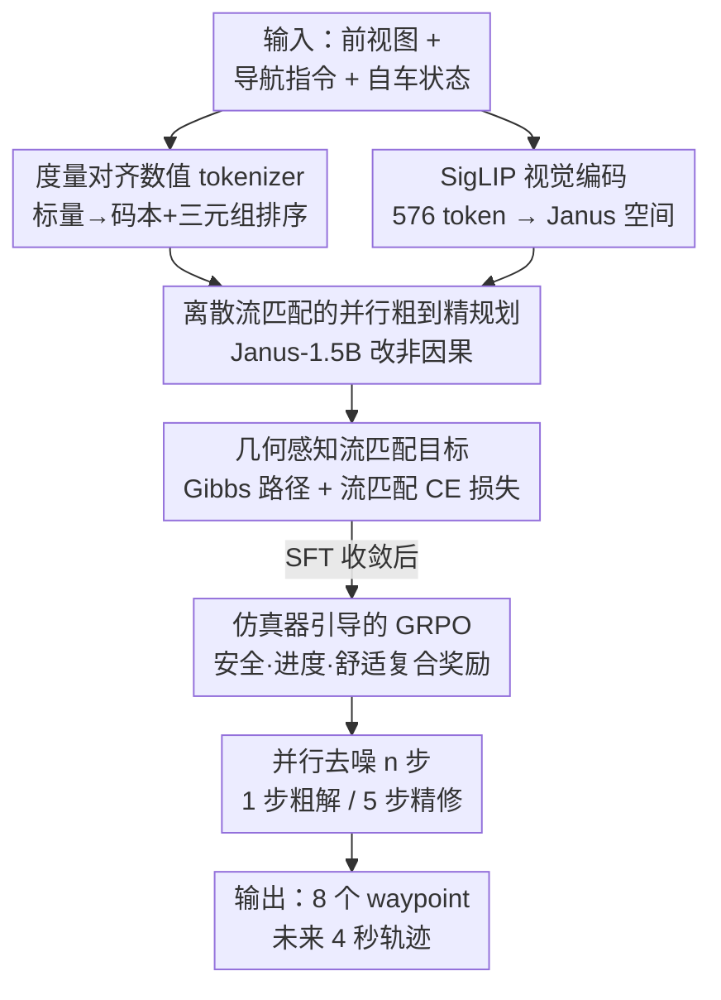

# WAM-Flow: Parallel Coarse-to-Fine Motion Planning via Discrete Flow Matching for Autonomous Driving

**会议**: CVPR 2026  
**论文**: [CVF Open Access](https://openaccess.thecvf.com/content/CVPR2026/html/Xu_WAM-Flow_Parallel_Coarse-to-Fine_Motion_Planning_via_Discrete_Flow_Matching_for_CVPR_2026_paper.html)  
**代码**: https://github.com/fudan-generative-vision/WAM-Flow （有）  
**领域**: 自动驾驶 / 运动规划  
**关键词**: 离散流匹配, 视觉-语言-动作模型, 轨迹规划, 数值 tokenizer, GRPO

## 一句话总结
WAM-Flow 把端到端自动驾驶的轨迹规划重新表述成「在离散 token 空间上的离散流匹配（Discrete Flow Matching）」，用全并行、双向去噪取代自回归逐 token 解码，从而实现可调步数的「粗到精」规划——1 步去噪就拿到 89.1 PDMS（比自回归基线快约 4.67×），5 步精修到 90.3 PDMS，在 NAVSIM-v1 上超过自回归和扩散类 VLA 基线。

## 研究背景与动机

**领域现状**：端到端自动驾驶的主流是视觉-语言-动作（VLA）模型，把前视图像和导航指令映射成自车未来轨迹。当前两大流派：一是「双系统」——用自回归 VLM 做高层推理／场景理解，再接一个扩散式规划器迭代生成平滑轨迹（如 ReCogDrive、DiffusionDrive）；二是「单系统」——直接把轨迹当文本 token 用 VLM 自回归生成（如 EMMA、DrivingGPT、AutoVLA）。

**现有痛点**：自回归解码必须逐 token 顺序生成，并行度低、推理慢，而且会累积 exposure bias（每步都要 commit 一个 token，前面错了后面纠不回来）。FSDrive 这类自回归方案单次推理要 10.58s。扩散类方案虽然支持并行采样，但通常缺乏显式的语言推理可解释性，且需要在连续动作空间上做大量去噪步。

**核心矛盾**：策略表示需要同时兼顾三件相互拉扯的事——**表达力强的推理能力**、**高精度的连续控制**、**鲁棒的闭环性能**。自回归牺牲了速度和并行性，扩散牺牲了推理可解释性，二者都没法在「简单场景快出粗解、复杂场景慢精修」之间自由切换。

**切入角度**：作者注意到离散流匹配（DFM）天生支持**全并行 + 双向去噪**：它用连续时间马尔可夫链（CTMC）把一个简单先验分布搬运到数据分布，去噪时所有坐标同时更新、可来回修正。这意味着可以从一个粗轨迹假设出发，靠加去噪步数逐步提精度，得到一个**可调的算力-精度 trade-off**——恰好匹配「简单路况要快、复杂交互要准」的驾驶需求。

**本文目标 / 核心 idea**：把 DFM 引入自驾 VLA。但直接套用有三大障碍——(1) 从零训 DFM 太烧数据和算力，需从通用自回归 VLM（Janus-1.5B）初始化，可这类骨干缺乏路况知识；(2) 普通文本 token embedding 弱编码数值的度量关系，做不了高精度轨迹回归；(3) 似然式流匹配只对齐专家轨迹，不显式约束安全／进度／舒适等闭环指标。WAM-Flow 用「多阶段适配 + 度量对齐数值 tokenizer + 几何感知流匹配目标 + 仿真器引导 GRPO」逐一解决。

## 方法详解

### 整体框架

WAM-Flow 的输入是：单张前视图像 + 自然语言导航指令（含 system prompt）+ 当前自车状态（位置、朝向、速度、加速度），输出是未来 4 秒、8 个 waypoint 的轨迹。骨干是改造过的 Janus-1.5B 多模态模型：图像经 SigLIP 编码成 576 个视觉 token，经 MLP 对齐到 2048 维文本空间；语言侧把 Janus 词表扩出 20,001 个「数值 token」专门表示自车状态数字和输出 waypoint 坐标，总词表 122,401。

关键转变是**把解码方式从自回归（因果、逐 token）改成离散流匹配（非因果、全并行）**：模型不再一个个吐 token，而是学一个「速度场 / 后验估计」，在时间区间 $[0,1]$ 上对所有坐标同时去噪，$n$ 步走完得到完整轨迹。训练上先用流匹配损失做监督微调（SFT），再用仿真器引导的 GRPO 强化对齐闭环行为。

### 关键设计

**1. 离散流匹配的并行粗到精规划：用全并行双向去噪替掉自回归逐 token，换来可调步数**

这是全文的范式根基，针对的是「自回归慢且累积 exposure bias、扩散缺推理」的核心矛盾。DFM 把状态空间定义为 $S=\mathcal{T}^D$（$D$ 个离散变量，每个取值于 $\mathcal{T}=\{1,\dots,K\}$），用一条时间相关的概率路径 $\{p_t(x)\}_{t\in[0,1]}$ 把简单源分布 $p(x)=\prod_i p_i(x^i)$ 逐渐搬到数据分布 $q(x)$，边界条件保证 $p_0(x)=p(x)$、$p_1(x)=q(x)$。这条路径由一个 CTMC 实现，其速度（rate matrix）$u_t(x,z)$ 给出小步长 $h$ 下的转移概率：

$$P(x_{t+h}=x \mid x_t=z) = \delta_z(x) + h\,u_t(x,z) + o(h)$$

约束是 $u_t(x,z)\ge 0\ (x\neq z)$ 且 $\sum_x u_t(x,z)=0$，并满足 Kolmogorov 前向方程 $\dot p_t(x)+\mathrm{div}_x(j_t)=0$。和自回归「逐 token commit」最本质的区别是：DFM 每个坐标都能在去噪过程中反复跳变、互相参照（双向），且所有坐标并行更新——没有顺序瓶颈，也就不会把早期错误一路传下去。推理时用 Euler 离散化把 $[0,1]$ 切成 $n$ 步，步长 $h=1/n$；步数越多轨迹越精。这就是「粗到精」的来源：1 步给粗解、5 步精修，算力和精度可按场景难度自由换。

**2. 度量对齐数值 tokenizer：让 token 的隐空间距离忠实反映数值大小差**

针对「普通文本 token embedding 不保度量结构、做不了高精度回归」的痛点。作者把连续标量（位置/朝向/速度/加速度）在 $[-100,100]$ 上以 0.01 分辨率离散成统一码本 $V=\{v_1,\dots,v_N\}$（$N=20001$），每个标量 token 经线性投影 $E:\mathbb{R}\to\mathbb{R}^d$ 并 L2 归一化得到 embedding $z=E(v)/\lVert E(v)\rVert_2$。核心约束是「**隐空间欧氏距离对标量差单调**」：对任意三元组 $(i,j,k)$，若 $|v_i-v_j|<|v_i-v_k|$，就该有 $d_{ij}<d_{ik}$（$d_{ij}=\lVert z_i-z_j\rVert_2$）。用三元组 margin 排序损失强制它：

$$\mathcal{L}_{\mathrm{num}} = \mathbb{E}_{(i,j,k)\sim\mathcal{T}}\big[\max(0,\; d_{ij}-d_{ik}+\alpha)\big]$$

其中 $\alpha>0$ 是固定 margin（实验取 0.05）。这样得到的 token 空间「数值相近 → embedding 相近」，让 DFM 的「粗到精 / 快慢」精修在数值上稳定可控；这套距离 $d_i(\cdot,\cdot)$ 也直接喂给下面的几何感知流匹配目标当度量。消融里这一步是涨点主力：把 Janus 文本 tokenizer 换成专用数值 tokenizer，PDMS 从 76.2 → 81.1（+4.9）；再加度量对齐 embedding 又 +2.3 到 83.4。

**3. 几何感知流匹配目标：用基于距离的 Gibbs 路径定义「往目标靠」的转移，训练时拟合后验**

光有好 token 空间还不够，得设计一条「尊重这套几何」的概率路径。作者用距离度量 $d$ 诱导一个 Gibbs 分布作为条件路径：

$$p_t(x \mid x_1) = \mathrm{softmax}\big(-\beta_t\, d(x,x_1)\big), \quad \beta_0=0,\ \beta_1\to\infty$$

$\beta_t$ 是 $[0,1]$ 上单调递增的调度函数，$d(x,x_1)=\sum_i w_i d_i(x^i,x_1^i)$ 是各坐标差异的加权和——数值用上面 tokenizer 的距离、角度用环形度量、文本字段用语义距离，权重 $w_i$ 平衡各坐标贡献。对应的条件转移率把状态往目标推：

$$u_t(x,z\mid x_1) = p_t(x\mid x_1)\,\dot\beta_t\big[d(z,x_1)-d(x,x_1)\big]_+$$

$[\cdot]_+=\max(0,\cdot)$ 意味着「只奖励降低与目标差异的跳变」。训练目标是让模型估计真后验 $p_{1|t}(x_1\mid x)$，最小化条件流匹配交叉熵：

$$\mathcal{L}_{\mathrm{CE}}(\theta) = \mathbb{E}_{t\sim\mathcal{U}[0,1],\,x_1\sim q,\,x\sim p_t(\cdot\mid x_1)}\Big[-\sum_{i=1}^D \log p_{1|t}^{\theta,i}(x_1^i\mid x)\Big]$$

为保证高维可解，速度被限制为单坐标转移。这个几何感知的形式让并行解码高效，同时支持可控精修——精修一步本质就是按当前 token 算总出射率 $\lambda^i$、抽随机数决定是否跳到从后验采的目标 token。

**4. 仿真器引导的 GRPO：把闭环安全/进度/舒适显式塞进奖励，而不破坏并行生成**

似然式流匹配只让模型「像专家轨迹」，但不显式约束闭环里的不碰撞、可行驶区域合规、进度、舒适。作者把 NAVSIM 仿真器的 PDMS 拆成「安全惩罚 × 性能目标」的复合奖励：

$$R(\tau) = \underbrace{\Big(\textstyle\prod_{m\in\mathcal{M}} s_m(\tau)\Big)}_{\text{安全惩罚}} \cdot \underbrace{\Big(\frac{\sum_{w\in\mathcal{W}}\lambda_w s_w(\tau)}{\sum_{w\in\mathcal{W}}\lambda_w}\Big)}_{\text{性能目标}}$$

其中 $\mathcal{M}=\{\text{NC, DAC}\}$ 是安全项（无碰撞、可行驶区域合规），$\mathcal{W}=\{\text{EP, TTC, C}\}$ 是性能项（进度、碰撞时间、舒适）。安全项用**乘法**——任一安全约束违规直接把整体奖励拉到 0，硬性保证约束满足；性能项用加权平均做平滑 trade-off（NC 对责任碰撞给 0、撞静物给 0.5、否则 1；DAC 违规给 0）。对每个场景上下文 $c$ 用并行去噪采 $G$ 条候选轨迹，用组内基线 $A_i=R_i-\frac1G\sum_j R_j$ 算优势，套带 clip 和 KL 正则的 GRPO surrogate：

$$\mathcal{L}_{\mathrm{GRPO}}(\theta) = \mathbb{E}_c\Big[\tfrac1G\sum_{i=1}^G\tfrac{1}{T_i}\sum_{k=1}^{T_i}\big(\min\{r_i^k A_i,\ \mathrm{clip}(r_i^k,1-\epsilon,1+\epsilon)A_i\} - \beta D_{\mathrm{KL}}(\pi_\theta\,\Vert\,\pi_{\mathrm{ref}})\big)\Big]$$

组基线降方差、KL 锚定监督参考稳更新。关键是采样仍走**并行去噪**，所以强化对齐没牺牲 DFM 的并行优势。这一步把 PDMS 从 86.7（仅 SFT）直接拉到 90.3。

### 损失函数 / 训练策略

把自回归骨干「改造」成流模型靠一套**四阶段课程**：① 冻结 VLA 骨干，只在 668K nuPlan 上训新初始化的数值 embedding + LM head（4 epoch，用 $\mathcal{L}_{\mathrm{CE}}$ + $\mathcal{L}_{\mathrm{num}}$），先把数值 token 空间学好；② 在 6.5M VQA（3.4M 通用 LLaVA-v1.5 + 3.1M 驾驶专用 RecogDrive VQA）上继续预训练（3 epoch，$\mathcal{L}_{\mathrm{CE}}$），补路况感知与因果推理；③ 在 nuPlan 上对骨干做 SFT（2 epoch，$\mathcal{L}_{\mathrm{CE}}$）；④ 在 103K NAVSIM 上跑 0.5 epoch 仿真器引导 GRPO，奖励里 EP:TTC:C = 5:5:2。全程 4×8 Ascend 910B NPU、AdamW。推理用调度 $\beta_t=3\times(\tfrac{t}{1-t})^{0.9}$，跑 1/2/3/5/10 步可选。

## 实验关键数据

### 主实验（NAVSIM-v1 闭环）

仅用单前视相机就超过用多视角/LiDAR 的方法；5 步推理拿到最高 PDMS 90.3，且安全指标 NC、DAC 全场第一。

| 方法 | 范式 | 骨干 | 输入 | NC↑ | DAC↑ | TTC↑ | EP↑ | PDMS↑ |
|------|------|------|------|-----|------|------|-----|-------|
| DiffusionDrive | Diff. | - | 3×Cam+L | 98.2 | 96.0 | 94.8 | 82.2 | 88.1 |
| AutoVLA | AR | Qwen2.5-3B | 3×Cam | 98.4 | 95.6 | 98.0 | 81.9 | 89.1 |
| ReCogDrive | AR+Diff. | InternVL3-8B | 3×Cam | 98.2 | 97.5 | 95.2 | 83.5 | 89.6 |
| **WAM-Flow (本文)** | **DFM** | **Janus-1.5B** | **1×Cam** | **99.2** | **98.3** | **97.0** | 82.3 | **90.3** |

NAVSIM-v2（更全的 EPDMS，9 个子指标）上达到 84.7，领先 ReCogDrive（83.6），并在 DDC（99.5）、LK（97.4）等子指标领先。

### 消融实验（NAVSIM-v1，逐组件累加）

| 数值tokenizer | 度量对齐 | VQA预训练 | SG-GRPO | PDMS↑ | 增量 |
|:---:|:---:|:---:|:---:|------|------|
| ✗ | ✗ | ✗ | ✗ | 76.2 | 基线（Janus 文本 token） |
| ✓ | ✗ | ✗ | ✗ | 81.1 | +4.9 |
| ✓ | ✓ | ✗ | ✗ | 83.4 | +2.3 |
| ✓ | ✓ | ✓ | ✗ | 86.7 | +3.3 |
| ✓ | ✓ | ✓ | ✓ | **90.3** | +3.6 |

### 效率与粗到精分析（NAVSIM-v1）

去噪步数与精度/延迟单调权衡，1 步即超多数基线、且延迟最低；5 步达峰值精度但延迟仍只 0.48s。

| 方法 | 范式 | 步数 | PDMS↑ | 推理时延↓ |
|------|------|:---:|------|------|
| FSDrive | AR | - | 85.1 | 10.58s |
| DiffusionDrive | Diff. | 2 | 88.1 | 0.20s |
| ReCogDrive | AR+Diff. | 5 | 89.6 | 0.42s |
| **WAM-Flow** | DFM | 1 | 89.1 | **0.09s** |
| **WAM-Flow** | DFM | 5 | **90.3** | 0.48s |
| **WAM-Flow** | DFM | 10 | 90.2 | 0.94s |

### 关键发现
- **数值 tokenizer 贡献最大**：从文本 token 换成专用数值 token 单步 +4.9 PDMS，说明「让 token 编码度量关系」是把生成式范式用于高精度轨迹回归的前提；GRPO 次之（+3.6），把似然训练拿不到的闭环安全/进度补齐。
- **粗到精确实成立**：步数 1→5 PDMS 单调升（89.1→90.3），延迟近似线性（并行本质），10 步反而略降到 90.2——精修边际收益在 5 步附近饱和。
- **GRPO 超参敏感**：组大小 3 最优（90.3），2 太小探索不足（89.2）、4 方差过大（89.6）；奖励权重 EP:TTC:C 极端化（偏安全 5:20:2 或偏进度 20:5:2）都掉点，均衡的 5:5:2 最好——印证「进度/安全/舒适需等量齐观」。
- **VQA 预训练存在数据规模律**：预训练 epoch 在 3 处达峰（+3.3）；数据从 0.65M→6.5M 对数值 tokenizer 额外 +1.4 PDMS，验证驾驶 VQA 域内预训练的必要性。

## 亮点与洞察
- **把「离散流匹配」首次系统引入自驾 VLA**：用全并行双向去噪天然得到「可调步数 = 可调算力/精度」，比扩散在连续动作空间去噪更贴合「token 化轨迹」，比自回归免去顺序瓶颈和 exposure bias——一个范式同时回答了「快」和「准」。
- **度量对齐数值 tokenizer 是可迁移的 trick**：凡是要用语言模型做高精度数值回归（轨迹、坐标、传感器读数）的任务，都可借「triplet-margin 让 embedding 距离单调于数值差」这招，让离散 token 重获连续几何，单步 +4.9 PDMS 很能说明问题。
- **安全用乘法、性能用加权平均**的奖励结构很巧：乘法让任一安全违规直接清零，是「硬约束」的优雅实现，避免性能项把安全风险「平均掉」。
- **1.5B 小模型打过 8B 自回归基线**：单前视相机 + 1 步去噪即 89.1 PDMS、0.09s 延迟，比 Janus 自回归基线快约 3×，对车端部署的算力预算友好。

## 局限性 / 可改进方向
- **舒适类指标偏弱**：NAVSIM-v2 上 HC（97.6）、EC（73.9）明显落后 ReCogDrive（98.3 / 87.7），强化对齐偏向了安全与进度，舒适性被牺牲——奖励权重的 trade-off 还没调到帕累托最优。
- **依赖仿真器奖励**：GRPO 完全建立在 NAVSIM 仿真器的 PDMS 分解上，奖励质量受仿真器保真度上限制约，sim-to-real 的迁移性未验证。
- **单前视相机的感知上限**：虽然是「以少胜多」的卖点，但复杂交叉口/遮挡场景下单视角缺乏环视信息，长尾安全性存疑；论文也只在 NAVSIM 闭环上评估，未做真实路测。
- **训练成本不低**：四阶段课程 + 6.5M VQA 预训练 + 4×8 NPU，虽然推理便宜，但复现/迁移到新域的训练开销较大。

## 相关工作与启发
- **vs 自回归 VLA（EMMA / DrivingGPT / AutoVLA）**：它们把轨迹当文本逐 token 生成，强在因果推理可解释，但慢（FSDrive 10.58s）且累积 exposure bias；WAM-Flow 用 DFM 并行去噪，1 步 0.09s 就达 89.1 PDMS，速度与精度双赢，代价是推理过程的「语言推理链」不如自回归显式。
- **vs 扩散式规划（DiffusionDrive / Artemis / ReCogDrive 的扩散头）**：扩散在连续轨迹隐空间去噪，也并行但缺显式推理且需较多步；WAM-Flow 在**离散 token 空间**做流匹配，复用 VLM 词表与推理能力，且粗到精步数可低至 1 步。
- **vs GRPO 在自驾的已有用法（AlphaDrive / TrajHF / AutoVLA）**：前者把 GRPO 用在自回归或扩散规划器上；本文是首次把 GRPO 嵌进**离散流匹配**，并显式加入安全对齐奖励（乘法安全项），把强化对齐与并行生成结合起来。
- **启发**：「结构化 token 空间 + 流匹配 + 可调步数」这套组合不止适用于驾驶，凡是「输出是结构化连续量、且希望按难度自适应算力」的任务（机械臂轨迹、布局生成、时序预测）都可借鉴。

## 评分
- 新颖性: ⭐⭐⭐⭐⭐ 首次把离散流匹配系统性引入自驾 VLA，范式层面的贡献，且配套数值 tokenizer / 几何流目标 / 仿真 GRPO 都为之定制。
- 实验充分度: ⭐⭐⭐⭐ NAVSIM-v1/v2 主结果 + 逐组件消融 + 步数/组大小/奖励权重/预训练规模多维分析很扎实，但只在 NAVSIM 闭环、单数据集，缺真实路测与跨域泛化。
- 写作质量: ⭐⭐⭐⭐ 三大障碍→对应方案的逻辑清晰，公式完整；但 DFM 预备知识较重，对不熟流匹配的读者门槛偏高。
- 价值: ⭐⭐⭐⭐⭐ 1.5B 小模型 + 单相机 + 可调步数同时拿下精度、速度与部署友好，为端到端自驾给出一条有竞争力的新范式。

<!-- RELATED:START -->

## 相关论文

- [\[CVPR 2026\] GuideFlow: Constraint-Guided Flow Matching for Planning in End-to-End Autonomous Driving](guideflow_constraint-guided_flow_matching_for_planning_in_end-to-end_autonomous_.md)
- [\[CVPR 2026\] ColaVLA: Leveraging Cognitive Latent Reasoning for Hierarchical Parallel Trajectory Planning in Autonomous Driving](colavla_leveraging_cognitive_latent_reasoning_for_hierarchical_parallel_trajecto.md)
- [\[NeurIPS 2025\] Flow Matching-Based Autonomous Driving Planning with Advanced Interactive Behavior Modeling](../../NeurIPS2025/autonomous_driving/flow_matching-based_autonomous_driving_planning_with_advanced_interactive_behavi.md)
- [\[AAAI 2026\] DiffRefiner: Coarse to Fine Trajectory Planning via Diffusion Refinement with Semantic Interaction for End to End Autonomous Driving](../../AAAI2026/autonomous_driving/diffrefiner_coarse_to_fine_trajectory_planning_via_diffusion_refinement_with_sem.md)
- [\[CVPR 2026\] Unleashing VLA Potentials in Autonomous Driving via Explicit Learning from Failures](unleashing_vla_potentials_in_autonomous_driving_via_explicit_learning_from_failu.md)

<!-- RELATED:END -->
