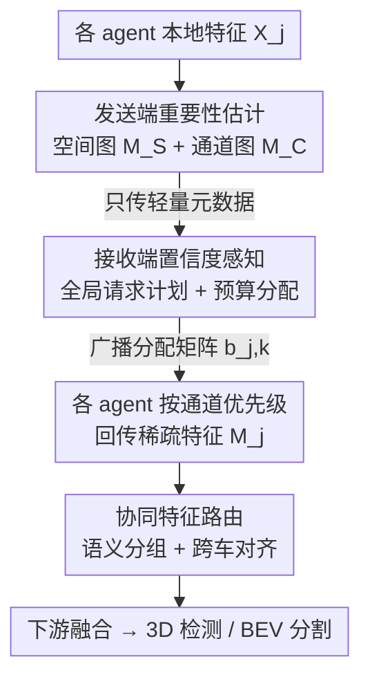

# WhisperNet: A Scalable Solution for Bandwidth-Efficient Collaboration

**会议**: CVPR 2026  
**论文**: [CVF Open Access](https://openaccess.thecvf.com/content/CVPR2026/html/Chen_WhisperNet_A_Scalable_Solution_for_Bandwidth-Efficient_Collaboration_CVPR_2026_paper.html)  
**代码**: 待确认  
**领域**: 自动驾驶 / 协同感知  
**关键词**: 协同感知, V2X 通信, 带宽效率, 通道冗余, 接收端协调

## 一句话总结
WhisperNet 把协同感知的通信策略从"发送方各自挑空间区域"翻转成"接收方统一调度"，让接收车基于各方上报的轻量元数据，同时决定"在哪里(空间)、传哪些(通道)"，在 OPV2V 上只用 0.5% 通信量就把 AP@0.7 提升 2.4%。

## 研究背景与动机

**领域现状**：协同感知（Collaborative Perception, CP）通过 V2X 通信让多辆车/路侧设备共享中间特征，弥补单车视角被遮挡的盲区，是自动驾驶安全的重要支撑。主流的中间融合方案（V2VNet、V2X-ViT 等）在精度和带宽之间折中，但带宽始终是大规模落地的瓶颈。

**现有痛点**：为了省带宽，前人走了两条路。第一条是**特征压缩重建**（CORE、AttFuse），用固定码率编码器把整张特征图压成 latent，到接收端再解码——问题是固定码率/静态码本无法随场景复杂度和动态带宽自适应，被迫在保真度和带宽间硬折中。第二条是**空间选择**（Where2comm、CoSDH），只传前景显著区域——但它们只优化了"在哪里传(where)"，仍然把每个被选中区域的**所有通道**整张传过去，忽略了通道维度上的巨大冗余。

**核心矛盾**：作者做了一个关键观察实验——把后融合特征按通道 L1 范数排序后剪枝，发现**剪掉近一半通道几乎不掉点**（OPV2V 上 6.67× 压缩、AP@0.3 掉不到 6.5%）。这说明通道可以分成三类：定义物体的**主通道(primary)**、提供上下文的**次通道(secondary)**、基本冗余的**边缘通道(marginal)**。边缘通道不仅白占带宽，还会引入噪声拖累精度。而现有方法全都只盯着空间维度，等于只解决了一半问题。

**本文目标**：一个高效的通信策略必须**联合优化"在哪里传(where)"和"传什么(what)"**，即同时在空间和通道两个维度做内容感知的预算分配。

**切入角度**：与其让每个发送方各自基于自我视角(ego-centric)或两两配对(pairwise)地决定传什么——这会导致同一区域多人重复上传、或某些区域无人上传——不如让**接收方作为全局协调者**，汇总所有车的元数据后统一编排，从系统层面避免冗余、保证场景完整。

**核心 idea**：把"发送方过滤"范式翻转成"接收方中心(receiver-centric)的全局协调"——发送方只上报轻量显著性元数据，接收方据此制定一份全局请求计划，按需在各车×各通道之间动态分配带宽预算，只取回最有信息量的特征子集。

## 方法详解

### 整体框架

WhisperNet 实现的是协同感知系统里的"通信模块 $C$"：在带宽预算 $B_j$ 约束下，让每个 agent $j$ 决定该往外发哪些特征，使得 ego agent $i$ 的融合感知性能最大化：

$$\max_{C}\ P\!\left(F\!\left(X_i, \{M_j^{(k)}\}_{j\neq i,\forall k}\right)\right)\quad \text{s.t.}\ \sum_{k=1}^{K}\text{Size}(M_j^{(k)})\le B_j,\ \forall j\in V$$

整条流水线分三个模块、走一轮"请求-响应"协议：① **发送端重要性估计**——每辆车分析本地特征，生成空间重要性图和通道显著性图这两份轻量元数据先发出去；② **接收端置信度感知**——ego 汇总所有车的元数据，制定全局通信计划（谁在哪个区域贡献多少预算），广播回去；③ 各车按计划只把被请求的稀疏特征传过来，再经 **协同特征路由**做通道对齐，准备好交给下游融合。关键在于第一阶段只传"元数据"（很轻），第二阶段才传"被精选的真实特征"，两阶段协议把带宽花在刀刃上。

### 关键设计

**1. 发送端空间-通道联合重要性估计：用拉普拉斯能量给通道分级，让"传什么"有据可依**

针对"空间方法漏掉通道冗余"这个痛点，每辆车对本地特征 $X_j\in\mathbb{R}^{H\times W\times C}$ 同时算两张图。空间侧用两层卷积头 $G_S$ 直接预测空间重要性图 $M_{S,j}=G_S(X_j)\in[0,1]^{H\times W}$，标出哪些位置关键。通道侧的核心洞察是"高频细节比低频信息更有价值"：把每个通道切成 patch，用 $3\times3$ 拉普拉斯核算每个 patch 的二阶梯度幅值作为信息密度分数 $S(p^k_{j,c})=\|\nabla^2 p^k_{j,c}\|_1$。然后用一个 $1\times1$ 卷积头把每个通道分到 primary/secondary/marginal 三组并 softmax 得组概率 $\pi_{j,k,c}$，配上可学习的组权重 $\omega$，取每个 patch 上加权后的最大分作为通道显著性图：

$$M_{C,j}(k)=\max_c\big[(\omega^\top \pi_{j,k,c})\,S(p^k_{j,c})\big]$$

同时本地还算一份通道权重 $w_{j,k}=\text{Softmax}(s_{j,k})$（$s_{j,k}$ 是该 patch 上各通道的分数向量），这份权重 $W_{C,j}$ **不发送、只本地保留**，留着后面按预算挑通道用。这样发送方只把 $M_{S,j}$ 和 $M_{C,j}$ 两张轻量图传出去，真正决定权交给接收方——这是"先传元数据、后传特征"两阶段协议的基础。消融证实拉普拉斯（高频响应）比 Jacobian 或原始统计量(Max/Mean)更可靠，组加权聚合取最大值拿到最高的 0.8729 AP@0.7。

**2. 接收端置信度感知协调：把带宽预算在"空间×各车"两层上做全局再分配**

针对"自我视角/两两决策错过全局最优、导致重复上传或漏传"的痛点，接收方扮演全局协调者，按全局请求-响应协议分预算。它先用一个**Channel Merit Distributor**(CMD)精炼各车上报的原始通道图 $\hat{M}_{C,j}=H(\{M_{C,l}\}_{l\neq i})$，其中 $H$ 是卷积加高斯滤波，让跨车信息交互并平滑。据此算出车 $j$ 在 patch $k$ 上的"协作份额"——它的上下文重要性占所有车之和的比例：

$$s_{j,k}=\frac{\hat{M}_{C,j}(k)}{\sum_{l\neq i}\hat{M}_{C,l}(k)+\epsilon}$$

但所有 patch 平均分预算并不合理（背景区该少给）。于是 **Spatial Focus Engine**(SFE) 先把各车空间图逐元素取最大得全局显著图 $M_S^{global}$，再 softmax 成空间预算分布 $P_S(k)=\frac{\exp(M_S^{global}(k)/\tau_s)}{\sum_{k'}\exp(M_S^{global}(k')/\tau_s)}$，于是每个 patch 拿到预算 $\hat{B}_{patch}(k)=B\cdot P_S(k)$。最后按协作份额把 patch 预算分到各车：$b_{j,k}=\lfloor \hat{B}_{patch}(k)\cdot s_{j,k}\rfloor$。这个分配矩阵广播给所有车后，每辆车结合本地保留的 $W_{C,j}$ 按通道组优先级回传——**先发主通道、再次通道，边缘通道只在带宽有余时才传**。这一套"空间定预算、各车分份额、本地按通道优先级回传"的链条，正是同时回答了"在哪里"和"传什么"。

**3. 协同特征路由：用通道路由 + 多尺度专家把跨车稀疏特征对齐后再融合**

针对"各车回传的稀疏特征通道不一致、直接融合会错位"的痛点，这个模块在融合前做一层通道对齐而非直接融合。各车稀疏特征 $\{M_j\}$ 先零填充未选中通道、拼成统一张量 $X_{in}\in\mathbb{R}^{N\times C\times H\times W}$。对每个通道 $c$，一个路由网络生成软分配向量 $g_c=\text{Softmax}(\text{MLP}(\text{GlobalAvgPool}(X_{in}^c)))\in\mathbb{R}^m$，把它指派给亲和度最高的专家，从而实现**语义分组**——把语义相近的通道聚到一起处理，避免不加区分地硬融合。每个专家内部用并行 $3\times3$/$5\times5$/$7\times7$ 多尺度卷积块对齐 intra-agent 表示，再沿 agent 维做基于注意力的 inter-agent 重校准以减少跨车不一致；$m$ 个专家的输出逐元素求和重组。这条路径还并联一个残差 Squeeze-and-Excitation 分支对 $X_{in}$ 做全局通道重校准。输出是一份通道协调过的表示，让下游融合更稳。消融显示专家数取 4 最优（再多到 8 会因过度专门化、信息碎片化而崩到 84.35%）。

### 损失函数 / 训练策略

骨干用 PointPillars（voxel 0.4m），遵循 OpenCOOD/OPV2V 基准，通信范围 70m，点云范围 $[-140.8,140.8]\times[-40,40]\times[-3,1]$m；空间预算温度 $\tau_s$ 取 softmax 默认值 1，专家数 4。以 16× 压缩的标准中间融合作为通信率 1.0 的参考基准，所有通信率相对它度量。

## 实验关键数据

### 主实验

在 OPV2V 与 DAIR-V2X 两个大规模数据集上做 3D 目标检测（AP@0.5/0.7）。WhisperNet 用最小的 7.28M 参数拿到最佳精度：

| 方法 | 参数量 | OPV2V AP@0.5 | OPV2V AP@0.7 | DAIR-V2X AP@0.5 | DAIR-V2X AP@0.7 |
|------|--------|--------------|--------------|------------------|------------------|
| CoAlign | 11.42M | 0.9132 | 0.8381 | 0.7772 | 0.6284 |
| DSRC | 10.14M | 0.9183 | 0.8526 | 0.7852 | 0.6360 |
| ERMVP | 11.87M | 0.9139 | 0.8404 | 0.7675 | 0.6350 |
| CoSDH | 8.52M | 0.8952 | 0.8373 | 0.7042 | 0.5766 |
| **WhisperNet** | **7.28M** | **0.9334** | **0.8764** | **0.7915** | **0.6480** |

带宽-精度权衡（Fig. 7）：OPV2V 上 40% 通信率时领先次优 4.0%；把带宽压到 1% 时优势扩大到 OPV2V/DAIR-V2X 各 10.6%/11.7%；甚至 0.5% 带宽仍能维持 baseline。即插即用（Fig. 6）：把它当通信插件接入 F-Cooper，DAIR-V2X 上只用 5% 带宽就把平均 AP 从 0.704 提到 0.723；BEV 语义分割在 50% 通信率下平均 IoU 比纯空间方法 Where2comm 高 50% 以上。

### 消融实验

核心模块逐个加入（OPV2V，传输限制 <50%）：

| 配置 (CMD/SFE/CFR) | OPV2V 通信量 | OPV2V AP@0.5/0.7 | DAIR-V2X AP@0.5/0.7 |
|--------------------|--------------|-------------------|----------------------|
| baseline | 32.81 | 0.8926/0.8333 | 0.7532/0.5907 |
| CMD | 16.40 | 0.9206/0.8532 | 0.7627/0.6036 |
| CMD+SFE | 15.62 | 0.9310/0.8683 | 0.7741/0.6271 |
| CMD+SFE+CFR (Full) | 15.62 | **0.9334/0.8764** | **0.7915/0.6480** |

其他关键消融：专家数 1/2/4/8 对应 AP@0.7 = 0.8512/0.8681/**0.8764**/0.8435，4 个最优；patch 尺寸在 5% 低带宽下 1×1(0.8511) 远胜 4×4(0.7732)，但高带宽下 4×4 省 10% FPS；通道度量上拉普拉斯+组加权取最大拿到最高 0.8729。

### 关键发现
- **CMD 是省带宽的主力**：单独加 CMD 就把通信量从 32.81 砍到 16.40（减半）还把 AP@0.7 从 0.8333 升到 0.8532，证实"通道冗余"假设——砍掉边缘通道反而去噪提精度。
- **低带宽看通道、高带宽看空间**：1% 极端带宽下优势最大（+10.6%/+11.7%），说明联合通道选择在严苛预算下才真正拉开差距；patch 尺寸也呈同样规律——越缺带宽越要细粒度(1×1)。
- **专家数过多会反噬**：8 个专家因过度专门化把信息切碎、丢失整体上下文，AP@0.7 反跌到 0.8435，4 个是甜点。
- **鲁棒性可迁移**：DAIR-V2X 上 σ=0.6 高位姿噪声时只掉 16.0%（ERMVP 掉 75%+）；接到 V2X-ViT 上即便只给 5% 带宽，极端噪声下也只掉不到 1%。

## 亮点与洞察
- **"通道也有冗余"这个观察是全文支点**：剪掉一半通道几乎不掉点的预实验既是动机也是卖点，把研究视角从被研究透了的空间维度拉到被忽视的通道维度，含金量很高。
- **范式翻转很巧**：从"发送方各自决定"翻成"接收方全局协调"，一句话就解释了为什么能避免"同一区域重复上传/某区域漏传"——这是 pairwise 方法的结构性缺陷，全局协调直接绕开。
- **两阶段"先元数据后特征"协议**值得迁移：任何带宽受限的多 agent 协作（多机器人、分布式传感网）都可以借鉴"先发轻量摘要、协调者统一编排、再按需取回"的思路。
- **拉普拉斯能量当通道重要性指标**这个 trick 简单又有理论依据（高频=细节=信息），且消融充分验证优于多种替代，可直接复用到其他需要给通道/特征排序的场景。

## 局限与展望
- **多轮通信的开销未充分讨论**：问题形式化里有 $K$ 轮通信，但元数据交换本身（两张图广播+分配矩阵广播）也占带宽，论文把通信率相对 16× 压缩基准度量，元数据这部分固定成本在极低带宽(0.5%)下的占比值得更细的拆解。
- **依赖各车特征空间一致**：通道路由假设跨车通道语义可对齐，对异构传感器/异构骨干的车队（不同分辨率、不同 backbone）是否成立没有验证。
- **拉普拉斯"高频更重要"的假设有边界**：在雨雾、低反射等高频被噪声主导的场景，按拉普拉斯打分可能把噪声当成信息密度高的通道优先传，值得加场景自适应。
- **单/多尺度二选一是手调**：Multi-Scale 鲁棒但贵、Single-Scale 省但脆，论文按经验固定选 Multi-Scale，没做带宽自适应的动态切换。

## 相关工作与启发
- **vs Where2comm / CoSDH（空间选择）**：他们只优化"在哪里传"、对被选区域整张传所有通道；WhisperNet 在空间基础上加了通道维度选择，且把决策从发送方/两两配对升级为接收方全局协调，低带宽下优势显著（1% 带宽领先 10%+）。
- **vs CORE / AttFuse（特征压缩重建）**：他们用固定码率编码器/静态码本压缩整张特征图，无法自适应动态带宽；WhisperNet 是内容感知的动态预算分配，在 0.5% 极端带宽下仍能维持精度，而 CORE 这类静态压缩在极限预算下失效。
- **vs When2com / Who2com（选谁/何时通信）**：他们调度"和谁、什么时候"通信但选中后通常整特征发送，agent 增多时难扩展；WhisperNet 在"谁"之上进一步细化到"每个 patch×每个通道分多少预算"，扩展性更好。

## 评分
- 新颖性: ⭐⭐⭐⭐⭐ "通道冗余 + 接收端全局协调"双重视角翻转，切入点扎实且少有人做。
- 实验充分度: ⭐⭐⭐⭐⭐ 两数据集、带宽-精度曲线、即插即用、噪声鲁棒、5 张消融表，覆盖很全。
- 写作质量: ⭐⭐⭐⭐ 动机用预实验铺垫清晰，但模块命名(CMD/SFE/CFR)较多、符号密集，初读需对照框架图。
- 价值: ⭐⭐⭐⭐⭐ 即插即用、7.28M 轻量、0.5% 带宽可用，对带宽受限的真实车队部署有直接落地价值。

<!-- RELATED:START -->

## 相关论文

- [\[CVPR 2026\] CoLC: Communication-Efficient Collaborative Perception with LiDAR Completion](colc_communication-efficient_collaborative_perception_with_lidar_completion.md)
- [\[CVPR 2026\] Efficient Equivariant Transformer for Self-Driving Agent Modeling](efficient_equivariant_transformer_for_self-driving_agent_modeling.md)
- [\[CVPR 2026\] MAD: Motion Appearance Decoupling for Efficient Driving World Models](mad_motion_appearance_decoupling_for_efficient_driving_world_models.md)
- [\[ECCV 2024\] Monocular Occupancy Prediction for Scalable Indoor Scenes](../../ECCV2024/autonomous_driving/monocular_occupancy_prediction_for_scalable_indoor_scenes.md)
- [\[CVPR 2025\] Towards Autonomous Micromobility through Scalable Urban Simulation](../../CVPR2025/autonomous_driving/towards_autonomous_micromobility_through_scalable_urban_simulation.md)

<!-- RELATED:END -->
