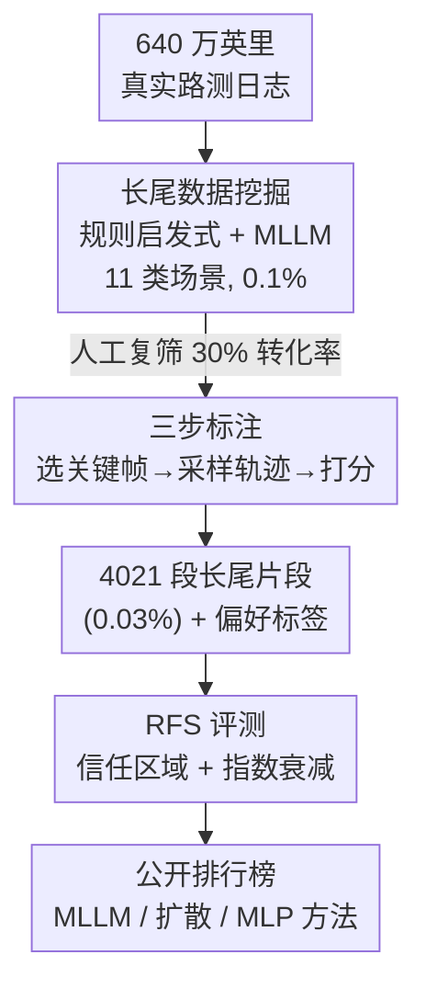

# WOD-E2E: Waymo Open Dataset for End-to-End Driving in Challenging Long-tail Scenarios

**会议**: CVPR 2026  
**论文**: [CVF Open Access](https://openaccess.thecvf.com/content/CVPR2026/html/Xu_WOD-E2E_Waymo_Open_Dataset_for_End-to-End_Driving_in_Challenging_Long-tail_CVPR_2026_paper.html)  
**代码**: 待确认（数据集随 2025 WOD-E2E Challenge 公开）  
**领域**: 自动驾驶  
**关键词**: 端到端驾驶, 长尾场景, 评测基准, 人类偏好评分, 多模态轨迹

## 一句话总结
Waymo 从 640 万英里真实路测里挖出 4,021 段（约 12 小时）发生频率低于 0.03% 的长尾驾驶片段做成数据集 WOD-E2E，并提出基于人类专家偏好打分的开环指标 RFS（Rater Feedback Score）来替代只对单一未来轨迹算距离误差的 ADE，从而能在「多种合理轨迹并存」的安全攸关场景里公允评测视觉端到端驾驶模型。

## 研究背景与动机

**领域现状**：视觉端到端（E2E）驾驶——直接把多摄像头图像映射成未来轨迹，跳过模块化感知-预测-规划的级联——因为可扩展性好、又天然契合多模态大模型（MLLM）的推理能力，正成为研究热点。但要推动这个方向，得有合适的数据集和评测指标。

**现有痛点**：作者点出两个相互独立的缺口。其一是**数据分布**：现有 E2E 数据集（nuScenes、NAVSIM、WOMD、CoVLA）绝大多数是「名义场景」（nominal）——正常跟车、规规矩矩过路口，几乎不暴露系统在罕见险情下的行为，于是没法衡量鲁棒性和泛化。其二是**评测指标**：主流的 ADE / L2 误差只拿预测轨迹和**唯一一条**真值未来轨迹比距离，可驾驶本质是多模态的（一个险情下减速、绕行、刹停可能都对）；而 PDMS 这类指标依赖对周围道路参与者的标注位置去算碰撞率，遇到「一群飞鸟」这种无定形、难检测的障碍就失效，而且它对压线/驶离车道一律重罚，可现实中紧急避险恰恰需要短暂越界。

**核心矛盾**：长尾安全场景里，「正确驾驶」不是一条线，而是一束可接受轨迹的集合；任何把模型预测和单一真值比距离、或强行套规则惩罚的指标，都会在这里给出错误信号。

**本文目标**：(1) 造一个**专门聚焦长尾**的真实 E2E 数据集；(2) 设计一个**对齐人类判断、容忍多模态**的开环评测指标。

**切入角度**：既然「对错」靠规则说不清，那就请人类专家来打分——对同一险情采样多条候选轨迹，让标注员按安全/合法/反应时间等维度给 0–10 分，并保证至少有一条是「好答案」。模型只要靠近任意一条高分轨迹即可得高分。

**核心 idea**：用「人类偏好评分 + 信任区域内指数衰减」的 RFS 取代距离误差，配一套从海量路测里挖长尾、再人工三步标注的数据流水线，把长尾 E2E 驾驶变成可量化、可排行榜的基准。

## 方法详解

这是一篇数据集 + 评测协议论文，所谓「方法」就是两条：**怎么从 640 万英里里把 0.03% 的长尾片段挖出来并标注**，以及**RFS 指标怎么定义**。整体数据流水线是：海量路测日志 →（规则+MLLM）长尾挖掘 → 人工复筛 → 三步标注（选关键帧 / 采样候选轨迹 / 打分）→ 用偏好分支撑 RFS 评测。

### 整体框架

数据集本身规模为 4,021 段、每段 20 秒、按 2,037 / 479 / 1,505 划分训练/验证/测试。每段提供 8 路环视相机的 360° 覆盖（每方向一张 JPEG，10Hz，附内外参以便把 3D 轨迹投影回图像）、高层路由指令（枚举 `GO_STRAIGHT / GO_LEFT / GO_RIGHT`，由对比未来 10 秒实际路线得到，不含变道等微操和速度信息）、以及自车状态（过去 4 秒 4Hz 的轨迹+速度+加速度；训练/验证集额外给未来 5 秒真值轨迹）。每段还打上 11 类场景标签（施工、路口、行人、骑行者、多/单车道操作、加塞 cut-in、路面异物 FOD、特种车辆、聚光 spotlight、其它）。下面三个关键设计依次对应框架图里的挖掘、标注、评测三个贡献环节。

### 关键设计

**1. 长尾数据挖掘：从海量名义数据里把 0.03% 的罕见险情捞出来**

痛点是真实路测日志 99.9% 都是平淡无奇的正常行驶，人工翻找长尾事件成本极高。作者用「规则启发式 + MLLM」两段式挖掘：先把所有日志按上述 11 类打类别标签，挖掘规则依赖数据集里现成的自动标注（3D 检测、建图、跟踪、预测）做启发式判据。在一批共 6,391,012 英里的日志上跑自动挖掘，只有 6,888 英里（0.1%）命中长尾判据；随后再经一轮**人工复筛**（转化率约 30%，剔除被误挖的非长尾场景），把比例进一步压到 0.03%。这套两段过滤的有效性，作者用 Gemini 2.5 Pro 给各数据集的稀有度打分（0–100，依据复杂度/风险/长尾因子，输出含 rarity_score、rare_factors 和推理链的 JSON）来佐证：WOD-E2E 的稀有度曲线在所有分位上都最高，最极端 10% 的平均稀有分约 93，明显高于 nuScenes / NAVSIM 等。

**2. 三步人工标注：把「这一刻该怎么开」拆成选帧、采样、打分**

长尾场景的难点是「正确动作」本身就模糊，所以标注分三步走。其一是**关键时刻选择**：标注员先看完视频建立高层理解（如「有对向车越双黄线加塞，自车需向右轻避」），再精确选出「险情在画面里最早可见、自车开始动作」的那一帧（刻意选最早帧是为了避免历史运动偏置），并写下选帧理由保证一致性。其二是**轨迹采样**：用现成运动规划模型（如 Wayformer）基于感知检测和他车预测生成最多 64 条多样候选轨迹，先按决策类型（速度、是否变道等）自动分桶，再由人引导地从中挑出最终 3 条——覆盖从最优到次优的谱系。其三是**轨迹打分**：标注员在可视化工具里把 3 条候选（最优 / 合理 / 次优）叠在 20 秒场景上审阅，按五个维度——安全、合法、反应时间、刹车必要性、效率——用扣分制评分：满分 10 起步，重大违规（安全/合法/反应时间）每项扣 2 分、轻微违规（刹车必要性/效率）每项扣 1 分。论文强制保证每段至少有一条轨迹得分高于 6（即至少有个「好答案」）。这套标注只对验证集公开。

**3. Rater Feedback Score (RFS)：用信任区域 + 指数衰减度量「贴近任一高分轨迹的程度」**

这是论文的评测核心，专治 ADE 的「单一真值」病。每段有 3 条参考轨迹，各带人类评分 $s_{\text{rater}}\in[0,10]$。RFS 衡量模型预测轨迹在 $t\in\{3,5\}$ 秒处与这些参考轨迹的贴合度：在每条参考轨迹周围、每个评测时刻 $t$ 定义一个矩形**信任区域**，由纵向阈值 $\tau_{\text{lng}}$ 和横向阈值 $\tau_{\text{lat}}$ 界定。基阈值沿用 WOMD：$\bar\tau_{\text{lat}}=1.0,\ \bar\tau_{\text{lng}}=4.0\ (t=3)$ 与 $\bar\tau_{\text{lat}}=1.8,\ \bar\tau_{\text{lng}}=7.2\ (t=5)$，纵向恒为横向的 4 倍。阈值再按参考轨迹初速 $v$（m/s）做分段线性缩放：

$$\text{scale}(v)=\begin{cases}0.5, & v<1.4,\\ 0.5+0.5\times\dfrac{v-1.4}{11-1.4}, & 1.4\le v<11,\\ 1, & v\ge 11.\end{cases}$$

最终阈值为 $\tau_{\text{lng}}=\text{scale}(v)\cdot\bar\tau_{\text{lng}}$、$\tau_{\text{lat}}=\text{scale}(v)\cdot\bar\tau_{\text{lat}}$。给定纵/横向距离误差 $\Delta_{\text{lng}},\Delta_{\text{lat}}$，模型相对单条参考轨迹的得分为

$$s_{\text{rater}}\times 0.1^{\;\max\left\{\max\left\{\frac{\Delta_{\text{lng}}}{\tau_{\text{lng}}},\ \frac{\Delta_{\text{lat}}}{\tau_{\text{lat}}}\right\}-1,\ 0\right\}}.$$

直观地说：预测落在信任区域内就拿满该参考轨迹的人类评分 $s_{\text{rater}}$，越界后按超出比例**指数衰减**。最终 RFS = 对 3 条参考轨迹取最高分（贴近任一好答案即可），再对 $t=3,5$ 平均，最后用 4 做下限地板（floor）。这样设计让「多条合理轨迹并存」「紧急越界」都能被正确容忍，而不是像 ADE/PDMS 那样误判。

## 实验关键数据

论文没有提出新模型，实验目的是 (1) 验证数据集的稀有度，(2) 验证 RFS 指标的合理性，(3) 汇总社区排行榜方法的经验。基线是高度简化版 EMMA（称 NaiveEMMA）：从 Gemini Flash 微调、仅用 WOD-E2E 训练集、把 8 路相机拼成单张 768×768 输入，去掉了原 EMMA 的通用任务混合、思维链推理和测试时扩展。

### 主实验：排行榜代表性方法

| 类别 | 方法 | RFS↑ | ADE↓ | 训练策略 | 骨干/参数 |
|------|------|------|------|----------|-----------|
| MLP | Swin-Trajectory | 7.543 | 2.814 | SFT | Swin Transformer / 36M |
| 扩散 | DiffusionLTF | 7.717 | 2.977 | SFT | DiffusionDrive / 60M |
| 扩散 | UniPlan | 7.779 | 2.986 | SFT | DiffusionDrive / 60M |
| MLLM | Baseline (NaiveEMMA) | 7.528 | 3.018 | SFT | Gemini Nano / 3B |
| MLLM | AutoVLA | 7.556 | 2.958 | SFT+RL | Qwen2.5 / 3B |
| MLLM | HMVLM | 7.736 | 3.071 | SFT | Qwen2.5 / 3B |
| MLLM | Poutine | **7.986** | **2.741** | SFT+RL | Qwen2.5 / 3B |

### 消融/分析：RFS 是否对「更适配长尾的模型」给高分

| 模型配置 | RFS | 说明 |
|----------|-----|------|
| Baseline | 7.14 | NaiveEMMA 起点 |
| + WOD-E2E 微调 | 7.22 | 暴露于长尾训练数据 |
| + 多相机输入 | 7.30 | 360° 环视有助理解周围 |
| + 测试时扩展(多采样) | 7.39 | 应对场景歧义 |

### 关键发现

- **RFS 单调奖励「更会处理长尾」的能力**：逐项加上长尾微调、多相机、测试时多采样，RFS 从 7.14 稳步升到 7.39，说明该指标和「应对长尾的直觉」对齐，可作为可信的评测信号。
- **ADE 与 RFS 只弱正相关**：19 个提交的散点显示二者仅轻度正相关——例如 WayNet 的 ADE 强但 RFS 低，HMVLM 的 ADE 更差却 RFS 更高。这直接证明了在安全攸关、多模态的长尾场景里 ADE 不够用，RFS 必要。
- **额外数据是否有用要看模型类型**：MLLM 类（Poutine、AutoVLA）从分布差异大的补充数据中明显获益，作者归因于思维链推理能调用世界知识、抵消视觉/几何分布漂移；而扩散类（UniPlan、DiffusionLTF）更依赖像素级预测，混入视觉差异大的数据反而提升甚微甚至受损。
- **RL 有效但奖励必须对齐目标指标**：Poutine 和 AutoVLA 都用 GRPO 做 RL 后训练，但 Poutine 用 RFS 当奖励、AutoVLA 用 ADE 当奖励，前者增益显著更大（RFS 7.986 vs 7.556），说明奖励函数要直接对齐评测目标（长尾安全）才管用。

## 亮点与洞察

- **「请人类给一束轨迹打分」是对多模态驾驶最务实的解法**：与其纠结怎么用规则定义「正确」，不如承认正确是一个集合，让专家对最优/合理/次优三条轨迹评分、并保证至少一条 >6。这把模糊的安全判断转成了可比的标量，且天然容忍紧急越界这类「规则会误罚」的情形。
- **RFS 的指数衰减 + 取最大值 + 速度缩放三件套很巧**：取最大值实现「贴近任一好答案即可」的多模态容忍；指数衰减让越界惩罚平滑而非断崖；阈值随初速缩放（慢速时收紧、>11m/s 放到满）符合「高速时位置容差应更大」的物理直觉。
- **用 MLLM 当「稀有度裁判」做跨数据集对比**：拿 Gemini 2.5 Pro 给各数据集前视序列打稀有分并要求输出推理链，提供了一种标准化、可解释的「这个数据集到底有多长尾」横向比较方式，可迁移到其它需要量化分布稀有度的数据工程任务。
- **排行榜本身就是论文的一部分**：作者把社区 19 个提交的经验提炼成三个研究问题（额外数据/ADE-RFS 关系/RL 奖励对齐），让数据集论文也承载了方法学结论。

## 局限与展望

- **开环评测的固有局限**（作者承认）：受限于高保真传感器仿真的高昂算力成本，WOD-E2E 采用开环设置——模型预测不会真正反作用于环境，无法评估误差累积和闭环交互。从开环走向闭环是公认待解的重要瓶颈，作者只说其场景可用于测试高保真仿真器的泛化性。
- **偏好标签的主观性与覆盖度**：RFS 依赖人类专家对仅 3 条候选轨迹的打分，候选由 Wayformer 采样并经人工挑选，若真正最优的轨迹不在这 3 条里，评测就有天花板；五维扣分制的权重（重大-2/轻微-1）也是人为设定。
- **地板分 floor=4 压缩了「差」的区分度**：所有显著偏离的预测都拿 4 分，意味着 RFS 难以区分「有点差」和「非常危险」的预测，对失败模式的细粒度诊断有限。
- **城市/场景分布偏斜**：数据主要来自城市 L、K、J，部分城市仅出现在测试集；直行行为占多数，加塞、上匝道等高危但稀有的行为占比很小，模型在这些尾部的尾部上仍可能欠拟合。

## 相关工作与启发

- **vs NAVSIM / nuPlan**：NAVSIM 靠过滤已有数据集 + 非反应式仿真器做大规模评测，但它「筛选而非原始采集」可能漏掉真实长尾的细微多样性，且其 PDMS 偏重自车进度与舒适、还需 TTC（对飞鸟这类无定形障碍难测）。WOD-E2E 走原始路测挖掘 + 人类偏好评分，专门补这两个洞。
- **vs WOMD**：WOMD 聚焦多智能体交互建模而非规划，且只给相机 embedding 不给原始图像，无法支撑视觉 E2E；WOD-E2E 提供完整 8 路 360° 原图。
- **vs nuScenes**：nuScenes 主要为感知设计，用于 E2E 时常被「历史行为外推」就能刷高分，说明其规划难度不足；WOD-E2E 的长尾定位正是为了让外推失效。
- **vs ADE / PDMS 指标**：ADE 比单一真值距离、PDMS 靠规则算碰撞与舒适，二者在多模态/无定形障碍/紧急越界场景都会误判；RFS 用人类偏好 + 信任区域容忍多解，是对这两类指标的针对性替代。

## 评分
- 新颖性: ⭐⭐⭐⭐ 长尾数据 + 人类偏好评分指标 RFS 的组合切入点扎实，但数据集本身延续 WOD 系列工程范式，方法学新意集中在 RFS。
- 实验充分度: ⭐⭐⭐⭐ 有稀有度横评、RFS 单调性验证、ADE-RFS 弱相关分析和排行榜经验；缺自建强模型与闭环验证。
- 写作质量: ⭐⭐⭐⭐ 动机-缺口-方案逻辑清晰，RFS 公式给得完整；部分挖掘判据放在附录略简。
- 价值: ⭐⭐⭐⭐⭐ 来自 Waymo 的真实长尾基准 + 对齐人类的开环指标，已带动社区排行榜，对 E2E 驾驶评测有实际推动力。

<!-- RELATED:START -->

## 相关论文

- [\[CVPR 2026\] Reliable Policy Transfer for Safety-Aware End-to-End Driving with Deep Reinforcement Learning](reliable_policy_transfer_for_safety-aware_end-to-end_driving_with_deep_reinforce.md)
- [\[ICML 2026\] DeepSight: Long-Horizon World Modeling via Latent States Prediction for End-to-End Autonomous Driving](../../ICML2026/autonomous_driving/deepsight_long-horizon_world_modeling_via_latent_states_prediction_for_end-to-en.md)
- [\[CVPR 2026\] Scaling-Aware Data Selection for End-to-End Autonomous Driving Systems](scaling-aware_data_selection_for_end-to-end_autonomous_driving_systems.md)
- [\[CVPR 2026\] ActiveAD: Planning-Oriented Active Learning for End-to-End Autonomous Driving](activead_planning-oriented_active_learning_for_end-to-end_autonomous_driving.md)
- [\[CVPR 2026\] ResAD: Normalized Residual Trajectory Modeling for End-to-End Autonomous Driving](resad_normalized_residual_trajectory_modeling_for_end-to-end_autonomous_driving.md)

<!-- RELATED:END -->
