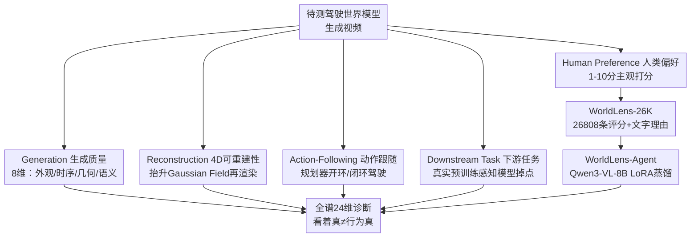

# WorldLens: Full-Spectrum Evaluations of Driving World Models in Real World

**会议**: CVPR 2026  
**arXiv**: [2512.10958](https://arxiv.org/abs/2512.10958)  
**代码**: https://github.com/worldbench/WorldLens (有)  
**领域**: 自动驾驶 / 世界模型 / 评测基准  
**关键词**: 驾驶世界模型, 全谱评测, 4D重建, 闭环动作跟随, 人类偏好对齐

## 一句话总结
WorldLens 提出一个覆盖「生成 / 重建 / 动作跟随 / 下游任务 / 人类偏好」五个维度、共 24 个细粒度指标的驾驶世界模型全谱评测基准，并配套 26K 人工标注数据集 WorldLens-26K 与从中蒸馏出的可解释自动评测器 WorldLens-Agent，系统揭示出当前世界模型「看着真但行为不真」——没有任何一个模型能在所有维度上同时领先。

## 研究背景与动机

**领域现状**：生成式驾驶世界模型（MagicDrive、OpenDWM、DiST-4D 等）已经能合成 dash-cam 级别、视觉上以假乱真的 4D 驾驶序列，正在成为具身智能与自动驾驶仿真的核心组件。

**现有痛点**：评测却远远落后于生成。主流指标（FVD、LPIPS、MUSIQ 等）只盯着帧级画质与美感，却几乎说不清生成的世界是否**保持几何一致**、**遵守物理因果**、**能否支撑可靠控制**。结果就是各家论文用各自的指标自说自话，进展碎片化、结果不可比。

**核心矛盾**：「看起来真」和「行为上真」是两件被现有指标混为一谈、实则解耦的事——纹理逼真的模型常常违反物理，几何稳定的模型又缺乏行为保真度。缺一个像 SAE 自动驾驶分级那样、可落地的统一评测协议来同时量化外观与行为。

**本文目标**：把世界模型评测分解为可解释、可测量的多维度问题，回答「一个世界模型能不能**构建（build）、理解（understand）、并在其生成世界里行动（behave）**」。

**切入角度**：作者观察到单一维度的高分会掩盖另一维度的崩塌（如低感知误差却在 4D 重建时产生几何「漂浮物 floater」、开环表现好闭环却频繁碰撞），因此主张用一组互补的维度从低层外观一路评到高层行为现实性。

**核心 idea**：用「五大互补 aspect × 24 个细粒度指标」的全谱评测，加上「人工标注数据集 + 蒸馏自动评测器」，把主观评判转成可学习、可解释、可扩展的监督信号。

## 方法详解

### 整体框架

WorldLens 本质是一套评测协议而非一个生成模型：给定若干待测驾驶世界模型生成的视频（以 nuScenes 等真实数据为参照），把每个模型放到五个互补 aspect 下逐项打分，再用一个人类偏好闭环把主观维度也变成可自动化的评分。五个 aspect 由低层外观到高层行为依次是：① **Generation**（生成质量，8 维）评视觉/时序/几何/语义一致性；② **Reconstruction**（4D 可重建性，4 维）把生成视频抬升成 Gaussian Field 再渲染回去看几何会不会塌；③ **Action-Following**（动作跟随，4 维）让预训练规划器在生成世界里开闭环，看能不能安全行驶；④ **Downstream Task**（下游任务，4 维）拿真实数据预训练的感知模型在合成数据上测掉点多少；⑤ **Human Preference**（人类偏好，4 维）人工 1–10 分打世界真实度、物理合理性、行为安全。

为支撑第⑤维并把它自动化，作者额外构建了 **WorldLens-26K** 人工标注数据集与 **WorldLens-Agent** 自动评测器，形成「基准 + 数据 + 评测器」的闭环生态。

### 关键设计

**1. 生成质量 8 维分解：把「画质」拆成外观/时序/几何/语义四类可解释信号**

针对「FVD/LPIPS 这类全局指标说不清模型到底哪里不真」的痛点，Generation aspect 把生成质量拆成 8 个细粒度维度，每个维度都挂一个具体的预训练模型作为可测量信号：实例级用类别二分类器算 **Subject Fidelity**（主体保真度，$\mathcal{S}_{\mathrm{SF}}=\frac{1}{N_g|\mathcal{C}|}\sum_j\sum_c\frac{1}{T}\sum_t\frac{1}{K}\sum_k p_{j,k}^{(t,c)}$，即把每帧每个目标框裁出来、送进 ViT/行人分类器、取「看起来像真实该类」的平均置信度），用 ReID 嵌入的逐帧余弦相似度算 **Subject Coherence**（身份连贯），用 DINO 特征算 **Subject Consistency**，用 Depth Anything V2 + DINOv2 算 **Depth Discrepancy**（深度变化平滑度），用 CLIP 算 **Temporal Consistency**，用 SegFormer 掩码算 **Semantic Consistency**，用 I3D 算 **Perceptual Discrepancy**（即 FVD），用 LoFTR 跨相机特征匹配算 **Cross-View Consistency**。这样一个模型在哪一类上塌（如纹理好但跨视一致差）会被精确定位，而非笼统一个 FVD。

**2. 4D 重建可逆性：用「生成→Gaussian Field→重渲染」暴露藏在 2D 帧背后的几何崩塌**

很多模型逐帧看很锐利，但作者发现一旦把生成视频抬升成可微 4D 表示再换视角渲染回来，就会冒出大量几何「漂浮物」和畸变——说明时序相干性在多数 pipeline 里只是弱耦合。Reconstruction aspect 因此把每段视频重建成 Gaussian Field，在原始与新视角轨迹下重渲染，并测四个量：原位重渲染的像素相似度 **Photometric Error**（LPIPS/PSNR/SSIM），与真实序列在 Grounded-SAM2 选区内比深度图的 **Geometric Discrepancy**（AbsRel），新视角下的 MUSIQ 画质 **Novel-View Quality**，以及新视角生成 vs 真实重建之间的 **Novel-View Discrepancy**（I3D 上的 FVD）。这一维直接把「2D 锐利但 3D 一塌糊涂」这种隐藏缺陷量化出来。

**3. 开环/闭环动作跟随：把规划器丢进生成世界里实际开，区分「视觉真」与「功能真」**

仅有高开环真实度并不保证安全的闭环控制。Action-Following 让预训练端到端规划器（UniAD/VAD）在生成式仿真器里沿真实地图设计的路线行驶，并设计四个指标：用生成 vs 真实视频各预测一遍未来轨迹比 L2 的 **Displacement Error**；开环下按 NAVSIM 协议算聚合安全/进度/舒适的 **Open-Loop Adherence**（PDMS）；闭环里直到碰撞/偏离/超时为止跑完的路线百分比 **Route Completion**；以及把 PDMS 与 Route Completion 相乘、同时奖励「既安全又跑完」的 **Closed-Loop Adherence**（Arena Driving Score，$\text{ADS}=\text{PDMS}\times\text{Route Completion}$）。开环—闭环之间的巨大落差正是「看着能开、真开就撞」的量化证据。

**4. 下游任务可用性：拿真实数据训练的感知模型在合成数据上掉多少点，衡量分布对齐**

视觉好看不等于好用。Downstream Task 直接把真实数据预训练、冻结的感知模型套到生成视频上，看性能跌幅：BEV 地图分割的 mIoU（**Map Segmentation**）、BEVFusion 的 NDS（**3D Object Detection**）、3D 跟踪的 AMOTA（**3D Object Tracking**）、SparseOcc 的 RayIoU（**Occupancy Prediction**）。掉点越多说明合成场景越偏离真实任务分布。该维度把「实用性」从画质里剥离出来——它度量的是分布对齐而非外观逼真。

**5. 人类偏好闭环：26K 带文字理由的标注 + 蒸馏出可解释自动评测器，把主观变可学习**

物理合理性、感知真实度这些维度天然被定量指标漏掉，必须引入人。作者让 10 名标注者分两组、在「生成视频 + 语义掩码 + 深度图 + 3D 框」四同步视图下，对 World Realism / Physical Plausibility / 3D&4D Consistency / Behavioral Safety 四维各打 1–10 分并写文字理由，两组分歧时复评，累计 930+ 小时、26,808 条记录构成 **WorldLens-26K**（每条含离散分数 + 简短理由）。在此之上用 LoRA 对 **Qwen3-VL-8B** 做监督微调蒸馏出 **WorldLens-Agent**，它能对未见模型零样本预测感知/物理分数并生成与人类推理一致的自然语言解释，从而把人工评测变成可扩展、可复现、可解释的偏好预言机。

### 损失函数 / 训练策略

WorldLens 主体是评测协议，无端到端训练；唯一的可训练组件是 WorldLens-Agent：在 WorldLens-26K 上用 LoRA 做监督微调（SFT），让 Qwen3-VL-8B 同时输出数值分数与文字理由，对齐人类标注。其余 23 个指标均由现成的冻结预训练模型（分类器、ReID、DINO、Depth Anything V2、CLIP、SegFormer、I3D、LoFTR、Grounded-SAM2、UniAD/VAD、BEVFusion、SparseOcc 等）作为测量探针，无需训练。

## 实验关键数据

作者在五个 aspect 下横评了 MagicDrive、DreamForge、DriveDreamer-2、OpenDWM、DiST-4D、X-Scene、RLGF、MagicDrive-V2 等代表性驾驶世界模型，并给出每维的「Empirical Max」（真实数据上限）作参照。

### 主实验

**Generation + Reconstruction（节选自 Table 1）**：

| 模型 | Subject Fid.↑ | Temp. Cons.↑ | Percept. Disc.↓ | Photo. Error↓ | Geo. Disc.↓ | Novel Disc.↓ |
|------|------|------|------|------|------|------|
| MagicDrive (ICLR'23) | 28.49 | 74.44% | 222.00 | 0.140 | 0.115 | 427.30 |
| OpenDWM (CVPR'25) | **36.30** | 79.63% | 90.42 | **0.065** | 0.088 | 287.73 |
| DiST-4D (ICCV'25) | 30.32 | 77.76% | **58.08** | 0.066 | 0.080 | **192.39** |
| Empirical Max | 60.22 | 93.24% | – | 0.056 | – | – |

要点：OpenDWM 综合最均衡（得益于大规模多数据集训练），DiST-4D 感知误差最低且新视角重建最好（RGB-D 生成更好保深度），但所有模型都明显低于 Empirical Max——MagicDrive 的重建误差比 OpenDWM 差 **2× 以上**。

**Action-Following（Table 2）**：

| 模型 | Displ. Error↓ | Open-Loop Adh.↑ | Route Compl.↑ | Closed-Loop Adh.↑ |
|------|------|------|------|------|
| MagicDrive | 0.57 | 71.23% | 6.89% | 4.82% |
| MagicDrive-V2 (ICCV'25) | **0.53** | **78.91%** | 12.31% | 9.50% |
| RLGF (NeurIPS'25) | **0.53** | 78.45% | **13.51%** | **10.59%** |

要点：开环 PDMS 普遍不错，但**闭环全线崩塌**——最好的 Route Completion 也仅 13.51%，碰撞/偏离频发，说明合成数据目前仍无法替代真实数据做高层控制。

**Downstream Task（Table 3）**：

| 模型 | Map Seg.↑ | 3D Det.↑ | 3D Trk.↑ | Occ.↑ |
|------|------|------|------|------|
| MagicDrive | 18.34% | 22.41% | 7.90% | 23.14% |
| OpenDWM | 27.63% | 21.96% | 6.90% | 24.82% |
| DiST-4D | **35.55%** | **33.22%** | **15.30%** | 26.10% |
| DriveDreamer-2 | 33.62% | 30.90% | 13.30% | **26.82%** |
| Empirical Max | 40.64% | 44.72% | 36.30% | 37.05% |

要点：DiST-4D 在分割/检测/跟踪上大幅领先（平均比次优高 30–40%）；耐人寻味的是感知画质很强的 OpenDWM 在检测（21.96%）和跟踪（6.90%）上反而垫底——大规模多域训练反而妨碍了对特定数据集分布的适配。

**Human Preference（Figure 7）**：四维主观分平均仅 2–3 分（满分 10），离人类级真实感很远。DiST-4D 各维最均衡（物理合理性 2.58、行为安全 2.59），OpenDWM 真实度最高（2.76）但物理一致性略低，MagicDrive 全维垫底。

### 消融实验

本文是评测基准而非单模型，不做传统意义的模块消融；其「消融」体现为跨维度的解耦分析——同一模型在不同 aspect 上的排名反转，等价于验证各 aspect 度量的是互补而非冗余的能力：

| 对比配置 | 关键现象 | 说明 |
|------|------|------|
| 感知维 vs 下游维 | OpenDWM 感知最优却检测掉 30%（相对 DiST-4D） | 画质 ≠ 可用性，需分布对齐 |
| 开环 vs 闭环 | 开环 PDMS 高，闭环 Route Completion 普遍 <14% | 视觉真 ≠ 功能真 |
| 几何维 vs 纹理维 | 几何监督稳深度但糊细节；外观训练锐纹理但破空间 | 外观与几何当前被当成独立目标 |
| WorldLens-Agent 零样本 | 在未见的 Gen3C 视频上分数+理由都贴合人工标注 | 蒸馏出的评测器可泛化 |

### 关键发现
- **没有全能选手**：DiST-4D 赢几何与新视角，OpenDWM 赢光度保真，DriveDreamer-2 赢深度精度——证明视觉真实/几何一致/下游可用是互补而非可互换，必须多维评测。
- **感知质量不蕴含可用性**：OpenDWM 视觉强但 3D 检测比 DiST-4D 低 30%，对齐目标域分布比感知真实更关键。
- **几何感知带来物理相干**：DiST-4D 的优势源于 RGB-D 生成 + 解耦时空扩散，几何感知监督显著提升物理真实度与可重建性。
- **闭环是最难的照妖镜**：几乎所有模型开环漂亮、闭环崩盘，时序稳定性是 Route Completion 的瓶颈。

## 亮点与洞察
- **「build / understand / behave」三段式评测哲学**：把世界模型评测从「单一画质分」升级为从外观→几何→功能→人类对齐的全谱诊断，思路清晰且每一维都挂可测量的冻结探针，可复现性强——这套「一维一探针」的设计模式可直接迁移到视频生成、机器人世界模型等其他领域。
- **4D 重渲染当照妖镜**：把生成视频抬升成 Gaussian Field 再换视角渲回来，让 2D 帧里藏不住的几何漂浮物现形——这是把「时序一致性」从玄学变成可量化指标的巧妙手段。
- **开环—闭环落差的系统性揭示**：用 ADS = PDMS × Route Completion 把「安全」和「跑完」绑在一起，量化出「看着能开、真开就撞」的残酷现实，给世界模型社区敲了警钟。
- **主观评测可学习化**：WorldLens-26K 不只给分数还给文字理由，使 WorldLens-Agent 既能打分又能解释，且零样本泛化到未见模型——为后续用作 RLHF 奖励/优势函数留了接口。

## 局限与展望
- **作者承认**：当前模型整体离人类级真实感很远（主观分仅 2–3/10），基准更多是「诊断现状」而非「指明单一解法」；闭环失败的根因（物理/因果建模缺失）有待生成侧解决。
- **评测器规模与覆盖**：WorldLens-Agent 仅基于 Qwen3-VL-8B 与 26K 标注，零样本泛化虽好但只在 Gen3C 一个 OOD 模型上验证，更大规模、更多样模型上的可靠性仍需检验。
- **依赖大量冻结探针**：23 个指标各自依赖一个预训练模型，探针本身的偏差（如检测器对合成纹理的敏感性）会传导进评测分数，指标的「绝对值」跨数据集可比性需谨慎。
- **聚焦驾驶单域**：协议虽通用，但所有实例化都绑定 nuScenes 类驾驶场景与对应感知模型，迁移到室内/机器人世界模型需重建整套探针。

## 相关工作与启发
- **vs VBench / EvalCrafter / T2V-CompBench**：它们把视频评测扩到运动与时序一致性，但仍停留在 2D 视频、重外观；WorldLens 引入 4D 重建、动作跟随、人类偏好对齐，首个同时测「外观 + 行为」的驾驶世界模型基准。
- **vs WorldScore / VideoWorld**：同样想做「世界模型评测」并用物理启发的复合分，但局限在 2D 视频设定、强调外观而非具身；WorldLens 把规划器真正放进生成世界做闭环控制。
- **vs DriveArena / NAVSIM**：它们把感知/规划/控制整合进生成式闭环仿真，但评的是「智能体」而非「智能体所处的世界」；WorldLens 反过来用现成规划器当探针去评世界本身的功能保真度。

## 评分
- 新颖性: ⭐⭐⭐⭐⭐ 首个把驾驶世界模型从「外观」评到「行为」、五维 24 指标的全谱基准，并配套可学习的人类偏好评测器。
- 实验充分度: ⭐⭐⭐⭐⭐ 横评 8+ 代表性模型、五大 aspect 全覆盖、含 930+ 小时人工标注与零样本泛化验证。
- 写作质量: ⭐⭐⭐⭐ 结构清晰、维度定义与公式完整；但 24 个指标信息密度大，主表略显拥挤。
- 价值: ⭐⭐⭐⭐⭐ 给碎片化的世界模型评测立了统一可落地协议，基准+数据集+评测器全开源，社区可直接用。

<!-- RELATED:START -->

## 相关论文

- [\[CVPR 2026\] MAD: Motion Appearance Decoupling for Efficient Driving World Models](mad_motion_appearance_decoupling_for_efficient_driving_world_models.md)
- [\[CVPR 2026\] Learning Vision-Language-Action World Models for Autonomous Driving](vla_world_learning_vision_language_action_world_models_for_autonomous_driving.md)
- [\[CVPR 2026\] Unposed-to-3D: Learning Simulation-Ready Vehicles from Real-World Images](unposed-to-3d_learning_simulation-ready_vehicles_from_real-world_images.md)
- [\[CVPR 2026\] V2U4Real: A Real-world Large-scale Dataset for Vehicle-to-UAV Cooperative Perception](v2u4real_a_real-world_large-scale_dataset_for_vehicle-to-uav_cooperative_percept.md)
- [\[CVPR 2026\] Real-World On-Vehicle Evaluation of Embedding-Based Anomaly Detection](real-world_on-vehicle_evaluation_of_embedding-based_anomaly_detection.md)

<!-- RELATED:END -->
