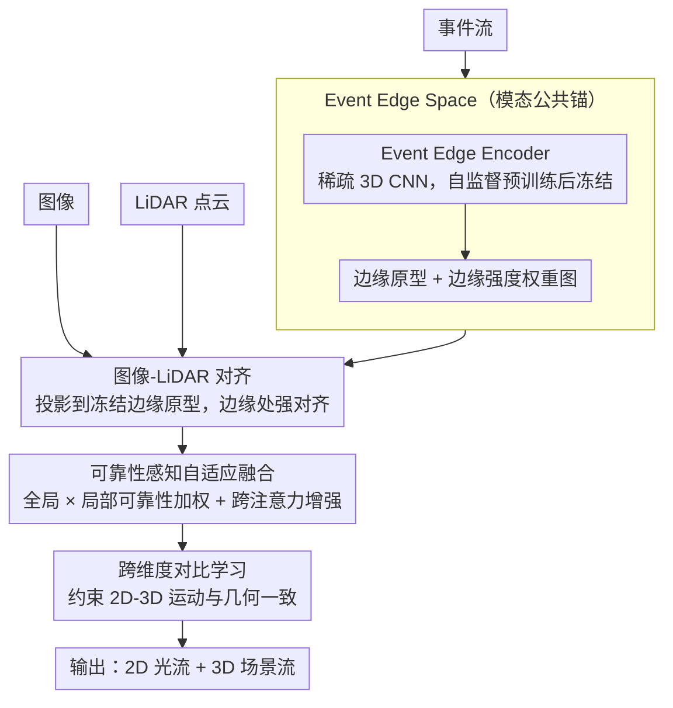

# x2-Fusion: Cross-Modality and Cross-Dimension Flow Estimation in Event Edge Space

**会议**: CVPR 2026  
**arXiv**: [2603.16671](https://arxiv.org/abs/2603.16671)  
**代码**: 无  
**领域**: 自动驾驶  
**关键词**: 光流, 场景流, 事件相机, 多模态融合, 边缘空间

## 一句话总结

提出 x2-Fusion，以事件相机的时空边缘信号为锚构建统一的 Event Edge Space，将图像/LiDAR/事件特征对齐到同质边缘空间后进行可靠性感知自适应融合和跨维度对比学习，同时估计 2D 光流和 3D 场景流，在合成和真实数据上达到 SOTA。

## 研究背景与动机

光流和场景流是动态场景理解的核心工具。现有多模态融合方法将图像/LiDAR/事件保持在各自异构特征空间中融合，带来三个问题：

**高复杂度**：无共享通道基础，需逐对模态对齐，导致模块过多

**信息侵蚀**：异构空间延迟融合到晚期，早期失真难以修正

**高脆弱性**：无共同表示基础，退化条件下对齐本身崩溃

核心洞察：事件相机天然提供时空边缘信号——像素级亮度变化精确标记运动边缘——可作为统一所有模态的"边缘锚"。

## 方法详解

### 整体框架

这篇论文要同时估计 2D 光流和 3D 场景流，难点在于图像、LiDAR、事件三种模态各自处在异构特征空间里，过去的方法只能逐对模态做对齐，模块多、早期失真又难修正。x2-Fusion 的整体思路是先选一个所有模态都认得的"公共语言"——事件相机天然给出的运动边缘信号——把三种模态都翻译到这个统一的 Event Edge Space 里再融合。

具体来说，先单独预训练一个 Event Edge Encoder，让它学会从事件流里提取边缘表示，训练好后把它冻结，当作整套系统的"边缘原型"；图像和 LiDAR 编码器再各自学着把自己的特征对齐到这个原型空间。三种模态都落到同质空间后，用一个可靠性感知的自适应融合模块按每个模态当下的可信度加权合并，最后通过跨维度对比学习让 2D 流和 3D 流互相约束，输出光流与场景流。

### 关键设计

**1. Event Edge Space：用事件边缘当所有模态的"公共锚"**

异构空间融合的根子在于三种模态没有共享的表示基础，于是任何对齐都得逐对硬凑。本文换了个角度：边缘是模态无关的结构信息，无论用哪种传感器，同一条运动边缘都该出现在同一个位置，所以可以拿它当统一锚点。而在所有传感器里，事件相机最适合提供这个锚——它在像素级亮度变化处精确触发，本质上就是在运动边缘上响应；同时它和图像共享 2D 坐标，又和 LiDAR 一样是稀疏异步采样，正好横跨两者之间。

为了把这个锚做成可学习的表示，Event Edge Encoder 把体素化的事件流送进稀疏 3D CNN，产出多尺度特征金字塔，并以自监督方式预训练：用过去的事件去预测未来的边缘强度。边缘强度本身定义为

$$e^E(x,y) = \tilde{A}^E(x,y)\,\bigl(1 - \tilde{\sigma}_t(x,y)\bigr)$$

即归一化事件活跃度 $\tilde{A}^E$ 与时序方差项 $(1-\tilde{\sigma}_t)$ 的乘积——某处事件越活跃、且时间上越稳定一致，越可能是一条真实运动边缘。这张边缘强度图后面会反复用作"哪里该信、哪里该松"的权重。

**2. 图像-LiDAR 对齐：把异构特征投影到冻结的边缘原型上**

有了边缘空间还不够，得让图像和 LiDAR 真的搬进来。做法是冻结事件编码器，把它的输出当成固定不动的边缘原型，图像与 LiDAR 编码器各接一个投影头，把自己的特征映射到同一维度空间向原型靠拢。冻结而非联合训练，是为了给整个系统一个稳定的参照系，否则三方一起动，对齐目标会漂。

对齐用的是边缘锚定的对称正则化：在 2D（像素级）和 3D（点级）上分别计算三模态特征之间的 L1 距离，并以事件边缘图 $e^E$ 作为逐位置权重，总损失为

$$\mathcal{L}_{align} = \lambda_{2D}\,\mathcal{L}_{align}^{2D} + \lambda_{3D}\,\mathcal{L}_{align}^{3D}$$

用 $e^E$ 当权重的好处是：在边缘处（结构最确定、最该一致的地方）强制对齐，在非边缘处放松约束，避免在纹理平坦、本就没有可靠结构的区域硬拉三种模态对齐而引入噪声。

**3. 可靠性感知自适应融合：按每个模态当下的可信度加权**

同质空间解决了"能不能对齐"，但退化场景（极端光照、LiDAR 稀疏）下还得回答"该信谁"。本文用双层可靠性来回答。全局可靠性 $\omega_m$ 衡量整张图上模态 $m$ 与事件运动信号的一致程度，通过时空分解（时序差分加空间梯度）算出；局部可靠性 $\mathcal{A}_m(x)$ 则刻画逐位置的可信度，由高通滤波、平均池化、分组卷积后再做 softmax 得到。两者相乘并归一化作为权重去加权各模态特征 $Z_m$：

$$F_{fused}(x) = \sum_m \frac{\omega_m\,\mathcal{A}_m(x)}{\sum_n \omega_n\,\mathcal{A}_n(x)}\,Z_m(x)$$

这样某个模态整体退化时全局权重 $\omega_m$ 自动调低，而它仍可靠的局部区域靠 $\mathcal{A}_m(x)$ 保留贡献——比固定权重或简单拼接更能扛住单模态失效。融合后的特征再过一层跨注意力 Transformer 进一步增强。

**4. 跨维度对比学习：让 2D 流和 3D 流互相校正**

光流（2D）和场景流（3D）描述的是同一段运动在不同维度上的投影，本该自洽，但分开估计时容易各算各的。这里加一个对比学习目标，显式约束帧间运动一致性和 2D-3D 几何一致性——同一运动在两个维度上的预测要彼此匹配。其效果是两个任务互为正则：3D 的几何约束帮 2D 流在遮挡/纹理缺失处更稳，2D 的密集观测又帮 3D 流补全稀疏点云之间的运动，最终两边都比单独估计更准。

## 实验关键数据

### EKubric 合成数据

| 方法 | EPE_2D ↓ | ACC_1px ↑ | EPE_3D ↓ | ACC_.05 ↑ |
|------|----------|-----------|----------|-----------|
| RPEFlow | 0.439 | 95.99% | 0.027 | 95.33% |
| **x2-Fusion** | **0.430** | **96.86%** | **0.024** | **96.78%** |

### DSEC 真实数据

| 方法 | EPE_2D ↓ | ACC_1px ↑ | EPE_3D ↓ |
|------|----------|-----------|----------|
| RPEFlow | 0.326 | 95.28% | 0.103 |
| **x2-Fusion** | **0.305** | **95.60%** | **0.092** |

### 退化场景

| 条件 | 提升幅度 |
|------|---------|
| 极端光照 | 显著改善 |
| LiDAR 稀疏 | 显著改善 |

### 消融实验

| 配置 | EPE_2D | EPE_3D | 说明 |
|------|--------|--------|------|
| 无 Event Edge Space | +0.05 | +0.003 | 同质空间对融合至关重要 |
| 无可靠性融合 | +0.03 | +0.002 | 自适应权重在退化条件下尤其重要 |
| 无跨维度对比 | +0.02 | +0.003 | 2D-3D 互相增强有效 |

### 关键发现

- Event Edge Space 是首个将三种模态统一到同质边缘空间的设计
- 可靠性感知融合在退化场景下优势最大
- 跨维度对比使 2D 和 3D 任务互相促进

## 亮点与洞察

1. Event Edge Space 的设计理念优雅——用事件相机的天然边缘信号作为"通用锚"
2. 将融合从"异构空间逐对对齐"简化为"同质空间内权重分配"
3. 边缘强度作为对齐权重——在边缘处精确对齐，非边缘处放松约束

## 局限与展望

1. 事件编码器预训练增加了训练流程复杂度
2. 冻结事件编码器可能限制了自适应能力
3. 当前未处理动态物体遮挡
4. 对事件相机硬件的依赖限制了纯图像+LiDAR 场景的应用

## 相关工作与启发

- 相比 RPEFlow（阶段式融合）：统一空间设计更简洁
- 相比 VisMoFlow（手工物理空间）：Event Edge Space 数据驱动且更一般化
- 事件相机作为"边缘传感器"的视角值得在更多任务中探索

## 评分

- 新颖性: ⭐⭐⭐⭐⭐ Event Edge Space 概念新颖，同质化融合范式独创
- 实验充分度: ⭐⭐⭐⭐ 合成+真实数据，退化场景验证
- 写作质量: ⭐⭐⭐⭐ 架构图清晰，对比范式图直观
- 价值: ⭐⭐⭐⭐⭐ 对多模态融合流估计领域提供全新思路

<!-- RELATED:START -->

## 相关论文

- [\[ICLR 2026\] x²-Fusion: Cross-Modality and Cross-Dimension Flow Estimation in Event Edge Space](../../ICLR2026/autonomous_driving/x2-fusion_cross-modality_and_cross-dimension_flow_estimation_in_event_edge_space.md)
- [\[CVPR 2026\] DSERT-RoLL: Robust Multi-Modal Perception for Diverse Driving Conditions with Stereo Event-RGB-Thermal Cameras, 4D Radar, and Dual-LiDAR](dsert-roll_robust_multi-modal_perception_for_diverse_driving_conditions_with_ste.md)
- [\[CVPR 2026\] EventDrive: Event Cameras for Vision-Language Driving Intelligence](eventdrive_event_cameras_for_vision-language_driving_intelligence.md)
- [\[CVPR 2026\] LiDAR-to-4DRadar Diffusion Bridge via Cross-Modal Alignment and Translation in Latent Space](lidar-to-4dradar_diffusion_bridge_via_cross-modal_alignment_and_translation_in_l.md)
- [\[CVPR 2026\] LiREC-Net: A Target-Free and Learning-Based Network for LiDAR, RGB, and Event Calibration](lirec-net_a_target-free_and_learning-based_network_for_lidar_rgb_and_event_calib.md)

<!-- RELATED:END -->
