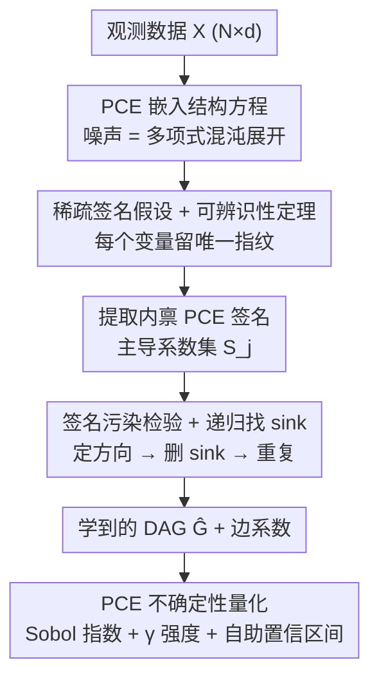

# A Polynomial Chaos Framework for Causal Discovery in Nonlinear Uncertain Systems

**会议**: CVPR 2026  
**论文**: [CVF Open Access](https://openaccess.thecvf.com/content/CVPR2026/html/Cao_A_Polynomial_Chaos_Framework_for_Causal_Discovery_in_Nonlinear_Uncertain_CVPR_2026_paper.html)  
**代码**: 待确认  
**领域**: 因果发现  
**关键词**: 因果发现, 多项式混沌展开, LiNGAM, 不确定性量化, 工业过程  

## 一句话总结
把噪声项用多项式混沌展开（PCE）嵌进结构方程，得到 PCE-LiNGAM，证明在轻度稀疏条件下因果 DAG 可唯一辨识，并用「PCE 签名污染检验 + 递归找 sink」的多项式时间算法在极端非高斯工业数据上把平均 F1 从 0.50 提到 0.756，同时顺手给出基于 Sobol 指数的不确定性量化。

## 研究背景与动机

**领域现状**：因果发现（从观测数据还原变量间的因果 DAG）有三大流派——基于约束的（PC、FCI），基于评分的（GES、NOTEARS、DAGMA），以及函数式因果模型（LiNGAM 系列、ANM、PNL）。其中 LiNGAM 的经典结论是：**线性 + 非高斯噪声**就足以让因果方向唯一可辨识，因为非高斯性打破了线性高斯模型的方向对称性。

**现有痛点**：工业传感器数据同时违反多条假设。噪声往往是多峰、重尾、随设备老化漂移的（远不止高斯），变量之间是非线性耦合（乘积项、饱和、log/tanh）。约束型方法在有限样本下不稳、高维不可行；NOTEARS 这类连续优化在复杂噪声下退化；即便是处理非线性的 ANM/PNL，也只给**点估计**的因果结构，完全不量化"这条边我有多确信"。而工业根因分析恰恰最需要置信度。

**核心矛盾**：传统直觉认为"噪声越复杂越难辨识"——复杂噪声被当成辨识的敌人。已有的贝叶斯方法（DiBS、BCD Nets）虽给了不确定性，却又退回去假设简单参数化噪声分布，丢掉了表达力。表达力和可辨识性、不确定性三者难以兼得。

**切入角度**：作者反其道而行——**结构化的噪声本身是信息，不是障碍**。多项式混沌展开（PCE）能用一组正交多项式基把任意分布表示出来（高斯用 Hermite、有界用 Legendre…），且有收敛保证。如果每个变量的噪声在 PCE 系数上留下一个"指纹"，那么因果传播会把父节点的指纹"污染"到子节点的展开里——这个污染方向是不对称的，正好能用来定方向。

**核心 idea**：把噪声 $\epsilon_j$ 写成 PCE 嵌进结构方程，得到 PCE-LiNGAM；用 PCE 系数签名的"污染检测"做父节点选择，并在轻度稀疏假设下证明 DAG 唯一可辨识，全程保留 PCE 表示从而免费拿到不确定性量化。

## 方法详解

### 整体框架

PCE-LiNGAM 的核心是一个新的结构方程模型加上一个配套的结构学习算法。结构方程把每个变量写成「父节点的（可非线性）确定函数 + 用 PCE 表示的非高斯噪声」：

$$X_j = f_j(X_{\mathrm{Pa}(j)}) + \sum_{k=0}^{P} c_{jk}\Psi_{jk}(\zeta_j)$$

其中 $\zeta_j$ 是驱动 $X_j$ 的独立标准化隐随机源，$\{\Psi_{jk}\}$ 是关于 $\zeta_j$ 分布的正交归一多项式基（$\Psi_{j0}\equiv1$），$c_{jk}$ 是展开系数。当 $f_j$ 线性且 $P=0$ 时退化为线性高斯模型；$f_j$ 线性、$P=0$ 且噪声非高斯则恰好是 LiNGAM——所以本模型是 LiNGAM 的严格推广。

学习阶段是一个**递归 sink-finding 流水线**：先给每个变量算出"无父假设下"的内禀 PCE 签名 → 找出签名最独特的变量当 sink → 对每个候选父做签名污染检验定父 → 删掉该 sink、在剩余子图上重复。学完结构后，同一套 PCE 表示直接拿来做 Sobol 方差分解和不确定性量化。

### 关键设计

**1. PCE 嵌入的结构方程：让噪声携带可辨识的"指纹"**

痛点是工业噪声又非高斯又复杂，而 LiNGAM 只能吃线性 + 单一非高斯噪声。本文用多项式混沌展开（PCE）把噪声 $\epsilon_j = h_j(\zeta_j) = \sum_{k=0}^{P} c_{jk}\Psi_{jk}(\zeta_j)$ 表示成正交多项式基的线性组合。这一步的关键不是"逼近任意分布"（那只是 PCE 的常识能力），而是：**展开系数 $\{c_{jk}\}$ 构成了该变量噪声的一个结构化签名**。把它嵌进结构方程后，整张 DAG 的联合分布就能写成所有独立噪声 $\{\zeta_1,\dots,\zeta_d\}$ 的高维多项式展开 $X_j = \sum_{\alpha\in A_j} C_{j,\alpha}\Phi_\alpha(\zeta_1,\dots,\zeta_d)$，其中多重指标 $\alpha$ 对应不同 $\zeta$ 的基函数乘积。由于噪声独立，这些多元多项式在不同 $\zeta$ 组合间正交。这个正交性是后面一切辨识与检测的数学支点——它让"某个 $\zeta_i$ 出没出现在 $X_j$ 的展开里"成为一个干净的、可检验的事实。

**2. 稀疏签名假设 + 可辨识性定理：把"噪声复杂"翻转成辨识的帮手**

传统观点认为噪声越复杂越难辨识，本文要证明反过来。先引入**稀疏展开系数假设**（Assumption 2.2）：每个噪声 $h_j$ 由少数主导基项支配，存在 $S_j\subseteq\{1,\dots,P\}$ 且 $|S_j|\ll P$，使非主导项能量 $\sum_{k\notin S_j} c_{jk}^2$ 远小于总能量；且要求 $i\ne j$ 时 $S_i\ne S_j$——**没有两个变量拥有完全相同的主导混沌成分**，即每个变量的噪声形状独一无二。

在此之上，Theorem 2.3 证明：若数据由式(3)生成并满足该稀疏假设，则因果 DAG 以概率 1（对真实系数的随机取值而言）唯一可辨识。证明思路是构造性的：因为图无环，每个 $X_j$ 最终只是 $\zeta_j$ 和其祖先 $\zeta_i$ 的函数；若 $X_i$ 不是 $X_j$ 的祖先，则 $\zeta_i$ 的所有项 $\Phi_\alpha$ 在 $X_j$ 展开中系数 $C_{j,\alpha}=0$——**每条非边等价于联合展开里一批系数为零**。反之若 $X_i$ 是父节点，其混沌签名会传播进 $X_j$，留下无法靠其他噪声合成的印记。正交归一 + 独立性保证：想凭空造出 $\Psi_{ik}(\zeta_i)$，唯一办法是别处本就含有它，那就意味着 $X_i$ 确实是祖先。这把 LiNGAM 的辨识性推广到了非线性 + 任意噪声的设定。

**3. 签名污染检验 + 递归 sink 发现：把定理变成多项式时间算法**

定理保证可辨识，但需要可落地的算法。核心洞察是「父→子的因果传播会把父的 PCE 签名'污染'进子的展开」，且这种污染是有向的。算法（Algorithm 1）分三步走。① **提取内禀签名**：对每个变量先在无父假设下中心化并投影到基上，$\tilde c_{jk} = \frac1N\sum_n \tilde X_j^{(n)}\Psi_{jk}(\zeta_j^{(n)})$，取主导索引 $S_j=\{k:|\tilde c_{jk}|>\tau_s\|\tilde c_j\|_2\}$ 作签名。② **递归找 sink**：每轮选签名最独特的变量 $j^*=\arg\max_j \min_{i}\|\mathrm{sig}[j]-\mathrm{sig}[i]\|_{\text{unique}}$ 作为当前 sink。③ **签名污染检验定父**：对每个候选父 $X_i$，先用多项式回归拟合 $\hat f_{j,i}$ 算残差 $R_{j|i}=X_j-\hat f_{j,i}(X_i)$，再提取 $R_{j|i}$ 的 PCE 签名，用独立性得分

$$I(j,i) = \frac{\|P_{S_j}(\tilde c_{R_{j|i}})\|_2}{\|P_{S_j}(\tilde c_j)\|_2} - \rho(\tilde c_{R_{j|i}}, \tilde c_i)$$

判断是否成边（$I>\tau_i$ 则 $i$ 入父集）；其中 $P_{S_j}$ 投影到主导系数索引、$\rho$ 度量签名相关。直觉是：若 $X_i$ 真是父，回归扣掉后残差签名会更"干净"（更接近 $X_j$ 自身噪声）。多父时再联合拟合 $X_{j}=\sum_{i}\hat\beta_{ij}g_i(X_i)+\hat\epsilon_j$ 并验证联合独立、剔除冗余父。每定完一个 sink 就从变量集移除、在剩余子图重复，直到清空——整个过程多项式时间，且不像神经网络方法那样需要大量调参。

**4. 全程保留 PCE → 免费的不确定性量化与敏感性分析**

学完结构后，同一套 PCE 表示直接复用做不确定性量化，这是本框架"顺手白拿"的部分。对学到的结构，重新估计每个变量残差噪声的 PCE 系数，并通过 Galerkin 投影递归算出全局系数 $D_{j,\alpha}$。于是方差天然分解：$\mathrm{Var}(X_j)=\sum_{\alpha\ne 0}D_{j,\alpha}^2$，某噪声源 $\zeta_i$ 贡献的偏方差 $\mathrm{Var}_i(X_j)=\sum_{\alpha:\alpha_i>0,\alpha_{k}=0(k\ne i)}D_{j,\alpha}^2$。据此给出一阶/全阶 Sobol 指数 $S_{ij}=\mathrm{Var}_i(X_j)/\mathrm{Var}(X_j)$、$S^T_{ij}$，以及一个**基于 PCE 的因果强度**

$$\gamma_{ij} = \frac{\sum_{\alpha:\alpha_i>0}D_{j,\alpha}^2 - \sum_{\alpha:\alpha_i=0,\alpha_j>0}D_{j,\alpha}^2}{\sum_{\alpha\ne 0}D_{j,\alpha}^2}$$

度量 $X_j$ 中可归因于 $X_i$、超出 $X_j$ 自身噪声的那部分方差。再用 $B$ 次自助重采样得到 Sobol 指数的置信区间。作者诚实地把这些量定位为"代理模型下的方差归因"而非精确总体因果效应（⚠️ 见局限）。$P$ 大时用稀疏 PCE（限制总阶 $\|\alpha\|_1\le p$、交互阶 $\|\alpha\|_0\le q$）+ 压缩感知 $\ell_1$ 正则求系数，保证可计算。

## 实验关键数据

### 主实验

六个数据集 DS1–DS6 难度递增，覆盖不同非线性强度与噪声族（均匀、指数、Cauchy、Beta、对数正态、Laplace、混合 Laplacian、Student-t、Weibull、工业漂移+离群）。对比 NOTEARS、DirectLiNGAM、ICA-LiNGAM、CAM 四个常用方法，指标为 Precision/Recall/F1/SHD。

| 算法 | 平均 F1 | Precision | Recall | SHD（越低越好） |
|------|---------|-----------|--------|-----------------|
| **PCE-LiNGAM（本文）** | **0.756 ± 0.185** | **0.794** | **0.737** | **3.7 ± 3.1** |
| ICA-LiNGAM | 0.502 ± 0.156 | 0.453 | 0.568 | 8.3 |
| NOTEARS | 0.483 ± 0.167 | 0.606 | 0.412 | 6.8 |
| CAM | 0.274 ± 0.244 | 0.256 | 0.302 | 13.7 |
| DirectLiNGAM | 0.253 ± 0.155 | 0.237 | 0.281 | 13.2 |

PCE-LiNGAM 在全部六个数据集上都领先。平均 F1 0.756 比次优 ICA-LiNGAM（0.502）高约 51%，SHD 仅 3.7（次优 6.8）。

### 单数据集与难例表现

| 数据集 | 特点 | PCE-LiNGAM | 对照 |
|--------|------|-----------|------|
| DS1（菱形 DAG，含 sign 非线性，4 种极端噪声） | 主展示集 | **F1=1.000, SHD=0**（4 条边全对、零假阳） | 次优 NOTEARS F1=0.571 |
| DS5（稀疏 7 节点，Weibull 噪声） | 稀疏大图 | **F1=0.667** | DirectLiNGAM / CAM 双双 **F1=0.000** |
| DS6（工业传感器仿真，漂移+离群+log/tanh/exp/乘积） | 最难 | F1=0.571 | 与最佳竞品 NOTEARS 持平 |

DS1 上 F1 比次优高 75%、比 DirectLiNGAM/CAM 高 4 倍以上。难例 DS5 上线性/加性方法直接崩到 0，本文仍稳住 0.667。

### 方向性与不确定性诊断

- **方向不对称矩阵（DS1）**：四条真值边的不对称值全为正（$X_1\!\to\!X_2$ +0.084 最清晰，$X_1\!\to\!X_3$ +0.017 最弱），正值表示正向回归残差更独立、支持该方向。$X_1\!\to\!X_3$ 对比最弱与其 clipped Cauchy 重尾噪声一致。
- **不确定性量化（DS1，自助 $B=150,\alpha=0.05$）**：$X_1\!\to\!X_2$ 强度最大 $\gamma=0.648$ 且一阶 Sobol 集中（$S^{(1)}=0.642\pm0.038$）；$X_1\!\to\!X_3$ 一阶低（$0.100\pm0.086$）但全阶估计宽（$S^T=0.654\pm0.500$），作者据此**保守地判定这条边的方差归因在重采样下不稳定**——把 Sobol 分析定位为"边级稳定性的比较诊断"。

### 关键发现
- **最大贡献来自 PCE 签名机制本身**：非高斯越极端、非线性越强，线性/加性 baseline 掉得越惨（DS5 归零），而签名污染检验恰恰靠噪声的独特结构定向，所以越难越显优势。
- **不确定性是免费副产品**：UQ 不是额外训练，而是复用结构学习已经估好的 PCE 系数做方差分解，几乎零额外代价。
- **诚实标注 UQ 的边界**：作者明确把 Sobol/γ 解读为代理模型下的方差归因、而非真实总体因果效应，并用宽置信区间标出不可靠的边——这点比很多只报点估计的工作克制。

## 亮点与洞察
- **把"噪声复杂"从敌人变成朋友**：传统直觉是噪声越乱越难辨识，本文用 PCE 把任意噪声结构化成系数指纹，复杂性反而成了区分变量、定方向的信息源——这是最"啊哈"的视角翻转。
- **辨识性与不确定性一锅端**：同一套 PCE 表示既支撑可辨识性证明，又直接给出 Sobol 方差分解，省去了"先学结构再单独建贝叶斯模型估不确定性"的两段式割裂。
- **签名污染检验可迁移**：用"父的特征会污染子的残差展开、且方向不对称"来定因果方向的思路，原则上能搬到任何能把噪声/特征做正交展开的场景（如核展开、傅里叶特征），不限于多项式基。
- **稀疏 + 压缩感知保可算性**：高阶 PCE 维度爆炸，用 $\ell_1$ 正则的稀疏 PCE（限总阶/交互阶）压住，使框架在高维下仍多项式时间，没有停留在理论。

## 局限与展望
- **作者承认**：方法面向静态、相对低维设定；未来需扩展到动态（时序）和高维、进一步提效、并融入领域约束。
- **UQ 是代理量而非真因果效应**（作者明示）：Sobol 指数与 $\gamma$ 强度仅是学到的代理模型下的方差归因，DS1 上 $X_1\!\to\!X_3$ 的全阶 Sobol 置信区间宽到 $\pm0.500$，说明该诊断在某些边上很不稳。⚠️ 不宜把这些数当作可直接外推的因果效应量。
- **实验规模偏小**：六个数据集最大才 7 节点、1500 样本，且多为合成/半合成（含一个"工业传感器仿真"而非真实工厂数据），离真正高维工业场景仍有距离；CVPR 受众里因果发现 baseline 较少、缺与最新连续优化方法（如 DAGMA）的直接对比。
- **依赖稀疏签名假设**：Assumption 2.2 要求"无两变量主导混沌成分相同"，当多个变量噪声分布形状极为相近时辨识性可能退化，论文未给出这种边界情形的实证压力测试。
- **基/阶数选择**：PCE 基类型与截断阶 $P$ 需按噪声分布选（Hermite/Legendre…），实际中噪声分布未知时如何自动选基、选 $P$，论文交代不充分（⚠️ 以原文 adaptive basis selection 引用为准）。

## 相关工作与启发
- **vs LiNGAM / DirectLiNGAM / ICA-LiNGAM**：经典 LiNGAM 是"线性 + 单一非高斯"，靠非高斯打破方向对称。本文是其严格推广（$f_j$ 线性、$P=0$ 时退化回 LiNGAM），把噪声升级为任意分布的 PCE、并允许非线性 $f_j$；难例 DS5 上 ICA/Direct 崩到 0 而本文 0.667。
- **vs NOTEARS / DAGMA 等连续优化评分法**：它们把无环约束做成可微优化，但在复杂噪声下退化且只给点估计。本文不优化全局可微目标，而是用 PCE 签名做有向污染检测 + 递归找 sink，保持可解释性和理论保证，平均 F1 0.756 vs NOTEARS 0.483。
- **vs ANM / PNL / CAM 等非线性加性模型**：同样处理非线性，但只给点估计、对极端非高斯噪声鲁棒性差（CAM 平均 F1 仅 0.274）。本文额外提供不确定性量化。
- **vs DiBS / BCD Nets 等贝叶斯结构学习**：它们给了不确定性，但退回假设简单参数化噪声。本文不假设参数化噪声、允许任意复杂度，同时仍输出后验式的方差归因。

## 评分
- 新颖性: ⭐⭐⭐⭐⭐ 把 PCE 从"前向不确定性传播"首次用到因果发现这个逆问题，并翻转"噪声复杂=难辨识"的直觉，视角很新。
- 实验充分度: ⭐⭐⭐ 六个数据集证明了方法优势，但规模小（≤7 节点）、多为合成、缺与 DAGMA 等最新方法对比。
- 写作质量: ⭐⭐⭐⭐ 理论推导清晰、UQ 部分诚实标注代理性质，可读性好。
- 价值: ⭐⭐⭐⭐ 为非高斯/非线性工业因果分析提供了可辨识、可解释、带不确定性的原则性框架，工程落地潜力明确。

<!-- RELATED:START -->

## 相关论文

- [\[ICLR 2026\] Efficient Ensemble Conditional Independence Test Framework for Causal Discovery](../../ICLR2026/causal_inference/efficient_ensemble_conditional_independence_test_framework_for_causal_discovery.md)
- [\[ACL 2025\] IRIS: An Iterative and Integrated Framework for Verifiable Causal Discovery](../../ACL2025/causal_inference/iris_an_iterative_and_integrated_framework.md)
- [\[AAAI 2026\] CaDyT: Causal Structure Learning for Dynamical Systems with Theoretical Score Analysis](../../AAAI2026/causal_inference/causal_structure_learning_for_dynamical_systems_with_theoretical_score_analysis.md)
- [\[ACL 2025\] On the Reliability of Large Language Models for Causal Discovery](../../ACL2025/causal_inference/llm_causal_discovery_reliability.md)
- [\[CVPR 2026\] CGU-Bayes: Causal Graph Uncertainty-Guided Bayesian Inference for Domain Generalization](cgu-bayes_causal_graph_uncertainty-guided_bayesian_inference_for_domain_generali.md)

<!-- RELATED:END -->
