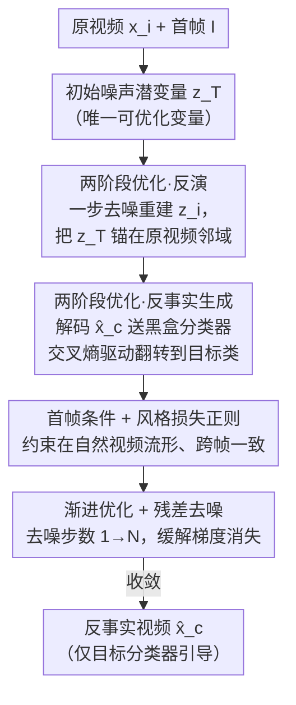

# Back to the Feature: Explaining Video Classifiers with Video Counterfactual Explanations

**会议**: CVPR 2026  
**论文**: [CVF Open Access](https://openaccess.thecvf.com/content/CVPR2026/html/Wang_Back_to_the_Feature_Explaining_Video_Classifiers_with_Video_Counterfactual_CVPR_2026_paper.html)  
**代码**: https://bttf.visurg.ai （项目页，含代码）  
**领域**: 可解释性 / 视频理解  
**关键词**: 反事实解释, 视频分类器, I2V 扩散模型, 时空特征编辑, 模型审计  

## 一句话总结
本文提出 BTTF，一个用 Image-to-Video 扩散模型为**视频分类器**生成反事实解释（CFE）的纯优化框架：仅靠目标分类器的梯度，反向优化初始噪声潜变量，先用"反演"把搜索锚在原视频附近、再优化到目标类别，从而生成与原视频最接近、却被分类器判成另一类的"平行视频"，让人看清模型到底依赖哪些时空特征做决策。

## 研究背景与动机
**领域现状**：反事实解释（Counterfactual Explanation, CFE）问的是"要对输入做哪些**最小、语义上有意义**的改动，才能让模型把预测从原类别翻转到目标类别"。这种对比式解释能直接暴露模型依赖的决定性特征，是检测 spurious feature / shortcut 的利器。但已有 CFE 方法几乎全部针对**图像**分类器，视频分类器的解释基本是空白。

**现有痛点**：直接把图像 CFE 搬到视频上行不通。图像 CFE 大多只扰动静态特征（纹理、颜色），而视频的判别特征（物体运动、表情、人体动作）是**动态**的、横跨多帧、既有空间又有时间属性。一段合格的视频 CFE 必须同时满足五条苛刻标准：validity（确实被判成目标类）、proximity（编辑最小且局部）、actionability（改动是人类能真实执行的语义动作而非像素噪声）、realism（落在自然视频流形上）、spatiotemporal-consistency（跨帧轨迹平滑、物理可信）。逐帧独立编辑会破坏时序连贯性。

**核心矛盾**：主流图像 CFE 路线有两个绕不开的硬伤。其一，"加噪—classifier guidance 去噪"的范式从**部分加噪**的输入出发，只能在低噪声、局部纹理形成阶段做文章，根本改不动运动、动作这类需要在高噪声阶段才能动的全局结构。其二，为了让非鲁棒分类器的噪声梯度变得"有意义"，DVCE 引入辅助鲁棒分类器对齐梯度、UVCE 把目标类名嵌进 prompt——但这两种"外援"都让生成结果不再**忠实**反映目标分类器自己的内部逻辑，解释被外部先验污染了。

**本文目标**：造一个既能编辑**时空特征**、又**只受目标分类器驱动**（不借辅助分类器、不借类名 prompt）的视频 CFE 框架。

**切入角度**：作者借用量子力学"多世界诠释"的比喻——给定一段输入视频，I2V 扩散模型在同一首帧条件下、对不同初始噪声去噪，能生成无数条"时空平行视频"。CFE 任务于是变成：在这些平行视频里，**搜索那条离原视频最近、却被分类器判成目标类**的视频。

**核心 idea**：把首帧固定为条件，**只优化初始噪声潜变量 $\mathbf{z}_T$**，用分类器的交叉熵损失当唯一驱动信号，配合一个"先反演锚定、再反事实优化"的两阶段方案，在原视频邻域内找出反事实视频。

## 方法详解

### 整体框架
BTTF 采用 Wan-I2V 这一 SOTA 的 Image-to-Video 潜空间扩散模型作为生成器。它的关键观察是：对固定首帧 $\mathbf{I}$，Wan-I2V 用确定性 flow-matching 采样器去噪，最终输出视频 $\mathbf{x}_0$ 就成了初始噪声潜变量 $\mathbf{z}_T$ 的**确定性函数**。因此整套方法不动扩散模型权重、不动 prompt，只把 $\mathbf{z}_T$ 当成唯一可优化变量，靠梯度反传去"雕"出想要的视频。

整个流程分两阶段串行。**阶段一（Inversion 反演）**：先把原视频 $\mathbf{x}_i$ 用 VAE 编码成潜变量 $\mathbf{z}_i$ 当标签，再优化 $\mathbf{z}_T$，让它经一步去噪得到的无噪潜变量 $\hat{\mathbf{z}}_0$ 尽量重建出 $\mathbf{z}_i$——这一步把 $\mathbf{z}_T$ 锚定在"能复现原视频"的邻域，为下一阶段提供贴近原视频的起点。**阶段二（CFE generation 反事实生成）**：继续优化 $\mathbf{z}_T$，把 $\hat{\mathbf{z}}_0$ 经 VAE 解码成视频 $\hat{\mathbf{x}}_c$，送进黑盒目标分类器，用"对目标类 $y_c$ 的交叉熵 + 视频风格损失"组成的目标函数 $\mathcal{L}_C$ 反传，逼着生成视频翻转到目标类、同时留在原视频流形上。为了对抗深层反传链的梯度消失，去噪步数在阶段二从 1 渐进增加到 $N$。

### 关键设计

**1. 两阶段优化：先反演锚定 proximity，再反事实翻转 validity**

视频 CFE 最难的是"既要翻转预测、又要改动最小"。如果一上来就奔着目标类优化 $\mathbf{z}_T$，扩散模型很容易跑到离原视频很远的平行视频去，proximity 直接崩掉。BTTF 把任务拆成两步求解这对矛盾。阶段一用一个简单的 L1 重建损失把 $\mathbf{z}_T$ 校准到"能还原原视频"的位置：

$$\mathcal{L}_I(\hat{\mathbf{z}}_0, \mathbf{z}_i) = \lVert \hat{\mathbf{z}}_0 - \mathbf{z}_i \rVert_1$$

这一步去噪步数固定为 1，目的只是给阶段二一个贴近 $\mathbf{x}_i$ 的初始状态。阶段二在这个锚点附近做反事实搜索，主驱动信号是分类器对目标类的交叉熵。消融显示（Fig. 6）：去掉反演后，把"Salute→Cheer"时模型会先无谓地向右迈一步再举手（多了不该有的改动），而完整版直接原地举双臂——两者分类器置信度都是 0.98，但完整版编辑更少、更贴原视频。说明反演阶段实质是抑制无关特征变动、压住 proximity 的关键。

**2. 首帧条件 + 视频风格损失：把生成钉在自然视频流形上保 realism**

只靠分类器梯度优化，很容易像对抗攻击那样产出一堆能骗过分类器、但人眼看是噪声的非自然视频（actionability/realism 全无）。BTTF 用两道约束把生成"拽回"自然流形。其一，始终用原视频首帧 $\mathbf{I}$ 当 I2V 的条件，保证生成视频和原视频共享同一开局、身份和场景布局不变。其二，引入视频风格损失 $\mathcal{L}_S$——逐帧 Gram 矩阵差的 Frobenius 范数平方：

$$\mathcal{L}_S(\hat{\mathbf{x}}_c, \mathbf{x}_i) = \frac{1}{N_f C^2}\sum_{n=1}^{N_f} \lVert G(\hat{\mathbf{x}}_{c,n}) - G(\mathbf{x}_{i,n}) \rVert_F^2$$

其中 $N_f$ 是帧数、$C=3$（RGB）。Gram 矩阵丢弃了绝对坐标，所以这个损失对**平面内平移不变**——这点很关键：它约束外观风格一致却不惩罚物体位置移动，因此天然兼容"运动方向编辑"这类需要位移的反事实（见 Shape-Moving 实验）。阶段二的总目标即：

$$\mathcal{L}_C(\mathbf{x}_i, \hat{\mathbf{x}}_c, y_c, \hat{y}) = -\sum_{k=1}^{K} y_{c,k}\log\hat{y}_k + \lambda\,\mathcal{L}_S(\hat{\mathbf{x}}_c, \mathbf{x}_i)$$

正则系数 $\lambda = 1\times10^5$。消融里去掉 $\mathcal{L}_S$ 后生成视频质量严重退化，印证它对维持视觉真实性不可或缺。

**3. 渐进优化 + 残差去噪：缓解深层反传的梯度消失**

要让分类器的梯度一路反传穿过"VAE 解码 + 多步去噪"的超长计算链，梯度消失几乎是必然。BTTF 用两个机制救它。一是**残差去噪**：仿照 ResNet，把每步去噪写成残差形式 $\mathbf{z}_{t-1} \approx \mathbf{z}_t - \boldsymbol{\epsilon}_\phi(\mathbf{z}_t)$（略去调度系数），让梯度有近似恒等的捷径流过每一步。二是**渐进优化**：阶段二的去噪步数不是一上来就拉满，而是从 1 渐进增加到 $N=15$——前期用浅去噪链快速把 $\mathbf{z}_T$ 推到大致正确的方向、收敛快，后期再加深步数精修生成质量，整体加速优化收敛。

**4. 纯分类器引导：不借辅助鲁棒分类器、不借类名 prompt，保证 faithfulness**

这是 BTTF 区别于 DVCE / UVCE 的立身之本。整个优化的梯度信号**只来自目标分类器**：阶段一来自重建损失、阶段二来自目标类交叉熵，没有引入任何辅助鲁棒分类器去"美化"梯度。同时，虽然 Wan-I2V 本身接受文本条件，作者在微调和推理时一律使用**类别无关的固定 prompt 模板**（如 Shape-Moving 用"This is a synthetic video"），杜绝类名先验泄漏进生成过程。这样生成的反事实纯粹由"目标分类器的反馈 + 原视频"塑造，因而能忠实映射分类器自己的内部决策逻辑，而非外部模型或语言先验的偏好。

### 损失函数 / 训练策略
扩散模型本身不端到端训练，只用 LoRA 做**域适配**微调：解释 Shape-Moving / NTU RGB+D 上的分类器时，直接在各自训练集上微调 Wan-I2V 以贴合域内运动与外观统计；解释 MEAD 表情分类器时，则在更大的人脸视频集 CelebV-Text 上微调。目标分类器统一用 Video Swin Transformer，NTU RGB+D 上额外用 PGD 对抗鲁棒训练。推理时全程冻结分类器与扩散权重，仅优化 $\mathbf{z}_T$。

## 实验关键数据

### 主实验
三个数据集 / 任务：Shape-Moving（合成运动分类，纯时空特征——标签无法从单帧推断、必须靠至少两帧的时序）、MEAD（8 类表情）、NTU RGB+D（60 类动作）。目标分类器性能如下：

| 训练集 | 分类器 | 标准精度 Acc. | 鲁棒精度 RA（$\ell_2$-PGD, $\epsilon=20$） |
|--------|--------|------|------|
| Shape-Moving | M-swin | 100.0 | 28.8 |
| MEAD | E-swin | 98.9 | 0 |
| NTU RGB+D | A-swinR（鲁棒训练） | 54.2 | 35.8 |

与对抗方法 PGD Attack 的定量对比（在非鲁棒分类器 E-swin 上，"Angry→Happy"）。FR 为翻转成功率，SSIM/LPIPS/FID 逐帧计算，FVD 在视频级计算：

| 方法 | FR↑ | SSIM↑ | LPIPS↓ | FID↓ | FVD↓ |
|------|-----|-------|--------|------|------|
| PGD Attack | 1.00 | 0.99 | 0.02 | 0.68 | 0.53 |
| BTTF (ours) | 0.99 | 0.81 | 0.17 | 19.03 | 275.44 |

⚠️ 注意：这张表 PGD 在所有指标上"碾压"BTTF 反而暴露了**现有指标的失效**——因为 E-swin 不鲁棒，像素级微扰就能翻转预测，PGD 产出的是人眼看不见、却毫无语义的对抗噪声，根本不解释决策逻辑；而 BTTF 给出物理可信的真实动作。作者据此论证：视频 CFE 缺乏公平客观的量化评测体系，仍是开放问题。

### 消融实验
消融以定性形式呈现（Fig. 6，"Salute→Cheer"），整理如下：

| 配置 | 现象 | 说明 |
|------|------|------|
| Full（完整） | 原地举双臂，SSIM 0.91 / LPIPS 0.09 | 编辑最小，贴近原视频 |
| w/o 反演 | 先向右迈步再举手，SSIM 0.83 / LPIPS 0.21 | 引入无关动作，proximity 变差（置信度同为 0.98） |
| w/o 风格损失 | SSIM 0.40 / LPIPS 0.56，画质严重退化 | realism 崩坏，证明风格正则不可或缺 |

### 关键发现
- **反演压 proximity、风格损失压 realism**，两者去掉都不会让翻转失败（validity 由交叉熵保证），但会分别破坏"最小编辑"和"自然外观"——说明五条标准是由不同模块分工守护的。
- **能编辑纯时空特征**：在 Shape-Moving 上精确改变物体运动方向（Down→Left/Up/Right），证明 BTTF 能动主流图像 CFE 动不了的运动特征。
- **可当模型审计/调试工具**：用 BTTF 给 A-swinR 生成"kicking"反事实时，画面里始终没有真踢，而是有人**向后退**。回查训练集发现"kicking"视频多为双人交互、一人踢另一人后退躲闪，分类器把"退避动作"误当成了"kicking"——BTTF 由此挖出一个隐蔽的 spurious feature。

## 亮点与洞察
- **把 CFE 重构成"只优化初始噪声"的优化问题**：利用确定性采样器下"输出视频 = $\mathbf{z}_T$ 的确定函数"这一性质，整个解释过程不碰扩散权重、不碰 prompt，干净利落，且天然保证忠实性。
- **风格损失的平移不变性是点睛之笔**：Gram 矩阵丢绝对坐标这一"副作用"恰好让风格约束与运动编辑兼容——既锁外观又放行位移，换成像素级 L2 就会和运动反事实打架。
- **"反事实即调试器"的实证**：首次把视频 CFE 当作发现 spurious feature 的工具用，并真挖出一个 SOTA 分类器把"躲闪"误判为"踢"的失败模式，把可解释性从"画热力图"推进到"可操作的模型审计"。
- **诚实地指出指标失效**：作者没有回避 BTTF 在 SSIM/FID 上输给 PGD 的事实，反而把它当作"现有指标无法评估语义/因果有效性"的证据，研究态度可借鉴。

## 局限与展望
- **算力极重**：生成一段 4 秒反事实视频在 80GB A100 上需 ≈2 小时，源于视频扩散模型庞大的参数空间与深反传链；难以扩展到更长时序。
- **需域对齐**：生成器必须针对目标分类器所在域做 LoRA 微调，缺乏跨域自动化；两阶段流程的超参也需手工调，作者展望开发多域生成器与自适应调参机制。
- **缺标准评测**：FID/FVD 等传统指标无法衡量语义/因果有效性，定量对比里甚至被无意义的对抗噪声"打败"，亟需与人类时空合理性感知对齐的新指标。
- 自己的观察：实验主要是定性图示，validity 之外的四条标准缺乏大规模量化统计；E-swin 的鲁棒精度为 0，用它当被解释对象虽暴露了指标问题，但也说明在非鲁棒分类器上"什么是真正的反事实"本身就模糊。

## 相关工作与启发
- **vs 加噪 + classifier guidance 的图像 CFE（DiME/ACE 等路线）**：它们从部分加噪输入出发，只能在低噪声、局部纹理阶段编辑，改不动运动/动作这类全局时空结构；BTTF 从纯高斯噪声 $\mathbf{z}_T$ 出发并全程优化它，能触及高噪声阶段的结构性改动。
- **vs DVCE**：DVCE 为非鲁棒分类器引入辅助**鲁棒分类器**对齐梯度，导致反事实同时受外部模型左右、不再忠实于目标分类器；BTTF 只用目标分类器梯度，保证 faithfulness。
- **vs UVCE**：UVCE 用 T2I 扩散并把**目标类名嵌入 prompt**，结果被 T2I 学到的类先验塑造；BTTF 用类别无关固定 prompt，杜绝语言先验泄漏。
- **vs PGD Attack（对抗攻击）**：两者都靠扰动翻转预测，但对抗扰动是非 actionable 的像素噪声、不解释决策；BTTF 产出物理可信的语义动作，并借此暴露了用对抗指标评估视频 CFE 的根本缺陷。

## 评分
- 新颖性: ⭐⭐⭐⭐⭐ 首个只靠目标分类器引导、能编辑纯时空特征的视频 CFE 框架，且首次把它用作模型调试器。
- 实验充分度: ⭐⭐⭐⭐ 三任务 + 消融 + spurious feature 案例齐全，但定量统计偏弱、以定性图示为主。
- 写作质量: ⭐⭐⭐⭐⭐ 五条标准贯穿动机—设计—实验，逻辑闭环清晰，对指标失效的讨论尤其诚实。
- 价值: ⭐⭐⭐⭐ 把视频可解释性推到可操作审计层面，实用价值高；但 2 小时/段的算力门槛限制了落地。

<!-- RELATED:START -->

## 相关论文

- [\[ICLR 2026\] Action-Guided Attention for Video Action Anticipation](../../ICLR2026/causal_inference/action-guided_attention_for_video_action_anticipation.md)
- [\[ACL 2025\] Reasoning is All You Need for Video Generalization: A Counterfactual Benchmark with Sub-question Evaluation](../../ACL2025/causal_inference/reasoning_is_all_you_need_for_video_generalization_a_counterfactual_benchmark_wi.md)
- [\[CVPR 2026\] MaskDiME: Adaptive Masked Diffusion for Precise and Efficient Visual Counterfactual Explanations](maskdime_adaptive_masked_diffusion_for_precise_and_efficient_visual_counterfactu.md)
- [\[ICLR 2026\] Counterfactual Explanations on Robust Perceptual Geodesics](../../ICLR2026/causal_inference/counterfactual_explanations_on_robust_perceptual_geodesics.md)
- [\[ACL 2025\] Counterfactual Explanations for Aspect-Based Sentiment Analysis](../../ACL2025/causal_inference/counterfactual_explanations_for_aspect-based_sentiment_analysis.md)

<!-- RELATED:END -->
