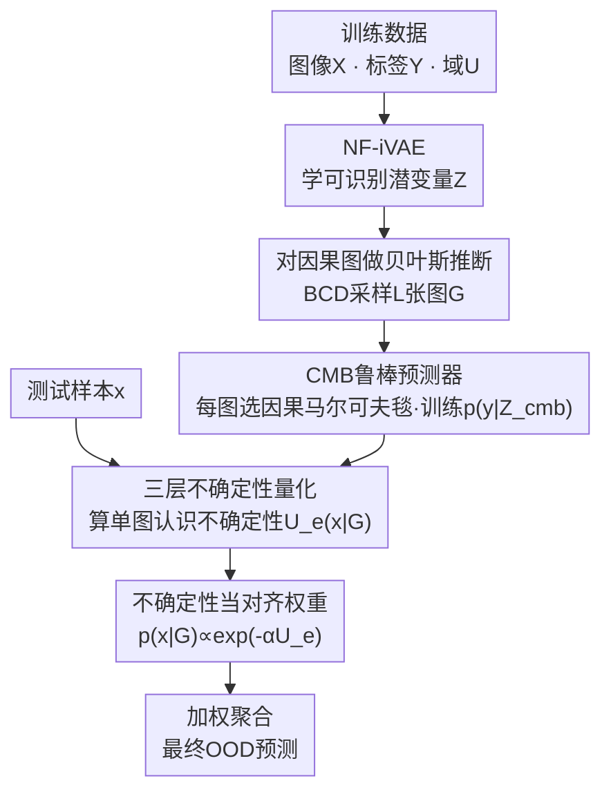

# CGU-Bayes: Causal Graph Uncertainty-Guided Bayesian Inference for Domain Generalization

**会议**: CVPR 2026  
**论文**: [CVF Open Access](https://openaccess.thecvf.com/content/CVPR2026/html/Yin_CGU-Bayes_Causal_Graph_Uncertainty-Guided_Bayesian_Inference_for_Domain_Generalization_CVPR_2026_paper.html)  
**代码**: 无（论文未提供）  
**领域**: 因果推断 / 领域泛化  
**关键词**: 因果图, 贝叶斯推断, 领域泛化, 不确定性量化, 因果马尔可夫毯  

## 一句话总结
针对"用结构因果模型（SCM）做领域泛化时、因果图在数据稀缺/含噪下估不准"的问题，本文不再点估计单一因果图，而是**对因果图的后验做贝叶斯推断**，从采样出的多张图里各选一套因果马尔可夫毯（CMB）特征训练预测器，再用每张图与测试样本的"对齐不确定性"当权重做加权集成，在 BLT、CMNIST 等强分布偏移数据集上拿到 SOTA。

## 研究背景与动机
**领域现状**：领域泛化（DG）的一条主流路线是用结构因果模型刻画数据生成过程，把"跨域稳定的因果表征"和"跨域漂移的伪相关表征"区分开，只用前者做预测，从而抵抗分布偏移。这条线里，早期方法靠专家知识手搓 SCM 并施加因果约束，近期方法（如 iCaRL、CMBRL）改为**从观测数据里学** SCM 结构，再通过独立性检验挑出与目标因果相关的特征。

**现有痛点**：这些"学 SCM"的方法本质都是**点估计**——只学出一张因果图、只选一套因果特征。它们的 DG 性能高度依赖因果图估得准不准，而独立性检验在**数据有限或含噪**时极不可靠，图一旦估歪，挑出的因果特征就被域相关信息污染，泛化随之崩盘。这恰恰是真实视觉任务最常见的处境。

**核心矛盾**：单图点估计在"数据充足"时没问题，但 DG 真正难的场景偏偏是数据稀缺/含噪——此时单张图既不可靠、又过度自信。已有的贝叶斯 DG 方法（如 BiteBayes）虽然引入了后验，但它们估的是**不变特征或模型参数**的后验，没人去估**因果图结构本身**的后验，更没把不确定性真正用进预测。

**本文目标**：(1) 在稀缺/含噪数据下提升 OOD 性能；(2) 给出能反映"方法在该数据集上靠不靠谱、学到的图与未见域合不合得上、单条预测有多大把握"的不确定性；(3) 让这种不确定性不只是被"测量"，而是**真正参与预测**。

**切入角度**：既然单张图不可靠，那就别赌一张——对因果图后验采样出**多张可信的图**，每张图给一套预测器，再按"哪张图更贴合当前测试样本"来加权。在数据稀缺时，贝叶斯因果发现反而会产出更**多样**的图，这种多样性正好稀释了单图里的域相关噪声。

**核心 idea**：把贝叶斯推断从"特征后验"上移到"**因果图后验**"，并用单图的认识不确定性 $\mathcal{U}_e(\bm x^t|\mathcal{G})$ 当对齐权重，做一次"加权贝叶斯集成"。

## 方法详解

### 整体框架
CGU-Bayes 要算的是测试样本在未见域上的预测 $p(y|\bm x^t, \mathcal{D})$。它把这个量按因果图后验展开成式 (1)：

$$p(y|\bm x^t, \mathcal{D}) \propto \mathbb{E}_{\mathcal{G}\sim p(\mathcal{G}|\mathcal{D})}\big[\,p(y|\bm x^t, \mathcal{G})\,p(\bm x^t|\mathcal{G})\,\big]$$

这一式把任务拆成三块：**图后验** $p(\mathcal{G}|\mathcal{D})$（从数据里采样多张因果图）、**单图预测器** $p(y|\bm x^t,\mathcal{G})$（每张图给一个鲁棒预测）、**对齐项** $p(\bm x^t|\mathcal{G})$（这张图与测试样本有多合拍，决定它在集成里的权重）。

实现上分三个训练相（Phase）加一个推理相：Phase 1 用 NF-iVAE 从图像 $\bm X$ 学出可识别的潜变量 $\bm Z$，并采出 $\{\bm Z, Y, U\}$ 的观测；Phase 2 用 DAG-GFlowNet 这一**贝叶斯因果发现（BCD）**方法估 $p(\mathcal{G}|\mathcal{D})$ 并采样前 $L{=}5$ 张合规图；Phase 3 对每张图 $\mathcal{G}^l$ 选出 CMB 特征、训练一个鲁棒预测器。推理时对测试样本逐图算不确定性→转成权重→加权聚合。

### 关键设计

**1. 对因果图后验做贝叶斯推断：从赌一张图改成采多张图**

针对"单图点估计在稀缺/含噪数据下估歪就全盘皆输"的痛点，本文把贝叶斯推断的对象**抬到因果图结构本身**。式 (1) 表明，要算 $p(y|\bm x^t,\mathcal{D})$ 只需图后验 $p(\mathcal{G}|\mathcal{D})$、单图预测器与对齐项三者。作者不自造 BCD，而是横评多种 SOTA 后选了 DAG-GFlowNet 来估 $p(\mathcal{G}|\mathcal{D})$。由于本文 SCM 对图有结构假设（例如禁止 $U\to Y$ 这类边），采样后会**丢弃违反假设的图**，只留合规的前 $L{=}5$ 张。

这样做有效的关键洞察是：在数据充足时，采出的图大多落在同一马尔可夫等价类，CMB 与预测器趋同，贝叶斯退化成单一确定性模型——但那种场景确定性方法本就够用；而在**稀缺/含噪**时，BCD 反而产出更多样的图，这些图各自更不容易编码进域相关噪声，集成后泛化更稳。换句话说，本文的优势带恰好压在单图法最吃亏的区间。

**2. CMB 鲁棒预测器：用因果马尔可夫毯当跨域不变的预测特征**

每张采样图 $\mathcal{G}$ 都需要一个"域不变、可迁移"的预测器 $p(y|\bm x^t,\mathcal{G})$。本文沿用 Yin et al. 的 SCM 设定，把潜变量 $\bm Z$ 按与 $Y$ 的关系分为父变量 $\bm Z_p$、子变量 $\bm Z_c$、配偶变量 $\bm Z_s$ 和伪相关变量 $\bm Z_o$，前三者合成**因果马尔可夫毯** $\bm Z_{cmb}$。条件在 $\bm Z_{cmb}$ 上可把 $Y$ 与域相关变量（$\bm Z_o$、$U$）d-分离，既保证跨环境稳健、又因含 $Y$ 的直接因/直接果/间接因而保留对目标的最大信息。于是预测器被近似为只吃 CMB 的形式（式 (2)）：

$$p(y|\bm x^t, \mathcal{G}) \approx p\big(y|(\bm z^{\mathcal{G}}_{cmb})^*\big),\quad (\bm z^{\mathcal{G}}_{cmb})^* =\arg\max p(\bm z^{\mathcal{G}}_{cmb}|\bm x^t,\mathcal{G})$$

因为 CMB 由图 $\mathcal{G}$ 决定，所以每张采样图各自圈出一套 $\bm Z^{\mathcal{G}}_{cmb}$、训出一个预测器，分类用交叉熵、回归用高斯负对数似然（网络同时预测均值与方差）。

**3. 用单图认识不确定性当对齐权重：让"更贴合测试样本的图"说话更响**

这是全文最核心的差异点，解决"集成里每张图该占多大权重"的问题。对齐项 $p(\bm x^t|\mathcal{G})$ 衡量测试样本与某张图合不合拍，但它无法直接算（测试样本缺 $U$、$Y$，测试域参数也未知）。本文转而用预测器的**认识不确定性**（epistemic uncertainty）$\mathcal{U}_e(\bm x^t|\mathcal{G})$ 来近似它，并采用一个标准的指数形式（式 (3)）：

$$p(\bm x^t|\mathcal{G}) \propto e^{-\alpha\,\mathcal{U}_e(\bm x^t|\mathcal{G})}$$

直觉是：$\mathcal{U}_e$ 小说明这张图与测试样本对齐好、在该域上泛化稳，于是它在聚合里贡献更大；$\alpha$ 控制权重的弥散程度——调它可避免权重几乎均匀（退化成朴素集成）或过于尖锐（退化成单一确定模型）。最后把各图的 $p(\bm x^t|\mathcal{G}^l)$ 归一化当权重，按式 (1) 与各预测器加权组合。这一步让贝叶斯集成**自动偏向最能泛化到当前测试域的预测器**，而不是死板地等权平均。

**4. 三层不确定性量化：把"靠不靠谱"分到图、样本、数据集三个尺度**

本文不止用一个不确定性，而是给出三种、各司其职，都用"总熵 − 偶然熵"的认识不确定性分解算出。**单图预测不确定性** $\mathcal{U}_e(\bm x^t|\mathcal{G})$（式 (5)）由 $\bm Z^{\mathcal{G}}_{cmb}$ 的采样诱导，等于预测分布的总熵减去给定 CMB 后的平均熵，且只复用式 (2) 已算好的量、几乎零额外开销，它就是设计 3 里的对齐权重来源。**贝叶斯推断不确定性** $\mathcal{U}_e(\bm x^t|\mathcal{D})$（式 (6)）刻画整个加权集成预测器的置信度，可用来在测试时**筛掉高不确定性的低置信预测**。**因果图不确定性** $U(\mathcal{G})$ 衡量采样图之间的差异：对每张图把"变量 $Z_i$ 是否在 CMB 里"编成 0/1 向量，再取所有图两两向量的平均距离；$U(\mathcal{G})$ 越大说明图越多样、贝叶斯越可能赢过确定性方法，因此它是"本方法是否适合该数据集"的指示灯。

### 损失函数 / 训练策略
- **Phase 1（式 (7)）**：训 NF-iVAE，目标为 ELBO 项加 score-matching 项 $\mathcal{L}_{SM}$；为匹配推理流程，把原编码器 $q(\bm Z|\bm X,Y,U)$ 替换成 $q(\bm Z|\bm X)$。作者声称（理论+实证）学到的 $\bm Z$ 仍逐分量可识别——这对跨域迁移 CMB 索引和编码器至关重要。⚠️ 可识别性证明在附录，正文未给完整推导，以原文为准。
- **Phase 3（式 (8)）**：对每张图最小化预测损失（分类交叉熵 / 回归高斯 NLL），CMB 表征从 $q_{\hat{\psi}}(\bm z|\bm x)$ 采样得到。
- **效率**：只取前 $L{=}5$ 张合规图；Phase 1/2 复杂度分别为 $O(|Z|^2)$、$O((|Z|+2)^2)$，Phase 3 随各 CMB 集大小线性增长；单样本推理约 $O(SM_e + LSM_p)$（$S$ 为编码器采样数）。作者称并行推理下总开销与基线相当，额外训练时间换来精度提升、在难数据区尤其值。

## 实验关键数据

### 主实验
评测覆盖合成集 CMNIST、真实复杂回归集 BLT（猪心瓣膜双轴加载，7 个应力比协议各为一个域）、以及 PACS / VLCS / OfficeHome 三个标准分布偏移基准，均用 leave-one-domain-out。

BLT（回归，OOD 相对 MSE%，越低越好，$|Z|{=}50$）：

| 方法 | 1:1 | 0.05:1 | 1:0.1 | 平均 |
|------|-----|--------|-------|------|
| ERM | 68.3 | 111.0 | 214.5 | 76.4 |
| CMBRL（强因果基线） | 58.3 | 85.0 | 179.2 | 62.9 |
| BiteBayes（贝叶斯基线） | 65.3 | 89.0 | 182.1 | 64.6 |
| CGU-Bayes（w/o 权重） | 50.7 | 80.6 | 166.0 | 59.7 |
| **CGU-Bayes** | **41.4** | **73.2** | **150.2** | **54.2** |
| $U(\mathcal{G})$ | 12.3 | 25.1 | 37.6 | - |

偏移越强的域（1:1、0.05:1、1:0.1）增益越大，相对最优基线分别降 9.3 / 7.4 / 15.8 个点；偏移轻的域增益较小但仍为正。$U(\mathcal{G})$ 在难域明显更大，印证"图越多样→贝叶斯越受益"。

标准基准（OOD 准确率%，越高越好）：

| 方法 | VLCS | PACS | OfficeHome |
|------|------|------|------------|
| CMBRL | 82.3 | 89.1 | 67.1 |
| BiteBayes | 79.1 | 85.5 | 66.4 |
| CGU-Bayes | 82.5 | 89.5 | 69.5 |
| **CGU-Bayes++** | **82.9** | **90.5** | 69.5 |

### 消融实验
| 配置 | 关键现象 | 说明 |
|------|---------|------|
| CGU-Bayes vs w/o 权重 | BLT 0.05:1 误差 80.6 → 73.2 | 去掉不确定性对齐权重，难域明显变差，验证设计 3 |
| CGU-Bayes++ vs 均匀集成 | CMNIST/VLCS/PACS：74.2/82.9/90.5 vs 55.7/80.5/87.2 | 等权平均被弱 OOD 模型（ERM）拖累，加权机制自适应压低 ERM 权重 |
| 充足干净数据（CMNIST） | CGU-Bayes 与 CMBRL 持平，CGU-Bayes++ 略优 | 数据足时 CMB 变异小、退化为确定性模型，符合设计 1 的预期 |
| 按 $\mathcal{U}_e(\bm x^t|\mathcal{D})$ 滤除 top 5/10/15% | OOD 准确率单调上升 | 高不确定性预测确实更易错，验证设计 4 的置信度用途 |

### 关键发现
- **贡献最大的是不确定性对齐权重**：去掉后在强偏移域大幅掉点，说明 CGU-Bayes 的增益主要来自"按图-样本对齐度加权"而非单纯多图集成。
- **方法吃"难数据"红利**：CMNIST 在 500/1000 张时超贝叶斯基线 8.3% / 5.9%，$\sigma^2{=}10/1$ 的强噪下超 4.3% / 5.4%；干净充足数据上反而与确定性法持平——优势区间与动机完全吻合。
- **CGU-Bayes 单体并非处处提升**：在标准基准上多与最强基线持平，真正稳定夺冠的是把多套 SOTA 当基模型的 boosted 变体 CGU-Bayes++。

## 亮点与洞察
- **把贝叶斯抬到"因果图"这一层**是关键升维：以往贝叶斯 DG 估特征/参数后验，本文估图结构后验，从而能选出理论上保证不变且最大可预测的 CMB 特征——这是"用贝叶斯"和"用因果"两条线第一次在 DG 里这样合流。
- **用预测器的认识不确定性近似无法直接算的对齐项 $p(\bm x^t|\mathcal{G})$**，是一个很省的工程巧思：$\mathcal{U}_e(\bm x^t|\mathcal{G})$ 完全复用预测时已算好的 CMB 采样和 $p(y|\bm z_{cmb})$，几乎零额外开销就拿到了权重。
- **$U(\mathcal{G})$ 当"适用性指示灯"**很可迁移：任何"多模型/多结构集成"的方法都可以借鉴"先量结构多样性、再判断集成是否值得"的思路，避免在数据充足时白白付集成开销。

## 局限与展望
- **强依赖上游 $\bm Z$ 的可识别性**：作者自己指出，若 NF-iVAE 学的 $\bm Z$ 没充分解耦，BCD 给出的图后验就不准、选出的 CMB 会被域相关信息污染——整条链的天花板被表征学习卡住。
- **单体增益不稳**：CGU-Bayes 在 PACS/VLCS/OfficeHome 等"数据较足"的标准基准上常只与基线持平，真正的全面领先要靠 CGU-Bayes++ 这个依赖多套现成 SOTA 的拼装变体，方法本身的独立竞争力被削弱。
- **固定只取 $L{=}5$ 张图**且 $\alpha$ 需调，权重弥散度对结果敏感；论文未在正文给出 $L$、$\alpha$ 的系统敏感性（推到了附录），⚠️ 以原文附录为准。
- **可改进方向**：把"丢弃违规图"换成软约束、或让 $L$ 随 $U(\mathcal{G})$ 自适应，可能在难数据上进一步提效率/精度。

## 相关工作与启发
- **vs CMBRL / iCaRL（学 SCM 的因果 DG）**：它们点估计单图、单套 CMB，本文对图后验采样多图多套 CMB；区别在于把"图估不准"的风险用集成稀释，因此在稀缺/含噪数据上明显更稳，代价是多了 BCD 与多预测器的开销。
- **vs BiteBayes / PTG（贝叶斯 DG）**：它们估的是不变特征/分类器参数的后验，本文估的是**因果图结构**的后验，并把不确定性真正用作对齐权重而非仅做诊断；BLT 上 CGU-Bayes 平均 54.2 vs BiteBayes 64.6（相对 MSE，越低越好）。
- **vs 朴素集成 / GroupDRO / Mixup**：均权集成会被弱 OOD 基模型拖累，本文用 $p(\bm x^t|\mathcal{G})\propto e^{-\alpha\mathcal{U}_e}$ 自适应加权，在分布偏移下压低 ERM 这类基模型权重、却仍保留其域内优势。

## 评分
- 新颖性: ⭐⭐⭐⭐⭐ 首次把贝叶斯推断抬到因果图结构层、并将单图不确定性当对齐权重，思路干净且有理论支撑。
- 实验充分度: ⭐⭐⭐⭐ 覆盖合成/真实回归/三大基准并细分稀缺与含噪设置，但单体 CGU-Bayes 在标准基准上提升有限、依赖 ++ 变体。
- 写作质量: ⭐⭐⭐⭐ 三块分解（图后验/预测器/对齐项）与三层不确定性叙述清晰，但大量推导推到附录、正文公式排版较密。
- 价值: ⭐⭐⭐⭐ 给"数据稀缺/含噪的因果领域泛化"提供了可解释、可诊断（三层不确定性）的实用框架。

<!-- RELATED:START -->

## 相关论文

- [\[AAAI 2026\] Causal Inference Under Threshold Manipulation: Bayesian Mixture Modeling and Heterogeneous Treatment Effects](../../AAAI2026/causal_inference/causal_inference_under_threshold_manipulation_bayesian_mixtu.md)
- [\[ECCV 2024\] Integrating Markov Blanket Discovery into Causal Representation Learning for Domain Generalization](../../ECCV2024/causal_inference/integrating_markov_blanket_discovery_into_causal_representation_learning_for_dom.md)
- [\[ICML 2026\] Controllable Generative Sandbox for Causal Inference](../../ICML2026/causal_inference/controllable_generative_sandbox_for_causal_inference.md)
- [\[CVPR 2026\] A Polynomial Chaos Framework for Causal Discovery in Nonlinear Uncertain Systems](a_polynomial_chaos_framework_for_causal_discovery_in_nonlinear_uncertain_systems.md)
- [\[ACL 2026\] iTAG: Inverse Design for Natural Text Generation with Accurate Causal Graph Annotations](../../ACL2026/causal_inference/itag_inverse_design_for_natural_text_generation_with_accurate_causal_graph_annot.md)

<!-- RELATED:END -->
