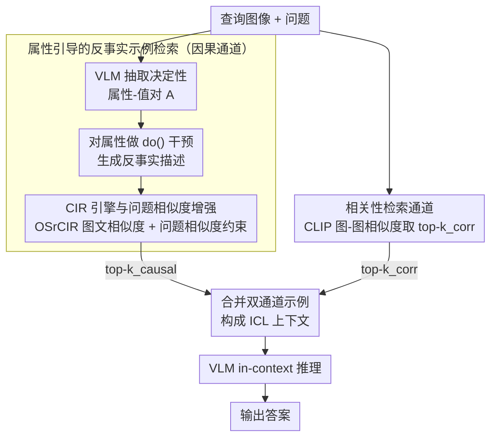

# Retrieving Counterfactuals Improves Visual In-Context Learning

**会议**: CVPR 2026  
**arXiv**: [2603.16737](https://arxiv.org/abs/2603.16737)  
**代码**: [github.com/gzxiong/CIRCLES](https://github.com/gzxiong/CIRCLES)  
**领域**: 因果推理  
**关键词**: visual in-context learning, counterfactual reasoning, composed image retrieval, vision-language models, demonstration selection

## 一句话总结

提出 CIRCLES 框架，通过属性引导的 composed image retrieval 检索反事实示例，构建因果+相关性双通道 in-context demonstration，显著提升 VLM 的细粒度视觉推理能力。

---

## 研究背景与动机

**VLM 在细粒度推理上的短板**：视觉语言模型（VLM）在 VQA、图像描述等任务上表现出色，但在需要区分细微视觉属性的场景（如鸟类分类中的羽毛颜色差异）中往往依赖虚假相关性，难以准确推理。

**In-Context Learning 的关键瓶颈**：ICL 通过少量示例让 VLM 快速适应新任务，但其效果高度依赖于示例的选取策略——示例质量直接决定推理质量。

**现有检索方法的系统性缺陷**：RICES 等基于相似度的检索方法倾向于选择视觉相似但共享无关混淆属性的示例，导致模型学习表面相关性而非真正的因果关系。

**相关与因果的本质区别**：相似度检索找到"长得像"的图片，但无法告诉模型"改变哪个属性会改变答案"——这正是因果推理的核心。

**信息稀缺场景的脆弱性**：当训练集中相关样本有限时，纯相似度检索的性能急剧下降，缺乏鲁棒性。

**CIR 技术的新应用机遇**：Composed Image Retrieval 原本用于检索任务本身，本文首次将其作为因果干预工具，为 ICL 构建反事实示例。

---

## 方法详解

### 整体框架

CIRCLES（Composed Image Retrieval for Causal Learning Example Selection）由三个模块组成：(1) 基于属性引导 CIR 的因果理解通道；(2) 基于标准图像相似度的相关性理解通道；(3) 双通道融合的检索增强推理。给定查询图像和问题，两个通道分别检索 $k_{\text{causal}}$ 和 $k_{\text{corr}}$ 个示例，合并后作为 ICL 上下文输入 VLM 进行推理。

### 关键设计

**1. 属性引导的反事实示例检索：让模型看到"只改一个属性，答案就跟着变"**

VLM 在细粒度任务上栽跟头，根子在于它分不清"哪个属性真正决定标签"，于是抓住共现的无关属性当捷径。这条通道用反事实干预正面打击这个痛点：先让 VLM 从查询图像里抽出一组决定性的属性-值对 $\mathcal{A} = \{a_1, \dots, a_m\}$（比如一张鸟的图像，抽出"喙形=尖""羽色=红""体型=小"），再对每个属性 $a_i$ 采样一个替代值 $v_i'$，让 VLM 写出"其他不变、只把 $a_i$ 换成 $v_i'$"的反事实描述 $c^{\text{do}(a_i=v_i')}$（如"羽色换成蓝"）。检索时用 CLIP 算候选图像与该描述的图文相似度 $s_j^{\text{img}}$，再叠加一项问题-问题语义相似度作为约束，综合排序取 top-k。这一步本质上是一次 $\text{do}(\cdot)$ 干预：把单个属性的因果效应从共现噪声里剥出来，模型在上下文里直接看到"改这个属性 → 标签随之变"的成对对比，而不是又被塞进一张"长得像但抓错重点"的图。

**2. 相关性检索通道：补回反事实示例丢掉的全局视觉语境**

反事实示例聚焦的是属性差异，代价是它们往往各自只突出一处局部变化，缺乏对整体视觉模式的覆盖。CIRCLES 因此并联一条标准的相关性通道，直接用 CLIP 图像-图像余弦相似度 $s_j^{\text{corr}} = \mathbf{z}_q^{I\top} \mathbf{z}_j^I$ 取最相似的 $k_{\text{corr}}$ 个示例，提供识别和定位所需的全局上下文。两条通道形成分工：因果通道负责"哪个属性重要"，相关性通道负责"整体长什么样"，两路检索结果合并后一起作为 ICL 上下文喂给 VLM。

**3. CIR 引擎与问题相似度增强：保证反事实图像既真实又切题**

反事实描述能否落地成高质量示例，取决于背后的 composed image retrieval 引擎。CIRCLES 选用零训练的 OSrCIR：它直接以"查询图像 + 修改文本"为条件生成目标描述，比 CIReVL 那种"先整体描述、再编辑文本"的两段式更精细，在 CUB 上带来约 5.4% 的准确率提升。但纯图文检索可能找到视觉上对、推理任务却跑偏的图，于是这里再加一项问题-问题文本相似度 $s_j^{\text{txt}} = \mathbf{z}_q^{Q\top} \mathbf{z}_j^Q$，把检索锁定在与原始任务同源的样本上——这一项在 OK-VQA 这类问题高度多样的数据集上单独贡献了高达 14.3% 的 EM 提升。

---

## 损失函数与训练策略

CIRCLES 是一个 **无训练（training-free）** 框架：

- 不对 VLM 做任何微调或梯度更新
- CLIP 编码器冻结，仅用于预计算嵌入
- CIR 模块（OSrCIR）同样无需训练
- 所有计算在推理时完成：属性提取 → 反事实描述生成 → 检索 → ICL 推理
- 训练集样本的 CLIP 嵌入可预计算存储，推理开销主要来自 VLM 的属性提取和描述生成调用

---

## 实验关键数据

**表1：主实验结果（4个数据集 × 4个模型）**

| 模型 | 方法 | CUB Acc | Flowers Acc | OK-VQA EM | VizWiz EM | 平均 EM |
|------|------|---------|-------------|-----------|-----------|---------|
| Gemma3-4B | RICES | 65.40 | 86.70 | 26.65 | 56.08 | 58.71 |
| Gemma3-4B | **CIRCLES** | **71.97** | **93.32** | **31.27** | **57.61** | **63.54** |
| Gemma3-12B | RICES | 76.37 | 96.44 | 36.86 | 73.98 | 70.91 |
| Gemma3-12B | **CIRCLES** | **77.03** | **97.77** | **37.75** | **74.30** | **71.71** |
| Qwen2.5-VL-3B | RICES | 72.26 | 93.06 | 42.57 | 70.80 | 69.67 |
| Qwen2.5-VL-3B | **CIRCLES** | **74.89** | **94.70** | **43.24** | **72.93** | **71.44** |
| Qwen2.5-VL-7B | RICES | 82.15 | 98.83 | 43.66 | 73.79 | 74.61 |
| Qwen2.5-VL-7B | **CIRCLES** | **82.17** | **98.99** | **43.54** | **77.63** | **75.58** |

**表2：问题相似度项的消融（OK-VQA EM）**

| 模型 | 无 Q-Q 相似度 | 有 Q-Q 相似度 | 相对提升 |
|------|--------------|--------------|----------|
| Gemma3-4B | 27.72 | 31.27 | +12.8% |
| Gemma3-12B | 33.02 | 37.75 | +14.3% |
| Qwen2.5-VL-3B | 41.12 | 43.24 | +5.2% |
| Qwen2.5-VL-7B | 40.80 | 43.54 | +6.7% |

**其他关键发现**：

- 信息稀缺实验：训练集移除 75% 样本时，CIRCLES 相对 RICES 在 Gemma3-4B 上优势从 10.05% 扩大到 16.28%
- CIR 方法对比：OSrCIR vs CIReVL，准确率相对提升 5.39%-5.56%
- 预算分配：总预算 32 示例时，CIR 16 + IR 16 为最优配置；少预算时宜广撒属性，多预算时宜聚焦少数属性

---

## 亮点与洞察

- **因果视角引入 ICL**：首次将因果干预思想系统性地融入 VLM 的 in-context 示例选择，从"找相似"升级为"找对比"
- **无需训练**：整个框架 training-free，即插即用于任意 VLM，实用性极强
- **小模型收益显著**：对内部知识有限的小模型（Gemma3-4B、Qwen2.5-VL-3B）提升尤为突出（平均 EM 提升 ~8%），说明反事实示例有效补偿了模型能力不足
- **信息稀缺下的鲁棒性**：数据越少，CIRCLES 相对优势越大——这在实际应用中极有价值
- **可解释性增强**：反事实示例直观展示"改变什么→结果怎么变"，让 ICL 过程更透明

---

## 局限性

- **推理开销增加**：每个查询需要调用 VLM 提取属性并生成反事实描述，增加了推理时间和 API 调用成本
- **属性提取质量依赖 VLM**：如果 VLM 本身无法准确识别关键属性，整个框架的因果推理基础就不牢靠
- **非严格因果推断**：论文明确承认 CIRCLES 并非形式化的因果识别（causal identification），而是近似干预——当属性间存在复杂交互时可能失效
- **在大模型上增益递减**：Qwen2.5-VL-7B 上的提升已较为有限，说明强模型内部已具备一定的因果推理能力
- **仅评估分类和 VQA**：缺乏在更复杂的生成任务（如 image captioning、visual grounding）上的验证

---

## 相关工作与启发

- **RICES / MUIER / MMICES** 是主要基线，均基于相似度检索，未考虑因果结构——CIRCLES 通过引入反事实维度实现差异化
- **Composed Image Retrieval（CIR）** 领域的 CIReVL、OSrCIR 被创新性地从"检索任务本身"转为"因果干预工具"——这种"老技术新用法"的思路值得借鉴
- **启发**：该范式可推广到其他需要 ICL 的场景（如 few-shot NLP、tool-use agent），核心思想是用对比/反事实示例替代纯相似度示例，让模型学到"变化→影响"而非"看起来像→答案也像"

---

## 评分

| 维度 | 评分 |
|------|------|
| 新颖性 | ⭐⭐⭐⭐ |
| 技术深度 | ⭐⭐⭐⭐ |
| 实验充分度 | ⭐⭐⭐⭐ |
| 实用价值 | ⭐⭐⭐⭐ |

<!-- RELATED:START -->

## 相关论文

- [\[CVPR 2026\] MaskDiME: Adaptive Masked Diffusion for Precise and Efficient Visual Counterfactual Explanations](maskdime_adaptive_masked_diffusion_for_precise_and_efficient_visual_counterfactu.md)
- [\[NeurIPS 2025\] Do-PFN: In-Context Learning for Causal Effect Estimation](../../NeurIPS2025/causal_inference/do-pfn_in-context_learning_for_causal_effect_estimation.md)
- [\[NeurIPS 2025\] Cyclic Counterfactuals under Shift–Scale Interventions](../../NeurIPS2025/causal_inference/cyclic_counterfactuals_under_shift-scale_interventions.md)
- [\[ICML 2025\] RATE: Causal Explainability of Reward Models with Imperfect Counterfactuals](../../ICML2025/causal_inference/rate_causal_explainability_of_reward_models_with_imperfect_counterfactuals.md)
- [\[ICCV 2025\] A Visual Leap in CLIP Compositionality Reasoning through Generation of Counterfactual Sets](../../ICCV2025/causal_inference/a_visual_leap_in_clip_compositionality_reasoning_through_gen.md)

<!-- RELATED:END -->
