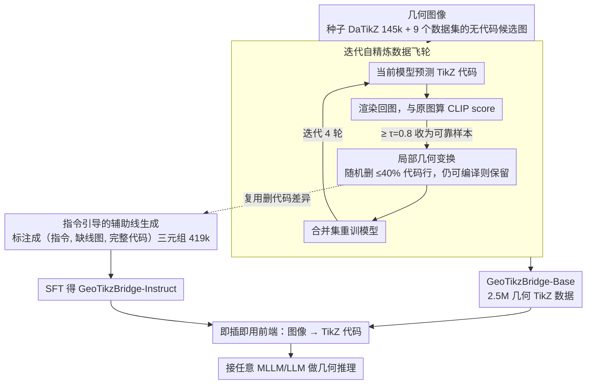

# GeoTikzBridge: Advancing Multimodal Code Generation for Geometric Perception and Reasoning

**会议**: CVPR 2026  
**arXiv**: [2603.22687](https://arxiv.org/abs/2603.22687)  
**代码**: 有（公开）  
**领域**: 代码智能  
**关键词**: 几何感知、TikZ代码生成、多模态推理、辅助线生成、图像到代码

## 一句话总结
GeoTikzBridge 通过构建最大的 2.5M 图像-TikZ 代码数据集和首个辅助线指令数据集，训练出能精准重建几何图形的代码生成模型，并可作为即插即用模块增强任意 MLLM/LLM 的几何推理能力。

## 研究背景与动机

**领域现状**：多模态大语言模型（MLLMs）在跨模态感知和推理方面取得了长足进步，但在几何问题上仍面临挑战。几何问题需要整合细粒度的视觉感知和结构化符号推理。现有的 Image-to-Code 方法主要集中在 Web UI→HTML/CSS 或图表→Python，很少涉及几何内容。在数学推理方面，现有方法主要依赖文本推理，忽视了几何可视化推理中关系传递的需求。

**现有痛点**：MLLMs 在局部几何感知上表现有限，难以精确解析线段关系、角度大小、形状约束等细粒度视觉细节。这主要是因为：(1) 缺乏大规模几何图像-代码数据集（DaTikZ 只有 145k 样本且几何样本有限）；(2) 模型对细微几何变化的建模不够充分。

**核心矛盾**：一方面几何推理需要对图形结构有精确的符号化表征，另一方面现有数据和方法无法为 MLLM 提供足够的几何感知训练信号。TikZ 代码比 SVG 更适合几何推理，因为其代码语法本身记录了几何构造的逻辑步骤和依赖关系。

**本文目标** (1) 如何构建足够大的几何图像-TikZ 代码数据集来训练模型？(2) 如何让模型关注到局部几何细节而非笼统地生成代码？(3) 如何将几何感知能力迁移到下游推理任务中？

**切入角度**：作者提出迭代自精炼策略来扩展数据集、局部几何变换策略来增强细节感知，以及指令引导的辅助线生成来赋能推理。  

**核心 idea**：通过迭代数据扩展+局部代码变换构建 2.5M 级几何 TikZ 数据集，训练出可作为即插即用推理模块的几何代码生成模型。

## 方法详解

### 整体框架
GeoTikzBridge 想解决的核心问题是：让模型把一张几何图精确地"翻译"成可编译的 TikZ 代码，再用这份符号化代码去支撑下游几何推理。整条 pipeline 分三段串起来：先用一个自举式的数据飞轮把 145k 种子数据滚到 2.5M，训练出基础感知模型 GeoTikzBridge-Base；再在此基础上用辅助线指令数据微调出 GeoTikzBridge-Instruct，让它能按指令往图里补辅助线；最后把这两个模型当成无需训练的即插即用感知前端，接到任意 MLLM/LLM 前面，把"看图"换成"读代码"来增强几何推理。输入始终是几何图像，输出是可编译的 TikZ 代码。

### 关键设计

**1. 迭代自精炼数据飞轮：用模型自己的产出滚出 2.5M 数据**

几何图像-代码配对数据极度稀缺（最大的 DaTikZ 也只有 145k，且几何样本有限），人工标注 TikZ 代码成本又高，这是整个方向的卡点。作者的做法是让模型自举：以 DaTikZ 作种子集 $\mathcal{D}_0$ 训练初始模型 $M_0$，再从 9 个公开几何数据集收集大量无代码的候选图像。每一轮迭代分三步推进——先用当前模型给候选图预测 TikZ 代码，把渲染图和原图算 CLIP score，只有相似度超过阈值 $\tau=0.8$ 的才算可靠样本，收进自精炼集 $\mathcal{D}_k^R$；接着对这批可靠样本做局部代码变换得到增强集 $\mathcal{D}_k^T$；最后在合并集 $\mathcal{D}_k = \mathcal{D}_{k-1} \cup \mathcal{D}_{k-1}^R \cup \mathcal{D}_{k-1}^T$ 上重训模型。CLIP score 的硬阈值是这个飞轮不发散的关键——它把模型自己生成的噪声样本挡在门外，只让"渲染回去确实像原图"的高置信样本进入训练，于是模型每强一轮就能可靠标注更多图，4 轮迭代后从 145k 滚到 2.5M。

**2. 局部几何变换：逼模型盯住每一个几何元素**

复杂图像里模型容易"偷懒"，漏画或幻觉出关键线段、角度，因为它倾向于记住整段代码的文本模式而非真正解析每个几何元素是否存在。局部代码变换正是冲着这个毛病来的：对一份 TikZ 代码随机删掉 1 到 n 行（删除比例不超过 40%），只要删完仍能编译，就保留这份残缺代码 $\tilde{C}$ 和它新渲染出的图 $\tilde{I}$ 作为一对新样本。这相当于往代码里注入结构化噪声——图变了，代码就必须跟着变，模型再也不能靠背诵固定文本序列蒙混，只能学会"图里有这条线 ↔ 代码里有这一行"的精确对应。这条策略直接让代码重复预测率下降了 15%，泛化和编译鲁棒性同步提升。

**3. 指令引导的辅助线生成：把"删代码"反过来当成"加辅助线"的监督信号**

很多几何题不画辅助线根本无从下手，但现有 MLLM 生成的辅助线往往不准，而专门标注"该加哪条辅助线"的数据又几乎没有。作者的巧思是复用设计 2 的代码变换：对 $\mathcal{D}_K$ 里的样本删几行代码得到变换后图像，那么"从变换后图回到原图"天然就是一次"添加几何元素"的过程，再用 Qwen2.5-VL-72B 把这个增删差异标注成自然语言指令 $Q$，并用 Doubao 做 VLM 过滤剔除低质样本。最终每条数据是一个三元组（指令 $Q'$、变换后图像 $\tilde{I}'$、原始代码 $C'$），共 419k 条，模型学的就是"看着缺辅助线的图、读着指令、补全成带辅助线的完整代码"。GeoTikzBridge-Instruct 在 Base 模型上做 SFT 得到——一次代码删除操作，既服务了设计 2 的鲁棒性增强，又免费产出了辅助线监督数据。

### 损失函数 / 训练策略
训练目标就是标准的因果自回归生成 $\mathcal{L}_{\text{gen}} = -\sum_i \log P_M(c_i | I, c_{<i})$，即在给定图像和已生成代码前缀的条件下最大化下一 token 的对数似然。8B 模型做全参数 SFT（学习率 4e-7），38B 模型改用 LoRA 微调（学习率 1e-4），底层用 DeepSpeed ZeRO-3 加 Flash Attention，8 卡 H100 上 8B 约 96 GPU 小时、38B 约 488 GPU 小时，推理用 temperature=0 的贪心解码保证代码确定性。

## 实验关键数据

### 主实验 — 图像到 TikZ 生成

| 方法 | DaTikZ CLIP-S↑ | DaTikZ FID↓ | MathVista-GPS CLIP-S↑ | EDU CLIP-S↑ |
|------|----------------|-------------|----------------------|------------|
| Qwen2.5-VL-72B | 0.795 | 49.8 | 0.858 | 0.781 |
| InternVL3-78B | 0.747 | 62.7 | 0.860 | 0.801 |
| FigCodifier-8B | 0.785 | 45.8 | 0.884 | 0.675 |
| **GeoTikzBridge-Base-8B** | **0.804** | 43.6 | **0.895** | **0.795** |
| **GeoTikzBridge-Base-38B** | **0.813** | **39.7** | **0.915** | **0.821** |

### 下游数学推理提升

| 基线 VLM | MathVista-GPS | GAOKAO-MM-Math |
|----------|--------------|----------------|
| GLM4.5-V-106B | 0.745 | 0.613 |
| +GeoTikzBridge-Base | **0.764** (+1.9%) | **0.663** (+5.0%) |
| Skywork-OR1-32B (LLM)+TikZ | **0.861** | 0.663 |
| GPT-OSS-120B (LLM)+TikZ | **0.880** | 0.688 |

### 消融实验

| 配置 | MathVista-GPS 准确率 |
|------|---------------------|
| InternVL3.5-38B 基线 | 0.688 |
| + TikZ 代码 + 辅助线图像 | 0.697 |
| + 辅助线图像 + 辅助线代码 | 0.707 |
| + TikZ 代码 + 辅助线图像 + 代码 | **0.736** |

### 关键发现
- LLM + TikZ 代码的组合通常优于 VLM 直接看图，这归因于 VLM 在视觉-语言对齐训练中的灾难性遗忘损害了语言推理能力
- 辅助线以 TikZ 代码形式比渲染图像形式更有效，表明符号化表征对推理更关键
- 局部代码变换策略对编译成功率和 CLIP score 都有显著提升，代码重复率下降 15%
- GeoTikzBridge 在几何代码感知上超越了 GPT-5.0

## 亮点与洞察
- 把"代码变换"同时用于两个目的非常巧妙：一是作为数据增强提高模型鲁棒性，二是作为辅助线数据的自动构造方法。一种操作解决两个问题，设计非常优雅
- LLM + TikZ 代码优于 VLM 直接看图的实验发现很有启发性。它暗示了一种新的多模态推理范式：不让推理模型直接看图，而是先用专门的感知模型将图像转化为可执行的符号表征，再交给纯语言推理模型。这相当于实现了"感知-推理"解耦
- 迭代自精炼的数据飞轮效应值得借鉴：初始小数据→训练弱模型→弱模型标注更多数据→过滤+增强→训练更强模型

## 局限与展望
- 目前仅限于几何图形，尚未扩展到电路图、工程图等技术性示意图领域
- 辅助线生成依赖 VLM 先判断是否需要辅助线，若判断错误则整个管线失效
- 数据集主要覆盖平面几何和解析几何，立体几何和拓扑学图形的覆盖较少
- TikZ 代码的编译成功率虽达 95%+，但仍有约 5% 的失败情况可能影响实际部署

## 相关工作与启发
- **vs FigCodifier**: 同为图像到 TikZ 的模型，但 FigCodifier 只有 8B 参数且训练数据有限。GeoTikzBridge 通过 16 倍的数据量和局部变换策略全面超越
- **vs DaTikZ 数据集**: DaTikZ 是现有最大的图像-TikZ 数据集（145k），但几何样本有限。GeoTikz-Base 达到 2.5M，且专注几何领域
- **vs 数学推理模型 (R1系列)**: 这些模型擅长文本推理但无法直接处理几何图像。GeoTikzBridge 通过将图像转为 TikZ 代码"桥接"了 LLM 的推理能力和视觉感知

## 评分
- 新颖性: ⭐⭐⭐⭐ 几何感知→TikZ代码→推理提升的完整链路设计新颖
- 实验充分度: ⭐⭐⭐⭐⭐ 覆盖图像到代码、下游推理、辅助线生成多个维度，消融详尽
- 写作质量: ⭐⭐⭐⭐ 结构清晰，框架图直观
- 价值: ⭐⭐⭐⭐⭐ 2.5M 数据集+即插即用推理模块对几何推理领域有很大实用价值

<!-- RELATED:START -->

## 相关论文

- [\[CVPR 2026\] MM-ReCoder: Advancing Chart-to-Code Generation with Reinforcement Learning and Self-Correction](mm-recoder_advancing_chart-to-code_generation_with_reinforcement_learning_and_se.md)
- [\[ACL 2026\] OmniDiagram: Advancing Unified Diagram Code Generation via Visual Interrogation Reward](../../ACL2026/code_intelligence/omnidiagram_advancing_unified_diagram_code_generation_via_visual_interrogation_r.md)
- [\[ICLR 2026\] Breaking the SFT Plateau: Multimodal Structured Reinforcement Learning for Chart-to-Code Generation](../../ICLR2026/code_intelligence/breaking_the_sft_plateau_multimodal_structured_reinforcement_learning_for_chart-.md)
- [\[ACL 2026\] ReCode: Reinforcing Code Generation with Reasoning-Process Rewards](../../ACL2026/code_intelligence/recode_reinforcing_code_generation_with_reasoning-process_rewards.md)
- [\[ACL 2026\] From Charts to Code: A Hierarchical Benchmark for Multimodal Models](../../ACL2026/code_intelligence/from_charts_to_code_a_hierarchical_benchmark_for_multimodal_models.md)

<!-- RELATED:END -->
