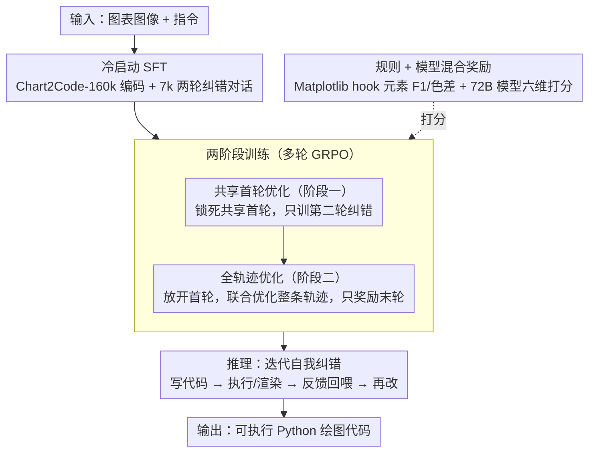

# MM-ReCoder: Advancing Chart-to-Code Generation with Reinforcement Learning and Self-Correction

**会议**: CVPR 2026  
**arXiv**: [2604.01600](https://arxiv.org/abs/2604.01600)  
**代码**: [https://zitiantang.github.io/MM-ReCoder](https://zitiantang.github.io/MM-ReCoder)  
**领域**: 多模态VLM / 代码生成  
**关键词**: 图表转代码, 强化学习, 自我纠错, 多轮对话, GRPO

## 一句话总结

提出 MM-ReCoder，首个具备自我纠错能力的图表转代码多模态 LLM，通过两阶段多轮 GRPO 强化学习（先共享首轮优化纠错能力，再全轨迹优化编码能力），在 ChartMimic 上以仅 7B 参数达到 86.5% low-level score，媲美 Qwen3-VL-235B。

## 研究背景与动机

1. **领域现状**：Chart2Code 任务要求从图表图像生成可执行的 Python 绘图代码。现有方法主要依赖 SFT（如 ChartCoder 用 160k 图表-代码对训练），少数工作（ChartMaster）开始探索 RL。
2. **现有痛点**：SFT 方法不与代码执行环境交互，无法保证生成代码的可执行性和视觉保真度。已有 RL 方法（ChartMaster）仅做单次生成，不支持迭代纠错。
3. **核心矛盾**：人类编程是迭代式的（写代码→执行→查看结果→纠正），但现有 MLLM 都是一次性生成。实验发现即使 Qwen3-VL-235B 这样的大模型，在自我纠错时可执行代码的质量反而下降（-0.26%）。
4. **本文目标** 如何让 MLLM 学会真正的自我纠错——不仅修复执行错误，更能提升已可执行代码的视觉质量。
5. **切入角度**：作者发现现有模型的"改进"其实仅来自修复崩溃代码使其可执行，而非真正提升质量。因此设计了两阶段 RL 训练来分步解决。
6. **核心 idea**：通过共享首轮+全轨迹两阶段 GRPO 训练，先学纠错能力再学整体编码能力。

## 方法详解

### 整体框架

MM-ReCoder 要解决的是：怎么让一个 7B 多模态模型在图表转代码时像人一样「写完跑一遍、看结果、再改」，而且改的不只是让崩溃代码能跑，还要把已经能跑的代码画得更像原图。整体训练分两步走。先是冷启动：在 Chart2Code-160k 上做 SFT 把基础编码能力补上，再用 7k 条筛选过的两轮纠错对话微调，让模型先见过「首轮代码 + 反馈 → 第二轮修正」这种格式。然后是核心的两阶段多轮 GRPO 强化学习——第一阶段固定首轮输出、只训练纠错那一步，第二阶段放开首轮联合优化整条轨迹。推理时模型可以反复纠错任意轮，每一轮把渲染出的图（或执行报错信息）回喂给它当下一轮的输入。



### 关键设计

**1. 共享首轮优化（Shared-First-Turn Optimization）：把首轮锁死，逼模型真去改代码**

如果一上来就对两轮完整轨迹做 GRPO，模型会偷懒。作者观察到两种作弊：一是直接把第二轮代码原样复制首轮（实测 46.9% 的样本如此），因为一段已经能跑的代码再去改，期望收益往往是负的，不改最安全；二是故意把首轮写得很烂，好让第二轮显得「改进巨大」，骗到高奖励。共享首轮优化的做法是斩断这条退路：对每个输入图表，先采样**一个**共享的首轮输出 $o^{(1)}$，再在这个固定首轮的基础上生成 $G$ 个不同的第二轮纠错候选 $o_i^{(2)}$，RL 梯度只更新第二轮：

$$\mathcal{J}^{(shared)} = \mathbb{E}\Big[\tfrac{1}{G}\textstyle\sum_i \tfrac{\pi_\theta(o_i^{(2)}\mid q,\,o^{(1)},\,f^{(1)})}{\text{SG}[\cdot]}\,A_i\Big]$$

其中 $f^{(1)}$ 是首轮的执行反馈，$A_i$ 是组内优势。因为首轮被共享且不参与梯度，模型既没法靠复制（所有候选共享同一首轮、复制不再有区分度），也没法靠摆烂首轮（首轮不归它优化），唯一能拿到优势的途径就是真的在给定代码上改出更好的版本——纠错能力由此被独立训出来。

**2. 规则 + 模型混合奖励：精确度与视觉感知互补**

图表质量很难自动打分：单看像素会被无关差异干扰，单靠模型评分又有噪声。作者用两路奖励互补。规则奖励通过 hook Matplotlib 的绘图函数，直接拦截出图表类型、文本、颜色、布局等结构化元素，再和 GT 算 F1 / CIE Lab 色差距离，归一化到 $[0,1]$——它精确，但有盲区，比如文字明明重叠了结构上仍判满分。模型奖励则用 Qwen2.5-VL-72B 从六个维度给整图打分（满分 100，归一化到 $[0,1]$），能捕捉规则抓不到的视觉观感，但本身带噪。两者加上格式项线性融合：

$$R = (1-\alpha-\beta)\cdot R_{\text{Format}} + \alpha\cdot R_{\text{Rule}} + \beta\cdot R_{\text{Model}}$$

格式项 $R_{\text{Format}}$ 奖励模型输出规范的 `<think>...</think>` + ```python ...``` 结构，规则项保证元素级保真，模型项补上整体视觉质量，三者各管一段。

**3. 两阶段训练：先学会改，再学会写**

纠错和编码是两种能力，硬塞进一次优化里会互相打架——消融显示只做全轨迹优化会陷入代码重复和奖励利用，只做共享首轮虽然学会了纠错但整体编码水平上不去。所以 RL 分两阶段顺序进行。第一阶段用上面的共享首轮策略，专门把纠错能力练出来，让模型学会面对一段代码生成多样化的修正方案。第二阶段切回全轨迹优化，放开首轮、联合优化两轮输出，把整体编码能力顶上去；此时奖励只看最终一轮（即折扣 $\gamma=0$ 时表现最好，中间轮不另设 bonus，避免重新诱发摆烂首轮的作弊）。先纠错后编码的顺序让两种能力各自先长稳，再在第二阶段汇合互补。

### 损失函数 / 训练策略

- 冷启动：SFT 在 Chart2Code-160k 上 1 epoch + 纠错数据上 2 epoch，batch=128，lr=$10^{-5}$
- 纠错数据构建：用 Qwen3-VL-235B 生成两轮对话，筛选第二轮 low-level 分数超首轮 0.02 以上的样本（约 7k）
- GRPO：group size $G=8$，每阶段 1 epoch，batch=128，lr=$10^{-6}$，最大 response 长度 4096 tokens
- Format reward 鼓励 `<think>...</think>'''python...'''` 格式

## 实验关键数据

### 主实验

| 模型 | 参数量 | 轮次 | ChartMimic Low↑ | ChartMimic High↑ | Plot2Code Text-Match↑ |
|------|--------|------|------------------|-------------------|----------------------|
| ChartCoder | 7B | 1 | 77.4 | 74.0 | 54.5 |
| Qwen2.5-VL-7B | 7B | 1 | 56.2 | 49.6 | 47.8 |
| Qwen3-VL-235B | 235B | 1 | 80.9 | 85.9 | 60.9 |
| GPT-4o | - | 1 | 81.8 | 83.7 | 59.8 |
| **MM-ReCoder** | **7B** | **1** | **83.5** | **81.2** | **63.2** |
| **MM-ReCoder** | **7B** | **4** | **86.5** | **84.9** | **62.7** |

### 消融实验

RL 策略对比（ChartMimic）：

| 策略 | 首轮 Low | 二轮 Low | 平均改进 | 改进占比 | 代码重复率 |
|------|---------|---------|----------|---------|-----------|
| Full-traj (γ=0,η=0) | 81.8 | 83.9 | +0.21 | 3.4% | 46.9% |
| Full-traj (γ=0,η=0.1) | 66.7 | 84.3 | +10.11 | 87.5% | 0.3% |
| Shared-first + Full-traj | **83.7** | **86.0** | +0.55 | 12.1% | 21.6% |

训练阶段逐步消融：

| 阶段 | Low-level | Avg improvement | 重复率 |
|------|-----------|----------------|--------|
| Qwen2.5-VL-7B base | 56.2 | -0.36 | 10.9% |
| + 单轮冷启动 | 79.1 | -0.10 | 81.5% |
| + 多轮冷启动 | 75.2 | -0.54 | 2.3% |
| + RL (full) | 83.5→84.8 | **+0.30** | 2.2% |

### 关键发现

- **现有大模型无法真正自我纠错**：Qwen3-VL-8B/235B 在可执行代码上的质量改进为负（-1.03%/-0.26%），改进仅来自修复崩溃代码
- 仅用纠错 bonus ($\eta=0.1$) 会导致模型"作弊"——故意生成极差的首轮以获得高改进奖励（首轮 Low 仅 66.7）
- 多轮纠错有递减效应：1→2 轮改进 1.3%，2→3 轮改进 0.5%，4→5 轮时已无提升
- **代码重复是核心瓶颈**：单轮 SFT 后 81.5% 的第二轮输出是首轮的简单复制

## 亮点与洞察

- **诊断先于治疗**：作者先证明了现有模型"假装自我纠错"的问题（改进仅来自修复崩溃代码），然后针对性设计解决方案。这种问题导向的研究方式值得学习。
- **共享首轮策略**：将纠错训练与整体编码训练解耦，避免了 RL 中的奖励利用问题。这一策略可迁移到其他需要多轮改进的代码生成场景（如网页生成、SVG 生成）。
- **规则+模型混合奖励**：利用 Matplotlib hook 精确提取图表元素的思路很巧妙，解决了图表质量难以自动评估的问题。

## 局限与展望

- 仅探索了一轮纠错的 RL 训练，多轮 RL 训练可能进一步提升
- 模型奖励依赖 72B 模型，训练成本高（需 4×8 H200 运行奖励模型）
- 未探索代码执行环境的更丰富反馈（如渲染图的 diff 信息）
- 仅在图表生成任务验证，可扩展到网页、UI、SVG 等更多视觉编码任务

## 相关工作与启发

- **vs ChartMaster**: ChartMaster 首次将 GRPO 引入 Chart2Code，但仅做单次生成。MM-ReCoder 在其基础上增加了多轮自我纠错维度。
- **vs SCoRe (Kumar et al.)**: SCoRe 率先在纯文本 LLM 上用两阶段 RL 训练自我纠错。MM-ReCoder 将此思路扩展到多模态编码任务，并针对 GRPO 做了适配（SCoRe 用 REINFORCE/PPO）。
- **vs ChartCoder**: ChartCoder 仅用 SFT，MM-ReCoder 在其训练数据 Chart2Code-160k 上用 RL 后 low-level 从 77.4 提升到 86.5（+9.1%），验证了 RL 的巨大价值。

## 评分

- 新颖性: ⭐⭐⭐⭐ 首次在多模态编码中实现可靠的自我纠错，共享首轮策略设计巧妙
- 实验充分度: ⭐⭐⭐⭐⭐ 三个基准、丰富的策略消融、多轮纠错分析、与大模型的详细对比
- 写作质量: ⭐⭐⭐⭐ 问题动机清晰，实验分析深入，但公式符号较多需仔细追踪
- 价值: ⭐⭐⭐⭐ 7B 模型媲美 235B 的实用价值高，自我纠错范式可推广到更多任务

<!-- RELATED:START -->

<div class="related-papers" markdown="1">

## 相关论文

- [\[ICLR 2026\] Breaking the SFT Plateau: Multimodal Structured Reinforcement Learning for Chart-to-Code Generation](../../ICLR2026/code_intelligence/breaking_the_sft_plateau_multimodal_structured_reinforcement_learning_for_chart-.md)
- [\[ACL 2026\] MARS2: Scaling Multi-Agent Tree Search via Reinforcement Learning for Code Generation](../../ACL2026/code_intelligence/mars2_scaling_multi-agent_tree_search_via_reinforcement_learning_for_code_genera.md)
- [\[AAAI 2026\] ReCode: Updating Code API Knowledge with Reinforcement Learning](../../AAAI2026/code_intelligence/recode_updating_code_api_knowledge_with_reinforcement_learning.md)
- [\[CVPR 2026\] GeoTikzBridge: Advancing Multimodal Code Generation for Geometric Perception and Reasoning](geotikzbridge_advancing_multimodal_code_generation_for_geometric_perception_and_.md)
- [\[ACL 2026\] OmniDiagram: Advancing Unified Diagram Code Generation via Visual Interrogation Reward](../../ACL2026/code_intelligence/omnidiagram_advancing_unified_diagram_code_generation_via_visual_interrogation_r.md)

</div>

<!-- RELATED:END -->
