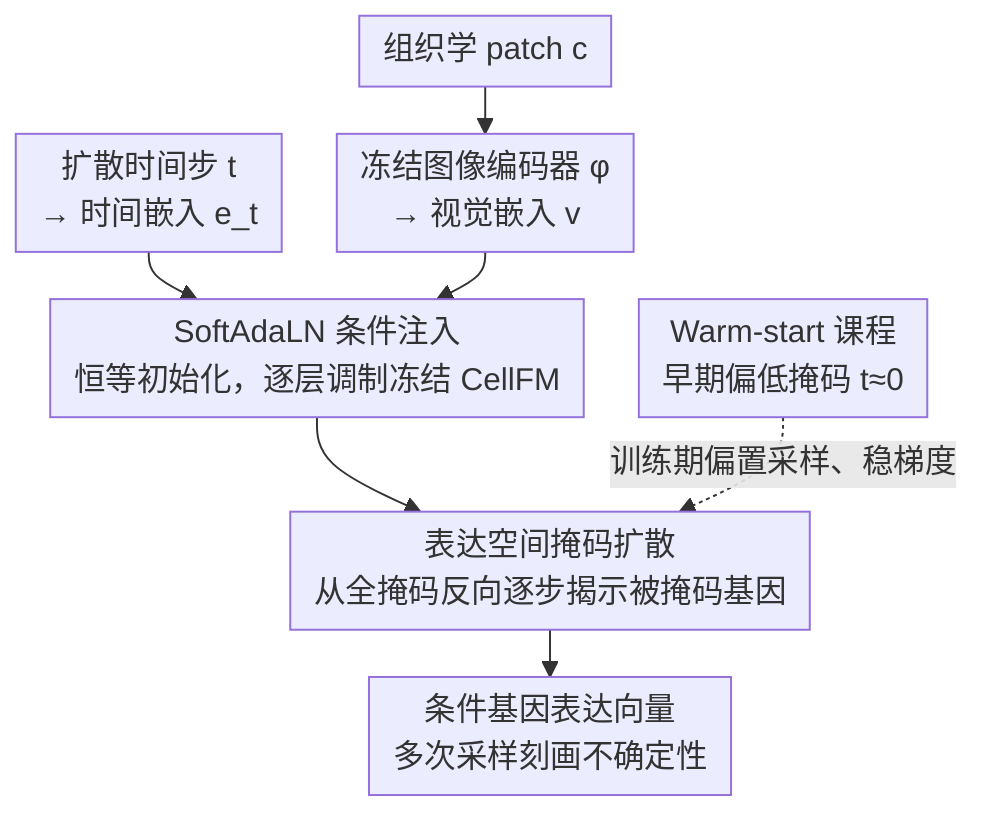

# HINGE: Adapting a Pre-trained Single-Cell Foundation Model to Spatial Gene Expression Generation from Histology Images

**会议**: CVPR 2026  
**arXiv**: [2603.19766](https://arxiv.org/abs/2603.19766)  
**代码**: [https://github.com/donghaifang/HINGE](https://github.com/donghaifang/HINGE)  
**领域**: 生物医学图像 / 生成模型  
**关键词**: 空间转录组学, 单细胞基础模型, 掩码扩散, 组织学条件生成, SoftAdaLN

## 一句话总结
提出HINGE框架，首次将预训练的表达空间单细胞基础模型(sc-FM, CellFM)改装为组织学图像条件的空间基因表达生成器，通过恒等初始化的SoftAdaLN调制轻量注入视觉上下文、表达空间掩码扩散过程对齐预训练目标、warm-start课程稳定训练，在三个ST数据集上达SOTA并保持优越的基因共表达一致性。

## 研究背景与动机

**领域现状**：空间转录组学(ST)可原位测量基因表达，但成本高通量低。从H&E组织学切片(常规获取)直接预测空间基因表达是实用替代方案。

**两类现有方法**：(1) 确定性回归(ST-Net/HisToGene/TRIPLEX)——将组织学patch映射为表达向量，但忽略固有的生物随机性；(2) 条件生成(Stem/STFlow)——建模条件分布更灵活，但不建模基因-基因依赖关系——这些关系仅从组织学图像难以推断。

**单细胞基础模型(sc-FM)的潜力**：scGPT/CellFM等在大规模scRNA-seq上预训练，编码了丰富的基因-基因调控和共表达关系。但它们是纯表达空间模型，缺乏视觉通路。

**四重适配挑战**：(a) **模态鸿沟**——sc-FM无视觉通路；(b) **目标不匹配**——sc-FM用掩码自编码预训练，但扩散模型用高斯噪声扰动全部输入；(c) **组成偏移**——scRNA-seq=单细胞，但ST=混合细胞簇；(d) **有限监督**——ST数据量小+噪声大→全微调易灾难性遗忘。

**核心idea**：冻结sc-FM骨干 + 恒等初始化的SoftAdaLN轻量注入组织学+时间步条件 + 掩码扩散过程对齐掩码自编码预训练 + warm-start课程稳定早期训练。

## 方法详解

### 整体框架
本文要解决的是：把一个在单细胞数据上预训练好的基础模型 CellFM，迁移到"从组织学图像 patch 预测空间基因表达"这个新任务上，又不破坏它已学到的基因关系知识。整体做法是**冻住 CellFM 主干、只插入轻量条件模块**，并把任务包装成一个与 CellFM 预训练方式（掩码自编码）对齐的掩码扩散过程：组织学 patch 经冻结编码器 $\phi$ 得到视觉嵌入，作为条件注入到每层新插入的 SoftAdaLN 模块；扩散在基因表达空间上"逐步揭示被掩码的基因"，反向走完即得到条件基因表达向量。三个设计分别回答：条件怎么注入而不遗忘、扩散过程怎么和预训练对齐、训练初期怎么稳住。

### 关键设计

**1. SoftAdaLN 条件注入：恒等初始化保证"开局不忘"**

迁移的最大风险是小数据集上微调会冲掉预训练的基因关系。SoftAdaLN 的办法是在 CellFM 每个 Transformer 子层（MHA、SGLU）前插一个轻量调制模块，且**初始时让它等于恒等变换**，从 CellFM 原始行为出发再渐进注入组织学信息。具体地，视觉嵌入 $\mathbf{v}=\phi(\mathbf{c})$ 和时间步嵌入 $\mathbf{e}_t$ 拼接后过共享变换 $\mathbf{c}_t = \varphi_{cond}([\mathbf{v}; \mathbf{e}_t])$，再对每个子层做调制：

$$\text{SoftAdaLN}(\mathbf{h}|\mathbf{c}_t) = \text{SoftNorm}(\mathbf{h}) \odot (1+\mathbf{s}(\mathbf{c}_t)) + \boldsymbol{\kappa}(\mathbf{c}_t), \quad \text{SoftNorm}(\mathbf{h}) = (1-\eta)\mathbf{h} + \eta \cdot \tfrac{\mathbf{h}-\mu}{\sigma+\varepsilon}$$

恒等初始化即令 $\eta=0$（SoftNorm 退化为恒等）、$\mathbf{s}=\mathbf{0}$、$\boldsymbol{\kappa}=\mathbf{0}$、门控 $\boldsymbol{\tau}\approx\mathbf{1}$，于是开局精确复现原始 CellFM。训练只更新调制参数 $\{\eta, \theta_\varphi, \theta_s, \theta_\kappa, \theta_\tau\}$，CellFM 与图像编码器全程冻结——参数高效且天然抗遗忘。

**2. 表达空间掩码扩散：让扩散过程"长得像"预训练目标**

标准高斯扩散给每个分量加噪，输入分布和 CellFM 的掩码自编码预训练完全不同，知识迁移受阻。本文改用**掩码扩散**桥接这一鸿沟：前向对基因表达各分量独立施加 Bernoulli 掩码（非高斯噪声），掩码率按功率调度 $\bar{\alpha}_t = (1-t/T)^\zeta$ 递增，$t=0$ 全可见、$t=T$ 全掩码；反向从全掩码 + 全零起步，每步预测被掩码分量、已揭示分量保持不变，逐步还原完整表达。训练只在掩码位置算损失：

$$\mathcal{L}(\theta) = \mathbb{E}\big[w_t \|(1-\mathbf{m}_t) \odot (f_\theta(\mathbf{x}_t, t, \phi(\mathbf{c})) - \mathbf{x}_0)\|_2^2\big]$$

关键在于：输入形式（部分掩码的观测）和监督模式（仅在掩码位置）都与 CellFM 的掩码自编码一致，因此能真正复用预训练知识，而不是从头学。

**3. Warm-start 课程：早期偏向低掩码，稳住梯度**

即便如此，微调初期若直接采高掩码时间步仍易不稳。Warm-start 让采样器在开头几个 epoch 偏向 $t\approx0$（少量基因被掩码），再渐进过渡到均匀采样。低掩码 = 大多数基因可见 = 更接近 CellFM 预训练时见过的输入，从而稳定早期梯度、进一步压制遗忘。

### 一个完整示例（从组织学 patch 到基因表达）
给定一张组织学 patch $\mathbf{c}$：
1. 初始化 $\mathbf{x}_T=\mathbf{0}, \mathbf{m}_T=\mathbf{0}$（全掩码、全零）。
2. 冻结编码器 $\phi$ 提取视觉嵌入 $\mathbf{v}=\phi(\mathbf{c})$，连同当前时间步经 SoftAdaLN 注入每层。
3. 每步采样解掩概率 $\pi_t$ 揭示一批新基因 → 预测这些被掩码基因的表达 → 填入并保持已揭示基因不变。
4. 走完 $T$ 步得到完整基因表达向量。
5. 重新采样掩码轨迹，可得到多个"组织学一致但有差异"的样本（刻画表达的不确定性）。

## 实验关键数据

### 主实验（三个ST数据集）

| 方法 | 类型 | cSCC PCC-50↑ | Her2ST PCC-50↑ | Kidney PCC-50↑ |
|------|------|:---:|:---:|:---:|
| ST-Net | 回归 | 0.548 | 0.439 | 0.327 |
| BLEEP | 回归 | 0.643 | 0.520 | 0.404 |
| TRIPLEX | 回归 | 0.683 | 0.536 | 0.410 |
| MERGE | 回归 | 0.609 | 0.483 | 0.242 |
| Stem | 生成 | 0.676 | 0.559 | 0.388 |
| STFlow | 生成 | 0.678 | 0.543 | 0.391 |
| **HINGE** | **生成** | **0.710** | **0.571** | **0.424** |

HINGE在三个数据集上一致超越所有回归和生成基线。

### 共表达一致性分析
HINGE生成的基因表达在成对基因的Pearson相关矩阵上与真实ST数据的一致性显著高于其他方法→证明sc-FM的基因关系知识被成功保留和转移。

### 空间标记基因表达模式
HINGE在空间标记基因(marker genes)的表达空间分布上更接近真实模式→空间一致性优于基线。

### 消融实验

| 配置 | cSCC PCC-50 | 说明 |
|------|:---:|------|
| 无sc-FM(随机初始化骨干) | 下降显著 | 基因关系知识的价值 |
| 高斯扩散(非掩码) | ~0.68 | 目标不对齐→迁移受阻 |
| 无SoftAdaLN(直接拼接) | 下降 | 粗暴条件注入破坏预训练特征 |
| 无warm-start | 训练不稳定 | 高掩码早期梯度过大 |
| 全微调CellFM(非冻结) | 下降 | 小数据集灾难性遗忘 |
| **完整HINGE** | **0.710** | 所有组件互补 |

### 关键发现
- **sc-FM预训练的价值被量化**：随机初始化 vs 使用CellFM→PCC-50差距明显，且共表达一致性差距更大→sc-FM的基因关系知识确实在条件生成中发挥了核心作用
- **目标对齐的必要性**：掩码扩散 vs 高斯扩散→~3%的PCC差距。虽然看似不大，但在基因共表达分析中差距更为显著→证明"让模型看到与预训练时相似的输入形式"至关重要
- **冻结优于微调**：在有限ST数据上全微调CellFM反而更差→冻结+SoftAdaLN是更优策略
- **恒等初始化的关键性**：非恒等初始化的条件注入破坏预训练行为→渐进适配至关重要

## 亮点与洞察
- **跨模态基础模型改装的通用范式**：HINGE展示了一条清晰的路径——冻结骨干+恒等初始化调制+预训练目标对齐——可将任何纯文本/纯表达的预训练模型改装为条件生成器。这对其他需要跨模态适配的场景(如蛋白质→结构、音频→视觉)有直接启发
- **掩码扩散的生物学直觉**：基因表达的生成过程更像是"逐步揭示各基因的值"而非"从高斯噪声去噪出所有基因"——这与sc-FM的掩码自编码范式天然对齐
- **保留预训练知识>引入新信息**：在有限ST监督下，保持sc-FM学到的基因关系比强行注入组织学信息更重要——这挑战了"更多条件化=更好"的直觉
- **生成模型vs回归模型的优势**：HINGE不仅在PCC上超越回归基线，更重要的是在空间一致性和共表达模式上优势更明显——生成方法能产出更具生物学意义的预测

## 局限与展望
- 当前仅实例化CellFM作为sc-FM骨干——scGPT、scFoundation等其他模型的适配效果待验证
- H&E组织学的分辨率限制了对精细细胞子类型变异的捕捉——更高分辨率成像(如IF)可能释放更多信息
- 三个ST数据集(cSCC/Her2ST/Kidney)规模较小——更大规模数据可能释放更多sc-FM潜力
- 推理需要多次采样取平均——增加了计算成本
- 可探索将HINGE与spatial-aware sc-FM(如scGPT-spatial)结合

## 相关工作与启发
- **vs Stem/STFlow**: 这些条件生成方法不利用sc-FM的基因关系知识，仅从组织学学习→共表达一致性差
- **vs TRIPLEX**: 多尺度回归方法在PCC上有竞争力但忽略生物随机性
- **vs scGPT-spatial**: 在表达空间做空间继续预训练但不条件化组织学——与HINGE互补
- **vs AdaLN(DiT等)**: DiT的AdaLN从零训练，HINGE的SoftAdaLN是恒等初始化以保持已有预训练
- **启发**：这种"冻结+恒等调制"的改装思路可推广到任何需要给预训练模型添加新模态条件的场景

## 评分
- 新颖性: ⭐⭐⭐⭐⭐ 首次适配sc-FM做组织学条件基因表达生成；掩码扩散与预训练对齐的设计优雅
- 实验充分度: ⭐⭐⭐⭐ 三个数据集+六个基线(回归+生成)+共表达分析+空间标记模式+充分消融
- 写作质量: ⭐⭐⭐⭐⭐ 从四重挑战到对应方案的映射清晰，数学推导完整
- 价值: ⭐⭐⭐⭐⭐ 对计算生物学(空间转录组预测)和AI方法论(跨模态基础模型适配)都有重大贡献

<!-- RELATED:START -->

## 相关论文

- [\[CVPR 2026\] From Spots to Pixels: Dense Spatial Gene Expression Prediction from Histology Images](from_spots_to_pixels_dense_spatial_gene_expression_prediction_from_histology_ima.md)
- [\[CVPR 2026\] Predicting Spatial Transcriptomics from Histology Images via High-Order Multi-Cell Interaction Modeling](predicting_spatial_transcriptomics_from_histology_images_via_high-order_multi-ce.md)
- [\[CVPR 2026\] Cell-Type Prototype-Informed Neural Network for Gene Expression Estimation from Pathology Images](cell-type_prototype-informed_neural_network_for_gene_expression_estimation_from_.md)
- [\[CVPR 2026\] Cross-Slice Knowledge Transfer via Masked Multi-Modal Heterogeneous Graph Contrastive Learning for Spatial Gene Expression Inference](cross-slice_knowledge_transfer_via_masked_multi-modal_heterogeneous_graph_contra.md)
- [\[ICML 2026\] Scalable Single-Cell Gene Expression Generation with Latent Diffusion Models](../../ICML2026/computational_biology/scalable_single-cell_gene_expression_generation_with_latent_diffusion_models.md)

<!-- RELATED:END -->
