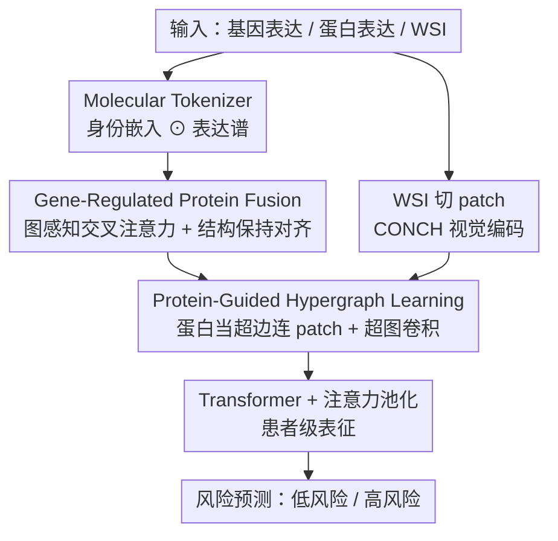

# Advancing Cancer Prognosis with Hierarchical Fusion of Genomic, Proteomic and Pathology Imaging Data from a Systems Biology Perspective

**会议**: CVPR 2026  
**论文**: [CVF Open Access](https://openaccess.thecvf.com/content/CVPR2026/html/Zhou_Advancing_Cancer_Prognosis_with_Hierarchical_Fusion_of_Genomic_Proteomic_and_CVPR_2026_paper.html)  
**代码**: 无  
**领域**: 计算生物学 / 多模态生存预测  
**关键词**: 癌症预后, 多组学融合, 蛋白质组, 超图学习, 病理全玻片图像  

## 一句话总结
HFGPI 把"基因 → 蛋白质 → 组织形态"的系统生物学级联显式建模成一条分层融合管线，用图感知交叉注意力刻画基因对蛋白的调控、用超图把蛋白连到病理 patch，在 5 个 TCGA 队列上把生存预测的平均 C-index 推到 0.753，超过所有 SOTA。

## 研究背景与动机
**领域现状**：癌症生存预测（survival prediction）的主流是多模态融合——把测序得到的**基因表达**和病理**全玻片图像（WSI）** 结合起来。WSI 提供细胞组织形态等表型信息，但缺乏分子机制；基因表达揭示分子亚型与通路失调。代表工作如 MCAT（共注意力 Transformer）、MOTCat（最优传输）、SurvPath（通路知识）都验证了多模态优于单模态。

**现有痛点**：作者指出现有框架有两个被忽视的缺口。其一是**漏掉了蛋白质组（proteome）**——基因只是"指令"，真正执行细胞功能、直接决定组织形态的是蛋白。临床上 HER2 蛋白过表达（而非 ERBB2 mRNA 水平）才决定病理上的膜染色模式，靠免疫组化看蛋白状态做决策。光靠基因签名无法刻画转录后/翻译后的调控。其二是**平铺式融合（flat fusion）**：现有方法把所有模态放在同一层级里对齐，没有反映生物组织的层级依赖。

**核心矛盾**：生物信息本质上是**沿层级级联流动**的——基因编码指令、蛋白执行功能、功能表现为组织形态（gene → protein → phenotype）。而现有架构把这条有方向的级联拍平成"同级对齐"，自然丢掉了"分子异常如何机制性地导致形态结果"的路径。此外现有方法把表达谱当成孤立数值向量，完全没用上基因/蛋白本身的功能注释、共表达等内在生物属性。

**本文目标**：(1) 把蛋白质组作为连接基因型与表型的中间层引入；(2) 用一条显式建模生物层级的分层融合管线取代平铺融合；(3) 让分子的"身份语义"参与表征学习，而不只是表达数值。

**切入角度**：从**系统生物学视角**重新设计架构——既然生物信息是 gene → protein → phenotype 的有向级联，那融合管线就应该按这个顺序逐层往上推。

**核心 idea**：用"分子标记器（给基因/蛋白注入身份语义）+ 基因调控蛋白融合 + 蛋白引导超图"三件套，把 gene→protein→morphology 的层级级联逐层显式建模，再渐进式融合做生存预测。

## 方法详解

### 整体框架
给定一位患者的 WSI、基因表达和蛋白表达数据，HFGPI 按照生物层级分四个阶段往上走。**第一阶段（特征提取）**：WSI 切成 20× 的不重叠 patch、用预训练视觉编码器（CONCH）抽 patch 特征；基因和蛋白则各自过 **Molecular Tokenizer**，把"身份嵌入"和"表达谱"融成生物学知情的分子表征。**第二阶段**：**Gene-Regulated Protein Fusion（GRPF）** 用图感知交叉注意力 + 结构保持对齐，显式建模"基因 → 蛋白"的有向调控，输出基因调控后的蛋白表征。**第三阶段**：**Protein-Guided Hypergraph Learning（PGHL）** 把每个蛋白当成一条超边连接语义相关的 patch，用超图卷积捕捉"蛋白—形态"的高阶多对多关系。**第四阶段**：把分层融合后的特征过 Transformer 编码器 + 门控注意力池化，聚成患者级表征预测风险（hazard）。三个贡献模块恰好沿 gene→protein→image 的层级顺序串成一条上行链。

### 关键设计

**1. Molecular Tokenizer：给基因和蛋白注入"身份语义"，而不只喂表达数值**

痛点直指现有方法把表达谱当成孤立数字向量，丢掉了基因/蛋白自身的功能注释、共表达关系。Molecular Tokenizer 的做法是把**定量表达谱**与**定性身份嵌入**逐元素相乘融合。对基因，用 Gene2Vec 生成 200 维身份嵌入 $G \in \mathbb{R}^{N_g \times d_g}$（功能相关的基因在嵌入空间里靠得近），再与患者表达 $e^{(k)}$ 调制：$X_g^{(k)} = e^{(k)} \odot G$，让表达水平在单基因粒度上调制身份嵌入，得到同时编码"这是什么基因"与"表达多少"的表征。对蛋白，关键巧思是**让蛋白身份嵌入天然对齐病理图像空间**——用 LLM（GPT-5）生成每个蛋白的文本描述（功能 + 它在 HE 染色图上可能对应的形态特征），再用 VLM（CONCH）的文本编码器编码成 $P$，同样 $X_p^{(k)} = q^{(k)} \odot P$。因为蛋白身份嵌入和 patch 特征来自同一个 CONCH，后续蛋白—patch 关联才有共享语义空间可用。

**2. Gene-Regulated Protein Fusion（GRPF）：用有向交叉注意力刻画"基因调控蛋白"，并用结构约束守住生物拓扑**

生物调控是从基因到蛋白单向流动（转录 + 翻译），平铺式对齐刻画不了这种方向性。GRPF 分三步。先做**分子图构建 + GCN 精炼**：用 k-NN（基因 $k_g{=}100$、蛋白 $k_p{=}20$）按余弦相似度建基因图 $A_g$、蛋白图 $A_p$，再用 GCN 把网络上下文传播进 $X_g, X_p$。接着做**有向交叉注意力**——让蛋白作为 query 去基因里查调控信息（体现"基因控制蛋白活性"）：

$$T = \mathrm{softmax}\!\left(\frac{Q K^\top}{\sqrt{d}}\right) \in \mathbb{R}^{N_p \times N_g},\quad Q = X_p W_Q,\ K = X_g W_K,\ V = X_g W_V$$

其中 $T_{ij}$ 量化蛋白 $i$ 受基因 $j$ 调控的强度。第三步是**结构保持对齐（structure-preserving alignment）**：功能耦合的蛋白往往由协同调控的基因编码，所以约束注意力矩阵 $T$ 尊重两侧网络拓扑——$L_{struct} = \frac{1}{N_g N_p}\lVert C_g - T^\top C_p T\rVert_F^2$，其中 $C_g = 1 - A_g$、$C_p = 1 - A_p$ 是结构代价矩阵（低代价=高功能相似）。最终融合 $X_p^{regulated} = X_p + TV$，第一项保留原蛋白信息、第二项注入基因调控信号。这一步把"基因→蛋白"这层依赖显式写进了表征，而非靠平铺注意力隐式碰运气。

**3. Protein-Guided Hypergraph Learning（PGHL）：用超边把一个蛋白连到多块组织 patch，建模多对多的"蛋白—形态"高阶关系**

蛋白通过空间上分散的形态改变执行功能：一个蛋白可能在多个组织区域表达，而一块 patch 往往同时反映多个蛋白的活动——这是**多对多**关系，普通成对交叉注意力刻画不了。PGHL 把它建成超图 $H=(V,E)$：节点 $V$ 是 patch，**超边 $E$ 是蛋白**。每个蛋白 $i$ 定义一条超边，连接与它语义最相关的 top-$k$（$k{=}32$）个 patch——按 patch 特征 $Y$ 与基因调控蛋白嵌入 $X_p^{regulated}$ 的余弦相似度 $S = \mathrm{sim}(Y, X_p^{regulated})$ 取 top-$k$，构成关联矩阵 $H_{ji}$。然后做**超图卷积**让共享蛋白关联的 patch 互相聚合上下文：$Z = \sigma(D_v^{-1/2} H W_e D_e^{-1} H^\top D_v^{-1/2} Y W_p)$。再做**超边聚合**得到蛋白驱动的形态表征 $E = H^\top Z / \deg(E)$，最后与基因调控蛋白嵌入相加融合 $F = E + X_p^{regulated}$，得到同时编码基因调控、蛋白语义、组织形态的混合表征。这一步把层级链条的最后一跳"蛋白→形态"也显式补上了。

### 损失函数 / 训练策略
总损失把生存损失和结构约束加权组合：$L = L_{surv} + \lambda L_{struct}$。$L_{surv}$ 是生存分析标准的负对数似然（NLL）损失，基于风险函数 $h^{(k)}(t)$ 和生存函数 $S^{(k)}(t)=\prod_{u=1}^{t}(1-h^{(k)}(u))$ 对删失（censoring）样本与事件样本分别计似然；$\lambda=0.3$ 平衡预测性能与结构一致性。融合特征 $F$ 先过 Transformer 编码器捕全局依赖，再用门控注意力池化按预后相关性自适应加权聚成患者级表征 $h$，最后过预测头估计 hazard。训练 20 epoch、AdamW、学习率 $1\times10^{-4}$、batch size 1 + 16 步梯度累积、RTX 3090。基因取 top $N_g=2000$ 高变异基因。

## 实验关键数据

### 主实验
5 个 TCGA 队列（BLCA/BRCA/GBMLGG/LUAD/UCEC），5 折交叉验证，指标为 C-index（mean ± std，越高越好）。HFGPI 平均 C-index 0.753，在所有数据集上 SOTA。

| 模型 | 模态(G/P/I) | BLCA | BRCA | GBMLGG | LUAD | UCEC | 平均 |
|------|------|------|------|--------|------|------|------|
| WiKG（最强单模态） | I | 0.691 | 0.699 | 0.808 | 0.601 | 0.631 | 0.686 |
| MCAT | G+I | 0.686 | 0.685 | 0.835 | 0.639 | 0.716 | 0.712 |
| CMTA | G+I | 0.693 | 0.681 | 0.839 | 0.643 | 0.702 | 0.712 |
| MoME | G+I | 0.704 | 0.688 | 0.835 | 0.651 | 0.714 | 0.718 |
| PS3† | G+P+I | 0.708 | 0.702 | 0.851 | 0.659 | 0.757 | 0.735 |
| ICFNet† | G+P+I | 0.705 | 0.692 | 0.846 | 0.664 | 0.739 | 0.729 |
| **HFGPI（本文）** | G+P+I | **0.717** | **0.715** | **0.873** | **0.680** | **0.782** | **0.753** |

> † 表示把原方法的文本模态替换成蛋白质组数据后的变体。HFGPI 比最强单模态 WiKG 高 6.7%，比三模态最强 PS3 高 1.8%、比 ICFNet 高 2.4%。"加了蛋白"的三模态方法普遍比对应两模态版本高 1.1%~5.4%，直接验证蛋白质组作为中间表型的互补价值。

### 消融实验
平均 C-index（五数据集均值）：

| 配置 | 平均 C-index | 说明 |
|------|------|------|
| Full HFGPI | 0.753 | 完整三模态模型 |
| 去蛋白（仅 g,i） | 0.713 (−4.0%) | 去掉蛋白质组掉最多档之一 |
| 仅 g,p | 0.708 (−4.5%) | 去掉图像 |
| 仅 p,i | 0.708 (−4.5%) | 去掉基因 |
| Tokenizer→基因家族 | 0.739 (−1.4%) | 用基因家族编码替身份嵌入 |
| Tokenizer→通路 | 0.743 (−1.0%) | 用通路编码 |
| GRPF→普通交叉注意力 | 0.730 (−2.3%) | 去掉图感知 + 结构对齐 |
| PGHL→普通交叉注意力 | 0.735 (−1.8%) | 去掉超图高阶建模 |
| w/o $L_{struct}$ | 0.737 (−1.6%) | 去掉结构保持对齐 |

另有编码器选型实验：VLM 用 CONCH（0.753）远好于 CLIP（−6.5%）、PLIP（−2.8%）、QUILT（−3.7%），说明病理专用基础模型很关键；LLM 用 GPT-5（0.753）略优，但 DeepSeek/Qwen-3/Claude-3.7 差距都在 1% 内，框架对 LLM 选择鲁棒。

### 关键发现
- **三模态缺一不可**：去掉任意单模态都掉 4% 左右，三者捕捉互补生物信息；其中去蛋白同样显著掉点，坐实"蛋白质组是不可或缺的中间层"这一核心论点。
- **GRPF 贡献最大（−2.3%）**：把图感知交叉注意力换成普通交叉注意力掉得最多，说明显式建模基因→蛋白的有向调控 + 结构拓扑约束确实带来增益，而非简单堆模态。
- **身份语义 vs 表达数值**：Molecular Tokenizer 比基因家族/通路编码各高 1.4%/1.0%，证明在单基因粒度保留细粒度分子身份信息有用。
- **编码器对齐很重要**：CONCH 这种病理图文对预训练的 VLM 让蛋白文本与 patch 在同一空间，是 PGHL 蛋白—patch 关联能成立的前提，换成通用 CLIP 直接掉 6.5%。

## 亮点与洞察
- **把"系统生物学级联"直接画成网络结构**：gene→protein→phenotype 不是一句口号，而是被拆成 Tokenizer→GRPF→PGHL 三个对应模块逐层上行，架构本身就是生物学假设的实现，可解释性天然内嵌。
- **用 LLM 生成蛋白的"形态学描述"再用 VLM 编码**，巧妙地把蛋白嵌入拉进病理图像空间——这个跨模态对齐的小技巧是 PGHL 能用相似度连蛋白与 patch 的关键，思路可迁移到任何"想让符号化生物实体对齐图像"的任务。
- **超图建模多对多关系**：一个蛋白=一条超边连多块 patch，比成对注意力更贴合"一个蛋白分散表达在多个区域、一块 patch 受多蛋白影响"的生物现实；这种"实体作超边"的范式可借鉴到其他高阶关系场景。
- **结构保持对齐**用 $\lVert C_g - T^\top C_p T\rVert_F^2$ 把生物先验（功能耦合蛋白由协同基因编码）写成正则项，是把领域知识注入注意力的一种轻量做法。

## 局限与展望
- 依赖**配对齐全的多组学 + 病理数据**：5 个队列正是因为基因/蛋白/病理三者都有才被选中（UCEC 仅 n=122），现实中蛋白质组（RPPA）覆盖远不如转录组，缺模态时如何用是个现实瓶颈，本文未处理缺失模态（对比的 LD-CVAE/GHANet 才是做缺失的）。
- **蛋白身份嵌入质量受 LLM 描述支配**：虽然实验显示对 LLM 选择鲁棒，但生成的"蛋白—形态"描述本身可能含幻觉或过时知识，缺乏对描述准确性的独立校验。⚠️ 蛋白集合规模（$N_p$）原文正文未明确给出，以补充材料为准。
- RPPA 只覆盖**有限的癌症相关蛋白和磷酸化蛋白**，并非全蛋白组，"蛋白质组中间层"的覆盖是受限的；扩展到质谱全蛋白组后该层级假设是否仍稳健值得验证。
- 改进方向：把缺失模态补全（如 LD-CVAE 式生成）与本文层级融合结合；或把"基因→蛋白→形态"链条继续往上接到临床/影像组学，形成更长的层级级联。

## 相关工作与启发
- **vs MCAT / MOTCat / SurvPath（两模态 G+I）**：它们用共注意力 / 最优传输 / 通路知识对齐基因和图像，但都缺蛋白层、且平铺融合。本文显式插入蛋白中间层并按层级上行，平均 C-index 0.712→0.753。
- **vs CMTA / PIBD（平铺多模态）**：CMTA 用并行编码解码 + 跨模态注意力对齐基因与图像，PIBD 学原型选判别信息并解耦特征——都把模态当同一层级。HFGPI 的差异在于把"层级依赖"当成一等公民来建模。
- **vs PS3† / ICFNet†（三模态）**：这两者能处理三模态（原本第三模态是病理报告文本，本文实验里被替换成蛋白质组），但仍是平铺融合；HFGPI 在相同三模态输入下靠分层融合再涨 1.8%~2.4%，说明增益来自"怎么融"而非"融了几个"。

## 评分
- 新颖性: ⭐⭐⭐⭐⭐ 首次把蛋白质组作为中间层 + 用系统生物学级联指导融合架构，GRPF/PGHL 都有清晰生物动机。
- 实验充分度: ⭐⭐⭐⭐ 5 个 TCGA 队列、对比 15+ 方法、消融覆盖每个模块与编码器选型；但都是 TCGA 内部、队列偏小（UCEC n=122）。
- 写作质量: ⭐⭐⭐⭐⭐ 生物学动机—架构—公式一一对应，逻辑链顺畅好读。
- 价值: ⭐⭐⭐⭐ 为多组学生存预测提供了"按生物层级融合 + 引入蛋白层"的清晰范式，可解释性强，但落地受配对多组学数据可得性限制。

<!-- RELATED:START -->

## 相关论文

- [\[AAAI 2026\] SpaCRD: Multimodal Deep Fusion of Histology and Spatial Transcriptomics for Cancer Region Detection](../../AAAI2026/computational_biology/spacrd_multimodal_deep_fusion_of_histology_and_spatial_transcriptomics_for_cance.md)
- [\[CVPR 2026\] Sampling-Aware 3D Spatial Analysis in Multiplexed Imaging](sampling-aware_3d_spatial_analysis_in_multiplexed_imaging.md)
- [\[AAAI 2026\] HiFusion: Hierarchical Intra-Spot Alignment and Regional Context Fusion for Spatial Gene Expression Prediction from Histopathology](../../AAAI2026/computational_biology/hifusion_hierarchical_intra-spot_alignment_and_regional_context_fusion_for_spati.md)
- [\[CVPR 2026\] HyperST: Hierarchical Hyperbolic Learning for Spatial Transcriptomics Prediction](hyperst_hierarchical_hyperbolic_learning_for_spatial_transcriptomics_prediction.md)
- [\[CVPR 2026\] Cell-Type Prototype-Informed Neural Network for Gene Expression Estimation from Pathology Images](cell-type_prototype-informed_neural_network_for_gene_expression_estimation_from_.md)

<!-- RELATED:END -->
