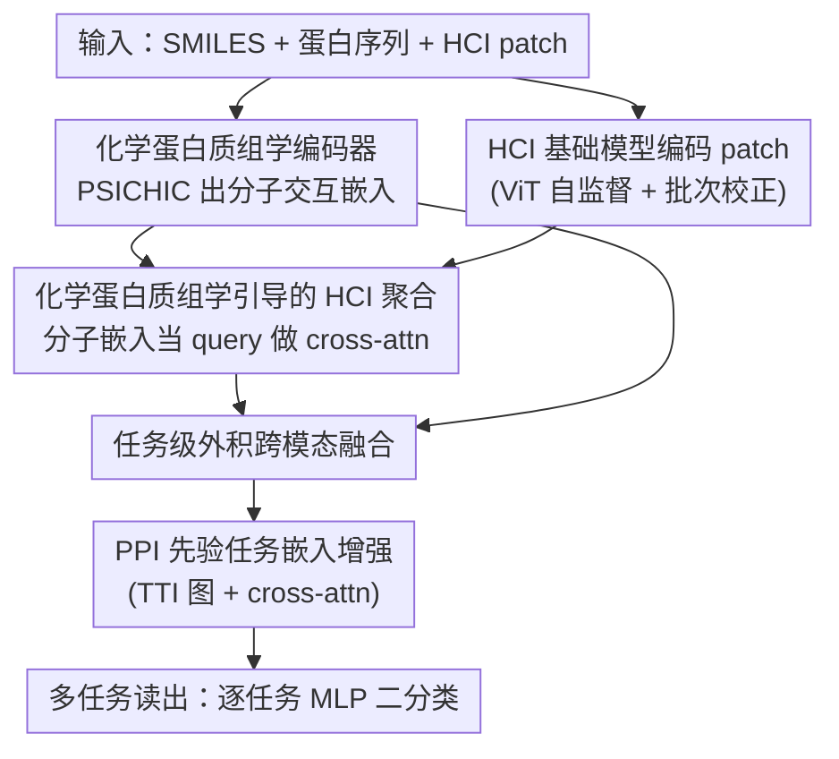

# BiGMINT: Biologically-guided Hierarchical Multimodal Integration for Modeling Multiple Compound Activities in Drug Discovery

**会议**: CVPR 2026  
**论文**: [CVF Open Access](https://openaccess.thecvf.com/content/CVPR2026/html/Pati_BiGMINT_Biologically-guided_Hierarchical_Multimodal_Integration_for_Modeling_Multiple_Compound_Activities_CVPR_2026_paper.html)  
**代码**: 无  
**领域**: 多模态组学融合 / 药物发现 / 计算生物学  
**关键词**: 化合物活性预测, 高内涵成像, 化学蛋白质组学, 多模态融合, PPI 先验  

## 一句话总结
BiGMINT 用「化学蛋白质组学信号引导高内涵成像（HCI）特征聚合 + 外积式跨模态融合 + 蛋白互作（PPI）先验做任务级信息共享」三段式层次化融合，把分子机制信号和细胞表型信号统一起来预测化合物活性，在两份各 ~99K / ~40K 化合物-成像对的大规模私有数据集上把平均 AUCROC 比最强单模态/多模态基线提升最多 10.0% / 4.2%，高性能任务覆盖最多翻倍。

## 研究背景与动机
**领域现状**：在药物发现里，用机器学习做「化合物活性预测」（in silico 预测某化合物会不会调控某个蛋白靶点）能大幅减少昂贵耗时的湿实验筛选。现有方法大体分两派：一派是 **chemoproteomics-centric（化学蛋白质组学）**，用化合物 SMILES + 蛋白序列/结构去建模分子层面的结合机制（如 DrugBAN、PSICHIC）；另一派是 **phenotype-centric（表型中心）**，用高内涵成像（HCI，即 Cell Painting 这类多通道细胞荧光图）或转录组去捕捉系统级的细胞响应。

**现有痛点**：两派各自有"盲区"。化学蛋白质组学只看分子对接强度，忽略了化合物作用到细胞后真实的下游表型后果；表型方法只看细胞形态变化，但 HCI 捕捉的是化合物引起的**所有**细胞变化（包括脱靶、间接通路），并不只是目标蛋白结合带来的那一部分，存在严重的混杂（confounding）。少数已有的多模态方法虽然把两者拼起来，但融合策略浅（多为 late-fusion / 简单 concat），既没有针对生物响应的敏感性做适配，也没有引入生物先验知识。

**核心矛盾**：分子机制信号和细胞表型信号本应互补——但简单拼接无法让一个模态去"指导/净化"另一个模态；而且活性标注极度稀疏（化合物-任务矩阵填充率只有 ~3%），单纯堆数据学不动。

**本文目标**：(1) 让分子信号主动引导 HCI 特征提取，把混杂的表型信号里"和目标蛋白相关"的那部分放大；(2) 在标注稀疏下，用生物先验（蛋白互作网络）让相关任务之间共享信息。

**切入角度**：作者观察到——HCI 既反映化合物-蛋白的直接作用，也反映通过 PPI 传导的间接作用；因此**分子信号可以当作先验来引导 HCI 特征聚合**，把"真正的靶点活性"从"无关效应"里解耦出来。同时蛋白在网络里互联，相关蛋白的任务可以互相借标签。

**核心 idea**：用化学蛋白质组学嵌入当 query 去 cross-attention 聚合 HCI patch，再用外积做任务级融合，最后用 PPI 派生的任务-任务互作（TTI）图做嵌入增强——一条"分子引导表型、生物先验补稀疏"的层次化融合链路。

## 方法详解

### 整体框架
BiGMINT 的输入是一个化合物（SMILES）、一个目标蛋白（氨基酸序列）、以及该化合物处理细胞后拍出的一组 HCI 图像 patch $\{x^n_c\}_{n=1}^{N_c}$；输出是该化合物在该蛋白多个浓度任务 $t_{p,z}$ 上的二分类活性 $y_{c,(p,z)}$。整条管线分 3 个层次化阶段：**① 化学蛋白质组学编码器** $F_{chemprot}$ 先把 SMILES+蛋白序列编成分子交互嵌入 $d^{chemprot}_{c,p}$；**② 化学蛋白质组学引导的 HCI 编码器** $F_{hci}$ 用这个分子嵌入当 query 去聚合 patch 特征，得到任务相关的表型嵌入 $d^{hci}_{c,(p,z)}$；**③ 跨模态融合** $F_{fusion}$ 用外积把分子与表型嵌入按任务融成 $d^{fusion}_{c,(p,z)}$。之后 **PPI 先验增强**模块 $F_{aug}$ 用任务-任务互作图让相关任务互相补信号，最后多任务 MLP 分类头读出活性。

这是一个"分子→引导表型→融合→先验增强→读出"的清晰串行 pipeline，下面用框架图对照（节点名即下文关键设计名）：

### 关键设计

**1. 化学蛋白质组学引导的 HCI 聚合：用分子信号当 query 把混杂表型"净化"出靶点信号**

痛点是 HCI 拍下的细胞形态变化混了一堆和目标蛋白无关的效应，直接 mean/attention pooling 会把这些混杂一起带进来。BiGMINT 的做法是先用 $F_{chemprot}$（基于 SOTA 的 PSICHIC，把 SMILES 经 RDKit 转分子图、蛋白序列经 ESM2 转图，再过物理化学约束的 GNN）得到化合物-蛋白交互信号 $q_{c,p}$，经 MLP 投影成分子嵌入 $d^{chemprot}_{c,p}=F_\beta(F_\alpha(p,c))$。HCI 侧先用自监督预训练的 ViT 基础模型 $F_\omega$ 把每个 patch 编码并做批次校正、再过共享投影 $F_\phi$ 得到 patch 特征 $b^n_c$。关键在于每个任务有一个聚合头 $F_{\psi_{p,z}}$，它做 **cross-attention：把 $d^{chemprot}_{c,p}$ 当 query、patch 特征 $\{b^n_c\}$ 当 key/value**，输出任务相关的表型嵌入 $d^{hci}_{c,(p,z)}$。把注意力 condition 在分子嵌入上，就能让模型聚焦"机制相关"的细胞 patch、放大与目标蛋白相关的微弱表型信号。实验里这一招 `CA(H, d^{chemprot})` 单独就超过了最强的 HCI-only 模型，验证了"分子引导聚合"确实在放大靶点特异信号。

**2. 任务级外积跨模态融合：用非参数外积在标注稀疏下捕捉乘性跨模态交互**

得到分子嵌入和表型嵌入后要融合。痛点是参数化融合（gating、attention）在标注极稀疏（填充率 ~3%）时学不动，容易过拟合。作者比较了 concat / 向量门控 / 元素门控 / attention / 外积等多种算子，发现**逐任务外积**一致最好：$F^{fusion}_{p,z}:=\mathrm{MLP}(d^{chemprot}_{c,p}\otimes d^{hci}_{c,(p,z)})$。外积是非参数地建模两个模态嵌入维度之间的丰富相关（一个分子特征只有在与某个表型特征组合时才起作用，这种乘性、非线性、交互依赖的效应正好被外积捕捉），因此在标注稀缺场景下尤其有效。注意融合用的是**逐任务算子** $F^{fusion}_{p,z}$ 而非单一共享算子，好让每个任务能适配蛋白和浓度相关的不同敏感性。

**3. PPI 先验的任务嵌入增强：用蛋白互作网络让相关任务互相借标签，对抗稀疏监督**

痛点是每个化合物-蛋白-浓度三元组只有极少被实测，单任务监督太稀疏。作者引入生物先验：蛋白在互作网络里相连，蛋白 $p$ 的活性会被它的互作伙伴 $p'$ 影响，所以任务 $t_{p,z}$ 的信息也藏在涉及相关蛋白的任务里。具体把二值化 PPI 邻接 $B_P$ 派生成**任务-任务互作（TTI）图** $B_T(t_{p,z},t_{p',z'}):=B_P(p,p')$（去掉自环），再按训练集标签相关性只保留每个任务 top-$K$ 最相关任务，使 $B_T$ 稀疏化、只在最相关任务间共享。对当前融合嵌入 $d^{fusion}_{c,(p,z)}$，收集其关联任务的嵌入集合 $d^{fusion}_{c,T^{as}_c}$，用 $F^{aug}_{p,z}$ 做 cross-attention（当前嵌入当 query、关联任务嵌入当 key/value）算出一个注意力加权的辅助信号，concat 回去再投影成增强嵌入 $d^{aug}_{c,(p,z)}$。这相当于用结构化生物先验把稀疏监督"加密"，让信号沿着相关蛋白的方向传播——实验显示 TTI 对难、低性能任务收益最大（gain-vs-baseline 呈负斜率），正是直接证据稀缺时先验最有用。

### 损失函数 / 训练策略
整体当作多任务学习（MTL）问题，每个任务 $t_{p,z}$ 用一个 MLP 分类头 $F^{cls}_{p,z}$ 把 $d^{aug}_{c,(p,z)}$ 映射到二分类。目标是只在被观测的标签上计加权二元交叉熵：

$$\mathcal{L}=\frac{1}{|\mathcal{T}|}\sum_{t_{p,z}}\sum_{c} \mathbb{I}_{c,(p,z)}\cdot \mathcal{L}^{BCE}_{p,z}\big(y_{c,(p,z)}, F^{cls}_{p,z}(d^{aug}_{c,(p,z)})\big)$$

其中 $\mathbb{I}_{c,(p,z)}=1$ 当且仅当该标签被实测，否则为 0；BCE 按训练集类频率的倒数加权以缓解每个任务的类不平衡。预训练上：$F_\alpha$ 用 PSICHIC（~5K 蛋白、~1M 化合物、~3M 结合亲和力 + ~1.8M 功能效应预训练）初始化并冻结、只学一个 adapter $F_\beta$；HCI 基础模型 $F_\omega$ 是 ViT-B/16，U2OS 用 DINOv2、iNeuron 因 neurite 重建受限改用 DINO，在与下游不相交的 JUMP-CP 等数据上自监督预训练。

## 实验关键数据

### 主实验
两份大规模私有数据集：U2OS（~99K 化合物-HCI 对）、iNeuron（~40K），共 65 个蛋白上的 170 个二分类活性任务，填充率仅 ~2.94% / 3.01%。5-scaffold 折交叉验证，报 AUCROC / AUPRC / Macro-F1（下表 %，AUCROC）：

| 类别 | 方法 | U2OS AUCROC | iNeuron AUCROC |
|------|------|------|------|
| HCI-only | MIL→MTL | 71.17 | 69.51 |
| HCI-only | MIL+TTI→MTL | 72.09 | 69.96 |
| Chemprot-only | DrugBAN | 68.99 | 69.59 |
| Chemprot-only | PSICHIC | 71.11 | 72.62 |
| 多模态 | MM-Union（乐观上界） | 75.10 | 74.99 |
| 多模态 | Concatenate(HCI, P)→MTL | 73.34 | 73.19 |
| 多模态 | CA(H, d^chemprot)→MTL | 73.51 | 70.54 |
| **本文** | **BiGMINT (Outer+TTI)** | **78.23** | **76.51** |

BiGMINT 在两个数据集都显著超过所有单模态/多模态基线（配对 t 检验 p<0.001），相对最强单模态 +10.0% / +5.4% AUCROC、相对最强多模态 +4.2% / +2.0%。高性能任务覆盖（AUCROC≥0.8）在 U2OS / iNeuron 达 67 / 59 个任务，比乐观上界 MM-Union 还高 56% / 5%，阈值越高优势越大。

### 消融实验
（节选 Table 1 的 Ablating BiGMINT 块，U2OS / iNeuron AUCROC %）

| 配置 | U2OS | iNeuron | 说明 |
|------|------|------|------|
| **BiGMINT 完整：Outer(CA(H,·),·)+TTI** | **78.23** | **76.51** | 完整模型 |
| Outer(CA(H,·),·)→MTL（去 TTI） | 77.02 | 74.94 | 去 PPI 先验，掉 1.2 / 1.6 |
| Outer(MIL(H),·)+TTI（去分子引导聚合） | 77.72 | 75.80 | 表型聚合退化成普通 MIL，掉 0.5 / 0.7 |
| Outer(MIL(H),·)→MTL（同时去聚合+TTI） | 76.41 | 74.66 | 两件都去，掉 1.8 / 1.9 |
| CA(H, d^chemprot)→MTL（只有分子引导聚合） | 73.51 | 70.54 | 缺外积融合+TTI |

### 关键发现
- **三个组件都有正贡献且可叠加**：去 TTI 掉 1.2/1.6，去化学蛋白质组学引导聚合掉 0.5/0.7，同时去掉两者掉 1.8/1.9；外积融合相对 concat 也一致更好。
- **PPI 先验对"难任务"最有用**：TTI 在 U2OS 114/170、iNeuron 123/170 个任务上提升，且 gain-vs-baseline 呈负斜率——越是低性能、直接证据少的任务，借助生物先验收益越大。
- **模态互补性被证实**：用 StringDB 蛋白互作度数分析发现，HCI 模型在高连接度（hub）蛋白上预测更强（Spearman ρ=0.46, p=0.0002），化学蛋白质组学几乎不随连接度变化（ρ=0.15, p=0.25）；BiGMINT 在 54/62 个蛋白上跨整个连接度谱都更高（ρ=0.36），说明它真正融合了 HCI 对形态敏感 + 化学蛋白质组学鲁棒两种互补性。
- **外积为何赢**：在标注稀疏时参数化融合学不动，外积非参数地直接建模分子维度×表型维度的乘性交互，捕捉"某分子特征只在与某表型特征组合时才生效"的非线性效应。

## 亮点与洞察
- **"分子当 query 引导表型聚合"是最巧的一步**：把混杂的 HCI 用化学蛋白质组学嵌入做 cross-attention 净化出靶点相关信号，单这一招就超过最强 HCI-only 模型——一个可迁移到任何"强模态净化弱/混杂模态"场景的思路（如文本引导图像 ROI 聚合）。
- **把领域知识图（PPI）变成任务-任务注意力图**：用 $B_T(t_{p,z},t_{p',z'}):=B_P(p,p')$ 把蛋白互作直接搬成任务间信息共享拓扑，再用 top-$K$ 标签相关性稀疏化，是"在标注稀疏的多任务里注入结构先验"的优雅做法。
- **外积融合在稀疏标注下打败参数化融合**：提醒在小样本/稀疏监督场景，非参数、乘性的跨模态交互往往比可学习的复杂融合更稳。

## 局限与展望
- **作者承认**：当前框架难处理"未见过的蛋白"，需扩展到新蛋白与新化合物-蛋白对的泛化；计划注入更多生物先验。
- ⚠️ **数据闭源、难复现**：两份核心数据集都是 J&J 私有（U2OS/iNeuron in-house），且无开源代码，外部很难复现或公平对比；评测全在私有 benchmark 上。
- ⚠️ **依赖强预训练组件**：性能很大程度建立在 PSICHIC（~1M 化合物预训练）和大规模 HCI 自监督 ViT 上，组件升级/退化会显著影响结论，TTI/外积的增量收益（~1-2 个点）相对预训练 backbone 的贡献偏小。
- **PPI 先验质量是上限**：TTI 完全取决于 StringDB 的互作可靠性与覆盖（已有 3/65 蛋白无互作数据），先验噪声会直接传进任务共享。

## 相关工作与启发
- **vs PSICHIC / DrugBAN（化学蛋白质组学单模态）**：它们只建模分子结合，忽略下游表型；BiGMINT 把 PSICHIC 当冻结的分子编码器，再叠表型与先验，AUCROC 在 U2OS 上从 71.11 提到 78.23。
- **vs MM-Union（逐任务选最优模态的乐观上界）**：MM-Union 是"每个任务挑最好的单模态"的理论上界，BiGMINT 真正做了融合，反而在高阈值任务覆盖上超过它 56% / 5%，说明融合带来了单模态都没有的新增益。
- **vs CLOOME / MolPhenix（对齐式多模态）**：对齐法用对比学习把模态映到一起，但有语义鸿沟、易丢模态特有信息，本文实验里它们一致弱于整合式方法——支持作者"integration 比 alignment 更适合活性建模"的判断。

## 评分
- 新颖性: ⭐⭐⭐⭐ 分子引导表型聚合 + PPI→TTI 任务共享 + 外积融合的组合在药物活性多模态建模里是新颖且有生物动机的。
- 实验充分度: ⭐⭐⭐⭐ 两份大规模数据集、丰富基线、组件消融与机制分析齐全；扣分在全闭源、无外部 benchmark。
- 写作质量: ⭐⭐⭐⭐ 动机—方法—机制分析逻辑清晰，公式与符号规范。
- 价值: ⭐⭐⭐⭐ 对药物发现的活性预测有实际价值，但数据/代码闭源限制了社区可复用性。

<!-- RELATED:START -->

## 相关论文

- [\[CVPR 2026\] HyperST: Hierarchical Hyperbolic Learning for Spatial Transcriptomics Prediction](hyperst_hierarchical_hyperbolic_learning_for_spatial_transcriptomics_prediction.md)
- [\[ICML 2025\] GenMol: A Drug Discovery Generalist with Discrete Diffusion](../../ICML2025/computational_biology/genmol_a_drug_discovery_generalist_with_discrete_diffusion.md)
- [\[ACL 2026\] AROMA: Augmented Reasoning Over a Multimodal Architecture for Virtual Cell Genetic Perturbation Modeling](../../ACL2026/computational_biology/aroma_augmented_reasoning_over_a_multimodal_architecture_for_virtual_cell_geneti.md)
- [\[CVPR 2026\] Multimodal Protein Language Models for Enzyme Kinetic Parameters: From Substrate Recognition to Conformational Adaptation](multimodal_protein_language_models_for_enzyme_kinetic_parameters_from_substrate_.md)
- [\[ICLR 2026\] Extending Sequence Length is Not All You Need: Effective Integration of Multimodal Signals for Gene Expression Prediction](../../ICLR2026/computational_biology/extending_sequence_length_is_not_all_you_need_effective_integration_of_multimoda.md)

<!-- RELATED:END -->
