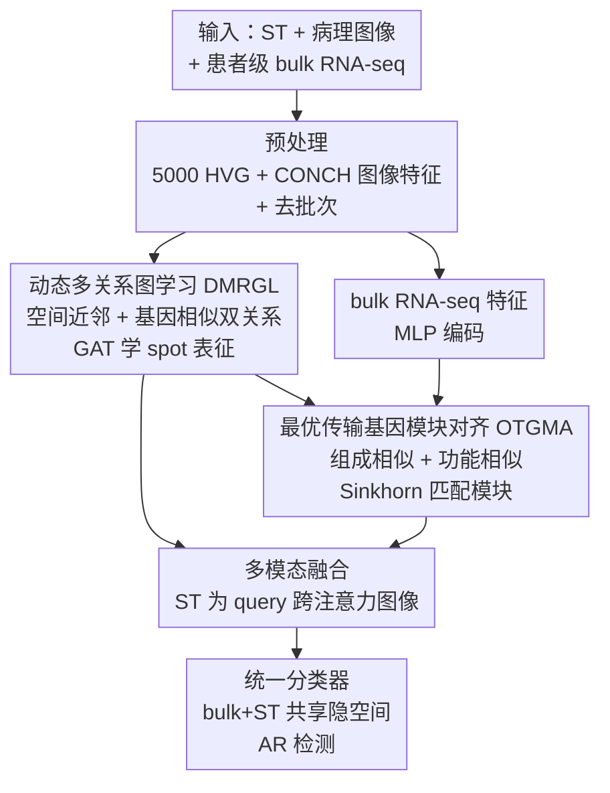

# Bulk RNA-seq Guided Multi-modal Detection of Anomalous Regions in Human Cancer via Spatial Transcriptomics

**会议**: CVPR 2026  
**论文**: [CVF Open Access](https://openaccess.thecvf.com/content/CVPR2026/html/Shi_Bulk_RNA-seq_Guided_Multi-modal_Detection_of_Anomalous_Regions_in_Human_CVPR_2026_paper.html)  
**代码**: https://github.com/shihangjs/BRGMAR (有)  
**领域**: 计算生物 / 多模态  
**关键词**: 空间转录组, 异常区域检测, 最优传输, 基因模块对齐, 多模态融合

## 一句话总结
BRGMAR 用一个动态多关系图刻画空间转录组（ST）里 spot 间的空间近邻 + 基因相似关系，再用基于最优传输的“基因模块对齐”把患者级 bulk RNA-seq 的诊断信息迁移到 ST，最后与病理图像跨注意力融合，在 BRCA/HCC/ccRCC 三个数据集上把肿瘤异常区域检测的 AUC/F1 显著推到新高。

## 研究背景与动机
**领域现状**：在组织里识别“异常区域”（anomalous region, AR，即癌变/异型增生区域）是个人化医疗的核心任务。早期靠 H&E 病理图像看形态学差异，近年主流转向空间转录组（ST）——它在保留空间位置的同时给出每个 spot 的基因表达谱，能发现形态上看不出来的分子层面异常，通常用图神经网络（GNN）建模 spot 间关系；更新的工作把病理图像和 ST 拼起来做多模态。

**现有痛点**：作者指出三处具体缺陷。其一，现有 ST 方法只用单个 spot 的**局部**分子特征，完全没用上配套的患者级 **bulk RNA-seq**——后者带有“这个病人是癌症还是正常对照”的诊断标签，是整片组织的整体基因画像，对识别细微/异质肿瘤是宝贵先验。其二，要把 bulk RNA-seq 这种跨平台基因数据对齐到 ST，已有迁移学习只会逐个匹配**单基因表达值**，但组织的功能异常往往体现为基因**共表达模式**的整体紊乱，而不是单个基因变化。其三，主流图模型假设“空间相邻 spot 表达相似”、只按欧氏距离建图，漏掉了“空间很远但分子相似”的非局部生物关系。

**核心矛盾**：诊断信息（bulk RNA-seq）是患者级、跨测序平台的整体画像，而 AR 检测要落到 ST 的每个 spot 级；两者粒度和域都不同，简单逐基因对齐会破坏共表达网络结构，导致诊断知识传不下去。

**本文目标**：(1) 把患者级 bulk RNA-seq 的诊断信息可靠迁移到 ST；(2) 同时建模 ST 的空间近邻和非局部基因相似；(3) 融合 ST 与病理图像做精准 AR 检测。

**核心 idea**：用“**基因共表达模块**”作为跨域对齐的单位——把共享基因切成若干潜在功能模块，再用最优传输（OT）按模块的**组成相似 + 功能相似**做匹配，从而把 bulk RNA-seq 的诊断信号迁移到 ST，配合一张能捕捉非局部关系的动态图和图文跨注意力融合。

## 方法详解

### 整体框架
BRGMAR 输入三路异构数据：一片组织的 ST（spot × 基因表达）、配套的 H&E 病理图像、以及该癌种的患者级 bulk RNA-seq（带正常/癌症标签）；输出是 ST 上每个 spot 是否属于异常区域的分类。整条 pipeline 分四步串行：先做数据预处理（取 5000 个高变基因 HVG、用视觉-语言基础模型 CONCH 抽图像 patch 特征、ST 与 bulk 取 HVG 交集并去批次效应），再用 **DMRGL** 动态图模块学 ST 的 spot 表征，接着用 **OTGMA** 把 bulk RNA-seq 的诊断知识对齐迁移进来，最后把 ST 基因表征与图像表征做**跨注意力融合**送进统一分类器。bulk 和 ST 共享同一个分类器、在同一隐空间里被监督，从而让 bulk 的诊断标签反向约束 ST 的表征。

### 关键设计

**1. DMRGL：动态多关系图，把“空间近邻”和“非局部基因相似”都建进图里**

针对“图模型只按欧氏距离建图、漏掉远距离但分子相似的 spot”这一痛点。DMRGL 把 ST 一片切片表示为 $X^s=[x^s_1,\dots,x^s_n]^\top\in\mathbb{R}^{N_s\times D}$，定义一张**带阶段 $t$ 的动态图** $G=(V,E^{(t)})$：初始 $t=0$ 时用 KNN 按 spot 的**空间近邻**建边（$k_n=5$）；之后 $t>0$ 在基因嵌入空间里，为每个节点动态挑余弦相似度最大的 $k_s=5$ 个 spot 补“基因相似”边——这一步专门把空间上很远、但表达谱接近的 spot 连起来。表征学习用 GAT，邻居权重为

$$\alpha_{vu}=\frac{\exp\big(\text{LeakyReLU}(a^\top[W\vec{h}^s_v\,\Vert\,W\vec{h}^s_u])\big)}{\sum_{k\in N(v)}\exp\big(\text{LeakyReLU}(a^\top[W\vec{h}^s_v\,\Vert\,W\vec{h}^s_k])\big)}$$

更新为 $h^s_v=\sigma\big(\sum_{u\in N(v)}\alpha_{vu}W\vec{h}^s_u\big)$。“动态”在于图结构随训练用基因相似度刷新，从而发现潜在的组织组织模式，而不是钉死在固定的空间邻接上。

**2. OTGMA：把基因切成共表达模块，用最优传输按“组成 + 功能”对齐 ST 与 bulk RNA-seq**

针对“逐单基因对齐会破坏共表达网络、诊断信息传不下去”这一核心痛点，这也是全文最关键的贡献。它不在单基因层面对齐，而是先把 ST、bulk 各自共享的 $D$ 个基因软分配成 $K_m$ 个潜在功能模块（可学习分配矩阵 $R^m\in\mathbb{R}^{D\times K_m}$，$R^m_{ik}$ 是基因 $i$ 属于模块 $k$ 的概率，$m\in\{b,s\}$ 表示 bulk/ST 域）。每个模块构造一个拓扑重叠矩阵（TOM）刻画其内部共表达结构：

$$\text{TOM}^m_k[i,j]=\hat{A}^m_{ij}\cdot R^m_{ik}\cdot R^m_{jk}$$

其中 $\hat{A}^m$ 是归一化的基因相似度矩阵。然后从两个角度算跨域模块间的代价：

- **组成对齐（Composition）**：把 $\text{TOM}^m_k$ 当带权图、算其拉普拉斯 $L^m_k=D^m_k-\text{TOM}^m_k$，用两域模块拉普拉斯之间的 Wasserstein-2 距离平方衡量结构差异 $C^{org}_{ij}=\text{Tr}\big((L^b_i)^\dagger+(L^s_j)^\dagger\big)-2\,\text{Tr}\sqrt{((L^b_i)^\dagger)^{1/2}(L^s_j)^\dagger((L^b_i)^\dagger)^{1/2}}$（$\dagger$ 为伪逆）。
- **功能对齐（Function）**：用 OpenAI `text-embedding-3-large` 把每个基因的 NCBI 文本描述编码成功能嵌入 $e_i$，模块质心 $p^m_k=\frac{\sum_i R^m_{ik}e_i}{\sum_i R^m_{ik}}$，跨域功能距离 $C^{fun}_{ij}=d(p^b_i,p^s_j)$。

两者相加得总代价 $C^{total}_{ij}=C^{org}_{ij}+C^{fun}_{ij}$，把模块匹配写成 OT 问题：在均匀边缘约束 $a_i=1/K_b,\;b_j=1/K_s$ 下求传输计划 $P$ 最小化 $\sum_{ij}P_{ij}C^{total}_{ij}$。为数值稳定加熵正则 $H(P)=-\sum_{ij}P_{ij}(\log P_{ij}-1)$，得到 Sinkhorn 损失

$$L_{OT}(C^{total})=\sum_{ij}P_{ij}C^{total}_{ij}-\lambda_{reg}H(P)$$

$\lambda_{reg}=0.1$，用 Sinkhorn 算法解。这样对齐保留的是基因调控网络的整体结构，而非单基因数值，因此能把 bulk 的诊断知识“按功能模块”安全地搬到 ST。

**3. 多模态跨注意力融合 + 共享分类器：让图像形态学和基因诊断信号合力判 AR**

针对“病理图像与 ST 信息互补但要对齐到同一 spot”的需求。对每个 spot $v$，以 ST 基因特征 $h^s_v$ 作 query，对应图像特征 $x^{img}_v$ 作 key/value：$q_v=W_q h^s_v,\;k_v=W_k x^{img}_v,\;v_v=W_v x^{img}_v$，跨注意力 $\alpha_v=\text{softmax}(q_v k_v^\top/\sqrt{D})$，得 $\hat{h}^s_v=\alpha_v v_v$，再拼接投影 $z^s_v=\text{MLP}([h^s_v\Vert\hat{h}^s_v])$。检测端用一个**跨域共享**分类器：对 $m\in\{b,s\}$ 共用类别权重 $W^m$，softmax 出 AR 概率，总目标把两域交叉熵与 OT 损失相加 $L=L^b_{CE}+L^s_{CE}+L_{OT}$。共享分类器是诊断信息真正落地的关键——bulk 的标签监督和 ST 的检测在同一隐空间里耦合，OT 对齐让两域可比，bulk 的“癌/正常”先验得以约束 ST 的 spot 表征。

## 实验关键数据

### 主实验
三个公开 ST 数据集 BRCA（乳腺癌）、HCC（肝癌）、ccRCC（肾透明细胞癌），留一交叉验证（LOOCV），指标 AUC / F1。下表为与多模态及迁移学习方法的对比（平均值）：

| 数据集 | 指标 | BRGMAR | MEATRD | STANDS | STGIC | Bulk2Space | STEM |
|--------|------|--------|--------|--------|-------|-----------|------|
| BRCA | AUC | **0.801** | 0.764 | 0.723 | 0.769 | 0.740 | 0.721 |
| BRCA | F1 | **0.775** | 0.732 | 0.742 | 0.744 | 0.735 | 0.742 |
| HCC | AUC | **0.897** | 0.861 | 0.854 | 0.803 | 0.831 | 0.836 |
| HCC | F1 | **0.863** | 0.838 | 0.835 | 0.749 | 0.824 | 0.811 |
| ccRCC | AUC | **0.724** | 0.681 | 0.705 | 0.648 | 0.663 | 0.704 |
| ccRCC | F1 | **0.732** | 0.707 | 0.669 | 0.676 | 0.709 | 0.705 |

BRGMAR 在三套数据上 AUC/F1 全面领先：HCC 上 AUC 0.897 比次优的 MEATRD（0.861）高约 3.6 个点。与单模态对比中，纯图像方法很差（BRCA 上最好的 image-based AUC 仅 0.601），ST 方法明显更强；作者的纯 ST 变体 **BRGMAR-G** 也优于所有 ST baseline（BRCA AUC 0.726 vs SEDR 0.712），说明 DMRGL 本身就有效。

### 消融实验
$C^{org}/C^{fun}$ 为 OTGMA 的组成/功能对齐，$E_{sp}/E_{sim}$ 为 DMRGL 的空间边/基因相似边：

| 配置 | BRCA AUC | HCC AUC | ccRCC AUC | 说明 |
|------|----------|---------|-----------|------|
| Full（全开） | **0.801** | **0.897** | **0.724** | 完整模型 |
| w/o $C^{org}$ | 0.767 | 0.854 | 0.694 | 去组成对齐，HCC 掉 4.3 点 |
| w/o $C^{fun}$ | 0.752 | 0.877 | 0.690 | 去功能对齐，BRCA 掉 4.9 点 |
| w/o $C^{org}$&$C^{fun}$ | 0.748 | 0.830 | 0.643 | OTGMA 全去，ccRCC 掉 8.1 点 |
| w/o $E_{sp}$（空间边） | 0.763 | 0.841 | 0.721 | HCC 掉 5.6 点 |
| w/o $E_{sim}$（基因相似边） | 0.785 | 0.860 | 0.716 | 三集均下降 |

### 关键发现
- OTGMA 的组成 + 功能两路缺一不可：两个一起去掉时掉点最狠（ccRCC AUC 从 0.724 → 0.643，掉 8.1 点），证明“按基因共表达模块对齐”而非逐基因对齐是性能主来源。
- DMRGL 的空间边和基因相似边都有用：去掉空间近邻边在 HCC 上掉 5.6 点，去掉基因相似边在 BRCA 上从 0.801 → 0.785，验证了“非局部基因关系”确实补了信息。
- 参数稳健：对 $k_n,k_s$ 不敏感；基因模块数 $N_m$ 超过 10、HVG 数超过 5000 后性能饱和，说明 10 个功能模块 + 5000 HVG 已足够覆盖关键转录特征。

## 亮点与洞察
- **把“诊断知识迁移”重述成“基因共表达模块的最优传输匹配”**：这是最巧的一步——不在单基因层面对齐，而是先软分模块、再用 TOM + 拉普拉斯 Wasserstein 距离 + 文本功能嵌入双重刻画模块，OT 解匹配。既保住调控网络结构，又把跨平台、跨粒度（患者级 bulk → spot 级 ST）的鸿沟绕开了。
- **用 LLM 文本嵌入给基因注入功能先验**：把每个基因的 NCBI 描述用 `text-embedding-3-large` 编码当功能向量，是一个很省事又有效的“先验注入”trick，可迁移到任何需要基因/实体语义的生信任务。
- **共享分类器 + 同隐空间**让 bulk 标签真正起监督作用，而不是只做特征拼接，这点比单纯 early/late fusion 更彻底。

## 局限与展望
- 依赖配套的患者级 bulk RNA-seq（来自 TCGA）和同癌种诊断标签，缺这一路先验时方法退化为 BRGMAR-G，优势会缩水。
- 评测仅三个癌种、每集样本量偏小（如 BRCA 单片仅 167–659 个 spot），LOOCV 下方差不小（多数指标 ±0.03 以上），跨癌种泛化和更大队列上的表现尚待验证。
- OTGMA 引入 CONCH、OpenAI 文本嵌入、Sinkhorn、动态图多处计算，整体管线偏重；时间复杂度分析被放到补充材料，正文未给端到端开销，实际部署成本存疑 ⚠️。
- 基因模块数等关键超参在 $N_m=10$ 上调好，是否对所有癌种都最优、模块的生物学可解释性如何，未深入分析。

## 相关工作与启发
- **vs 纯 ST 方法（SEDR / FICT / SpaGIC）**：它们只用 spot 级局部表达 + 空间邻接图；BRGMAR 既补了非局部基因相似边（DMRGL），又引入患者级 bulk 诊断先验（OTGMA），所以连纯 ST 变体 BRGMAR-G 都能超过它们。
- **vs 多模态 ST+图像（MEATRD / STANDS / STGIC）**：同样融合图像与 ST，但它们没用 bulk RNA-seq 的诊断信息；BRGMAR 多了一条患者级知识迁移路径，三集 AUC/F1 全面领先，定性上边界也更贴合 GT。
- **vs 迁移学习对齐（Bulk2Space / STEM / DARE-GRAM / IRAD）**：这些方法主要做单基因/特征级对齐，忽略共表达网络；BRGMAR 在功能模块粒度上用 OT 对齐，保住调控结构，是它在跨域迁移上更优的根因。

## 评分
- 新颖性: ⭐⭐⭐⭐⭐ 首次把患者级 bulk RNA-seq 诊断信息以“基因模块最优传输对齐”形式引入 ST 的 AR 检测，切入点新且自洽。
- 实验充分度: ⭐⭐⭐⭐ 三数据集 + 四类 baseline + 细致消融/参数分析很扎实，但癌种数和样本量偏小、缺端到端开销。
- 写作质量: ⭐⭐⭐⭐ 动机三处痛点对应三个模块，逻辑清晰；部分公式（Wasserstein-2 项）记号略密。
- 价值: ⭐⭐⭐⭐ 给“跨平台基因数据迁移到空间组学”提供了模块级 OT 对齐的通用范式，对计算病理/空间组学有借鉴意义。

<!-- RELATED:START -->

## 相关论文

- [\[AAAI 2026\] SpaCRD: Multimodal Deep Fusion of Histology and Spatial Transcriptomics for Cancer Region Detection](../../AAAI2026/computational_biology/spacrd_multimodal_deep_fusion_of_histology_and_spatial_transcriptomics_for_cance.md)
- [\[CVPR 2026\] HyperST: Hierarchical Hyperbolic Learning for Spatial Transcriptomics Prediction](hyperst_hierarchical_hyperbolic_learning_for_spatial_transcriptomics_prediction.md)
- [\[CVPR 2026\] Predicting Spatial Transcriptomics from Histology Images via High-Order Multi-Cell Interaction Modeling](predicting_spatial_transcriptomics_from_histology_images_via_high-order_multi-ce.md)
- [\[CVPR 2026\] Deciphering Genotype-Phenotype Mechanisms from High-Content Profiling via Knowledge-Guided Multi-modal Graph Learning](deciphering_genotype-phenotype_mechanisms_from_high-content_profiling_via_knowle.md)
- [\[CVPR 2026\] Cross-Slice Knowledge Transfer via Masked Multi-Modal Heterogeneous Graph Contrastive Learning for Spatial Gene Expression Inference](cross-slice_knowledge_transfer_via_masked_multi-modal_heterogeneous_graph_contra.md)

<!-- RELATED:END -->
