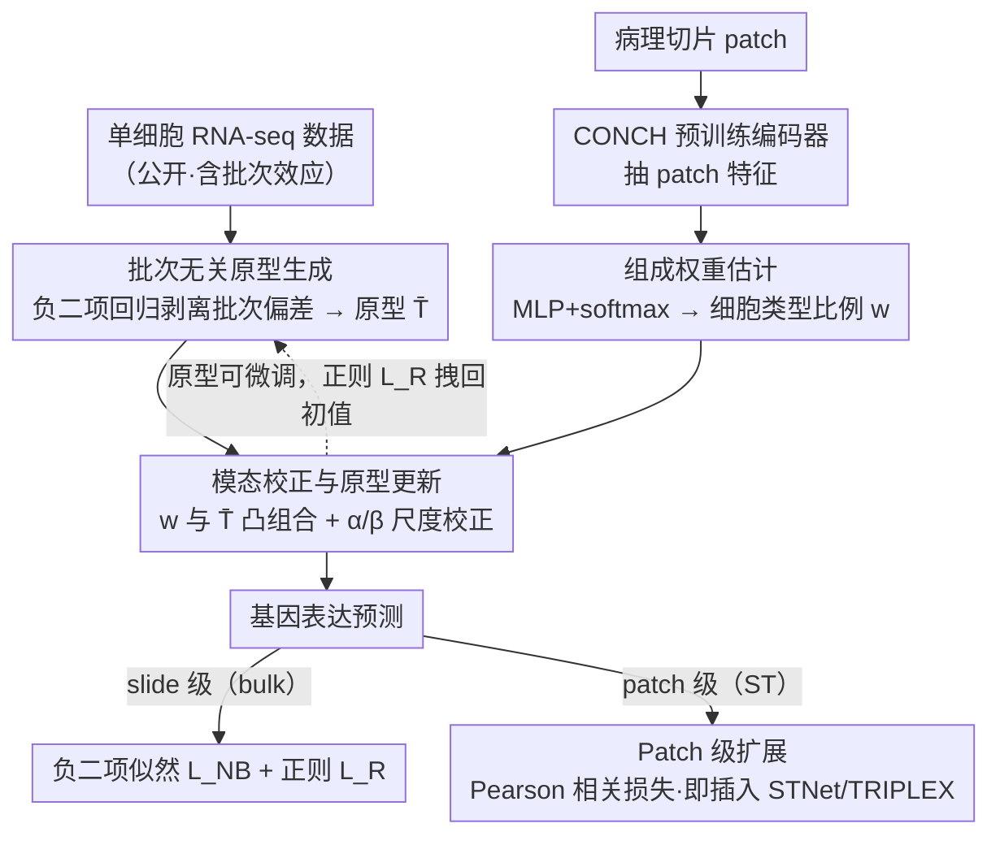

# Cell-Type Prototype-Informed Neural Network for Gene Expression Estimation from Pathology Images

**会议**: CVPR 2026  
**arXiv**: [2603.18461](https://arxiv.org/abs/2603.18461)  
**代码**: [https://github.com/naivete5656/CPNN](https://github.com/naivete5656/CPNN)  
**领域**: 计算生物
**关键词**: 基因表达估计, 病理图像, 单细胞RNA测序, 细胞类型原型, 多实例学习

## 一句话总结

提出 CPNN，利用公开单细胞 RNA-seq 数据构建细胞类型原型（cell-type prototype），将 slide/patch 级基因表达建模为原型的加权组合，在基因表达估计任务上取得 SOTA 并提供可解释性。

## 研究背景与动机

从病理全切片图像（WSI）直接预测基因表达是低成本替代 RNA 测序的重要方向。现有方法分两类：slide 级（bulk transcriptomics，用 MIL 架构）和 patch 级（spatial transcriptomics，用 Transformer/GNN）。但这些方法都只在聚合层面学习，**没有显式建模基因表达的数据生成过程**——即观测到的表达其实是由底层每个细胞的表达聚合而来的。

核心矛盾：单细胞 RNA-seq 数据提供了细胞级表达信息，但它噪声大、有批次效应、没有对应病理图像，不能直接用于 WSI 回归。

本文核心 idea：从单细胞数据中提取**稳定的细胞类型原型**（各类细胞的平均表达 profile），用原型作为先验约束预测空间。模型从图像估计各 patch 的细胞类型组成权重，再通过权重与原型的矩阵乘法得到基因表达预测。

## 方法详解

### 整体框架

CPNN 想解决的问题很具体：直接拿病理图像回归基因表达，模型学的是"图像聚合特征 → 表达聚合值"这个黑箱映射，完全无视了一个生物学事实——观测到的表达本来就是切片里各个细胞表达的叠加。CPNN 把这个生成过程显式写进模型：先从公开单细胞 RNA-seq 数据里提炼出"每类细胞长什么样"的稳定原型 $\bar{T}$，再让网络只负责从图像判断"这块组织由哪几类细胞、各占多少"，最后两者相乘还原出基因表达。整条链路分三步走——估原型 $\bar{T}$、估组成权重 $w$、用负二项似然端到端优化，把一个回归任务拆成了"先验知识 + 可解释的组成估计"；在 patch 级（空间转录组）场景下，这套机制还能换一个抗噪损失、当即插即用模块挂到现成模型上。

### 关键设计

**1. 批次无关原型生成：把单细胞数据里的技术噪声剥干净，只留生物学信号**

单细胞数据是个"脏先验"——不同实验批次的测序深度、试剂条件都不一样，同一类细胞在不同 batch 里的读数能差出一截，直接拿来当原型会把技术变异也学进去。CPNN 不做简单平均，而是用负二项回归把每个 batch 的系统性偏差显式建模出来：$\mu_{c,g}^{\mathrm{sc}} = (t_{c,g} + b_d)s_d$，其中 $t_{c,g}$ 是细胞类型 $c$ 在基因 $g$ 上的"真值"表达，$s_d$、$b_d$ 是实验条件 $d$ 的缩放和偏移。拟合完把 $s_d$、$b_d$ 除掉，留下的 $\bar{T}$ 就是抹平了批次效应、只保留生物学上稳定的基因共变模式的原型。这一步是整个方法可信的地基——原型不干净，后面权重乘出来的预测全是噪声。

**2. 组成权重估计：让网络只回答"这是什么细胞、占多少"，而不是硬背表达值**

图像分支的任务被刻意限制得很窄：用预训练病理编码器 CONCH 抽 patch 特征 $\mathbf{h}_i^{(n)}$，过一个 MLP + softmax，输出的是细胞类型比例 $w(\mathbf{x}_i^{(n)})$——一个落在单纯形上的组成向量。基因表达不是网络直接吐出来的，而是用这个权重去线性组合原型：

$$\mu_g^{\mathrm{b}}(\mathcal{X}^{(n)}) = \alpha_g \sum_i \sum_c w(\mathbf{x}_i^{(n)})_c \bar{T}_{c,g} + \beta_g$$

这里 $\alpha_g$、$\beta_g$ 是基因特异的缩放/偏移，专门用来弥合"单细胞测的表达尺度"和"bulk/ST 测的表达尺度"之间的模态落差。这样设计的好处是搜索空间被原型死死约束住了：网络再怎么乱学，输出也只能是若干真实细胞 profile 的凸组合，比让它在整个高维表达空间里自由回归要稳得多，也天然带来可解释性。

**3. 模态校正与原型更新：允许原型微调去贴目标分布，又不让它跑偏到失去意义**

单细胞原型和病理图像对应的 bulk/ST 表达终究不是同一个分布，原型完全冻死会贴不上目标，但放开让它自由更新又会退化成普通可学习参数、丢掉"对应真实细胞类型"这个语义。CPNN 的折中是让 $\bar{T}$ 在训练中可微调，同时加一个把它拽回初始值的正则：

$$L_R = \|\bar{T}^0 - \bar{T}\|^2 + \mathbb{E}_n\big[\|\mathbf{W}^{(n)} - \bar{\mathbf{W}}^{(n)}\|^2\big]$$

前一项约束原型别偏离 scRNA-seq 估出的初值太远，后一项约束 patch 权重别偏离其切片均值太远。消融里这一点的作用很直白：原型完全不更新不校正时 SCC 只有 0.174（模态差异直接把模型压崩），加了校正、允许更新后回到 0.336，再补上正则到 0.338——正则几乎不涨点，但它换来的是"权重仍能解读成真实细胞组成"这件事。

**4. Patch 级扩展：换一个对噪声更友好的损失，做成即插即用模块**

空间转录组学（ST）是 patch 级、单点测序，数据比 bulk 噪声大得多，负二项似然在这种稀疏高噪场景下不稳。CPNN 在 ST 设置下把似然损失换成 Pearson 相关损失，只关心预测和真值的趋势一致而不死磕绝对值。更关键的是整套"原型 + 组成权重"机制不依赖特定主干，可以当一个即插即用模块挂到现成 ST 模型（如 STNet、TRIPLEX）上——实验里嵌进 TRIPLEX 后 CSCC 的 SCC 从 0.1239 直接提到 0.1821。

### 损失函数 / 训练策略

总损失 $L_{\text{total}} = L_{\text{NB}} + \lambda L_R$，其中 $L_{\text{NB}}$ 是负二项分布负对数似然，$L_R$ 是对原型和权重的正则化。AdamW 优化器，batch size 16，500 epochs，$\lambda = 10^3$。4-fold 交叉验证。

## 实验关键数据

### 主实验

**Slide 级基因表达估计**

| 数据集 | 指标(SCC) | CPNN | 之前最佳 | 提升 |
|--------|-----------|------|----------|------|
| BRCA | SCC | **0.338** | 0.314 (MOSBY) | +0.024 |
| KIRC | SCC | **0.318** | 0.292 (HE2RNA) | +0.026 |
| LUAD | SCC | **0.304** | 0.286 (SRMambaMIL) | +0.018 |

**Patch 级基因表达估计（嵌入 TRIPLEX）**

| 数据集 | 指标(SCC) | TRIPLEX+CPNN | TRIPLEX | 提升 |
|--------|-----------|--------------|---------|------|
| CSCC | SCC | **0.1821** | 0.1239 | +0.0582 |
| Her2st | SCC | **0.1194** | 0.0861 | +0.0333 |
| STNet | SCC | **0.0621** | 0.0546 | +0.0075 |

### 消融实验

| 配置 | SCC (BRCA) | 说明 |
|------|-----------|------|
| w/o PI, MC, R（从头训练） | 0.305 | 无原型指导，类似 MOSBY |
| w/o MC, U, R（原型不更新不校正） | 0.174 | 模态差异过大导致崩溃 |
| w/o U, R（加模态校正） | 0.248 | 校正不足以完全弥合差异 |
| w/o R（原型可更新） | 0.336 | 接近完整模型 |
| **完整 CPNN** | **0.338** | 正则保持可解释性 |

### 关键发现

- 细胞类型标签粒度：粗粒度（8类）SCC=0.317，中等（29类）0.336，细粒度（49类）0.338，过粗会损失信息。
- 生物学验证：BRCA 各亚型的组成权重与已知生物学特征一致——Basal-like 的 Cycling 原型权重最高（高增殖），LumB > LumA。

## 亮点与洞察

- "间接利用"单细胞数据：不直接配对，而是提取稳定原型作为先验，回避噪声和模态不匹配。
- 模型自带可解释性：权重可直接解读为"这个 patch 主要由哪种细胞类型驱动"，对病理分析有实际意义。
- 即插即用设计使其可与已有 ST 方法结合，实际应用灵活。

## 局限与展望

- 依赖有标注的单细胞数据集，对无公开 scRNA-seq 的组织类型不适用。
- 原型是对各细胞类型的平均表达，无法捕捉同一类型内的表达变异。
- SCC 绝对值仍然不高（~0.3），说明从形态到表达的映射本身很难。
- 没有尝试更先进的 MIL 聚合器（如 graph-based）。

## 相关工作与启发

- 与 cell deconvolution 的区别：deconvolution 估计细胞比例来重建已知表达，本文反过来用比例和原型从图像预测未知表达。
- 借鉴 PINN 思想：用先验知识（细胞类型原型）约束模型输出空间。
- 可启发其他"利用辅助数据但模态不匹配"的场景。

## 评分

- **新颖性**: ⭐⭐⭐⭐ 细胞类型原型引入是对基因表达预测的结构性创新
- **实验充分度**: ⭐⭐⭐⭐ 6 个数据集，slide/patch 两种设置，消融完整
- **写作质量**: ⭐⭐⭐⭐ 问题建模清晰，公式推导规范
- **价值**: ⭐⭐⭐⭐ 可解释性+性能提升，对计算病理学有实际意义

<!-- RELATED:START -->

## 相关论文

- [\[NeurIPS 2025\] Learning Relative Gene Expression Trends from Pathology Images in Spatial Transcriptomics](../../NeurIPS2025/computational_biology/learning_relative_gene_expression_trends_from_pathology_images_in_spatial_transc.md)
- [\[CVPR 2026\] HINGE: Adapting a Pre-trained Single-Cell Foundation Model to Spatial Gene Expression Generation from Histology Images](adapting_a_pre-trained_single-cell_foundation_model_to_spatial_gene_expression_g.md)
- [\[CVPR 2026\] From Spots to Pixels: Dense Spatial Gene Expression Prediction from Histology Images](from_spots_to_pixels_dense_spatial_gene_expression_prediction_from_histology_ima.md)
- [\[CVPR 2026\] Predicting Spatial Transcriptomics from Histology Images via High-Order Multi-Cell Interaction Modeling](predicting_spatial_transcriptomics_from_histology_images_via_high-order_multi-ce.md)
- [\[ICLR 2026\] Intrinsic Lorentz Neural Network](../../ICLR2026/computational_biology/intrinsic_lorentz_neural_network.md)

<!-- RELATED:END -->
