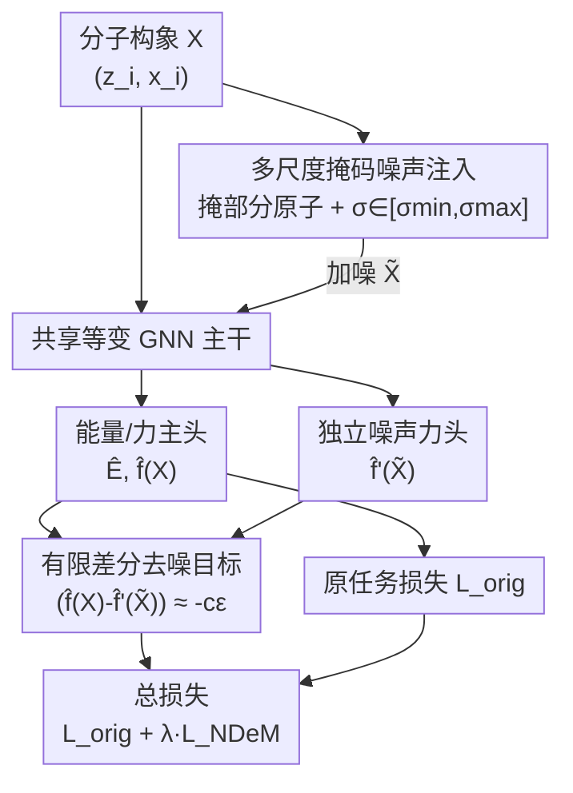

# Coordinate Denoising for Non-Equilibrium Molecular Representation Learning

**会议**: CVPR 2026  
**论文**: [CVF Open Access](https://openaccess.thecvf.com/content/CVPR2026/html/Tang_Coordinate_Denoising_for_Non-Equilibrium_Molecular_Representation_Learning_CVPR_2026_paper.html)  
**代码**: 无  
**领域**: 分子表示学习 / 计算化学  
**关键词**: 坐标去噪, 非平衡态分子, 力场学习, 有限差分, 辅助任务  

## 一句话总结
针对"坐标去噪等价于力场学习"这一结论只在平衡态成立的缺陷，本文用势能面的二阶有限差分推导出对任意构象都成立的去噪目标 NDeM，把它做成一个即插即用、无需预训练的辅助任务，在 MD17 / QM9 / OC20 上稳定提升各种等变 GNN 的力预测精度。

## 研究背景与动机

**领域现状**：3D 分子表示学习里有一条很优雅的自监督范式——坐标去噪（coordinate denoising）。给分子原子坐标加高斯噪声、训网络把噪声预测回去，在统计力学下可以证明这等价于 Score Matching，也就是在学势能面（PES）的梯度，即原子受力场。Frad、SliDe、SE(3)-DDM 这些方法都靠它在力/能量预测上拿到了很强的结果。

**现有痛点**：这套等价关系有一个**隐含前提**——干净结构 $X$ 必须处在能量极小值（平衡态），此时原子的固有净力近似为零。可现实里大量分子根本不在平衡态：分子动力学（MD）轨迹、化学反应过渡态、催化、蛋白折叠中的瞬态构象，原子都受着显著的非零固有力，正被推向更低能量的构型。

**核心矛盾**：在非平衡态下，网络去预测人为添加的噪声 $\epsilon$，其实是在试图把分子"复原"回一个并非能量极小值的瞬态 $X$。此时去噪目标被分子自身的固有动力学"污染"，与真实力场不再等价（论文 Figure 1：平衡态下噪声方向≈受力方向，非平衡态下两者被固有力错位）。结果就是去噪学到的表示在通用 MD 数据上质量打折、不鲁棒。

**本文目标**：推导出一个对平衡态和非平衡态**都成立**的去噪目标，并且不增加架构负担、不需要单独的预训练阶段。

**切入角度**：既然问题出在"去噪假设固有力为零"，那就别假设——把固有力 $F(X)$ 显式地从噪声里**解耦**出来。作者用势能面在任意构象 $X$ 附近的二阶 Taylor 展开来描述"加噪前后力的变化量"，这个变化量才是真正只由噪声决定、可以拿来监督的物理量。

**核心 idea**：用"扰动前后受力之差"代替"原始噪声"作为去噪监督目标——$F(\tilde X)-F(X)\approx -c\,\epsilon$，从而把去噪从平衡态推广到任意构象。

## 方法详解

### 整体框架

NDeM（Node Denoising on non-Equilibrium Molecules）不改主干、不改主任务，而是给标准的"等变 GNN 预测能量+力"训练管线挂一个辅助任务。

主任务照常走：原始分子 $M=\{(z_i,x_i)\}$ 进等变 GNN，输出能量 $\hat E$ 和每原子力 $\hat f_i$，用归一化后的能量损失 $\mathcal L_E$、力损失 $\mathcal L_F$ 监督（论文用 $\lambda_E:\lambda_F=1:100$，因为力更难学）。

辅助任务并行走：把同一分子加噪得到 $\tilde X$，喂进**同一个主干**，但接一个**独立的 Noisy Force Head** 输出"噪声力" $\hat f'_i(\tilde X)$。监督信号不是裸噪声，而是由有限差分推出的"力差应当正比于负噪声"这一约束。两条任务共享主干、联合优化，本质上是让模型在学绝对力值的同时，也学局部的力梯度（PES 曲率）。

整条管线是"共享主干 + 双输出头 + 双分支输入"的结构，画成框架图如下：

### 关键设计

**1. 有限差分去噪目标：把固有力从噪声里解耦**

这是全文的理论核心，直接针对"非平衡态下去噪不再等价于力场学习"这个痛点。作者不再像经典去噪那样直接预测噪声，而是在任意构象 $X$ 处对势能面做二阶 Taylor 展开：

$$E(\tilde X)\approx E(X)+\nabla E(X)^\top \epsilon+\tfrac12\,\epsilon^\top \mathbf H(X)\,\epsilon$$

其中 $\epsilon=\tilde X-X$ 是扰动，$\nabla E(X)=-F(X)$ 是负力场，$\mathbf H(X)=\nabla^2 E(X)$ 是刻画 PES 曲率的 Hessian。对 $\tilde X$ 求梯度并代入 $F=-\nabla E$，得到扰动前后受力的关系：

$$-F(\tilde X)\approx -F(X)+\mathbf H(X)\,\epsilon$$

直接算 Hessian 在训练里代价过高，作者做了一个**各向同性曲率近似**：对小局部扰动 $\epsilon$，假设 $\mathbf H(X)\approx c\mathbf I$（$c$ 是表示局部曲率的标量）。于是关系式化简为可计算的有限差分形式：

$$F(\tilde X)-F(X)\approx -c\,\epsilon$$

这一式子的妙处在于：它**显式地把固有力 $F(X)$ 单列出来**，去噪监督的对象只剩下"扰动引起的力变化 $-c\epsilon$"，与分子本身是否处在平衡态无关。平衡态（$F(X)\approx0$）时它自动退化回经典去噪 $F(\tilde X)\approx-c\epsilon$，是一个特例；非平衡态（$F(X)\neq0$）时它依然严格成立。值得一提的是，作者没有把 $c$ 设成固定超参，而是让它**隐式地成为辅助力头里的可学习量**，使模型能自适应不同构象的 PES 曲率。

**2. 独立的 Noisy Force Head：避免扰动力与真实力互相干扰**

有限差分目标需要同时拿到"干净分子上的真实力 $\hat f_i(X)$"和"加噪分子上的扰动力 $\hat f'_i(\tilde X)$"。一个自然的疑问是：既然两者输出维度一样，为什么不复用主力头？作者的消融（Table 6 下方分析）给出明确答案——**直接用主力头同时输出噪声力会拖垮原始力预测精度**。

原因是非平衡态下扰动力与未扰动力的方向显著发散（Figure 1），让同一个等变头去表示这两种物理上不同的量，会在共享主干里诱发优化干扰。因此 NDeM 用一个**专门的辅助等变头 $\text{GNN}_{F'}$**，它与主头共享主干但参数独立。NDeM 损失写作扰动前后力差对负噪声的回归：

$$\mathcal L_{\text{NDeM}}=\mathbb E_{X,\epsilon}\Big[\tfrac1N\sum_{i=1}^N\big\|(\hat f_i(X)-\hat f'_i(\tilde X))-\epsilon^*_i\big\|^2\Big]$$

其中 $\epsilon^*_i$ 是归一化后的真值噪声。辅助头还能借助主干里关于原始分子力的隐表示，让噪声力更好地与真实力对齐，反过来增强力场学习。总目标为 $\mathcal L_{\text{total}}=\mathcal L_{\text{orig}}+\lambda_{\text{NDeM}}\mathcal L_{\text{NDeM}}$。

**3. 多尺度掩码噪声注入：让 Taylor 近似有效又保留探索**

有限差分目标依赖二阶 Taylor 展开，前提是扰动 $\epsilon$ 足够小——噪声太大就会破坏分子结构、近似失效；太小又缺乏探索性。为兼顾两者，作者每个 iteration 随机**掩盖一部分原子、只对它们加噪**，且噪声标准差 $\sigma$ 在每个 batch 从区间 $[\sigma_{\min},\sigma_{\max}]$ 里采样。这种多尺度掩码策略让模型在不同扰动尺度上都能学到鲁棒表示，同时把噪声幅度控制在 Taylor 展开有效的范围内（消融显示 $\sigma$ 过大到 0.5 时精度明显变差）。

## 实验关键数据

### 主实验

在 MD17（非平衡 MD 轨迹，力预测，950/50 训练/验证）上，NDeM 以 TorchMD-NET 为主干、对标专为平衡态设计且需预训练的 Frad / SliDe，力预测 MAE 取得 8 个分子中 5 个最优：

| 分子 (MD17) | TorchMD-NET | Frad | SliDe | NDeM |
|--------|------|------|------|------|
| Aspirin | 0.2450 | 0.2087 | 0.1740 | **0.1654** |
| Ethanol | 0.1067 | 0.0910 | 0.0882 | **0.0868** |
| Malonaldehyde | 0.1667 | 0.1415 | 0.1538 | **0.1439**⚠️（SliDe 0.1538 更高，NDeM 此列为次优，原文标其"最优 5/8"） |
| Naphthalene | 0.0593 | 0.0530 | 0.0483 | **0.0480** |
| Salicylic Acid | 0.1284 | 0.1081 | 0.1006 | **0.1004** |
| Toluene | 0.0644 | 0.0540 | 0.0540 | **0.0536** |
| Uracil | 0.0887 | 0.0760 | 0.0825 | **0.0806** |

在大规模催化数据集 OC20 的 S2EF 任务上，以 EquiformerV2 为主干，NDeM 把力 MAE 压到比 DeNS 更低：

| 模型 (OC20 S2EF test) | Energy MAE (meV)↓ | Force MAE (meV/Å)↓ |
|------|------|------|
| EquiformerV2 ($\lambda_E{=}4$, 153M) | 219 | 14.2 |
| EquiformerV2 + DeNS (160M) | 216 | 13.4 |
| EquiformerV2 + NDeM ($\lambda_E{=}2$, 157M) | 227 | **12.9** |

此外在以平衡态为主的 QM9 上，NDeM 在多数性质（如 $\mu$ 0.0082、$\alpha$ 0.0356、gap 26.0 meV）上与专门为平衡态预训练的 Frad / SliDe 持平或更优，说明它对平衡/非平衡数据都通用。

### 消融实验

| 配置 | Aspirin MAE↓ | 说明 |
|------|---------|------|
| $\lambda_{\text{NDeM}}=0$ | 0.2087 | 无辅助任务（退化为纯监督）|
| $\lambda_{\text{NDeM}}=0.1$ | 0.1688 | 加入辅助任务即大幅提升 |
| $\lambda_{\text{NDeM}}=1$ | **0.1654** | 最优权重 |
| $\lambda_{\text{NDeM}}=10$ | 0.1671 | 过大略降 |
| $\lambda_{\text{NDeM}}=100$ | 0.1722 | 辅助任务喧宾夺主 |

噪声尺度消融：$\sigma=0.05$ 最优（0.1654），$\sigma=0.5$ 时退化到 0.1887，验证"扰动需足够小以保 Taylor 近似"。

兼容预训练（Table 6）：从 Frad 预训练权重微调，标准续训 0.2088 → 加 NDeM 0.1774；从 SliDe 续训 0.1698 → 加 NDeM 0.1648，且与从零训的 NDeM（0.1654）相当甚至更好。

### 关键发现
- 辅助任务权重一上来（$\lambda=0.1$）就把 Aspirin MAE 从 0.2087 砍到 0.1688，提升主要来自"有没有这个物理约束"而非精细调参；但 $\lambda$ 过大（100）会干扰主任务。
- 独立噪声力头是必要设计：复用主力头会因扰动力/真实力方向发散而引发优化干扰，拖累原始力预测。
- NDeM 与预训练正交互补——既能从零训出 SOTA，也能叠加在 Frad/SliDe 预训练权重上进一步精修。

## 亮点与洞察
- **把"平衡态特例"还原成"任意态通式"**：经典去噪只是 $F(X)\approx0$ 的特殊情形，NDeM 用一阶 Taylor 的力关系 + 各向同性 Hessian 近似把它推广到一般构象，理论上自洽且向后兼容，这种"用更一般的物理推导覆盖旧结论"的思路很漂亮。
- **可学习曲率 $c$**：不把 PES 局部曲率当固定超参，而是隐式塞进辅助力头，让模型按构象自适应，既省去调参又更贴合不同分子区域的真实曲率。
- **即插即用、架构无关、零预训练**：作为辅助 loss 与主任务并行优化，能挂到 TorchMD-NET、EquiformerV2 等任意等变主干上，这种"一个损失项换全面涨点"的迁移性很值钱——可直接搬到任何力/能量回归的分子模型。

## 局限与展望
- **各向同性 Hessian 近似偏强**：把 $\mathbf H(X)$ 简化成标量 $cI$ 丢掉了 PES 的各向异性曲率信息，在曲率方向差异大的过渡态区域可能不够精确；作者也把"高阶 Hessian 近似"列为未来方向。
- **依赖小扰动**：有限差分目标只在 $\epsilon$ 较小时成立（$\sigma$ 到 0.5 即明显退化），意味着它能探索的构象邻域有限，对远离当前构象的大幅形变帮助不大。
- **提升幅度偏温和**：MD17 上相对 SliDe 多为第三位小数的改进，OC20 能量 MAE 甚至略逊于基线（227 vs 219），收益主要体现在力预测；该方法更像"稳健的通用增益"而非颠覆性飞跃。
- ⚠️ 论文未提供开源代码链接，复现需自行实现辅助头与多尺度掩码噪声。

## 相关工作与启发
- **vs 经典坐标去噪 / Frad / SliDe**：它们建立了"去噪 ⟺ 力场学习"的等价，但隐含假设干净结构在能量极小值，因而面向平衡态、且常需单独预训练；NDeM 显式解耦固有力，对非平衡态严格成立，且作为辅助任务无需预训练，二者还能叠加。
- **vs DeNS（OC20 上的去噪策略）**：同样在大规模催化数据上做去噪式增强，NDeM 借多尺度掩码噪声 + 有限差分目标在力 MAE 上更低（test 12.9 vs 13.4 meV/Å）。
- **vs Noisy Nodes**：最早把噪声注入当作属性预测的辅助任务，但停留在正则化层面；NDeM 给去噪辅助任务补上了非平衡态下的物理依据（二阶 Taylor + Hessian 近似）。

## 评分
- 新颖性: ⭐⭐⭐⭐ 把去噪-力场等价从平衡态推广到任意构象，理论切入点清晰且实用
- 实验充分度: ⭐⭐⭐⭐ MD17/QM9/OC20 三数据集 + 多主干 + 权重/噪声/预训练兼容性消融较完整
- 写作质量: ⭐⭐⭐⭐ 理论推导层层递进、动机与公式衔接清楚
- 价值: ⭐⭐⭐⭐ 即插即用、架构无关、零预训练，对分子力场建模社区有直接迁移价值

<!-- RELATED:START -->

## 相关论文

- [\[ICML 2026\] Flow Sampling: Learning to Sample from Unnormalized Densities via Denoising Conditional Processes](../../ICML2026/computational_biology/flow_sampling_learning_to_sample_from_unnormalized_densities_via_denoising_condi.md)
- [\[NeurIPS 2025\] Curly Flow Matching for Learning Non-gradient Field Dynamics](../../NeurIPS2025/computational_biology/curly_flow_matching_for_learning_non-gradient_field_dynamics.md)
- [\[ICLR 2026\] Learning Molecular Chirality via Chiral Determinant Kernels](../../ICLR2026/computational_biology/learning_molecular_chirality_via_chiral_determinant_kernels.md)
- [\[ICML 2026\] Learning Protein Structure-Function Relationships through Knowledge-guided Representation Decomposition](../../ICML2026/computational_biology/learning_protein_structure-function_relationships_through_knowledge-guided_repre.md)
- [\[AAAI 2026\] S2Drug: Bridging Protein Sequence and 3D Structure in Contrastive Representation Learning for Virtual Screening](../../AAAI2026/computational_biology/s2drug_bridging_protein_sequence_and_3d_structure_in_contrastive_representation_.md)

<!-- RELATED:END -->
