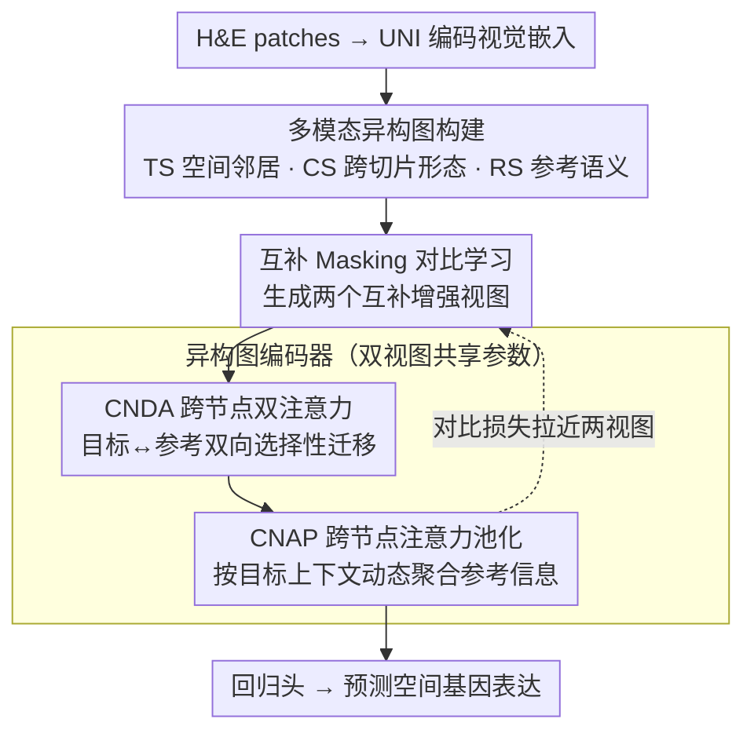

# Cross-Slice Knowledge Transfer via Masked Multi-Modal Heterogeneous Graph Contrastive Learning for Spatial Gene Expression Inference

**会议**: CVPR 2026  
**arXiv**: [2603.22821](https://arxiv.org/abs/2603.22821)  
**代码**: [https://github.com/wenwenmin/SpaHGC](https://github.com/wenwenmin/SpaHGC)  
**领域**: 医学图像分析 / 空间转录组学  
**关键词**: 空间转录组学, 异构图学习, 跨切片知识迁移, 对比学习, 基因表达预测

## 一句话总结
提出 SpaHGC，一种基于多模态异构图的框架，通过构建目标切片内、跨切片和参考切片内三种子图，结合 masked graph 对比学习和跨节点双注意力机制，实现从 H&E 病理图像预测空间基因表达，在七个数据集上 PCC 指标提升 7.3%-27.1%。

## 研究背景与动机

**领域现状**：空间转录组学（ST）技术能精确量化组织中基因表达的空间分布，但实验成本高昂限制了大规模应用。从 H&E 病理图像预测 ST 基因表达是一种有前景的替代方案。

**现有痛点**：(1) ST 数据稀疏有噪声——某些位置基因表达缺失或极低；(2) 现有方法仅建模单切片内空间结构，忽视了不同切片之间共享的表达模式；(3) 个体差异和疾病进展引入跨样本异质性，单切片模型难以学到泛化表征。

**核心矛盾**：同类组织/疾病通常共享共性表达模式，但个体差异导致跨切片直接对齐困难——如何有效整合共享信息同时处理个体差异？

**本文要解决**：如何建模跨切片空间关系，将多个参考切片的先验知识迁移到目标切片的基因表达预测中？

**切入角度**：构建多模态异构图，用病理学基础模型（UNI）的图像嵌入连接跨切片 spot，通过对比学习增强特征表征的鲁棒性。

**核心 idea**：异构图 + 跨切片知识迁移 + Masked 对比学习 = 更准确的基因表达预测。

## 方法详解

### 整体框架
SpaHGC 要解决的核心问题是：单切片模型只看一张切片，学不到不同样本之间共享的表达模式。它的思路是把目标切片和若干参考切片织进同一张异构图，让目标 spot 能"借"到参考切片里形态相似的先验知识。整条流水线大致是这样转的：先用病理基础模型 UNI 把每个 H&E patch 编码成视觉嵌入，再围绕每个目标 spot 同时拉起三种边——切片内的空间邻居、跨切片的形态相似 patch、参考切片内部的语义连接，构成一张异构图；然后对节点特征做互补 masking 得到两个增强视图，送进一个共享参数的异构图编码器——其中切片内/参考内的边用 GraphSAGE 聚合、跨切片边交给 CNDA 做双向迁移，再由 CNAP 按目标上下文把参考信息池化进来；最后由回归头从聚合后的目标节点表征预测基因表达，训练时辅以对比损失让两个互补视图的表征保持一致。

### 关键设计

**1. 多模态异构图构建：用三种边把"局部空间—跨切片形态—参考语义"织进一张图**

ST 数据稀疏、单切片信息有限，光靠目标切片自己的邻居不足以约束预测。SpaHGC 因此为每个目标 spot 同时建三类连接。Target-slice（TS）图按欧式距离连接目标切片内 $Q$ 个最近邻 spot，捕获组织在空间上的局部连续性；Cross-slice（CS）图对每个目标 patch 嵌入 $\mathbf{z}_t^{(i)}$ 去参考切片里检索余弦相似度 Top-K 的 patch 建边，把"长得像"的跨切片 spot 拉到一起，注意参考节点带的是联合特征 $\mathbf{h}_r = [\mathbf{z}_r \| \mathbf{y}_r]$，视觉嵌入和真实基因表达拼在一起，所以这条边迁移的不只是形态、还有表达标签；Reference-slice（RS）图则在参考节点之间按联合特征相似度建 Top-K 连接，搭起一个全局语义支架，让参考侧自己先形成稳定结构再去支撑目标。三类边各司其职——局部空间、跨切片形态、参考全局语义——异构地融在一张图里，这正是单切片同构图建模做不到的多层次信息整合。

**2. 互补 Masking 对比学习：用人为缺失逼出对噪声鲁棒的一致表征**

异构图建好后，先别急着编码——ST 测序本身就有大量特征缺失和噪声，如果模型只在干净特征上训练，部署时一遇到缺失就崩。SpaHGC 干脆把这种缺失搬进训练：对目标节点的邻居和参考节点分别按节点类型做特征 masking，生成两个拓扑相同、特征互补的增强视图，二者的 mask 严格互补（$\mathbf{M}_t^{(1)} + \mathbf{M}_t^{(2)} = \mathbf{1}$，即一个视图遮住的特征恰好是另一个视图保留的），随后两个视图共享同一套编码器参数前向，再用余弦距离对比损失拉近同一节点在两视图下的表征。因为两份视图各看到一半特征却要给出一致表征，模型被迫学会从残缺输入里恢复稳定语义——这正好对应 ST 数据真实的缺失/噪声场景。

**3. Cross Node Dual Attention（CNDA）：双向注意力做选择性的跨切片迁移**

masking 后的两个视图进入异构图编码器：切片内（TS）和参考内（RS）的边用 GraphSAGE 聚合，而最关键的跨切片（CS）边交给 CNDA。跨切片连接虽然带来了先验，但参考 spot 里也混着不相关甚至有害的噪声，需要一个能"挑着用"的机制。CNDA 在目标节点和参考节点之间做双向注意力：一方面目标节点 attend 参考节点，从中吸收视觉与基因知识，注意力权重为

$$\mathbf{A}_{t \leftarrow r} = \text{softmax}\!\left(\frac{\mathbf{Q}_t \mathbf{K}_r^\top}{\sqrt{d'}}\right), \qquad \bar{\mathbf{L}}_t = \mathbf{A}_{t \leftarrow r} \mathbf{V}_r$$

聚合得到迁移后的目标表征 $\bar{\mathbf{L}}_t$；另一方面参考节点也反过来 attend 目标节点更新自身。关键在于这套权重是数据自适应的——模型按相关性自动放大最该借的形态/表达信息、压低无关的跨切片噪声，而不是把检索到的邻居不加区分地平均进来，从而把"借知识"变成"挑着借"。

**4. Cross Node Attention Pooling（CNAP）：按目标上下文动态聚合辅助信息**

CNDA 解决"怎么 attend"，CNAP 解决"怎么把 attend 到的东西聚成一个表征"。它用多头单向 cross-node attention，把目标节点表征作为 query 去和参考节点表征做 cross-attention 聚合。和 EGGN 那类固定 exemplar retrieval（先检索若干范例再简单拼接/平均）相比，CNAP 的聚合权重随目标节点自身的上下文语义而变——同一批参考 spot，对处在肿瘤区和处在基质区的两个目标 spot 会被聚合出不同的辅助表征，因而能更灵活地适配不同组织区域的需求。

### 损失函数 / 训练策略
训练目标由对比损失和回归损失组成。对比损失对每个节点拉近两个互补视图的表征：

$$\mathcal{L}_{\text{con}} = \frac{1}{N} \sum_j \big(2 - 2 \cdot \text{Cos}(\hat{L}_j^1, \hat{L}_j^2)\big)$$

回归损失负责监督最终的基因表达预测。对比部分采用非对称设计——其中一个视图做 stop-gradient 当作稳定目标，避免两支同时更新导致表征塌缩。

## 实验关键数据

### 主实验（7 个公开 ST 数据集）

| 方法 | HER+ PCC% | cSCC PCC% | Lymph Node PCC% | Pancreas2 PCC% |
|------|----------|----------|----------------|---------------|
| STNet | 5.61 | 9.2 | 3.4 | 31.56 |
| HisToGene | 7.89 | 17.56 | 19.24 | 26.13 |
| mclSTExp | 23.15 | 31.88 | 21.64 | 31.61 |
| M2OST | 18.24 | 24.88 | 30.97 | 38.35 |
| **SpaHGC** | **27.86** | **38.79** | **35.02** | **41.36** |

### 消融实验

通过逐步移除组件验证有效性（从完整 SpaHGC 出发）：
- 移除 CNDA → PCC 下降明显，验证跨切片注意力的关键作用
- 移除 CS 图 → PCC 显著下降，验证跨切片连接的必要性
- 移除 Masking → 鲁棒性下降，验证对比学习的贡献
- 用 ResNet 替代 UNI → PCC 明显降低，验证强病理基础模型的重要性

### 关键发现
- 跨所有 7 个数据集，SpaHGC 的 PCC 提升幅度为 7.3%-27.1%，提升非常显著
- 预测结果在多个癌症相关通路中显著富集，验证了生物学相关性
- 跨切片知识迁移在不同平台（10x Visium、ST 1000 等）、组织类型和癌症亚型上均有效

## 亮点与洞察
- **跨切片知识迁移**：不同于只看单切片的现有方法，利用多个参考切片的先验知识是一个重要的范式转变
- **病理基础模型（UNI）的深度集成**：用预训练的强嵌入建立跨切片连接，充分利用大规模预训练的知识
- **生物学下游验证**：不仅关注数值指标，还做了通路富集分析等生物学验证

## 局限与展望
- 需要多个参考切片作为训练数据，对于极稀缺的组织类型可能受限
- 图构建中的 Top-K 连接依赖于 UNI 嵌入质量
- 未探索在构建异构图时纳入空间位置信息的细粒度方式

## 相关工作与启发
- BLEEP 和 mclSTExp 的对比学习对齐思路有启发，但 SpaHGC 的异构图框架更灵活
- EGGN 的 exemplar retrieval 思路与 SpaHGC 的 CS 图有相似性，但 SpaHGC 的图结构化方式更系统
- 互补 masking 策略可推广到其他多模态图学习任务

## 评分
- 新颖性: ⭐⭐⭐⭐ 异构图建模跨切片关系的思路有价值，但基础组件（GraphSAGE、注意力、对比学习）都是成熟技术的组合
- 实验充分度: ⭐⭐⭐⭐⭐ 7 个数据集+9 个基线+生物学下游分析，非常充分
- 写作质量: ⭐⭐⭐⭐ 结构清晰，图表丰富
- 价值: ⭐⭐⭐⭐ 对空间转录组学领域有显著推动，跨切片知识迁移是正确的方向

<!-- RELATED:START -->

## 相关论文

- [\[CVPR 2026\] HINGE: Adapting a Pre-trained Single-Cell Foundation Model to Spatial Gene Expression Generation from Histology Images](adapting_a_pre-trained_single-cell_foundation_model_to_spatial_gene_expression_g.md)
- [\[AAAI 2026\] Dual-Path Knowledge-Augmented Contrastive Alignment Network for Spatially Resolved Transcriptomics](../../AAAI2026/computational_biology/dual-path_knowledge-augmented_contrastive_alignment_network_for_spatially_resolv.md)
- [\[AAAI 2026\] HiFusion: Hierarchical Intra-Spot Alignment and Regional Context Fusion for Spatial Gene Expression Prediction from Histopathology](../../AAAI2026/computational_biology/hifusion_hierarchical_intra-spot_alignment_and_regional_context_fusion_for_spati.md)
- [\[NeurIPS 2025\] Learning Relative Gene Expression Trends from Pathology Images in Spatial Transcriptomics](../../NeurIPS2025/computational_biology/learning_relative_gene_expression_trends_from_pathology_images_in_spatial_transc.md)
- [\[ACL 2025\] Align-Pro: Align Protein Representations Through Multi-Modal Learning](../../ACL2025/computational_biology/align-pro_align_protein_representations_through_multi-modal_learning.md)

<!-- RELATED:END -->
