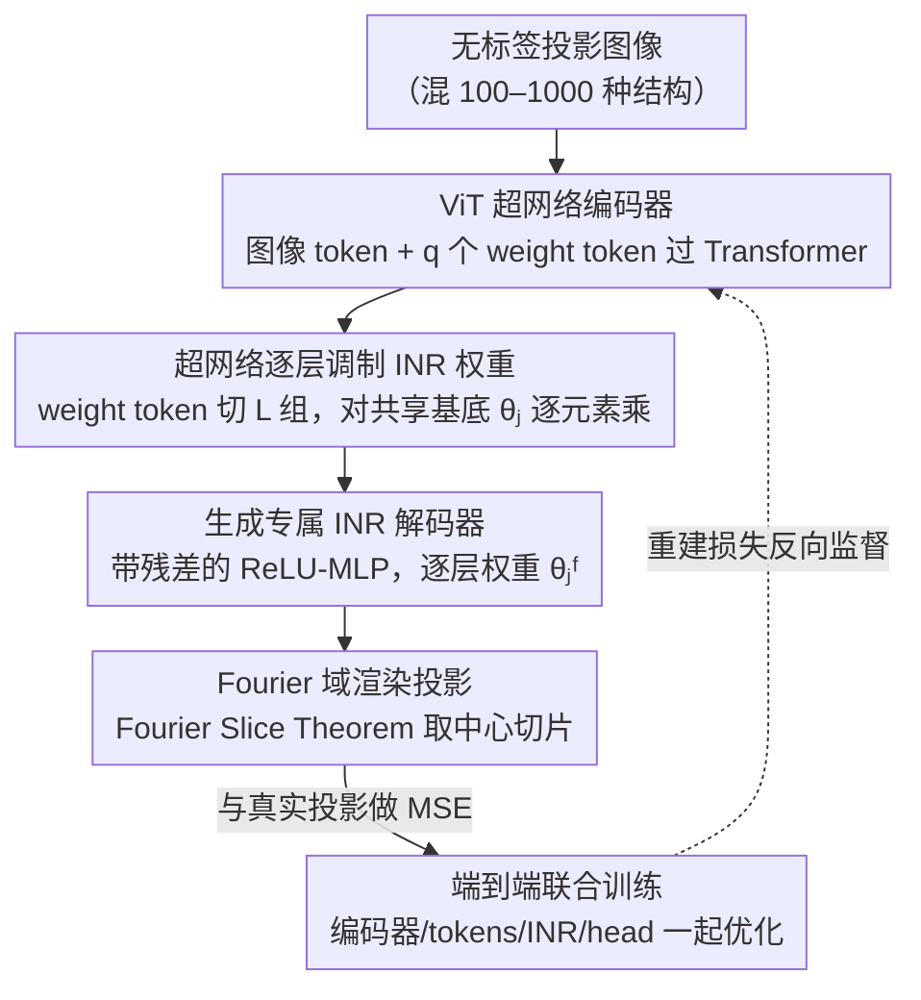

# CryoHype: Reconstructing a Thousand Cryo-EM Structures with Transformer-Based Hypernetworks

**会议**: CVPR 2026  
**arXiv**: [2512.06332](https://arxiv.org/abs/2512.06332)  
**代码**: [https://cryohype.cs.princeton.edu/](https://cryohype.cs.princeton.edu/)  
**领域**: 计算生物
**关键词**: Cryo-EM, 异构重建, Hypernetwork, Transformer, 隐式神经表示

## 一句话总结
提出 CryoHype，一种基于 Transformer 超网络的冷冻电镜重建方法，通过动态调整隐式神经表示（INR）的权重来减少参数共享，首次实现了从无标签冷冻电镜图像中同时重建 1000 种不同蛋白质结构。

## 研究背景与动机

**领域现状**：冷冻电镜（Cryo-EM）是解析生物大分子 3D 结构的关键技术。传统方法主要处理构象异质性（同一分子的不同构象），但该技术越来越多地用于复杂异质混合物场景。

**现有痛点**：(1) 3D 分类方法（EM 算法）内存和计算随类别数线性增长，无法扩展到大量类别（通常 $K<10$）；(2) 基于连续隐式表示的方法（如 cryoDRGN）强迫所有不同结构共享一套网络权重，在极端组成异质性下无法捕获高频细节；(3) cryoDRGN 使用 concatenation 条件化，等价于仅修改 INR 第一层的 bias，表达力有限。

**核心矛盾**：共享解码器权重 vs 需要为每种结构生成独特的高分辨率细节——参数过度共享限制了模型容量。

**本文要解决**：如何在面对极端组成异质性（100-1000 种不同结构）时，高质量重建每种结构？

**切入角度**：用 Transformer 超网络动态生成 INR 的权重，大幅减少不同结构间的参数共享。

**核心 idea**：超网络条件化（修改 INR 所有层的权重）≫ concatenation 条件化（仅修改第一层 bias），在极端异质性下提供更大的表达空间。

## 方法详解

### 整体框架
CryoHype 要解决的核心问题是：当一批无标签投影图像里混着 100–1000 种**完全不同**的蛋白质结构时，怎么让一个模型同时高质量重建每一种。它的思路是把"用同一个解码器、靠条件输入区分结构"换成"为每张图动态生成一套专属的解码器权重"。整条流水线是：投影图像先经 ViT 编码器（tokenizer + Transformer）读出一组权重描述；这组描述经线性 head 调制出一个隐式神经表示（INR）解码器的逐层权重；该 INR 在 Fourier 域里把 3D 体积渲染成投影，与真实投影做 MSE。具体由五个组件串起来：ViT 编码器、可学习的 weight tokens $\{w_i\}_{i=1}^q$、带残差连接的 ReLU-MLP 形式的 INR 解码器（共享基础参数 $\{\theta^j\}_{j=1}^L$）、以及每层一个的线性 head $\{\text{Head}_j\}_{j=1}^L$。全程在 Fourier 域操作，靠 Fourier Slice Theorem 把投影/反投影变成切片采样，省掉昂贵的数值积分。

### 关键设计

**1. 超网络逐层调制 INR 权重：把"改第一层 bias"升级成"改所有层权重"**

cryoDRGN 这类方法强迫所有结构共享同一套 INR 权重，只靠把隐变量 concatenate 进输入来区分——论文指出这在数学上等价于只改了 INR 第一层的 bias，留给每个结构的"个性化空间"极其有限，于是在极端异质性下高频细节全被抹平。CryoHype 的做法是让超网络去改 INR 的**每一层**权重：ViT 输出的 weight tokens 被切成 $L$ 组，第 $j$ 组经各自的 head 加归一化后，对该层的共享基础参数 $\theta_j$ 做逐元素乘法调制，$\theta_j^F = \text{Norm}(\text{Head}_j([w_1^{F,j}, \ldots, w_{a_j}^{F,j}])) \otimes \theta_j$。之所以用乘法去调制一套共享基底、而不是让超网络从零生成整张权重矩阵，是因为前者把超网络的负担降到"在共享底座上做缩放"，训练更稳；而调制覆盖全部层、又比只动第一层 bias 多出几个数量级的有效条件维度，这正是它能在 1000 种结构上还分得清细节的来源。

**2. 用 ViT 而非 CNN/MLP 当超网络编码器**

超网络的质量取决于编码器能从投影图里读出多少结构信息。这里没用结构生物常见的 U-Net，而是选了 ViT：投影图先 tokenize 成图像 token，再和 $q$ 个可学习 weight token 拼在一起过 Transformer，让 weight token 通过注意力从全图聚合证据后直接承载"该生成什么权重"。消融实验里 ViT 的 FSC_AUC 是 0.346，U-Net 只有 0.208、MLP 0.234，而后两者参数还更多——说明在"图像 → 一组权重"这种需要全局聚合的映射上，注意力机制的样本/参数效率明显高于卷积或全连接，这也是整个超网络能往上扩到上千结构的前提。

**3. 端到端联合训练**

ViT 编码器、weight tokens、INR 基础参数、各层 linear head 全部一起优化，不分阶段。训练信号只有一个：把生成的 INR 在 Fourier 域渲染出的投影和真实投影做 MSE。这样做避免了多阶段流水线里常见的误差累积——编码器学到的权重表示直接由最终重建质量来反向监督，而不是先训一个中间目标再拼接。

### 损失函数 / 训练策略
- 重建损失为 Fourier 域的 MSE：渲染投影与真实投影逐频率比对。
- 借 Fourier Slice Theorem 把投影建模成 3D Fourier 体积的中心切片，规避数值积分。
- 潜空间分析：把 weight tokens 的输出当作高维潜空间，先 PCA 降到 100 维、再 UMAP 降到 2 维做可视化，用于检查不同结构是否被分到清晰的聚类。

## 实验关键数据

### 主实验——Tomotwin-100（100 种结构）

| 方法 | Mean FSC_AUC↑ | Mean CD↓ | Mean vIoU↑ |
|------|-------------|---------|----------|
| cryoDRGN | 0.316 (0.046) | 2.26 | 0.63 |
| DRGN-AI-fixed | 0.202 (0.044) | 32.60 | 0.13 |
| Opus-DSD | 0.237 (0.049) | 33.48 | 0.14 |
| RECOVAR | 0.258 (0.109) | 27.22 | 0.16 |
| **CryoHype** | **0.346 (0.033)** | **2.18** | 0.61 |
| Backprojection (上界) | 0.364 (0.023) | 1.50 | 0.71 |

### Sim2Struct-1000 扩展实验

| 方法 | #结构 | FSC_AUC↑ | CD↓ | vIoU↑ |
|------|-------|---------|------|-------|
| cryoDRGN | 100 | 0.361 | 2.34 | 0.47 |
| CryoHype | 100 | **0.409** | **1.99** | **0.49** |
| cryoDRGN | 500 | 0.216 | 4.64 | 0.39 |
| CryoHype | 500 | **0.305** | **2.41** | **0.45** |
| cryoDRGN | 1000 | 0.139 | 9.07 | 0.26 |
| CryoHype | 1000 | **0.232** | **3.02** | **0.42** |

### 消融实验

| 配置 | Tomotwin-100 FSC_AUC↑ | 说明 |
|------|---------------------|------|
| Concatenation 条件化 | 0.255 | 等价于 cryoDRGN 方式 |
| U-Net 编码器 | 0.208 | CNN 编码器 |
| MLP 编码器 | 0.234 | 更多参数但更差 |
| **CryoHype (ViT + 超网络)** | **0.346** | 完整模型 |

### 关键发现
- CryoHype 在所有异质性水平上都显著超越 cryoDRGN，且优势随异质性增加而扩大
- 在 1000 种结构的极端设定下，cryoDRGN 的潜空间开始退化（UMAP 聚类模糊），而 CryoHype 仍保持清晰聚类
- INR 激活分布可视化显示 CryoHype 生成了更多样化的网络激活，证实了减少参数共享带来更大表达力
- 标准 FSC 指标在异质性重建中可能产生误导，实空间指标（CD、vIoU）提供了更准确的评估

## 亮点与洞察
- **范式创新**：从"共享网络 + 条件输入"到"动态生成网络权重"，超网络为 Cryo-EM 异质重建提供了新范式
- **可扩展性**：首次展示了 1000 种结构的同时重建，将 Cryo-EM 推向高通量结构发现
- **新数据集 Sim2Struct-1000**：为极端组成异质性研究提供了标准化 benchmark
- **新评估指标**：引入 Chamfer Distance 和 vIoU 作为 FSC 的补充，更好地评估形状差异

## 局限与展望
- **需要已知位姿**：目前假设粒子位姿已知，这在真实实验中并不成立。整合位姿估计是关键下一步
- 仅处理组成异质性，未处理构象+组成的联合异质性
- 训练数据量大（每种结构 1000 张投影），computation-heavy

## 相关工作与启发
- 超网络在 NeRF/INR 领域（pi-GAN、Transformers as Meta-Learners）的成功启发了本工作
- cryoDRGN 的 concatenation 条件化被证明等价于线性超网络修改第一层 bias——这个理论分析很有价值
- Cryo-EM 领域的 "从纯化样本到复杂混合物" 趋势对重建方法提出了更高要求

## 评分
- 新颖性: ⭐⭐⭐⭐⭐ 将超网络引入 Cryo-EM 重建是首创，理论动机清晰
- 实验充分度: ⭐⭐⭐⭐⭐ 多数据集+多基线+消融+新数据集+新指标
- 写作质量: ⭐⭐⭐⭐⭐ 推导清晰，动机明确，全文逻辑流畅
- 价值: ⭐⭐⭐⭐⭐ 对结构生物学高通量发现有重大意义

<!-- RELATED:START -->

## 相关论文

- [\[CVPR 2026\] CryoKRAQEN: Kernel-Regularized Annealing for Quantized Embedding Networks in Cryo-EM Heterogeneous Reconstruction](cryokraqen_kernel-regularized_annealing_for_quantized_embedding_networks_in_cryo.md)
- [\[CVPR 2026\] cryoSENSE: Compressive Sensing Enables High-throughput Microscopy with Sparse and Generative Priors on the Protein Cryo-EM Image Manifold](cryosense_compressive_sensing_enables_high-throughput_microscopy_with_sparse_and.md)
- [\[ICCV 2025\] CryoFastAR: Fast Cryo-EM Ab initio Reconstruction Made Easy](../../ICCV2025/computational_biology/cryofastar_fast_cryoem_ab_initio_reconstruction_made_easy.md)
- [\[ICLR 2026\] CryoNet.Refine: A One-step Diffusion Model for Rapid Refinement of Structural Models with Cryo-EM Density Map Restraints](../../ICLR2026/computational_biology/cryonetrefine_a_one-step_diffusion_model_for_rapid_refinement_of_structural_mode.md)
- [\[NeurIPS 2025\] Multiscale Guidance of Protein Structure Prediction with Heterogeneous Cryo-EM Data](../../NeurIPS2025/computational_biology/multiscale_guidance_of_protein_structure_prediction_with_heterogeneous_cryo-em_d.md)

<!-- RELATED:END -->
