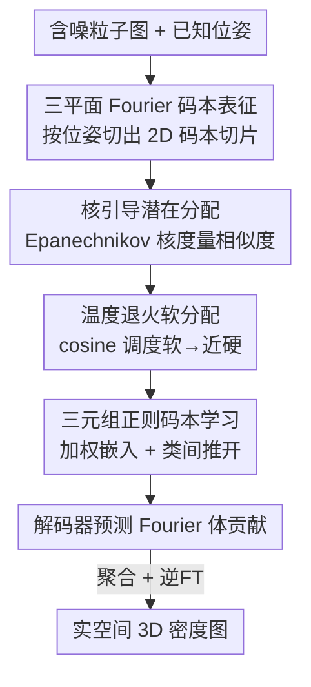

# CryoKRAQEN: Kernel-Regularized Annealing for Quantized Embedding Networks in Cryo-EM Heterogeneous Reconstruction

**会议**: CVPR 2026  
**论文**: [CVF Open Access](https://openaccess.thecvf.com/content/CVPR2026/html/Gao_CryoKRAQEN_Kernel-Regularized_Annealing_for_Quantized_Embedding_Networks_in_Cryo-EM_Heterogeneous_CVPR_2026_paper.html)  
**代码**: 仅项目主页（论文中以 "CryoKRAQEN" project page 形式给出，未见公开仓库）  
**领域**: 计算生物学 / Cryo-EM 异质重建 / 神经隐式表征  
**关键词**: Cryo-EM 异质重建, 三平面隐式表征, 量化码本, 核引导退火, 三元组正则

## 一句话总结
CryoKRAQEN 用一个**无编码器（decoder-only）的三平面 Fourier 码本**来做冷冻电镜异质重建：通过 Epanechnikov 核度量粒子图与码本原型的相似度、再用温度退火把软分配逐步收紧到近硬聚类，并加三元组正则稳住码本，从而在不依赖编码器和高斯先验的情况下，把噪声 2D 投影准确归到不同 3D 构象/组分，在 CryoBench 上与 SOTA 持平、在强组分异质数据上明显更好。

## 研究背景与动机
**领域现状**：冷冻电镜单颗粒重建靠对数万张含噪 2D 投影做平均来恢复 3D 结构，但很多大分子有构象柔性（同一分子在动）或组分异质（混合了不同分子），所以**异质重建**成了刚需。主流神经方法分两类：编码器-解码器框架（如 CryoDRGN）把图像编码成低维隐变量再解码成 Fourier 体；decoder-only 框架（如 DRGN-AI）给每个结构维护一个固定的隐码本，用梯度下降直接优化。

**现有痛点**：编码器-解码器路线受**高斯隐先验**限制，难以刻画离散构象跳变和多模态分布，且算力开销大、表达能力被编码器卡住；decoder-only 路线的码本随机初始化、没有显式结构正则，**对初始化极度敏感、容易陷入局部极小和坍塌**，在组分异质下尤其吃力。依赖预设结构先验的方法（3DFlex、CryoSTAR）在先验不准时会引入偏差；经典协方差方法（RECOVAR）可解释但线性假设限制了它在强非线性下的表现。

**核心矛盾**：异质重建的本质难题是**把含噪粒子图无监督地分配到未知 3D 构象**——分配太"硬"会模式坍塌（图像全挤进几个主导结构），分配太"软"又让不同构象糊成一团、分辨率下降。这是一个软硬之间的两难，现有方法要么在一端、要么没有显式机制去调度这个过渡。

**本文目标**：设计一个既能避免编码器/高斯先验的束缚、又能稳定码本学习、还能自适应平衡软硬分配的异质重建框架，让分配过程从"探索多个构象假设"平滑过渡到"收敛到最可能原型"。

**切入角度**：作者把"分配"看成一个**带核的、可退火的量化问题**——用紧支撑的 Epanechnikov 核做局部、抗噪的相似度加权，用温度退火控制软硬过渡，用三元组损失把不同构象在码本里推开。

**核心 idea**：用"三平面 Fourier 码本 + 核引导退火量化"替代"编码器 + 高斯先验"，在 Fourier 空间里把粒子图软-到-近硬地分配给结构原型，从而既稳又能分辨构象与组分异质。

## 方法详解

### 整体框架
CryoKRAQEN 是一个**统一的量化推理框架**：输入是一批含噪冷冻电镜粒子图（每张带已知位姿 $\phi_i$），输出是每颗粒子对应的 3D 密度图。它在 3D Fourier 空间里用**三平面隐式场**表示分子密度，并维护一个可学习的 Fourier 码本，每个码本条目是一个"结构原型"。对每颗粒子，先按其位姿从码本里切出 pose-specific 的 2D Fourier 切片，在 Fourier 空间度量观测图与各码本切片的距离，经 Epanechnikov 核映射、再过温度退火的 softmax，得到"软-到-近硬"的分配权重；这些权重把码本条目加权组合成该粒子的潜在 3D 嵌入，送入解码器预测它对 3D Fourier 体的贡献，聚合所有粒子的贡献并做逆 Fourier 变换，就得到实空间密度。

整条管线是清晰的多阶段串行 + 一个退火回路，框架图如下：

### 关键设计

**1. 三平面 Fourier 码本表征：用 decoder-only 隐式场甩掉编码器和高斯先验**

针对编码器-解码器受高斯先验束缚、算力大的痛点，CryoKRAQEN 直接做 decoder-only：分子的 3D Fourier 密度用一个三平面隐式场 $P=\{P_{xy}, P_{yz}, P_{zx}\}$ 参数化，每个平面在正交轴上编码低维频域特征。给定位姿 $\phi_i$，模型抽取与粒子视角对齐的**中心 Fourier 切片**，对切片上每个 3D 坐标 $\mathbf{r}=(x,y,z)$ 从三个平面取特征拼接、过一个轻量 MLP 得到点级隐表示：

$$f_{\text{tri}}(\mathbf{r}) = \text{MLP}\big([P_{xy}(x,y);\, P_{yz}(y,z);\, P_{zx}(z,x)]\big).$$

只评估中心切片就构造出 pose-specific 的 2D 码本切片 $C^{(2D)}_i$，让 3D 隐结构和粒子成像朝向天然对齐、能直接和观测图特征比对。这样既不需要编码器、也不假设高斯隐先验，三平面分解相比体素场/Fourier 位置编码更紧凑也更能表达 3D 结构变化（消融里换成 voxel 直接从 0.375 掉到 0.324）。

**2. 核引导潜在分配：用 Epanechnikov 紧支撑核做抗噪的局部相似度**

针对低信噪比下"远处噪声被错误加权"的问题，模型维护一个 Fourier 码本 $C=\{c_1,\dots,c_K\}$，每个条目是跨构象的结构原型。对粒子图 $X_i$，按位姿把码本条目切成 2D 切片 $C^{(2D)}_k(\phi_i)=\mathcal{S}(c_k;\phi_i)$，再用归一化余弦度量算距离：

$$d_{ik} = \frac{1}{2}\Big(1 - \frac{\langle X_i, C^{(2D)}_k(\phi_i)\rangle}{\|X_i\|_2\,\|C^{(2D)}_k(\phi_i)\|_2}\Big).$$

关键在于把距离过一个 **Epanechnikov 核** $K(d_{ik}) = \max(0,\, 1 - d_{ik}^2)$。和无界支撑的高斯核不同，Epanechnikov 核是**紧支撑**的——距离超过阈值直接归零，只强调局部邻域、抑制远程噪声贡献，从而在低 SNR 下更好地分辨结构相近的状态。消融显示换高斯核掉到 0.353、完全去掉核掉到 0.336，说明这种"局部、距离敏感"的加权对分配质量很关键。

**3. 温度退火软分配：用 cosine 调度把软分配逐步收紧到近硬聚类**

针对"软硬两难"的核心矛盾，作者不在软/硬里二选一，而是让温度 $T$ 随训练 cosine 退火：

$$T(t) = T_{\min} + \frac{1}{2}(T_{\max}-T_{\min})\Big(1 + \cos(\pi t / t_{\max})\Big).$$

核响应再经温度调制的 softmax 转成分配概率 $p_{ik} = \dfrac{\exp(K(d_{ik})/T(t))}{\sum_j \exp(K(d_{ij})/T(t))}$，粒子表示由码本条目加权组合 $\tilde{f}_i = \sum_k p_{ik}\, c_k$。训练早期高温让分配偏软、允许探索多个构象假设；随着温度下降，分配逐步收紧到近硬聚类、收敛到最可能的原型。这正好把"早期防止过早坍塌"和"后期分辨不同构象"统一在一个调度里。消融里去掉退火（无论低 $T_0$ 还是高 $T_0$）都明显掉点（0.309 / 0.339 vs 0.375），证明这个软-到-硬过渡是必需的。

**4. 三元组正则码本学习：双向 triplet margin 把不同构象在码本里推开**

为了让量化嵌入更可分、不收敛到劣质配置，作者在码本分配上加**双向三元组 margin 损失**。记 $c_{k^*}$ 为某粒子分配权重最高的码本条目，再定义一个"负表示" $\tilde{f}_i^- = \sum_k p_{ik}^- c_k$，其中 $p_{ik}^- = \dfrac{\exp((1-K(d_{ik}))/T(t))}{\sum_j \exp((1-K(d_{ij}))/T(t))}$ 是把核响应取反后的分配（强调那些不相似的条目）。三元组损失既要求粒子离它的分配码更近、又要求把分配码推离负表示：

$$\mathcal{L}^{\text{pos}}_{\text{triplet}} = \max\big(0,\, \|f_i - c_{k^*}\|_2^2 - \|f_i - \tilde{f}_i\|_2^2 + m\big),$$
$$\mathcal{L}^{\text{neg}}_{\text{triplet}} = \max\big(0,\, \|c_{k^*} - f_i\|_2^2 - \|c_{k^*} - \tilde{f}_i^-\|_2^2 + m\big),$$

总三元组损失为两者之和（$m>0$ 是 margin）。这鼓励码本里类间分得开、类内更紧凑，和核引导退火互补，进一步稳住码本、保留不同构象之间的可分性。消融里去掉 triplet 损失掉点最狠（0.295 vs 0.375），是单项影响最大的设计。

### 损失函数 / 训练策略
解码器给出每颗粒子对 3D Fourier 体的贡献，重建损失在 Fourier 空间用 L1 约束与观测切片一致：$\mathcal{L}_{\text{rec}} = \frac{1}{B}\sum_{i=1}^B \|X_i - \hat{X}_i\|_1$（$\hat{X}_i$ 为解码投影的 Fourier 切片）。总目标把重建与码本正则相加：$\mathcal{L}_{\text{total}} = \mathcal{L}_{\text{rec}} + \beta\,\mathcal{L}_{\text{triplet}}$，$\mathcal{L}_{\text{triplet}}$ 内含三元组损失与 stop-gradient 码本对齐项，$\beta$ 控制相对权重。温度按 cosine 调度退火，在训练中把软分配过渡到近硬聚类。**推理**时每颗粒子有一组对码本的分配分布 $\{p_{ik}\}$，加权三平面嵌入得到 Fourier 表示 $F_i(\mathbf{q}) = \sum_k p_{ik}\, f_{\text{tri}}(\mathbf{q})_k$，再逆 Fourier 变换 $\rho_i = \mathcal{F}^{-1}[F_i]$ 得到该粒子的实空间密度——无需位姿监督或刚体分解就能逐粒子恢复连续异质结构。实现上用 PyTorch + A40 GPU，batch 32、Adam、学习率 $1\times10^{-4}$，三平面分辨率 $\lfloor D/2\rfloor$、码本 $K$ 个条目各维度 $\lfloor K/2\rfloor$、MLP 三层宽 1024，温度按各数据集专属 cosine 调度退火 50 个 epoch。

## 实验关键数据

### 主实验
在合成基准 CryoBench（Princeton，含 5 个数据集，覆盖构象与组分异质）上用 **Per-Image FSC**（逐粒子重建体与其 ground-truth 体的 FSC 曲线下面积 AUC-FSC，每数据集采 100 张图）评测。下表为 AUC-FSC 主结果（Mean↑）：

| 数据集 | 异质类型 | CryoKRAQEN | CryoDRGN | DRGN-AI-fixed | RECOVAR |
|--------|---------|-----------|----------|---------------|---------|
| IgG-1D | 构象（1D 连续） | **0.375** | 0.351 | 0.364 | 0.386 |
| IgG-RL | 构象（柔性 linker） | **0.352** | 0.331 | 0.348 | 0.363 |
| Ribosembly | 组分（16 装配中间体） | 0.418 | 0.412 | 0.372 | **0.429** |
| Tomotwin-100 | 组分（100 种复合物） | **0.335** | 0.316 | 0.202 | 0.258 |
| Spike-MD | 构象（MD 轨迹） | 0.328 | **0.340** | 0.301 | 0.362 |

CryoKRAQEN 整体与 SOTA 持平：在强组分异质的 **Tomotwin-100 上明显领先所有神经方法**（0.335 vs CryoDRGN 0.316、DRGN-AI 0.202、RECOVAR 0.258），在 IgG-1D/IgG-RL 上也超过两个神经基线。经典线性方法 RECOVAR 在部分数据集（如 Spike-MD、Ribosembly、IgG-1D）数值更高，作者将自身定位为"在保持异质多样性、不模式坍塌的前提下有竞争力"。

### 消融实验
在 IgG-1D 上报告 Masked Per-Image AUC-FSC（完整模型 0.375）：

| 配置 | Mean↑ | 说明 |
|------|-------|------|
| Full CryoKRAQEN | 0.375 | 完整模型 |
| w/o Triplane（voxel） | 0.324 | 换体素场，掉 0.051 |
| w/o Triplane（Fourier PE） | 0.368 | 换 Fourier 位置编码，小掉 |
| w/ Gaussian kernel | 0.353 | 换高斯核，掉 0.022 |
| w/o kernel | 0.336 | 去掉核加权，掉 0.039 |
| w/o annealing（low $T_0$） | 0.309 | 无退火、低初温，掉 0.066 |
| w/o annealing（high $T_0$） | 0.339 | 无退火、高初温，掉 0.036 |
| w/o triplet loss | 0.295 | 去三元组损失，掉 0.080（最狠） |

### 关键发现
- **三元组损失贡献最大**：去掉后从 0.375 掉到 0.295（−0.080），说明显式把构象在码本里推开、稳住码本学习，是这套量化框架不坍塌的关键。
- **退火不可或缺**：无退火且低初温掉到 0.309（−0.066），印证"软硬两难"必须靠温度调度来调和——纯软或纯硬都不行。
- **Epanechnikov > Gaussian**：紧支撑核（0.375）优于高斯核（0.353）优于无核（0.336），验证低 SNR 下抑制远程噪声的价值。
- **强组分异质是相对优势区**：Tomotwin-100（100 种复合物）上神经基线普遍坍塌或码本多样性塌缩，CryoKRAQEN 凭核引导退火量化保住了多样性。

## 亮点与洞察
- **把"软硬分配两难"显式编码成可退火的量化过程**：用 cosine 温度调度把 soft→near-hard 当成训练时间轴上的一条曲线，而不是一个固定超参，这个视角可迁移到任何"早期要探索、后期要收敛"的聚类/分配任务。
- **Epanechnikov 紧支撑核替代高斯核**：在高噪声场景里，"距离超阈值直接归零"比无界高斯尾巴更鲁棒——这是一个简单却切中低 SNR 痛点的替换，值得在其他含噪检索/匹配里试。
- **双向三元组的负表示构造很巧**：负表示 $\tilde{f}_i^-$ 直接用"核响应取反"的分配来合成，不需要显式挖负样本，天然贴合码本结构。
- **decoder-only + 三平面**：甩掉编码器和高斯先验后，模型更轻、还能逐粒子重建，证明异质重建未必要走 VAE 式编码器-解码器。

## 局限与展望
- **作者承认**：离散量化方案可能限制对细微连续运动的建模；去掉编码器降低了表征容量，在极复杂体系下表达力可能不足。未来想引入连续隐流、物理结构先验、更强/混合解码器。
- ⚠️ **数值上并非全面 SOTA**：在 IgG-1D、Ribosembly、Spike-MD 上经典 RECOVAR 的 AUC-FSC 反而更高，论文措辞是"competitive / robust"而非"超越"，真正稳定领先的是强组分异质（Tomotwin-100）；读者别误以为它在所有数据集都最好。
- **评测主要靠合成 CryoBench**：真实数据（EMPIAR-10028/10180）因无 ground-truth 只做定性展示，定量与消融都在合成数据上，真实场景的定量优势待补。
- ⚠️ **码本规模 $K$ 与维度 $\lfloor K/2\rfloor$ 的具体取值、$\beta$/margin $m$ 的敏感性**正文未给完整表，细节在补充材料，复现需参照。

## 相关工作与启发
- **vs CryoDRGN（编码器-解码器）**：CryoDRGN 用编码器把图压成高斯隐变量再解码，表达受高斯先验和编码器容量限制；本文 decoder-only + 三平面码本，无编码器无高斯先验，强组分异质下（Tomotwin-100）明显更好。
- **vs DRGN-AI-fixed（decoder-only 固定码本）**：DRGN-AI 的码本随机初始化、无显式结构正则，对初始化敏感、易坍塌；本文用核引导退火 + 三元组正则稳住码本，Tomotwin-100 上 0.335 vs 0.202。
- **vs RECOVAR（经典协方差/PCA）**：RECOVAR 可解释、部分数据集数值更高，但线性假设限制强非线性异质；本文非线性隐式表征在保持多样性、不坍塌上更稳，但并未在所有数据集数值超越它。
- **vs VQ-VAE/VQ-GAN 系量化**：借鉴了向量量化"用码本离散化连续隐空间"的思想，但把相似度从普通最近邻换成核引导 + 退火软分配，更适配低 SNR 的 cryo-EM。

## 评分
- 新颖性: ⭐⭐⭐⭐ 把核引导退火量化 + 三元组正则 + 三平面 decoder-only 组合到 cryo-EM 异质重建，软-到-硬退火的建模视角较新颖。
- 实验充分度: ⭐⭐⭐⭐ 5 个合成数据集 + 真实 EMPIAR + 细致消融，但真实数据仅定性、且非全面 SOTA。
- 写作质量: ⭐⭐⭐⭐ 动机-机制-公式链条清晰，软硬两难的问题陈述很到位。
- 价值: ⭐⭐⭐⭐ 在强组分异质上对神经基线有明显改进，思路（紧支撑核、退火量化）对含噪结构重建有借鉴价值。

<!-- RELATED:START -->

## 相关论文

- [\[CVPR 2026\] CryoHype: Reconstructing a Thousand Cryo-EM Structures with Transformer-Based Hypernetworks](cryohype_reconstructing_a_thousand_cryo-em_structures_with_transformer-based_hyp.md)
- [\[NeurIPS 2025\] Multiscale Guidance of Protein Structure Prediction with Heterogeneous Cryo-EM Data](../../NeurIPS2025/computational_biology/multiscale_guidance_of_protein_structure_prediction_with_heterogeneous_cryo-em_d.md)
- [\[ICCV 2025\] CryoFastAR: Fast Cryo-EM Ab initio Reconstruction Made Easy](../../ICCV2025/computational_biology/cryofastar_fast_cryoem_ab_initio_reconstruction_made_easy.md)
- [\[CVPR 2026\] cryoSENSE: Compressive Sensing Enables High-throughput Microscopy with Sparse and Generative Priors on the Protein Cryo-EM Image Manifold](cryosense_compressive_sensing_enables_high-throughput_microscopy_with_sparse_and.md)
- [\[CVPR 2026\] Hyperbolic Busemann Neural Networks](hyperbolic_busemann_neural_networks.md)

<!-- RELATED:END -->
