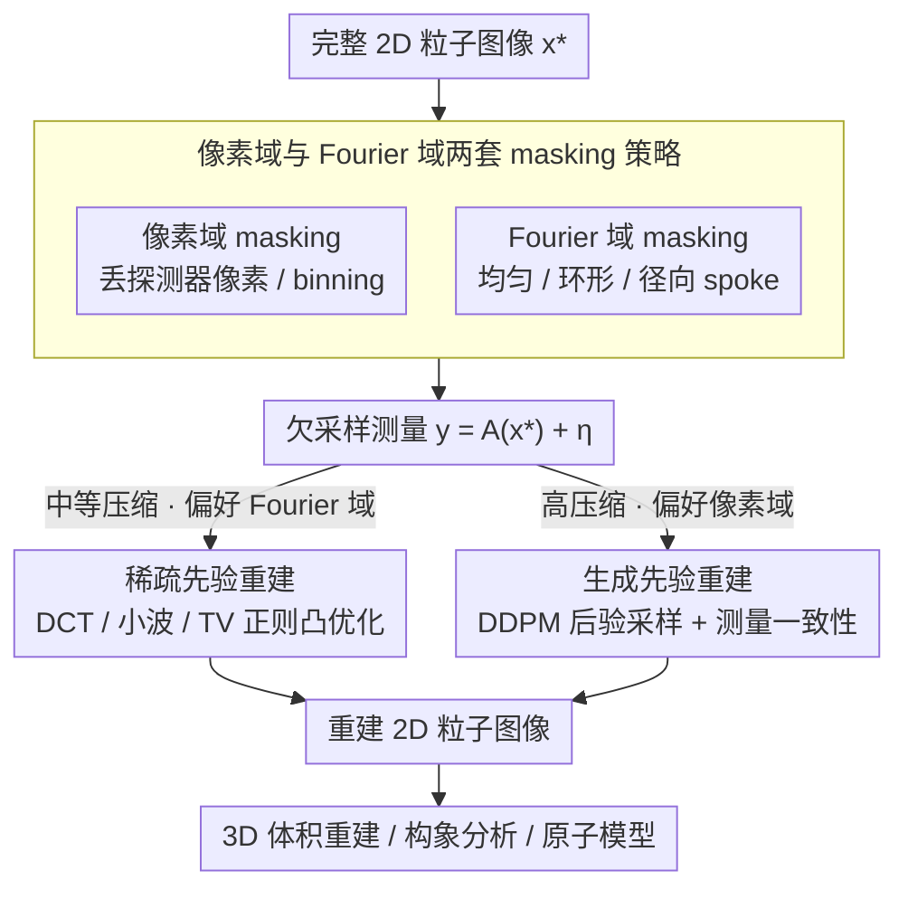

# cryoSENSE: Compressive Sensing Enables High-throughput Microscopy with Sparse and Generative Priors on the Protein Cryo-EM Image Manifold

**会议**: CVPR 2026  
**arXiv**: [2511.12931](https://arxiv.org/abs/2511.12931)  
**代码**: [https://cryosense.github.io](https://cryosense.github.io)  
**领域**: 医学图像分析 / 冷冻电镜  
**关键词**: 冷冻电镜, 压缩感知, 扩散模型, 稀疏先验, 高通量显微镜

## 一句话总结
提出 cryoSENSE，首个冷冻电镜压缩成像的计算框架，证明蛋白质 cryo-EM 图像在稀疏先验（DCT/小波/TV）和生成先验（扩散模型）下均可从欠采样测量中高保真重建，在保持 3D 分辨率的同时实现最高 2.5× 通量提升。

## 研究背景与动机

**领域现状**：Cryo-EM 是结构生物学的核心工具，但现代直接电子探测器每秒产生数 GB 数据，远超存储和传输带宽。当前缓解策略包括：(1) 亚帧求和、(2) 缩短采集时间后闲置传输、(3) 后置压缩——均未解决实时带宽瓶颈。

**现有痛点**：数据洪水限制了实际通量——设备大部分时间在等待数据传输而非在采集。亚帧求和牺牲时间分辨率，后置压缩不减轻实时带宽。

**核心矛盾**：Cryo-EM 原始图像数据高度结构化（蛋白质图像位于低维流形上），但现有工作流程以全分辨率采集和传输，浪费了数据中的冗余。

**本文要解决**：能否在采集阶段就做压缩感知，从欠采样测量中重建高保真 2D 粒子图像，进而保持 3D 重建分辨率？

**切入角度**：利用 cryo-EM 图像的两种低维结构——(1) 在预定义基下的稀疏性；(2) 位于可用扩散模型学习的低维流形上——设计两种互补的重建策略。

**核心 idea**：稀疏先验 + 生成先验 = 互补的压缩 cryo-EM 成像操作区间。

## 方法详解

### 整体框架
cryoSENSE 把"采集阶段就压缩"形式化成一个标准逆问题：探测器只采到欠采样测量 $\mathbf{y} = \mathcal{A}(\mathbf{x}^*) + \boldsymbol{\eta}$，其中 $\mathcal{A}$ 是已知的线性投影算子（丢掉一部分像素或一部分 Fourier 系数），目标是从 $\mathbf{y}$ 反推回完整的高保真 2D 粒子图像 $\mathbf{x}^*$。整套框架沿两个正交的轴展开：采样在**像素域**还是 **Fourier 域**做、重建用**稀疏先验**还是**生成先验**。论文的核心贡献不是某一条具体算法，而是把这四种组合摆在一起做系统对比，给出"什么压缩率、什么采样域该配什么先验"的操作指南。

### 关键设计

**1. 像素域与 Fourier 域两套 masking 策略：从两个物理上都能实现的接口丢数据**

压缩的前提是有一个真能在硬件上少采数据的接口，否则"采集阶段压缩"只是纸上谈兵。论文给出两条都对应现成显微镜部件的路线：像素域 masking 直接丢掉一部分探测器像素，可以用物理编码孔径或纳米加工图案实现，本质上就是把探测器现成的 binning 功能用足；Fourier 域 masking 则在后焦面上调制，用相位板、全息光栅这类器件挑掉一部分频率系数，并细分成均匀下采样、环形、径向 spoke 三种采样模式。两个域不是冗余备份，而是各自有偏好——后面会看到 Fourier 域采的频率结构天然和稀疏先验合拍，像素域留下的空间结构则更利于生成先验补全，所以这一对接口直接决定了下游该配哪种重建。

**2. 稀疏先验重建：不依赖任何训练数据的凸优化兜底方案**

cryo-EM 原始图像在 DCT、小波这类预定义基下本就高度稀疏，这意味着即使丢掉大半测量，只要约束解在某个基下尽量稀疏，仍能把图像挤回来。具体做法是求解带正则的最小二乘

$$\hat{\mathbf{x}} = \arg\min_{\mathbf{x}} \|\mathcal{A}(\mathbf{x}) - \mathbf{y}\|_2^2 + \lambda \Psi(\mathbf{x}),$$

其中数据保真项逼测量、正则项 $\Psi$ 取 DCT 基稀疏、小波（WT）基稀疏或总变差（TV）三种之一，用近端梯度下降交替走梯度步和近端算子（软阈值）直到收敛。它最大的好处是完全不需要训练数据、对蛋白质类型没有任何先验假设，因此特别适合中等压缩率（$\le 2.5\times$）和 Fourier 域采样——频率域采到的系数刚好喂给基稀疏假设，重建出来的 SSIM 在 Fourier 域反而比像素域更高。

**3. 生成先验重建：用扩散模型学到的图像流形在高压缩率下硬补细节**

当压缩率推到稀疏假设兜不住的程度时，需要更强的先验。论文在 EMPIAR cryo-EM 数据上训练一个 DDPM，让它学会"真实蛋白质图像长什么样"这个低维流形，重建时在逆扩散的每一步注入测量一致性梯度，把采样轨迹拉向既像真实图像、又对得上 $\mathbf{y}$ 的方向。这一步用 Tweedie 公式把含噪状态 $\mathbf{x}_t$ 映到干净估计 $\hat{\mathbf{x}}_0$，再对数据项求导得到引导项

$$\nabla_{\mathbf{x}_t} \log p(\mathbf{y}|\mathbf{x}_t) \simeq -\frac{1}{\sigma^2} \nabla_{\mathbf{x}_t} \|\mathcal{A}(\hat{\mathbf{x}}_0) - \mathbf{y}\|_2^2,$$

并用 Nesterov 加速梯度提高采样效率。比起稀疏先验"图像在某基下稀疏"这条相对弱的假设，生成先验直接背下了数据流形的形状，假设更强、信息也更多，因此在更高压缩率和像素域采样这种"留下空间结构、丢掉规则频率"的场景下明显占优——像素域留下的局部结构正好让扩散模型有支点去幻想出合理的细节。

### 损失函数 / 训练策略
- 稀疏重建：纯优化，不需要训练，只调正则权重 $\lambda$ 和近端迭代步数。
- DDPM 训练：在 EMPIAR cryo-EM 数据上用标准 score matching 训练无条件扩散模型。
- 后验采样：把无条件 score 和上面的测量一致性梯度叠加，逐步去噪得到重建。

## 实验关键数据

### 主实验——2D 重建质量

**像素域 Masking (K=4, C≈2)：**

| 先验 | LPIPS↓ | SSIM↑ |
|------|--------|-------|
| Sparse-DCT | 0.11 | 0.59 |
| Sparse-WT | 0.13 | 0.59 |
| Sparse-TV | 0.20 | 0.64 |
| **Gen-DDPM** | **0.12** | 0.50 |

**Fourier 域 Masking (Radial spoke, C≈2.5)：**

| 先验 | LPIPS↓ | SSIM↑ |
|------|--------|-------|
| **Sparse-DCT** | **0.12** | **0.72** |
| Sparse-WT | 0.11 | 0.71 |
| Sparse-TV | 0.30 | 0.37 |
| Gen-DDPM | 0.11 | 0.63 |

### 3D 体积重建

| 压缩因子 | 像素域最佳先验 | Fourier 域最佳先验 | 3D FSC 分辨率保持 |
|---------|------------|---------------|----------------|
| 1.5× | Gen-DDPM | Sparse-DCT | 近完美 |
| 2.5× | - | Sparse-DCT | 保持 |
| >2.5× | 退化 | 退化 | 降低 |

### 消融实验 / 关键比较

| 特性 | 稀疏先验 | 生成先验 |
|------|---------|---------|
| 最佳采样域 | **Fourier 域** | **像素域** |
| 最佳压缩范围 | 中等 (≤2.5×) | 更高 (适合极端下采样) |
| 是否需要训练 | 否 | 是 |
| 生物学信号保持 | ✓ | ✓ |

### 关键发现
- **核心发现**：稀疏先验偏好 Fourier 域采样+中等压缩，生成先验偏好像素域采样+高压缩——两者互补
- 在 2.5× 压缩因子下 Fourier 域稀疏重建仍保持近完美 FSC 分辨率
- CryoDRGN 构象异质性分析在重建图像上保持 80-88% 聚类一致性
- ModelAngelo 原子模型构建在重建图像上的骨架 RMSD 仅为 2.1-2.3 Å

## 亮点与洞察
- **硬件-软件协同设计**：不是后置压缩，而是前置压缩感知——从数据产生源头解决带宽瓶颈
- **互补先验框架**：统一评估了两大类先验在两种采样方案下的表现，给出了明确的操作指南
- **生物学下游验证**：不仅关注 2D 重建质量，还验证了 3D 重建、构象分析、原子模型构建等核心生物学任务
- **可实现性**：Fourier 域 masking 可通过现有相位板技术实现，像素域 binning 已是探测器标配功能

## 局限与展望
- 目前是计算验证而非实际硬件实验
- DDPM 训练需要已有 cryo-EM 数据集，不适合全新类型的蛋白质
- 极高压缩率 (>2.5×) 下所有方法都退化
- 未探索自适应采样策略（根据图像内容动态调整 masking 模式）

## 相关工作与启发
- 压缩感知在 MRI（CS-MRI）中已有成熟应用，本文将其推广到 cryo-EM
- 4D-STEM 的压缩感知工作提供了电子显微镜领域的先例
- DDPM 后验采样的框架（DPS、DDRM）被有效适配到 cryo-EM 场景

## 评分
- 新颖性: ⭐⭐⭐⭐⭐ 首个 cryo-EM 压缩感知框架，开辟全新研究方向
- 实验充分度: ⭐⭐⭐⭐⭐ 极其详尽——多种先验×多种采样×多种压缩率×下游生物学验证
- 写作质量: ⭐⭐⭐⭐⭐ 理论推导清晰，实验设计系统
- 价值: ⭐⭐⭐⭐⭐ 对 cryo-EM 高通量成像有变革性潜力

<!-- RELATED:START -->

## 相关论文

- [\[CVPR 2026\] CryoHype: Reconstructing a Thousand Cryo-EM Structures with Transformer-Based Hypernetworks](cryohype_reconstructing_a_thousand_cryo-em_structures_with_transformer-based_hyp.md)
- [\[NeurIPS 2025\] Multiscale Guidance of Protein Structure Prediction with Heterogeneous Cryo-EM Data](../../NeurIPS2025/computational_biology/multiscale_guidance_of_protein_structure_prediction_with_heterogeneous_cryo-em_d.md)
- [\[ICML 2025\] DeepSeq: High-Throughput Single-Cell RNA Sequencing Data Labeling via Web Search-Augmented Agentic Generative AI Foundation Models](../../ICML2025/computational_biology/deepseq_high-throughput_single-cell_rna_sequencing_data_labeling_via_web_search-.md)
- [\[ICCV 2025\] Integrating Biological Knowledge for Robust Microscopy Image Profiling on De Novo Cell Lines](../../ICCV2025/computational_biology/integrating_biological_knowledge_for_robust_microscopy_image_profiling_on_de_nov.md)
- [\[ICCV 2025\] CryoFastAR: Fast Cryo-EM Ab initio Reconstruction Made Easy](../../ICCV2025/computational_biology/cryofastar_fast_cryoem_ab_initio_reconstruction_made_easy.md)

<!-- RELATED:END -->
