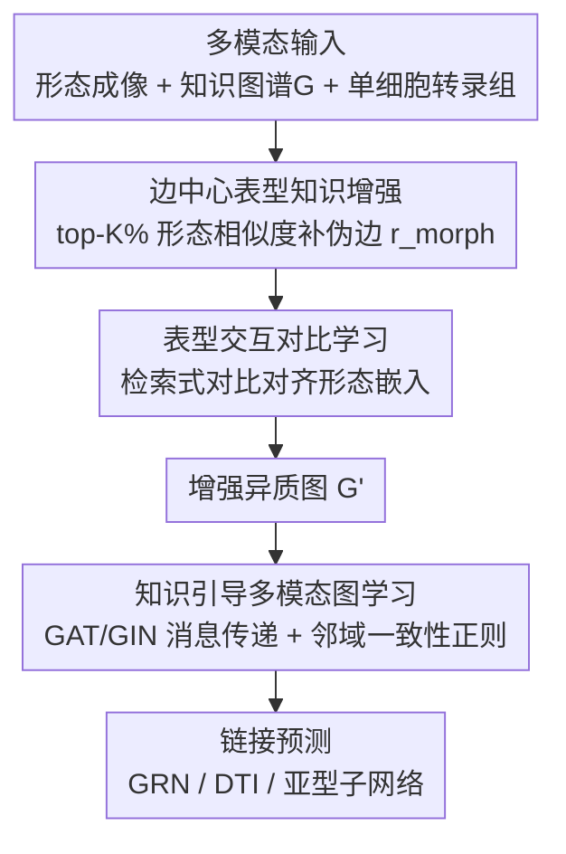

# Deciphering Genotype-Phenotype Mechanisms from High-Content Profiling via Knowledge-Guided Multi-modal Graph Learning

**会议**: CVPR 2026  
**论文**: [CVF Open Access](https://openaccess.thecvf.com/content/CVPR2026/html/Lin_Deciphering_Genotype-Phenotype_Mechanisms_from_High-Content_Profiling_via_Knowledge-Guided_Multi-modal_Graph_CVPR_2026_paper.html)  
**代码**: 论文未公开  
**领域**: 计算生物 / 多模态图学习  
**关键词**: 基因型-表型, 高内涵成像, 知识图谱, 边中心增强, 异质图神经网络

## 一句话总结
KERNEL 把高内涵细胞形态成像当作"关系证据"而非节点特征，用形态相似度在生物知识图谱上动态增补"伪边"并赋可学习置信度，再用知识引导的异质图学习做基因调控网络（GRN）推断、药物-靶点（DTI）预测和疾病亚型子网络发现，GRN 上 AUPR 最高提升 38.1%。

## 研究背景与动机
**领域现状**：理解基因型→表型的映射是精准医学和药物发现的核心。高内涵表型组学（如 Cell Painting 细胞染色）能在全细胞尺度提供海量、无偏的形态读数，反映多种分子和调控过程叠加的细胞响应；与此同时，STRING、PrimeKG 等结构化生物知识图谱提供了基因、通路、表型之间的显式关系框架。把两者结合起来，理应能为基因调控、药物作用等机制提供细胞尺度的证据。

**现有痛点**：高内涵表型数据是高维、异质、且噪声极大的，直接用很难提取有用信号。更关键的是，主流整合方法（如 MOTIVE、PolyGene、KGDRP）都采用**节点中心（node-centric）**视角：把基因当节点、把表型/知识塞进**节点特征**里。这样做一方面引入大量噪声、缺乏筛选与排序关键生物信号的机制，另一方面得到的子图模式可解释性弱，也无法纳入细胞层面的生物语境。

**核心矛盾**：表型信号的本质被用错了地方。作者指出，表型数据主要传递的是**细胞尺度的关系信号**——即"某个扰动如何重塑分子之间的相互作用"，而不是某个分子自身的属性。把这种关系信号硬塞进节点特征，等于丢掉了它最有价值的"关系"维度。

**本文目标**：设计一个框架，能把噪声表型形态信号转化为知识图谱上的**边**，用可学习置信度筛掉噪声、对齐机制通路，并支撑 GRN 推断、DTI 预测、亚型子网络发现三类任务。

**切入角度**：作者假设——功能相关的分子（如转录因子和它的靶基因、药物和它的蛋白靶点）在受扰动时往往会诱导出**相关的细胞形态**。因此形态相似度本身就是一种关系证据，可以用来在图上"补边"。

**核心 idea**：用**边中心（edge-centric）**的表型知识增强替代节点中心的特征拼接——从形态嵌入相似度里动态挖出任务相关的边、显式学习每条边的置信度，再用知识引导图学习把图拓扑对齐到机制通路。

## 方法详解

### 整体框架
KERNEL 输入三种模态：高内涵形态成像知识（ViT 编码的细胞图像形态嵌入）、基因型知识图谱（从 STRING / PrimeKG 构建的分子异质图 $G$）、单细胞转录组知识；输出是分子对之间的交互预测（链接预测），可落到 GRN、DTI、亚型子网络三类下游任务。

整条流水线分两大模块串行。**第一步是"边中心表型知识增强"**：对图 $G$ 中每个分子节点，按形态嵌入余弦相似度取 top-K% 最相似的异型节点，连成一种新的关系 $r_{morph}$ 的"伪边"，相似度值作为边权；同时用一个检索式对比学习损失 $\mathcal{L}_{contrast}$ 约束形态嵌入，保证补出来的边确实反映有意义的表型关系，得到增强图 $G'$。**第二步是"知识引导多模态图学习"**：在 $G'$ 上做关系特定的消息传递（不同分子类型分别用 GAT / GIN），把形态相似度作为边权注入传播过程，再叠加一个基于邻域重叠（Jaccard）的结构感知正则 $\mathcal{L}_{sim}$，最后用监督交叉熵 $\mathcal{L}_{sup}$ 做链接预测。

### 关键设计

**1. 边中心表型知识增强：把形态相似度变成带置信度的伪边**

这是全文最核心的一招，直接针对"节点中心视角丢掉关系信号"的痛点。对某分子类型 $s$ 的每个节点 $v_i^s$，计算它的形态嵌入 $m_i$ 与另一类型 $t$ 的每个节点 $v_j^t$ 的余弦相似度，按相似度排序后取 top-K% 最相似的节点集合 $V_{itop}^t$，连成新关系 $r_{morph}$ 的边：$E_{r_{morph}}^s = \{(v_i^s, r_{morph}, v_j^t) \mid v_i^s \in V^s, v_j^t \in V_{itop}^t\}$。对所有有意义的实体对（TF-基因、基因-TF、药物-蛋白、蛋白-药物）都做一遍，余弦相似度直接当边权，最终把原始边集 $E$ 扩成 $E' = E \cup E_{r_{morph}}^s \cup E_{r_{morph}}^t$，得到增强图 $G'$。

为什么有效：它把"功能相关分子会诱导相关形态"这个生物假设，落实成图上可计算、可加权、可学习的边，从而补出表达谱或纯结构方法看不到的基因型-表型调控信号；而 top-K% 加可学习置信度的设计，让模型既能引入新关系又不至于被噪声淹没——消融里去掉这个模块掉点最多，说明它是性能主力。

**2. 表型交互对比学习：用检索式对比保证补出来的边"靠谱"**

光按相似度补边还不够——如果形态嵌入本身没对齐到真实的分子关系，补出来的边就是噪声。作者用一个检索式对比目标来优化形态嵌入：对每个分子类型 $s$ 训练一个 MLP 投影头 $\text{MLP}_s$ 把嵌入映射到共享空间，正样本对 $E_{pos}$ 取自不同类型节点间的**已知连接**，负样本对 $E_{neg}$ 是随机采样的未连接对，损失为
$$\mathcal{L}_{contrast} = \sum_{(v_i^s, v_j^t)\in E_{pos}} S_c(\text{MLP}_s(m_i^s), \text{MLP}_t(m_j^t)) - \sum_{(v_i^s, v_j^t)\in E_{neg}} S_c(\text{MLP}_s(m_i^s), \text{MLP}_t(m_j^t))$$
其中 $S_c$ 是余弦相似度。

这样训练后，已知有关系的分子在形态空间里更靠近，无关的被推开，于是第 1 步按相似度补的边才真正对应有意义的表型关系。它和补边模块是"先对齐、再补边"的配合关系——消融去掉 $\mathcal{L}_{contrast}$ 后 AUPR 和 Hit@500 都下降，印证了对齐对补边质量的重要性。

**3. 知识引导多模态图学习 + 邻域一致性正则：让拓扑对齐机制通路**

在增强图 $G'$ 上，作者用关系特定的消息传递 $f$：源自一类分子（如 TF、药物）的边用 GAT 卷积处理，源自另一类（如基因、蛋白）的边用 GIN 卷积处理；对新增的 $r_{morph}$ 边，把余弦相似度作为边权注入传播，于是形态强度被动态利用，得到更新后的节点嵌入 $H = f(G')$。

为避免嵌入只学到局部关系而丢掉全局结构，作者再加一个**结构感知的邻域一致性正则**：对同类型的节点对 $(v_i^s, v_j^s)$，用它们各自 $t$ 类型出边邻居的 **Jaccard 指数** $S_j$ 衡量结构相似度，$S_j \geq \sigma$ 的为正对 $P$、零重叠的为负对 $N$，损失
$$\mathcal{L}_{sim}^s = \sum_{(i,j)\in P} S_c(h_i^s, h_j^s) - \sum_{(i,j)\in N} S_c(h_i^s, h_j^s)$$
让"共享大量公共邻居"的节点在嵌入空间也靠近。直觉是：共享邻居多的分子往往参与同一机制通路，应该有相近表示。最终训练目标三项合一：$\mathcal{L} = \lambda_1 \mathcal{L}_{contrast} + \lambda_2 \mathcal{L}_{sim} + \mathcal{L}_{sup}$，其中 $\mathcal{L}_{sup} = \frac{1}{N}\sum_i \text{LCE}(y_{ij}, \hat{y}_{ij})$ 是链接预测的监督交叉熵。

### 损失函数 / 训练策略
总损失 $\mathcal{L} = \lambda_1 \mathcal{L}_{contrast} + \lambda_2 \mathcal{L}_{sim} + \mathcal{L}_{sup}$：$\mathcal{L}_{contrast}$ 对齐形态嵌入、$\mathcal{L}_{sim}$ 维持局部结构一致、$\mathcal{L}_{sup}$ 做监督链接预测；$\lambda_1, \lambda_2$ 用网格搜索选。实现基于 PyTorch v1.10.2，单张 NVIDIA 4090，Adam 优化器，学习率 0.0005，结果均为 5 次运行平均。

## 实验关键数据

### 主实验
**GRN 推断**（BEELINE 基准，hESC / hHEP 两种细胞系，TFs+500 / TFs+1000 两种规模，与第二好基线 GENELink 对比）：

| 数据集 | 指标 | KERNEL | GENELink(次优) | 提升 |
|--------|------|--------|----------------|------|
| hESC + 500 genes | AUC / AUPR / Hit@500 | 0.902 / 0.381 / 0.366 | 0.896 / 0.243 / 0.202 | AUPR +56.8% |
| hHEP + 1000 genes | AUC / AUPR / Hit@500 | 0.923 / 0.424 / 0.243 | 0.917 / 0.312 / 0.141 | AUPR +38.1% |

AUC 几乎饱和（仅 +0.6~6%），但 AUPR 和 Hit@500 这类对"top 排名正确率"敏感的指标提升巨大（hESC+1000 上 AUPR 相对提升甚至达 171%），说明 KERNEL 主要赢在更准地把真实调控关系排到前面。

**DTI 预测**（MOTIVE 数据集，基于 JUMP-CP 图像谱，CRISPR / ORF 两个子集，与第二好基线 MOTIVE 对比）：

| 数据集 | 指标 | KERNEL | MOTIVE(次优) | 提升 |
|--------|------|--------|--------------|------|
| CRISPR | AUC / F1 | 0.950 / 0.700 | 0.842 / 0.509 | AUC +12.8% / F1 +37.5% |
| ORF | AUC / F1 / Hit@500 | 0.942 / 0.623 / 0.503 | 0.826 / 0.524 / 0.455 | AUC +14.0% / F1 +18.9% |

MOTIVE 同样用多模态但依赖**静态边定义**，KERNEL 的动态知识引导补边带来明显增益。

### 消融实验
在 GRN 推断任务上逐个去掉核心模块（⚠️ 论文以柱状图 Fig.5(a-b) 给出，下表为方向性结论，未给精确数值）：

| 配置 | 关键指标(AUC/AUPR/Hit@500) | 说明 |
|------|----------------------------|------|
| KERNEL (Full) | 最优 | 完整模型 |
| w/o $r_{morph}$（知识引导补边） | 掉点最多 | 去掉动态表型补边，性能下降最大，是性能主力 |
| w/o $\mathcal{L}_{contrast}$（形态对齐） | AUPR/Hit@500 下降 | 形态嵌入未对齐，补边质量变差 |
| w/o $\mathcal{L}_{sim}$（邻域一致性） | AUPR/Hit@500 下降 | 丢失局部结构一致性，最相关调控关系恢复变差 |

### 关键发现
- **补边模块是性能主力**：去掉知识引导图增强（$r_{morph}$）掉点最多，证实"把表型当关系信号补成边"这一核心假设的有效性。
- **缺模态依然稳健**：hESC(TFs+500) 测试集里只有 39.3% 的链接有完整图像；性能随缺失程度单调下降，但即便**所有形态图像全缺**，KERNEL 在 AUPR 上仍超过 GENELink，归功于边中心去噪和知识门控。
- **冷启动有效**：在 ORF 药物冷启动设置下（药物训练时完全未见），KERNEL 仍明显领先所有基线（AUC 0.811 / F1 0.407 / Hit@500 0.155 vs MOTIVE 0.715 / 0.283 / 0.108），形态谱提供了对新实体的归纳偏置。
- **超参敏感且有最优区间**：top-K% 边数 $K$ 和阈值 $\sigma$ 都在中间值时性能最佳——太少欠利用表型信息，太多引入噪声，印证"在信息量与噪声间做选择性整合"的必要性。
- **子网络更具生物意义**：BRCA 案例中，KERNEL 识别的亚型子网络结构差异更大（GED 0.659 vs GeSubNet 0.285）、全局相似度更低（DCS 0.074 vs 0.119）、覆盖更高（CDV 0.251 vs 0.189），且富集到 BRCA 相关通路（如 hsa05225/hsa05224），与 luminal-basal 分型的已知机制吻合。

## 亮点与洞察
- **视角转换是最大的"啊哈"**：把表型从"节点特征"重新定位成"边/关系证据"，是一个简单但深刻的 reframing——它解释了为什么节点中心方法会浪费表型信号，也直接导出了整套补边方案。
- **"先对齐再补边"的配合很巧妙**：对比学习不直接服务于下游预测，而是先把形态空间校准到已知分子关系上，再让相似度补边变得可信，避免了"按未对齐的相似度补边=补噪声"的陷阱。
- **缺模态/冷启动下的鲁棒性可迁移**：用关系证据而非节点属性建模，使模型在图像缺失或实体未见时仍能靠图结构和形态归纳，这个思路对其它"模态经常缺失"的生物多模态任务（如多组学整合）有借鉴价值。
- **关系特定 GAT/GIN 混用**：按分子类型给不同关系选不同 GNN（注意力 vs 同构），是处理异质图的实用 trick。

## 局限与展望
- 作者承认：性能依赖输入数据的质量与完整性，在真实临床场景下模态缺失/噪声会影响表现；需要在更大更多样的队列上进一步验证；学到的"知识边"的可解释性还可加强。
- 自己发现：消融只给了柱状图、未给精确数值，难以定量比较各模块贡献大小；⚠️ 文中多处"提升百分比"是相对第二好基线算的，且 AUC 已接近饱和，AUPR 的大幅相对提升部分源于基线 AUPR 基数本身很低（如 0.24→0.38），横向解读时要注意。
- top-K% 和 $\sigma$ 双超参都需网格搜索且有狭窄最优区间，部署到新数据集时调参成本不低，缺乏自适应选择策略。
- 改进方向：作者提出引入更多生物模态、提升可扩展性与可解释性，并探索精准医学落地。

## 相关工作与启发
- **vs MOTIVE**：MOTIVE 把表型当节点特征塞进网络、用**静态边**定义交互；KERNEL 把表型变成**动态可学习的边**并带置信度，在 DTI 上 CRISPR AUC +12.8%、F1 +37.5%。
- **vs GENELink / GCLink**：二者在已知调控边 + scRNA-seq 上做图学习，但**不用表型成像也不用外部知识图谱**；KERNEL 通过形态补边挖出表达谱看不到的调控信号，GRN AUPR 最高 +38.1%。
- **vs PolyGene / KGDRP**：PolyGene 用注意力把表达值与表型/知识做节点级融合，KGDRP 直接把多模态生物数据并进异质图——都偏向"丰富节点表示"；KERNEL 把信息融合的中心放到**边**上，做更细粒度的关系建模。
- **vs GeSubNet**：在亚型子网络发现上，KERNEL 借动态多模态表型整合产出差异更大、更贴合疾病通路的亚型特异子网络。

## 评分
- 新颖性: ⭐⭐⭐⭐⭐ "表型=关系证据"的边中心 reframing 简洁深刻，区别于一众节点中心方法
- 实验充分度: ⭐⭐⭐⭐ 覆盖 GRN/DTI/子网络三任务 + 缺模态/冷启动/敏感性分析，但消融只给图未给精确数值
- 写作质量: ⭐⭐⭐⭐ 动机与方法逻辑清晰、公式完整；部分图表数值需对照原文
- 价值: ⭐⭐⭐⭐⭐ 为高内涵成像 × 生物知识图谱提供了可迁移的统一框架，对药物发现与精准医学有实用价值

<!-- RELATED:START -->

## 相关论文

- [\[CVPR 2026\] Cross-Slice Knowledge Transfer via Masked Multi-Modal Heterogeneous Graph Contrastive Learning for Spatial Gene Expression Inference](cross-slice_knowledge_transfer_via_masked_multi-modal_heterogeneous_graph_contra.md)
- [\[CVPR 2026\] Bulk RNA-seq Guided Multi-modal Detection of Anomalous Regions in Human Cancer via Spatial Transcriptomics](bulk_rna-seq_guided_multi-modal_detection_of_anomalous_regions_in_human_cancer_v.md)
- [\[CVPR 2026\] Predicting Spatial Transcriptomics from Histology Images via High-Order Multi-Cell Interaction Modeling](predicting_spatial_transcriptomics_from_histology_images_via_high-order_multi-ce.md)
- [\[ICCV 2025\] G2PDiffusion: Cross-Species Genotype-to-Phenotype Prediction via Evolutionary Diffusion](../../ICCV2025/computational_biology/g2pdiffusion_cross-species_genotype-to-phenotype_prediction_via_evolutionary_dif.md)
- [\[ICML 2026\] Learning Protein Structure-Function Relationships through Knowledge-guided Representation Decomposition](../../ICML2026/computational_biology/learning_protein_structure-function_relationships_through_knowledge-guided_repre.md)

<!-- RELATED:END -->
